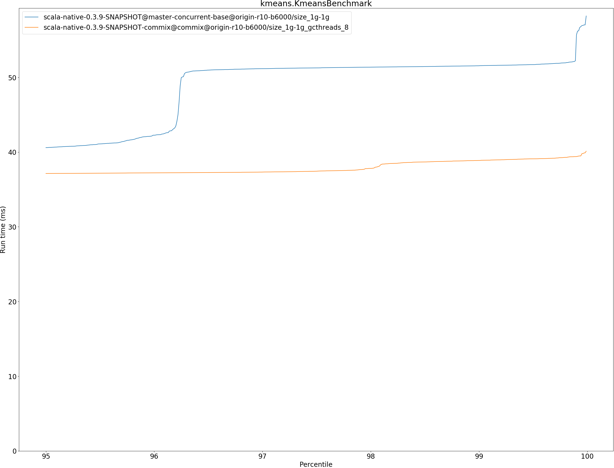
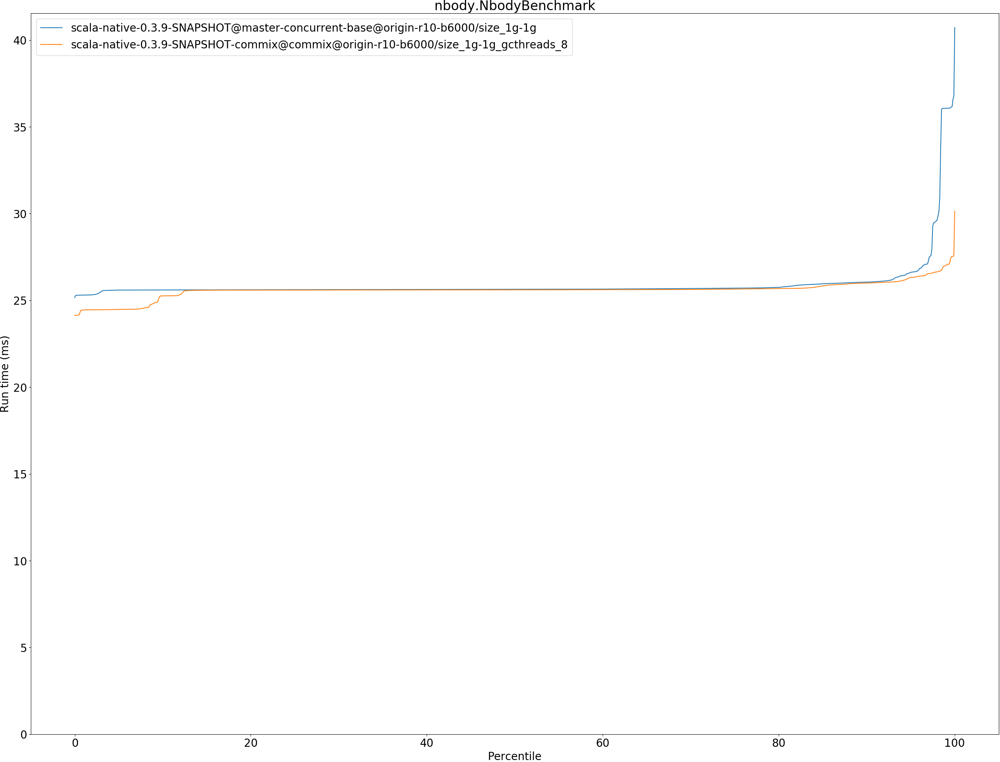
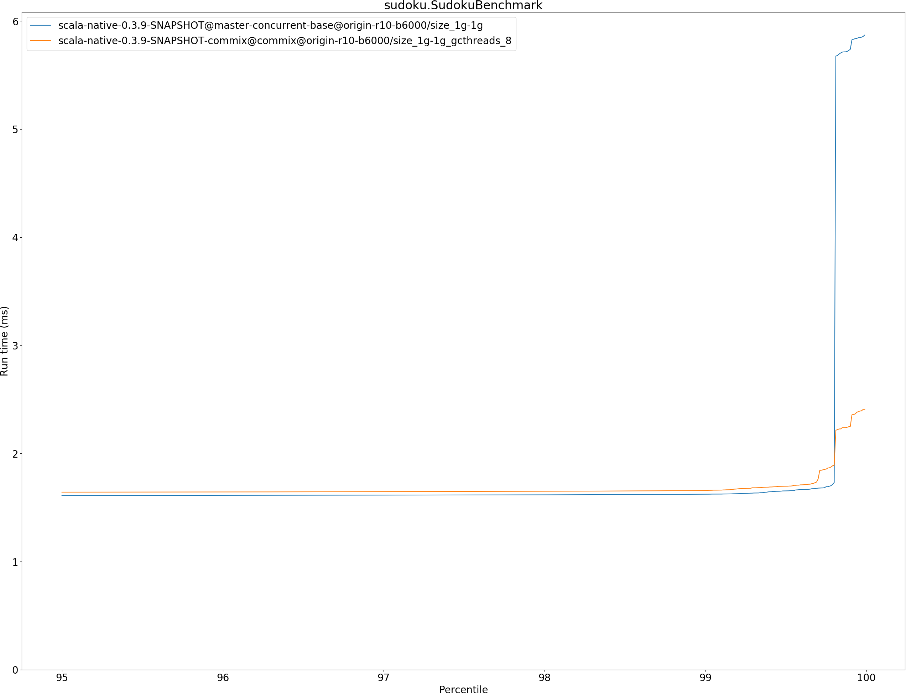

# Summary
## Benchmark run time (ms) at 50 percentile 

|name | scala-native-0.3.9-SNAPSHOT@master-concurrent-base@origin-r10-b6000/size_1g-1g | scala-native-0.3.9-SNAPSHOT-commix@commix@origin-r10-b6000/size_1g-1g_gcthreads_8 | |
| -- | -- | -- | -- |
|[bounce.BounceBenchmark](#bouncebouncebenchmark)|0.0420|0.0386|__-8.04%__|
|[brainfuck.BrainfuckBenchmark](#brainfuckbrainfuckbenchmark)|2.3614|2.3057|__-2.36%__|
|[cd.CDBenchmark](#cdcdbenchmark)|17.0486|16.4923|__-3.26%__|
|[deltablue.DeltaBlueBenchmark](#deltabluedeltabluebenchmark)|0.1748|0.1845|+5.56%|
|[gcbench.GCBenchBenchmark](#gcbenchgcbenchbenchmark)|64.6041|62.3635|__-3.47%__|
|[json.JsonBenchmark](#jsonjsonbenchmark)|0.9365|0.9386|+0.23%|
|[kmeans.KmeansBenchmark](#kmeanskmeansbenchmark)|34.9787|36.4274|+4.14%|
|[mandelbrot.MandelbrotBenchmark](#mandelbrotmandelbrotbenchmark)|100.7237|100.7524|+0.03%|
|[nbody.NbodyBenchmark](#nbodynbodybenchmark)|25.6357|25.6027|__-0.13%__|
|[permute.PermuteBenchmark](#permutepermutebenchmark)|0.1441|0.1367|__-5.10%__|
|[queens.QueensBenchmark](#queensqueensbenchmark)|0.0509|0.0505|__-0.76%__|
|[richards.RichardsBenchmark](#richardsrichardsbenchmark)|0.0592|0.0596|+0.66%|
|[sudoku.SudokuBenchmark](#sudokusudokubenchmark)|1.5769|1.6190|+2.67%|
|[tracer.TracerBenchmark](#tracertracerbenchmark)|0.4901|0.4945|+0.90%|
| __Geometrical mean:__|| |__-0.70%__|
## Benchmark run time (ms) at 90 percentile 

|name | scala-native-0.3.9-SNAPSHOT@master-concurrent-base@origin-r10-b6000/size_1g-1g | scala-native-0.3.9-SNAPSHOT-commix@commix@origin-r10-b6000/size_1g-1g_gcthreads_8 | |
| -- | -- | -- | -- |
|[bounce.BounceBenchmark](#bouncebouncebenchmark)|0.0439|0.0396|__-9.89%__|
|[brainfuck.BrainfuckBenchmark](#brainfuckbrainfuckbenchmark)|2.3810|2.4420|+2.56%|
|[cd.CDBenchmark](#cdcdbenchmark)|17.1607|16.6590|__-2.92%__|
|[deltablue.DeltaBlueBenchmark](#deltabluedeltabluebenchmark)|0.1830|0.1875|+2.43%|
|[gcbench.GCBenchBenchmark](#gcbenchgcbenchbenchmark)|68.1319|65.1921|__-4.31%__|
|[json.JsonBenchmark](#jsonjsonbenchmark)|0.9449|1.0048|+6.34%|
|[kmeans.KmeansBenchmark](#kmeanskmeansbenchmark)|36.6192|36.9414|+0.88%|
|[mandelbrot.MandelbrotBenchmark](#mandelbrotmandelbrotbenchmark)|100.7994|100.8269|+0.03%|
|[nbody.NbodyBenchmark](#nbodynbodybenchmark)|26.0484|25.9949|__-0.21%__|
|[permute.PermuteBenchmark](#permutepermutebenchmark)|0.1461|0.1427|__-2.32%__|
|[queens.QueensBenchmark](#queensqueensbenchmark)|0.0531|0.0518|__-2.42%__|
|[richards.RichardsBenchmark](#richardsrichardsbenchmark)|0.0618|0.0642|+3.95%|
|[sudoku.SudokuBenchmark](#sudokusudokubenchmark)|1.6057|1.6356|+1.86%|
|[tracer.TracerBenchmark](#tracertracerbenchmark)|0.4959|0.5028|+1.39%|
| __Geometrical mean:__|| |__-0.26%__|
## Benchmark run time (ms) at 99 percentile 

|name | scala-native-0.3.9-SNAPSHOT@master-concurrent-base@origin-r10-b6000/size_1g-1g | scala-native-0.3.9-SNAPSHOT-commix@commix@origin-r10-b6000/size_1g-1g_gcthreads_8 | |
| -- | -- | -- | -- |
|[bounce.BounceBenchmark](#bouncebouncebenchmark)|0.0455|0.0415|__-8.82%__|
|[brainfuck.BrainfuckBenchmark](#brainfuckbrainfuckbenchmark)|2.4431|2.4914|+1.98%|
|[cd.CDBenchmark](#cdcdbenchmark)|21.1836|21.7728|+2.78%|
|[deltablue.DeltaBlueBenchmark](#deltabluedeltabluebenchmark)|0.1862|0.1925|+3.38%|
|[gcbench.GCBenchBenchmark](#gcbenchgcbenchbenchmark)|69.0239|65.8519|__-4.60%__|
|[json.JsonBenchmark](#jsonjsonbenchmark)|0.9517|1.0129|+6.43%|
|[kmeans.KmeansBenchmark](#kmeanskmeansbenchmark)|51.5575|38.8760|__-24.60%__|
|[mandelbrot.MandelbrotBenchmark](#mandelbrotmandelbrotbenchmark)|102.1737|102.1728|__-0.00%__|
|[nbody.NbodyBenchmark](#nbodynbodybenchmark)|36.0640|26.9959|__-25.14%__|
|[permute.PermuteBenchmark](#permutepermutebenchmark)|0.1654|0.1462|__-11.60%__|
|[queens.QueensBenchmark](#queensqueensbenchmark)|0.0550|0.0541|__-1.64%__|
|[richards.RichardsBenchmark](#richardsrichardsbenchmark)|0.0647|0.0675|+4.28%|
|[sudoku.SudokuBenchmark](#sudokusudokubenchmark)|1.6228|1.6574|+2.13%|
|[tracer.TracerBenchmark](#tracertracerbenchmark)|0.5030|0.5334|+6.02%|
| __Geometrical mean:__|| |__-4.11%__|
## Benchmark run time (ms) at 99.9 percentile 

|name | scala-native-0.3.9-SNAPSHOT@master-concurrent-base@origin-r10-b6000/size_1g-1g | scala-native-0.3.9-SNAPSHOT-commix@commix@origin-r10-b6000/size_1g-1g_gcthreads_8 | |
| -- | -- | -- | -- |
|[bounce.BounceBenchmark](#bouncebouncebenchmark)|0.0482|0.0427|__-11.27%__|
|[brainfuck.BrainfuckBenchmark](#brainfuckbrainfuckbenchmark)|6.6825|3.8093|__-43.00%__|
|[cd.CDBenchmark](#cdcdbenchmark)|22.1280|21.8653|__-1.19%__|
|[deltablue.DeltaBlueBenchmark](#deltabluedeltabluebenchmark)|0.2147|0.4085|+90.24%|
|[gcbench.GCBenchBenchmark](#gcbenchgcbenchbenchmark)|77.0825|68.5008|__-11.13%__|
|[json.JsonBenchmark](#jsonjsonbenchmark)|1.0414|1.0222|__-1.85%__|
|[kmeans.KmeansBenchmark](#kmeanskmeansbenchmark)|55.6967|39.4001|__-29.26%__|
|[mandelbrot.MandelbrotBenchmark](#mandelbrotmandelbrotbenchmark)|108.2813|108.3075|+0.02%|
|[nbody.NbodyBenchmark](#nbodynbodybenchmark)|36.7987|27.5895|__-25.03%__|
|[permute.PermuteBenchmark](#permutepermutebenchmark)|0.1686|0.1509|__-10.49%__|
|[queens.QueensBenchmark](#queensqueensbenchmark)|0.0564|0.0558|__-1.05%__|
|[richards.RichardsBenchmark](#richardsrichardsbenchmark)|0.0696|0.0715|+2.73%|
|[sudoku.SudokuBenchmark](#sudokusudokubenchmark)|5.7384|2.2500|__-60.79%__|
|[tracer.TracerBenchmark](#tracertracerbenchmark)|4.4034|1.6948|__-61.51%__|
| __Geometrical mean:__|| |__-18.17%__|
## Benchmark total run time (ms) 

|name | scala-native-0.3.9-SNAPSHOT@master-concurrent-base@origin-r10-b6000/size_1g-1g | scala-native-0.3.9-SNAPSHOT-commix@commix@origin-r10-b6000/size_1g-1g_gcthreads_8 | |
| -- | -- | -- | -- |
|[bounce.BounceBenchmark](#bouncebouncebenchmark)|421.5300|385.9514|__-8.44%__|
|[brainfuck.BrainfuckBenchmark](#brainfuckbrainfuckbenchmark)|23466.3602|23566.2673|+0.43%|
|[cd.CDBenchmark](#cdcdbenchmark)|172848.3065|164114.1348|__-5.05%__|
|[deltablue.DeltaBlueBenchmark](#deltabluedeltabluebenchmark)|1715.5645|1750.4654|+2.03%|
|[gcbench.GCBenchBenchmark](#gcbenchgcbenchbenchmark)|625377.2209|612355.8044|__-2.08%__|
|[json.JsonBenchmark](#jsonjsonbenchmark)|9421.4538|9437.8776|+0.17%|
|[kmeans.KmeansBenchmark](#kmeanskmeansbenchmark)|360863.9548|360854.7748|__-0.00%__|
|[mandelbrot.MandelbrotBenchmark](#mandelbrotmandelbrotbenchmark)|1008028.7358|1008284.8548|+0.03%|
|[nbody.NbodyBenchmark](#nbodynbodybenchmark)|259278.1594|255922.1929|__-1.29%__|
|[permute.PermuteBenchmark](#permutepermutebenchmark)|1448.2309|1382.7543|__-4.52%__|
|[queens.QueensBenchmark](#queensqueensbenchmark)|513.5969|501.8920|__-2.28%__|
|[richards.RichardsBenchmark](#richardsrichardsbenchmark)|591.9231|599.4107|+1.26%|
|[sudoku.SudokuBenchmark](#sudokusudokubenchmark)|15721.5688|16218.6279|+3.16%|
|[tracer.TracerBenchmark](#tracertracerbenchmark)|4982.7117|4984.7635|+0.04%|
| __Geometrical mean:__|| |__-1.23%__|
# Individual benchmarks
## bounce.BounceBenchmark

## brainfuck.BrainfuckBenchmark

## cd.CDBenchmark

## deltablue.DeltaBlueBenchmark

## gcbench.GCBenchBenchmark

## json.JsonBenchmark

## kmeans.KmeansBenchmark

## mandelbrot.MandelbrotBenchmark

## nbody.NbodyBenchmark

## permute.PermuteBenchmark

## queens.QueensBenchmark

## richards.RichardsBenchmark

## sudoku.SudokuBenchmark

## tracer.TracerBenchmark

