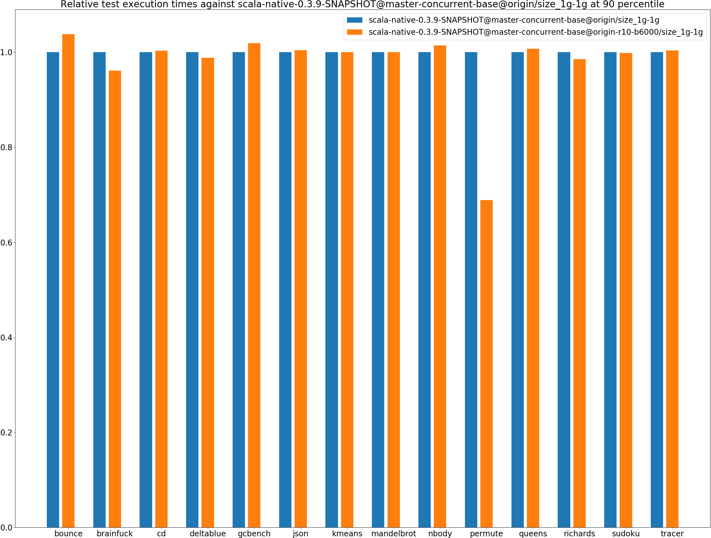
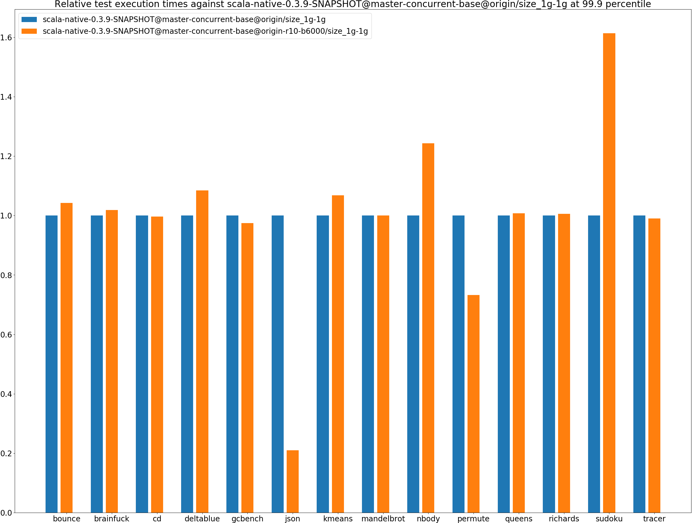
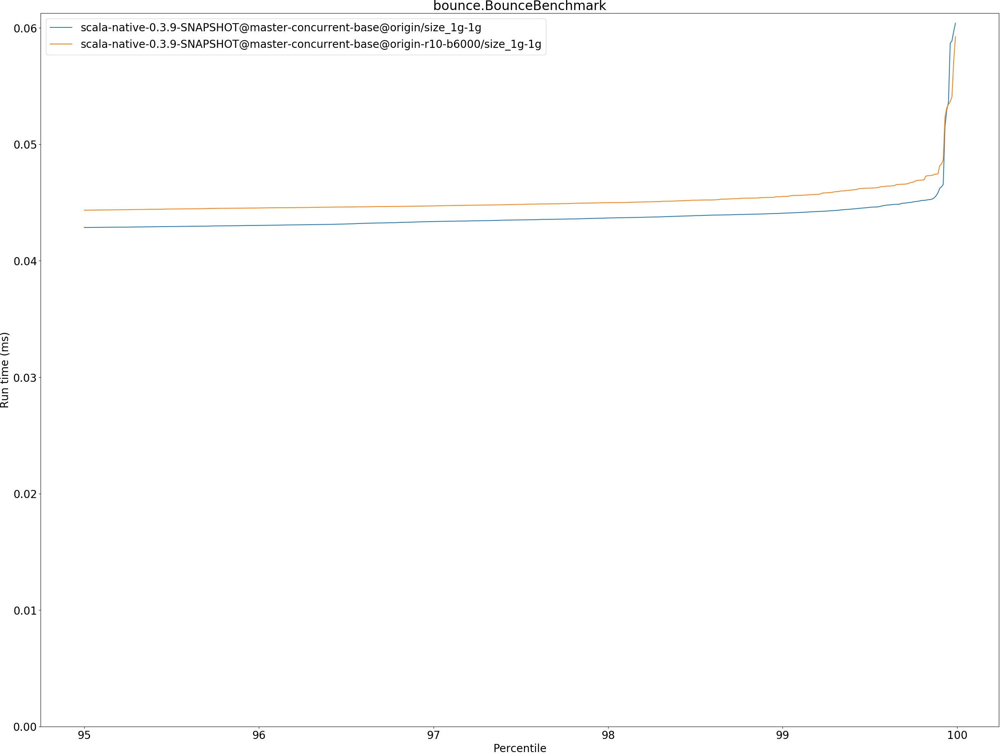
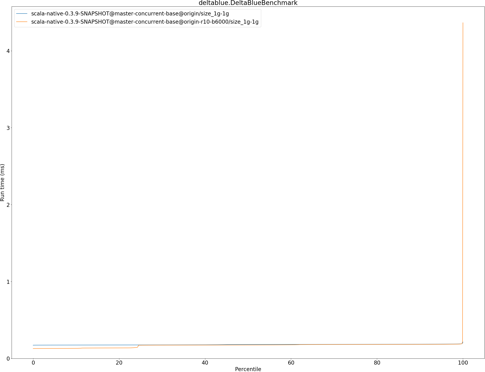

# Summary
## Benchmark run time (ms) at 50 percentile 

|name | scala-native-0.3.9-SNAPSHOT@master-concurrent-base@origin/size_1g-1g | scala-native-0.3.9-SNAPSHOT@master-concurrent-base@origin-r10-b6000/size_1g-1g | |
| -- | -- | -- | -- |
|[bounce.BounceBenchmark](#bouncebouncebenchmark)|0.0410|0.0420|+2.48%|
|[brainfuck.BrainfuckBenchmark](#brainfuckbrainfuckbenchmark)|2.3728|2.3614|__-0.48%__|
|[cd.CDBenchmark](#cdcdbenchmark)|17.0053|17.0486|+0.25%|
|[deltablue.DeltaBlueBenchmark](#deltabluedeltabluebenchmark)|0.1814|0.1748|__-3.65%__|
|[gcbench.GCBenchBenchmark](#gcbenchgcbenchbenchmark)|66.1548|64.6041|__-2.34%__|
|[json.JsonBenchmark](#jsonjsonbenchmark)|0.9358|0.9365|+0.07%|
|[kmeans.KmeansBenchmark](#kmeanskmeansbenchmark)|36.0690|34.9787|__-3.02%__|
|[mandelbrot.MandelbrotBenchmark](#mandelbrotmandelbrotbenchmark)|100.7072|100.7237|+0.02%|
|[nbody.NbodyBenchmark](#nbodynbodybenchmark)|24.5717|25.6357|+4.33%|
|[permute.PermuteBenchmark](#permutepermutebenchmark)|0.2098|0.1441|__-31.32%__|
|[queens.QueensBenchmark](#queensqueensbenchmark)|0.0510|0.0509|__-0.11%__|
|[richards.RichardsBenchmark](#richardsrichardsbenchmark)|0.0603|0.0592|__-1.78%__|
|[sudoku.SudokuBenchmark](#sudokusudokubenchmark)|1.5931|1.5769|__-1.02%__|
|[tracer.TracerBenchmark](#tracertracerbenchmark)|0.4879|0.4901|+0.44%|
| __Geometrical mean:__|| |__-3.00%__|
## Benchmark run time (ms) at 90 percentile 

|name | scala-native-0.3.9-SNAPSHOT@master-concurrent-base@origin/size_1g-1g | scala-native-0.3.9-SNAPSHOT@master-concurrent-base@origin-r10-b6000/size_1g-1g | |
| -- | -- | -- | -- |
|[bounce.BounceBenchmark](#bouncebouncebenchmark)|0.0423|0.0439|+3.77%|
|[brainfuck.BrainfuckBenchmark](#brainfuckbrainfuckbenchmark)|2.4765|2.3810|__-3.85%__|
|[cd.CDBenchmark](#cdcdbenchmark)|17.1122|17.1607|+0.28%|
|[deltablue.DeltaBlueBenchmark](#deltabluedeltabluebenchmark)|0.1852|0.1830|__-1.16%__|
|[gcbench.GCBenchBenchmark](#gcbenchgcbenchbenchmark)|66.8558|68.1319|+1.91%|
|[json.JsonBenchmark](#jsonjsonbenchmark)|0.9407|0.9449|+0.44%|
|[kmeans.KmeansBenchmark](#kmeanskmeansbenchmark)|36.6244|36.6192|__-0.01%__|
|[mandelbrot.MandelbrotBenchmark](#mandelbrotmandelbrotbenchmark)|100.7837|100.7994|+0.02%|
|[nbody.NbodyBenchmark](#nbodynbodybenchmark)|25.6886|26.0484|+1.40%|
|[permute.PermuteBenchmark](#permutepermutebenchmark)|0.2121|0.1461|__-31.12%__|
|[queens.QueensBenchmark](#queensqueensbenchmark)|0.0527|0.0531|+0.73%|
|[richards.RichardsBenchmark](#richardsrichardsbenchmark)|0.0627|0.0618|__-1.47%__|
|[sudoku.SudokuBenchmark](#sudokusudokubenchmark)|1.6082|1.6057|__-0.16%__|
|[tracer.TracerBenchmark](#tracertracerbenchmark)|0.4941|0.4959|+0.37%|
| __Geometrical mean:__|| |__-2.48%__|
## Benchmark run time (ms) at 99 percentile 

|name | scala-native-0.3.9-SNAPSHOT@master-concurrent-base@origin/size_1g-1g | scala-native-0.3.9-SNAPSHOT@master-concurrent-base@origin-r10-b6000/size_1g-1g | |
| -- | -- | -- | -- |
|[bounce.BounceBenchmark](#bouncebouncebenchmark)|0.0441|0.0455|+3.28%|
|[brainfuck.BrainfuckBenchmark](#brainfuckbrainfuckbenchmark)|2.9974|2.4431|__-18.49%__|
|[cd.CDBenchmark](#cdcdbenchmark)|21.9642|21.1836|__-3.55%__|
|[deltablue.DeltaBlueBenchmark](#deltabluedeltabluebenchmark)|0.1883|0.1862|__-1.11%__|
|[gcbench.GCBenchBenchmark](#gcbenchgcbenchbenchmark)|77.4812|69.0239|__-10.92%__|
|[json.JsonBenchmark](#jsonjsonbenchmark)|0.9670|0.9517|__-1.58%__|
|[kmeans.KmeansBenchmark](#kmeanskmeansbenchmark)|49.0999|51.5575|+5.01%|
|[mandelbrot.MandelbrotBenchmark](#mandelbrotmandelbrotbenchmark)|104.3348|102.1737|__-2.07%__|
|[nbody.NbodyBenchmark](#nbodynbodybenchmark)|27.5265|36.0640|+31.02%|
|[permute.PermuteBenchmark](#permutepermutebenchmark)|0.2169|0.1654|__-23.75%__|
|[queens.QueensBenchmark](#queensqueensbenchmark)|0.0544|0.0550|+1.22%|
|[richards.RichardsBenchmark](#richardsrichardsbenchmark)|0.0658|0.0647|__-1.54%__|
|[sudoku.SudokuBenchmark](#sudokusudokubenchmark)|1.6337|1.6228|__-0.67%__|
|[tracer.TracerBenchmark](#tracertracerbenchmark)|0.5023|0.5030|+0.15%|
| __Geometrical mean:__|| |__-2.35%__|
## Benchmark run time (ms) at 99.9 percentile 

|name | scala-native-0.3.9-SNAPSHOT@master-concurrent-base@origin/size_1g-1g | scala-native-0.3.9-SNAPSHOT@master-concurrent-base@origin-r10-b6000/size_1g-1g | |
| -- | -- | -- | -- |
|[bounce.BounceBenchmark](#bouncebouncebenchmark)|0.0462|0.0482|+4.21%|
|[brainfuck.BrainfuckBenchmark](#brainfuckbrainfuckbenchmark)|6.5612|6.6825|+1.85%|
|[cd.CDBenchmark](#cdcdbenchmark)|22.2065|22.1280|__-0.35%__|
|[deltablue.DeltaBlueBenchmark](#deltabluedeltabluebenchmark)|0.1980|0.2147|+8.45%|
|[gcbench.GCBenchBenchmark](#gcbenchgcbenchbenchmark)|79.0555|77.0825|__-2.50%__|
|[json.JsonBenchmark](#jsonjsonbenchmark)|4.9613|1.0414|__-79.01%__|
|[kmeans.KmeansBenchmark](#kmeanskmeansbenchmark)|52.1409|55.6967|+6.82%|
|[mandelbrot.MandelbrotBenchmark](#mandelbrotmandelbrotbenchmark)|108.2594|108.2813|+0.02%|
|[nbody.NbodyBenchmark](#nbodynbodybenchmark)|29.5974|36.7987|+24.33%|
|[permute.PermuteBenchmark](#permutepermutebenchmark)|0.2301|0.1686|__-26.73%__|
|[queens.QueensBenchmark](#queensqueensbenchmark)|0.0560|0.0564|+0.73%|
|[richards.RichardsBenchmark](#richardsrichardsbenchmark)|0.0692|0.0696|+0.58%|
|[sudoku.SudokuBenchmark](#sudokusudokubenchmark)|3.5571|5.7384|+61.32%|
|[tracer.TracerBenchmark](#tracertracerbenchmark)|4.4471|4.4034|__-0.98%__|
| __Geometrical mean:__|| |__-6.86%__|
## Benchmark total run time (ms) 

|name | scala-native-0.3.9-SNAPSHOT@master-concurrent-base@origin/size_1g-1g | scala-native-0.3.9-SNAPSHOT@master-concurrent-base@origin-r10-b6000/size_1g-1g | |
| -- | -- | -- | -- |
|[bounce.BounceBenchmark](#bouncebouncebenchmark)|817.8376|421.5300|__-48.46%__|
|[brainfuck.BrainfuckBenchmark](#brainfuckbrainfuckbenchmark)|48384.6665|23466.3602|__-51.50%__|
|[cd.CDBenchmark](#cdcdbenchmark)|346446.6505|172848.3065|__-50.11%__|
|[deltablue.DeltaBlueBenchmark](#deltabluedeltabluebenchmark)|3597.3118|1715.5645|__-52.31%__|
|[gcbench.GCBenchBenchmark](#gcbenchgcbenchbenchmark)|1259126.9785|625377.2209|__-50.33%__|
|[json.JsonBenchmark](#jsonjsonbenchmark)|18905.6686|9421.4538|__-50.17%__|
|[kmeans.KmeansBenchmark](#kmeanskmeansbenchmark)|720405.6537|360863.9548|__-49.91%__|
|[mandelbrot.MandelbrotBenchmark](#mandelbrotmandelbrotbenchmark)|2015996.6238|1008028.7358|__-50.00%__|
|[nbody.NbodyBenchmark](#nbodynbodybenchmark)|499501.7361|259278.1594|__-48.09%__|
|[permute.PermuteBenchmark](#permutepermutebenchmark)|4201.0063|1448.2309|__-65.53%__|
|[queens.QueensBenchmark](#queensqueensbenchmark)|1026.0478|513.5969|__-49.94%__|
|[richards.RichardsBenchmark](#richardsrichardsbenchmark)|1213.8292|591.9231|__-51.24%__|
|[sudoku.SudokuBenchmark](#sudokusudokubenchmark)|31970.6633|15721.5688|__-50.83%__|
|[tracer.TracerBenchmark](#tracertracerbenchmark)|10002.6828|4982.7117|__-50.19%__|
| __Geometrical mean:__|| |__-51.53%__|
# Individual benchmarks
## bounce.BounceBenchmark

## brainfuck.BrainfuckBenchmark

## cd.CDBenchmark

## deltablue.DeltaBlueBenchmark

## gcbench.GCBenchBenchmark

## json.JsonBenchmark

## kmeans.KmeansBenchmark

## mandelbrot.MandelbrotBenchmark

## nbody.NbodyBenchmark

## permute.PermuteBenchmark

## queens.QueensBenchmark

## richards.RichardsBenchmark

## sudoku.SudokuBenchmark

## tracer.TracerBenchmark

