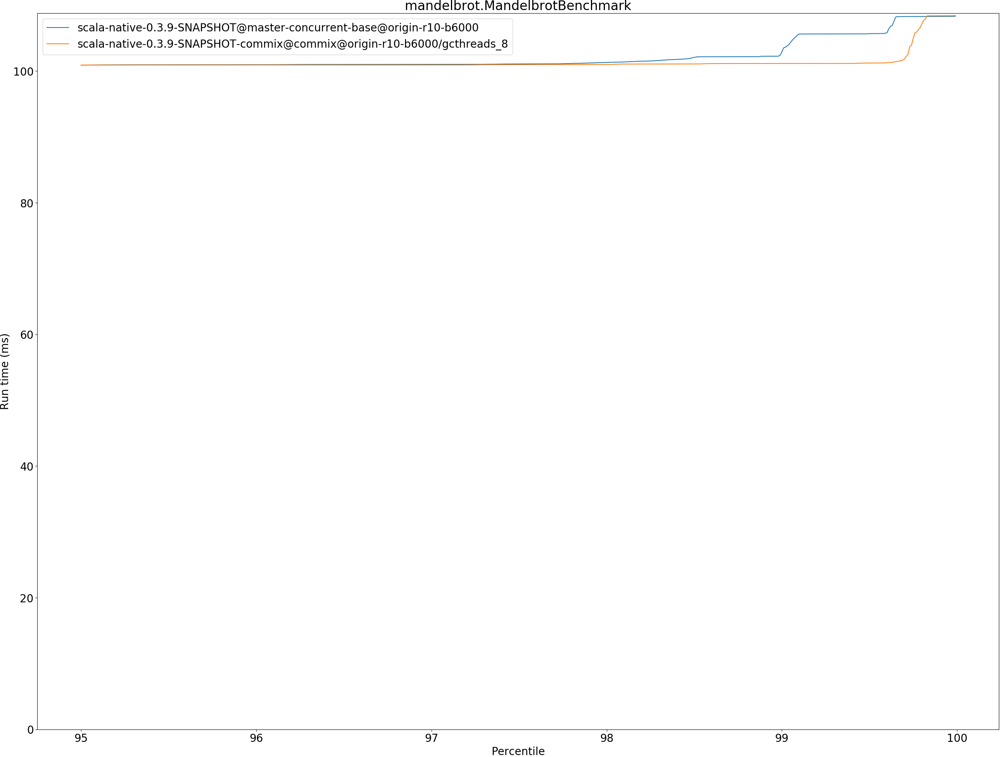

# Summary
## Benchmark run time (ms) at 50 percentile 

|name | scala-native-0.3.9-SNAPSHOT@master-concurrent-base@origin-r10-b6000 | scala-native-0.3.9-SNAPSHOT-commix@commix@origin-r10-b6000/gcthreads_8 | |
| -- | -- | -- | -- |
|[bounce.BounceBenchmark](#bouncebouncebenchmark)|0.0402|0.0366|__-9.04%__|
|[brainfuck.BrainfuckBenchmark](#brainfuckbrainfuckbenchmark)|2.4395|2.5005|+2.50%|
|[cd.CDBenchmark](#cdcdbenchmark)|17.3676|16.8950|__-2.72%__|
|[deltablue.DeltaBlueBenchmark](#deltabluedeltabluebenchmark)|0.1351|0.1399|+3.59%|
|[gcbench.GCBenchBenchmark](#gcbenchgcbenchbenchmark)|73.4457|60.0659|__-18.22%__|
|[json.JsonBenchmark](#jsonjsonbenchmark)|0.9421|0.9801|+4.03%|
|[kmeans.KmeansBenchmark](#kmeanskmeansbenchmark)|37.2714|36.6477|__-1.67%__|
|[mandelbrot.MandelbrotBenchmark](#mandelbrotmandelbrotbenchmark)|100.7231|100.8254|+0.10%|
|[nbody.NbodyBenchmark](#nbodynbodybenchmark)|25.6601|25.6548|__-0.02%__|
|[permute.PermuteBenchmark](#permutepermutebenchmark)|0.1438|0.1416|__-1.58%__|
|[queens.QueensBenchmark](#queensqueensbenchmark)|0.0478|0.0478|__-0.10%__|
|[richards.RichardsBenchmark](#richardsrichardsbenchmark)|0.0553|0.0548|__-0.77%__|
|[sudoku.SudokuBenchmark](#sudokusudokubenchmark)|1.5897|1.6247|+2.20%|
|[tracer.TracerBenchmark](#tracertracerbenchmark)|0.4758|0.4863|+2.21%|
| __Geometrical mean:__|| |__-1.57%__|
## Benchmark run time (ms) at 90 percentile 

|name | scala-native-0.3.9-SNAPSHOT@master-concurrent-base@origin-r10-b6000 | scala-native-0.3.9-SNAPSHOT-commix@commix@origin-r10-b6000/gcthreads_8 | |
| -- | -- | -- | -- |
|[bounce.BounceBenchmark](#bouncebouncebenchmark)|0.0471|0.0371|__-21.27%__|
|[brainfuck.BrainfuckBenchmark](#brainfuckbrainfuckbenchmark)|2.4762|2.5750|+3.99%|
|[cd.CDBenchmark](#cdcdbenchmark)|17.4874|17.0069|__-2.75%__|
|[deltablue.DeltaBlueBenchmark](#deltabluedeltabluebenchmark)|0.1378|0.1439|+4.43%|
|[gcbench.GCBenchBenchmark](#gcbenchgcbenchbenchmark)|74.8640|63.5007|__-15.18%__|
|[json.JsonBenchmark](#jsonjsonbenchmark)|0.9864|0.9863|__-0.01%__|
|[kmeans.KmeansBenchmark](#kmeanskmeansbenchmark)|39.2340|38.2389|__-2.54%__|
|[mandelbrot.MandelbrotBenchmark](#mandelbrotmandelbrotbenchmark)|100.7993|100.9025|+0.10%|
|[nbody.NbodyBenchmark](#nbodynbodybenchmark)|26.0311|26.0686|+0.14%|
|[permute.PermuteBenchmark](#permutepermutebenchmark)|0.1472|0.1466|__-0.37%__|
|[queens.QueensBenchmark](#queensqueensbenchmark)|0.0481|0.0482|+0.14%|
|[richards.RichardsBenchmark](#richardsrichardsbenchmark)|0.0566|0.0560|__-1.01%__|
|[sudoku.SudokuBenchmark](#sudokusudokubenchmark)|1.7011|1.8101|+6.41%|
|[tracer.TracerBenchmark](#tracertracerbenchmark)|0.4804|0.5226|+8.79%|
| __Geometrical mean:__|| |__-1.69%__|
## Benchmark run time (ms) at 99 percentile 

|name | scala-native-0.3.9-SNAPSHOT@master-concurrent-base@origin-r10-b6000 | scala-native-0.3.9-SNAPSHOT-commix@commix@origin-r10-b6000/gcthreads_8 | |
| -- | -- | -- | -- |
|[bounce.BounceBenchmark](#bouncebouncebenchmark)|0.0474|0.0379|__-19.99%__|
|[brainfuck.BrainfuckBenchmark](#brainfuckbrainfuckbenchmark)|2.9186|2.6124|__-10.49%__|
|[cd.CDBenchmark](#cdcdbenchmark)|22.5451|17.1740|__-23.82%__|
|[deltablue.DeltaBlueBenchmark](#deltabluedeltabluebenchmark)|0.1811|0.1819|+0.44%|
|[gcbench.GCBenchBenchmark](#gcbenchgcbenchbenchmark)|87.2342|64.9304|__-25.57%__|
|[json.JsonBenchmark](#jsonjsonbenchmark)|1.1179|1.2313|+10.14%|
|[kmeans.KmeansBenchmark](#kmeanskmeansbenchmark)|53.7878|38.8220|__-27.82%__|
|[mandelbrot.MandelbrotBenchmark](#mandelbrotmandelbrotbenchmark)|102.8757|101.1400|__-1.69%__|
|[nbody.NbodyBenchmark](#nbodynbodybenchmark)|27.1284|27.4015|+1.01%|
|[permute.PermuteBenchmark](#permutepermutebenchmark)|0.1658|0.1564|__-5.67%__|
|[queens.QueensBenchmark](#queensqueensbenchmark)|0.0505|0.0504|__-0.11%__|
|[richards.RichardsBenchmark](#richardsrichardsbenchmark)|0.0615|0.0608|__-1.23%__|
|[sudoku.SudokuBenchmark](#sudokusudokubenchmark)|1.7194|2.1477|+24.91%|
|[tracer.TracerBenchmark](#tracertracerbenchmark)|0.4844|0.5864|+21.06%|
| __Geometrical mean:__|| |__-5.50%__|
## Benchmark run time (ms) at 99.9 percentile 

|name | scala-native-0.3.9-SNAPSHOT@master-concurrent-base@origin-r10-b6000 | scala-native-0.3.9-SNAPSHOT-commix@commix@origin-r10-b6000/gcthreads_8 | |
| -- | -- | -- | -- |
|[bounce.BounceBenchmark](#bouncebouncebenchmark)|0.0582|0.0468|__-19.57%__|
|[brainfuck.BrainfuckBenchmark](#brainfuckbrainfuckbenchmark)|3.0866|2.6917|__-12.79%__|
|[cd.CDBenchmark](#cdcdbenchmark)|22.7298|17.9766|__-20.91%__|
|[deltablue.DeltaBlueBenchmark](#deltabluedeltabluebenchmark)|0.1932|0.1979|+2.39%|
|[gcbench.GCBenchBenchmark](#gcbenchgcbenchbenchmark)|88.8133|70.0466|__-21.13%__|
|[json.JsonBenchmark](#jsonjsonbenchmark)|1.1901|1.2473|+4.80%|
|[kmeans.KmeansBenchmark](#kmeanskmeansbenchmark)|56.0661|40.4144|__-27.92%__|
|[mandelbrot.MandelbrotBenchmark](#mandelbrotmandelbrotbenchmark)|108.2827|108.3964|+0.10%|
|[nbody.NbodyBenchmark](#nbodynbodybenchmark)|36.0995|36.1581|+0.16%|
|[permute.PermuteBenchmark](#permutepermutebenchmark)|0.1691|0.1729|+2.29%|
|[queens.QueensBenchmark](#queensqueensbenchmark)|0.0679|0.0594|__-12.65%__|
|[richards.RichardsBenchmark](#richardsrichardsbenchmark)|0.0734|0.0671|__-8.53%__|
|[sudoku.SudokuBenchmark](#sudokusudokubenchmark)|1.8308|2.4203|+32.20%|
|[tracer.TracerBenchmark](#tracertracerbenchmark)|0.5109|0.5943|+16.32%|
| __Geometrical mean:__|| |__-5.91%__|
## Benchmark total run time (ms) 

|name | scala-native-0.3.9-SNAPSHOT@master-concurrent-base@origin-r10-b6000 | scala-native-0.3.9-SNAPSHOT-commix@commix@origin-r10-b6000/gcthreads_8 | |
| -- | -- | -- | -- |
|[bounce.BounceBenchmark](#bouncebouncebenchmark)|1646.0310|1445.2286|__-12.20%__|
|[brainfuck.BrainfuckBenchmark](#brainfuckbrainfuckbenchmark)|96846.9684|97603.8385|+0.78%|
|[cd.CDBenchmark](#cdcdbenchmark)|698378.3991|674208.9811|__-3.46%__|
|[deltablue.DeltaBlueBenchmark](#deltabluedeltabluebenchmark)|5416.1113|5681.7558|+4.90%|
|[gcbench.GCBenchBenchmark](#gcbenchgcbenchbenchmark)|2887183.8723|2443519.3235|__-15.37%__|
|[json.JsonBenchmark](#jsonjsonbenchmark)|37783.3858|38637.2795|+2.26%|
|[kmeans.KmeansBenchmark](#kmeanskmeansbenchmark)|1522959.3134|1466116.3770|__-3.73%__|
|[mandelbrot.MandelbrotBenchmark](#mandelbrotmandelbrotbenchmark)|4032607.4566|3963967.0058|__-1.70%__|
|[nbody.NbodyBenchmark](#nbodynbodybenchmark)|1030130.8420|1031957.0280|+0.18%|
|[permute.PermuteBenchmark](#permutepermutebenchmark)|5742.0203|5717.0088|__-0.44%__|
|[queens.QueensBenchmark](#queensqueensbenchmark)|1917.1351|1914.7841|__-0.12%__|
|[richards.RichardsBenchmark](#richardsrichardsbenchmark)|2226.8375|2176.7882|__-2.25%__|
|[sudoku.SudokuBenchmark](#sudokusudokubenchmark)|64474.3406|66423.0631|+3.02%|
|[tracer.TracerBenchmark](#tracertracerbenchmark)|18698.9415|19551.8826|+4.56%|
| __Geometrical mean:__|| |__-1.85%__|
# Individual benchmarks
## bounce.BounceBenchmark

## brainfuck.BrainfuckBenchmark

## cd.CDBenchmark

## deltablue.DeltaBlueBenchmark

## gcbench.GCBenchBenchmark

## json.JsonBenchmark

## kmeans.KmeansBenchmark

## mandelbrot.MandelbrotBenchmark

## nbody.NbodyBenchmark

## permute.PermuteBenchmark

## queens.QueensBenchmark

## richards.RichardsBenchmark

## sudoku.SudokuBenchmark

## tracer.TracerBenchmark

