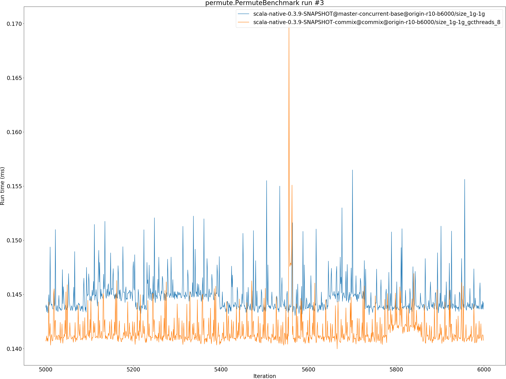

# Summary
## Benchmark run time (ms) at 50 percentile 

|name | scala-native-0.3.9-SNAPSHOT@master-concurrent-base@origin-r10-b6000/size_1g-1g | scala-native-0.3.9-SNAPSHOT-commix@commix@origin-r10-b6000/size_1g-1g_gcthreads_8 | |
| -- | -- | -- | -- |
|[bounce.BounceBenchmark](#bouncebouncebenchmark)|0.0420|0.0386|__-8.02%__|
|[brainfuck.BrainfuckBenchmark](#brainfuckbrainfuckbenchmark)|2.3617|2.3058|__-2.37%__|
|[cd.CDBenchmark](#cdcdbenchmark)|17.0474|16.4928|__-3.25%__|
|[deltablue.DeltaBlueBenchmark](#deltabluedeltabluebenchmark)|0.1776|0.1853|+4.31%|
|[gcbench.GCBenchBenchmark](#gcbenchgcbenchbenchmark)|64.5600|62.2978|__-3.50%__|
|[json.JsonBenchmark](#jsonjsonbenchmark)|0.9361|0.9390|+0.31%|
|[kmeans.KmeansBenchmark](#kmeanskmeansbenchmark)|34.9753|36.4305|+4.16%|
|[mandelbrot.MandelbrotBenchmark](#mandelbrotmandelbrotbenchmark)|100.7235|100.7525|+0.03%|
|[nbody.NbodyBenchmark](#nbodynbodybenchmark)|25.6345|25.6030|__-0.12%__|
|[permute.PermuteBenchmark](#permutepermutebenchmark)|0.1460|0.1425|__-2.45%__|
|[queens.QueensBenchmark](#queensqueensbenchmark)|0.0509|0.0505|__-0.84%__|
|[richards.RichardsBenchmark](#richardsrichardsbenchmark)|0.0592|0.0596|+0.57%|
|[sudoku.SudokuBenchmark](#sudokusudokubenchmark)|1.5779|1.6185|+2.57%|
|[tracer.TracerBenchmark](#tracertracerbenchmark)|0.4898|0.4952|+1.10%|
| __Geometrical mean:__|| |__-0.59%__|
## Benchmark run time (ms) at 90 percentile 

|name | scala-native-0.3.9-SNAPSHOT@master-concurrent-base@origin-r10-b6000/size_1g-1g | scala-native-0.3.9-SNAPSHOT-commix@commix@origin-r10-b6000/size_1g-1g_gcthreads_8 | |
| -- | -- | -- | -- |
|[bounce.BounceBenchmark](#bouncebouncebenchmark)|0.0434|0.0396|__-8.79%__|
|[brainfuck.BrainfuckBenchmark](#brainfuckbrainfuckbenchmark)|2.3840|2.4421|+2.44%|
|[cd.CDBenchmark](#cdcdbenchmark)|17.1371|16.6567|__-2.80%__|
|[deltablue.DeltaBlueBenchmark](#deltabluedeltabluebenchmark)|0.1842|0.1877|+1.91%|
|[gcbench.GCBenchBenchmark](#gcbenchgcbenchbenchmark)|68.1154|65.1878|__-4.30%__|
|[json.JsonBenchmark](#jsonjsonbenchmark)|0.9449|1.0066|+6.53%|
|[kmeans.KmeansBenchmark](#kmeanskmeansbenchmark)|36.6018|36.9557|+0.97%|
|[mandelbrot.MandelbrotBenchmark](#mandelbrotmandelbrotbenchmark)|100.7991|100.8269|+0.03%|
|[nbody.NbodyBenchmark](#nbodynbodybenchmark)|26.0442|25.9992|__-0.17%__|
|[permute.PermuteBenchmark](#permutepermutebenchmark)|0.2103|0.2049|__-2.54%__|
|[queens.QueensBenchmark](#queensqueensbenchmark)|0.0531|0.0518|__-2.38%__|
|[richards.RichardsBenchmark](#richardsrichardsbenchmark)|0.0618|0.0628|+1.59%|
|[sudoku.SudokuBenchmark](#sudokusudokubenchmark)|1.6055|1.6362|+1.91%|
|[tracer.TracerBenchmark](#tracertracerbenchmark)|0.4962|0.5025|+1.29%|
| __Geometrical mean:__|| |__-0.37%__|
## Benchmark run time (ms) at 99 percentile 

|name | scala-native-0.3.9-SNAPSHOT@master-concurrent-base@origin-r10-b6000/size_1g-1g | scala-native-0.3.9-SNAPSHOT-commix@commix@origin-r10-b6000/size_1g-1g_gcthreads_8 | |
| -- | -- | -- | -- |
|[bounce.BounceBenchmark](#bouncebouncebenchmark)|0.0452|0.0413|__-8.45%__|
|[brainfuck.BrainfuckBenchmark](#brainfuckbrainfuckbenchmark)|2.4863|2.4917|+0.22%|
|[cd.CDBenchmark](#cdcdbenchmark)|21.8392|18.0163|__-17.50%__|
|[deltablue.DeltaBlueBenchmark](#deltabluedeltabluebenchmark)|0.1877|0.1916|+2.07%|
|[gcbench.GCBenchBenchmark](#gcbenchgcbenchbenchmark)|68.9302|65.8609|__-4.45%__|
|[json.JsonBenchmark](#jsonjsonbenchmark)|0.9527|1.1738|+23.20%|
|[kmeans.KmeansBenchmark](#kmeanskmeansbenchmark)|51.5183|38.9350|__-24.43%__|
|[mandelbrot.MandelbrotBenchmark](#mandelbrotmandelbrotbenchmark)|102.1742|102.1716|__-0.00%__|
|[nbody.NbodyBenchmark](#nbodynbodybenchmark)|34.6444|27.0987|__-21.78%__|
|[permute.PermuteBenchmark](#permutepermutebenchmark)|0.2150|0.2098|__-2.39%__|
|[queens.QueensBenchmark](#queensqueensbenchmark)|0.0549|0.0541|__-1.62%__|
|[richards.RichardsBenchmark](#richardsrichardsbenchmark)|0.0648|0.0668|+3.21%|
|[sudoku.SudokuBenchmark](#sudokusudokubenchmark)|1.6425|1.6569|+0.87%|
|[tracer.TracerBenchmark](#tracertracerbenchmark)|0.5048|0.5316|+5.30%|
| __Geometrical mean:__|| |__-3.98%__|
## Benchmark run time (ms) at 99.9 percentile 

|name | scala-native-0.3.9-SNAPSHOT@master-concurrent-base@origin-r10-b6000/size_1g-1g | scala-native-0.3.9-SNAPSHOT-commix@commix@origin-r10-b6000/size_1g-1g_gcthreads_8 | |
| -- | -- | -- | -- |
|[bounce.BounceBenchmark](#bouncebouncebenchmark)|0.0483|0.0427|__-11.61%__|
|[brainfuck.BrainfuckBenchmark](#brainfuckbrainfuckbenchmark)|6.6798|3.7900|__-43.26%__|
|[cd.CDBenchmark](#cdcdbenchmark)|22.1662|21.8400|__-1.47%__|
|[deltablue.DeltaBlueBenchmark](#deltabluedeltabluebenchmark)|0.2042|0.2963|+45.12%|
|[gcbench.GCBenchBenchmark](#gcbenchgcbenchbenchmark)|76.3788|74.3729|__-2.63%__|
|[json.JsonBenchmark](#jsonjsonbenchmark)|4.9368|2.0189|__-59.11%__|
|[kmeans.KmeansBenchmark](#kmeanskmeansbenchmark)|54.4631|39.5482|__-27.39%__|
|[mandelbrot.MandelbrotBenchmark](#mandelbrotmandelbrotbenchmark)|108.2811|108.3039|+0.02%|
|[nbody.NbodyBenchmark](#nbodynbodybenchmark)|36.7917|27.8353|__-24.34%__|
|[permute.PermuteBenchmark](#permutepermutebenchmark)|0.2333|0.2256|__-3.30%__|
|[queens.QueensBenchmark](#queensqueensbenchmark)|0.0567|0.0555|__-2.02%__|
|[richards.RichardsBenchmark](#richardsrichardsbenchmark)|0.0696|0.0712|+2.27%|
|[sudoku.SudokuBenchmark](#sudokusudokubenchmark)|5.7223|2.1843|__-61.83%__|
|[tracer.TracerBenchmark](#tracertracerbenchmark)|4.5165|1.6962|__-62.44%__|
| __Geometrical mean:__|| |__-23.91%__|
## Benchmark total run time (ms) 

|name | scala-native-0.3.9-SNAPSHOT@master-concurrent-base@origin-r10-b6000/size_1g-1g | scala-native-0.3.9-SNAPSHOT-commix@commix@origin-r10-b6000/size_1g-1g_gcthreads_8 | |
| -- | -- | -- | -- |
|[bounce.BounceBenchmark](#bouncebouncebenchmark)|1682.3239|1543.4580|__-8.25%__|
|[brainfuck.BrainfuckBenchmark](#brainfuckbrainfuckbenchmark)|93918.0435|94260.3813|+0.36%|
|[cd.CDBenchmark](#cdcdbenchmark)|691792.8669|655402.6022|__-5.26%__|
|[deltablue.DeltaBlueBenchmark](#deltabluedeltabluebenchmark)|7093.7992|7303.9516|+2.96%|
|[gcbench.GCBenchBenchmark](#gcbenchgcbenchbenchmark)|2499547.7565|2448749.0355|__-2.03%__|
|[json.JsonBenchmark](#jsonjsonbenchmark)|37807.2224|38233.0528|+1.13%|
|[kmeans.KmeansBenchmark](#kmeanskmeansbenchmark)|1441506.4734|1443893.5140|+0.17%|
|[mandelbrot.MandelbrotBenchmark](#mandelbrotmandelbrotbenchmark)|4032006.2624|4032634.3115|+0.02%|
|[nbody.NbodyBenchmark](#nbodynbodybenchmark)|1034743.1634|1023967.4602|__-1.04%__|
|[permute.PermuteBenchmark](#permutepermutebenchmark)|6969.4739|6629.6165|__-4.88%__|
|[queens.QueensBenchmark](#queensqueensbenchmark)|2054.8572|2007.2449|__-2.32%__|
|[richards.RichardsBenchmark](#richardsrichardsbenchmark)|2368.0880|2387.5298|+0.82%|
|[sudoku.SudokuBenchmark](#sudokusudokubenchmark)|62815.6598|64856.4507|+3.25%|
|[tracer.TracerBenchmark](#tracertracerbenchmark)|20045.1554|19977.7468|__-0.34%__|
| __Geometrical mean:__|| |__-1.15%__|
# Individual benchmarks
## bounce.BounceBenchmark

## brainfuck.BrainfuckBenchmark

## cd.CDBenchmark

## deltablue.DeltaBlueBenchmark

## gcbench.GCBenchBenchmark

## json.JsonBenchmark

## kmeans.KmeansBenchmark

## mandelbrot.MandelbrotBenchmark

## nbody.NbodyBenchmark

## permute.PermuteBenchmark

## queens.QueensBenchmark

## richards.RichardsBenchmark

## sudoku.SudokuBenchmark

## tracer.TracerBenchmark

