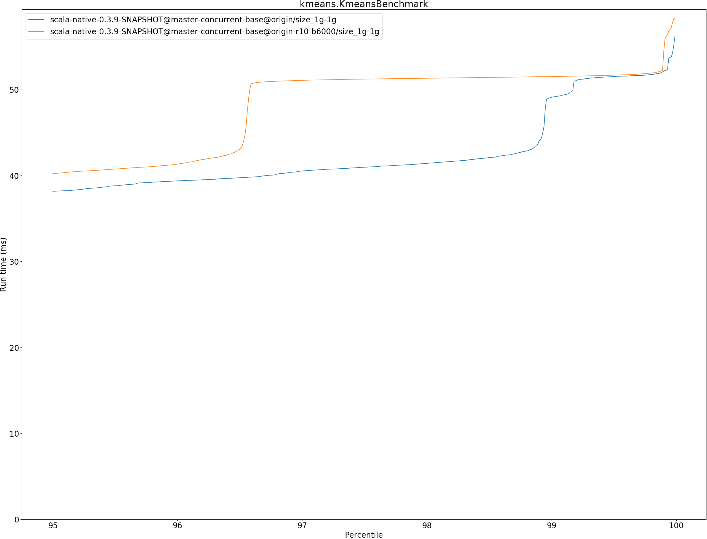

# Summary
## Benchmark run time (ms) at 50 percentile 

|name | scala-native-0.3.9-SNAPSHOT@master-concurrent-base@origin/size_1g-1g | scala-native-0.3.9-SNAPSHOT@master-concurrent-base@origin-r10-b6000/size_1g-1g | |
| -- | -- | -- | -- |
|[bounce.BounceBenchmark](#bouncebouncebenchmark)|0.0410|0.0420|+2.45%|
|[brainfuck.BrainfuckBenchmark](#brainfuckbrainfuckbenchmark)|2.3728|2.3617|__-0.46%__|
|[cd.CDBenchmark](#cdcdbenchmark)|17.0053|17.0474|+0.25%|
|[deltablue.DeltaBlueBenchmark](#deltabluedeltabluebenchmark)|0.1814|0.1776|__-2.09%__|
|[gcbench.GCBenchBenchmark](#gcbenchgcbenchbenchmark)|66.1548|64.5600|__-2.41%__|
|[json.JsonBenchmark](#jsonjsonbenchmark)|0.9358|0.9361|+0.03%|
|[kmeans.KmeansBenchmark](#kmeanskmeansbenchmark)|36.0690|34.9753|__-3.03%__|
|[mandelbrot.MandelbrotBenchmark](#mandelbrotmandelbrotbenchmark)|100.7072|100.7235|+0.02%|
|[nbody.NbodyBenchmark](#nbodynbodybenchmark)|24.5717|25.6345|+4.33%|
|[permute.PermuteBenchmark](#permutepermutebenchmark)|0.2098|0.1460|__-30.37%__|
|[queens.QueensBenchmark](#queensqueensbenchmark)|0.0510|0.0509|__-0.06%__|
|[richards.RichardsBenchmark](#richardsrichardsbenchmark)|0.0603|0.0592|__-1.75%__|
|[sudoku.SudokuBenchmark](#sudokusudokubenchmark)|1.5931|1.5779|__-0.95%__|
|[tracer.TracerBenchmark](#tracertracerbenchmark)|0.4879|0.4898|+0.38%|
| __Geometrical mean:__|| |__-2.80%__|
## Benchmark run time (ms) at 90 percentile 

|name | scala-native-0.3.9-SNAPSHOT@master-concurrent-base@origin/size_1g-1g | scala-native-0.3.9-SNAPSHOT@master-concurrent-base@origin-r10-b6000/size_1g-1g | |
| -- | -- | -- | -- |
|[bounce.BounceBenchmark](#bouncebouncebenchmark)|0.0423|0.0434|+2.51%|
|[brainfuck.BrainfuckBenchmark](#brainfuckbrainfuckbenchmark)|2.4765|2.3840|__-3.73%__|
|[cd.CDBenchmark](#cdcdbenchmark)|17.1122|17.1371|+0.15%|
|[deltablue.DeltaBlueBenchmark](#deltabluedeltabluebenchmark)|0.1852|0.1842|__-0.54%__|
|[gcbench.GCBenchBenchmark](#gcbenchgcbenchbenchmark)|66.8558|68.1154|+1.88%|
|[json.JsonBenchmark](#jsonjsonbenchmark)|0.9407|0.9449|+0.45%|
|[kmeans.KmeansBenchmark](#kmeanskmeansbenchmark)|36.6244|36.6018|__-0.06%__|
|[mandelbrot.MandelbrotBenchmark](#mandelbrotmandelbrotbenchmark)|100.7837|100.7991|+0.02%|
|[nbody.NbodyBenchmark](#nbodynbodybenchmark)|25.6886|26.0442|+1.38%|
|[permute.PermuteBenchmark](#permutepermutebenchmark)|0.2121|0.2103|__-0.83%__|
|[queens.QueensBenchmark](#queensqueensbenchmark)|0.0527|0.0531|+0.63%|
|[richards.RichardsBenchmark](#richardsrichardsbenchmark)|0.0627|0.0618|__-1.47%__|
|[sudoku.SudokuBenchmark](#sudokusudokubenchmark)|1.6082|1.6055|__-0.17%__|
|[tracer.TracerBenchmark](#tracertracerbenchmark)|0.4941|0.4962|+0.41%|
| __Geometrical mean:__|| |+0.03%|
## Benchmark run time (ms) at 99 percentile 

|name | scala-native-0.3.9-SNAPSHOT@master-concurrent-base@origin/size_1g-1g | scala-native-0.3.9-SNAPSHOT@master-concurrent-base@origin-r10-b6000/size_1g-1g | |
| -- | -- | -- | -- |
|[bounce.BounceBenchmark](#bouncebouncebenchmark)|0.0441|0.0452|+2.45%|
|[brainfuck.BrainfuckBenchmark](#brainfuckbrainfuckbenchmark)|2.9974|2.4863|__-17.05%__|
|[cd.CDBenchmark](#cdcdbenchmark)|21.9642|21.8392|__-0.57%__|
|[deltablue.DeltaBlueBenchmark](#deltabluedeltabluebenchmark)|0.1883|0.1877|__-0.32%__|
|[gcbench.GCBenchBenchmark](#gcbenchgcbenchbenchmark)|77.4812|68.9302|__-11.04%__|
|[json.JsonBenchmark](#jsonjsonbenchmark)|0.9670|0.9527|__-1.47%__|
|[kmeans.KmeansBenchmark](#kmeanskmeansbenchmark)|49.0999|51.5183|+4.93%|
|[mandelbrot.MandelbrotBenchmark](#mandelbrotmandelbrotbenchmark)|104.3348|102.1742|__-2.07%__|
|[nbody.NbodyBenchmark](#nbodynbodybenchmark)|27.5265|34.6444|+25.86%|
|[permute.PermuteBenchmark](#permutepermutebenchmark)|0.2169|0.2150|__-0.88%__|
|[queens.QueensBenchmark](#queensqueensbenchmark)|0.0544|0.0549|+1.09%|
|[richards.RichardsBenchmark](#richardsrichardsbenchmark)|0.0658|0.0648|__-1.49%__|
|[sudoku.SudokuBenchmark](#sudokusudokubenchmark)|1.6337|1.6425|+0.54%|
|[tracer.TracerBenchmark](#tracertracerbenchmark)|0.5023|0.5048|+0.51%|
| __Geometrical mean:__|| |__-0.35%__|
## Benchmark run time (ms) at 99.9 percentile 

|name | scala-native-0.3.9-SNAPSHOT@master-concurrent-base@origin/size_1g-1g | scala-native-0.3.9-SNAPSHOT@master-concurrent-base@origin-r10-b6000/size_1g-1g | |
| -- | -- | -- | -- |
|[bounce.BounceBenchmark](#bouncebouncebenchmark)|0.0462|0.0483|+4.49%|
|[brainfuck.BrainfuckBenchmark](#brainfuckbrainfuckbenchmark)|6.5612|6.6798|+1.81%|
|[cd.CDBenchmark](#cdcdbenchmark)|22.2065|22.1662|__-0.18%__|
|[deltablue.DeltaBlueBenchmark](#deltabluedeltabluebenchmark)|0.1980|0.2042|+3.13%|
|[gcbench.GCBenchBenchmark](#gcbenchgcbenchbenchmark)|79.0555|76.3788|__-3.39%__|
|[json.JsonBenchmark](#jsonjsonbenchmark)|4.9613|4.9368|__-0.49%__|
|[kmeans.KmeansBenchmark](#kmeanskmeansbenchmark)|52.1409|54.4631|+4.45%|
|[mandelbrot.MandelbrotBenchmark](#mandelbrotmandelbrotbenchmark)|108.2594|108.2811|+0.02%|
|[nbody.NbodyBenchmark](#nbodynbodybenchmark)|29.5974|36.7917|+24.31%|
|[permute.PermuteBenchmark](#permutepermutebenchmark)|0.2301|0.2333|+1.37%|
|[queens.QueensBenchmark](#queensqueensbenchmark)|0.0560|0.0567|+1.23%|
|[richards.RichardsBenchmark](#richardsrichardsbenchmark)|0.0692|0.0696|+0.58%|
|[sudoku.SudokuBenchmark](#sudokusudokubenchmark)|3.5571|5.7223|+60.87%|
|[tracer.TracerBenchmark](#tracertracerbenchmark)|4.4471|4.5165|+1.56%|
| __Geometrical mean:__|| |+6.15%|
## Benchmark total run time (ms) 

|name | scala-native-0.3.9-SNAPSHOT@master-concurrent-base@origin/size_1g-1g | scala-native-0.3.9-SNAPSHOT@master-concurrent-base@origin-r10-b6000/size_1g-1g | |
| -- | -- | -- | -- |
|[bounce.BounceBenchmark](#bouncebouncebenchmark)|817.8376|1682.3239|+105.70%|
|[brainfuck.BrainfuckBenchmark](#brainfuckbrainfuckbenchmark)|48384.6665|93918.0435|+94.11%|
|[cd.CDBenchmark](#cdcdbenchmark)|346446.6505|691792.8669|+99.68%|
|[deltablue.DeltaBlueBenchmark](#deltabluedeltabluebenchmark)|3597.3118|7093.7992|+97.20%|
|[gcbench.GCBenchBenchmark](#gcbenchgcbenchbenchmark)|1259126.9785|2499547.7565|+98.51%|
|[json.JsonBenchmark](#jsonjsonbenchmark)|18905.6686|37807.2224|+99.98%|
|[kmeans.KmeansBenchmark](#kmeanskmeansbenchmark)|720405.6537|1441506.4734|+100.10%|
|[mandelbrot.MandelbrotBenchmark](#mandelbrotmandelbrotbenchmark)|2015996.6238|4032006.2624|+100.00%|
|[nbody.NbodyBenchmark](#nbodynbodybenchmark)|499501.7361|1034743.1634|+107.16%|
|[permute.PermuteBenchmark](#permutepermutebenchmark)|4201.0063|6969.4739|+65.90%|
|[queens.QueensBenchmark](#queensqueensbenchmark)|1026.0478|2054.8572|+100.27%|
|[richards.RichardsBenchmark](#richardsrichardsbenchmark)|1213.8292|2368.0880|+95.09%|
|[sudoku.SudokuBenchmark](#sudokusudokubenchmark)|31970.6633|62815.6598|+96.48%|
|[tracer.TracerBenchmark](#tracertracerbenchmark)|10002.6828|20045.1554|+100.40%|
| __Geometrical mean:__|| |+96.94%|
# Individual benchmarks
## bounce.BounceBenchmark

## brainfuck.BrainfuckBenchmark

## cd.CDBenchmark

## deltablue.DeltaBlueBenchmark

## gcbench.GCBenchBenchmark

## json.JsonBenchmark

## kmeans.KmeansBenchmark

## mandelbrot.MandelbrotBenchmark

## nbody.NbodyBenchmark

## permute.PermuteBenchmark

## queens.QueensBenchmark

## richards.RichardsBenchmark

## sudoku.SudokuBenchmark

## tracer.TracerBenchmark

