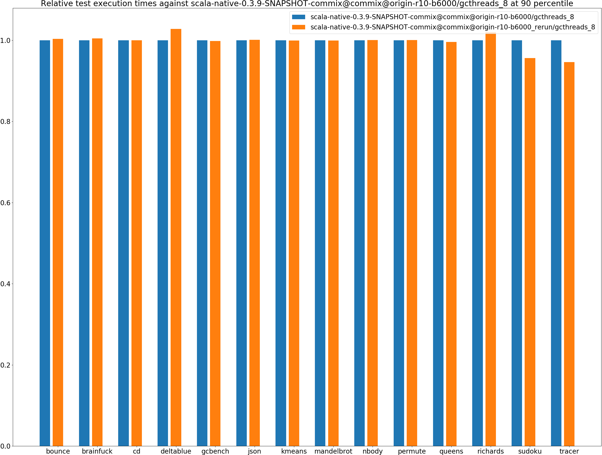
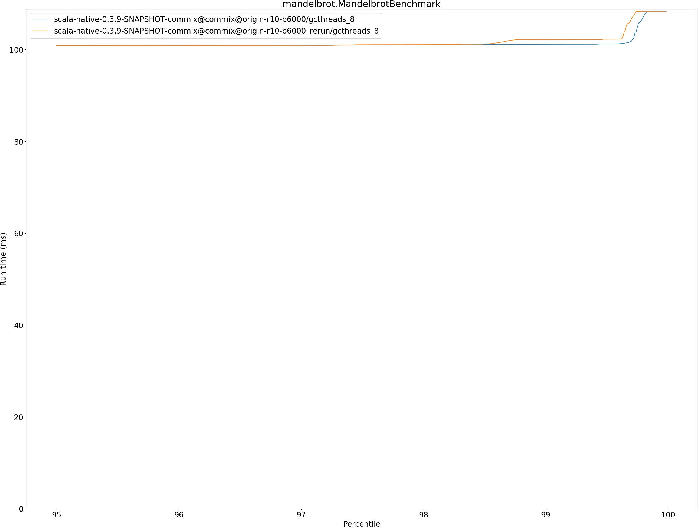
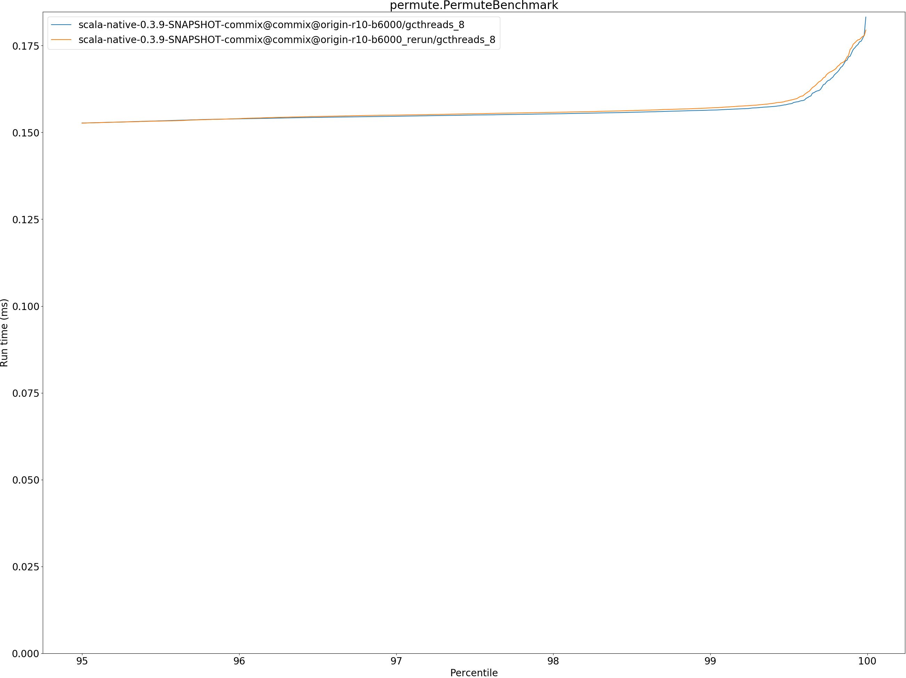
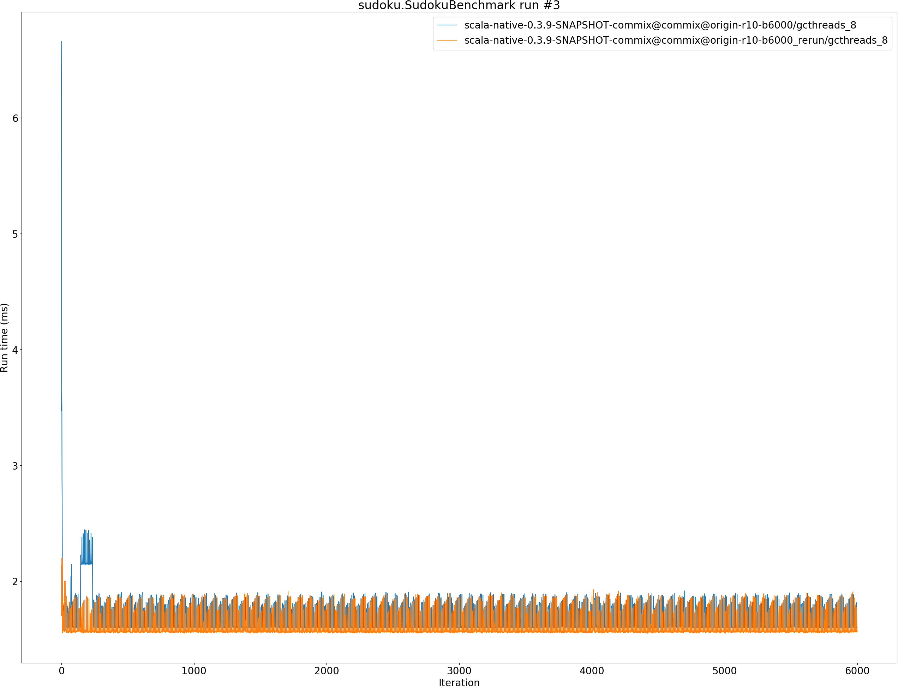

# Summary
## Benchmark run time (ms) at 50 percentile 

|name | scala-native-0.3.9-SNAPSHOT-commix@commix@origin-r10-b6000/gcthreads_8 | scala-native-0.3.9-SNAPSHOT-commix@commix@origin-r10-b6000_rerun/gcthreads_8 | |
| -- | -- | -- | -- |
|[bounce.BounceBenchmark](#bouncebouncebenchmark)|0.0366|0.0369|+0.76%|
|[brainfuck.BrainfuckBenchmark](#brainfuckbrainfuckbenchmark)|2.5005|2.4875|__-0.52%__|
|[cd.CDBenchmark](#cdcdbenchmark)|16.8950|16.9010|+0.04%|
|[deltablue.DeltaBlueBenchmark](#deltabluedeltabluebenchmark)|0.1399|0.1398|__-0.06%__|
|[gcbench.GCBenchBenchmark](#gcbenchgcbenchbenchmark)|60.0659|60.5084|+0.74%|
|[json.JsonBenchmark](#jsonjsonbenchmark)|0.9801|0.9412|__-3.97%__|
|[kmeans.KmeansBenchmark](#kmeanskmeansbenchmark)|36.6477|36.6091|__-0.11%__|
|[mandelbrot.MandelbrotBenchmark](#mandelbrotmandelbrotbenchmark)|100.8254|100.7351|__-0.09%__|
|[nbody.NbodyBenchmark](#nbodynbodybenchmark)|25.6548|25.6860|+0.12%|
|[permute.PermuteBenchmark](#permutepermutebenchmark)|0.1416|0.1414|__-0.09%__|
|[queens.QueensBenchmark](#queensqueensbenchmark)|0.0478|0.0477|__-0.10%__|
|[richards.RichardsBenchmark](#richardsrichardsbenchmark)|0.0548|0.0552|+0.69%|
|[sudoku.SudokuBenchmark](#sudokusudokubenchmark)|1.6247|1.5662|__-3.60%__|
|[tracer.TracerBenchmark](#tracertracerbenchmark)|0.4863|0.4860|__-0.06%__|
| __Geometrical mean:__|| |__-0.46%__|
## Benchmark run time (ms) at 90 percentile 

|name | scala-native-0.3.9-SNAPSHOT-commix@commix@origin-r10-b6000/gcthreads_8 | scala-native-0.3.9-SNAPSHOT-commix@commix@origin-r10-b6000_rerun/gcthreads_8 | |
| -- | -- | -- | -- |
|[bounce.BounceBenchmark](#bouncebouncebenchmark)|0.0371|0.0372|+0.33%|
|[brainfuck.BrainfuckBenchmark](#brainfuckbrainfuckbenchmark)|2.5750|2.5864|+0.44%|
|[cd.CDBenchmark](#cdcdbenchmark)|17.0069|17.0036|__-0.02%__|
|[deltablue.DeltaBlueBenchmark](#deltabluedeltabluebenchmark)|0.1439|0.1479|+2.79%|
|[gcbench.GCBenchBenchmark](#gcbenchgcbenchbenchmark)|63.5007|63.3875|__-0.18%__|
|[json.JsonBenchmark](#jsonjsonbenchmark)|0.9863|0.9872|+0.09%|
|[kmeans.KmeansBenchmark](#kmeanskmeansbenchmark)|38.2389|38.2215|__-0.05%__|
|[mandelbrot.MandelbrotBenchmark](#mandelbrotmandelbrotbenchmark)|100.9025|100.8180|__-0.08%__|
|[nbody.NbodyBenchmark](#nbodynbodybenchmark)|26.0686|26.0899|+0.08%|
|[permute.PermuteBenchmark](#permutepermutebenchmark)|0.1466|0.1467|+0.08%|
|[queens.QueensBenchmark](#queensqueensbenchmark)|0.0482|0.0480|__-0.40%__|
|[richards.RichardsBenchmark](#richardsrichardsbenchmark)|0.0560|0.0572|+2.01%|
|[sudoku.SudokuBenchmark](#sudokusudokubenchmark)|1.8101|1.7307|__-4.39%__|
|[tracer.TracerBenchmark](#tracertracerbenchmark)|0.5226|0.4946|__-5.37%__|
| __Geometrical mean:__|| |__-0.35%__|
## Benchmark run time (ms) at 99 percentile 

|name | scala-native-0.3.9-SNAPSHOT-commix@commix@origin-r10-b6000/gcthreads_8 | scala-native-0.3.9-SNAPSHOT-commix@commix@origin-r10-b6000_rerun/gcthreads_8 | |
| -- | -- | -- | -- |
|[bounce.BounceBenchmark](#bouncebouncebenchmark)|0.0379|0.0387|+2.11%|
|[brainfuck.BrainfuckBenchmark](#brainfuckbrainfuckbenchmark)|2.6124|2.6223|+0.38%|
|[cd.CDBenchmark](#cdcdbenchmark)|17.1740|17.1713|__-0.02%__|
|[deltablue.DeltaBlueBenchmark](#deltabluedeltabluebenchmark)|0.1819|0.1821|+0.09%|
|[gcbench.GCBenchBenchmark](#gcbenchgcbenchbenchmark)|64.9304|64.8303|__-0.15%__|
|[json.JsonBenchmark](#jsonjsonbenchmark)|1.2313|1.0358|__-15.88%__|
|[kmeans.KmeansBenchmark](#kmeanskmeansbenchmark)|38.8220|38.7388|__-0.21%__|
|[mandelbrot.MandelbrotBenchmark](#mandelbrotmandelbrotbenchmark)|101.1400|102.1747|+1.02%|
|[nbody.NbodyBenchmark](#nbodynbodybenchmark)|27.4015|27.5402|+0.51%|
|[permute.PermuteBenchmark](#permutepermutebenchmark)|0.1564|0.1571|+0.42%|
|[queens.QueensBenchmark](#queensqueensbenchmark)|0.0504|0.0504|__-0.02%__|
|[richards.RichardsBenchmark](#richardsrichardsbenchmark)|0.0608|0.0617|+1.48%|
|[sudoku.SudokuBenchmark](#sudokusudokubenchmark)|2.1477|1.8891|__-12.04%__|
|[tracer.TracerBenchmark](#tracertracerbenchmark)|0.5864|0.5328|__-9.14%__|
| __Geometrical mean:__|| |__-2.41%__|
## Benchmark run time (ms) at 99.9 percentile 

|name | scala-native-0.3.9-SNAPSHOT-commix@commix@origin-r10-b6000/gcthreads_8 | scala-native-0.3.9-SNAPSHOT-commix@commix@origin-r10-b6000_rerun/gcthreads_8 | |
| -- | -- | -- | -- |
|[bounce.BounceBenchmark](#bouncebouncebenchmark)|0.0468|0.0478|+2.00%|
|[brainfuck.BrainfuckBenchmark](#brainfuckbrainfuckbenchmark)|2.6917|2.6712|__-0.76%__|
|[cd.CDBenchmark](#cdcdbenchmark)|17.9766|22.3350|+24.24%|
|[deltablue.DeltaBlueBenchmark](#deltabluedeltabluebenchmark)|0.1979|0.2028|+2.48%|
|[gcbench.GCBenchBenchmark](#gcbenchgcbenchbenchmark)|70.0466|66.5800|__-4.95%__|
|[json.JsonBenchmark](#jsonjsonbenchmark)|1.2473|1.0451|__-16.21%__|
|[kmeans.KmeansBenchmark](#kmeanskmeansbenchmark)|40.4144|39.5820|__-2.06%__|
|[mandelbrot.MandelbrotBenchmark](#mandelbrotmandelbrotbenchmark)|108.3964|108.3073|__-0.08%__|
|[nbody.NbodyBenchmark](#nbodynbodybenchmark)|36.1581|27.8596|__-22.95%__|
|[permute.PermuteBenchmark](#permutepermutebenchmark)|0.1729|0.1744|+0.83%|
|[queens.QueensBenchmark](#queensqueensbenchmark)|0.0594|0.0595|+0.21%|
|[richards.RichardsBenchmark](#richardsrichardsbenchmark)|0.0671|0.0692|+3.09%|
|[sudoku.SudokuBenchmark](#sudokusudokubenchmark)|2.4203|1.9227|__-20.56%__|
|[tracer.TracerBenchmark](#tracertracerbenchmark)|0.5943|0.5383|__-9.42%__|
| __Geometrical mean:__|| |__-3.82%__|
## Benchmark total run time (ms) 

|name | scala-native-0.3.9-SNAPSHOT-commix@commix@origin-r10-b6000/gcthreads_8 | scala-native-0.3.9-SNAPSHOT-commix@commix@origin-r10-b6000_rerun/gcthreads_8 | |
| -- | -- | -- | -- |
|[bounce.BounceBenchmark](#bouncebouncebenchmark)|1445.2286|1479.0902|+2.34%|
|[brainfuck.BrainfuckBenchmark](#brainfuckbrainfuckbenchmark)|97603.8385|98224.9888|+0.64%|
|[cd.CDBenchmark](#cdcdbenchmark)|674208.9811|677017.2399|+0.42%|
|[deltablue.DeltaBlueBenchmark](#deltabluedeltabluebenchmark)|5681.7558|5693.4369|+0.21%|
|[gcbench.GCBenchBenchmark](#gcbenchgcbenchbenchmark)|2443519.3235|2438053.3509|__-0.22%__|
|[json.JsonBenchmark](#jsonjsonbenchmark)|38637.2795|38253.5169|__-0.99%__|
|[kmeans.KmeansBenchmark](#kmeanskmeansbenchmark)|1466116.3770|1464630.8622|__-0.10%__|
|[mandelbrot.MandelbrotBenchmark](#mandelbrotmandelbrotbenchmark)|3963967.0058|3943624.6233|__-0.51%__|
|[nbody.NbodyBenchmark](#nbodynbodybenchmark)|1031957.0280|1031694.9221|__-0.03%__|
|[permute.PermuteBenchmark](#permutepermutebenchmark)|5717.0088|5699.3331|__-0.31%__|
|[queens.QueensBenchmark](#queensqueensbenchmark)|1914.7841|1913.4687|__-0.07%__|
|[richards.RichardsBenchmark](#richardsrichardsbenchmark)|2176.7882|2226.7257|+2.29%|
|[sudoku.SudokuBenchmark](#sudokusudokubenchmark)|66423.0631|64294.1740|__-3.21%__|
|[tracer.TracerBenchmark](#tracertracerbenchmark)|19551.8826|19392.9421|__-0.81%__|
| __Geometrical mean:__|| |__-0.03%__|
# Individual benchmarks
## bounce.BounceBenchmark

## brainfuck.BrainfuckBenchmark

## cd.CDBenchmark

## deltablue.DeltaBlueBenchmark

## gcbench.GCBenchBenchmark

## json.JsonBenchmark

## kmeans.KmeansBenchmark

## mandelbrot.MandelbrotBenchmark

## nbody.NbodyBenchmark

## permute.PermuteBenchmark

## queens.QueensBenchmark

## richards.RichardsBenchmark

## sudoku.SudokuBenchmark

## tracer.TracerBenchmark

