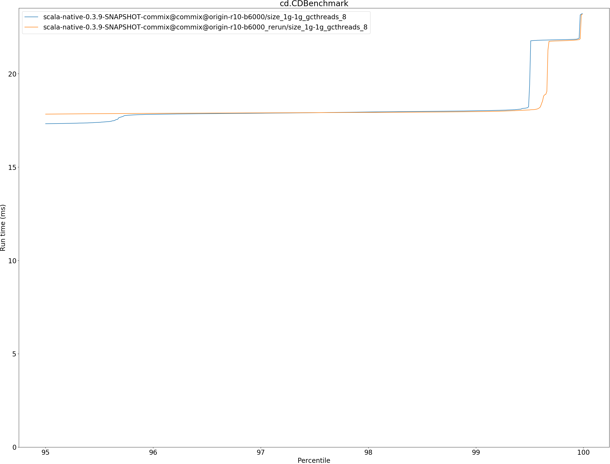
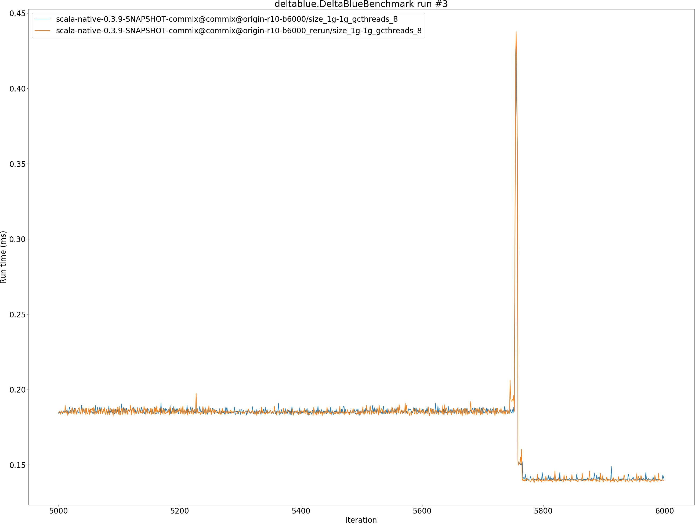
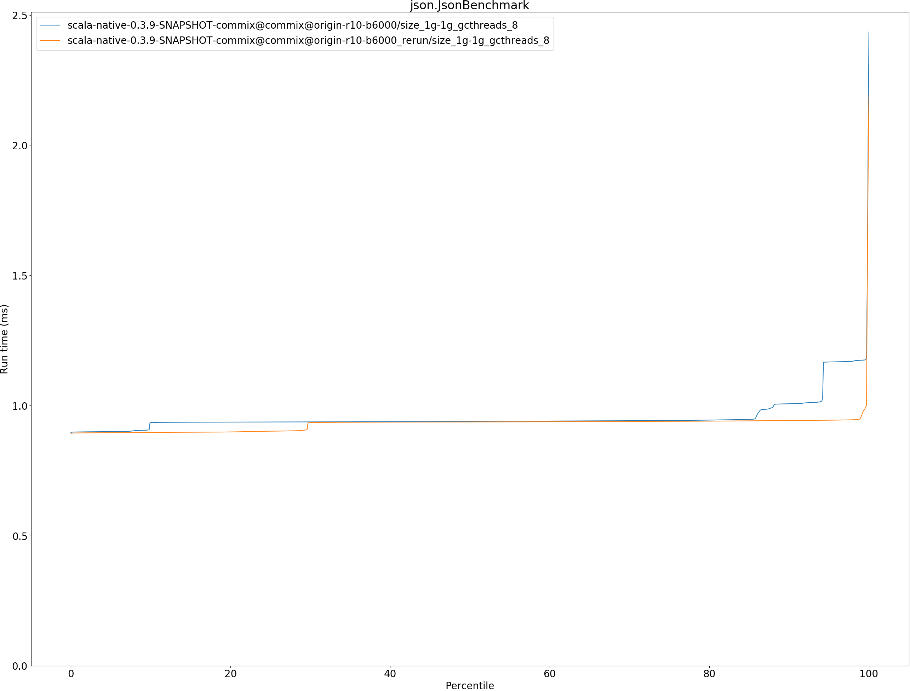
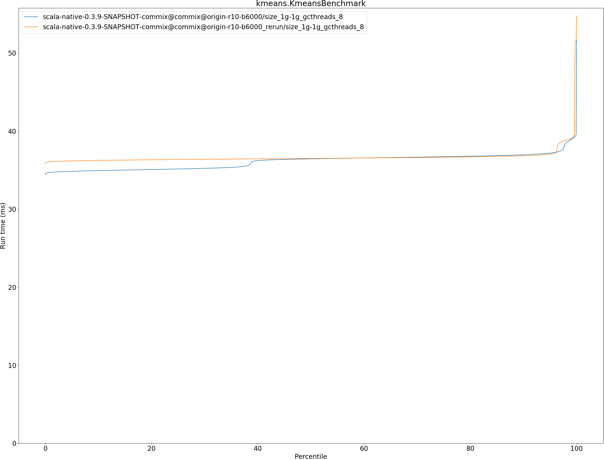
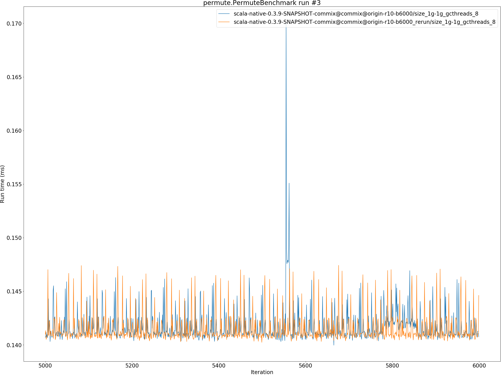
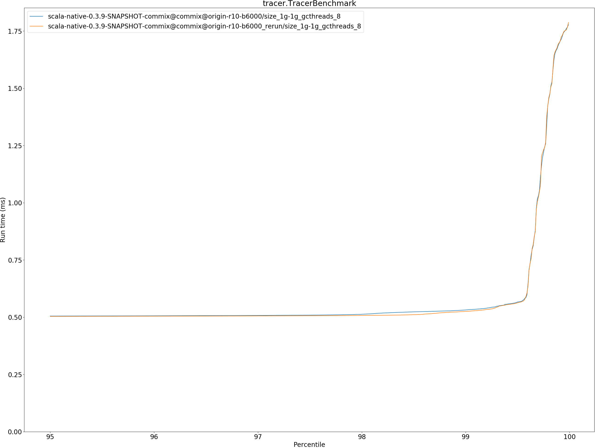

# Summary
## Benchmark run time (ms) at 50 percentile 

|name | scala-native-0.3.9-SNAPSHOT-commix@commix@origin-r10-b6000/size_1g-1g_gcthreads_8 | scala-native-0.3.9-SNAPSHOT-commix@commix@origin-r10-b6000_rerun/size_1g-1g_gcthreads_8 | |
| -- | -- | -- | -- |
|[bounce.BounceBenchmark](#bouncebouncebenchmark)|0.0386|0.0385|__-0.30%__|
|[brainfuck.BrainfuckBenchmark](#brainfuckbrainfuckbenchmark)|2.3058|2.4030|+4.22%|
|[cd.CDBenchmark](#cdcdbenchmark)|16.4928|16.5168|+0.15%|
|[deltablue.DeltaBlueBenchmark](#deltabluedeltabluebenchmark)|0.1853|0.1853|+0.05%|
|[gcbench.GCBenchBenchmark](#gcbenchgcbenchbenchmark)|62.2978|64.4720|+3.49%|
|[json.JsonBenchmark](#jsonjsonbenchmark)|0.9390|0.9369|__-0.22%__|
|[kmeans.KmeansBenchmark](#kmeanskmeansbenchmark)|36.4305|36.4839|+0.15%|
|[mandelbrot.MandelbrotBenchmark](#mandelbrotmandelbrotbenchmark)|100.7525|100.7609|+0.01%|
|[nbody.NbodyBenchmark](#nbodynbodybenchmark)|25.6030|25.6055|+0.01%|
|[permute.PermuteBenchmark](#permutepermutebenchmark)|0.1425|0.1433|+0.61%|
|[queens.QueensBenchmark](#queensqueensbenchmark)|0.0505|0.0508|+0.60%|
|[richards.RichardsBenchmark](#richardsrichardsbenchmark)|0.0596|0.0604|+1.39%|
|[sudoku.SudokuBenchmark](#sudokusudokubenchmark)|1.6185|1.6243|+0.36%|
|[tracer.TracerBenchmark](#tracertracerbenchmark)|0.4952|0.4945|__-0.14%__|
| __Geometrical mean:__|| |+0.73%|
## Benchmark run time (ms) at 90 percentile 

|name | scala-native-0.3.9-SNAPSHOT-commix@commix@origin-r10-b6000/size_1g-1g_gcthreads_8 | scala-native-0.3.9-SNAPSHOT-commix@commix@origin-r10-b6000_rerun/size_1g-1g_gcthreads_8 | |
| -- | -- | -- | -- |
|[bounce.BounceBenchmark](#bouncebouncebenchmark)|0.0396|0.0397|+0.29%|
|[brainfuck.BrainfuckBenchmark](#brainfuckbrainfuckbenchmark)|2.4421|2.4134|__-1.18%__|
|[cd.CDBenchmark](#cdcdbenchmark)|16.6567|16.6079|__-0.29%__|
|[deltablue.DeltaBlueBenchmark](#deltabluedeltabluebenchmark)|0.1877|0.1876|__-0.03%__|
|[gcbench.GCBenchBenchmark](#gcbenchgcbenchbenchmark)|65.1878|65.7910|+0.93%|
|[json.JsonBenchmark](#jsonjsonbenchmark)|1.0066|0.9421|__-6.41%__|
|[kmeans.KmeansBenchmark](#kmeanskmeansbenchmark)|36.9557|36.8272|__-0.35%__|
|[mandelbrot.MandelbrotBenchmark](#mandelbrotmandelbrotbenchmark)|100.8269|100.8386|+0.01%|
|[nbody.NbodyBenchmark](#nbodynbodybenchmark)|25.9992|25.9852|__-0.05%__|
|[permute.PermuteBenchmark](#permutepermutebenchmark)|0.2049|0.2060|+0.53%|
|[queens.QueensBenchmark](#queensqueensbenchmark)|0.0518|0.0521|+0.65%|
|[richards.RichardsBenchmark](#richardsrichardsbenchmark)|0.0628|0.0637|+1.41%|
|[sudoku.SudokuBenchmark](#sudokusudokubenchmark)|1.6362|1.6415|+0.32%|
|[tracer.TracerBenchmark](#tracertracerbenchmark)|0.5025|0.5012|__-0.26%__|
| __Geometrical mean:__|| |__-0.33%__|
## Benchmark run time (ms) at 99 percentile 

|name | scala-native-0.3.9-SNAPSHOT-commix@commix@origin-r10-b6000/size_1g-1g_gcthreads_8 | scala-native-0.3.9-SNAPSHOT-commix@commix@origin-r10-b6000_rerun/size_1g-1g_gcthreads_8 | |
| -- | -- | -- | -- |
|[bounce.BounceBenchmark](#bouncebouncebenchmark)|0.0413|0.0485|+17.42%|
|[brainfuck.BrainfuckBenchmark](#brainfuckbrainfuckbenchmark)|2.4917|2.9779|+19.51%|
|[cd.CDBenchmark](#cdcdbenchmark)|18.0163|17.9694|__-0.26%__|
|[deltablue.DeltaBlueBenchmark](#deltabluedeltabluebenchmark)|0.1916|0.1908|__-0.43%__|
|[gcbench.GCBenchBenchmark](#gcbenchgcbenchbenchmark)|65.8609|69.2058|+5.08%|
|[json.JsonBenchmark](#jsonjsonbenchmark)|1.1738|0.9552|__-18.63%__|
|[kmeans.KmeansBenchmark](#kmeanskmeansbenchmark)|38.9350|39.0577|+0.32%|
|[mandelbrot.MandelbrotBenchmark](#mandelbrotmandelbrotbenchmark)|102.1716|101.0775|__-1.07%__|
|[nbody.NbodyBenchmark](#nbodynbodybenchmark)|27.0987|27.0726|__-0.10%__|
|[permute.PermuteBenchmark](#permutepermutebenchmark)|0.2098|0.2094|__-0.20%__|
|[queens.QueensBenchmark](#queensqueensbenchmark)|0.0541|0.0539|__-0.23%__|
|[richards.RichardsBenchmark](#richardsrichardsbenchmark)|0.0668|0.0671|+0.41%|
|[sudoku.SudokuBenchmark](#sudokusudokubenchmark)|1.6569|1.6892|+1.95%|
|[tracer.TracerBenchmark](#tracertracerbenchmark)|0.5316|0.5252|__-1.20%__|
| __Geometrical mean:__|| |+1.25%|
## Benchmark run time (ms) at 99.9 percentile 

|name | scala-native-0.3.9-SNAPSHOT-commix@commix@origin-r10-b6000/size_1g-1g_gcthreads_8 | scala-native-0.3.9-SNAPSHOT-commix@commix@origin-r10-b6000_rerun/size_1g-1g_gcthreads_8 | |
| -- | -- | -- | -- |
|[bounce.BounceBenchmark](#bouncebouncebenchmark)|0.0427|0.0509|+19.28%|
|[brainfuck.BrainfuckBenchmark](#brainfuckbrainfuckbenchmark)|3.7900|3.8261|+0.95%|
|[cd.CDBenchmark](#cdcdbenchmark)|21.8400|21.7903|__-0.23%__|
|[deltablue.DeltaBlueBenchmark](#deltabluedeltabluebenchmark)|0.2963|0.2806|__-5.31%__|
|[gcbench.GCBenchBenchmark](#gcbenchgcbenchbenchmark)|74.3729|75.7620|+1.87%|
|[json.JsonBenchmark](#jsonjsonbenchmark)|2.0189|1.8969|__-6.04%__|
|[kmeans.KmeansBenchmark](#kmeanskmeansbenchmark)|39.5482|51.6348|+30.56%|
|[mandelbrot.MandelbrotBenchmark](#mandelbrotmandelbrotbenchmark)|108.3039|108.3244|+0.02%|
|[nbody.NbodyBenchmark](#nbodynbodybenchmark)|27.8353|36.0429|+29.49%|
|[permute.PermuteBenchmark](#permutepermutebenchmark)|0.2256|0.2214|__-1.86%__|
|[queens.QueensBenchmark](#queensqueensbenchmark)|0.0555|0.0556|+0.08%|
|[richards.RichardsBenchmark](#richardsrichardsbenchmark)|0.0712|0.0748|+5.12%|
|[sudoku.SudokuBenchmark](#sudokusudokubenchmark)|2.1843|2.2084|+1.10%|
|[tracer.TracerBenchmark](#tracertracerbenchmark)|1.6962|1.6990|+0.17%|
| __Geometrical mean:__|| |+4.79%|
## Benchmark total run time (ms) 

|name | scala-native-0.3.9-SNAPSHOT-commix@commix@origin-r10-b6000/size_1g-1g_gcthreads_8 | scala-native-0.3.9-SNAPSHOT-commix@commix@origin-r10-b6000_rerun/size_1g-1g_gcthreads_8 | |
| -- | -- | -- | -- |
|[bounce.BounceBenchmark](#bouncebouncebenchmark)|1543.4580|1541.1331|__-0.15%__|
|[brainfuck.BrainfuckBenchmark](#brainfuckbrainfuckbenchmark)|94260.3813|96633.9855|+2.52%|
|[cd.CDBenchmark](#cdcdbenchmark)|655402.6022|660372.5408|+0.76%|
|[deltablue.DeltaBlueBenchmark](#deltabluedeltabluebenchmark)|7303.9516|7328.3513|+0.33%|
|[gcbench.GCBenchBenchmark](#gcbenchgcbenchbenchmark)|2448749.0355|2504517.0752|+2.28%|
|[json.JsonBenchmark](#jsonjsonbenchmark)|38233.0528|37170.6005|__-2.78%__|
|[kmeans.KmeansBenchmark](#kmeanskmeansbenchmark)|1443893.5140|1464871.9464|+1.45%|
|[mandelbrot.MandelbrotBenchmark](#mandelbrotmandelbrotbenchmark)|4032634.3115|3961750.6999|__-1.76%__|
|[nbody.NbodyBenchmark](#nbodynbodybenchmark)|1023967.4602|1024810.0852|+0.08%|
|[permute.PermuteBenchmark](#permutepermutebenchmark)|6629.6165|6769.0594|+2.10%|
|[queens.QueensBenchmark](#queensqueensbenchmark)|2007.2449|2044.4590|+1.85%|
|[richards.RichardsBenchmark](#richardsrichardsbenchmark)|2387.5298|2436.7390|+2.06%|
|[sudoku.SudokuBenchmark](#sudokusudokubenchmark)|64856.4507|65069.5010|+0.33%|
|[tracer.TracerBenchmark](#tracertracerbenchmark)|19977.7468|19905.3093|__-0.36%__|
| __Geometrical mean:__|| |+0.61%|
# Individual benchmarks
## bounce.BounceBenchmark

## brainfuck.BrainfuckBenchmark

## cd.CDBenchmark

## deltablue.DeltaBlueBenchmark

## gcbench.GCBenchBenchmark

## json.JsonBenchmark

## kmeans.KmeansBenchmark

## mandelbrot.MandelbrotBenchmark

## nbody.NbodyBenchmark

## permute.PermuteBenchmark

## queens.QueensBenchmark

## richards.RichardsBenchmark

## sudoku.SudokuBenchmark

## tracer.TracerBenchmark

