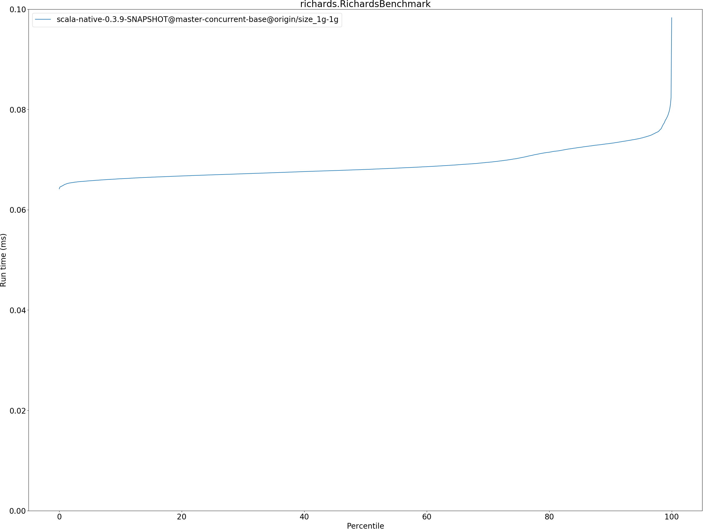
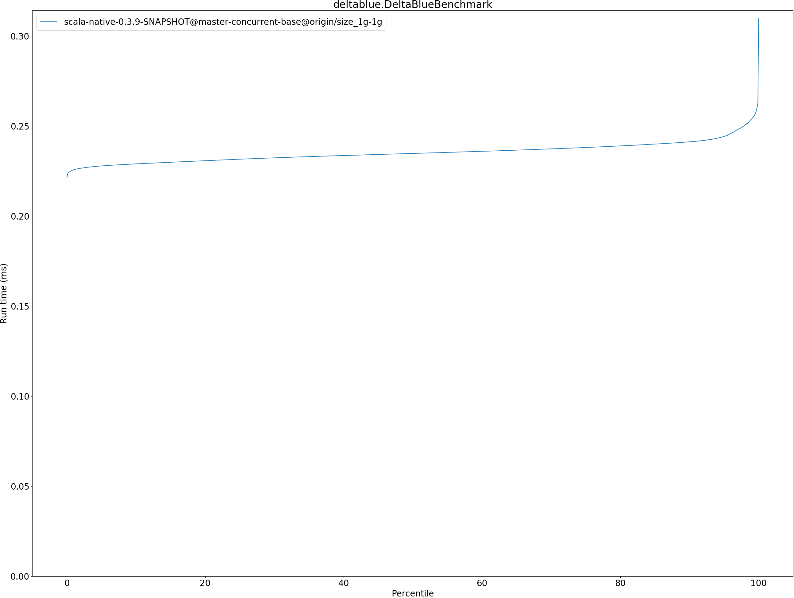
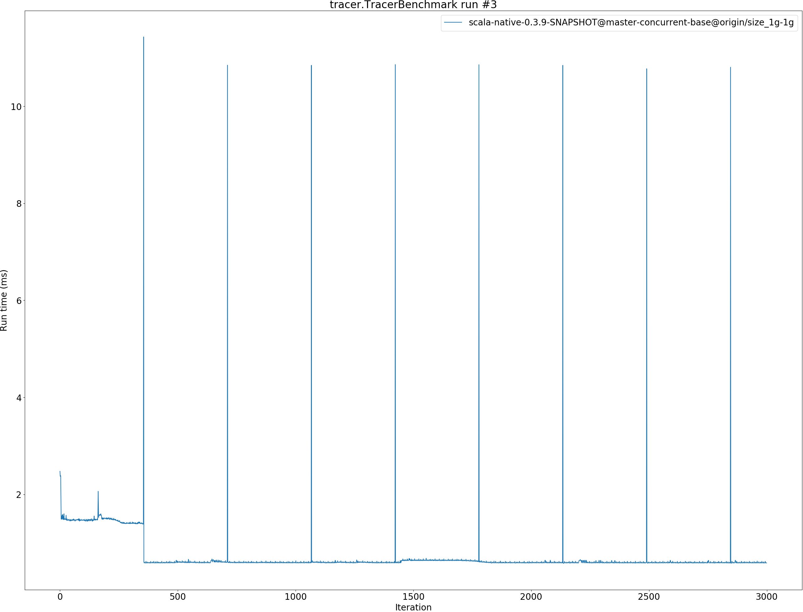
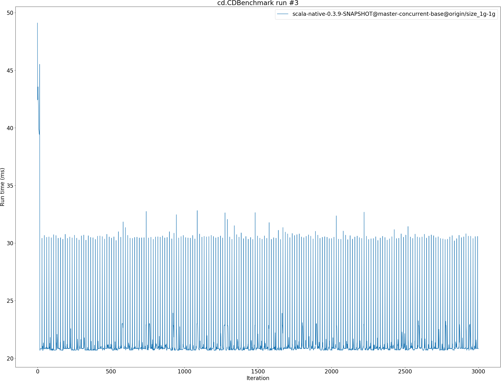

# Summary
## Benchmark run time (ms) at 50 percentile 

|name | scala-native-0.3.9-SNAPSHOT@master-concurrent-base@origin/size_1g-1g|
| -- | -- |
|[bounce.BounceBenchmark](#bouncebouncebenchmark)|0.0481|
|[richards.RichardsBenchmark](#richardsrichardsbenchmark)|0.0680|
|[queens.QueensBenchmark](#queensqueensbenchmark)|0.0896|
|[permute.PermuteBenchmark](#permutepermutebenchmark)|0.2732|
|[deltablue.DeltaBlueBenchmark](#deltabluedeltabluebenchmark)|0.2347|
|[tracer.TracerBenchmark](#tracertracerbenchmark)|0.6034|
|[brainfuck.BrainfuckBenchmark](#brainfuckbrainfuckbenchmark)|3.4409|
|[json.JsonBenchmark](#jsonjsonbenchmark)|1.3146|
|[cd.CDBenchmark](#cdcdbenchmark)|20.8574|
|[kmeans.KmeansBenchmark](#kmeanskmeansbenchmark)|47.1024|
|[gcbench.GCBenchBenchmark](#gcbenchgcbenchbenchmark)|92.3706|
|[mandelbrot.MandelbrotBenchmark](#mandelbrotmandelbrotbenchmark)|90.7680|
|[nbody.NbodyBenchmark](#nbodynbodybenchmark)|28.7345|
|[sudoku.SudokuBenchmark](#sudokusudokubenchmark)|2.3656|
| __Geometrical mean:__||
## Benchmark run time (ms) at 90 percentile 

|name | scala-native-0.3.9-SNAPSHOT@master-concurrent-base@origin/size_1g-1g|
| -- | -- |
|[bounce.BounceBenchmark](#bouncebouncebenchmark)|0.0501|
|[richards.RichardsBenchmark](#richardsrichardsbenchmark)|0.0732|
|[queens.QueensBenchmark](#queensqueensbenchmark)|0.0943|
|[permute.PermuteBenchmark](#permutepermutebenchmark)|0.2832|
|[deltablue.DeltaBlueBenchmark](#deltabluedeltabluebenchmark)|0.2412|
|[tracer.TracerBenchmark](#tracertracerbenchmark)|0.6282|
|[brainfuck.BrainfuckBenchmark](#brainfuckbrainfuckbenchmark)|3.5097|
|[json.JsonBenchmark](#jsonjsonbenchmark)|1.3882|
|[cd.CDBenchmark](#cdcdbenchmark)|21.6948|
|[kmeans.KmeansBenchmark](#kmeanskmeansbenchmark)|48.3500|
|[gcbench.GCBenchBenchmark](#gcbenchgcbenchbenchmark)|99.5219|
|[mandelbrot.MandelbrotBenchmark](#mandelbrotmandelbrotbenchmark)|91.8261|
|[nbody.NbodyBenchmark](#nbodynbodybenchmark)|29.3364|
|[sudoku.SudokuBenchmark](#sudokusudokubenchmark)|2.5129|
| __Geometrical mean:__||
## Benchmark run time (ms) at 99 percentile 

|name | scala-native-0.3.9-SNAPSHOT@master-concurrent-base@origin/size_1g-1g|
| -- | -- |
|[bounce.BounceBenchmark](#bouncebouncebenchmark)|0.0546|
|[richards.RichardsBenchmark](#richardsrichardsbenchmark)|0.0779|
|[queens.QueensBenchmark](#queensqueensbenchmark)|0.0988|
|[permute.PermuteBenchmark](#permutepermutebenchmark)|0.2980|
|[deltablue.DeltaBlueBenchmark](#deltabluedeltabluebenchmark)|0.2538|
|[tracer.TracerBenchmark](#tracertracerbenchmark)|0.6562|
|[brainfuck.BrainfuckBenchmark](#brainfuckbrainfuckbenchmark)|3.7023|
|[json.JsonBenchmark](#jsonjsonbenchmark)|1.4470|
|[cd.CDBenchmark](#cdcdbenchmark)|31.2964|
|[kmeans.KmeansBenchmark](#kmeanskmeansbenchmark)|67.5067|
|[gcbench.GCBenchBenchmark](#gcbenchgcbenchbenchmark)|103.2412|
|[mandelbrot.MandelbrotBenchmark](#mandelbrotmandelbrotbenchmark)|93.7345|
|[nbody.NbodyBenchmark](#nbodynbodybenchmark)|31.8590|
|[sudoku.SudokuBenchmark](#sudokusudokubenchmark)|2.7386|
| __Geometrical mean:__||
## Benchmark run time (ms) at 99.9 percentile 

|name | scala-native-0.3.9-SNAPSHOT@master-concurrent-base@origin/size_1g-1g|
| -- | -- |
|[bounce.BounceBenchmark](#bouncebouncebenchmark)|0.0583|
|[richards.RichardsBenchmark](#richardsrichardsbenchmark)|0.0823|
|[queens.QueensBenchmark](#queensqueensbenchmark)|0.1044|
|[permute.PermuteBenchmark](#permutepermutebenchmark)|0.3096|
|[deltablue.DeltaBlueBenchmark](#deltabluedeltabluebenchmark)|0.2630|
|[tracer.TracerBenchmark](#tracertracerbenchmark)|10.8202|
|[brainfuck.BrainfuckBenchmark](#brainfuckbrainfuckbenchmark)|13.2260|
|[json.JsonBenchmark](#jsonjsonbenchmark)|11.3041|
|[cd.CDBenchmark](#cdcdbenchmark)|32.2281|
|[kmeans.KmeansBenchmark](#kmeanskmeansbenchmark)|74.7584|
|[gcbench.GCBenchBenchmark](#gcbenchgcbenchbenchmark)|106.9553|
|[mandelbrot.MandelbrotBenchmark](#mandelbrotmandelbrotbenchmark)|99.8575|
|[nbody.NbodyBenchmark](#nbodynbodybenchmark)|39.0638|
|[sudoku.SudokuBenchmark](#sudokusudokubenchmark)|3.3888|
| __Geometrical mean:__||
## Benchmark total run time (ms) 

|name | scala-native-0.3.9-SNAPSHOT@master-concurrent-base@origin/size_1g-1g|
| -- | -- |
|[bounce.BounceBenchmark](#bouncebouncebenchmark)|970.1172|
|[richards.RichardsBenchmark](#richardsrichardsbenchmark)|1378.7224|
|[queens.QueensBenchmark](#queensqueensbenchmark)|1808.9962|
|[permute.PermuteBenchmark](#permutepermutebenchmark)|5498.7314|
|[deltablue.DeltaBlueBenchmark](#deltabluedeltabluebenchmark)|4703.9159|
|[tracer.TracerBenchmark](#tracertracerbenchmark)|12725.5077|
|[brainfuck.BrainfuckBenchmark](#brainfuckbrainfuckbenchmark)|69706.9225|
|[json.JsonBenchmark](#jsonjsonbenchmark)|26892.3877|
|[cd.CDBenchmark](#cdcdbenchmark)|431761.8478|
|[kmeans.KmeansBenchmark](#kmeanskmeansbenchmark)|961370.2490|
|[gcbench.GCBenchBenchmark](#gcbenchgcbenchbenchmark)|1823235.3769|
|[mandelbrot.MandelbrotBenchmark](#mandelbrotmandelbrotbenchmark)|1814975.5991|
|[nbody.NbodyBenchmark](#nbodynbodybenchmark)|579200.7505|
|[sudoku.SudokuBenchmark](#sudokusudokubenchmark)|48007.4795|
| __Geometrical mean:__||
# Individual benchmarks
## bounce.BounceBenchmark

## richards.RichardsBenchmark

## queens.QueensBenchmark

## permute.PermuteBenchmark

## deltablue.DeltaBlueBenchmark

## tracer.TracerBenchmark

## brainfuck.BrainfuckBenchmark

## json.JsonBenchmark

## cd.CDBenchmark

## kmeans.KmeansBenchmark

## gcbench.GCBenchBenchmark

## mandelbrot.MandelbrotBenchmark

## nbody.NbodyBenchmark

## sudoku.SudokuBenchmark

