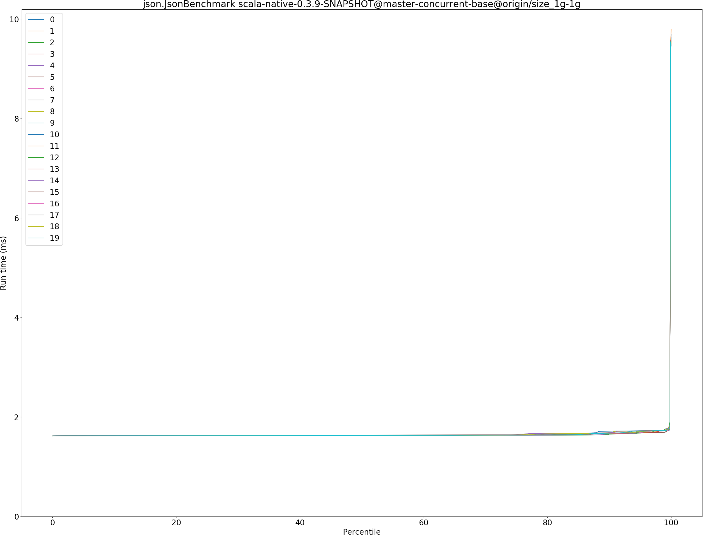
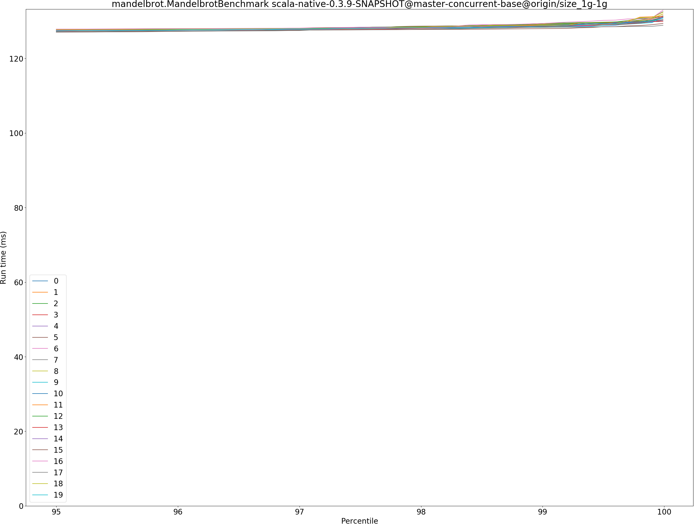

# Summary
## Benchmark run time (ms) at 50 percentile 

|name | scala-native-0.3.9-SNAPSHOT@master-concurrent-base@origin/size_1g-1g|
| -- | -- |
|[bounce.BounceBenchmark](#bouncebouncebenchmark)|0.0608|
|[brainfuck.BrainfuckBenchmark](#brainfuckbrainfuckbenchmark)|3.2888|
|[cd.CDBenchmark](#cdcdbenchmark)|31.5097|
|[deltablue.DeltaBlueBenchmark](#deltabluedeltabluebenchmark)|0.2325|
|[gcbench.GCBenchBenchmark](#gcbenchgcbenchbenchmark)|105.8854|
|[json.JsonBenchmark](#jsonjsonbenchmark)|1.6301|
|[kmeans.KmeansBenchmark](#kmeanskmeansbenchmark)|51.9209|
|[mandelbrot.MandelbrotBenchmark](#mandelbrotmandelbrotbenchmark)|126.1105|
|[nbody.NbodyBenchmark](#nbodynbodybenchmark)|39.3838|
|[permute.PermuteBenchmark](#permutepermutebenchmark)|0.2762|
|[queens.QueensBenchmark](#queensqueensbenchmark)|0.1204|
|[richards.RichardsBenchmark](#richardsrichardsbenchmark)|0.0949|
|[sudoku.SudokuBenchmark](#sudokusudokubenchmark)|2.4403|
|[tracer.TracerBenchmark](#tracertracerbenchmark)|0.8200|
| __Geometrical mean:__||
## Benchmark run time (ms) at 90 percentile 

|name | scala-native-0.3.9-SNAPSHOT@master-concurrent-base@origin/size_1g-1g|
| -- | -- |
|[bounce.BounceBenchmark](#bouncebouncebenchmark)|0.0623|
|[brainfuck.BrainfuckBenchmark](#brainfuckbrainfuckbenchmark)|3.3789|
|[cd.CDBenchmark](#cdcdbenchmark)|32.7606|
|[deltablue.DeltaBlueBenchmark](#deltabluedeltabluebenchmark)|0.2382|
|[gcbench.GCBenchBenchmark](#gcbenchgcbenchbenchmark)|113.6988|
|[json.JsonBenchmark](#jsonjsonbenchmark)|1.6732|
|[kmeans.KmeansBenchmark](#kmeanskmeansbenchmark)|53.0932|
|[mandelbrot.MandelbrotBenchmark](#mandelbrotmandelbrotbenchmark)|126.8113|
|[nbody.NbodyBenchmark](#nbodynbodybenchmark)|40.2875|
|[permute.PermuteBenchmark](#permutepermutebenchmark)|0.2827|
|[queens.QueensBenchmark](#queensqueensbenchmark)|0.1228|
|[richards.RichardsBenchmark](#richardsrichardsbenchmark)|0.0978|
|[sudoku.SudokuBenchmark](#sudokusudokubenchmark)|2.5145|
|[tracer.TracerBenchmark](#tracertracerbenchmark)|0.8439|
| __Geometrical mean:__||
## Benchmark run time (ms) at 99 percentile 

|name | scala-native-0.3.9-SNAPSHOT@master-concurrent-base@origin/size_1g-1g|
| -- | -- |
|[bounce.BounceBenchmark](#bouncebouncebenchmark)|0.0646|
|[brainfuck.BrainfuckBenchmark](#brainfuckbrainfuckbenchmark)|3.4959|
|[cd.CDBenchmark](#cdcdbenchmark)|39.6485|
|[deltablue.DeltaBlueBenchmark](#deltabluedeltabluebenchmark)|0.2498|
|[gcbench.GCBenchBenchmark](#gcbenchgcbenchbenchmark)|114.9839|
|[json.JsonBenchmark](#jsonjsonbenchmark)|1.7300|
|[kmeans.KmeansBenchmark](#kmeanskmeansbenchmark)|61.7564|
|[mandelbrot.MandelbrotBenchmark](#mandelbrotmandelbrotbenchmark)|128.8678|
|[nbody.NbodyBenchmark](#nbodynbodybenchmark)|41.8785|
|[permute.PermuteBenchmark](#permutepermutebenchmark)|0.2978|
|[queens.QueensBenchmark](#queensqueensbenchmark)|0.1272|
|[richards.RichardsBenchmark](#richardsrichardsbenchmark)|0.1031|
|[sudoku.SudokuBenchmark](#sudokusudokubenchmark)|2.6030|
|[tracer.TracerBenchmark](#tracertracerbenchmark)|0.8840|
| __Geometrical mean:__||
## Benchmark run time (ms) at 99.9 percentile 

|name | scala-native-0.3.9-SNAPSHOT@master-concurrent-base@origin/size_1g-1g|
| -- | -- |
|[bounce.BounceBenchmark](#bouncebouncebenchmark)|0.0841|
|[brainfuck.BrainfuckBenchmark](#brainfuckbrainfuckbenchmark)|11.0497|
|[cd.CDBenchmark](#cdcdbenchmark)|40.5471|
|[deltablue.DeltaBlueBenchmark](#deltabluedeltabluebenchmark)|0.2866|
|[gcbench.GCBenchBenchmark](#gcbenchgcbenchbenchmark)|115.9149|
|[json.JsonBenchmark](#jsonjsonbenchmark)|9.5227|
|[kmeans.KmeansBenchmark](#kmeanskmeansbenchmark)|63.6746|
|[mandelbrot.MandelbrotBenchmark](#mandelbrotmandelbrotbenchmark)|130.8670|
|[nbody.NbodyBenchmark](#nbodynbodybenchmark)|47.8483|
|[permute.PermuteBenchmark](#permutepermutebenchmark)|0.3319|
|[queens.QueensBenchmark](#queensqueensbenchmark)|0.1550|
|[richards.RichardsBenchmark](#richardsrichardsbenchmark)|0.1308|
|[sudoku.SudokuBenchmark](#sudokusudokubenchmark)|2.8251|
|[tracer.TracerBenchmark](#tracertracerbenchmark)|8.5992|
| __Geometrical mean:__||
## Benchmark total run time (ms) 

|name | scala-native-0.3.9-SNAPSHOT@master-concurrent-base@origin/size_1g-1g|
| -- | -- |
|[bounce.BounceBenchmark](#bouncebouncebenchmark)|1220.6745|
|[brainfuck.BrainfuckBenchmark](#brainfuckbrainfuckbenchmark)|66786.5276|
|[cd.CDBenchmark](#cdcdbenchmark)|644172.7054|
|[deltablue.DeltaBlueBenchmark](#deltabluedeltabluebenchmark)|4678.7621|
|[gcbench.GCBenchBenchmark](#gcbenchgcbenchbenchmark)|2098783.9745|
|[json.JsonBenchmark](#jsonjsonbenchmark)|33089.1696|
|[kmeans.KmeansBenchmark](#kmeanskmeansbenchmark)|1046185.1819|
|[mandelbrot.MandelbrotBenchmark](#mandelbrotmandelbrotbenchmark)|2526501.5316|
|[nbody.NbodyBenchmark](#nbodynbodybenchmark)|793053.0000|
|[permute.PermuteBenchmark](#permutepermutebenchmark)|5553.1130|
|[queens.QueensBenchmark](#queensqueensbenchmark)|2409.7053|
|[richards.RichardsBenchmark](#richardsrichardsbenchmark)|1910.2981|
|[sudoku.SudokuBenchmark](#sudokusudokubenchmark)|49323.4374|
|[tracer.TracerBenchmark](#tracertracerbenchmark)|16944.2481|
| __Geometrical mean:__||
# Individual benchmarks
## bounce.BounceBenchmark

## brainfuck.BrainfuckBenchmark

## cd.CDBenchmark

## deltablue.DeltaBlueBenchmark

## gcbench.GCBenchBenchmark

## json.JsonBenchmark

## kmeans.KmeansBenchmark

## mandelbrot.MandelbrotBenchmark

## nbody.NbodyBenchmark

## permute.PermuteBenchmark

## queens.QueensBenchmark

## richards.RichardsBenchmark

## sudoku.SudokuBenchmark

## tracer.TracerBenchmark

