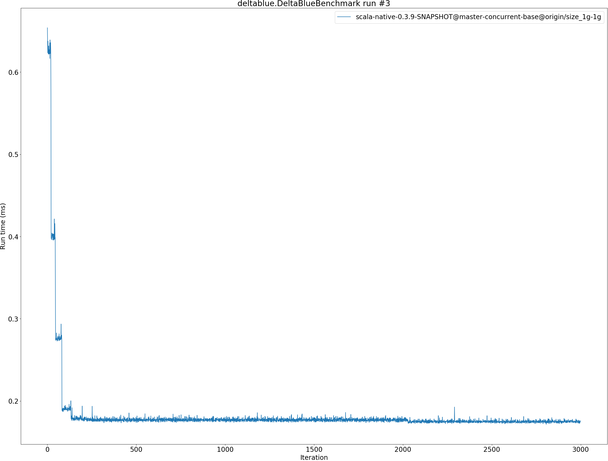
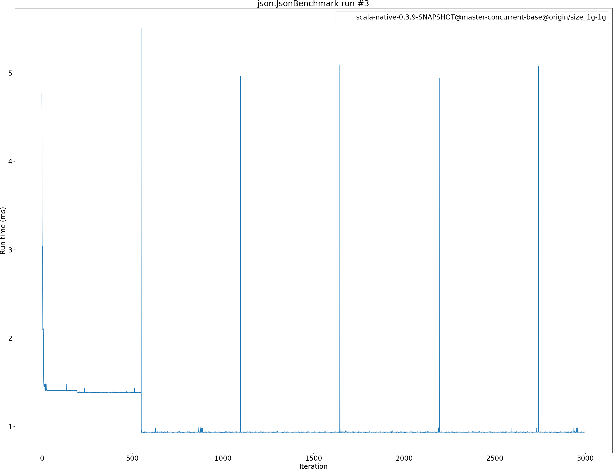
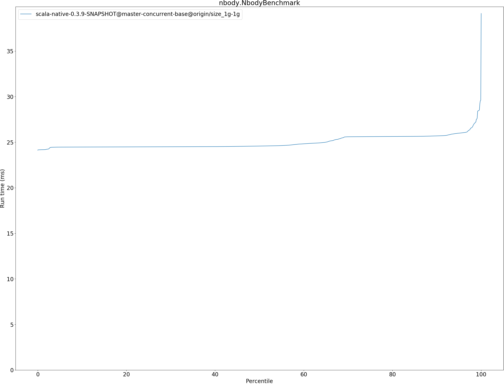
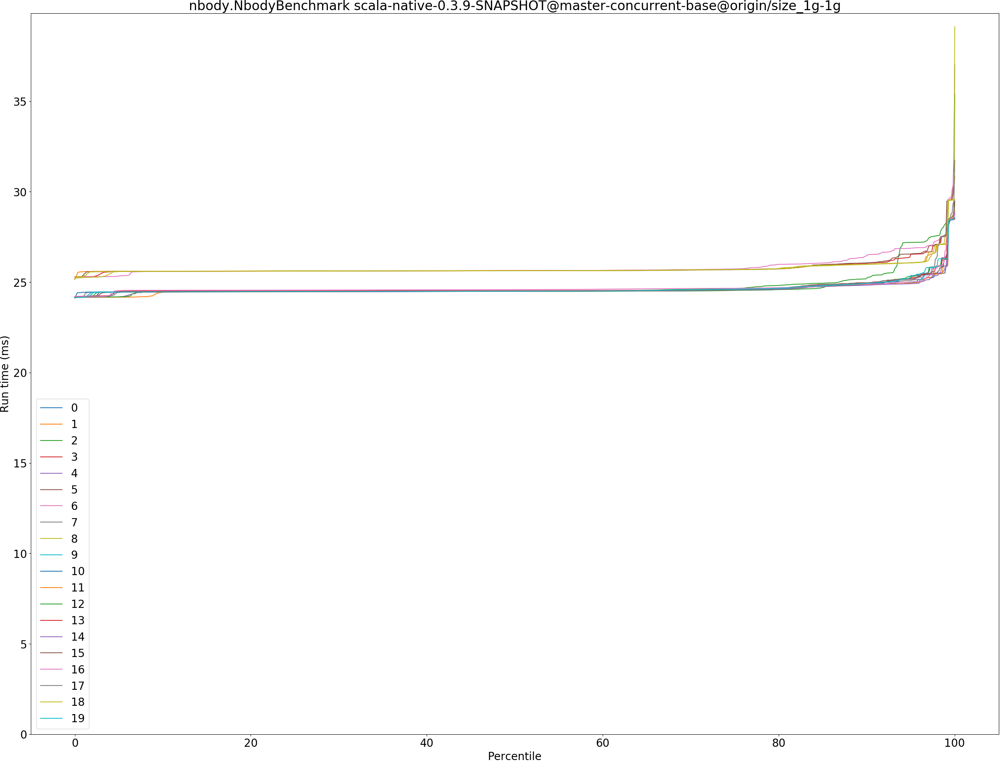
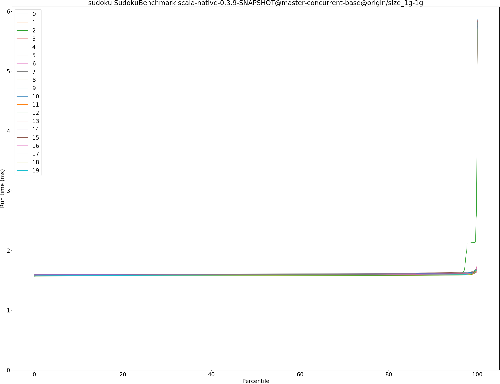
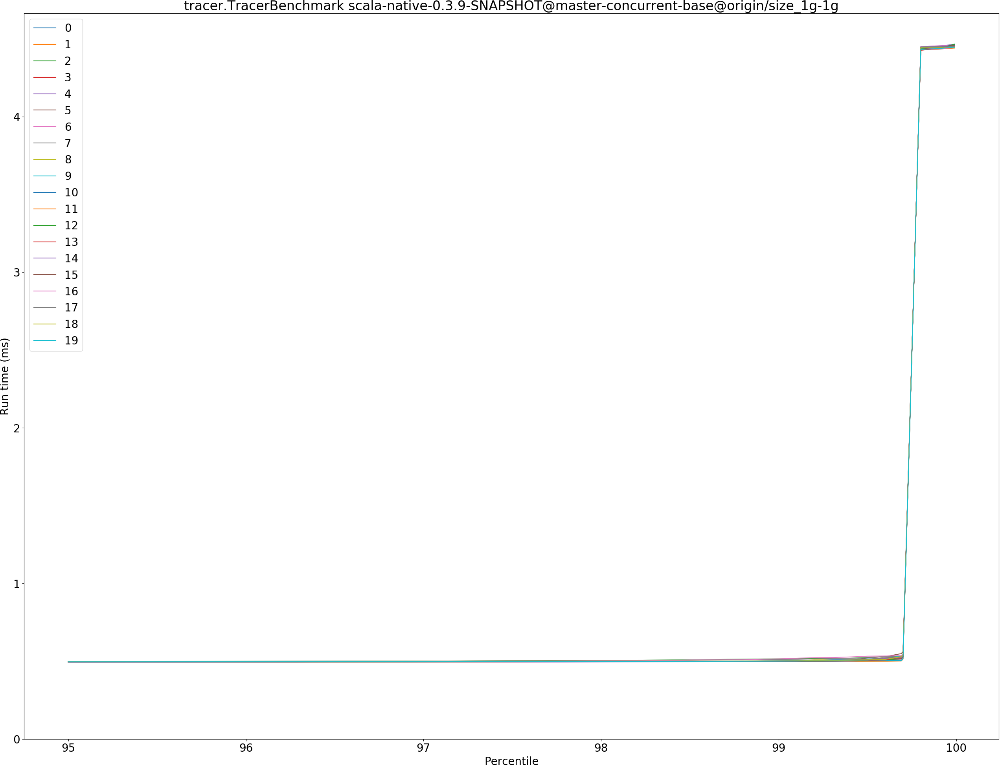

# Summary
## Benchmark run time (ms) at 50 percentile 

|name | scala-native-0.3.9-SNAPSHOT@master-concurrent-base@origin/size_1g-1g|
| -- | -- |
|[bounce.BounceBenchmark](#bouncebouncebenchmark)|0.0410|
|[brainfuck.BrainfuckBenchmark](#brainfuckbrainfuckbenchmark)|2.3728|
|[cd.CDBenchmark](#cdcdbenchmark)|17.0053|
|[deltablue.DeltaBlueBenchmark](#deltabluedeltabluebenchmark)|0.1814|
|[gcbench.GCBenchBenchmark](#gcbenchgcbenchbenchmark)|66.1548|
|[json.JsonBenchmark](#jsonjsonbenchmark)|0.9358|
|[kmeans.KmeansBenchmark](#kmeanskmeansbenchmark)|36.0690|
|[mandelbrot.MandelbrotBenchmark](#mandelbrotmandelbrotbenchmark)|100.7072|
|[nbody.NbodyBenchmark](#nbodynbodybenchmark)|24.5717|
|[permute.PermuteBenchmark](#permutepermutebenchmark)|0.2098|
|[queens.QueensBenchmark](#queensqueensbenchmark)|0.0510|
|[richards.RichardsBenchmark](#richardsrichardsbenchmark)|0.0603|
|[sudoku.SudokuBenchmark](#sudokusudokubenchmark)|1.5931|
|[tracer.TracerBenchmark](#tracertracerbenchmark)|0.4879|
| __Geometrical mean:__||
## Benchmark run time (ms) at 90 percentile 

|name | scala-native-0.3.9-SNAPSHOT@master-concurrent-base@origin/size_1g-1g|
| -- | -- |
|[bounce.BounceBenchmark](#bouncebouncebenchmark)|0.0423|
|[brainfuck.BrainfuckBenchmark](#brainfuckbrainfuckbenchmark)|2.4765|
|[cd.CDBenchmark](#cdcdbenchmark)|17.1122|
|[deltablue.DeltaBlueBenchmark](#deltabluedeltabluebenchmark)|0.1852|
|[gcbench.GCBenchBenchmark](#gcbenchgcbenchbenchmark)|66.8558|
|[json.JsonBenchmark](#jsonjsonbenchmark)|0.9407|
|[kmeans.KmeansBenchmark](#kmeanskmeansbenchmark)|36.6244|
|[mandelbrot.MandelbrotBenchmark](#mandelbrotmandelbrotbenchmark)|100.7837|
|[nbody.NbodyBenchmark](#nbodynbodybenchmark)|25.6886|
|[permute.PermuteBenchmark](#permutepermutebenchmark)|0.2121|
|[queens.QueensBenchmark](#queensqueensbenchmark)|0.0527|
|[richards.RichardsBenchmark](#richardsrichardsbenchmark)|0.0627|
|[sudoku.SudokuBenchmark](#sudokusudokubenchmark)|1.6082|
|[tracer.TracerBenchmark](#tracertracerbenchmark)|0.4941|
| __Geometrical mean:__||
## Benchmark run time (ms) at 99 percentile 

|name | scala-native-0.3.9-SNAPSHOT@master-concurrent-base@origin/size_1g-1g|
| -- | -- |
|[bounce.BounceBenchmark](#bouncebouncebenchmark)|0.0441|
|[brainfuck.BrainfuckBenchmark](#brainfuckbrainfuckbenchmark)|2.9974|
|[cd.CDBenchmark](#cdcdbenchmark)|21.9642|
|[deltablue.DeltaBlueBenchmark](#deltabluedeltabluebenchmark)|0.1883|
|[gcbench.GCBenchBenchmark](#gcbenchgcbenchbenchmark)|77.4812|
|[json.JsonBenchmark](#jsonjsonbenchmark)|0.9670|
|[kmeans.KmeansBenchmark](#kmeanskmeansbenchmark)|49.0999|
|[mandelbrot.MandelbrotBenchmark](#mandelbrotmandelbrotbenchmark)|104.3348|
|[nbody.NbodyBenchmark](#nbodynbodybenchmark)|27.5265|
|[permute.PermuteBenchmark](#permutepermutebenchmark)|0.2169|
|[queens.QueensBenchmark](#queensqueensbenchmark)|0.0544|
|[richards.RichardsBenchmark](#richardsrichardsbenchmark)|0.0658|
|[sudoku.SudokuBenchmark](#sudokusudokubenchmark)|1.6337|
|[tracer.TracerBenchmark](#tracertracerbenchmark)|0.5023|
| __Geometrical mean:__||
## Benchmark run time (ms) at 99.9 percentile 

|name | scala-native-0.3.9-SNAPSHOT@master-concurrent-base@origin/size_1g-1g|
| -- | -- |
|[bounce.BounceBenchmark](#bouncebouncebenchmark)|0.0462|
|[brainfuck.BrainfuckBenchmark](#brainfuckbrainfuckbenchmark)|6.5612|
|[cd.CDBenchmark](#cdcdbenchmark)|22.2065|
|[deltablue.DeltaBlueBenchmark](#deltabluedeltabluebenchmark)|0.1980|
|[gcbench.GCBenchBenchmark](#gcbenchgcbenchbenchmark)|79.0555|
|[json.JsonBenchmark](#jsonjsonbenchmark)|4.9613|
|[kmeans.KmeansBenchmark](#kmeanskmeansbenchmark)|52.1409|
|[mandelbrot.MandelbrotBenchmark](#mandelbrotmandelbrotbenchmark)|108.2594|
|[nbody.NbodyBenchmark](#nbodynbodybenchmark)|29.5974|
|[permute.PermuteBenchmark](#permutepermutebenchmark)|0.2301|
|[queens.QueensBenchmark](#queensqueensbenchmark)|0.0560|
|[richards.RichardsBenchmark](#richardsrichardsbenchmark)|0.0692|
|[sudoku.SudokuBenchmark](#sudokusudokubenchmark)|3.5571|
|[tracer.TracerBenchmark](#tracertracerbenchmark)|4.4471|
| __Geometrical mean:__||
## Benchmark total run time (ms) 

|name | scala-native-0.3.9-SNAPSHOT@master-concurrent-base@origin/size_1g-1g|
| -- | -- |
|[bounce.BounceBenchmark](#bouncebouncebenchmark)|817.8376|
|[brainfuck.BrainfuckBenchmark](#brainfuckbrainfuckbenchmark)|48384.6665|
|[cd.CDBenchmark](#cdcdbenchmark)|346446.6505|
|[deltablue.DeltaBlueBenchmark](#deltabluedeltabluebenchmark)|3597.3118|
|[gcbench.GCBenchBenchmark](#gcbenchgcbenchbenchmark)|1259126.9785|
|[json.JsonBenchmark](#jsonjsonbenchmark)|18905.6686|
|[kmeans.KmeansBenchmark](#kmeanskmeansbenchmark)|720405.6537|
|[mandelbrot.MandelbrotBenchmark](#mandelbrotmandelbrotbenchmark)|2015996.6238|
|[nbody.NbodyBenchmark](#nbodynbodybenchmark)|499501.7361|
|[permute.PermuteBenchmark](#permutepermutebenchmark)|4201.0063|
|[queens.QueensBenchmark](#queensqueensbenchmark)|1026.0478|
|[richards.RichardsBenchmark](#richardsrichardsbenchmark)|1213.8292|
|[sudoku.SudokuBenchmark](#sudokusudokubenchmark)|31970.6633|
|[tracer.TracerBenchmark](#tracertracerbenchmark)|10002.6828|
| __Geometrical mean:__||
# Individual benchmarks
## bounce.BounceBenchmark

## brainfuck.BrainfuckBenchmark

## cd.CDBenchmark

## deltablue.DeltaBlueBenchmark

## gcbench.GCBenchBenchmark

## json.JsonBenchmark

## kmeans.KmeansBenchmark

## mandelbrot.MandelbrotBenchmark

## nbody.NbodyBenchmark

## permute.PermuteBenchmark

## queens.QueensBenchmark

## richards.RichardsBenchmark

## sudoku.SudokuBenchmark

## tracer.TracerBenchmark

