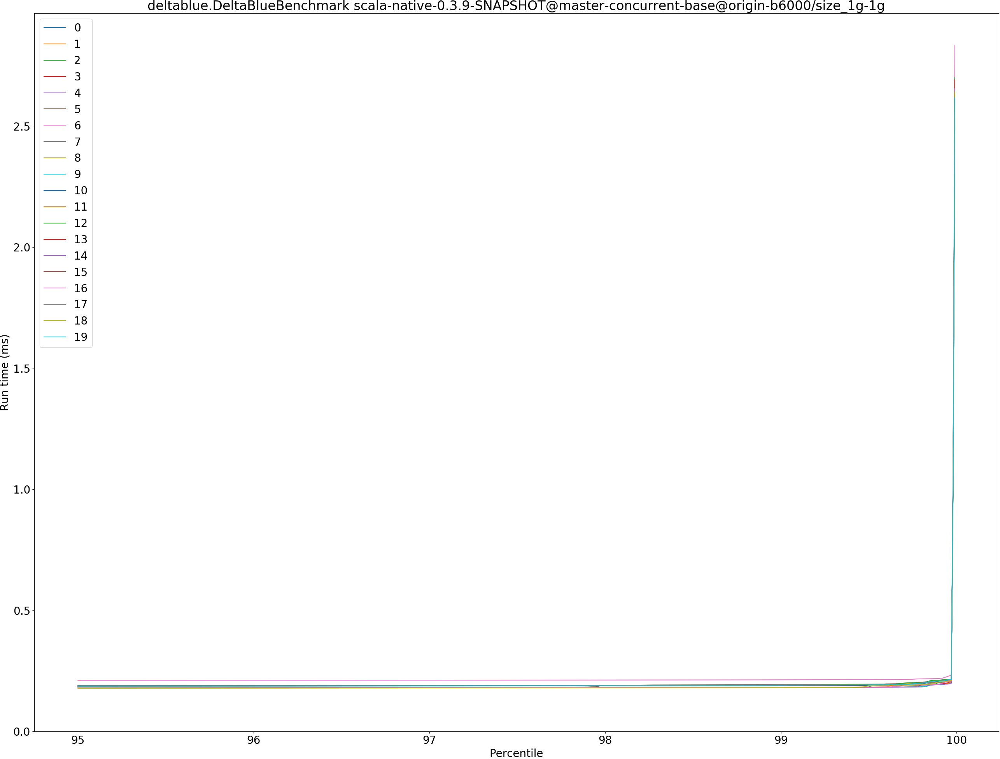
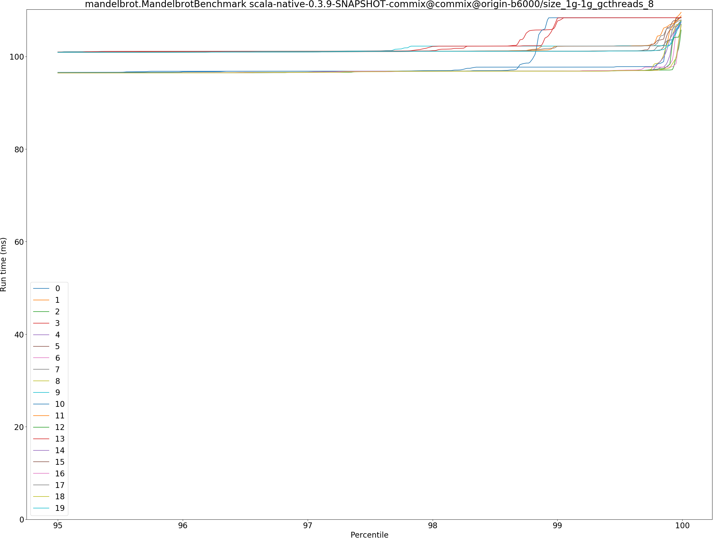
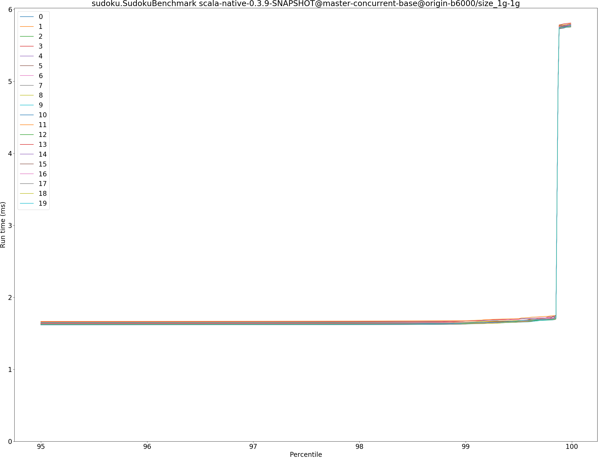

# Summary
## Benchmark run time (ms) at 50 percentile 

|name | scala-native-0.3.9-SNAPSHOT@master-concurrent-base@origin-b6000/size_1g-1g | scala-native-0.3.9-SNAPSHOT-commix@commix@origin-b6000/size_1g-1g_gcthreads_8 | |
| -- | -- | -- | -- |
|[bounce.BounceBenchmark](#bouncebouncebenchmark)|0.0429|0.0406|__-5.44%__|
|[brainfuck.BrainfuckBenchmark](#brainfuckbrainfuckbenchmark)|2.3899|2.4005|+0.44%|
|[cd.CDBenchmark](#cdcdbenchmark)|16.7628|16.7054|__-0.34%__|
|[deltablue.DeltaBlueBenchmark](#deltabluedeltabluebenchmark)|0.1829|0.1885|+3.06%|
|[gcbench.GCBenchBenchmark](#gcbenchgcbenchbenchmark)|66.6452|63.6012|__-4.57%__|
|[json.JsonBenchmark](#jsonjsonbenchmark)|1.0295|0.9883|__-4.00%__|
|[kmeans.KmeansBenchmark](#kmeanskmeansbenchmark)|36.5645|36.5721|+0.02%|
|[mandelbrot.MandelbrotBenchmark](#mandelbrotmandelbrotbenchmark)|100.7069|100.7988|+0.09%|
|[nbody.NbodyBenchmark](#nbodynbodybenchmark)|25.5814|25.5735|__-0.03%__|
|[permute.PermuteBenchmark](#permutepermutebenchmark)|0.1446|0.1436|__-0.70%__|
|[queens.QueensBenchmark](#queensqueensbenchmark)|0.0518|0.0513|__-0.92%__|
|[richards.RichardsBenchmark](#richardsrichardsbenchmark)|0.0601|0.0592|__-1.60%__|
|[sudoku.SudokuBenchmark](#sudokusudokubenchmark)|1.6193|1.6239|+0.29%|
|[tracer.TracerBenchmark](#tracertracerbenchmark)|0.4890|0.4897|+0.16%|
| __Geometrical mean:__|| |__-0.99%__|
## Benchmark run time (ms) at 90 percentile 

|name | scala-native-0.3.9-SNAPSHOT@master-concurrent-base@origin-b6000/size_1g-1g | scala-native-0.3.9-SNAPSHOT-commix@commix@origin-b6000/size_1g-1g_gcthreads_8 | |
| -- | -- | -- | -- |
|[bounce.BounceBenchmark](#bouncebouncebenchmark)|0.0439|0.0416|__-5.11%__|
|[brainfuck.BrainfuckBenchmark](#brainfuckbrainfuckbenchmark)|2.4247|2.4572|+1.34%|
|[cd.CDBenchmark](#cdcdbenchmark)|16.8594|16.8061|__-0.32%__|
|[deltablue.DeltaBlueBenchmark](#deltabluedeltabluebenchmark)|0.1868|0.1907|+2.09%|
|[gcbench.GCBenchBenchmark](#gcbenchgcbenchbenchmark)|67.6614|64.6444|__-4.46%__|
|[json.JsonBenchmark](#jsonjsonbenchmark)|1.0345|0.9932|__-3.99%__|
|[kmeans.KmeansBenchmark](#kmeanskmeansbenchmark)|36.9379|36.9656|+0.08%|
|[mandelbrot.MandelbrotBenchmark](#mandelbrotmandelbrotbenchmark)|100.7811|100.8805|+0.10%|
|[nbody.NbodyBenchmark](#nbodynbodybenchmark)|25.9871|25.9480|__-0.15%__|
|[permute.PermuteBenchmark](#permutepermutebenchmark)|0.2094|0.2082|__-0.58%__|
|[queens.QueensBenchmark](#queensqueensbenchmark)|0.0537|0.0533|__-0.88%__|
|[richards.RichardsBenchmark](#richardsrichardsbenchmark)|0.0626|0.0618|__-1.35%__|
|[sudoku.SudokuBenchmark](#sudokusudokubenchmark)|1.6409|1.6457|+0.30%|
|[tracer.TracerBenchmark](#tracertracerbenchmark)|0.4968|0.4960|__-0.15%__|
| __Geometrical mean:__|| |__-0.96%__|
## Benchmark run time (ms) at 99 percentile 

|name | scala-native-0.3.9-SNAPSHOT@master-concurrent-base@origin-b6000/size_1g-1g | scala-native-0.3.9-SNAPSHOT-commix@commix@origin-b6000/size_1g-1g_gcthreads_8 | |
| -- | -- | -- | -- |
|[bounce.BounceBenchmark](#bouncebouncebenchmark)|0.0456|0.0474|+3.95%|
|[brainfuck.BrainfuckBenchmark](#brainfuckbrainfuckbenchmark)|2.4758|2.5754|+4.02%|
|[cd.CDBenchmark](#cdcdbenchmark)|20.8334|18.1644|__-12.81%__|
|[deltablue.DeltaBlueBenchmark](#deltabluedeltabluebenchmark)|0.2089|0.2015|__-3.54%__|
|[gcbench.GCBenchBenchmark](#gcbenchgcbenchbenchmark)|74.9566|65.5414|__-12.56%__|
|[json.JsonBenchmark](#jsonjsonbenchmark)|1.2525|1.0517|__-16.03%__|
|[kmeans.KmeansBenchmark](#kmeanskmeansbenchmark)|41.9869|51.1793|+21.89%|
|[mandelbrot.MandelbrotBenchmark](#mandelbrotmandelbrotbenchmark)|101.0823|101.1286|+0.05%|
|[nbody.NbodyBenchmark](#nbodynbodybenchmark)|27.7454|27.1024|__-2.32%__|
|[permute.PermuteBenchmark](#permutepermutebenchmark)|0.2126|0.2118|__-0.34%__|
|[queens.QueensBenchmark](#queensqueensbenchmark)|0.0554|0.0549|__-1.01%__|
|[richards.RichardsBenchmark](#richardsrichardsbenchmark)|0.0658|0.0647|__-1.64%__|
|[sudoku.SudokuBenchmark](#sudokusudokubenchmark)|1.6635|1.6715|+0.48%|
|[tracer.TracerBenchmark](#tracertracerbenchmark)|0.5815|0.5214|__-10.33%__|
| __Geometrical mean:__|| |__-2.56%__|
## Benchmark run time (ms) at 99.9 percentile 

|name | scala-native-0.3.9-SNAPSHOT@master-concurrent-base@origin-b6000/size_1g-1g | scala-native-0.3.9-SNAPSHOT-commix@commix@origin-b6000/size_1g-1g_gcthreads_8 | |
| -- | -- | -- | -- |
|[bounce.BounceBenchmark](#bouncebouncebenchmark)|0.0472|0.0500|+5.99%|
|[brainfuck.BrainfuckBenchmark](#brainfuckbrainfuckbenchmark)|6.6929|3.8112|__-43.06%__|
|[cd.CDBenchmark](#cdcdbenchmark)|21.6368|18.2757|__-15.53%__|
|[deltablue.DeltaBlueBenchmark](#deltabluedeltabluebenchmark)|0.2123|0.2898|+36.52%|
|[gcbench.GCBenchBenchmark](#gcbenchgcbenchbenchmark)|79.6935|74.9295|__-5.98%__|
|[json.JsonBenchmark](#jsonjsonbenchmark)|5.1201|1.9265|__-62.37%__|
|[kmeans.KmeansBenchmark](#kmeanskmeansbenchmark)|51.3554|51.7426|+0.75%|
|[mandelbrot.MandelbrotBenchmark](#mandelbrotmandelbrotbenchmark)|108.2541|108.3750|+0.11%|
|[nbody.NbodyBenchmark](#nbodynbodybenchmark)|36.0810|34.4574|__-4.50%__|
|[permute.PermuteBenchmark](#permutepermutebenchmark)|0.2203|0.2229|+1.15%|
|[queens.QueensBenchmark](#queensqueensbenchmark)|0.0573|0.0570|__-0.47%__|
|[richards.RichardsBenchmark](#richardsrichardsbenchmark)|0.0713|0.0690|__-3.29%__|
|[sudoku.SudokuBenchmark](#sudokusudokubenchmark)|5.7563|2.1905|__-61.95%__|
|[tracer.TracerBenchmark](#tracertracerbenchmark)|4.5241|1.6861|__-62.73%__|
| __Geometrical mean:__|| |__-21.67%__|
## Benchmark total run time (ms) 

|name | scala-native-0.3.9-SNAPSHOT@master-concurrent-base@origin-b6000/size_1g-1g | scala-native-0.3.9-SNAPSHOT-commix@commix@origin-b6000/size_1g-1g_gcthreads_8 | |
| -- | -- | -- | -- |
|[bounce.BounceBenchmark](#bouncebouncebenchmark)|3428.0045|3255.1362|__-5.04%__|
|[brainfuck.BrainfuckBenchmark](#brainfuckbrainfuckbenchmark)|193069.7176|191621.5768|__-0.75%__|
|[cd.CDBenchmark](#cdcdbenchmark)|1362506.9426|1341812.6386|__-1.52%__|
|[deltablue.DeltaBlueBenchmark](#deltabluedeltabluebenchmark)|14466.4993|14919.5521|+3.13%|
|[gcbench.GCBenchBenchmark](#gcbenchgcbenchbenchmark)|5057142.1648|4914356.5928|__-2.82%__|
|[json.JsonBenchmark](#jsonjsonbenchmark)|83175.0870|79430.5800|__-4.50%__|
|[kmeans.KmeansBenchmark](#kmeanskmeansbenchmark)|2940297.5759|2947458.4928|+0.24%|
|[mandelbrot.MandelbrotBenchmark](#mandelbrotmandelbrotbenchmark)|8060442.7661|7890661.8335|__-2.11%__|
|[nbody.NbodyBenchmark](#nbodynbodybenchmark)|2057473.5381|2034566.8330|__-1.11%__|
|[permute.PermuteBenchmark](#permutepermutebenchmark)|13629.7486|13618.4276|__-0.08%__|
|[queens.QueensBenchmark](#queensqueensbenchmark)|4173.6996|4135.7758|__-0.91%__|
|[richards.RichardsBenchmark](#richardsrichardsbenchmark)|4844.5918|4726.9869|__-2.43%__|
|[sudoku.SudokuBenchmark](#sudokusudokubenchmark)|130197.1103|130178.0819|__-0.01%__|
|[tracer.TracerBenchmark](#tracertracerbenchmark)|40347.7232|39498.9165|__-2.10%__|
| __Geometrical mean:__|| |__-1.45%__|
# Individual benchmarks
## bounce.BounceBenchmark

## brainfuck.BrainfuckBenchmark

## cd.CDBenchmark

## deltablue.DeltaBlueBenchmark

## gcbench.GCBenchBenchmark

## json.JsonBenchmark

## kmeans.KmeansBenchmark

## mandelbrot.MandelbrotBenchmark

## nbody.NbodyBenchmark

## permute.PermuteBenchmark

## queens.QueensBenchmark

## richards.RichardsBenchmark

## sudoku.SudokuBenchmark

## tracer.TracerBenchmark

