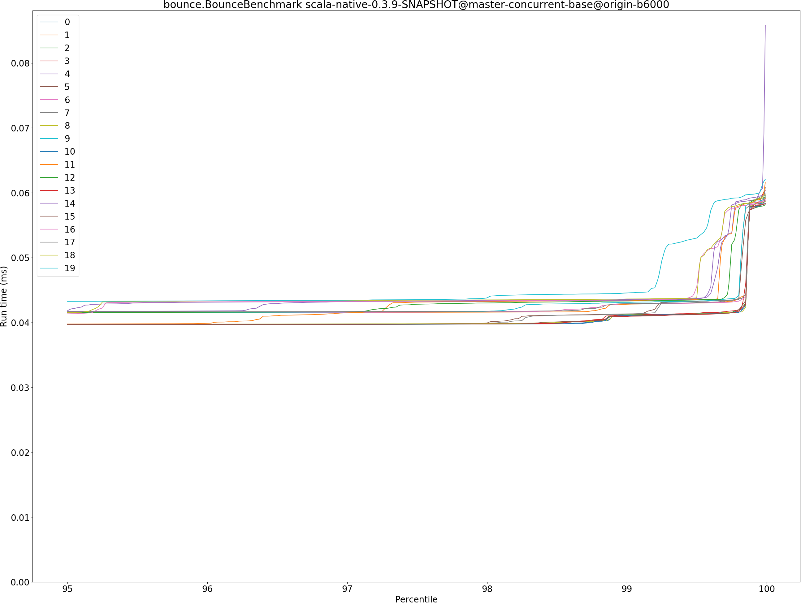
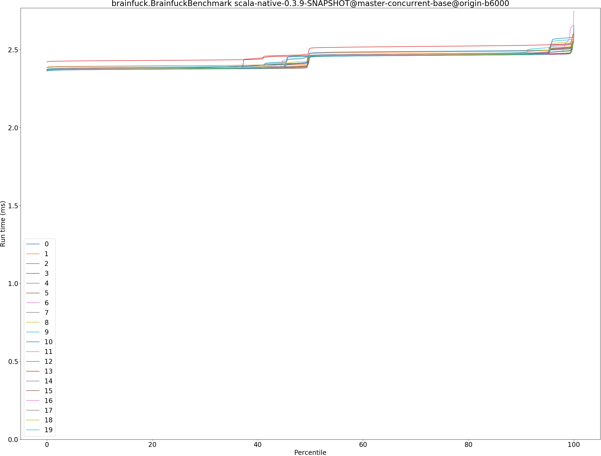
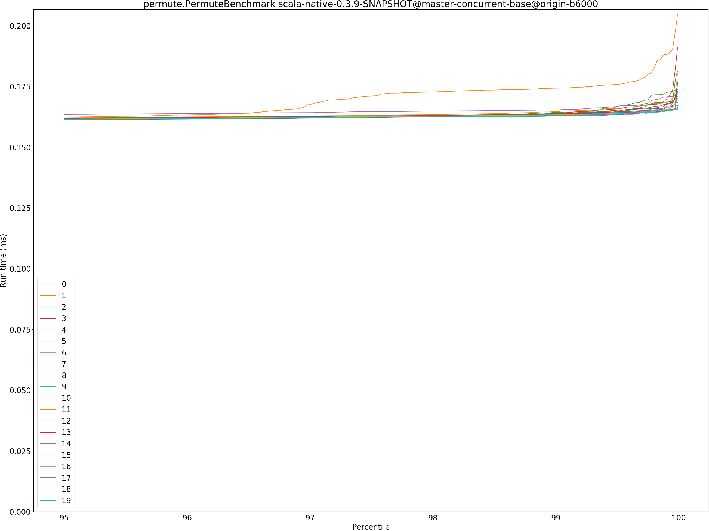
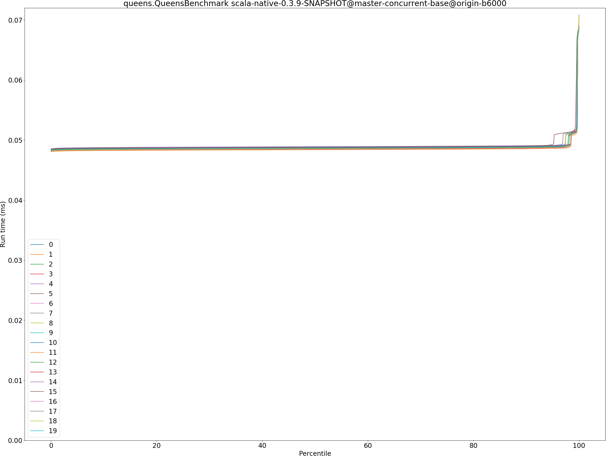
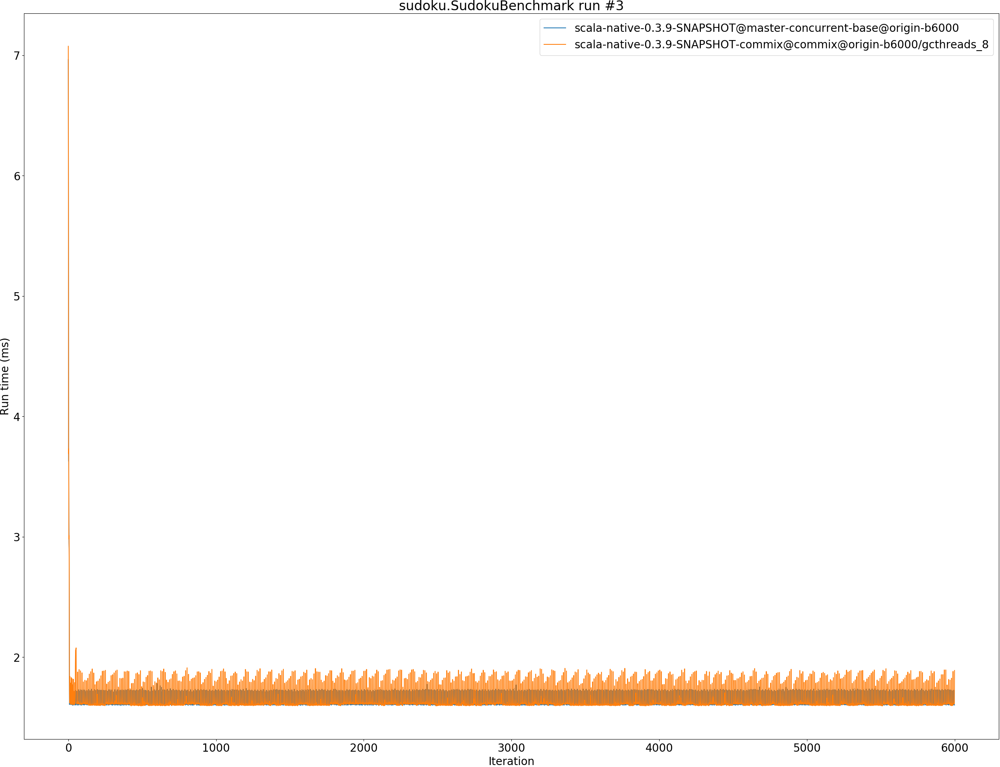
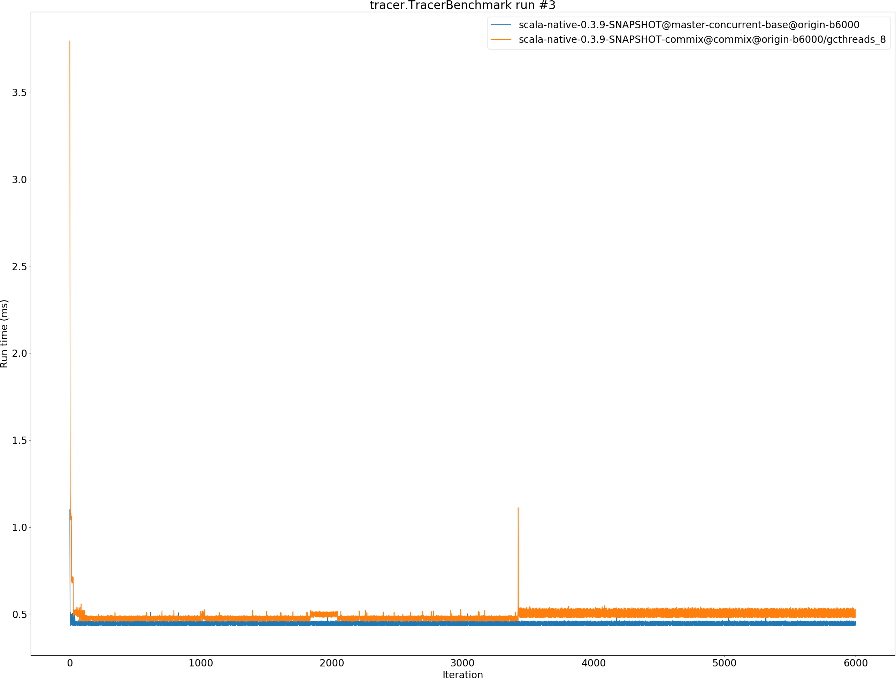
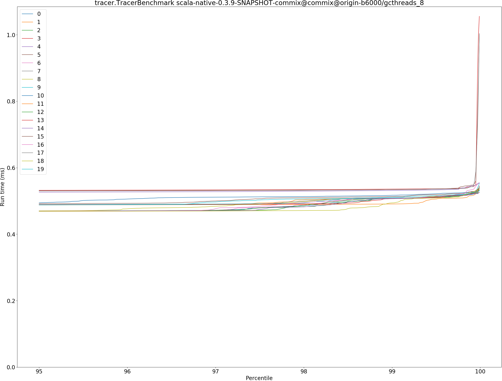

# Summary
## Benchmark run time (ms) at 50 percentile 

|name | scala-native-0.3.9-SNAPSHOT@master-concurrent-base@origin-b6000 | scala-native-0.3.9-SNAPSHOT-commix@commix@origin-b6000/gcthreads_8 | |
| -- | -- | -- | -- |
|[bounce.BounceBenchmark](#bouncebouncebenchmark)|0.0396|0.0374|__-5.61%__|
|[brainfuck.BrainfuckBenchmark](#brainfuckbrainfuckbenchmark)|2.4562|2.5528|+3.93%|
|[cd.CDBenchmark](#cdcdbenchmark)|16.4780|17.1015|+3.78%|
|[deltablue.DeltaBlueBenchmark](#deltabluedeltabluebenchmark)|0.1379|0.1424|+3.22%|
|[gcbench.GCBenchBenchmark](#gcbenchgcbenchbenchmark)|70.9499|59.0493|__-16.77%__|
|[json.JsonBenchmark](#jsonjsonbenchmark)|1.0751|0.9891|__-8.00%__|
|[kmeans.KmeansBenchmark](#kmeanskmeansbenchmark)|37.0695|37.3785|+0.83%|
|[mandelbrot.MandelbrotBenchmark](#mandelbrotmandelbrotbenchmark)|100.7224|100.8318|+0.11%|
|[nbody.NbodyBenchmark](#nbodynbodybenchmark)|25.6100|25.6202|+0.04%|
|[permute.PermuteBenchmark](#permutepermutebenchmark)|0.1440|0.1416|__-1.69%__|
|[queens.QueensBenchmark](#queensqueensbenchmark)|0.0487|0.0482|__-0.94%__|
|[richards.RichardsBenchmark](#richardsrichardsbenchmark)|0.0552|0.0543|__-1.60%__|
|[sudoku.SudokuBenchmark](#sudokusudokubenchmark)|1.6041|1.6211|+1.06%|
|[tracer.TracerBenchmark](#tracertracerbenchmark)|0.4560|0.4677|+2.55%|
| __Geometrical mean:__|| |__-1.52%__|
## Benchmark run time (ms) at 90 percentile 

|name | scala-native-0.3.9-SNAPSHOT@master-concurrent-base@origin-b6000 | scala-native-0.3.9-SNAPSHOT-commix@commix@origin-b6000/gcthreads_8 | |
| -- | -- | -- | -- |
|[bounce.BounceBenchmark](#bouncebouncebenchmark)|0.0414|0.0391|__-5.69%__|
|[brainfuck.BrainfuckBenchmark](#brainfuckbrainfuckbenchmark)|2.4831|2.5801|+3.91%|
|[cd.CDBenchmark](#cdcdbenchmark)|17.1467|17.2105|+0.37%|
|[deltablue.DeltaBlueBenchmark](#deltabluedeltabluebenchmark)|0.1439|0.1479|+2.81%|
|[gcbench.GCBenchBenchmark](#gcbenchgcbenchbenchmark)|74.1734|62.6314|__-15.56%__|
|[json.JsonBenchmark](#jsonjsonbenchmark)|1.0819|1.0367|__-4.18%__|
|[kmeans.KmeansBenchmark](#kmeanskmeansbenchmark)|38.8065|38.4194|__-1.00%__|
|[mandelbrot.MandelbrotBenchmark](#mandelbrotmandelbrotbenchmark)|100.7995|100.9062|+0.11%|
|[nbody.NbodyBenchmark](#nbodynbodybenchmark)|26.0123|26.0515|+0.15%|
|[permute.PermuteBenchmark](#permutepermutebenchmark)|0.1476|0.1481|+0.33%|
|[queens.QueensBenchmark](#queensqueensbenchmark)|0.0489|0.0484|__-1.00%__|
|[richards.RichardsBenchmark](#richardsrichardsbenchmark)|0.0591|0.0553|__-6.32%__|
|[sudoku.SudokuBenchmark](#sudokusudokubenchmark)|1.7130|1.7646|+3.01%|
|[tracer.TracerBenchmark](#tracertracerbenchmark)|0.4779|0.4886|+2.23%|
| __Geometrical mean:__|| |__-1.62%__|
## Benchmark run time (ms) at 99 percentile 

|name | scala-native-0.3.9-SNAPSHOT@master-concurrent-base@origin-b6000 | scala-native-0.3.9-SNAPSHOT-commix@commix@origin-b6000/gcthreads_8 | |
| -- | -- | -- | -- |
|[bounce.BounceBenchmark](#bouncebouncebenchmark)|0.0433|0.0408|__-5.84%__|
|[brainfuck.BrainfuckBenchmark](#brainfuckbrainfuckbenchmark)|2.5374|2.6537|+4.58%|
|[cd.CDBenchmark](#cdcdbenchmark)|17.3221|17.3779|+0.32%|
|[deltablue.DeltaBlueBenchmark](#deltabluedeltabluebenchmark)|0.1836|0.1838|+0.08%|
|[gcbench.GCBenchBenchmark](#gcbenchgcbenchbenchmark)|75.5893|64.2817|__-14.96%__|
|[json.JsonBenchmark](#jsonjsonbenchmark)|1.2621|1.2159|__-3.67%__|
|[kmeans.KmeansBenchmark](#kmeanskmeansbenchmark)|40.0877|38.9510|__-2.84%__|
|[mandelbrot.MandelbrotBenchmark](#mandelbrotmandelbrotbenchmark)|102.0983|101.2134|__-0.87%__|
|[nbody.NbodyBenchmark](#nbodynbodybenchmark)|27.1280|36.1093|+33.11%|
|[permute.PermuteBenchmark](#permutepermutebenchmark)|0.1638|0.1581|__-3.51%__|
|[queens.QueensBenchmark](#queensqueensbenchmark)|0.0513|0.0509|__-0.68%__|
|[richards.RichardsBenchmark](#richardsrichardsbenchmark)|0.0688|0.0603|__-12.38%__|
|[sudoku.SudokuBenchmark](#sudokusudokubenchmark)|1.7454|1.9042|+9.10%|
|[tracer.TracerBenchmark](#tracertracerbenchmark)|0.5717|0.5303|__-7.23%__|
| __Geometrical mean:__|| |__-0.89%__|
## Benchmark run time (ms) at 99.9 percentile 

|name | scala-native-0.3.9-SNAPSHOT@master-concurrent-base@origin-b6000 | scala-native-0.3.9-SNAPSHOT-commix@commix@origin-b6000/gcthreads_8 | |
| -- | -- | -- | -- |
|[bounce.BounceBenchmark](#bouncebouncebenchmark)|0.0585|0.0493|__-15.70%__|
|[brainfuck.BrainfuckBenchmark](#brainfuckbrainfuckbenchmark)|2.5771|3.1993|+24.15%|
|[cd.CDBenchmark](#cdcdbenchmark)|22.0399|18.1828|__-17.50%__|
|[deltablue.DeltaBlueBenchmark](#deltabluedeltabluebenchmark)|0.2065|0.2024|__-1.97%__|
|[gcbench.GCBenchBenchmark](#gcbenchgcbenchbenchmark)|79.7098|72.3195|__-9.27%__|
|[json.JsonBenchmark](#jsonjsonbenchmark)|1.3328|1.2793|__-4.01%__|
|[kmeans.KmeansBenchmark](#kmeanskmeansbenchmark)|42.3781|40.0107|__-5.59%__|
|[mandelbrot.MandelbrotBenchmark](#mandelbrotmandelbrotbenchmark)|108.2824|108.3949|+0.10%|
|[nbody.NbodyBenchmark](#nbodynbodybenchmark)|36.1461|36.9782|+2.30%|
|[permute.PermuteBenchmark](#permutepermutebenchmark)|0.1732|0.1758|+1.50%|
|[queens.QueensBenchmark](#queensqueensbenchmark)|0.0682|0.0596|__-12.61%__|
|[richards.RichardsBenchmark](#richardsrichardsbenchmark)|0.0766|0.0672|__-12.31%__|
|[sudoku.SudokuBenchmark](#sudokusudokubenchmark)|1.7780|1.9339|+8.77%|
|[tracer.TracerBenchmark](#tracertracerbenchmark)|0.5757|0.5364|__-6.83%__|
| __Geometrical mean:__|| |__-4.04%__|
## Benchmark total run time (ms) 

|name | scala-native-0.3.9-SNAPSHOT@master-concurrent-base@origin-b6000 | scala-native-0.3.9-SNAPSHOT-commix@commix@origin-b6000/gcthreads_8 | |
| -- | -- | -- | -- |
|[bounce.BounceBenchmark](#bouncebouncebenchmark)|3223.4169|3037.8845|__-5.76%__|
|[brainfuck.BrainfuckBenchmark](#brainfuckbrainfuckbenchmark)|194459.3130|199055.1218|+2.36%|
|[cd.CDBenchmark](#cdcdbenchmark)|1336551.4466|1366638.1938|+2.25%|
|[deltablue.DeltaBlueBenchmark](#deltabluedeltabluebenchmark)|11278.6453|11581.3620|+2.68%|
|[gcbench.GCBenchBenchmark](#gcbenchgcbenchbenchmark)|5629415.5164|4821513.5748|__-14.35%__|
|[json.JsonBenchmark](#jsonjsonbenchmark)|85105.1825|80456.3735|__-5.46%__|
|[kmeans.KmeansBenchmark](#kmeanskmeansbenchmark)|2990914.8812|2991672.8662|+0.03%|
|[mandelbrot.MandelbrotBenchmark](#mandelbrotmandelbrotbenchmark)|7956400.9153|8070688.8424|+1.44%|
|[nbody.NbodyBenchmark](#nbodynbodybenchmark)|2057893.7259|2071657.7907|+0.67%|
|[permute.PermuteBenchmark](#permutepermutebenchmark)|11633.7250|11449.8066|__-1.58%__|
|[queens.QueensBenchmark](#queensqueensbenchmark)|3902.0473|3865.8546|__-0.93%__|
|[richards.RichardsBenchmark](#richardsrichardsbenchmark)|4523.5452|4310.4118|__-4.71%__|
|[sudoku.SudokuBenchmark](#sudokusudokubenchmark)|128436.1531|131919.5523|+2.71%|
|[tracer.TracerBenchmark](#tracertracerbenchmark)|37102.1066|37796.7248|+1.87%|
| __Geometrical mean:__|| |__-1.46%__|
# Individual benchmarks
## bounce.BounceBenchmark

## brainfuck.BrainfuckBenchmark

## cd.CDBenchmark

## deltablue.DeltaBlueBenchmark

## gcbench.GCBenchBenchmark

## json.JsonBenchmark

## kmeans.KmeansBenchmark

## mandelbrot.MandelbrotBenchmark

## nbody.NbodyBenchmark

## permute.PermuteBenchmark

## queens.QueensBenchmark

## richards.RichardsBenchmark

## sudoku.SudokuBenchmark

## tracer.TracerBenchmark

