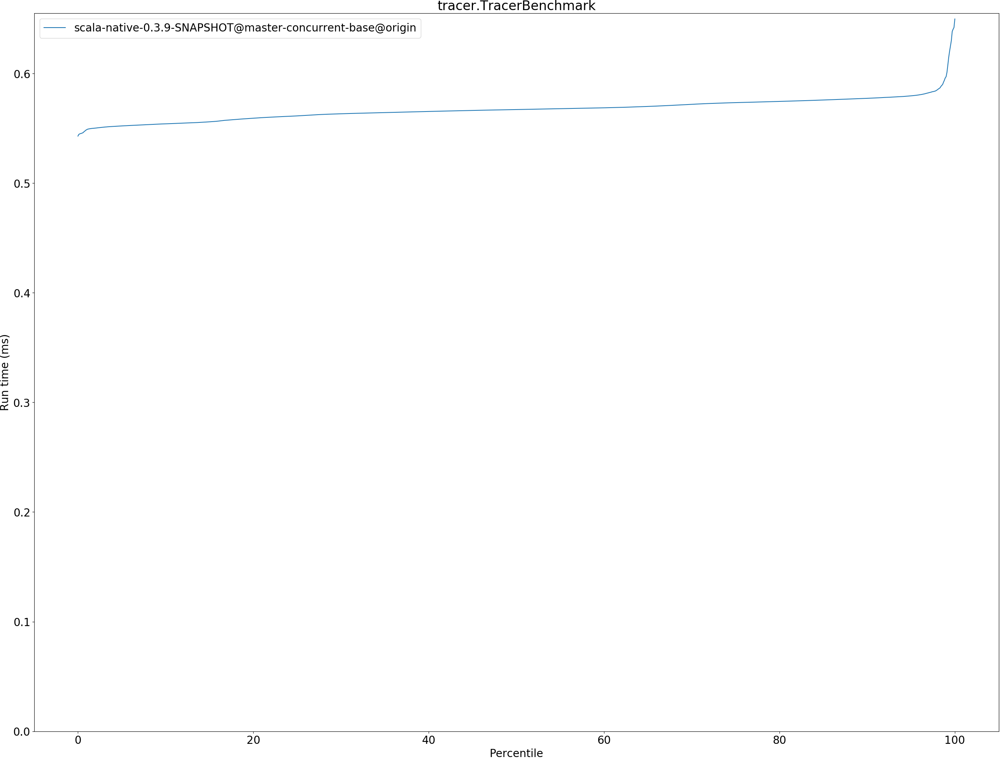
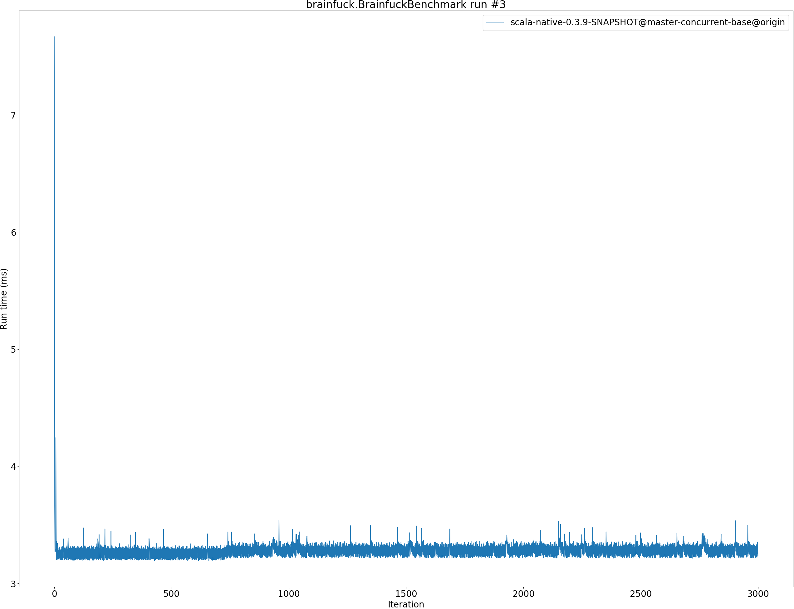
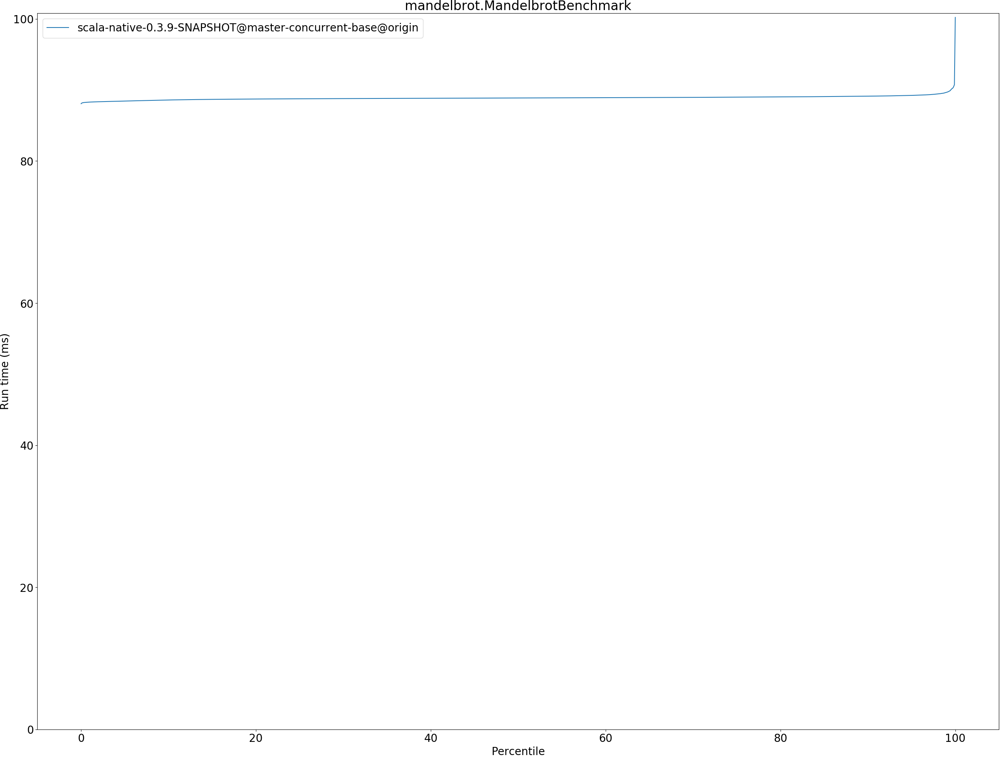
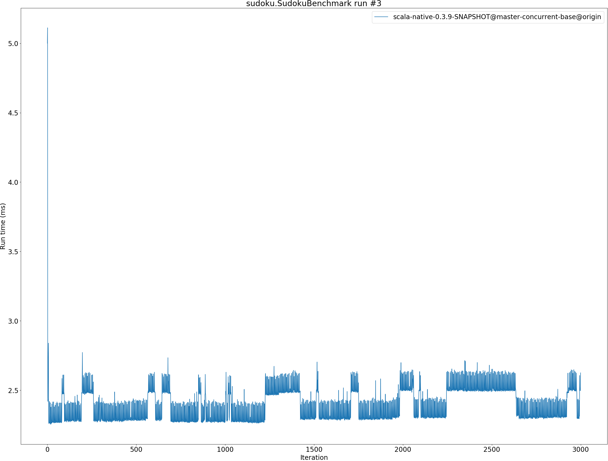

# Summary
## Benchmark run time (ms) at 50 percentile 

|name | scala-native-0.3.9-SNAPSHOT@master-concurrent-base@origin|
| -- | -- |
|[bounce.BounceBenchmark](#bouncebouncebenchmark)|0.0452|
|[richards.RichardsBenchmark](#richardsrichardsbenchmark)|0.0604|
|[queens.QueensBenchmark](#queensqueensbenchmark)|0.0823|
|[permute.PermuteBenchmark](#permutepermutebenchmark)|0.1937|
|[deltablue.DeltaBlueBenchmark](#deltabluedeltabluebenchmark)|0.1830|
|[tracer.TracerBenchmark](#tracertracerbenchmark)|0.5671|
|[brainfuck.BrainfuckBenchmark](#brainfuckbrainfuckbenchmark)|3.2834|
|[json.JsonBenchmark](#jsonjsonbenchmark)|1.2530|
|[cd.CDBenchmark](#cdcdbenchmark)|22.9456|
|[kmeans.KmeansBenchmark](#kmeanskmeansbenchmark)|45.9468|
|[gcbench.GCBenchBenchmark](#gcbenchgcbenchbenchmark)|101.8546|
|[mandelbrot.MandelbrotBenchmark](#mandelbrotmandelbrotbenchmark)|88.8679|
|[nbody.NbodyBenchmark](#nbodynbodybenchmark)|28.0254|
|[sudoku.SudokuBenchmark](#sudokusudokubenchmark)|2.3803|
| __Geometrical mean:__||
## Benchmark run time (ms) at 90 percentile 

|name | scala-native-0.3.9-SNAPSHOT@master-concurrent-base@origin|
| -- | -- |
|[bounce.BounceBenchmark](#bouncebouncebenchmark)|0.0459|
|[richards.RichardsBenchmark](#richardsrichardsbenchmark)|0.0619|
|[queens.QueensBenchmark](#queensqueensbenchmark)|0.0839|
|[permute.PermuteBenchmark](#permutepermutebenchmark)|0.2005|
|[deltablue.DeltaBlueBenchmark](#deltabluedeltabluebenchmark)|0.1889|
|[tracer.TracerBenchmark](#tracertracerbenchmark)|0.5773|
|[brainfuck.BrainfuckBenchmark](#brainfuckbrainfuckbenchmark)|3.3780|
|[json.JsonBenchmark](#jsonjsonbenchmark)|1.2834|
|[cd.CDBenchmark](#cdcdbenchmark)|23.3353|
|[kmeans.KmeansBenchmark](#kmeanskmeansbenchmark)|47.3910|
|[gcbench.GCBenchBenchmark](#gcbenchgcbenchbenchmark)|105.3822|
|[mandelbrot.MandelbrotBenchmark](#mandelbrotmandelbrotbenchmark)|89.1240|
|[nbody.NbodyBenchmark](#nbodynbodybenchmark)|28.3760|
|[sudoku.SudokuBenchmark](#sudokusudokubenchmark)|2.5283|
| __Geometrical mean:__||
## Benchmark run time (ms) at 99 percentile 

|name | scala-native-0.3.9-SNAPSHOT@master-concurrent-base@origin|
| -- | -- |
|[bounce.BounceBenchmark](#bouncebouncebenchmark)|0.0509|
|[richards.RichardsBenchmark](#richardsrichardsbenchmark)|0.0681|
|[queens.QueensBenchmark](#queensqueensbenchmark)|0.0907|
|[permute.PermuteBenchmark](#permutepermutebenchmark)|0.2141|
|[deltablue.DeltaBlueBenchmark](#deltabluedeltabluebenchmark)|0.2153|
|[tracer.TracerBenchmark](#tracertracerbenchmark)|0.5970|
|[brainfuck.BrainfuckBenchmark](#brainfuckbrainfuckbenchmark)|3.4802|
|[json.JsonBenchmark](#jsonjsonbenchmark)|1.3217|
|[cd.CDBenchmark](#cdcdbenchmark)|23.8024|
|[kmeans.KmeansBenchmark](#kmeanskmeansbenchmark)|48.8302|
|[gcbench.GCBenchBenchmark](#gcbenchgcbenchbenchmark)|107.2184|
|[mandelbrot.MandelbrotBenchmark](#mandelbrotmandelbrotbenchmark)|89.6686|
|[nbody.NbodyBenchmark](#nbodynbodybenchmark)|28.7988|
|[sudoku.SudokuBenchmark](#sudokusudokubenchmark)|2.6391|
| __Geometrical mean:__||
## Benchmark run time (ms) at 99.9 percentile 

|name | scala-native-0.3.9-SNAPSHOT@master-concurrent-base@origin|
| -- | -- |
|[bounce.BounceBenchmark](#bouncebouncebenchmark)|0.0581|
|[richards.RichardsBenchmark](#richardsrichardsbenchmark)|0.0744|
|[queens.QueensBenchmark](#queensqueensbenchmark)|0.0972|
|[permute.PermuteBenchmark](#permutepermutebenchmark)|0.2261|
|[deltablue.DeltaBlueBenchmark](#deltabluedeltabluebenchmark)|0.2318|
|[tracer.TracerBenchmark](#tracertracerbenchmark)|0.6419|
|[brainfuck.BrainfuckBenchmark](#brainfuckbrainfuckbenchmark)|3.6159|
|[json.JsonBenchmark](#jsonjsonbenchmark)|1.4261|
|[cd.CDBenchmark](#cdcdbenchmark)|30.9178|
|[kmeans.KmeansBenchmark](#kmeanskmeansbenchmark)|49.3120|
|[gcbench.GCBenchBenchmark](#gcbenchgcbenchbenchmark)|108.1895|
|[mandelbrot.MandelbrotBenchmark](#mandelbrotmandelbrotbenchmark)|90.7470|
|[nbody.NbodyBenchmark](#nbodynbodybenchmark)|29.7075|
|[sudoku.SudokuBenchmark](#sudokusudokubenchmark)|2.7219|
| __Geometrical mean:__||
## Benchmark total run time (ms) 

|name | scala-native-0.3.9-SNAPSHOT@master-concurrent-base@origin|
| -- | -- |
|[bounce.BounceBenchmark](#bouncebouncebenchmark)|908.7386|
|[richards.RichardsBenchmark](#richardsrichardsbenchmark)|1213.0194|
|[queens.QueensBenchmark](#queensqueensbenchmark)|1653.4434|
|[permute.PermuteBenchmark](#permutepermutebenchmark)|3897.3193|
|[deltablue.DeltaBlueBenchmark](#deltabluedeltabluebenchmark)|3697.4072|
|[tracer.TracerBenchmark](#tracertracerbenchmark)|11343.5397|
|[brainfuck.BrainfuckBenchmark](#brainfuckbrainfuckbenchmark)|65668.6792|
|[json.JsonBenchmark](#jsonjsonbenchmark)|24938.0300|
|[cd.CDBenchmark](#cdcdbenchmark)|457276.5109|
|[kmeans.KmeansBenchmark](#kmeanskmeansbenchmark)|918702.8507|
|[gcbench.GCBenchBenchmark](#gcbenchgcbenchbenchmark)|2035907.0337|
|[mandelbrot.MandelbrotBenchmark](#mandelbrotmandelbrotbenchmark)|1777500.1784|
|[nbody.NbodyBenchmark](#nbodynbodybenchmark)|561769.6921|
|[sudoku.SudokuBenchmark](#sudokusudokubenchmark)|47522.4269|
| __Geometrical mean:__||
# Individual benchmarks
## bounce.BounceBenchmark

## richards.RichardsBenchmark

## queens.QueensBenchmark

## permute.PermuteBenchmark

## deltablue.DeltaBlueBenchmark

## tracer.TracerBenchmark

## brainfuck.BrainfuckBenchmark

## json.JsonBenchmark

## cd.CDBenchmark

## kmeans.KmeansBenchmark

## gcbench.GCBenchBenchmark

## mandelbrot.MandelbrotBenchmark

## nbody.NbodyBenchmark

## sudoku.SudokuBenchmark

