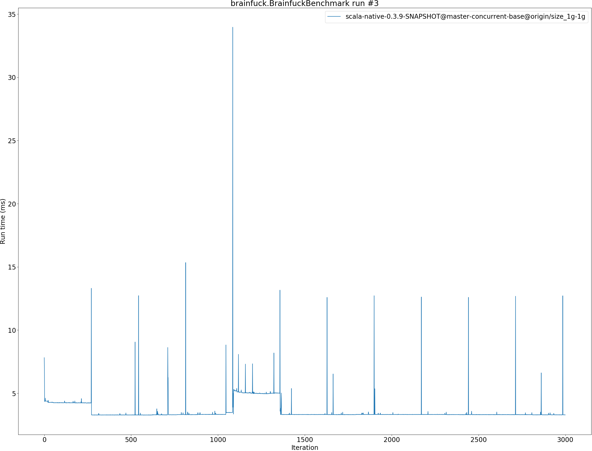
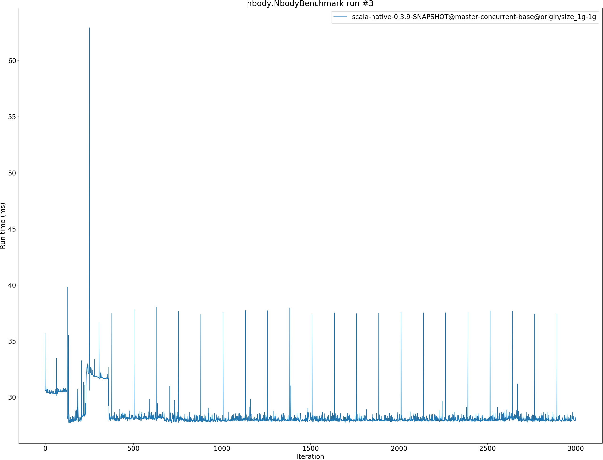

# Summary
## Benchmark run time (ms) at 50 percentile 

|name | scala-native-0.3.9-SNAPSHOT@master-concurrent-base@origin/size_1g-1g|
| -- | -- |
|[bounce.BounceBenchmark](#bouncebouncebenchmark)|0.0496|
|[richards.RichardsBenchmark](#richardsrichardsbenchmark)|0.0660|
|[queens.QueensBenchmark](#queensqueensbenchmark)|0.0861|
|[permute.PermuteBenchmark](#permutepermutebenchmark)|0.2633|
|[deltablue.DeltaBlueBenchmark](#deltabluedeltabluebenchmark)|0.2228|
|[tracer.TracerBenchmark](#tracertracerbenchmark)|0.5944|
|[brainfuck.BrainfuckBenchmark](#brainfuckbrainfuckbenchmark)|3.3064|
|[json.JsonBenchmark](#jsonjsonbenchmark)|1.3260|
|[cd.CDBenchmark](#cdcdbenchmark)|20.7208|
|[kmeans.KmeansBenchmark](#kmeanskmeansbenchmark)|44.3909|
|[gcbench.GCBenchBenchmark](#gcbenchgcbenchbenchmark)|94.4570|
|[mandelbrot.MandelbrotBenchmark](#mandelbrotmandelbrotbenchmark)|88.7068|
|[nbody.NbodyBenchmark](#nbodynbodybenchmark)|27.9949|
|[sudoku.SudokuBenchmark](#sudokusudokubenchmark)|2.5052|
| __Geometrical mean:__||
## Benchmark run time (ms) at 90 percentile 

|name | scala-native-0.3.9-SNAPSHOT@master-concurrent-base@origin/size_1g-1g|
| -- | -- |
|[bounce.BounceBenchmark](#bouncebouncebenchmark)|0.0512|
|[richards.RichardsBenchmark](#richardsrichardsbenchmark)|0.0690|
|[queens.QueensBenchmark](#queensqueensbenchmark)|0.0887|
|[permute.PermuteBenchmark](#permutepermutebenchmark)|0.2687|
|[deltablue.DeltaBlueBenchmark](#deltabluedeltabluebenchmark)|0.2262|
|[tracer.TracerBenchmark](#tracertracerbenchmark)|0.6140|
|[brainfuck.BrainfuckBenchmark](#brainfuckbrainfuckbenchmark)|3.3279|
|[json.JsonBenchmark](#jsonjsonbenchmark)|2.2168|
|[cd.CDBenchmark](#cdcdbenchmark)|20.9948|
|[kmeans.KmeansBenchmark](#kmeanskmeansbenchmark)|44.7729|
|[gcbench.GCBenchBenchmark](#gcbenchgcbenchbenchmark)|101.0199|
|[mandelbrot.MandelbrotBenchmark](#mandelbrotmandelbrotbenchmark)|88.9600|
|[nbody.NbodyBenchmark](#nbodynbodybenchmark)|28.5039|
|[sudoku.SudokuBenchmark](#sudokusudokubenchmark)|3.2695|
| __Geometrical mean:__||
## Benchmark run time (ms) at 99 percentile 

|name | scala-native-0.3.9-SNAPSHOT@master-concurrent-base@origin/size_1g-1g|
| -- | -- |
|[bounce.BounceBenchmark](#bouncebouncebenchmark)|0.0550|
|[richards.RichardsBenchmark](#richardsrichardsbenchmark)|0.0733|
|[queens.QueensBenchmark](#queensqueensbenchmark)|0.0930|
|[permute.PermuteBenchmark](#permutepermutebenchmark)|0.2865|
|[deltablue.DeltaBlueBenchmark](#deltabluedeltabluebenchmark)|0.2371|
|[tracer.TracerBenchmark](#tracertracerbenchmark)|0.6549|
|[brainfuck.BrainfuckBenchmark](#brainfuckbrainfuckbenchmark)|3.4833|
|[json.JsonBenchmark](#jsonjsonbenchmark)|2.3966|
|[cd.CDBenchmark](#cdcdbenchmark)|30.4934|
|[kmeans.KmeansBenchmark](#kmeanskmeansbenchmark)|54.1065|
|[gcbench.GCBenchBenchmark](#gcbenchgcbenchbenchmark)|108.0866|
|[mandelbrot.MandelbrotBenchmark](#mandelbrotmandelbrotbenchmark)|89.3515|
|[nbody.NbodyBenchmark](#nbodynbodybenchmark)|33.0215|
|[sudoku.SudokuBenchmark](#sudokusudokubenchmark)|3.4216|
| __Geometrical mean:__||
## Benchmark run time (ms) at 99.9 percentile 

|name | scala-native-0.3.9-SNAPSHOT@master-concurrent-base@origin/size_1g-1g|
| -- | -- |
|[bounce.BounceBenchmark](#bouncebouncebenchmark)|0.0582|
|[richards.RichardsBenchmark](#richardsrichardsbenchmark)|0.0774|
|[queens.QueensBenchmark](#queensqueensbenchmark)|0.0979|
|[permute.PermuteBenchmark](#permutepermutebenchmark)|0.3576|
|[deltablue.DeltaBlueBenchmark](#deltabluedeltabluebenchmark)|0.2504|
|[tracer.TracerBenchmark](#tracertracerbenchmark)|10.1937|
|[brainfuck.BrainfuckBenchmark](#brainfuckbrainfuckbenchmark)|12.7265|
|[json.JsonBenchmark](#jsonjsonbenchmark)|13.9924|
|[cd.CDBenchmark](#cdcdbenchmark)|31.1433|
|[kmeans.KmeansBenchmark](#kmeanskmeansbenchmark)|55.1292|
|[gcbench.GCBenchBenchmark](#gcbenchgcbenchbenchmark)|111.3646|
|[mandelbrot.MandelbrotBenchmark](#mandelbrotmandelbrotbenchmark)|89.6844|
|[nbody.NbodyBenchmark](#nbodynbodybenchmark)|37.8612|
|[sudoku.SudokuBenchmark](#sudokusudokubenchmark)|10.1913|
| __Geometrical mean:__||
## Benchmark total run time (ms) 

|name | scala-native-0.3.9-SNAPSHOT@master-concurrent-base@origin/size_1g-1g|
| -- | -- |
|[bounce.BounceBenchmark](#bouncebouncebenchmark)|996.6062|
|[richards.RichardsBenchmark](#richardsrichardsbenchmark)|1330.0303|
|[queens.QueensBenchmark](#queensqueensbenchmark)|1730.3945|
|[permute.PermuteBenchmark](#permutepermutebenchmark)|5285.8258|
|[deltablue.DeltaBlueBenchmark](#deltabluedeltabluebenchmark)|4465.6420|
|[tracer.TracerBenchmark](#tracertracerbenchmark)|12627.8094|
|[brainfuck.BrainfuckBenchmark](#brainfuckbrainfuckbenchmark)|67047.1980|
|[json.JsonBenchmark](#jsonjsonbenchmark)|31616.3704|
|[cd.CDBenchmark](#cdcdbenchmark)|427375.8024|
|[kmeans.KmeansBenchmark](#kmeanskmeansbenchmark)|894323.0535|
|[gcbench.GCBenchBenchmark](#gcbenchgcbenchbenchmark)|1862295.2946|
|[mandelbrot.MandelbrotBenchmark](#mandelbrotmandelbrotbenchmark)|1774483.8829|
|[nbody.NbodyBenchmark](#nbodynbodybenchmark)|563703.7789|
|[sudoku.SudokuBenchmark](#sudokusudokubenchmark)|56591.5530|
| __Geometrical mean:__||
# Individual benchmarks
## bounce.BounceBenchmark

## richards.RichardsBenchmark

## queens.QueensBenchmark

## permute.PermuteBenchmark

## deltablue.DeltaBlueBenchmark

## tracer.TracerBenchmark

## brainfuck.BrainfuckBenchmark

## json.JsonBenchmark

## cd.CDBenchmark

## kmeans.KmeansBenchmark

## gcbench.GCBenchBenchmark

## mandelbrot.MandelbrotBenchmark

## nbody.NbodyBenchmark

## sudoku.SudokuBenchmark

