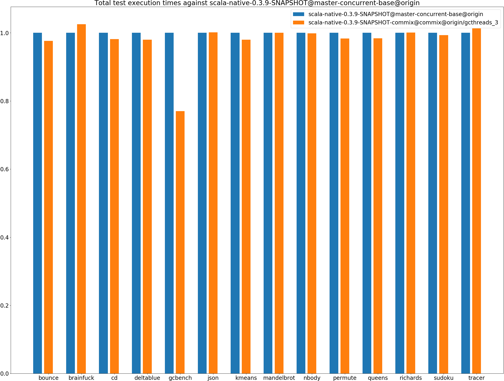
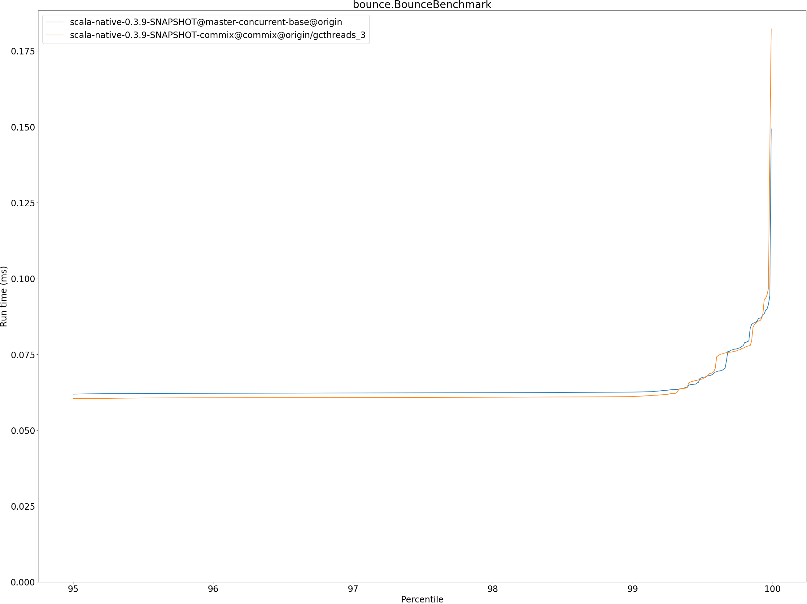
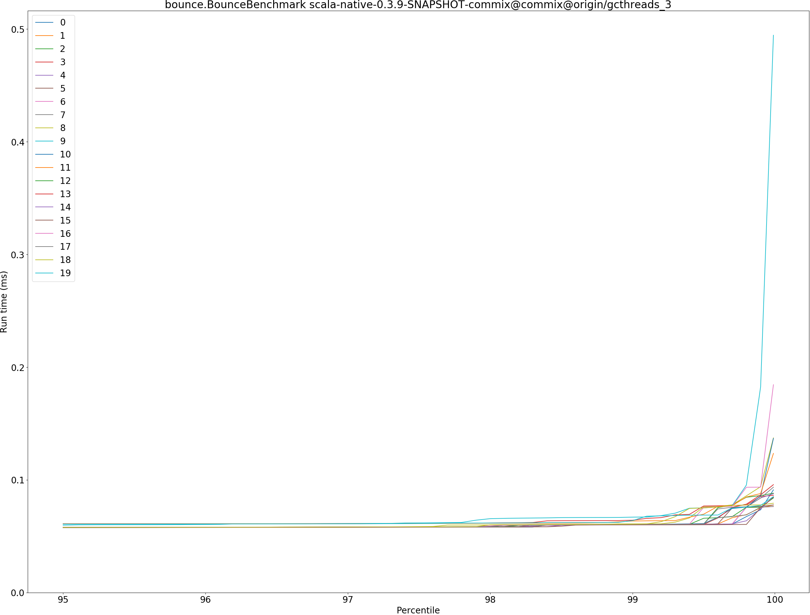
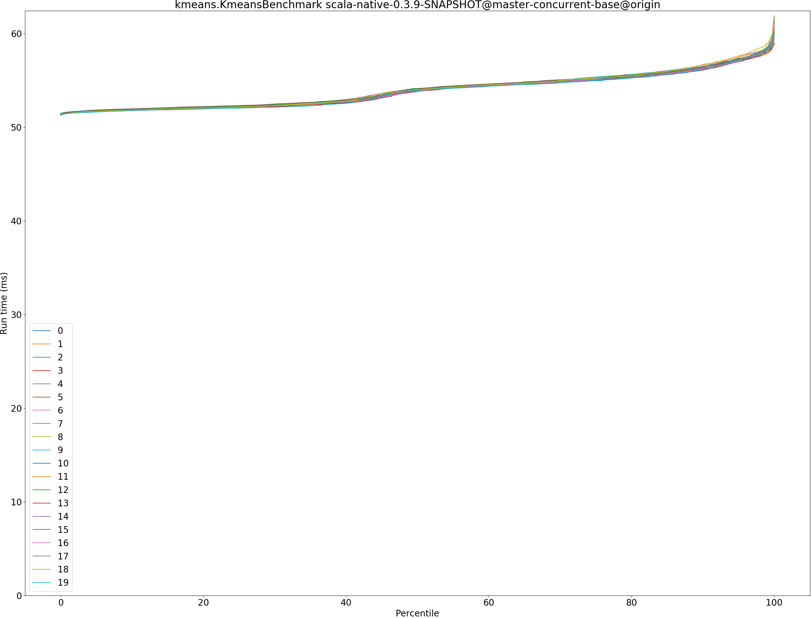
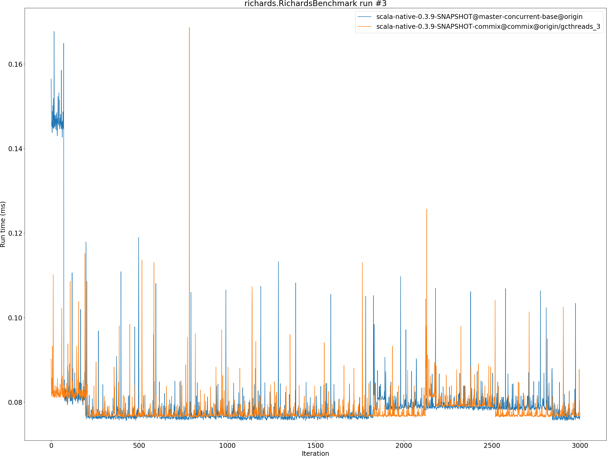
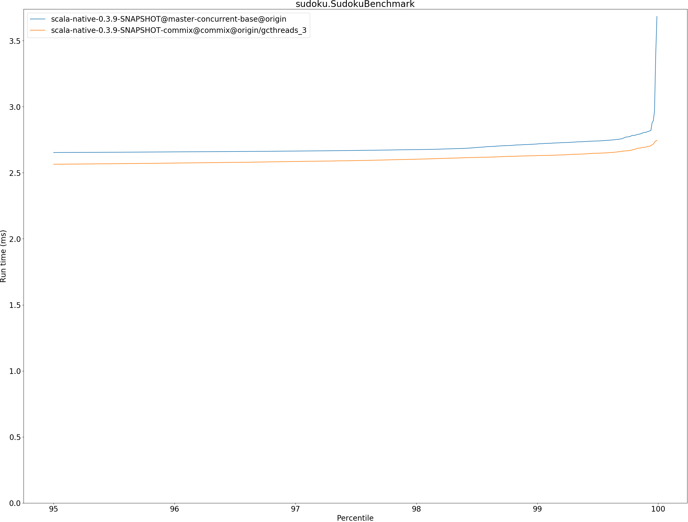

# Summary
## Benchmark run time (ms) at 50 percentile 

|name | scala-native-0.3.9-SNAPSHOT@master-concurrent-base@origin | scala-native-0.3.9-SNAPSHOT-commix@commix@origin/gcthreads_3 | |
| -- | -- | -- | -- |
|[bounce.BounceBenchmark](#bouncebouncebenchmark)|0.0588|0.0574|__-2.35%__|
|[brainfuck.BrainfuckBenchmark](#brainfuckbrainfuckbenchmark)|3.3759|3.4163|+1.20%|
|[cd.CDBenchmark](#cdcdbenchmark)|32.7898|32.2365|__-1.69%__|
|[deltablue.DeltaBlueBenchmark](#deltabluedeltabluebenchmark)|0.1823|0.1796|__-1.53%__|
|[gcbench.GCBenchBenchmark](#gcbenchgcbenchbenchmark)|132.9232|101.0140|__-24.01%__|
|[json.JsonBenchmark](#jsonjsonbenchmark)|1.6521|1.6430|__-0.56%__|
|[kmeans.KmeansBenchmark](#kmeanskmeansbenchmark)|53.9548|52.7997|__-2.14%__|
|[mandelbrot.MandelbrotBenchmark](#mandelbrotmandelbrotbenchmark)|126.0747|126.1256|+0.04%|
|[nbody.NbodyBenchmark](#nbodynbodybenchmark)|39.4352|39.4209|__-0.04%__|
|[permute.PermuteBenchmark](#permutepermutebenchmark)|0.2027|0.2004|__-1.16%__|
|[queens.QueensBenchmark](#queensqueensbenchmark)|0.1155|0.1140|__-1.34%__|
|[richards.RichardsBenchmark](#richardsrichardsbenchmark)|0.0769|0.0769|+0.02%|
|[sudoku.SudokuBenchmark](#sudokusudokubenchmark)|2.4286|2.4185|__-0.42%__|
|[tracer.TracerBenchmark](#tracertracerbenchmark)|0.7508|0.7618|+1.46%|
| __Geometrical mean:__|| |__-2.54%__|
## Benchmark run time (ms) at 90 percentile 

|name | scala-native-0.3.9-SNAPSHOT@master-concurrent-base@origin | scala-native-0.3.9-SNAPSHOT-commix@commix@origin/gcthreads_3 | |
| -- | -- | -- | -- |
|[bounce.BounceBenchmark](#bouncebouncebenchmark)|0.0605|0.0590|__-2.45%__|
|[brainfuck.BrainfuckBenchmark](#brainfuckbrainfuckbenchmark)|3.4634|3.5146|+1.48%|
|[cd.CDBenchmark](#cdcdbenchmark)|33.3898|32.4923|__-2.69%__|
|[deltablue.DeltaBlueBenchmark](#deltabluedeltabluebenchmark)|0.1924|0.1860|__-3.35%__|
|[gcbench.GCBenchBenchmark](#gcbenchgcbenchbenchmark)|135.6477|103.3256|__-23.83%__|
|[json.JsonBenchmark](#jsonjsonbenchmark)|1.6739|1.6736|__-0.02%__|
|[kmeans.KmeansBenchmark](#kmeanskmeansbenchmark)|56.3564|53.7792|__-4.57%__|
|[mandelbrot.MandelbrotBenchmark](#mandelbrotmandelbrotbenchmark)|126.7456|126.8812|+0.11%|
|[nbody.NbodyBenchmark](#nbodynbodybenchmark)|40.2439|40.0613|__-0.45%__|
|[permute.PermuteBenchmark](#permutepermutebenchmark)|0.2269|0.2142|__-5.63%__|
|[queens.QueensBenchmark](#queensqueensbenchmark)|0.1188|0.1165|__-1.96%__|
|[richards.RichardsBenchmark](#richardsrichardsbenchmark)|0.0799|0.0795|__-0.55%__|
|[sudoku.SudokuBenchmark](#sudokusudokubenchmark)|2.6249|2.5342|__-3.46%__|
|[tracer.TracerBenchmark](#tracertracerbenchmark)|0.7768|0.7812|+0.56%|
| __Geometrical mean:__|| |__-3.56%__|
## Benchmark run time (ms) at 99 percentile 

|name | scala-native-0.3.9-SNAPSHOT@master-concurrent-base@origin | scala-native-0.3.9-SNAPSHOT-commix@commix@origin/gcthreads_3 | |
| -- | -- | -- | -- |
|[bounce.BounceBenchmark](#bouncebouncebenchmark)|0.0626|0.0611|__-2.34%__|
|[brainfuck.BrainfuckBenchmark](#brainfuckbrainfuckbenchmark)|3.5840|3.6238|+1.11%|
|[cd.CDBenchmark](#cdcdbenchmark)|34.2258|33.0219|__-3.52%__|
|[deltablue.DeltaBlueBenchmark](#deltabluedeltabluebenchmark)|0.2633|0.2481|__-5.78%__|
|[gcbench.GCBenchBenchmark](#gcbenchgcbenchbenchmark)|136.9762|104.8027|__-23.49%__|
|[json.JsonBenchmark](#jsonjsonbenchmark)|1.7575|1.7860|+1.62%|
|[kmeans.KmeansBenchmark](#kmeanskmeansbenchmark)|58.3701|55.2579|__-5.33%__|
|[mandelbrot.MandelbrotBenchmark](#mandelbrotmandelbrotbenchmark)|128.7248|128.7483|+0.02%|
|[nbody.NbodyBenchmark](#nbodynbodybenchmark)|41.6190|41.3241|__-0.71%__|
|[permute.PermuteBenchmark](#permutepermutebenchmark)|0.2392|0.2348|__-1.84%__|
|[queens.QueensBenchmark](#queensqueensbenchmark)|0.1262|0.1249|__-1.03%__|
|[richards.RichardsBenchmark](#richardsrichardsbenchmark)|0.0877|0.0914|+4.19%|
|[sudoku.SudokuBenchmark](#sudokusudokubenchmark)|2.7182|2.6303|__-3.24%__|
|[tracer.TracerBenchmark](#tracertracerbenchmark)|0.8415|0.8201|__-2.54%__|
| __Geometrical mean:__|| |__-3.29%__|
## Benchmark run time (ms) at 99.9 percentile 

|name | scala-native-0.3.9-SNAPSHOT@master-concurrent-base@origin | scala-native-0.3.9-SNAPSHOT-commix@commix@origin/gcthreads_3 | |
| -- | -- | -- | -- |
|[bounce.BounceBenchmark](#bouncebouncebenchmark)|0.0869|0.0860|__-1.04%__|
|[brainfuck.BrainfuckBenchmark](#brainfuckbrainfuckbenchmark)|3.6794|4.0404|+9.81%|
|[cd.CDBenchmark](#cdcdbenchmark)|34.6984|37.0669|+6.83%|
|[deltablue.DeltaBlueBenchmark](#deltabluedeltabluebenchmark)|0.2790|0.2740|__-1.80%__|
|[gcbench.GCBenchBenchmark](#gcbenchgcbenchbenchmark)|137.9543|106.5707|__-22.75%__|
|[json.JsonBenchmark](#jsonjsonbenchmark)|1.8030|1.9315|+7.13%|
|[kmeans.KmeansBenchmark](#kmeanskmeansbenchmark)|60.1562|57.8159|__-3.89%__|
|[mandelbrot.MandelbrotBenchmark](#mandelbrotmandelbrotbenchmark)|130.6372|130.2635|__-0.29%__|
|[nbody.NbodyBenchmark](#nbodynbodybenchmark)|42.5797|41.8339|__-1.75%__|
|[permute.PermuteBenchmark](#permutepermutebenchmark)|0.2611|0.2546|__-2.49%__|
|[queens.QueensBenchmark](#queensqueensbenchmark)|0.1534|0.1551|+1.10%|
|[richards.RichardsBenchmark](#richardsrichardsbenchmark)|0.1079|0.1081|+0.17%|
|[sudoku.SudokuBenchmark](#sudokusudokubenchmark)|2.8063|2.6950|__-3.97%__|
|[tracer.TracerBenchmark](#tracertracerbenchmark)|0.9038|0.8762|__-3.06%__|
| __Geometrical mean:__|| |__-1.44%__|
## Benchmark total run time (ms) 

|name | scala-native-0.3.9-SNAPSHOT@master-concurrent-base@origin | scala-native-0.3.9-SNAPSHOT-commix@commix@origin/gcthreads_3 | |
| -- | -- | -- | -- |
|[bounce.BounceBenchmark](#bouncebouncebenchmark)|1185.2632|1157.4694|__-2.34%__|
|[brainfuck.BrainfuckBenchmark](#brainfuckbrainfuckbenchmark)|67047.1111|68733.3540|+2.52%|
|[cd.CDBenchmark](#cdcdbenchmark)|657757.9143|645492.8818|__-1.86%__|
|[deltablue.DeltaBlueBenchmark](#deltabluedeltabluebenchmark)|3744.6118|3668.6629|__-2.03%__|
|[gcbench.GCBenchBenchmark](#gcbenchgcbenchbenchmark)|2622185.5744|2019179.5096|__-23.00%__|
|[json.JsonBenchmark](#jsonjsonbenchmark)|32669.6568|32725.5009|+0.17%|
|[kmeans.KmeansBenchmark](#kmeanskmeansbenchmark)|1077865.6741|1056225.1618|__-2.01%__|
|[mandelbrot.MandelbrotBenchmark](#mandelbrotmandelbrotbenchmark)|2525585.6944|2526621.6296|+0.04%|
|[nbody.NbodyBenchmark](#nbodynbodybenchmark)|792356.6569|791250.4679|__-0.14%__|
|[permute.PermuteBenchmark](#permutepermutebenchmark)|4141.0957|4072.4352|__-1.66%__|
|[queens.QueensBenchmark](#queensqueensbenchmark)|2329.7301|2292.4754|__-1.60%__|
|[richards.RichardsBenchmark](#richardsrichardsbenchmark)|1555.5275|1556.6367|+0.07%|
|[sudoku.SudokuBenchmark](#sudokusudokubenchmark)|49168.7215|48824.4016|__-0.70%__|
|[tracer.TracerBenchmark](#tracertracerbenchmark)|15044.7692|15243.8849|+1.32%|
| __Geometrical mean:__|| |__-2.43%__|
# Individual benchmarks
## bounce.BounceBenchmark

## brainfuck.BrainfuckBenchmark

## cd.CDBenchmark

## deltablue.DeltaBlueBenchmark

## gcbench.GCBenchBenchmark

## json.JsonBenchmark

## kmeans.KmeansBenchmark

## mandelbrot.MandelbrotBenchmark

## nbody.NbodyBenchmark

## permute.PermuteBenchmark

## queens.QueensBenchmark

## richards.RichardsBenchmark

## sudoku.SudokuBenchmark

## tracer.TracerBenchmark

