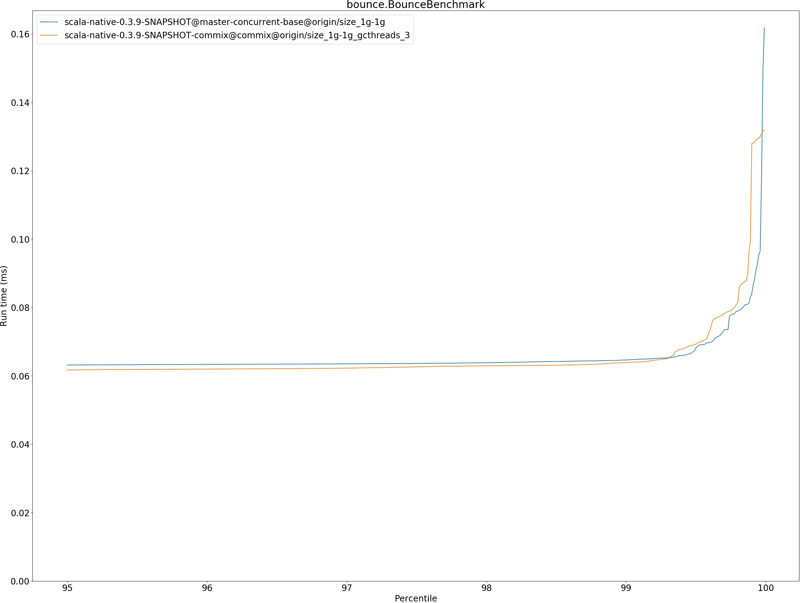
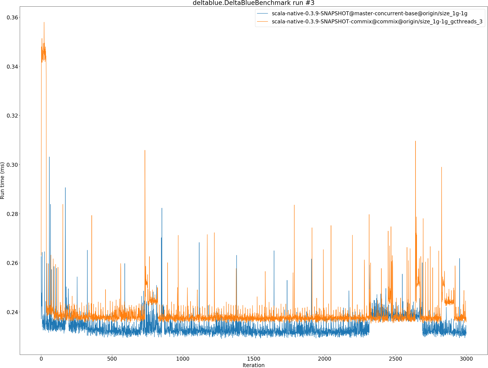
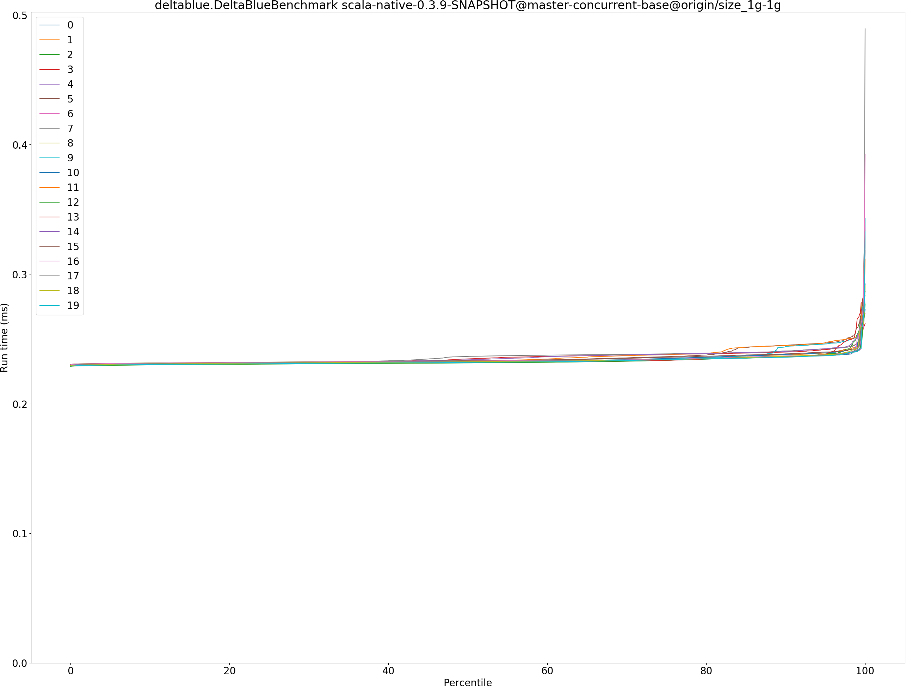
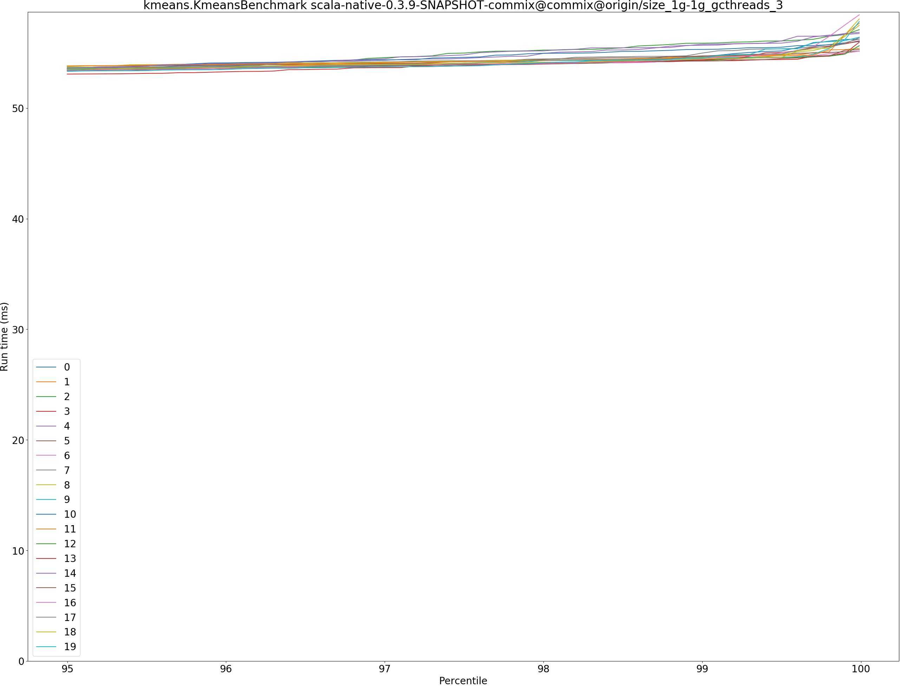
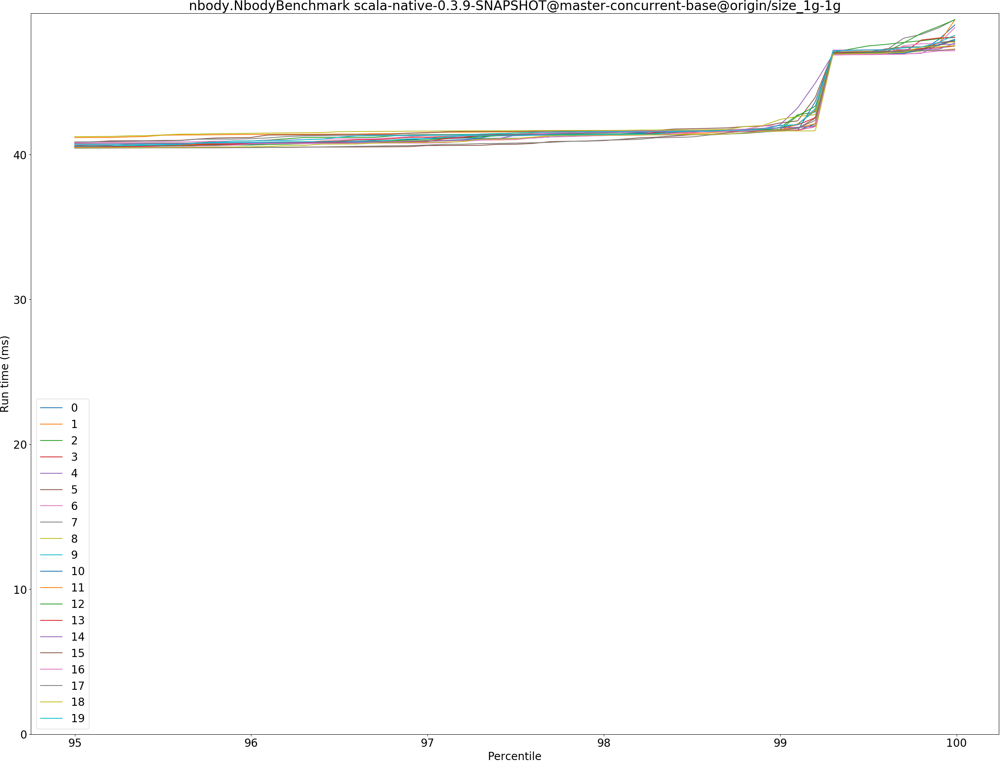
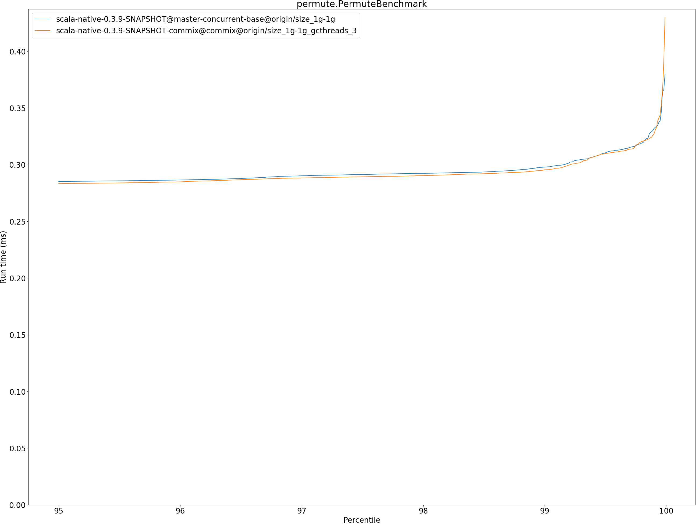

# Summary
## Benchmark run time (ms) at 50 percentile 

|name | scala-native-0.3.9-SNAPSHOT@master-concurrent-base@origin/size_1g-1g | scala-native-0.3.9-SNAPSHOT-commix@commix@origin/size_1g-1g_gcthreads_3 | |
| -- | -- | -- | -- |
|[bounce.BounceBenchmark](#bouncebouncebenchmark)|0.0608|0.0595|__-2.28%__|
|[brainfuck.BrainfuckBenchmark](#brainfuckbrainfuckbenchmark)|3.2888|3.3536|+1.97%|
|[cd.CDBenchmark](#cdcdbenchmark)|31.5097|31.2064|__-0.96%__|
|[deltablue.DeltaBlueBenchmark](#deltabluedeltabluebenchmark)|0.2325|0.2376|+2.16%|
|[gcbench.GCBenchBenchmark](#gcbenchgcbenchbenchmark)|105.8854|102.5301|__-3.17%__|
|[json.JsonBenchmark](#jsonjsonbenchmark)|1.6301|1.6480|+1.09%|
|[kmeans.KmeansBenchmark](#kmeanskmeansbenchmark)|51.9209|51.7511|__-0.33%__|
|[mandelbrot.MandelbrotBenchmark](#mandelbrotmandelbrotbenchmark)|126.1105|126.1389|+0.02%|
|[nbody.NbodyBenchmark](#nbodynbodybenchmark)|39.3838|39.4080|+0.06%|
|[permute.PermuteBenchmark](#permutepermutebenchmark)|0.2762|0.2745|__-0.62%__|
|[queens.QueensBenchmark](#queensqueensbenchmark)|0.1204|0.1178|__-2.11%__|
|[richards.RichardsBenchmark](#richardsrichardsbenchmark)|0.0949|0.0810|__-14.68%__|
|[sudoku.SudokuBenchmark](#sudokusudokubenchmark)|2.4403|2.4491|+0.36%|
|[tracer.TracerBenchmark](#tracertracerbenchmark)|0.8200|0.8328|+1.57%|
| __Geometrical mean:__|| |__-1.30%__|
## Benchmark run time (ms) at 90 percentile 

|name | scala-native-0.3.9-SNAPSHOT@master-concurrent-base@origin/size_1g-1g | scala-native-0.3.9-SNAPSHOT-commix@commix@origin/size_1g-1g_gcthreads_3 | |
| -- | -- | -- | -- |
|[bounce.BounceBenchmark](#bouncebouncebenchmark)|0.0623|0.0609|__-2.25%__|
|[brainfuck.BrainfuckBenchmark](#brainfuckbrainfuckbenchmark)|3.3789|3.4471|+2.02%|
|[cd.CDBenchmark](#cdcdbenchmark)|32.7606|31.9815|__-2.38%__|
|[deltablue.DeltaBlueBenchmark](#deltabluedeltabluebenchmark)|0.2382|0.2427|+1.91%|
|[gcbench.GCBenchBenchmark](#gcbenchgcbenchbenchmark)|113.6988|105.9238|__-6.84%__|
|[json.JsonBenchmark](#jsonjsonbenchmark)|1.6732|1.6912|+1.07%|
|[kmeans.KmeansBenchmark](#kmeanskmeansbenchmark)|53.0932|52.8560|__-0.45%__|
|[mandelbrot.MandelbrotBenchmark](#mandelbrotmandelbrotbenchmark)|126.8113|126.8585|+0.04%|
|[nbody.NbodyBenchmark](#nbodynbodybenchmark)|40.2875|40.2637|__-0.06%__|
|[permute.PermuteBenchmark](#permutepermutebenchmark)|0.2827|0.2806|__-0.75%__|
|[queens.QueensBenchmark](#queensqueensbenchmark)|0.1228|0.1207|__-1.67%__|
|[richards.RichardsBenchmark](#richardsrichardsbenchmark)|0.0978|0.0837|__-14.47%__|
|[sudoku.SudokuBenchmark](#sudokusudokubenchmark)|2.5145|2.5730|+2.32%|
|[tracer.TracerBenchmark](#tracertracerbenchmark)|0.8439|0.8634|+2.31%|
| __Geometrical mean:__|| |__-1.47%__|
## Benchmark run time (ms) at 99 percentile 

|name | scala-native-0.3.9-SNAPSHOT@master-concurrent-base@origin/size_1g-1g | scala-native-0.3.9-SNAPSHOT-commix@commix@origin/size_1g-1g_gcthreads_3 | |
| -- | -- | -- | -- |
|[bounce.BounceBenchmark](#bouncebouncebenchmark)|0.0646|0.0639|__-1.14%__|
|[brainfuck.BrainfuckBenchmark](#brainfuckbrainfuckbenchmark)|3.4959|3.6423|+4.19%|
|[cd.CDBenchmark](#cdcdbenchmark)|39.6485|34.9043|__-11.97%__|
|[deltablue.DeltaBlueBenchmark](#deltabluedeltabluebenchmark)|0.2498|0.2583|+3.40%|
|[gcbench.GCBenchBenchmark](#gcbenchgcbenchbenchmark)|114.9839|107.3769|__-6.62%__|
|[json.JsonBenchmark](#jsonjsonbenchmark)|1.7300|1.7812|+2.96%|
|[kmeans.KmeansBenchmark](#kmeanskmeansbenchmark)|61.7564|54.7421|__-11.36%__|
|[mandelbrot.MandelbrotBenchmark](#mandelbrotmandelbrotbenchmark)|128.8678|128.5047|__-0.28%__|
|[nbody.NbodyBenchmark](#nbodynbodybenchmark)|41.8785|41.5872|__-0.70%__|
|[permute.PermuteBenchmark](#permutepermutebenchmark)|0.2978|0.2955|__-0.79%__|
|[queens.QueensBenchmark](#queensqueensbenchmark)|0.1272|0.1278|+0.46%|
|[richards.RichardsBenchmark](#richardsrichardsbenchmark)|0.1031|0.0896|__-13.04%__|
|[sudoku.SudokuBenchmark](#sudokusudokubenchmark)|2.6030|2.6540|+1.96%|
|[tracer.TracerBenchmark](#tracertracerbenchmark)|0.8840|1.6655|+88.40%|
| __Geometrical mean:__|| |+1.99%|
## Benchmark run time (ms) at 99.9 percentile 

|name | scala-native-0.3.9-SNAPSHOT@master-concurrent-base@origin/size_1g-1g | scala-native-0.3.9-SNAPSHOT-commix@commix@origin/size_1g-1g_gcthreads_3 | |
| -- | -- | -- | -- |
|[bounce.BounceBenchmark](#bouncebouncebenchmark)|0.0841|0.1279|+52.21%|
|[brainfuck.BrainfuckBenchmark](#brainfuckbrainfuckbenchmark)|11.0497|5.1885|__-53.04%__|
|[cd.CDBenchmark](#cdcdbenchmark)|40.5471|35.8593|__-11.56%__|
|[deltablue.DeltaBlueBenchmark](#deltabluedeltabluebenchmark)|0.2866|0.2850|__-0.56%__|
|[gcbench.GCBenchBenchmark](#gcbenchgcbenchbenchmark)|115.9149|109.3096|__-5.70%__|
|[json.JsonBenchmark](#jsonjsonbenchmark)|9.5227|2.2436|__-76.44%__|
|[kmeans.KmeansBenchmark](#kmeanskmeansbenchmark)|63.6746|56.4807|__-11.30%__|
|[mandelbrot.MandelbrotBenchmark](#mandelbrotmandelbrotbenchmark)|130.8670|130.1007|__-0.59%__|
|[nbody.NbodyBenchmark](#nbodynbodybenchmark)|47.8483|42.2842|__-11.63%__|
|[permute.PermuteBenchmark](#permutepermutebenchmark)|0.3319|0.3273|__-1.40%__|
|[queens.QueensBenchmark](#queensqueensbenchmark)|0.1550|0.1651|+6.52%|
|[richards.RichardsBenchmark](#richardsrichardsbenchmark)|0.1308|0.1091|__-16.56%__|
|[sudoku.SudokuBenchmark](#sudokusudokubenchmark)|2.8251|3.9417|+39.52%|
|[tracer.TracerBenchmark](#tracertracerbenchmark)|8.5992|2.0773|__-75.84%__|
| __Geometrical mean:__|| |__-21.77%__|
## Benchmark total run time (ms) 

|name | scala-native-0.3.9-SNAPSHOT@master-concurrent-base@origin/size_1g-1g | scala-native-0.3.9-SNAPSHOT-commix@commix@origin/size_1g-1g_gcthreads_3 | |
| -- | -- | -- | -- |
|[bounce.BounceBenchmark](#bouncebouncebenchmark)|1220.6745|1194.1986|__-2.17%__|
|[brainfuck.BrainfuckBenchmark](#brainfuckbrainfuckbenchmark)|66786.5276|67713.0749|+1.39%|
|[cd.CDBenchmark](#cdcdbenchmark)|644172.7054|630432.5601|__-2.13%__|
|[deltablue.DeltaBlueBenchmark](#deltabluedeltabluebenchmark)|4678.7621|4775.3057|+2.06%|
|[gcbench.GCBenchBenchmark](#gcbenchgcbenchbenchmark)|2098783.9745|2022770.8666|__-3.62%__|
|[json.JsonBenchmark](#jsonjsonbenchmark)|33089.1696|33182.3400|+0.28%|
|[kmeans.KmeansBenchmark](#kmeanskmeansbenchmark)|1046185.1819|1038957.1094|__-0.69%__|
|[mandelbrot.MandelbrotBenchmark](#mandelbrotmandelbrotbenchmark)|2526501.5316|2526708.7335|+0.01%|
|[nbody.NbodyBenchmark](#nbodynbodybenchmark)|793053.0000|791953.5230|__-0.14%__|
|[permute.PermuteBenchmark](#permutepermutebenchmark)|5553.1130|5516.2875|__-0.66%__|
|[queens.QueensBenchmark](#queensqueensbenchmark)|2409.7053|2369.0212|__-1.69%__|
|[richards.RichardsBenchmark](#richardsrichardsbenchmark)|1910.2981|1630.2626|__-14.66%__|
|[sudoku.SudokuBenchmark](#sudokusudokubenchmark)|49323.4374|49223.6052|__-0.20%__|
|[tracer.TracerBenchmark](#tracertracerbenchmark)|16944.2481|16978.4064|+0.20%|
| __Geometrical mean:__|| |__-1.66%__|
# Individual benchmarks
## bounce.BounceBenchmark

## brainfuck.BrainfuckBenchmark

## cd.CDBenchmark

## deltablue.DeltaBlueBenchmark

## gcbench.GCBenchBenchmark

## json.JsonBenchmark

## kmeans.KmeansBenchmark

## mandelbrot.MandelbrotBenchmark

## nbody.NbodyBenchmark

## permute.PermuteBenchmark

## queens.QueensBenchmark

## richards.RichardsBenchmark

## sudoku.SudokuBenchmark

## tracer.TracerBenchmark

