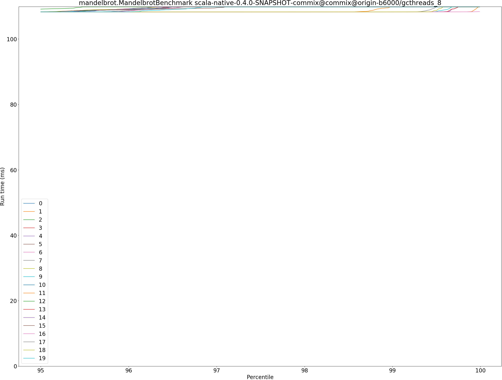

# Summary
## Benchmark run time (ms) at 50 percentile 

|name | scala-native-0.4.0-SNAPSHOT@master-concurrent-base@origin-b6000 | scala-native-0.4.0-SNAPSHOT-commix@commix@origin-b6000/gcthreads_8 | |
| -- | -- | -- | -- |
|[bounce.BounceBenchmark](#bouncebouncebenchmark)|0.0149|0.0150|+0.53%|
|[brainfuck.BrainfuckBenchmark](#brainfuckbrainfuckbenchmark)|1.1106|1.1031|__-0.67%__|
|[cd.CDBenchmark](#cdcdbenchmark)|16.3921|16.3150|__-0.47%__|
|[deltablue.DeltaBlueBenchmark](#deltabluedeltabluebenchmark)|0.1272|0.1266|__-0.46%__|
|[gcbench.GCBenchBenchmark](#gcbenchgcbenchbenchmark)|76.7033|63.8236|__-16.79%__|
|[json.JsonBenchmark](#jsonjsonbenchmark)|0.7997|0.8160|+2.04%|
|[kmeans.KmeansBenchmark](#kmeanskmeansbenchmark)|19.8906|19.6813|__-1.05%__|
|[mandelbrot.MandelbrotBenchmark](#mandelbrotmandelbrotbenchmark)|108.8387|108.2663|__-0.53%__|
|[nbody.NbodyBenchmark](#nbodynbodybenchmark)|19.2773|19.2773|__-0.00%__|
|[permute.PermuteBenchmark](#permutepermutebenchmark)|0.1221|0.1248|+2.15%|
|[queens.QueensBenchmark](#queensqueensbenchmark)|0.0495|0.0491|__-0.70%__|
|[richards.RichardsBenchmark](#richardsrichardsbenchmark)|0.0507|0.0508|+0.33%|
|[sudoku.SudokuBenchmark](#sudokusudokubenchmark)|1.4222|1.4642|+2.95%|
|[tracer.TracerBenchmark](#tracertracerbenchmark)|0.4582|0.4580|__-0.05%__|
| __Geometrical mean:__|| |__-1.02%__|
## Benchmark run time (ms) at 90 percentile 

|name | scala-native-0.4.0-SNAPSHOT@master-concurrent-base@origin-b6000 | scala-native-0.4.0-SNAPSHOT-commix@commix@origin-b6000/gcthreads_8 | |
| -- | -- | -- | -- |
|[bounce.BounceBenchmark](#bouncebouncebenchmark)|0.0151|0.0152|+0.54%|
|[brainfuck.BrainfuckBenchmark](#brainfuckbrainfuckbenchmark)|1.1458|1.1420|__-0.33%__|
|[cd.CDBenchmark](#cdcdbenchmark)|16.5298|16.4618|__-0.41%__|
|[deltablue.DeltaBlueBenchmark](#deltabluedeltabluebenchmark)|0.1289|0.1288|__-0.07%__|
|[gcbench.GCBenchBenchmark](#gcbenchgcbenchbenchmark)|80.2157|65.5658|__-18.26%__|
|[json.JsonBenchmark](#jsonjsonbenchmark)|1.0634|0.9336|__-12.21%__|
|[kmeans.KmeansBenchmark](#kmeanskmeansbenchmark)|20.7525|20.6923|__-0.29%__|
|[mandelbrot.MandelbrotBenchmark](#mandelbrotmandelbrotbenchmark)|108.8508|108.2749|__-0.53%__|
|[nbody.NbodyBenchmark](#nbodynbodybenchmark)|19.2787|19.2786|__-0.00%__|
|[permute.PermuteBenchmark](#permutepermutebenchmark)|0.1392|0.1361|__-2.25%__|
|[queens.QueensBenchmark](#queensqueensbenchmark)|0.0499|0.0493|__-1.21%__|
|[richards.RichardsBenchmark](#richardsrichardsbenchmark)|0.0523|0.0522|__-0.20%__|
|[sudoku.SudokuBenchmark](#sudokusudokubenchmark)|1.5087|1.5749|+4.39%|
|[tracer.TracerBenchmark](#tracertracerbenchmark)|0.4628|0.4632|+0.08%|
| __Geometrical mean:__|| |__-2.37%__|
## Benchmark run time (ms) at 99 percentile 

|name | scala-native-0.4.0-SNAPSHOT@master-concurrent-base@origin-b6000 | scala-native-0.4.0-SNAPSHOT-commix@commix@origin-b6000/gcthreads_8 | |
| -- | -- | -- | -- |
|[bounce.BounceBenchmark](#bouncebouncebenchmark)|0.0154|0.0155|+0.81%|
|[brainfuck.BrainfuckBenchmark](#brainfuckbrainfuckbenchmark)|1.1625|1.1591|__-0.30%__|
|[cd.CDBenchmark](#cdcdbenchmark)|17.5260|19.0555|+8.73%|
|[deltablue.DeltaBlueBenchmark](#deltabluedeltabluebenchmark)|0.1781|0.1794|+0.70%|
|[gcbench.GCBenchBenchmark](#gcbenchgcbenchbenchmark)|81.2017|73.0360|__-10.06%__|
|[json.JsonBenchmark](#jsonjsonbenchmark)|1.1129|1.1529|+3.60%|
|[kmeans.KmeansBenchmark](#kmeanskmeansbenchmark)|21.0834|28.6034|+35.67%|
|[mandelbrot.MandelbrotBenchmark](#mandelbrotmandelbrotbenchmark)|108.8628|109.8204|+0.88%|
|[nbody.NbodyBenchmark](#nbodynbodybenchmark)|21.4905|19.2817|__-10.28%__|
|[permute.PermuteBenchmark](#permutepermutebenchmark)|0.1425|0.1479|+3.79%|
|[queens.QueensBenchmark](#queensqueensbenchmark)|0.0518|0.0516|__-0.41%__|
|[richards.RichardsBenchmark](#richardsrichardsbenchmark)|0.0543|0.0543|__-0.07%__|
|[sudoku.SudokuBenchmark](#sudokusudokubenchmark)|1.6523|1.6470|__-0.32%__|
|[tracer.TracerBenchmark](#tracertracerbenchmark)|0.4660|0.4668|+0.17%|
| __Geometrical mean:__|| |+1.88%|
## Benchmark run time (ms) at 99.9 percentile 

|name | scala-native-0.4.0-SNAPSHOT@master-concurrent-base@origin-b6000 | scala-native-0.4.0-SNAPSHOT-commix@commix@origin-b6000/gcthreads_8 | |
| -- | -- | -- | -- |
|[bounce.BounceBenchmark](#bouncebouncebenchmark)|0.0246|0.0246|+0.16%|
|[brainfuck.BrainfuckBenchmark](#brainfuckbrainfuckbenchmark)|1.1760|1.1923|+1.38%|
|[cd.CDBenchmark](#cdcdbenchmark)|20.5336|20.4328|__-0.49%__|
|[deltablue.DeltaBlueBenchmark](#deltabluedeltabluebenchmark)|0.1853|0.1891|+2.05%|
|[gcbench.GCBenchBenchmark](#gcbenchgcbenchbenchmark)|81.6768|75.3812|__-7.71%__|
|[json.JsonBenchmark](#jsonjsonbenchmark)|1.1259|1.3316|+18.27%|
|[kmeans.KmeansBenchmark](#kmeanskmeansbenchmark)|21.3408|29.6421|+38.90%|
|[mandelbrot.MandelbrotBenchmark](#mandelbrotmandelbrotbenchmark)|111.0478|109.8267|__-1.10%__|
|[nbody.NbodyBenchmark](#nbodynbodybenchmark)|28.5500|28.5487|__-0.00%__|
|[permute.PermuteBenchmark](#permutepermutebenchmark)|0.1451|0.1506|+3.78%|
|[queens.QueensBenchmark](#queensqueensbenchmark)|0.0680|0.0637|__-6.25%__|
|[richards.RichardsBenchmark](#richardsrichardsbenchmark)|0.0679|0.0613|__-9.74%__|
|[sudoku.SudokuBenchmark](#sudokusudokubenchmark)|1.6881|1.6812|__-0.41%__|
|[tracer.TracerBenchmark](#tracertracerbenchmark)|0.4686|0.4698|+0.25%|
| __Geometrical mean:__|| |+2.20%|
## Benchmark total run time (ms) 

|name | scala-native-0.4.0-SNAPSHOT@master-concurrent-base@origin-b6000 | scala-native-0.4.0-SNAPSHOT-commix@commix@origin-b6000/gcthreads_8 | |
| -- | -- | -- | -- |
|[bounce.BounceBenchmark](#bouncebouncebenchmark)|956.1604|960.9325|+0.50%|
|[brainfuck.BrainfuckBenchmark](#brainfuckbrainfuckbenchmark)|70695.1806|70856.7718|+0.23%|
|[cd.CDBenchmark](#cdcdbenchmark)|1051934.9033|1049767.6964|__-0.21%__|
|[deltablue.DeltaBlueBenchmark](#deltabluedeltabluebenchmark)|8273.9066|8238.3563|__-0.43%__|
|[gcbench.GCBenchBenchmark](#gcbenchgcbenchbenchmark)|4872374.3329|4116540.3907|__-15.51%__|
|[json.JsonBenchmark](#jsonjsonbenchmark)|55093.7061|53905.4553|__-2.16%__|
|[kmeans.KmeansBenchmark](#kmeanskmeansbenchmark)|1279040.5890|1278602.0905|__-0.03%__|
|[mandelbrot.MandelbrotBenchmark](#mandelbrotmandelbrotbenchmark)|6966122.1164|6931143.3934|__-0.50%__|
|[nbody.NbodyBenchmark](#nbodynbodybenchmark)|1234671.7316|1230505.9653|__-0.34%__|
|[permute.PermuteBenchmark](#permutepermutebenchmark)|7948.7040|8130.8808|+2.29%|
|[queens.QueensBenchmark](#queensqueensbenchmark)|3173.6736|3148.3356|__-0.80%__|
|[richards.RichardsBenchmark](#richardsrichardsbenchmark)|3265.9818|3273.9625|+0.24%|
|[sudoku.SudokuBenchmark](#sudokusudokubenchmark)|92653.3428|95258.4653|+2.81%|
|[tracer.TracerBenchmark](#tracertracerbenchmark)|28894.1991|28934.0523|+0.14%|
| __Geometrical mean:__|| |__-1.08%__|
# Individual benchmarks
## bounce.BounceBenchmark

## brainfuck.BrainfuckBenchmark

## cd.CDBenchmark

## deltablue.DeltaBlueBenchmark

## gcbench.GCBenchBenchmark

## json.JsonBenchmark

## kmeans.KmeansBenchmark

## mandelbrot.MandelbrotBenchmark

## nbody.NbodyBenchmark

## permute.PermuteBenchmark

## queens.QueensBenchmark

## richards.RichardsBenchmark

## sudoku.SudokuBenchmark

## tracer.TracerBenchmark

