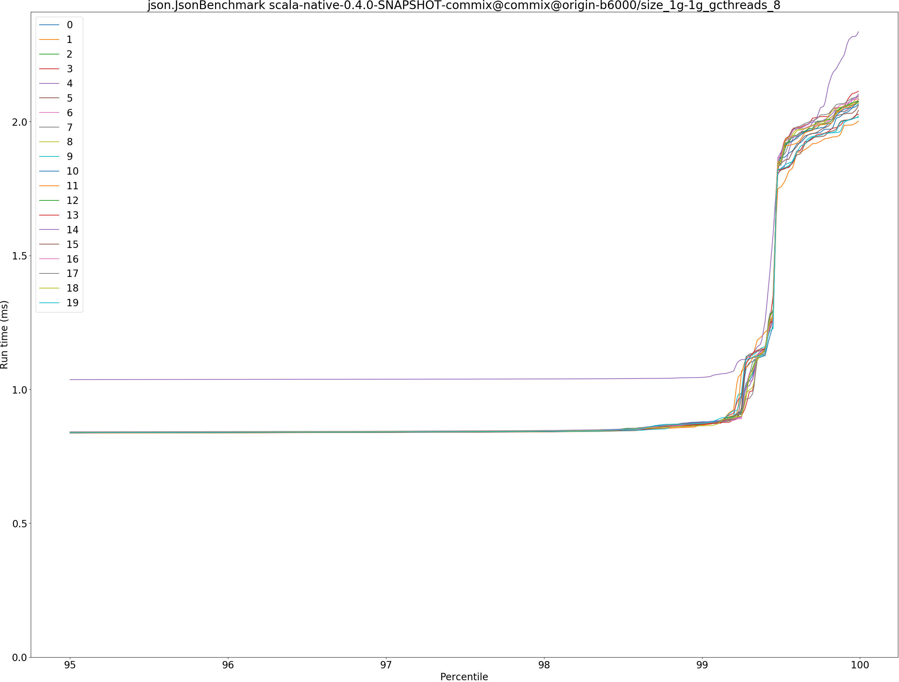
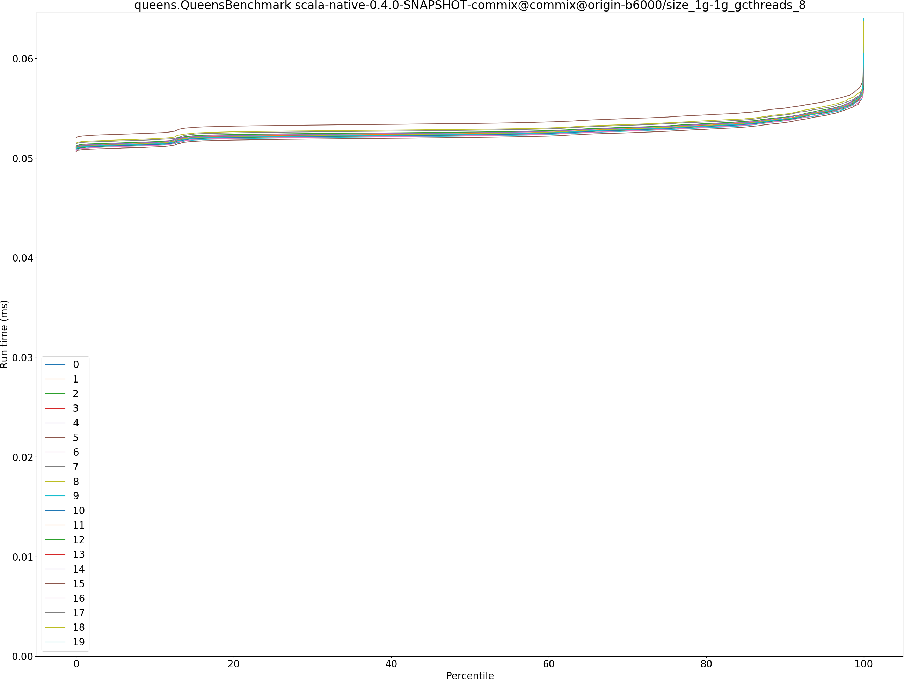
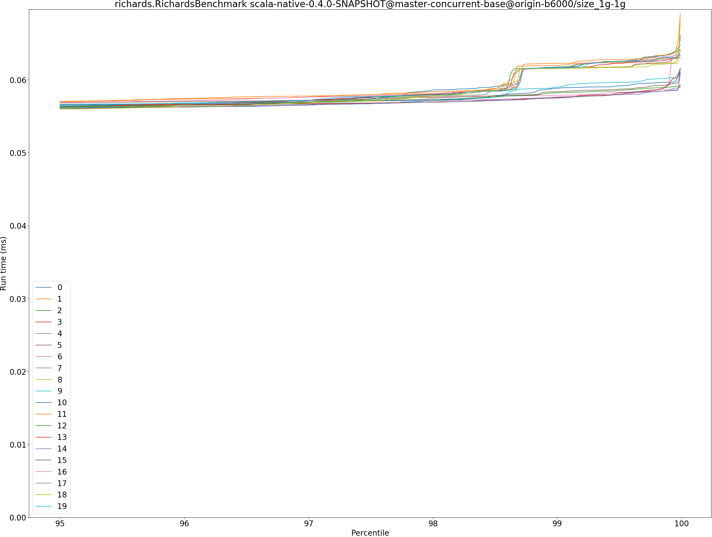

# Summary
## Benchmark run time (ms) at 50 percentile 

|name | scala-native-0.4.0-SNAPSHOT@master-concurrent-base@origin-b6000/size_1g-1g | scala-native-0.4.0-SNAPSHOT-commix@commix@origin-b6000/size_1g-1g_gcthreads_8 | |
| -- | -- | -- | -- |
|[bounce.BounceBenchmark](#bouncebouncebenchmark)|0.0161|0.0162|+0.70%|
|[brainfuck.BrainfuckBenchmark](#brainfuckbrainfuckbenchmark)|1.0798|1.0889|+0.84%|
|[cd.CDBenchmark](#cdcdbenchmark)|16.1860|16.0996|__-0.53%__|
|[deltablue.DeltaBlueBenchmark](#deltabluedeltabluebenchmark)|0.1752|0.1744|__-0.45%__|
|[gcbench.GCBenchBenchmark](#gcbenchgcbenchbenchmark)|66.7520|63.6514|__-4.64%__|
|[json.JsonBenchmark](#jsonjsonbenchmark)|0.8217|0.8268|+0.61%|
|[kmeans.KmeansBenchmark](#kmeanskmeansbenchmark)|19.8252|19.8159|__-0.05%__|
|[mandelbrot.MandelbrotBenchmark](#mandelbrotmandelbrotbenchmark)|108.8622|108.2634|__-0.55%__|
|[nbody.NbodyBenchmark](#nbodynbodybenchmark)|19.2773|19.2772|__-0.00%__|
|[permute.PermuteBenchmark](#permutepermutebenchmark)|0.1229|0.1257|+2.34%|
|[queens.QueensBenchmark](#queensqueensbenchmark)|0.0528|0.0524|__-0.76%__|
|[richards.RichardsBenchmark](#richardsrichardsbenchmark)|0.0539|0.0541|+0.40%|
|[sudoku.SudokuBenchmark](#sudokusudokubenchmark)|1.4260|1.4633|+2.62%|
|[tracer.TracerBenchmark](#tracertracerbenchmark)|0.4569|0.4567|__-0.04%__|
| __Geometrical mean:__|| |+0.02%|
## Benchmark run time (ms) at 90 percentile 

|name | scala-native-0.4.0-SNAPSHOT@master-concurrent-base@origin-b6000/size_1g-1g | scala-native-0.4.0-SNAPSHOT-commix@commix@origin-b6000/size_1g-1g_gcthreads_8 | |
| -- | -- | -- | -- |
|[bounce.BounceBenchmark](#bouncebouncebenchmark)|0.0171|0.0173|+1.39%|
|[brainfuck.BrainfuckBenchmark](#brainfuckbrainfuckbenchmark)|1.0856|1.0945|+0.82%|
|[cd.CDBenchmark](#cdcdbenchmark)|19.1746|19.1074|__-0.35%__|
|[deltablue.DeltaBlueBenchmark](#deltabluedeltabluebenchmark)|0.1770|0.1764|__-0.37%__|
|[gcbench.GCBenchBenchmark](#gcbenchgcbenchbenchmark)|68.7047|65.2223|__-5.07%__|
|[json.JsonBenchmark](#jsonjsonbenchmark)|0.8304|0.8350|+0.56%|
|[kmeans.KmeansBenchmark](#kmeanskmeansbenchmark)|20.1310|20.1261|__-0.02%__|
|[mandelbrot.MandelbrotBenchmark](#mandelbrotmandelbrotbenchmark)|108.9007|108.2722|__-0.58%__|
|[nbody.NbodyBenchmark](#nbodynbodybenchmark)|19.2786|19.2785|__-0.00%__|
|[permute.PermuteBenchmark](#permutepermutebenchmark)|0.2254|0.2285|+1.36%|
|[queens.QueensBenchmark](#queensqueensbenchmark)|0.0539|0.0539|+0.08%|
|[richards.RichardsBenchmark](#richardsrichardsbenchmark)|0.0555|0.0560|+0.87%|
|[sudoku.SudokuBenchmark](#sudokusudokubenchmark)|1.4776|1.5165|+2.63%|
|[tracer.TracerBenchmark](#tracertracerbenchmark)|0.4609|0.4610|+0.02%|
| __Geometrical mean:__|| |+0.08%|
## Benchmark run time (ms) at 99 percentile 

|name | scala-native-0.4.0-SNAPSHOT@master-concurrent-base@origin-b6000/size_1g-1g | scala-native-0.4.0-SNAPSHOT-commix@commix@origin-b6000/size_1g-1g_gcthreads_8 | |
| -- | -- | -- | -- |
|[bounce.BounceBenchmark](#bouncebouncebenchmark)|0.0183|0.0187|+2.45%|
|[brainfuck.BrainfuckBenchmark](#brainfuckbrainfuckbenchmark)|1.1028|1.1041|+0.12%|
|[cd.CDBenchmark](#cdcdbenchmark)|22.1083|22.3734|+1.20%|
|[deltablue.DeltaBlueBenchmark](#deltabluedeltabluebenchmark)|0.1794|0.1789|__-0.28%__|
|[gcbench.GCBenchBenchmark](#gcbenchgcbenchbenchmark)|76.5630|65.8541|__-13.99%__|
|[json.JsonBenchmark](#jsonjsonbenchmark)|0.8394|0.8724|+3.93%|
|[kmeans.KmeansBenchmark](#kmeanskmeansbenchmark)|23.1417|20.4900|__-11.46%__|
|[mandelbrot.MandelbrotBenchmark](#mandelbrotmandelbrotbenchmark)|111.0688|108.2793|__-2.51%__|
|[nbody.NbodyBenchmark](#nbodynbodybenchmark)|19.2815|19.2813|__-0.00%__|
|[permute.PermuteBenchmark](#permutepermutebenchmark)|0.2291|0.2328|+1.61%|
|[queens.QueensBenchmark](#queensqueensbenchmark)|0.0551|0.0557|+1.15%|
|[richards.RichardsBenchmark](#richardsrichardsbenchmark)|0.0587|0.0584|__-0.48%__|
|[sudoku.SudokuBenchmark](#sudokusudokubenchmark)|1.4899|1.5455|+3.74%|
|[tracer.TracerBenchmark](#tracertracerbenchmark)|0.4652|0.4665|+0.30%|
| __Geometrical mean:__|| |__-1.15%__|
## Benchmark run time (ms) at 99.9 percentile 

|name | scala-native-0.4.0-SNAPSHOT@master-concurrent-base@origin-b6000/size_1g-1g | scala-native-0.4.0-SNAPSHOT-commix@commix@origin-b6000/size_1g-1g_gcthreads_8 | |
| -- | -- | -- | -- |
|[bounce.BounceBenchmark](#bouncebouncebenchmark)|0.0193|0.0199|+3.32%|
|[brainfuck.BrainfuckBenchmark](#brainfuckbrainfuckbenchmark)|5.1452|2.1741|__-57.74%__|
|[cd.CDBenchmark](#cdcdbenchmark)|23.3408|22.7426|__-2.56%__|
|[deltablue.DeltaBlueBenchmark](#deltabluedeltabluebenchmark)|0.1822|0.2735|+50.12%|
|[gcbench.GCBenchBenchmark](#gcbenchgcbenchbenchmark)|79.4051|67.1818|__-15.39%__|
|[json.JsonBenchmark](#jsonjsonbenchmark)|5.1128|2.0376|__-60.15%__|
|[kmeans.KmeansBenchmark](#kmeanskmeansbenchmark)|29.0589|28.8935|__-0.57%__|
|[mandelbrot.MandelbrotBenchmark](#mandelbrotmandelbrotbenchmark)|111.8356|108.3561|__-3.11%__|
|[nbody.NbodyBenchmark](#nbodynbodybenchmark)|19.2917|19.2893|__-0.01%__|
|[permute.PermuteBenchmark](#permutepermutebenchmark)|0.2319|0.4498|+93.90%|
|[queens.QueensBenchmark](#queensqueensbenchmark)|0.0565|0.0567|+0.46%|
|[richards.RichardsBenchmark](#richardsrichardsbenchmark)|0.0629|0.0623|__-1.02%__|
|[sudoku.SudokuBenchmark](#sudokusudokubenchmark)|5.7184|1.9848|__-65.29%__|
|[tracer.TracerBenchmark](#tracertracerbenchmark)|4.4912|1.1745|__-73.85%__|
| __Geometrical mean:__|| |__-21.09%__|
## Benchmark total run time (ms) 

|name | scala-native-0.4.0-SNAPSHOT@master-concurrent-base@origin-b6000/size_1g-1g | scala-native-0.4.0-SNAPSHOT-commix@commix@origin-b6000/size_1g-1g_gcthreads_8 | |
| -- | -- | -- | -- |
|[bounce.BounceBenchmark](#bouncebouncebenchmark)|1042.7215|1052.3422|+0.92%|
|[brainfuck.BrainfuckBenchmark](#brainfuckbrainfuckbenchmark)|69627.4355|69891.5019|+0.38%|
|[cd.CDBenchmark](#cdcdbenchmark)|1106147.6417|1079739.8913|__-2.39%__|
|[deltablue.DeltaBlueBenchmark](#deltabluedeltabluebenchmark)|11116.8768|11016.8894|__-0.90%__|
|[gcbench.GCBenchBenchmark](#gcbenchgcbenchbenchmark)|4209062.0237|4088416.2541|__-2.87%__|
|[json.JsonBenchmark](#jsonjsonbenchmark)|54062.8306|53354.8993|__-1.31%__|
|[kmeans.KmeansBenchmark](#kmeanskmeansbenchmark)|1274524.3480|1271121.8144|__-0.27%__|
|[mandelbrot.MandelbrotBenchmark](#mandelbrotmandelbrotbenchmark)|6970177.5024|6928942.6851|__-0.59%__|
|[nbody.NbodyBenchmark](#nbodynbodybenchmark)|1229436.4661|1229665.9777|+0.02%|
|[permute.PermuteBenchmark](#permutepermutebenchmark)|8798.0362|8889.1362|+1.04%|
|[queens.QueensBenchmark](#queensqueensbenchmark)|3384.6963|3367.8275|__-0.50%__|
|[richards.RichardsBenchmark](#richardsrichardsbenchmark)|3467.7121|3484.7052|+0.49%|
|[sudoku.SudokuBenchmark](#sudokusudokubenchmark)|92359.3064|94647.2347|+2.48%|
|[tracer.TracerBenchmark](#tracertracerbenchmark)|29781.8605|29385.1165|__-1.33%__|
| __Geometrical mean:__|| |__-0.35%__|
# Individual benchmarks
## bounce.BounceBenchmark

## brainfuck.BrainfuckBenchmark

## cd.CDBenchmark

## deltablue.DeltaBlueBenchmark

## gcbench.GCBenchBenchmark

## json.JsonBenchmark

## kmeans.KmeansBenchmark

## mandelbrot.MandelbrotBenchmark

## nbody.NbodyBenchmark

## permute.PermuteBenchmark

## queens.QueensBenchmark

## richards.RichardsBenchmark

## sudoku.SudokuBenchmark

## tracer.TracerBenchmark

