# Summary
## Benchmark run time (ms) at 50 percentile 

|name | scala-native-0.4.0-SNAPSHOT@replica-starting-point@origin-b6000 | scala-native-0.4.0-SNAPSHOT@replica-metadata-changes@origin-b6000 |  | scala-native-0.4.0-SNAPSHOT@master-concurrent-base@origin-b6000 |  | scala-native-0.4.0-SNAPSHOT-commix@commix@origin-b6000/gcthreads_8 | |
| -- | -- | -- | -- | -- | -- | -- | -- |
|[bounce.BounceBenchmark](#bouncebouncebenchmark)|0.0157|0.0150|__-4.22%__|0.0149|__-4.77%__|0.0150|__-4.27%__|
|[brainfuck.BrainfuckBenchmark](#brainfuckbrainfuckbenchmark)|1.2513|0.0000|__-100.00%__|1.1106|__-11.25%__|1.1031|__-11.85%__|
|[cd.CDBenchmark](#cdcdbenchmark)|20.1290|0.0000|__-100.00%__|16.3921|__-18.56%__|16.3150|__-18.95%__|
|[deltablue.DeltaBlueBenchmark](#deltabluedeltabluebenchmark)|0.1320|0.1269|__-3.91%__|0.1272|__-3.68%__|0.1266|__-4.12%__|
|[gcbench.GCBenchBenchmark](#gcbenchgcbenchbenchmark)|80.6691|0.0000|__-100.00%__|76.7033|__-4.92%__|63.8236|__-20.88%__|
|[json.JsonBenchmark](#jsonjsonbenchmark)|1.1278|0.7958|__-29.44%__|0.7997|__-29.09%__|0.8160|__-27.65%__|
|[kmeans.KmeansBenchmark](#kmeanskmeansbenchmark)|22.6223|20.4118|__-9.77%__|19.8906|__-12.08%__|19.6813|__-13.00%__|
|[nbody.NbodyBenchmark](#nbodynbodybenchmark)|19.2821|19.2773|__-0.03%__|19.2773|__-0.03%__|19.2773|__-0.03%__|
|[permute.PermuteBenchmark](#permutepermutebenchmark)|0.1352|0.1221|__-9.68%__|0.1221|__-9.66%__|0.1248|__-7.72%__|
|[queens.QueensBenchmark](#queensqueensbenchmark)|0.0517|0.0497|__-3.73%__|0.0495|__-4.27%__|0.0491|__-4.94%__|
|[richards.RichardsBenchmark](#richardsrichardsbenchmark)|0.0514|0.0508|__-1.29%__|0.0507|__-1.50%__|0.0508|__-1.17%__|
|[sudoku.SudokuBenchmark](#sudokusudokubenchmark)|1.4977|1.4376|__-4.02%__|1.4222|__-5.05%__|1.4642|__-2.24%__|
|[tracer.TracerBenchmark](#tracertracerbenchmark)|0.5199|0.4587|__-11.77%__|0.4582|__-11.87%__|0.4580|__-11.91%__|
| __Geometrical mean:__|| |__-8.18%__| |__-9.33%__| |__-10.29%__|
## Benchmark run time (ms) at 90 percentile 

|name | scala-native-0.4.0-SNAPSHOT@replica-starting-point@origin-b6000 | scala-native-0.4.0-SNAPSHOT@replica-metadata-changes@origin-b6000 |  | scala-native-0.4.0-SNAPSHOT@master-concurrent-base@origin-b6000 |  | scala-native-0.4.0-SNAPSHOT-commix@commix@origin-b6000/gcthreads_8 | |
| -- | -- | -- | -- | -- | -- | -- | -- |
|[bounce.BounceBenchmark](#bouncebouncebenchmark)|0.0159|0.0152|__-4.22%__|0.0151|__-4.72%__|0.0152|__-4.20%__|
|[brainfuck.BrainfuckBenchmark](#brainfuckbrainfuckbenchmark)|1.2696|0.0000|__-100.00%__|1.1458|__-9.75%__|1.1420|__-10.05%__|
|[cd.CDBenchmark](#cdcdbenchmark)|22.9070|0.0000|__-100.00%__|16.5298|__-27.84%__|16.4618|__-28.14%__|
|[deltablue.DeltaBlueBenchmark](#deltabluedeltabluebenchmark)|0.1345|0.1283|__-4.61%__|0.1289|__-4.17%__|0.1288|__-4.24%__|
|[gcbench.GCBenchBenchmark](#gcbenchgcbenchbenchmark)|84.4396|0.0000|__-100.00%__|80.2157|__-5.00%__|65.5658|__-22.35%__|
|[json.JsonBenchmark](#jsonjsonbenchmark)|1.5185|1.0259|__-32.44%__|1.0634|__-29.97%__|0.9336|__-38.52%__|
|[kmeans.KmeansBenchmark](#kmeanskmeansbenchmark)|24.8087|20.6917|__-16.59%__|20.7525|__-16.35%__|20.6923|__-16.59%__|
|[nbody.NbodyBenchmark](#nbodynbodybenchmark)|19.3228|19.2785|__-0.23%__|19.2787|__-0.23%__|19.2786|__-0.23%__|
|[permute.PermuteBenchmark](#permutepermutebenchmark)|0.1476|0.1268|__-14.08%__|0.1392|__-5.69%__|0.1361|__-7.81%__|
|[queens.QueensBenchmark](#queensqueensbenchmark)|0.0520|0.0500|__-3.91%__|0.0499|__-3.92%__|0.0493|__-5.08%__|
|[richards.RichardsBenchmark](#richardsrichardsbenchmark)|0.0532|0.0520|__-2.24%__|0.0523|__-1.60%__|0.0522|__-1.80%__|
|[sudoku.SudokuBenchmark](#sudokusudokubenchmark)|1.7515|1.4930|__-14.76%__|1.5087|__-13.86%__|1.5749|__-10.08%__|
|[tracer.TracerBenchmark](#tracertracerbenchmark)|0.5243|0.4637|__-11.56%__|0.4628|__-11.73%__|0.4632|__-11.66%__|
| __Geometrical mean:__|| |__-10.98%__| |__-10.88%__| |__-13.11%__|
## Benchmark run time (ms) at 99 percentile 

|name | scala-native-0.4.0-SNAPSHOT@replica-starting-point@origin-b6000 | scala-native-0.4.0-SNAPSHOT@replica-metadata-changes@origin-b6000 |  | scala-native-0.4.0-SNAPSHOT@master-concurrent-base@origin-b6000 |  | scala-native-0.4.0-SNAPSHOT-commix@commix@origin-b6000/gcthreads_8 | |
| -- | -- | -- | -- | -- | -- | -- | -- |
|[bounce.BounceBenchmark](#bouncebouncebenchmark)|0.0161|0.0155|__-4.12%__|0.0154|__-4.59%__|0.0155|__-3.82%__|
|[brainfuck.BrainfuckBenchmark](#brainfuckbrainfuckbenchmark)|1.3005|0.0000|__-100.00%__|1.1625|__-10.61%__|1.1591|__-10.88%__|
|[cd.CDBenchmark](#cdcdbenchmark)|26.0926|0.0000|__-100.00%__|17.5260|__-32.83%__|19.0555|__-26.97%__|
|[deltablue.DeltaBlueBenchmark](#deltabluedeltabluebenchmark)|0.1891|0.1823|__-3.56%__|0.1781|__-5.80%__|0.1794|__-5.14%__|
|[gcbench.GCBenchBenchmark](#gcbenchgcbenchbenchmark)|85.1993|0.0000|__-100.00%__|81.2017|__-4.69%__|73.0360|__-14.28%__|
|[json.JsonBenchmark](#jsonjsonbenchmark)|1.5439|1.1106|__-28.06%__|1.1129|__-27.92%__|1.1529|__-25.33%__|
|[kmeans.KmeansBenchmark](#kmeanskmeansbenchmark)|31.4424|29.2357|__-7.02%__|21.0834|__-32.95%__|28.6034|__-9.03%__|
|[nbody.NbodyBenchmark](#nbodynbodybenchmark)|28.5604|19.2805|__-32.49%__|21.4905|__-24.75%__|19.2817|__-32.49%__|
|[permute.PermuteBenchmark](#permutepermutebenchmark)|0.1790|0.1423|__-20.52%__|0.1425|__-20.38%__|0.1479|__-17.36%__|
|[queens.QueensBenchmark](#queensqueensbenchmark)|0.0543|0.0524|__-3.34%__|0.0518|__-4.48%__|0.0516|__-4.88%__|
|[richards.RichardsBenchmark](#richardsrichardsbenchmark)|0.0617|0.0555|__-10.02%__|0.0543|__-12.02%__|0.0543|__-12.09%__|
|[sudoku.SudokuBenchmark](#sudokusudokubenchmark)|1.7729|1.6560|__-6.59%__|1.6523|__-6.81%__|1.6470|__-7.10%__|
|[tracer.TracerBenchmark](#tracertracerbenchmark)|0.5279|0.4671|__-11.51%__|0.4660|__-11.72%__|0.4668|__-11.57%__|
| __Geometrical mean:__|| |__-13.35%__| |__-16.04%__| |__-14.40%__|
## Benchmark run time (ms) at 99.9 percentile 

|name | scala-native-0.4.0-SNAPSHOT@replica-starting-point@origin-b6000 | scala-native-0.4.0-SNAPSHOT@replica-metadata-changes@origin-b6000 |  | scala-native-0.4.0-SNAPSHOT@master-concurrent-base@origin-b6000 |  | scala-native-0.4.0-SNAPSHOT-commix@commix@origin-b6000/gcthreads_8 | |
| -- | -- | -- | -- | -- | -- | -- | -- |
|[bounce.BounceBenchmark](#bouncebouncebenchmark)|0.0275|0.0336|+22.20%|0.0246|__-10.44%__|0.0246|__-10.29%__|
|[brainfuck.BrainfuckBenchmark](#brainfuckbrainfuckbenchmark)|1.3074|0.0000|__-100.00%__|1.1760|__-10.05%__|1.1923|__-8.80%__|
|[cd.CDBenchmark](#cdcdbenchmark)|26.2724|0.0000|__-100.00%__|20.5336|__-21.84%__|20.4328|__-22.23%__|
|[deltablue.DeltaBlueBenchmark](#deltabluedeltabluebenchmark)|0.2042|0.1853|__-9.27%__|0.1853|__-9.26%__|0.1891|__-7.40%__|
|[gcbench.GCBenchBenchmark](#gcbenchgcbenchbenchmark)|97.0861|0.0000|__-100.00%__|81.6768|__-15.87%__|75.3812|__-22.36%__|
|[json.JsonBenchmark](#jsonjsonbenchmark)|1.5664|1.1219|__-28.37%__|1.1259|__-28.12%__|1.3316|__-14.99%__|
|[kmeans.KmeansBenchmark](#kmeanskmeansbenchmark)|35.2623|30.1037|__-14.63%__|21.3408|__-39.48%__|29.6421|__-15.94%__|
|[nbody.NbodyBenchmark](#nbodynbodybenchmark)|28.6519|19.2906|__-32.67%__|28.5500|__-0.36%__|28.5487|__-0.36%__|
|[permute.PermuteBenchmark](#permutepermutebenchmark)|0.1944|0.1444|__-25.72%__|0.1451|__-25.36%__|0.1506|__-22.54%__|
|[queens.QueensBenchmark](#queensqueensbenchmark)|0.0647|0.0697|+7.64%|0.0680|+5.01%|0.0637|__-1.55%__|
|[richards.RichardsBenchmark](#richardsrichardsbenchmark)|0.0643|0.0687|+6.94%|0.0679|+5.69%|0.0613|__-4.60%__|
|[sudoku.SudokuBenchmark](#sudokusudokubenchmark)|1.7814|1.6847|__-5.43%__|1.6881|__-5.24%__|1.6812|__-5.63%__|
|[tracer.TracerBenchmark](#tracertracerbenchmark)|0.5307|0.4705|__-11.34%__|0.4686|__-11.70%__|0.4698|__-11.48%__|
| __Geometrical mean:__|| |__-10.57%__| |__-13.83%__| |__-11.71%__|
## Benchmark total run time (ms) 

|name | scala-native-0.4.0-SNAPSHOT@replica-starting-point@origin-b6000 | scala-native-0.4.0-SNAPSHOT@replica-metadata-changes@origin-b6000 |  | scala-native-0.4.0-SNAPSHOT@master-concurrent-base@origin-b6000 |  | scala-native-0.4.0-SNAPSHOT-commix@commix@origin-b6000/gcthreads_8 | |
| -- | -- | -- | -- | -- | -- | -- | -- |
|[bounce.BounceBenchmark](#bouncebouncebenchmark)|1003.6182|962.0953|__-4.14%__|956.1604|__-4.73%__|960.9325|__-4.25%__|
|[brainfuck.BrainfuckBenchmark](#brainfuckbrainfuckbenchmark)|77959.2376|0.0000|__-100.00%__|70695.1806|__-9.32%__|70856.7718|__-9.11%__|
|[cd.CDBenchmark](#cdcdbenchmark)|1317827.3472|0.0000|__-100.00%__|1051934.9033|__-20.18%__|1049767.6964|__-20.34%__|
|[deltablue.DeltaBlueBenchmark](#deltabluedeltabluebenchmark)|8626.8423|8250.0980|__-4.37%__|8273.9066|__-4.09%__|8238.3563|__-4.50%__|
|[gcbench.GCBenchBenchmark](#gcbenchgcbenchbenchmark)|5230554.7532|0.0000|__-100.00%__|4872374.3329|__-6.85%__|4116540.3907|__-21.30%__|
|[json.JsonBenchmark](#jsonjsonbenchmark)|75652.3681|54754.4432|__-27.62%__|55093.7061|__-27.18%__|53905.4553|__-28.75%__|
|[kmeans.KmeansBenchmark](#kmeanskmeansbenchmark)|1472279.4059|1313026.4743|__-10.82%__|1279040.5890|__-13.13%__|1278602.0905|__-13.15%__|
|[nbody.NbodyBenchmark](#nbodynbodybenchmark)|1236782.3793|1228813.3602|__-0.64%__|1234671.7316|__-0.17%__|1230505.9653|__-0.51%__|
|[permute.PermuteBenchmark](#permutepermutebenchmark)|8806.1766|7940.8371|__-9.83%__|7948.7040|__-9.74%__|8130.8808|__-7.67%__|
|[queens.QueensBenchmark](#queensqueensbenchmark)|3311.3381|3189.7830|__-3.67%__|3173.6736|__-4.16%__|3148.3356|__-4.92%__|
|[richards.RichardsBenchmark](#richardsrichardsbenchmark)|3339.0357|3271.3092|__-2.03%__|3265.9818|__-2.19%__|3273.9625|__-1.95%__|
|[sudoku.SudokuBenchmark](#sudokusudokubenchmark)|97802.4858|93387.1556|__-4.51%__|92653.3428|__-5.26%__|95258.4653|__-2.60%__|
|[tracer.TracerBenchmark](#tracertracerbenchmark)|32997.8425|28900.5503|__-12.42%__|28894.1991|__-12.44%__|28934.0523|__-12.32%__|
| __Geometrical mean:__|| |__-8.34%__| |__-9.50%__| |__-10.52%__|
# Individual benchmarks
## bounce.BounceBenchmark

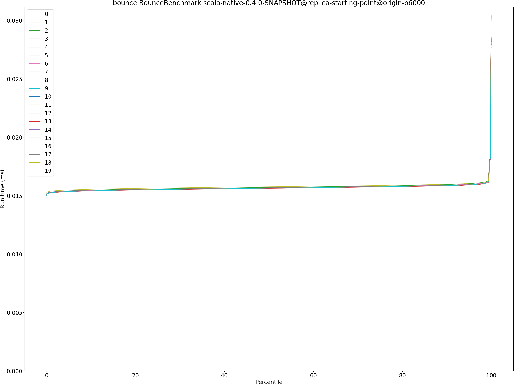

## brainfuck.BrainfuckBenchmark

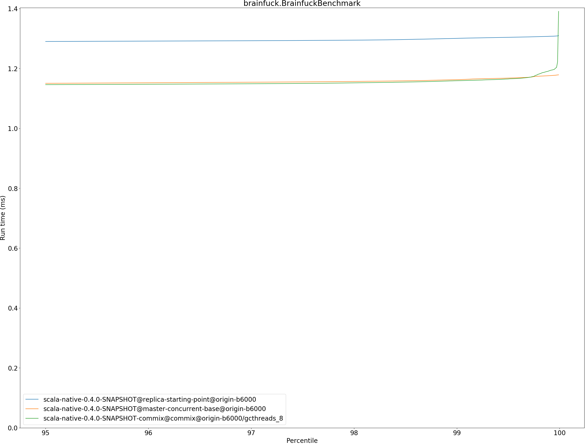

## cd.CDBenchmark

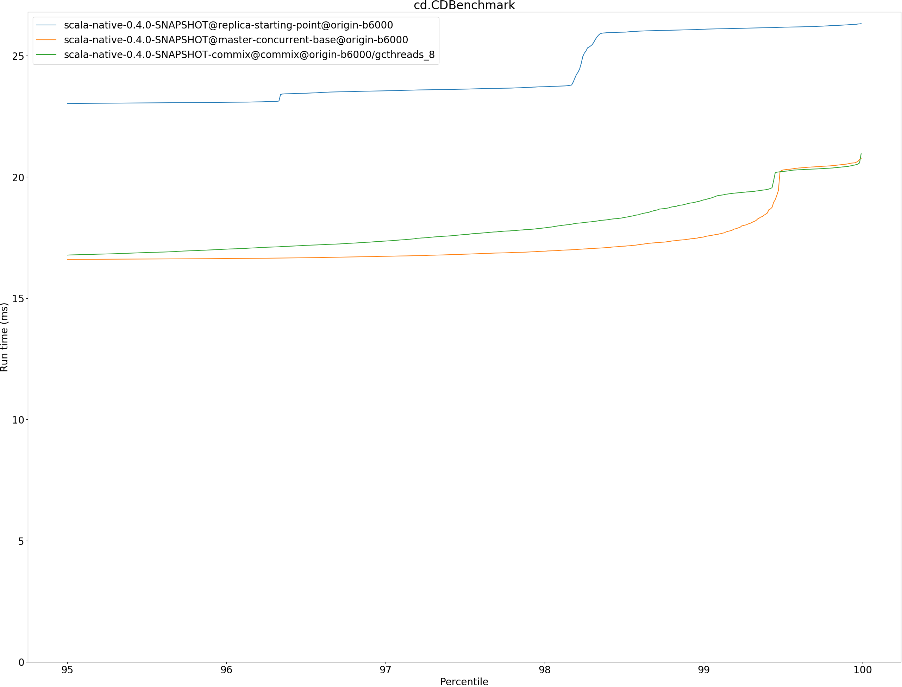

## deltablue.DeltaBlueBenchmark

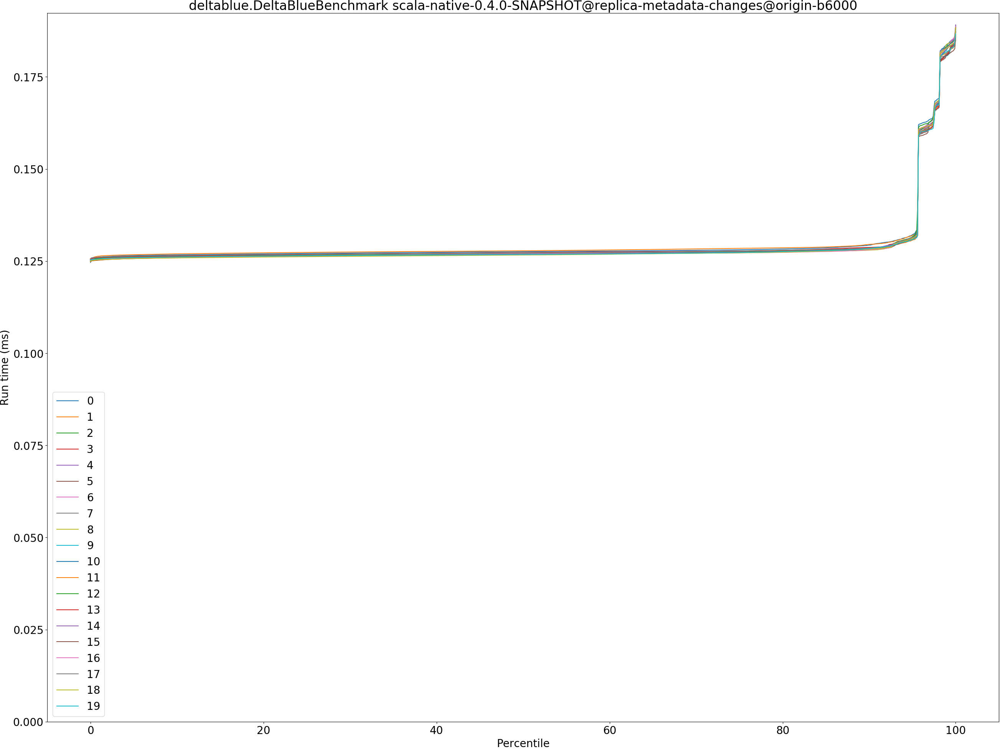

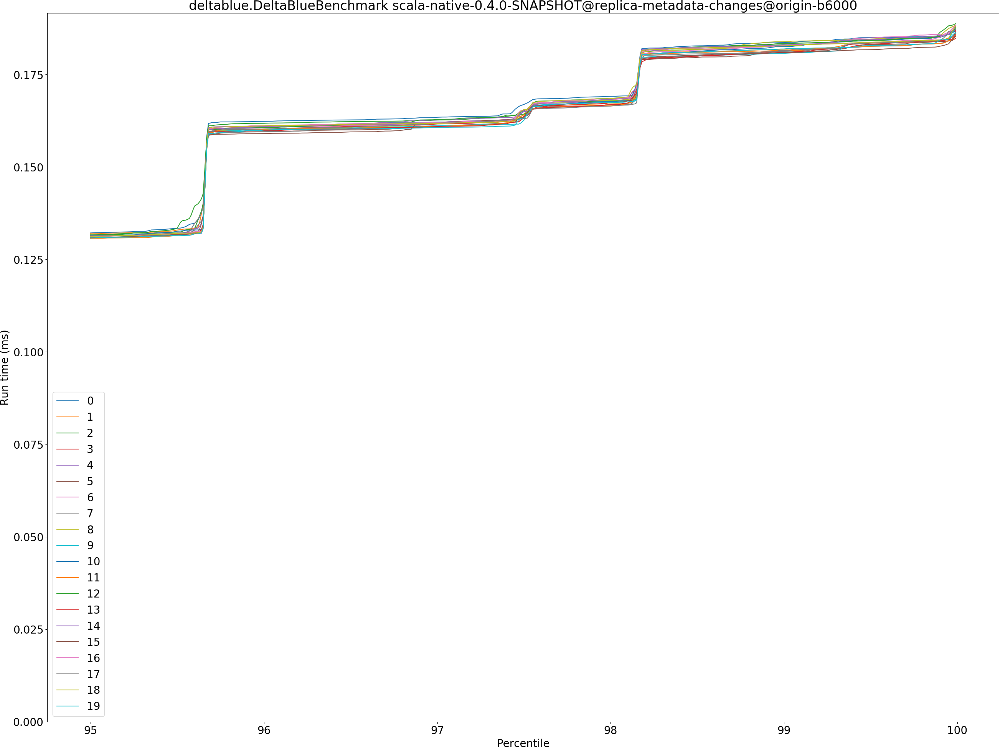

## gcbench.GCBenchBenchmark
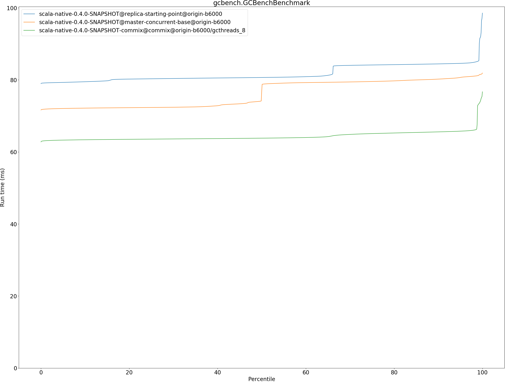

## json.JsonBenchmark

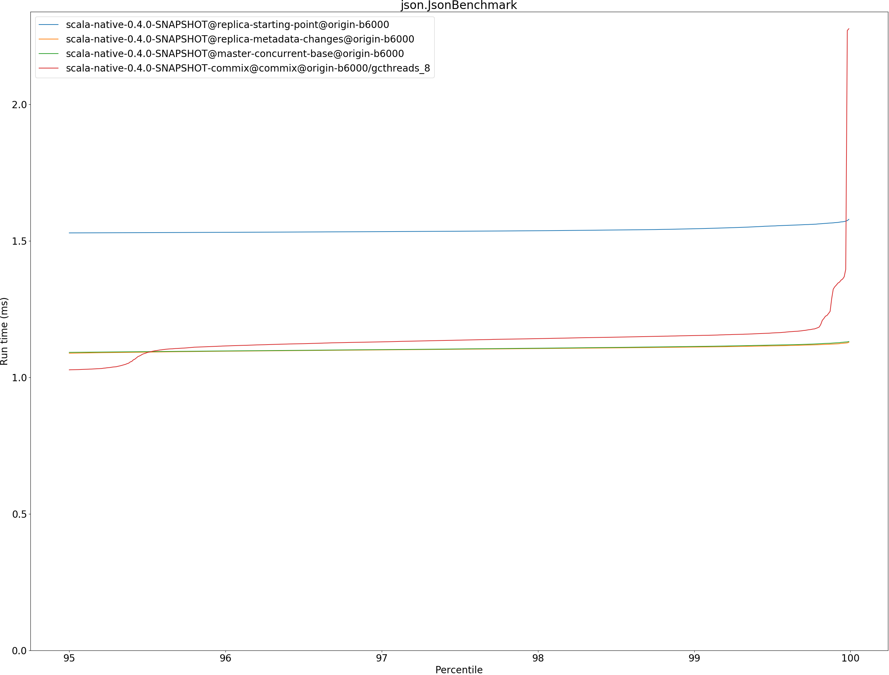

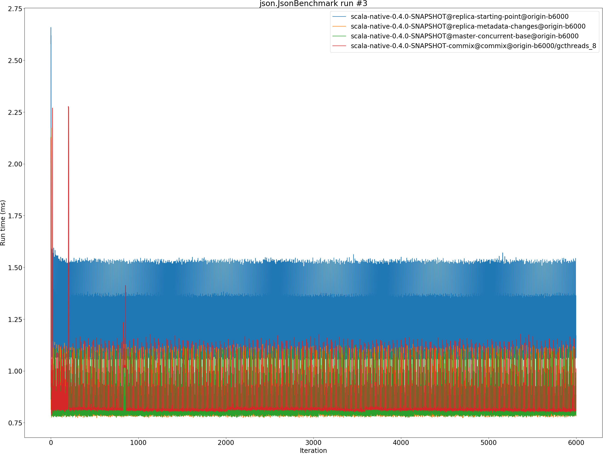

## kmeans.KmeansBenchmark

## nbody.NbodyBenchmark

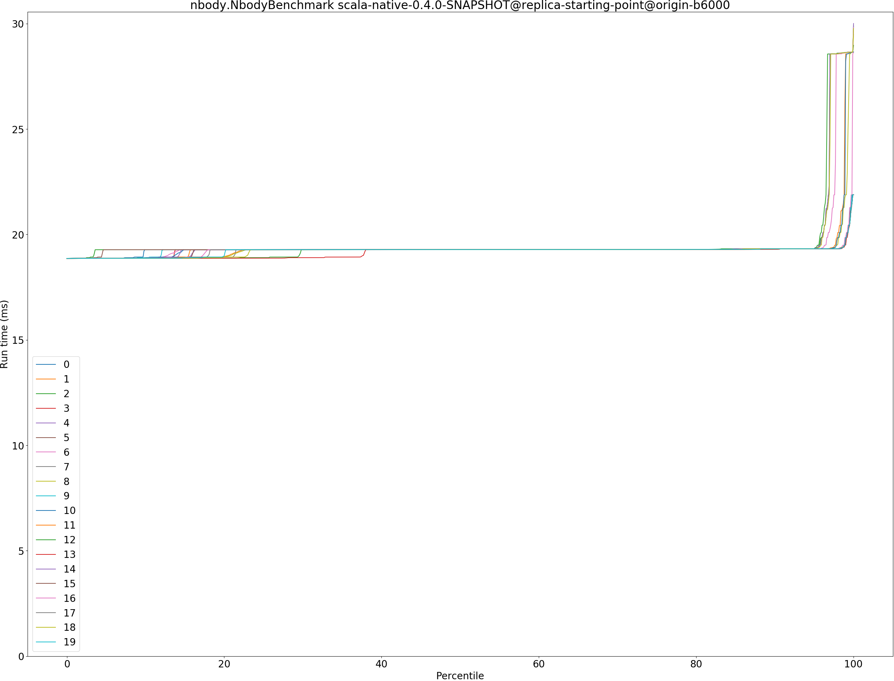

## permute.PermuteBenchmark
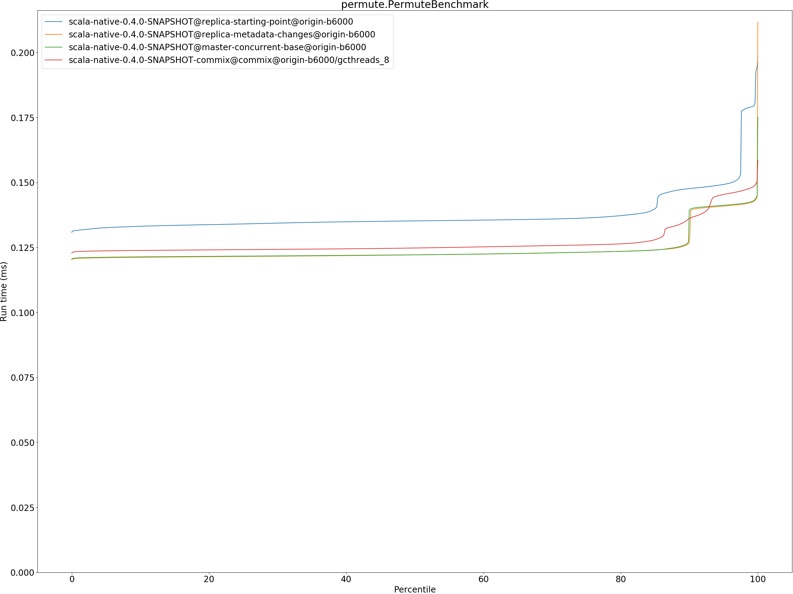

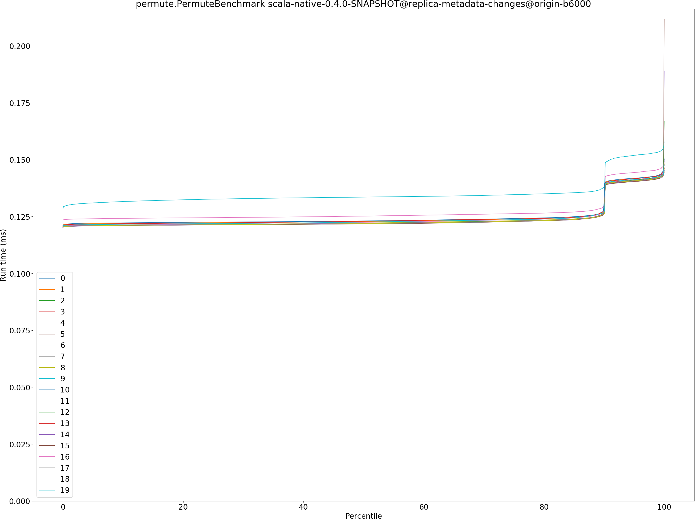

## queens.QueensBenchmark

## richards.RichardsBenchmark

## sudoku.SudokuBenchmark

## tracer.TracerBenchmark

