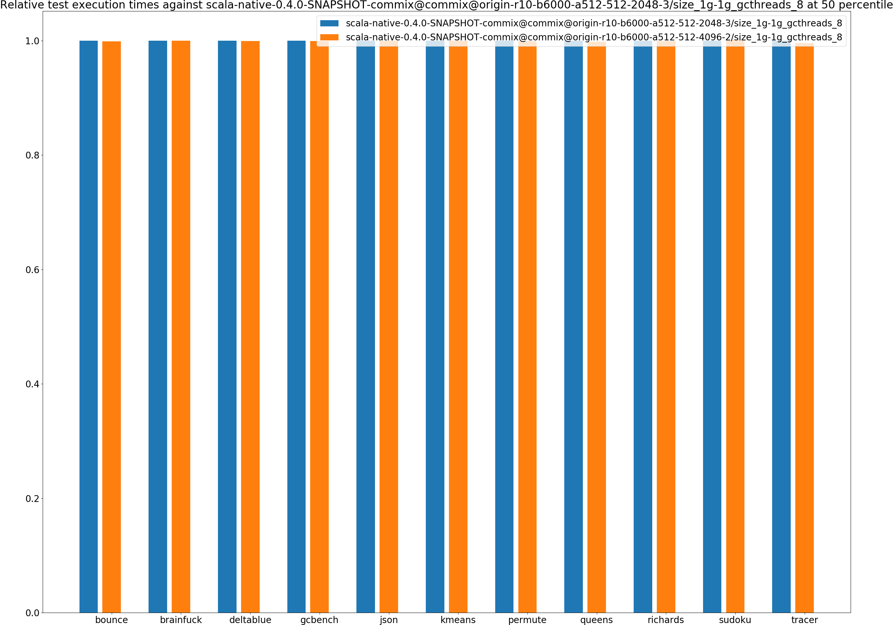
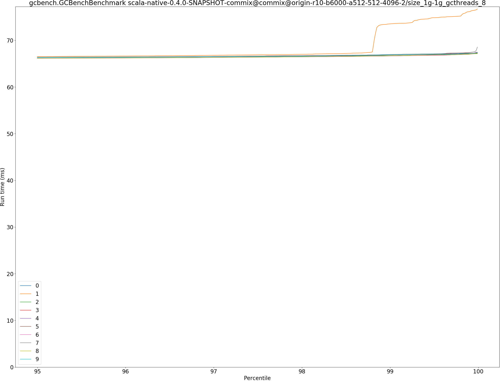
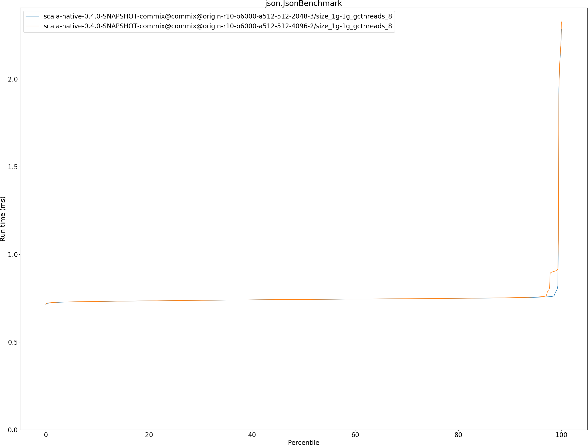
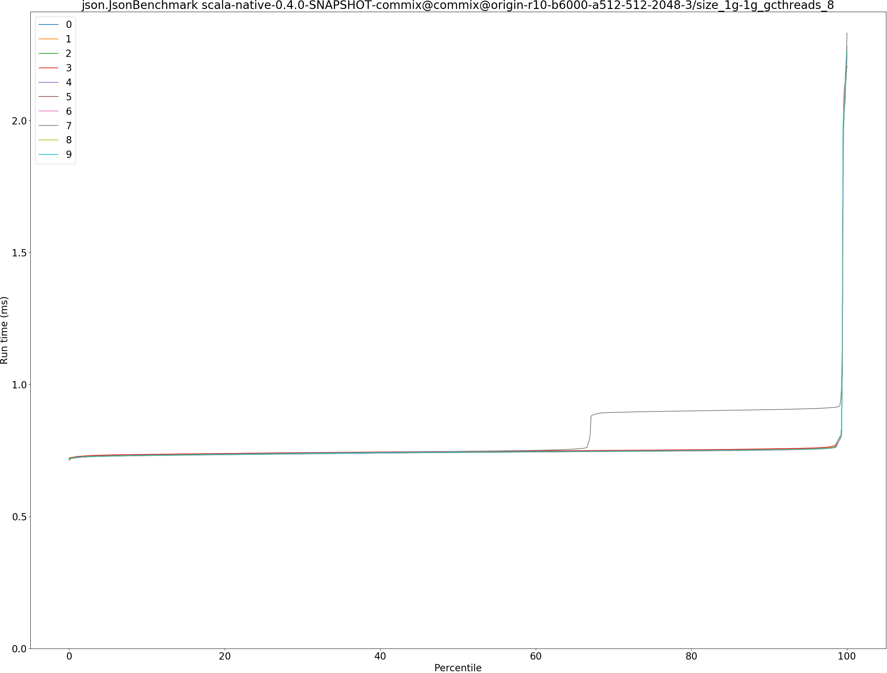
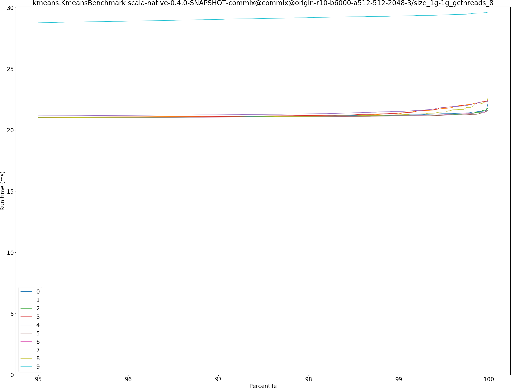
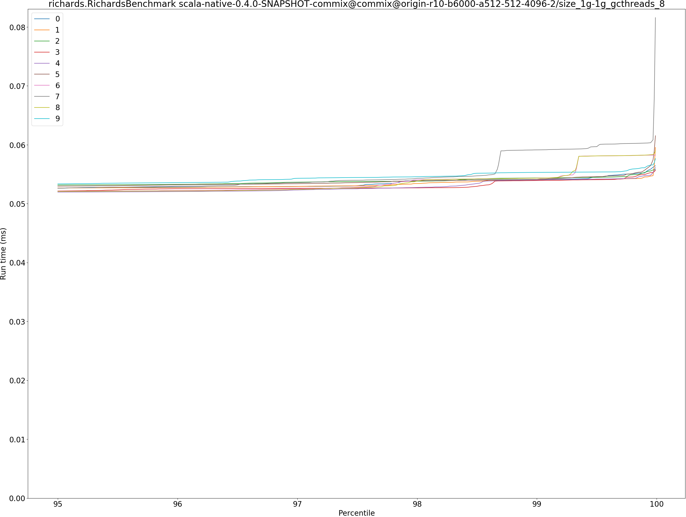
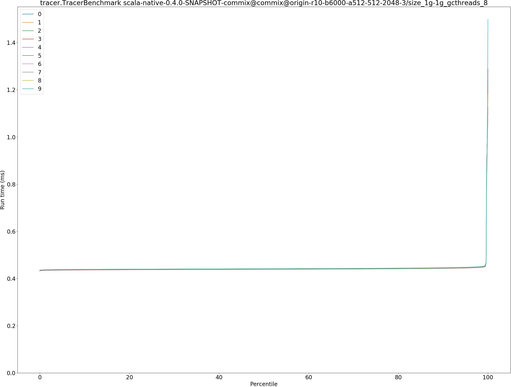

# Summary
## Benchmark run time (ms) at 50 percentile 

|name | scala-native-0.4.0-SNAPSHOT-commix@commix@origin-r10-b6000-a512-512-2048-3/size_1g-1g_gcthreads_8 | scala-native-0.4.0-SNAPSHOT-commix@commix@origin-r10-b6000-a512-512-4096-2/size_1g-1g_gcthreads_8 | |
| -- | -- | -- | -- |
|[bounce.BounceBenchmark](#bouncebouncebenchmark)|0.0159|0.0159|__-0.11%__|
|[brainfuck.BrainfuckBenchmark](#brainfuckbrainfuckbenchmark)|1.1403|1.1405|+0.01%|
|[deltablue.DeltaBlueBenchmark](#deltabluedeltabluebenchmark)|0.1807|0.1806|__-0.04%__|
|[gcbench.GCBenchBenchmark](#gcbenchgcbenchbenchmark)|64.9614|64.9202|__-0.06%__|
|[json.JsonBenchmark](#jsonjsonbenchmark)|0.7428|0.7428|+0.01%|
|[kmeans.KmeansBenchmark](#kmeanskmeansbenchmark)|20.6247|20.6285|+0.02%|
|[permute.PermuteBenchmark](#permutepermutebenchmark)|0.1234|0.1233|__-0.05%__|
|[queens.QueensBenchmark](#queensqueensbenchmark)|0.0527|0.0526|__-0.16%__|
|[richards.RichardsBenchmark](#richardsrichardsbenchmark)|0.0500|0.0500|__-0.06%__|
|[sudoku.SudokuBenchmark](#sudokusudokubenchmark)|1.3120|1.3139|+0.15%|
|[tracer.TracerBenchmark](#tracertracerbenchmark)|0.4400|0.4384|__-0.38%__|
| __Geometrical mean:__|| |__-0.06%__|
## Benchmark run time (ms) at 90 percentile 

|name | scala-native-0.4.0-SNAPSHOT-commix@commix@origin-r10-b6000-a512-512-2048-3/size_1g-1g_gcthreads_8 | scala-native-0.4.0-SNAPSHOT-commix@commix@origin-r10-b6000-a512-512-4096-2/size_1g-1g_gcthreads_8 | |
| -- | -- | -- | -- |
|[bounce.BounceBenchmark](#bouncebouncebenchmark)|0.0169|0.0169|+0.02%|
|[brainfuck.BrainfuckBenchmark](#brainfuckbrainfuckbenchmark)|1.1444|1.1447|+0.03%|
|[deltablue.DeltaBlueBenchmark](#deltabluedeltabluebenchmark)|0.1825|0.1828|+0.16%|
|[gcbench.GCBenchBenchmark](#gcbenchgcbenchbenchmark)|66.1060|66.0575|__-0.07%__|
|[json.JsonBenchmark](#jsonjsonbenchmark)|0.7521|0.7525|+0.06%|
|[kmeans.KmeansBenchmark](#kmeanskmeansbenchmark)|20.9340|20.9385|+0.02%|
|[permute.PermuteBenchmark](#permutepermutebenchmark)|0.1270|0.1268|__-0.18%__|
|[queens.QueensBenchmark](#queensqueensbenchmark)|0.0541|0.0539|__-0.32%__|
|[richards.RichardsBenchmark](#richardsrichardsbenchmark)|0.0518|0.0518|+0.10%|
|[sudoku.SudokuBenchmark](#sudokusudokubenchmark)|1.3225|1.3216|__-0.07%__|
|[tracer.TracerBenchmark](#tracertracerbenchmark)|0.4441|0.4426|__-0.34%__|
| __Geometrical mean:__|| |__-0.05%__|
## Benchmark run time (ms) at 99 percentile 

|name | scala-native-0.4.0-SNAPSHOT-commix@commix@origin-r10-b6000-a512-512-2048-3/size_1g-1g_gcthreads_8 | scala-native-0.4.0-SNAPSHOT-commix@commix@origin-r10-b6000-a512-512-4096-2/size_1g-1g_gcthreads_8 | |
| -- | -- | -- | -- |
|[bounce.BounceBenchmark](#bouncebouncebenchmark)|0.0187|0.0188|+0.78%|
|[brainfuck.BrainfuckBenchmark](#brainfuckbrainfuckbenchmark)|1.1479|1.1531|+0.45%|
|[deltablue.DeltaBlueBenchmark](#deltabluedeltabluebenchmark)|0.1851|0.1854|+0.15%|
|[gcbench.GCBenchBenchmark](#gcbenchgcbenchbenchmark)|73.2836|66.7626|__-8.90%__|
|[json.JsonBenchmark](#jsonjsonbenchmark)|0.7918|0.9080|+14.68%|
|[kmeans.KmeansBenchmark](#kmeanskmeansbenchmark)|21.2557|21.2597|+0.02%|
|[permute.PermuteBenchmark](#permutepermutebenchmark)|0.2384|0.2379|__-0.23%__|
|[queens.QueensBenchmark](#queensqueensbenchmark)|0.0559|0.0556|__-0.49%__|
|[richards.RichardsBenchmark](#richardsrichardsbenchmark)|0.0541|0.0542|+0.09%|
|[sudoku.SudokuBenchmark](#sudokusudokubenchmark)|1.6186|1.3292|__-17.88%__|
|[tracer.TracerBenchmark](#tracertracerbenchmark)|0.4494|0.4480|__-0.29%__|
| __Geometrical mean:__|| |__-1.34%__|
## Benchmark run time (ms) at 99.9 percentile 

|name | scala-native-0.4.0-SNAPSHOT-commix@commix@origin-r10-b6000-a512-512-2048-3/size_1g-1g_gcthreads_8 | scala-native-0.4.0-SNAPSHOT-commix@commix@origin-r10-b6000-a512-512-4096-2/size_1g-1g_gcthreads_8 | |
| -- | -- | -- | -- |
|[bounce.BounceBenchmark](#bouncebouncebenchmark)|0.0198|0.0197|__-0.47%__|
|[brainfuck.BrainfuckBenchmark](#brainfuckbrainfuckbenchmark)|2.1756|2.2229|+2.18%|
|[deltablue.DeltaBlueBenchmark](#deltabluedeltabluebenchmark)|0.2712|0.2764|+1.90%|
|[gcbench.GCBenchBenchmark](#gcbenchgcbenchbenchmark)|74.7543|67.2073|__-10.10%__|
|[json.JsonBenchmark](#jsonjsonbenchmark)|2.2035|2.2038|+0.02%|
|[kmeans.KmeansBenchmark](#kmeanskmeansbenchmark)|22.0270|22.1148|+0.40%|
|[permute.PermuteBenchmark](#permutepermutebenchmark)|0.4787|0.4412|__-7.83%__|
|[queens.QueensBenchmark](#queensqueensbenchmark)|0.0569|0.0567|__-0.27%__|
|[richards.RichardsBenchmark](#richardsrichardsbenchmark)|0.0594|0.0581|__-2.07%__|
|[sudoku.SudokuBenchmark](#sudokusudokubenchmark)|1.8212|1.8185|__-0.14%__|
|[tracer.TracerBenchmark](#tracertracerbenchmark)|1.0379|1.1738|+13.10%|
| __Geometrical mean:__|| |__-0.46%__|
## Benchmark total run time (ms) 

|name | scala-native-0.4.0-SNAPSHOT-commix@commix@origin-r10-b6000-a512-512-2048-3/size_1g-1g_gcthreads_8 | scala-native-0.4.0-SNAPSHOT-commix@commix@origin-r10-b6000-a512-512-4096-2/size_1g-1g_gcthreads_8 | |
| -- | -- | -- | -- |
|[bounce.BounceBenchmark](#bouncebouncebenchmark)|516.1875|515.9543|__-0.05%__|
|[brainfuck.BrainfuckBenchmark](#brainfuckbrainfuckbenchmark)|36553.5327|36615.0134|+0.17%|
|[deltablue.DeltaBlueBenchmark](#deltabluedeltabluebenchmark)|5648.2705|5648.4990|+0.00%|
|[gcbench.GCBenchBenchmark](#gcbenchgcbenchbenchmark)|2086286.6691|2080990.5437|__-0.25%__|
|[json.JsonBenchmark](#jsonjsonbenchmark)|24006.4488|24086.3053|+0.33%|
|[kmeans.KmeansBenchmark](#kmeanskmeansbenchmark)|660131.2159|660102.7936|__-0.00%__|
|[permute.PermuteBenchmark](#permutepermutebenchmark)|4231.8353|4228.2930|__-0.08%__|
|[queens.QueensBenchmark](#queensqueensbenchmark)|1693.3082|1689.4304|__-0.23%__|
|[richards.RichardsBenchmark](#richardsrichardsbenchmark)|1618.1545|1616.8443|__-0.08%__|
|[sudoku.SudokuBenchmark](#sudokusudokubenchmark)|42508.0597|42105.9647|__-0.95%__|
|[tracer.TracerBenchmark](#tracertracerbenchmark)|14158.1954|14113.3416|__-0.32%__|
| __Geometrical mean:__|| |__-0.13%__|
# Individual benchmarks
## bounce.BounceBenchmark

## brainfuck.BrainfuckBenchmark

## deltablue.DeltaBlueBenchmark

## gcbench.GCBenchBenchmark

## json.JsonBenchmark

## kmeans.KmeansBenchmark

## permute.PermuteBenchmark

## queens.QueensBenchmark

## richards.RichardsBenchmark

## sudoku.SudokuBenchmark

## tracer.TracerBenchmark

