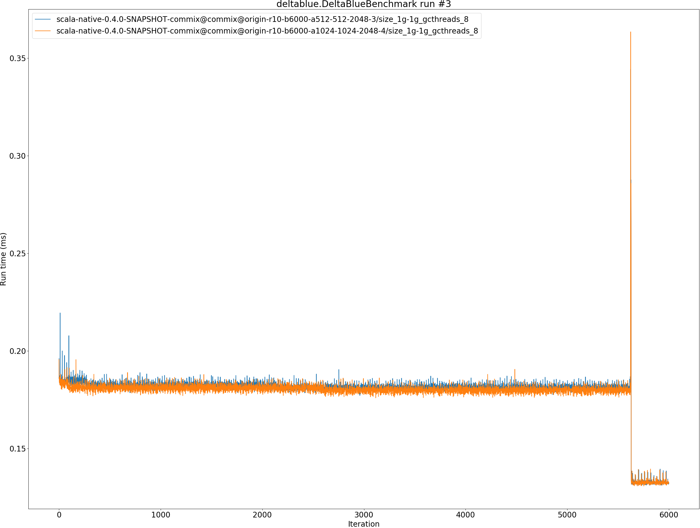
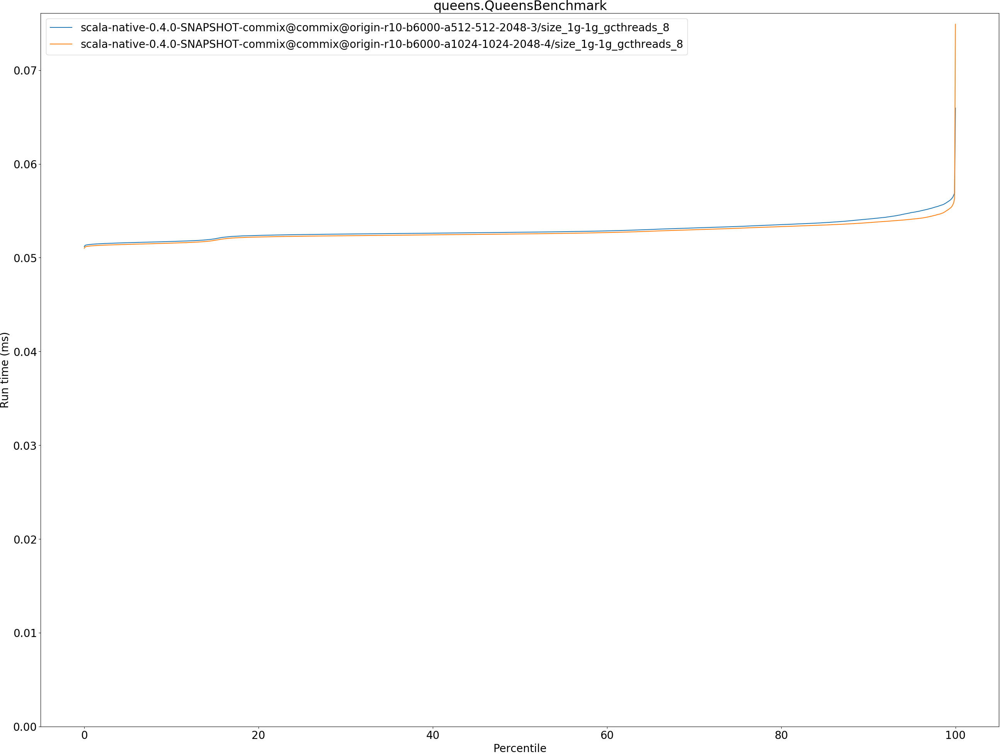

# Summary
## Benchmark run time (ms) at 50 percentile 

|name | scala-native-0.4.0-SNAPSHOT-commix@commix@origin-r10-b6000-a512-512-2048-3/size_1g-1g_gcthreads_8 | scala-native-0.4.0-SNAPSHOT-commix@commix@origin-r10-b6000-a1024-1024-2048-4/size_1g-1g_gcthreads_8 | |
| -- | -- | -- | -- |
|[bounce.BounceBenchmark](#bouncebouncebenchmark)|0.0159|0.0159|__-0.08%__|
|[brainfuck.BrainfuckBenchmark](#brainfuckbrainfuckbenchmark)|1.1403|1.1408|+0.05%|
|[deltablue.DeltaBlueBenchmark](#deltabluedeltabluebenchmark)|0.1807|0.1802|__-0.28%__|
|[gcbench.GCBenchBenchmark](#gcbenchgcbenchbenchmark)|64.9614|65.0181|+0.09%|
|[json.JsonBenchmark](#jsonjsonbenchmark)|0.7428|0.7426|__-0.02%__|
|[kmeans.KmeansBenchmark](#kmeanskmeansbenchmark)|20.6247|20.6164|__-0.04%__|
|[permute.PermuteBenchmark](#permutepermutebenchmark)|0.1234|0.1233|__-0.04%__|
|[queens.QueensBenchmark](#queensqueensbenchmark)|0.0527|0.0525|__-0.34%__|
|[richards.RichardsBenchmark](#richardsrichardsbenchmark)|0.0500|0.0500|__-0.07%__|
|[sudoku.SudokuBenchmark](#sudokusudokubenchmark)|1.3120|1.3089|__-0.23%__|
|[tracer.TracerBenchmark](#tracertracerbenchmark)|0.4400|0.4378|__-0.51%__|
| __Geometrical mean:__|| |__-0.13%__|
## Benchmark run time (ms) at 90 percentile 

|name | scala-native-0.4.0-SNAPSHOT-commix@commix@origin-r10-b6000-a512-512-2048-3/size_1g-1g_gcthreads_8 | scala-native-0.4.0-SNAPSHOT-commix@commix@origin-r10-b6000-a1024-1024-2048-4/size_1g-1g_gcthreads_8 | |
| -- | -- | -- | -- |
|[bounce.BounceBenchmark](#bouncebouncebenchmark)|0.0169|0.0169|__-0.15%__|
|[brainfuck.BrainfuckBenchmark](#brainfuckbrainfuckbenchmark)|1.1444|1.1453|+0.08%|
|[deltablue.DeltaBlueBenchmark](#deltabluedeltabluebenchmark)|0.1825|0.1823|__-0.12%__|
|[gcbench.GCBenchBenchmark](#gcbenchgcbenchbenchmark)|66.1060|66.2076|+0.15%|
|[json.JsonBenchmark](#jsonjsonbenchmark)|0.7521|0.7529|+0.11%|
|[kmeans.KmeansBenchmark](#kmeanskmeansbenchmark)|20.9216|20.9446|+0.11%|
|[permute.PermuteBenchmark](#permutepermutebenchmark)|0.1269|0.1267|__-0.19%__|
|[queens.QueensBenchmark](#queensqueensbenchmark)|0.0541|0.0537|__-0.71%__|
|[richards.RichardsBenchmark](#richardsrichardsbenchmark)|0.0518|0.0517|__-0.08%__|
|[sudoku.SudokuBenchmark](#sudokusudokubenchmark)|1.3252|1.3166|__-0.65%__|
|[tracer.TracerBenchmark](#tracertracerbenchmark)|0.4440|0.4418|__-0.50%__|
| __Geometrical mean:__|| |__-0.18%__|
## Benchmark run time (ms) at 99 percentile 

|name | scala-native-0.4.0-SNAPSHOT-commix@commix@origin-r10-b6000-a512-512-2048-3/size_1g-1g_gcthreads_8 | scala-native-0.4.0-SNAPSHOT-commix@commix@origin-r10-b6000-a1024-1024-2048-4/size_1g-1g_gcthreads_8 | |
| -- | -- | -- | -- |
|[bounce.BounceBenchmark](#bouncebouncebenchmark)|0.0185|0.0179|__-3.28%__|
|[brainfuck.BrainfuckBenchmark](#brainfuckbrainfuckbenchmark)|1.1479|1.1496|+0.15%|
|[deltablue.DeltaBlueBenchmark](#deltabluedeltabluebenchmark)|0.1851|0.1848|__-0.20%__|
|[gcbench.GCBenchBenchmark](#gcbenchgcbenchbenchmark)|73.2836|68.3135|__-6.78%__|
|[json.JsonBenchmark](#jsonjsonbenchmark)|0.7918|0.7953|+0.44%|
|[kmeans.KmeansBenchmark](#kmeanskmeansbenchmark)|21.2186|21.2891|+0.33%|
|[permute.PermuteBenchmark](#permutepermutebenchmark)|0.2383|0.2370|__-0.55%__|
|[queens.QueensBenchmark](#queensqueensbenchmark)|0.0559|0.0550|__-1.53%__|
|[richards.RichardsBenchmark](#richardsrichardsbenchmark)|0.0541|0.0542|+0.09%|
|[sudoku.SudokuBenchmark](#sudokusudokubenchmark)|1.3358|1.3241|__-0.87%__|
|[tracer.TracerBenchmark](#tracertracerbenchmark)|0.4494|0.4471|__-0.51%__|
| __Geometrical mean:__|| |__-1.18%__|
## Benchmark run time (ms) at 99.9 percentile 

|name | scala-native-0.4.0-SNAPSHOT-commix@commix@origin-r10-b6000-a512-512-2048-3/size_1g-1g_gcthreads_8 | scala-native-0.4.0-SNAPSHOT-commix@commix@origin-r10-b6000-a1024-1024-2048-4/size_1g-1g_gcthreads_8 | |
| -- | -- | -- | -- |
|[bounce.BounceBenchmark](#bouncebouncebenchmark)|0.0197|0.0190|__-3.45%__|
|[brainfuck.BrainfuckBenchmark](#brainfuckbrainfuckbenchmark)|2.1756|2.1670|__-0.39%__|
|[deltablue.DeltaBlueBenchmark](#deltabluedeltabluebenchmark)|0.2698|0.2689|__-0.34%__|
|[gcbench.GCBenchBenchmark](#gcbenchgcbenchbenchmark)|74.7543|74.2813|__-0.63%__|
|[json.JsonBenchmark](#jsonjsonbenchmark)|2.2035|2.1865|__-0.77%__|
|[kmeans.KmeansBenchmark](#kmeanskmeansbenchmark)|21.9668|22.0985|+0.60%|
|[permute.PermuteBenchmark](#permutepermutebenchmark)|0.4432|0.4079|__-7.96%__|
|[queens.QueensBenchmark](#queensqueensbenchmark)|0.0569|0.0561|__-1.36%__|
|[richards.RichardsBenchmark](#richardsrichardsbenchmark)|0.0592|0.0582|__-1.75%__|
|[sudoku.SudokuBenchmark](#sudokusudokubenchmark)|1.8180|1.8265|+0.47%|
|[tracer.TracerBenchmark](#tracertracerbenchmark)|1.0367|1.1585|+11.74%|
| __Geometrical mean:__|| |__-0.45%__|
## Benchmark total run time (ms) 

|name | scala-native-0.4.0-SNAPSHOT-commix@commix@origin-r10-b6000-a512-512-2048-3/size_1g-1g_gcthreads_8 | scala-native-0.4.0-SNAPSHOT-commix@commix@origin-r10-b6000-a1024-1024-2048-4/size_1g-1g_gcthreads_8 | |
| -- | -- | -- | -- |
|[bounce.BounceBenchmark](#bouncebouncebenchmark)|516.1875|514.9264|__-0.24%__|
|[brainfuck.BrainfuckBenchmark](#brainfuckbrainfuckbenchmark)|36553.5327|36576.9739|+0.06%|
|[deltablue.DeltaBlueBenchmark](#deltabluedeltabluebenchmark)|5648.2705|5636.3885|__-0.21%__|
|[gcbench.GCBenchBenchmark](#gcbenchgcbenchbenchmark)|2086286.6691|2086817.5145|+0.03%|
|[json.JsonBenchmark](#jsonjsonbenchmark)|24006.4488|24020.1858|+0.06%|
|[kmeans.KmeansBenchmark](#kmeanskmeansbenchmark)|660131.2159|660527.9716|+0.06%|
|[permute.PermuteBenchmark](#permutepermutebenchmark)|4231.8353|4227.5066|__-0.10%__|
|[queens.QueensBenchmark](#queensqueensbenchmark)|1693.3082|1685.7357|__-0.45%__|
|[richards.RichardsBenchmark](#richardsrichardsbenchmark)|1618.1545|1617.5314|__-0.04%__|
|[sudoku.SudokuBenchmark](#sudokusudokubenchmark)|42508.0597|42224.3849|__-0.67%__|
|[tracer.TracerBenchmark](#tracertracerbenchmark)|14158.1954|14096.5465|__-0.44%__|
| __Geometrical mean:__|| |__-0.18%__|
# Individual benchmarks
## bounce.BounceBenchmark

## brainfuck.BrainfuckBenchmark

## deltablue.DeltaBlueBenchmark

## gcbench.GCBenchBenchmark

## json.JsonBenchmark

## kmeans.KmeansBenchmark

## permute.PermuteBenchmark

## queens.QueensBenchmark

## richards.RichardsBenchmark

## sudoku.SudokuBenchmark

## tracer.TracerBenchmark

