# Summary
## Benchmark run time (ms) at 50 percentile 

|name | scala-native-0.4.0-SNAPSHOT-commix@commix@origin-r10-b6000-gc-a2-32/size_1g-1g_gcthreads_8 | scala-native-0.4.0-SNAPSHOT-commix@commix@origin-r10-b6000-gc-a2-64/size_1g-1g_gcthreads_8 |  | scala-native-0.4.0-SNAPSHOT-commix@commix@origin-r10-b6000-gc-a2-128/size_1g-1g_gcthreads_8 |  | scala-native-0.4.0-SNAPSHOT-commix@commix@origin-r10-b6000-gc-a4-32/size_1g-1g_gcthreads_8 |  | scala-native-0.4.0-SNAPSHOT-commix@commix@origin-r10-b6000-gc-a4-64/size_1g-1g_gcthreads_8 |  | scala-native-0.4.0-SNAPSHOT-commix@commix@origin-r10-b6000-gc-a4-128/size_1g-1g_gcthreads_8 |  | scala-native-0.4.0-SNAPSHOT-commix@commix@origin-r10-b6000-gc-a8-32/size_1g-1g_gcthreads_8 |  | scala-native-0.4.0-SNAPSHOT-commix@commix@origin-r10-b6000-gc-a8-64/size_1g-1g_gcthreads_8 |  | scala-native-0.4.0-SNAPSHOT-commix@commix@origin-r10-b6000-gc-a8-128/size_1g-1g_gcthreads_8 |  | scala-native-0.4.0-SNAPSHOT-commix@commix@origin-r10-b6000-gc-a16-32/size_1g-1g_gcthreads_8 |  | scala-native-0.4.0-SNAPSHOT-commix@commix@origin-r10-b6000-gc-a16-64/size_1g-1g_gcthreads_8 |  | scala-native-0.4.0-SNAPSHOT-commix@commix@origin-r10-b6000-gc-a16-128/size_1g-1g_gcthreads_8 | |
| -- | -- | -- | -- | -- | -- | -- | -- | -- | -- | -- | -- | -- | -- | -- | -- | -- | -- | -- | -- | -- | -- | -- | -- |
|[bounce.BounceBenchmark](#bouncebouncebenchmark)|0.0162|0.0162|__-0.08%__|0.0162|__-0.21%__|0.0162|__-0.23%__|0.0162|__-0.21%__|0.0162|__-0.19%__|0.0162|__-0.20%__|0.0162|__-0.26%__|0.0162|__-0.23%__|0.0162|__-0.12%__|0.0162|__-0.30%__|0.0162|__-0.27%__|
|[brainfuck.BrainfuckBenchmark](#brainfuckbrainfuckbenchmark)|1.1084|1.1080|__-0.04%__|1.1101|+0.16%|1.1080|__-0.04%__|1.1099|+0.14%|1.1100|+0.14%|1.1091|+0.06%|1.1094|+0.09%|1.1094|+0.09%|1.1100|+0.14%|1.1087|+0.03%|1.1094|+0.09%|
|[deltablue.DeltaBlueBenchmark](#deltabluedeltabluebenchmark)|0.1771|0.1772|+0.07%|0.1788|+0.96%|0.1773|+0.09%|0.1776|+0.28%|0.1786|+0.82%|0.1777|+0.31%|0.1783|+0.68%|0.1784|+0.71%|0.1781|+0.56%|0.1777|+0.34%|0.1789|+0.99%|
|[gcbench.GCBenchBenchmark](#gcbenchgcbenchbenchmark)|64.9990|64.4550|__-0.84%__|64.7865|__-0.33%__|64.4928|__-0.78%__|64.5408|__-0.70%__|64.5579|__-0.68%__|64.6032|__-0.61%__|64.5782|__-0.65%__|64.7913|__-0.32%__|67.4773|+3.81%|67.3958|+3.69%|67.2958|+3.53%|
|[json.JsonBenchmark](#jsonjsonbenchmark)|0.7455|0.7443|__-0.15%__|0.7430|__-0.34%__|0.7443|__-0.16%__|0.7453|__-0.02%__|0.7456|+0.02%|0.7450|__-0.07%__|0.7445|__-0.13%__|0.7447|__-0.11%__|0.7431|__-0.32%__|0.7432|__-0.31%__|0.7436|__-0.25%__|
|[kmeans.KmeansBenchmark](#kmeanskmeansbenchmark)|20.7113|20.6538|__-0.28%__|20.6556|__-0.27%__|20.6391|__-0.35%__|20.7067|__-0.02%__|20.6102|__-0.49%__|20.6611|__-0.24%__|20.6452|__-0.32%__|20.6087|__-0.50%__|20.6433|__-0.33%__|20.6319|__-0.38%__|20.6252|__-0.42%__|
|[permute.PermuteBenchmark](#permutepermutebenchmark)|0.1314|0.1314|__-0.05%__|0.1314|__-0.02%__|0.1314|__-0.02%__|0.1315|+0.01%|0.1313|__-0.09%__|0.1313|__-0.09%__|0.1318|+0.24%|0.1315|+0.05%|0.1315|+0.06%|0.1314|__-0.01%__|0.1314|__-0.02%__|
|[queens.QueensBenchmark](#queensqueensbenchmark)|0.0530|0.0529|__-0.25%__|0.0531|+0.20%|0.0531|+0.12%|0.0531|+0.25%|0.0530|__-0.00%__|0.0530|__-0.01%__|0.0530|+0.03%|0.0529|__-0.14%__|0.0530|__-0.01%__|0.0530|__-0.11%__|0.0529|__-0.23%__|
|[richards.RichardsBenchmark](#richardsrichardsbenchmark)|0.0503|0.0503|__-0.04%__|0.0503|__-0.00%__|0.0503|__-0.11%__|0.0504|+0.03%|0.0504|+0.10%|0.0503|__-0.14%__|0.0503|__-0.07%__|0.0503|__-0.02%__|0.0503|__-0.03%__|0.0504|+0.02%|0.0503|__-0.05%__|
|[sudoku.SudokuBenchmark](#sudokusudokubenchmark)|1.3233|1.3231|__-0.01%__|1.3245|+0.09%|1.3246|+0.10%|1.3234|+0.01%|1.3229|__-0.03%__|1.3237|+0.03%|1.3231|__-0.02%__|1.3226|__-0.05%__|1.3234|+0.01%|1.3229|__-0.03%__|1.3214|__-0.14%__|
|[tracer.TracerBenchmark](#tracertracerbenchmark)|0.4429|0.4422|__-0.15%__|0.4417|__-0.26%__|0.4425|__-0.09%__|0.4427|__-0.03%__|0.4428|__-0.02%__|0.4426|__-0.06%__|0.4420|__-0.20%__|0.4422|__-0.15%__|0.4423|__-0.12%__|0.4416|__-0.29%__|0.4427|__-0.03%__|
| __Geometrical mean:__|| |__-0.17%__| |__-0.00%__| |__-0.13%__| |__-0.03%__| |__-0.04%__| |__-0.09%__| |__-0.06%__| |__-0.06%__| |+0.33%| |+0.24%| |+0.29%|
## Benchmark run time (ms) at 90 percentile 

|name | scala-native-0.4.0-SNAPSHOT-commix@commix@origin-r10-b6000-gc-a2-32/size_1g-1g_gcthreads_8 | scala-native-0.4.0-SNAPSHOT-commix@commix@origin-r10-b6000-gc-a2-64/size_1g-1g_gcthreads_8 |  | scala-native-0.4.0-SNAPSHOT-commix@commix@origin-r10-b6000-gc-a2-128/size_1g-1g_gcthreads_8 |  | scala-native-0.4.0-SNAPSHOT-commix@commix@origin-r10-b6000-gc-a4-32/size_1g-1g_gcthreads_8 |  | scala-native-0.4.0-SNAPSHOT-commix@commix@origin-r10-b6000-gc-a4-64/size_1g-1g_gcthreads_8 |  | scala-native-0.4.0-SNAPSHOT-commix@commix@origin-r10-b6000-gc-a4-128/size_1g-1g_gcthreads_8 |  | scala-native-0.4.0-SNAPSHOT-commix@commix@origin-r10-b6000-gc-a8-32/size_1g-1g_gcthreads_8 |  | scala-native-0.4.0-SNAPSHOT-commix@commix@origin-r10-b6000-gc-a8-64/size_1g-1g_gcthreads_8 |  | scala-native-0.4.0-SNAPSHOT-commix@commix@origin-r10-b6000-gc-a8-128/size_1g-1g_gcthreads_8 |  | scala-native-0.4.0-SNAPSHOT-commix@commix@origin-r10-b6000-gc-a16-32/size_1g-1g_gcthreads_8 |  | scala-native-0.4.0-SNAPSHOT-commix@commix@origin-r10-b6000-gc-a16-64/size_1g-1g_gcthreads_8 |  | scala-native-0.4.0-SNAPSHOT-commix@commix@origin-r10-b6000-gc-a16-128/size_1g-1g_gcthreads_8 | |
| -- | -- | -- | -- | -- | -- | -- | -- | -- | -- | -- | -- | -- | -- | -- | -- | -- | -- | -- | -- | -- | -- | -- | -- |
|[bounce.BounceBenchmark](#bouncebouncebenchmark)|0.0173|0.0173|__-0.02%__|0.0173|__-0.23%__|0.0172|__-0.29%__|0.0172|__-0.27%__|0.0173|__-0.20%__|0.0173|__-0.20%__|0.0172|__-0.42%__|0.0172|__-0.32%__|0.0173|__-0.22%__|0.0172|__-0.51%__|0.0172|__-0.45%__|
|[brainfuck.BrainfuckBenchmark](#brainfuckbrainfuckbenchmark)|1.1180|1.1122|__-0.51%__|1.1144|__-0.32%__|1.1143|__-0.33%__|1.1157|__-0.20%__|1.1283|+0.93%|1.1132|__-0.42%__|1.1203|+0.21%|1.1177|__-0.03%__|1.1227|+0.42%|1.1143|__-0.32%__|1.1154|__-0.23%__|
|[deltablue.DeltaBlueBenchmark](#deltabluedeltabluebenchmark)|0.1791|0.1792|+0.10%|0.1806|+0.87%|0.1795|+0.27%|0.1796|+0.32%|0.1809|+1.05%|0.1797|+0.34%|0.1801|+0.59%|0.1803|+0.67%|0.1800|+0.55%|0.1797|+0.34%|0.1808|+0.95%|
|[gcbench.GCBenchBenchmark](#gcbenchgcbenchbenchmark)|66.7884|65.6130|__-1.76%__|66.9142|+0.19%|65.6576|__-1.69%__|65.6530|__-1.70%__|65.6978|__-1.63%__|65.9071|__-1.32%__|66.0256|__-1.14%__|66.4555|__-0.50%__|68.5491|+2.64%|68.2569|+2.20%|68.1630|+2.06%|
|[json.JsonBenchmark](#jsonjsonbenchmark)|0.7564|0.7547|__-0.22%__|0.7532|__-0.42%__|0.7543|__-0.27%__|0.7553|__-0.14%__|0.7556|__-0.10%__|0.7557|__-0.09%__|0.7545|__-0.25%__|0.7547|__-0.22%__|0.7531|__-0.44%__|0.7530|__-0.45%__|0.7536|__-0.37%__|
|[kmeans.KmeansBenchmark](#kmeanskmeansbenchmark)|21.0636|20.9736|__-0.43%__|20.9327|__-0.62%__|20.9466|__-0.56%__|21.0420|__-0.10%__|20.9314|__-0.63%__|21.0226|__-0.19%__|20.9774|__-0.41%__|20.9089|__-0.73%__|20.9742|__-0.42%__|20.9319|__-0.63%__|20.9271|__-0.65%__|
|[permute.PermuteBenchmark](#permutepermutebenchmark)|0.1353|0.1354|+0.06%|0.1353|__-0.04%__|0.1352|__-0.09%__|0.1353|__-0.03%__|0.1354|+0.02%|0.1354|+0.02%|0.1369|+1.16%|0.1355|+0.13%|0.1355|+0.12%|0.1354|+0.05%|0.1352|__-0.11%__|
|[queens.QueensBenchmark](#queensqueensbenchmark)|0.0546|0.0545|__-0.27%__|0.0548|+0.31%|0.0547|+0.13%|0.0548|+0.28%|0.0546|__-0.05%__|0.0547|+0.09%|0.0547|+0.19%|0.0545|__-0.22%__|0.0544|__-0.32%__|0.0542|__-0.76%__|0.0541|__-0.94%__|
|[richards.RichardsBenchmark](#richardsrichardsbenchmark)|0.0521|0.0521|__-0.02%__|0.0520|__-0.07%__|0.0522|+0.17%|0.0521|__-0.01%__|0.0522|+0.31%|0.0521|+0.00%|0.0520|__-0.03%__|0.0521|+0.02%|0.0520|__-0.06%__|0.0521|+0.08%|0.0520|__-0.03%__|
|[sudoku.SudokuBenchmark](#sudokusudokubenchmark)|1.3313|1.3305|__-0.06%__|1.3318|+0.04%|1.3318|+0.03%|1.3312|__-0.01%__|1.3330|+0.13%|1.3316|+0.02%|1.3309|__-0.03%__|1.3307|__-0.05%__|1.3314|+0.00%|1.3317|+0.03%|1.3289|__-0.18%__|
|[tracer.TracerBenchmark](#tracertracerbenchmark)|0.4470|0.4463|__-0.16%__|0.4458|__-0.28%__|0.4465|__-0.12%__|0.4468|__-0.04%__|0.4468|__-0.05%__|0.4467|__-0.08%__|0.4460|__-0.22%__|0.4462|__-0.18%__|0.4464|__-0.14%__|0.4456|__-0.31%__|0.4470|__-0.00%__|
| __Geometrical mean:__|| |__-0.30%__| |__-0.05%__| |__-0.25%__| |__-0.17%__| |__-0.02%__| |__-0.17%__| |__-0.03%__| |__-0.13%__| |+0.19%| |__-0.03%__| |+0.00%|
## Benchmark run time (ms) at 99 percentile 

|name | scala-native-0.4.0-SNAPSHOT-commix@commix@origin-r10-b6000-gc-a2-32/size_1g-1g_gcthreads_8 | scala-native-0.4.0-SNAPSHOT-commix@commix@origin-r10-b6000-gc-a2-64/size_1g-1g_gcthreads_8 |  | scala-native-0.4.0-SNAPSHOT-commix@commix@origin-r10-b6000-gc-a2-128/size_1g-1g_gcthreads_8 |  | scala-native-0.4.0-SNAPSHOT-commix@commix@origin-r10-b6000-gc-a4-32/size_1g-1g_gcthreads_8 |  | scala-native-0.4.0-SNAPSHOT-commix@commix@origin-r10-b6000-gc-a4-64/size_1g-1g_gcthreads_8 |  | scala-native-0.4.0-SNAPSHOT-commix@commix@origin-r10-b6000-gc-a4-128/size_1g-1g_gcthreads_8 |  | scala-native-0.4.0-SNAPSHOT-commix@commix@origin-r10-b6000-gc-a8-32/size_1g-1g_gcthreads_8 |  | scala-native-0.4.0-SNAPSHOT-commix@commix@origin-r10-b6000-gc-a8-64/size_1g-1g_gcthreads_8 |  | scala-native-0.4.0-SNAPSHOT-commix@commix@origin-r10-b6000-gc-a8-128/size_1g-1g_gcthreads_8 |  | scala-native-0.4.0-SNAPSHOT-commix@commix@origin-r10-b6000-gc-a16-32/size_1g-1g_gcthreads_8 |  | scala-native-0.4.0-SNAPSHOT-commix@commix@origin-r10-b6000-gc-a16-64/size_1g-1g_gcthreads_8 |  | scala-native-0.4.0-SNAPSHOT-commix@commix@origin-r10-b6000-gc-a16-128/size_1g-1g_gcthreads_8 | |
| -- | -- | -- | -- | -- | -- | -- | -- | -- | -- | -- | -- | -- | -- | -- | -- | -- | -- | -- | -- | -- | -- | -- | -- |
|[bounce.BounceBenchmark](#bouncebouncebenchmark)|0.0196|0.0190|__-2.92%__|0.0188|__-3.62%__|0.0188|__-3.72%__|0.0188|__-3.72%__|0.0189|__-3.47%__|0.0188|__-3.76%__|0.0188|__-4.09%__|0.0191|__-2.35%__|0.0192|__-1.75%__|0.0185|__-5.22%__|0.0185|__-5.29%__|
|[brainfuck.BrainfuckBenchmark](#brainfuckbrainfuckbenchmark)|1.1239|1.1168|__-0.64%__|1.1209|__-0.27%__|1.1338|+0.88%|1.1401|+1.43%|1.1468|+2.03%|1.1175|__-0.58%__|1.1256|+0.15%|1.1355|+1.03%|1.1639|+3.55%|1.1316|+0.68%|1.1292|+0.47%|
|[deltablue.DeltaBlueBenchmark](#deltabluedeltabluebenchmark)|0.1817|0.1818|+0.04%|0.1834|+0.91%|0.1820|+0.17%|0.1821|+0.21%|0.1836|+1.01%|0.1823|+0.29%|0.1825|+0.44%|0.1830|+0.67%|0.1827|+0.51%|0.1822|+0.25%|0.1834|+0.93%|
|[gcbench.GCBenchBenchmark](#gcbenchgcbenchbenchmark)|74.1316|66.9441|__-9.70%__|73.9157|__-0.29%__|66.8380|__-9.84%__|66.8154|__-9.87%__|73.4606|__-0.91%__|67.4321|__-9.04%__|67.4085|__-9.07%__|67.8176|__-8.52%__|76.7983|+3.60%|73.2851|__-1.14%__|76.4306|+3.10%|
|[json.JsonBenchmark](#jsonjsonbenchmark)|0.7962|0.7932|__-0.38%__|0.7902|__-0.75%__|0.7953|__-0.11%__|0.7949|__-0.16%__|0.7920|__-0.53%__|0.7959|__-0.04%__|0.7916|__-0.58%__|0.7872|__-1.13%__|0.7935|__-0.33%__|0.8005|+0.53%|0.8156|+2.44%|
|[kmeans.KmeansBenchmark](#kmeanskmeansbenchmark)|29.3069|21.2829|__-27.38%__|21.2401|__-27.53%__|23.8146|__-18.74%__|21.3700|__-27.08%__|21.2383|__-27.53%__|29.1344|__-0.59%__|21.4833|__-26.70%__|21.1969|__-27.67%__|28.5132|__-2.71%__|21.2049|__-27.65%__|21.1742|__-27.75%__|
|[permute.PermuteBenchmark](#permutepermutebenchmark)|0.2480|0.2484|+0.20%|0.2476|__-0.14%__|0.2479|__-0.04%__|0.2481|+0.07%|0.2487|+0.29%|0.2484|+0.20%|0.2501|+0.88%|0.2483|+0.15%|0.2484|+0.17%|0.2493|+0.56%|0.2479|__-0.03%__|
|[queens.QueensBenchmark](#queensqueensbenchmark)|0.0565|0.0563|__-0.33%__|0.0566|+0.30%|0.0565|+0.09%|0.0566|+0.24%|0.0564|__-0.06%__|0.0565|+0.10%|0.0566|+0.30%|0.0564|__-0.16%__|0.0562|__-0.37%__|0.0556|__-1.46%__|0.0555|__-1.71%__|
|[richards.RichardsBenchmark](#richardsrichardsbenchmark)|0.0544|0.0542|__-0.26%__|0.0540|__-0.75%__|0.0544|+0.11%|0.0540|__-0.73%__|0.0544|__-0.04%__|0.0542|__-0.27%__|0.0544|+0.06%|0.0543|__-0.18%__|0.0542|__-0.35%__|0.0548|+0.78%|0.0541|__-0.57%__|
|[sudoku.SudokuBenchmark](#sudokusudokubenchmark)|1.3401|1.3387|__-0.11%__|1.3411|+0.07%|1.3386|__-0.11%__|1.3418|+0.12%|1.3606|+1.53%|1.3546|+1.08%|1.3416|+0.11%|1.3461|+0.44%|1.3387|__-0.10%__|1.3413|+0.08%|1.3377|__-0.18%__|
|[tracer.TracerBenchmark](#tracertracerbenchmark)|0.4525|0.4517|__-0.16%__|0.4511|__-0.30%__|0.4518|__-0.15%__|0.4521|__-0.08%__|0.4519|__-0.12%__|0.4521|__-0.08%__|0.4515|__-0.20%__|0.4515|__-0.21%__|0.4515|__-0.21%__|0.4509|__-0.34%__|0.4526|+0.02%|
| __Geometrical mean:__|| |__-4.17%__| |__-3.32%__| |__-3.05%__| |__-3.98%__| |__-2.92%__| |__-1.19%__| |__-3.88%__| |__-3.84%__| |+0.17%| |__-3.38%__| |__-3.00%__|
## Benchmark run time (ms) at 99.9 percentile 

|name | scala-native-0.4.0-SNAPSHOT-commix@commix@origin-r10-b6000-gc-a2-32/size_1g-1g_gcthreads_8 | scala-native-0.4.0-SNAPSHOT-commix@commix@origin-r10-b6000-gc-a2-64/size_1g-1g_gcthreads_8 |  | scala-native-0.4.0-SNAPSHOT-commix@commix@origin-r10-b6000-gc-a2-128/size_1g-1g_gcthreads_8 |  | scala-native-0.4.0-SNAPSHOT-commix@commix@origin-r10-b6000-gc-a4-32/size_1g-1g_gcthreads_8 |  | scala-native-0.4.0-SNAPSHOT-commix@commix@origin-r10-b6000-gc-a4-64/size_1g-1g_gcthreads_8 |  | scala-native-0.4.0-SNAPSHOT-commix@commix@origin-r10-b6000-gc-a4-128/size_1g-1g_gcthreads_8 |  | scala-native-0.4.0-SNAPSHOT-commix@commix@origin-r10-b6000-gc-a8-32/size_1g-1g_gcthreads_8 |  | scala-native-0.4.0-SNAPSHOT-commix@commix@origin-r10-b6000-gc-a8-64/size_1g-1g_gcthreads_8 |  | scala-native-0.4.0-SNAPSHOT-commix@commix@origin-r10-b6000-gc-a8-128/size_1g-1g_gcthreads_8 |  | scala-native-0.4.0-SNAPSHOT-commix@commix@origin-r10-b6000-gc-a16-32/size_1g-1g_gcthreads_8 |  | scala-native-0.4.0-SNAPSHOT-commix@commix@origin-r10-b6000-gc-a16-64/size_1g-1g_gcthreads_8 |  | scala-native-0.4.0-SNAPSHOT-commix@commix@origin-r10-b6000-gc-a16-128/size_1g-1g_gcthreads_8 | |
| -- | -- | -- | -- | -- | -- | -- | -- | -- | -- | -- | -- | -- | -- | -- | -- | -- | -- | -- | -- | -- | -- | -- | -- |
|[bounce.BounceBenchmark](#bouncebouncebenchmark)|0.0228|0.0230|+0.92%|0.0230|+0.92%|0.0229|+0.41%|0.0229|+0.50%|0.0231|+1.29%|0.0227|__-0.40%__|0.0197|__-13.67%__|0.0229|+0.76%|0.0228|+0.10%|0.0204|__-10.28%__|0.0223|__-1.89%__|
|[brainfuck.BrainfuckBenchmark](#brainfuckbrainfuckbenchmark)|1.7274|1.7317|+0.25%|1.7352|+0.46%|2.0256|+17.27%|2.0033|+15.97%|2.0384|+18.01%|2.1731|+25.80%|2.1570|+24.87%|2.1414|+23.97%|2.1509|+24.52%|2.1509|+24.52%|2.1405|+23.92%|
|[deltablue.DeltaBlueBenchmark](#deltabluedeltabluebenchmark)|0.2730|0.2705|__-0.92%__|0.2683|__-1.74%__|0.2768|+1.37%|0.2750|+0.72%|0.2752|+0.80%|0.2718|__-0.46%__|0.2736|+0.19%|0.2706|__-0.89%__|0.2502|__-8.38%__|0.2483|__-9.06%__|0.2479|__-9.20%__|
|[gcbench.GCBenchBenchmark](#gcbenchgcbenchbenchmark)|75.2640|67.4123|__-10.43%__|75.2653|+0.00%|71.9236|__-4.44%__|67.4479|__-10.38%__|74.5085|__-1.00%__|74.1305|__-1.51%__|74.3348|__-1.23%__|73.1490|__-2.81%__|77.3296|+2.74%|76.9309|+2.21%|77.1178|+2.46%|
|[json.JsonBenchmark](#jsonjsonbenchmark)|2.1500|2.0576|__-4.30%__|1.9587|__-8.90%__|2.1413|__-0.40%__|2.0455|__-4.86%__|1.9722|__-8.27%__|2.1230|__-1.26%__|2.0767|__-3.41%__|1.9886|__-7.50%__|2.1683|+0.85%|2.0672|__-3.85%__|1.9756|__-8.11%__|
|[kmeans.KmeansBenchmark](#kmeanskmeansbenchmark)|29.6022|21.5046|__-27.36%__|21.5957|__-27.05%__|29.2763|__-1.10%__|21.7813|__-26.42%__|21.6121|__-26.99%__|29.4624|__-0.47%__|29.1728|__-1.45%__|21.5791|__-27.10%__|29.3462|__-0.86%__|21.3917|__-27.74%__|21.3508|__-27.87%__|
|[permute.PermuteBenchmark](#permutepermutebenchmark)|0.2502|0.2507|+0.18%|0.2503|+0.03%|0.2507|+0.19%|0.2519|+0.68%|0.2515|+0.49%|0.2513|+0.45%|0.2540|+1.53%|0.2509|+0.29%|0.2509|+0.25%|0.2521|+0.73%|0.2508|+0.23%|
|[queens.QueensBenchmark](#queensqueensbenchmark)|0.0575|0.0573|__-0.35%__|0.0576|+0.24%|0.0575|__-0.04%__|0.0577|+0.42%|0.0576|+0.21%|0.0576|+0.17%|0.0577|+0.36%|0.0574|__-0.15%__|0.0574|__-0.13%__|0.0568|__-1.29%__|0.0567|__-1.40%__|
|[richards.RichardsBenchmark](#richardsrichardsbenchmark)|0.0582|0.0583|+0.05%|0.0583|+0.07%|0.0584|+0.30%|0.0582|__-0.12%__|0.0562|__-3.51%__|0.0583|+0.08%|0.0586|+0.59%|0.0558|__-4.14%__|0.0583|+0.11%|0.0591|+1.58%|0.0582|__-0.05%__|
|[sudoku.SudokuBenchmark](#sudokusudokubenchmark)|1.8551|1.8616|+0.35%|1.8658|+0.57%|1.8444|__-0.58%__|1.8418|__-0.72%__|1.8451|__-0.54%__|1.7920|__-3.40%__|1.7950|__-3.24%__|1.7653|__-4.84%__|1.8954|+2.17%|1.8962|+2.22%|1.8877|+1.75%|
|[tracer.TracerBenchmark](#tracertracerbenchmark)|1.1779|1.1548|__-1.96%__|1.1336|__-3.76%__|1.0678|__-9.34%__|1.0346|__-12.17%__|1.0374|__-11.92%__|1.3751|+16.75%|1.3645|+15.85%|1.3359|+13.42%|1.1703|__-0.64%__|1.1441|__-2.87%__|1.1207|__-4.86%__|
| __Geometrical mean:__|| |__-4.35%__| |__-3.93%__| |+0.16%| |__-3.86%__| |__-3.45%__| |+2.91%| |+1.41%| |__-1.57%__| |+1.62%| |__-2.90%__| |__-2.98%__|
## Benchmark total run time (ms) 

|name | scala-native-0.4.0-SNAPSHOT-commix@commix@origin-r10-b6000-gc-a2-32/size_1g-1g_gcthreads_8 | scala-native-0.4.0-SNAPSHOT-commix@commix@origin-r10-b6000-gc-a2-64/size_1g-1g_gcthreads_8 |  | scala-native-0.4.0-SNAPSHOT-commix@commix@origin-r10-b6000-gc-a2-128/size_1g-1g_gcthreads_8 |  | scala-native-0.4.0-SNAPSHOT-commix@commix@origin-r10-b6000-gc-a4-32/size_1g-1g_gcthreads_8 |  | scala-native-0.4.0-SNAPSHOT-commix@commix@origin-r10-b6000-gc-a4-64/size_1g-1g_gcthreads_8 |  | scala-native-0.4.0-SNAPSHOT-commix@commix@origin-r10-b6000-gc-a4-128/size_1g-1g_gcthreads_8 |  | scala-native-0.4.0-SNAPSHOT-commix@commix@origin-r10-b6000-gc-a8-32/size_1g-1g_gcthreads_8 |  | scala-native-0.4.0-SNAPSHOT-commix@commix@origin-r10-b6000-gc-a8-64/size_1g-1g_gcthreads_8 |  | scala-native-0.4.0-SNAPSHOT-commix@commix@origin-r10-b6000-gc-a8-128/size_1g-1g_gcthreads_8 |  | scala-native-0.4.0-SNAPSHOT-commix@commix@origin-r10-b6000-gc-a16-32/size_1g-1g_gcthreads_8 |  | scala-native-0.4.0-SNAPSHOT-commix@commix@origin-r10-b6000-gc-a16-64/size_1g-1g_gcthreads_8 |  | scala-native-0.4.0-SNAPSHOT-commix@commix@origin-r10-b6000-gc-a16-128/size_1g-1g_gcthreads_8 | |
| -- | -- | -- | -- | -- | -- | -- | -- | -- | -- | -- | -- | -- | -- | -- | -- | -- | -- | -- | -- | -- | -- | -- | -- |
|[bounce.BounceBenchmark](#bouncebouncebenchmark)|527.0530|527.3667|+0.06%|525.8979|__-0.22%__|525.6675|__-0.26%__|526.0457|__-0.19%__|526.2853|__-0.15%__|525.9222|__-0.21%__|525.2830|__-0.34%__|526.0771|__-0.19%__|526.4835|__-0.11%__|525.0634|__-0.38%__|525.1120|__-0.37%__|
|[brainfuck.BrainfuckBenchmark](#brainfuckbrainfuckbenchmark)|35658.3199|35522.1736|__-0.38%__|35583.6995|__-0.21%__|35556.8752|__-0.28%__|35600.2521|__-0.16%__|35931.3938|+0.77%|35560.0653|__-0.28%__|35618.4954|__-0.11%__|35602.7694|__-0.16%__|35791.1163|+0.37%|35887.9381|+0.64%|35583.2617|__-0.21%__|
|[deltablue.DeltaBlueBenchmark](#deltabluedeltabluebenchmark)|5539.5344|5543.2036|+0.07%|5589.3833|+0.90%|5545.6571|+0.11%|5553.2391|+0.25%|5585.0522|+0.82%|5556.7274|+0.31%|5574.7431|+0.64%|5575.6140|+0.65%|5566.9455|+0.49%|5556.9066|+0.31%|5590.8977|+0.93%|
|[gcbench.GCBenchBenchmark](#gcbenchgcbenchbenchmark)|2102794.2654|2066952.4010|__-1.70%__|2097604.5777|__-0.25%__|2068357.6904|__-1.64%__|2069257.4740|__-1.59%__|2075642.2132|__-1.29%__|2078061.9197|__-1.18%__|2074725.9408|__-1.33%__|2082465.1342|__-0.97%__|2140283.4571|+1.78%|2130193.4926|+1.30%|2127869.8311|+1.19%|
|[json.JsonBenchmark](#jsonjsonbenchmark)|24090.4912|24019.9925|__-0.29%__|23971.7067|__-0.49%__|24037.6374|__-0.22%__|24062.7089|__-0.12%__|24068.7091|__-0.09%__|24074.6343|__-0.07%__|24047.5855|__-0.18%__|24042.8207|__-0.20%__|24030.2158|__-0.25%__|24022.2803|__-0.28%__|24024.8295|__-0.27%__|
|[kmeans.KmeansBenchmark](#kmeanskmeansbenchmark)|675073.9312|660943.0200|__-2.09%__|663189.3937|__-1.76%__|663740.2583|__-1.68%__|665072.4671|__-1.48%__|659567.0129|__-2.30%__|668405.1034|__-0.99%__|665313.3451|__-1.45%__|659641.8597|__-2.29%__|668149.1816|__-1.03%__|661584.9708|__-2.00%__|659972.4216|__-2.24%__|
|[permute.PermuteBenchmark](#permutepermutebenchmark)|4479.2839|4478.9685|__-0.01%__|4477.8037|__-0.03%__|4477.8979|__-0.03%__|4479.5170|+0.01%|4478.5350|__-0.02%__|4477.4650|__-0.04%__|4499.9597|+0.46%|4481.6541|+0.05%|4482.6423|+0.07%|4482.4715|+0.07%|4478.3832|__-0.02%__|
|[queens.QueensBenchmark](#queensqueensbenchmark)|1701.7898|1696.5039|__-0.31%__|1707.5926|+0.34%|1703.5238|+0.10%|1705.6136|+0.22%|1700.6003|__-0.07%__|1703.0981|+0.08%|1705.4738|+0.22%|1699.3451|__-0.14%__|1701.8254|+0.00%|1699.1702|__-0.15%__|1694.9808|__-0.40%__|
|[richards.RichardsBenchmark](#richardsrichardsbenchmark)|1627.9067|1627.8219|__-0.01%__|1627.6453|__-0.02%__|1627.4645|__-0.03%__|1627.5919|__-0.02%__|1630.3088|+0.15%|1626.4662|__-0.09%__|1627.6280|__-0.02%__|1627.5452|__-0.02%__|1627.4702|__-0.03%__|1628.8925|+0.06%|1627.1726|__-0.05%__|
|[sudoku.SudokuBenchmark](#sudokusudokubenchmark)|42413.0946|42395.9645|__-0.04%__|42444.3103|+0.07%|42441.1136|+0.07%|42440.3404|+0.06%|42563.9263|+0.36%|42420.4031|+0.02%|42391.9593|__-0.05%__|42387.1682|__-0.06%__|42756.6820|+0.81%|42935.3240|+1.23%|42333.0804|__-0.19%__|
|[tracer.TracerBenchmark](#tracertracerbenchmark)|14251.1800|14224.7019|__-0.19%__|14208.6968|__-0.30%__|14234.4734|__-0.12%__|14243.8725|__-0.05%__|14242.9812|__-0.06%__|14239.5483|__-0.08%__|14232.9075|__-0.13%__|14223.9376|__-0.19%__|14234.6140|__-0.12%__|14208.0048|__-0.30%__|14241.0218|__-0.07%__|
| __Geometrical mean:__|| |__-0.45%__| |__-0.18%__| |__-0.36%__| |__-0.28%__| |__-0.17%__| |__-0.23%__| |__-0.21%__| |__-0.32%__| |+0.18%| |+0.04%| |__-0.16%__|
## Total GC time on Application thread (ms) 

|name |  | scala-native-0.4.0-SNAPSHOT-commix@commix@origin-r10-b6000-gc-a2-32/size_1g-1g_gcthreads_8 | scala-native-0.4.0-SNAPSHOT-commix@commix@origin-r10-b6000-gc-a2-64/size_1g-1g_gcthreads_8 |  | scala-native-0.4.0-SNAPSHOT-commix@commix@origin-r10-b6000-gc-a2-128/size_1g-1g_gcthreads_8 |  | scala-native-0.4.0-SNAPSHOT-commix@commix@origin-r10-b6000-gc-a4-32/size_1g-1g_gcthreads_8 |  | scala-native-0.4.0-SNAPSHOT-commix@commix@origin-r10-b6000-gc-a4-64/size_1g-1g_gcthreads_8 |  | scala-native-0.4.0-SNAPSHOT-commix@commix@origin-r10-b6000-gc-a4-128/size_1g-1g_gcthreads_8 |  | scala-native-0.4.0-SNAPSHOT-commix@commix@origin-r10-b6000-gc-a8-32/size_1g-1g_gcthreads_8 |  | scala-native-0.4.0-SNAPSHOT-commix@commix@origin-r10-b6000-gc-a8-64/size_1g-1g_gcthreads_8 |  | scala-native-0.4.0-SNAPSHOT-commix@commix@origin-r10-b6000-gc-a8-128/size_1g-1g_gcthreads_8 |  | scala-native-0.4.0-SNAPSHOT-commix@commix@origin-r10-b6000-gc-a16-32/size_1g-1g_gcthreads_8 |  | scala-native-0.4.0-SNAPSHOT-commix@commix@origin-r10-b6000-gc-a16-64/size_1g-1g_gcthreads_8 |  | scala-native-0.4.0-SNAPSHOT-commix@commix@origin-r10-b6000-gc-a16-128/size_1g-1g_gcthreads_8 | |
| -- | -- | -- | -- | -- | -- | -- | -- | -- | -- | -- | -- | -- | -- | -- | -- | -- | -- | -- | -- | -- | -- | -- | -- | -- |
|[bounce.BounceBenchmark](#bouncebouncebenchmark)|mark|0.0000|0.0000|N/A|0.0000|N/A|0.0000|N/A|0.0000|N/A|0.0000|N/A|0.0000|N/A|0.0000|N/A|0.0000|N/A|0.0000|N/A|0.0000|N/A|0.0000|N/A|
||sweep|0.0000|0.0000|N/A|0.0000|N/A|0.0000|N/A|0.0000|N/A|0.0000|N/A|0.0000|N/A|0.0000|N/A|0.0000|N/A|0.0000|N/A|0.0000|N/A|0.0000|N/A|
||total|0.0000|0.0000|N/A|0.0000|N/A|0.0000|N/A|0.0000|N/A|0.0000|N/A|0.0000|N/A|0.0000|N/A|0.0000|N/A|0.0000|N/A|0.0000|N/A|0.0000|N/A|
|[brainfuck.BrainfuckBenchmark](#brainfuckbrainfuckbenchmark)|mark|5.1136|5.1844|+1.38%|5.2339|+2.35%|4.9848|__-2.52%__|4.9793|__-2.63%__|4.9422|__-3.35%__|5.0445|__-1.35%__|4.9567|__-3.07%__|4.9543|__-3.12%__|2.3484|__-54.08%__|2.5639|__-49.86%__|2.3231|__-54.57%__|
||sweep|0.0000|0.0000|N/A|0.0000|N/A|0.0000|N/A|0.0000|N/A|0.0000|N/A|0.0000|N/A|0.0000|N/A|0.0000|N/A|0.0000|N/A|0.0000|N/A|0.0000|N/A|
||total|5.1136|5.1844|+1.38%|5.2339|+2.35%|4.9848|__-2.52%__|4.9793|__-2.63%__|4.9422|__-3.35%__|5.0445|__-1.35%__|4.9567|__-3.07%__|4.9543|__-3.12%__|2.3484|__-54.08%__|2.5639|__-49.86%__|2.3231|__-54.57%__|
|[deltablue.DeltaBlueBenchmark](#deltabluedeltabluebenchmark)|mark|0.6639|0.6577|__-0.94%__|0.6585|__-0.81%__|0.5930|__-10.67%__|0.6095|__-8.19%__|0.5707|__-14.03%__|0.6468|__-2.58%__|0.7063|+6.39%|0.6796|+2.36%|0.5202|__-21.65%__|0.5186|__-21.88%__|0.5329|__-19.74%__|
||sweep|0.0000|0.0000|N/A|0.0000|N/A|0.0000|N/A|0.0000|N/A|0.0000|N/A|0.0000|N/A|0.0000|N/A|0.0000|N/A|0.0000|N/A|0.0000|N/A|0.0000|N/A|
||total|0.6639|0.6577|__-0.94%__|0.6585|__-0.81%__|0.5930|__-10.67%__|0.6095|__-8.19%__|0.5707|__-14.03%__|0.6468|__-2.58%__|0.7063|+6.39%|0.6796|+2.36%|0.5202|__-21.65%__|0.5186|__-21.88%__|0.5329|__-19.74%__|
|[gcbench.GCBenchBenchmark](#gcbenchgcbenchbenchmark)|mark|6077.4321|6042.3827|__-0.58%__|6061.8418|__-0.26%__|5311.1785|__-12.61%__|5344.0016|__-12.07%__|5368.0494|__-11.67%__|7299.1959|+20.10%|7350.4485|+20.95%|7334.5512|+20.69%|89120.9890|+1366.43%|88869.7369|+1362.29%|88828.3719|+1361.61%|
||sweep|16.2330|42.8848|+164.18%|288.0552|+1674.51%|2.5454|__-84.32%__|7.0528|__-56.55%__|180.8010|+1013.79%|0.4776|__-97.06%__|3.6804|__-77.33%__|80.2810|+394.55%|0.0000|__-100.00%__|0.0000|__-100.00%__|0.0000|__-100.00%__|
||total|6093.6651|6085.2675|__-0.14%__|6349.8970|+4.20%|5313.7239|__-12.80%__|5351.0544|__-12.19%__|5548.8505|__-8.94%__|7299.6735|+19.79%|7354.1290|+20.68%|7414.8322|+21.68%|89120.9890|+1362.52%|88869.7369|+1358.40%|88828.3719|+1357.72%|
|[json.JsonBenchmark](#jsonjsonbenchmark)|mark|41.8666|42.1486|+0.67%|41.7138|__-0.37%__|46.7255|+11.61%|46.3375|+10.68%|46.6888|+11.52%|47.5112|+13.48%|48.2871|+15.34%|47.6910|+13.91%|55.8881|+33.49%|55.7258|+33.10%|55.7884|+33.25%|
||sweep|0.0000|0.0025|N/A|0.0000|N/A|0.0000|N/A|0.0000|N/A|0.0000|N/A|0.0000|N/A|0.0000|N/A|0.0000|N/A|0.0000|N/A|0.0000|N/A|0.0000|N/A|
||total|41.8666|42.1510|+0.68%|41.7138|__-0.37%__|46.7255|+11.61%|46.3375|+10.68%|46.6888|+11.52%|47.5112|+13.48%|48.2871|+15.34%|47.6910|+13.91%|55.8881|+33.49%|55.7258|+33.10%|55.7884|+33.25%|
|[kmeans.KmeansBenchmark](#kmeanskmeansbenchmark)|mark|304.8731|303.0356|__-0.60%__|302.4837|__-0.78%__|296.1960|__-2.85%__|300.3426|__-1.49%__|285.9125|__-6.22%__|294.5709|__-3.38%__|289.6779|__-4.98%__|287.6880|__-5.64%__|277.5097|__-8.98%__|271.9484|__-10.80%__|273.1110|__-10.42%__|
||sweep|0.0000|0.0398|N/A|0.1714|N/A|0.0000|N/A|0.0000|N/A|0.0000|N/A|0.0000|N/A|0.0000|N/A|0.0000|N/A|0.0000|N/A|0.0000|N/A|0.0000|N/A|
||total|304.8731|303.0754|__-0.59%__|302.6551|__-0.73%__|296.1960|__-2.85%__|300.3426|__-1.49%__|285.9125|__-6.22%__|294.5709|__-3.38%__|289.6779|__-4.98%__|287.6880|__-5.64%__|277.5097|__-8.98%__|271.9484|__-10.80%__|273.1110|__-10.42%__|
|[permute.PermuteBenchmark](#permutepermutebenchmark)|mark|0.5186|0.5347|+3.11%|0.5379|+3.74%|0.5282|+1.85%|0.5360|+3.36%|0.5592|+7.83%|0.5273|+1.69%|0.5609|+8.17%|0.5296|+2.13%|0.5341|+3.00%|0.5338|+2.94%|0.5272|+1.66%|
||sweep|0.0094|0.0198|+109.81%|0.2537|+2591.58%|0.0000|__-100.00%__|0.0503|+433.97%|0.0000|__-100.00%__|0.0000|__-100.00%__|0.0000|__-100.00%__|0.0000|__-100.00%__|0.0000|__-100.00%__|0.0000|__-100.00%__|0.0000|__-100.00%__|
||total|0.5280|0.5544|+5.01%|0.7917|+49.94%|0.5282|+0.04%|0.5863|+11.04%|0.5592|+5.91%|0.5273|__-0.13%__|0.5609|+6.24%|0.5296|+0.31%|0.5341|+1.16%|0.5338|+1.11%|0.5272|__-0.16%__|
|[queens.QueensBenchmark](#queensqueensbenchmark)|mark|0.0000|0.0000|N/A|0.0000|N/A|0.0000|N/A|0.0000|N/A|0.0000|N/A|0.0000|N/A|0.0000|N/A|0.0000|N/A|0.0000|N/A|0.0000|N/A|0.0000|N/A|
||sweep|0.0000|0.0000|N/A|0.0000|N/A|0.0000|N/A|0.0000|N/A|0.0000|N/A|0.0000|N/A|0.0000|N/A|0.0000|N/A|0.0000|N/A|0.0000|N/A|0.0000|N/A|
||total|0.0000|0.0000|N/A|0.0000|N/A|0.0000|N/A|0.0000|N/A|0.0000|N/A|0.0000|N/A|0.0000|N/A|0.0000|N/A|0.0000|N/A|0.0000|N/A|0.0000|N/A|
|[richards.RichardsBenchmark](#richardsrichardsbenchmark)|mark|0.0000|0.0000|N/A|0.0000|N/A|0.0000|N/A|0.0000|N/A|0.0000|N/A|0.0000|N/A|0.0000|N/A|0.0000|N/A|0.0000|N/A|0.0000|N/A|0.0000|N/A|
||sweep|0.0000|0.0000|N/A|0.0000|N/A|0.0000|N/A|0.0000|N/A|0.0000|N/A|0.0000|N/A|0.0000|N/A|0.0000|N/A|0.0000|N/A|0.0000|N/A|0.0000|N/A|
||total|0.0000|0.0000|N/A|0.0000|N/A|0.0000|N/A|0.0000|N/A|0.0000|N/A|0.0000|N/A|0.0000|N/A|0.0000|N/A|0.0000|N/A|0.0000|N/A|0.0000|N/A|
|[sudoku.SudokuBenchmark](#sudokusudokubenchmark)|mark|12.0480|12.0499|+0.02%|12.1082|+0.50%|11.9971|__-0.42%__|12.0575|+0.08%|11.9920|__-0.46%__|12.0105|__-0.31%__|11.8121|__-1.96%__|11.9611|__-0.72%__|12.0019|__-0.38%__|11.9337|__-0.95%__|11.8564|__-1.59%__|
||sweep|0.0000|0.0027|N/A|0.0000|N/A|0.0000|N/A|0.0000|N/A|0.0000|N/A|0.0000|N/A|0.0000|N/A|0.0000|N/A|0.0000|N/A|0.0000|N/A|0.0000|N/A|
||total|12.0480|12.0526|+0.04%|12.1082|+0.50%|11.9971|__-0.42%__|12.0575|+0.08%|11.9920|__-0.46%__|12.0105|__-0.31%__|11.8121|__-1.96%__|11.9611|__-0.72%__|12.0019|__-0.38%__|11.9337|__-0.95%__|11.8564|__-1.59%__|
|[tracer.TracerBenchmark](#tracertracerbenchmark)|mark|2.6781|2.6238|__-2.03%__|2.6246|__-2.00%__|2.6458|__-1.21%__|2.6325|__-1.70%__|2.6517|__-0.98%__|2.7309|+1.97%|2.6545|__-0.88%__|2.6559|__-0.83%__|2.6602|__-0.67%__|2.6781|+0.00%|2.7355|+2.14%|
||sweep|0.0054|0.0216|+300.26%|1.3464|+24814.54%|0.0000|__-100.00%__|0.1108|+1950.22%|0.0024|__-55.79%__|0.0000|__-100.00%__|0.0000|__-100.00%__|0.0000|__-100.00%__|0.0000|__-100.00%__|0.0000|__-100.00%__|0.0000|__-100.00%__|
||total|2.6835|2.6455|__-1.42%__|3.9710|+47.98%|2.6458|__-1.41%__|2.7433|+2.23%|2.6541|__-1.09%__|2.7309|+1.77%|2.6545|__-1.08%__|2.6559|__-1.03%__|2.6602|__-0.87%__|2.6781|__-0.20%__|2.7355|+1.94%|
|__Geometrical mean:__|mark|| |+0.12%| |+0.28%| |__-2.35%__| |__-1.70%__| |__-2.52%__| |+3.42%| |+4.63%| |+3.27%| |+26.45%| |+27.39%| |+26.36%|
||sweep|| |+180.99%| |+4818.65%| |__-84.32%__| |+262.32%| |+121.90%| |__-97.06%__| |__-77.33%__| |+394.55%| | | | | | |
||total|| |+0.49%| |+11.17%| |__-2.62%__| |__-0.35%__| |__-2.38%__| |+3.12%| |+4.34%| |+3.12%| |+26.09%| |+27.03%| |+26.01%|
## GC pause time (ms) at 50 percentile 

|name | scala-native-0.4.0-SNAPSHOT-commix@commix@origin-r10-b6000-gc-a2-32/size_1g-1g_gcthreads_8 | scala-native-0.4.0-SNAPSHOT-commix@commix@origin-r10-b6000-gc-a2-64/size_1g-1g_gcthreads_8 |  | scala-native-0.4.0-SNAPSHOT-commix@commix@origin-r10-b6000-gc-a2-128/size_1g-1g_gcthreads_8 |  | scala-native-0.4.0-SNAPSHOT-commix@commix@origin-r10-b6000-gc-a4-32/size_1g-1g_gcthreads_8 |  | scala-native-0.4.0-SNAPSHOT-commix@commix@origin-r10-b6000-gc-a4-64/size_1g-1g_gcthreads_8 |  | scala-native-0.4.0-SNAPSHOT-commix@commix@origin-r10-b6000-gc-a4-128/size_1g-1g_gcthreads_8 |  | scala-native-0.4.0-SNAPSHOT-commix@commix@origin-r10-b6000-gc-a8-32/size_1g-1g_gcthreads_8 |  | scala-native-0.4.0-SNAPSHOT-commix@commix@origin-r10-b6000-gc-a8-64/size_1g-1g_gcthreads_8 |  | scala-native-0.4.0-SNAPSHOT-commix@commix@origin-r10-b6000-gc-a8-128/size_1g-1g_gcthreads_8 |  | scala-native-0.4.0-SNAPSHOT-commix@commix@origin-r10-b6000-gc-a16-32/size_1g-1g_gcthreads_8 |  | scala-native-0.4.0-SNAPSHOT-commix@commix@origin-r10-b6000-gc-a16-64/size_1g-1g_gcthreads_8 |  | scala-native-0.4.0-SNAPSHOT-commix@commix@origin-r10-b6000-gc-a16-128/size_1g-1g_gcthreads_8 | |
| -- | -- | -- | -- | -- | -- | -- | -- | -- | -- | -- | -- | -- | -- | -- | -- | -- | -- | -- | -- | -- | -- | -- | -- |
|[bounce.BounceBenchmark](#bouncebouncebenchmark)|0.0000|0.0000|N/A|0.0000|N/A|0.0000|N/A|0.0000|N/A|0.0000|N/A|0.0000|N/A|0.0000|N/A|0.0000|N/A|0.0000|N/A|0.0000|N/A|0.0000|N/A|
|[brainfuck.BrainfuckBenchmark](#brainfuckbrainfuckbenchmark)|0.0000|0.0000|N/A|0.0000|N/A|0.0000|N/A|0.0000|N/A|0.0000|N/A|0.0000|N/A|0.0000|N/A|0.0000|N/A|0.0000|N/A|0.0000|N/A|0.0000|N/A|
|[deltablue.DeltaBlueBenchmark](#deltabluedeltabluebenchmark)|0.0000|0.0000|N/A|0.0000|N/A|0.0000|N/A|0.0000|N/A|0.0000|N/A|0.0000|N/A|0.0000|N/A|0.0000|N/A|0.0000|N/A|0.0000|N/A|0.0000|N/A|
|[gcbench.GCBenchBenchmark](#gcbenchgcbenchbenchmark)|0.0317|0.0293|__-7.45%__|0.0258|__-18.48%__|0.0367|+16.02%|0.0366|+15.44%|0.0312|__-1.46%__|0.0340|+7.50%|0.0344|+8.62%|0.0340|+7.46%|0.0000|__-100.00%__|0.0000|__-100.00%__|0.0000|__-100.00%__|
|[json.JsonBenchmark](#jsonjsonbenchmark)|0.0000|0.0989|N/A|0.0000|N/A|0.0000|N/A|0.0000|N/A|0.0000|N/A|0.0000|N/A|0.0000|N/A|0.0000|N/A|0.0000|N/A|0.0000|N/A|0.0000|N/A|
|[kmeans.KmeansBenchmark](#kmeanskmeansbenchmark)|0.0000|0.4285|N/A|0.4286|N/A|0.0000|N/A|0.0000|N/A|0.0000|N/A|0.0000|N/A|0.0000|N/A|0.0000|N/A|0.0000|N/A|0.0000|N/A|0.0000|N/A|
|[permute.PermuteBenchmark](#permutepermutebenchmark)|0.0204|0.0205|+0.39%|0.0198|__-2.84%__|0.0000|__-100.00%__|0.0320|+56.76%|0.0000|__-100.00%__|0.0000|__-100.00%__|0.0000|__-100.00%__|0.0000|__-100.00%__|0.0000|__-100.00%__|0.0000|__-100.00%__|0.0000|__-100.00%__|
|[queens.QueensBenchmark](#queensqueensbenchmark)|0.0000|0.0000|N/A|0.0000|N/A|0.0000|N/A|0.0000|N/A|0.0000|N/A|0.0000|N/A|0.0000|N/A|0.0000|N/A|0.0000|N/A|0.0000|N/A|0.0000|N/A|
|[richards.RichardsBenchmark](#richardsrichardsbenchmark)|0.0000|0.0000|N/A|0.0000|N/A|0.0000|N/A|0.0000|N/A|0.0000|N/A|0.0000|N/A|0.0000|N/A|0.0000|N/A|0.0000|N/A|0.0000|N/A|0.0000|N/A|
|[sudoku.SudokuBenchmark](#sudokusudokubenchmark)|0.0000|0.1320|N/A|0.0000|N/A|0.0000|N/A|0.0000|N/A|0.0000|N/A|0.0000|N/A|0.0000|N/A|0.0000|N/A|0.0000|N/A|0.0000|N/A|0.0000|N/A|
|[tracer.TracerBenchmark](#tracertracerbenchmark)|0.0206|0.0202|__-1.95%__|0.0197|__-4.30%__|0.0000|__-100.00%__|0.0204|__-1.08%__|0.0204|__-1.07%__|0.0000|__-100.00%__|0.0000|__-100.00%__|0.0000|__-100.00%__|0.0000|__-100.00%__|0.0000|__-100.00%__|0.0000|__-100.00%__|
| __Geometrical mean:__|| |__-3.06%__| |__-8.82%__| |+16.02%| |+21.42%| |__-1.27%__| |+7.50%| |+8.62%| |+7.46%| | | | | | |
## GC pause time (ms) at 90 percentile 

|name | scala-native-0.4.0-SNAPSHOT-commix@commix@origin-r10-b6000-gc-a2-32/size_1g-1g_gcthreads_8 | scala-native-0.4.0-SNAPSHOT-commix@commix@origin-r10-b6000-gc-a2-64/size_1g-1g_gcthreads_8 |  | scala-native-0.4.0-SNAPSHOT-commix@commix@origin-r10-b6000-gc-a2-128/size_1g-1g_gcthreads_8 |  | scala-native-0.4.0-SNAPSHOT-commix@commix@origin-r10-b6000-gc-a4-32/size_1g-1g_gcthreads_8 |  | scala-native-0.4.0-SNAPSHOT-commix@commix@origin-r10-b6000-gc-a4-64/size_1g-1g_gcthreads_8 |  | scala-native-0.4.0-SNAPSHOT-commix@commix@origin-r10-b6000-gc-a4-128/size_1g-1g_gcthreads_8 |  | scala-native-0.4.0-SNAPSHOT-commix@commix@origin-r10-b6000-gc-a8-32/size_1g-1g_gcthreads_8 |  | scala-native-0.4.0-SNAPSHOT-commix@commix@origin-r10-b6000-gc-a8-64/size_1g-1g_gcthreads_8 |  | scala-native-0.4.0-SNAPSHOT-commix@commix@origin-r10-b6000-gc-a8-128/size_1g-1g_gcthreads_8 |  | scala-native-0.4.0-SNAPSHOT-commix@commix@origin-r10-b6000-gc-a16-32/size_1g-1g_gcthreads_8 |  | scala-native-0.4.0-SNAPSHOT-commix@commix@origin-r10-b6000-gc-a16-64/size_1g-1g_gcthreads_8 |  | scala-native-0.4.0-SNAPSHOT-commix@commix@origin-r10-b6000-gc-a16-128/size_1g-1g_gcthreads_8 | |
| -- | -- | -- | -- | -- | -- | -- | -- | -- | -- | -- | -- | -- | -- | -- | -- | -- | -- | -- | -- | -- | -- | -- | -- |
|[bounce.BounceBenchmark](#bouncebouncebenchmark)|0.0000|0.0000|N/A|0.0000|N/A|0.0000|N/A|0.0000|N/A|0.0000|N/A|0.0000|N/A|0.0000|N/A|0.0000|N/A|0.0000|N/A|0.0000|N/A|0.0000|N/A|
|[brainfuck.BrainfuckBenchmark](#brainfuckbrainfuckbenchmark)|0.0000|0.0000|N/A|0.0000|N/A|0.0000|N/A|0.0000|N/A|0.0000|N/A|0.0000|N/A|0.0000|N/A|0.0000|N/A|0.0000|N/A|0.0000|N/A|0.0000|N/A|
|[deltablue.DeltaBlueBenchmark](#deltabluedeltabluebenchmark)|0.0000|0.0000|N/A|0.0000|N/A|0.0000|N/A|0.0000|N/A|0.0000|N/A|0.0000|N/A|0.0000|N/A|0.0000|N/A|0.0000|N/A|0.0000|N/A|0.0000|N/A|
|[gcbench.GCBenchBenchmark](#gcbenchgcbenchbenchmark)|0.5698|0.5583|__-2.04%__|0.1847|__-67.59%__|0.5421|__-4.87%__|0.5435|__-4.63%__|0.1829|__-67.90%__|0.9566|+67.87%|0.9573|+68.00%|0.9295|+63.11%|0.0000|__-100.00%__|0.0000|__-100.00%__|0.0000|__-100.00%__|
|[json.JsonBenchmark](#jsonjsonbenchmark)|0.0000|0.2585|N/A|0.0000|N/A|0.0000|N/A|0.0000|N/A|0.0000|N/A|0.0000|N/A|0.0000|N/A|0.0000|N/A|0.0000|N/A|0.0000|N/A|0.0000|N/A|
|[kmeans.KmeansBenchmark](#kmeanskmeansbenchmark)|0.0000|0.4609|N/A|0.4640|N/A|0.0000|N/A|0.0000|N/A|0.0000|N/A|0.0000|N/A|0.0000|N/A|0.0000|N/A|0.0000|N/A|0.0000|N/A|0.0000|N/A|
|[permute.PermuteBenchmark](#permutepermutebenchmark)|0.0332|0.0347|+4.30%|0.0369|+11.03%|0.0000|__-100.00%__|0.0348|+4.57%|0.0000|__-100.00%__|0.0000|__-100.00%__|0.0000|__-100.00%__|0.0000|__-100.00%__|0.0000|__-100.00%__|0.0000|__-100.00%__|0.0000|__-100.00%__|
|[queens.QueensBenchmark](#queensqueensbenchmark)|0.0000|0.0000|N/A|0.0000|N/A|0.0000|N/A|0.0000|N/A|0.0000|N/A|0.0000|N/A|0.0000|N/A|0.0000|N/A|0.0000|N/A|0.0000|N/A|0.0000|N/A|
|[richards.RichardsBenchmark](#richardsrichardsbenchmark)|0.0000|0.0000|N/A|0.0000|N/A|0.0000|N/A|0.0000|N/A|0.0000|N/A|0.0000|N/A|0.0000|N/A|0.0000|N/A|0.0000|N/A|0.0000|N/A|0.0000|N/A|
|[sudoku.SudokuBenchmark](#sudokusudokubenchmark)|0.0000|0.1474|N/A|0.0000|N/A|0.0000|N/A|0.0000|N/A|0.0000|N/A|0.0000|N/A|0.0000|N/A|0.0000|N/A|0.0000|N/A|0.0000|N/A|0.0000|N/A|
|[tracer.TracerBenchmark](#tracertracerbenchmark)|0.0257|0.0249|__-2.83%__|0.0273|+6.28%|0.0000|__-100.00%__|0.0278|+8.10%|0.0257|__-0.05%__|0.0000|__-100.00%__|0.0000|__-100.00%__|0.0000|__-100.00%__|0.0000|__-100.00%__|0.0000|__-100.00%__|0.0000|__-100.00%__|
| __Geometrical mean:__|| |__-0.24%__| |__-27.42%__| |__-4.87%__| |+2.54%| |__-43.36%__| |+67.87%| |+68.00%| |+63.11%| | | | | | |
## GC pause time (ms) at 99 percentile 

|name | scala-native-0.4.0-SNAPSHOT-commix@commix@origin-r10-b6000-gc-a2-32/size_1g-1g_gcthreads_8 | scala-native-0.4.0-SNAPSHOT-commix@commix@origin-r10-b6000-gc-a2-64/size_1g-1g_gcthreads_8 |  | scala-native-0.4.0-SNAPSHOT-commix@commix@origin-r10-b6000-gc-a2-128/size_1g-1g_gcthreads_8 |  | scala-native-0.4.0-SNAPSHOT-commix@commix@origin-r10-b6000-gc-a4-32/size_1g-1g_gcthreads_8 |  | scala-native-0.4.0-SNAPSHOT-commix@commix@origin-r10-b6000-gc-a4-64/size_1g-1g_gcthreads_8 |  | scala-native-0.4.0-SNAPSHOT-commix@commix@origin-r10-b6000-gc-a4-128/size_1g-1g_gcthreads_8 |  | scala-native-0.4.0-SNAPSHOT-commix@commix@origin-r10-b6000-gc-a8-32/size_1g-1g_gcthreads_8 |  | scala-native-0.4.0-SNAPSHOT-commix@commix@origin-r10-b6000-gc-a8-64/size_1g-1g_gcthreads_8 |  | scala-native-0.4.0-SNAPSHOT-commix@commix@origin-r10-b6000-gc-a8-128/size_1g-1g_gcthreads_8 |  | scala-native-0.4.0-SNAPSHOT-commix@commix@origin-r10-b6000-gc-a16-32/size_1g-1g_gcthreads_8 |  | scala-native-0.4.0-SNAPSHOT-commix@commix@origin-r10-b6000-gc-a16-64/size_1g-1g_gcthreads_8 |  | scala-native-0.4.0-SNAPSHOT-commix@commix@origin-r10-b6000-gc-a16-128/size_1g-1g_gcthreads_8 | |
| -- | -- | -- | -- | -- | -- | -- | -- | -- | -- | -- | -- | -- | -- | -- | -- | -- | -- | -- | -- | -- | -- | -- | -- |
|[bounce.BounceBenchmark](#bouncebouncebenchmark)|0.0000|0.0000|N/A|0.0000|N/A|0.0000|N/A|0.0000|N/A|0.0000|N/A|0.0000|N/A|0.0000|N/A|0.0000|N/A|0.0000|N/A|0.0000|N/A|0.0000|N/A|
|[brainfuck.BrainfuckBenchmark](#brainfuckbrainfuckbenchmark)|0.0000|0.0000|N/A|0.0000|N/A|0.0000|N/A|0.0000|N/A|0.0000|N/A|0.0000|N/A|0.0000|N/A|0.0000|N/A|0.0000|N/A|0.0000|N/A|0.0000|N/A|
|[deltablue.DeltaBlueBenchmark](#deltabluedeltabluebenchmark)|0.0000|0.0000|N/A|0.0000|N/A|0.0000|N/A|0.0000|N/A|0.0000|N/A|0.0000|N/A|0.0000|N/A|0.0000|N/A|0.0000|N/A|0.0000|N/A|0.0000|N/A|
|[gcbench.GCBenchBenchmark](#gcbenchgcbenchbenchmark)|1.8266|1.8174|__-0.51%__|1.7755|__-2.80%__|1.7850|__-2.28%__|1.8012|__-1.39%__|1.7643|__-3.42%__|1.7919|__-1.90%__|1.7858|__-2.24%__|1.7934|__-1.82%__|0.0000|__-100.00%__|0.0000|__-100.00%__|0.0000|__-100.00%__|
|[json.JsonBenchmark](#jsonjsonbenchmark)|0.0000|0.2811|N/A|0.0000|N/A|0.0000|N/A|0.0000|N/A|0.0000|N/A|0.0000|N/A|0.0000|N/A|0.0000|N/A|0.0000|N/A|0.0000|N/A|0.0000|N/A|
|[kmeans.KmeansBenchmark](#kmeanskmeansbenchmark)|0.0000|0.5864|N/A|0.5888|N/A|0.0000|N/A|0.0000|N/A|0.0000|N/A|0.0000|N/A|0.0000|N/A|0.0000|N/A|0.0000|N/A|0.0000|N/A|0.0000|N/A|
|[permute.PermuteBenchmark](#permutepermutebenchmark)|0.0335|0.0350|+4.48%|0.0926|+176.25%|0.0000|__-100.00%__|0.0482|+43.72%|0.0000|__-100.00%__|0.0000|__-100.00%__|0.0000|__-100.00%__|0.0000|__-100.00%__|0.0000|__-100.00%__|0.0000|__-100.00%__|0.0000|__-100.00%__|
|[queens.QueensBenchmark](#queensqueensbenchmark)|0.0000|0.0000|N/A|0.0000|N/A|0.0000|N/A|0.0000|N/A|0.0000|N/A|0.0000|N/A|0.0000|N/A|0.0000|N/A|0.0000|N/A|0.0000|N/A|0.0000|N/A|
|[richards.RichardsBenchmark](#richardsrichardsbenchmark)|0.0000|0.0000|N/A|0.0000|N/A|0.0000|N/A|0.0000|N/A|0.0000|N/A|0.0000|N/A|0.0000|N/A|0.0000|N/A|0.0000|N/A|0.0000|N/A|0.0000|N/A|
|[sudoku.SudokuBenchmark](#sudokusudokubenchmark)|0.0000|0.1644|N/A|0.0000|N/A|0.0000|N/A|0.0000|N/A|0.0000|N/A|0.0000|N/A|0.0000|N/A|0.0000|N/A|0.0000|N/A|0.0000|N/A|0.0000|N/A|
|[tracer.TracerBenchmark](#tracertracerbenchmark)|0.0349|0.0342|__-2.02%__|0.1015|+190.50%|0.0000|__-100.00%__|0.0366|+4.77%|0.0355|+1.69%|0.0000|__-100.00%__|0.0000|__-100.00%__|0.0000|__-100.00%__|0.0000|__-100.00%__|0.0000|__-100.00%__|0.0000|__-100.00%__|
| __Geometrical mean:__|| |+0.61%| |+98.32%| |__-2.28%__| |+14.08%| |__-0.90%__| |__-1.90%__| |__-2.24%__| |__-1.82%__| | | | | | |
## GC pause time (ms) at 99.9 percentile 

|name | scala-native-0.4.0-SNAPSHOT-commix@commix@origin-r10-b6000-gc-a2-32/size_1g-1g_gcthreads_8 | scala-native-0.4.0-SNAPSHOT-commix@commix@origin-r10-b6000-gc-a2-64/size_1g-1g_gcthreads_8 |  | scala-native-0.4.0-SNAPSHOT-commix@commix@origin-r10-b6000-gc-a2-128/size_1g-1g_gcthreads_8 |  | scala-native-0.4.0-SNAPSHOT-commix@commix@origin-r10-b6000-gc-a4-32/size_1g-1g_gcthreads_8 |  | scala-native-0.4.0-SNAPSHOT-commix@commix@origin-r10-b6000-gc-a4-64/size_1g-1g_gcthreads_8 |  | scala-native-0.4.0-SNAPSHOT-commix@commix@origin-r10-b6000-gc-a4-128/size_1g-1g_gcthreads_8 |  | scala-native-0.4.0-SNAPSHOT-commix@commix@origin-r10-b6000-gc-a8-32/size_1g-1g_gcthreads_8 |  | scala-native-0.4.0-SNAPSHOT-commix@commix@origin-r10-b6000-gc-a8-64/size_1g-1g_gcthreads_8 |  | scala-native-0.4.0-SNAPSHOT-commix@commix@origin-r10-b6000-gc-a8-128/size_1g-1g_gcthreads_8 |  | scala-native-0.4.0-SNAPSHOT-commix@commix@origin-r10-b6000-gc-a16-32/size_1g-1g_gcthreads_8 |  | scala-native-0.4.0-SNAPSHOT-commix@commix@origin-r10-b6000-gc-a16-64/size_1g-1g_gcthreads_8 |  | scala-native-0.4.0-SNAPSHOT-commix@commix@origin-r10-b6000-gc-a16-128/size_1g-1g_gcthreads_8 | |
| -- | -- | -- | -- | -- | -- | -- | -- | -- | -- | -- | -- | -- | -- | -- | -- | -- | -- | -- | -- | -- | -- | -- | -- |
|[bounce.BounceBenchmark](#bouncebouncebenchmark)|0.0000|0.0000|N/A|0.0000|N/A|0.0000|N/A|0.0000|N/A|0.0000|N/A|0.0000|N/A|0.0000|N/A|0.0000|N/A|0.0000|N/A|0.0000|N/A|0.0000|N/A|
|[brainfuck.BrainfuckBenchmark](#brainfuckbrainfuckbenchmark)|0.0000|0.0000|N/A|0.0000|N/A|0.0000|N/A|0.0000|N/A|0.0000|N/A|0.0000|N/A|0.0000|N/A|0.0000|N/A|0.0000|N/A|0.0000|N/A|0.0000|N/A|
|[deltablue.DeltaBlueBenchmark](#deltabluedeltabluebenchmark)|0.0000|0.0000|N/A|0.0000|N/A|0.0000|N/A|0.0000|N/A|0.0000|N/A|0.0000|N/A|0.0000|N/A|0.0000|N/A|0.0000|N/A|0.0000|N/A|0.0000|N/A|
|[gcbench.GCBenchBenchmark](#gcbenchgcbenchbenchmark)|1.9145|1.8960|__-0.97%__|1.8937|__-1.08%__|1.8626|__-2.71%__|1.8761|__-2.00%__|1.8671|__-2.47%__|1.8514|__-3.29%__|1.9267|+0.64%|1.9643|+2.60%|0.0000|__-100.00%__|0.0000|__-100.00%__|0.0000|__-100.00%__|
|[json.JsonBenchmark](#jsonjsonbenchmark)|0.0000|0.3069|N/A|0.0000|N/A|0.0000|N/A|0.0000|N/A|0.0000|N/A|0.0000|N/A|0.0000|N/A|0.0000|N/A|0.0000|N/A|0.0000|N/A|0.0000|N/A|
|[kmeans.KmeansBenchmark](#kmeanskmeansbenchmark)|0.0000|0.8395|N/A|0.8587|N/A|0.0000|N/A|0.0000|N/A|0.0000|N/A|0.0000|N/A|0.0000|N/A|0.0000|N/A|0.0000|N/A|0.0000|N/A|0.0000|N/A|
|[permute.PermuteBenchmark](#permutepermutebenchmark)|0.0335|0.0350|+4.49%|0.0933|+178.11%|0.0000|__-100.00%__|0.0501|+49.43%|0.0000|__-100.00%__|0.0000|__-100.00%__|0.0000|__-100.00%__|0.0000|__-100.00%__|0.0000|__-100.00%__|0.0000|__-100.00%__|0.0000|__-100.00%__|
|[queens.QueensBenchmark](#queensqueensbenchmark)|0.0000|0.0000|N/A|0.0000|N/A|0.0000|N/A|0.0000|N/A|0.0000|N/A|0.0000|N/A|0.0000|N/A|0.0000|N/A|0.0000|N/A|0.0000|N/A|0.0000|N/A|
|[richards.RichardsBenchmark](#richardsrichardsbenchmark)|0.0000|0.0000|N/A|0.0000|N/A|0.0000|N/A|0.0000|N/A|0.0000|N/A|0.0000|N/A|0.0000|N/A|0.0000|N/A|0.0000|N/A|0.0000|N/A|0.0000|N/A|
|[sudoku.SudokuBenchmark](#sudokusudokubenchmark)|0.0000|0.1666|N/A|0.0000|N/A|0.0000|N/A|0.0000|N/A|0.0000|N/A|0.0000|N/A|0.0000|N/A|0.0000|N/A|0.0000|N/A|0.0000|N/A|0.0000|N/A|
|[tracer.TracerBenchmark](#tracertracerbenchmark)|0.0359|0.0355|__-1.06%__|0.1056|+194.17%|0.0000|__-100.00%__|0.0559|+55.65%|0.0360|+0.38%|0.0000|__-100.00%__|0.0000|__-100.00%__|0.0000|__-100.00%__|0.0000|__-100.00%__|0.0000|__-100.00%__|0.0000|__-100.00%__|
| __Geometrical mean:__|| |+0.79%| |+100.77%| |__-2.71%__| |+31.60%| |__-1.06%__| |__-3.29%__| |+0.64%| |+2.60%| | | | | | |
# Individual benchmarks
## bounce.BounceBenchmark

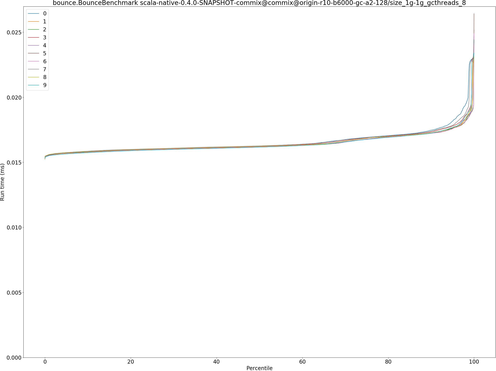

## brainfuck.BrainfuckBenchmark

## deltablue.DeltaBlueBenchmark

## gcbench.GCBenchBenchmark

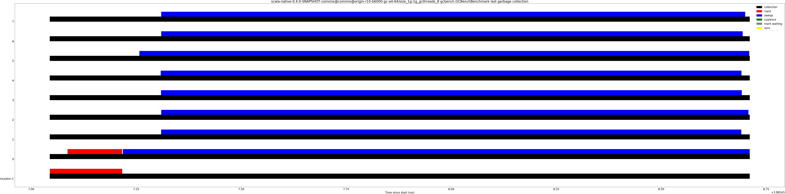

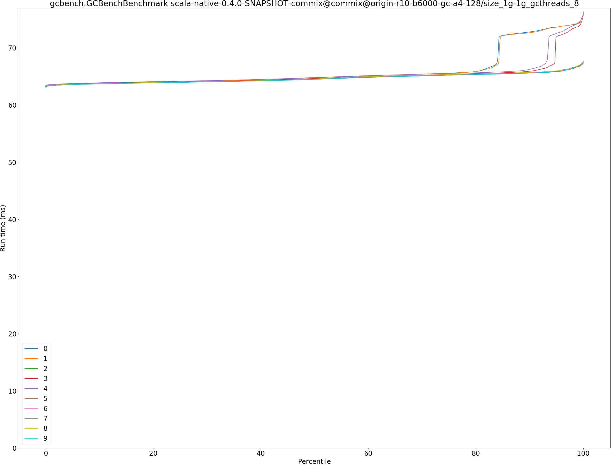

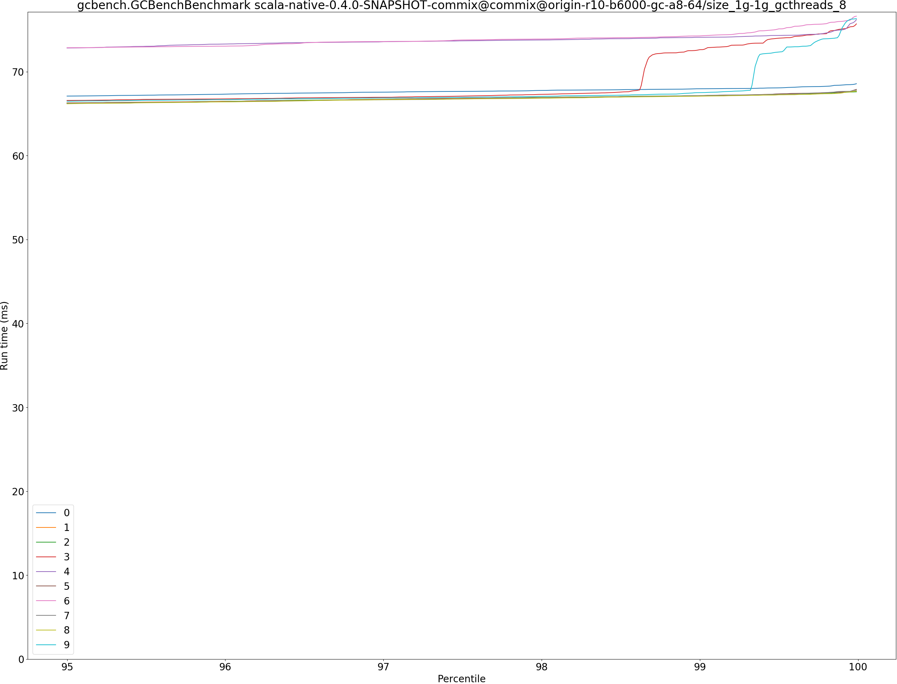

## json.JsonBenchmark

## kmeans.KmeansBenchmark
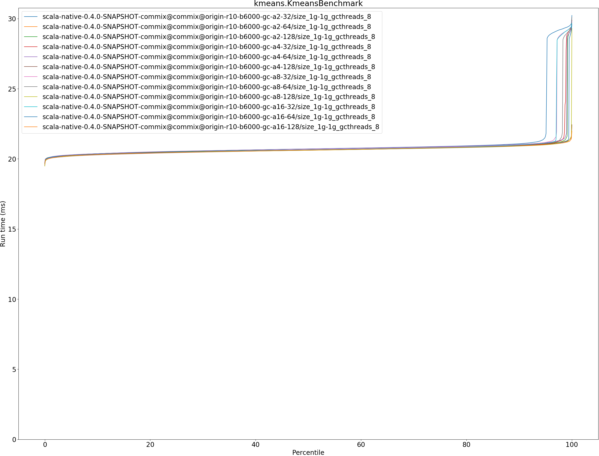

## permute.PermuteBenchmark

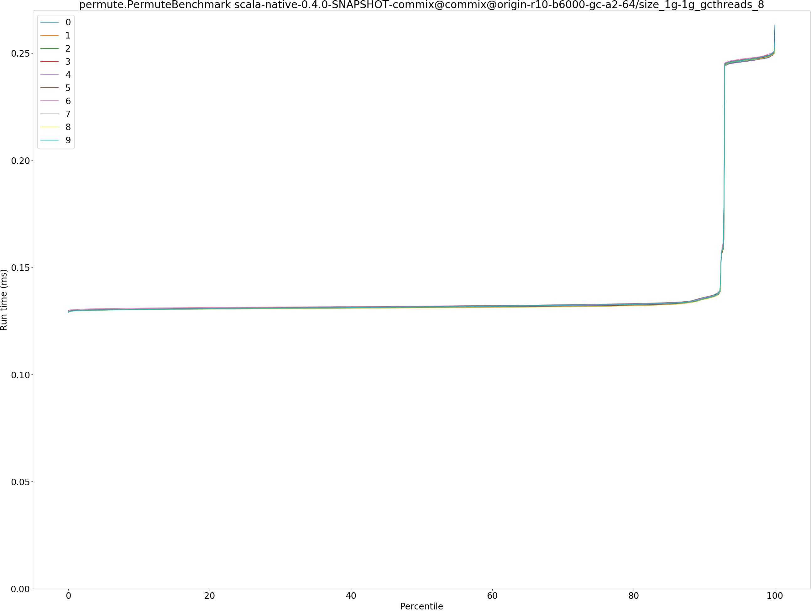

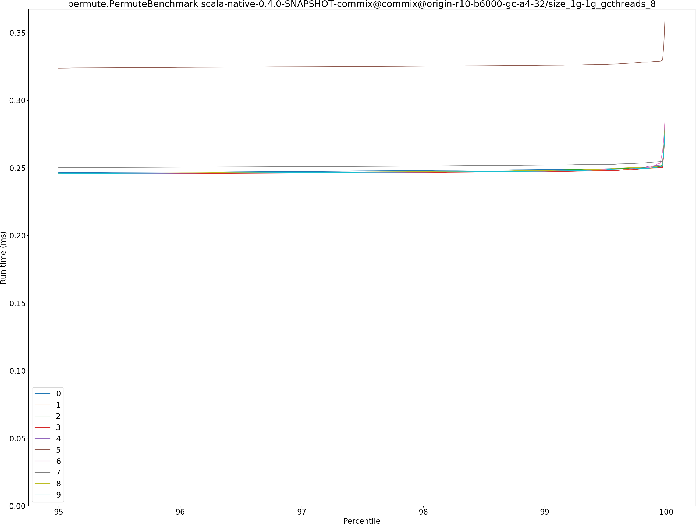

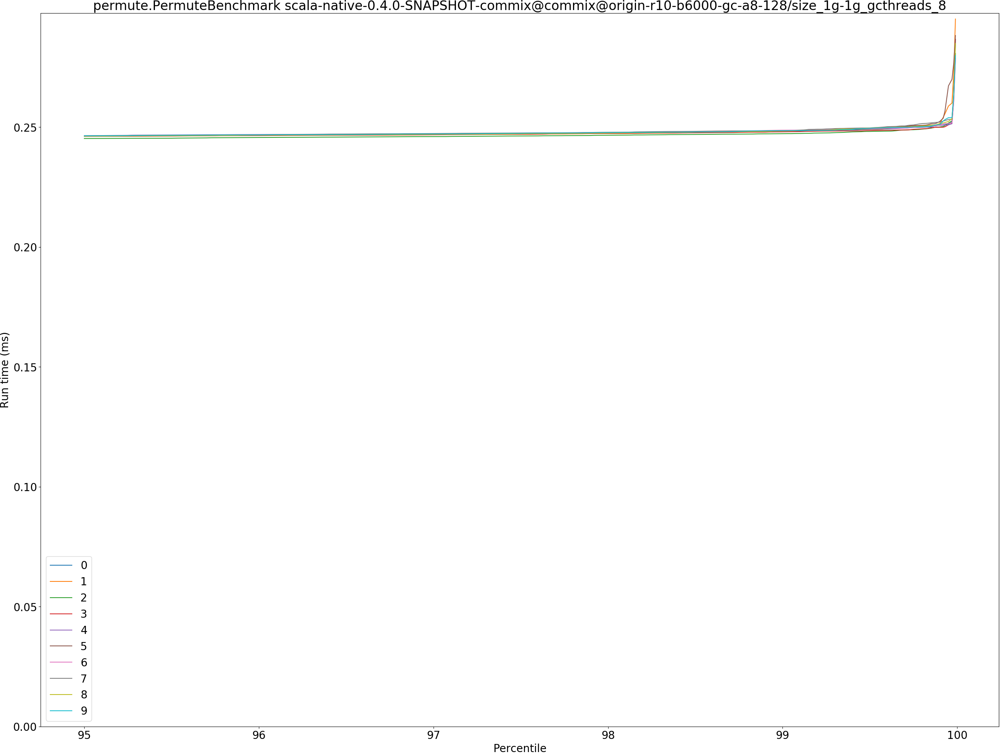

## queens.QueensBenchmark

## richards.RichardsBenchmark

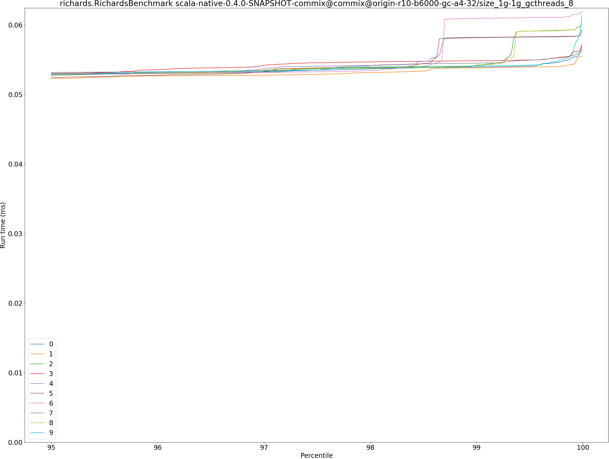

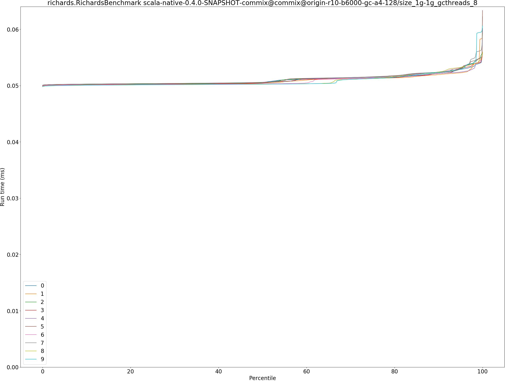

## sudoku.SudokuBenchmark

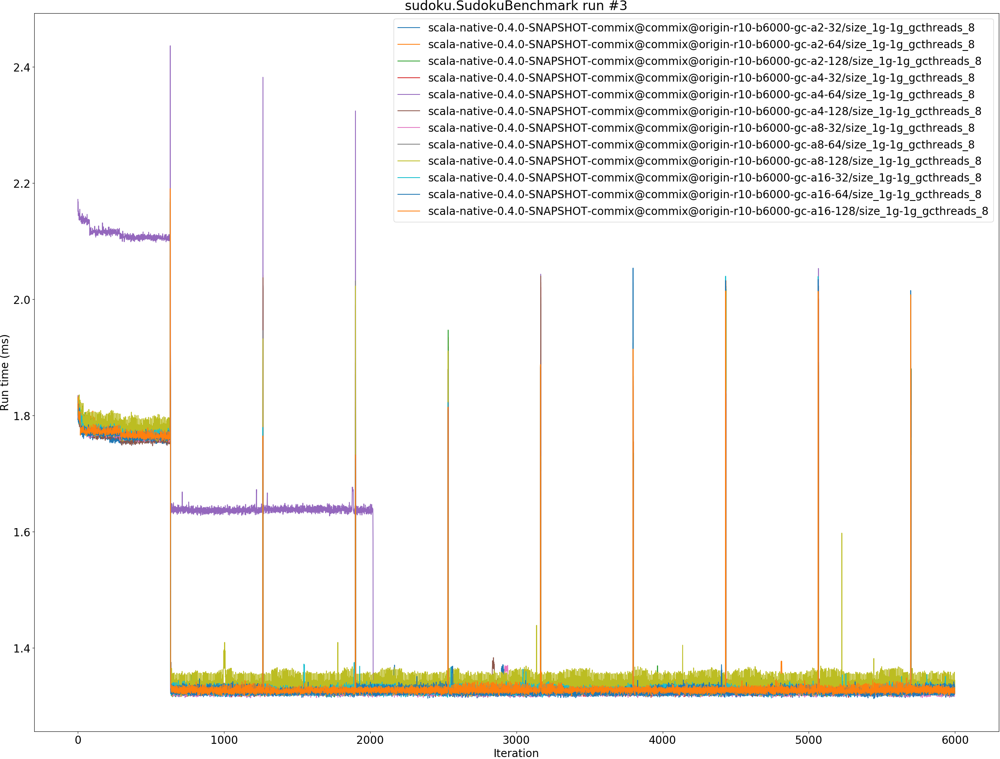

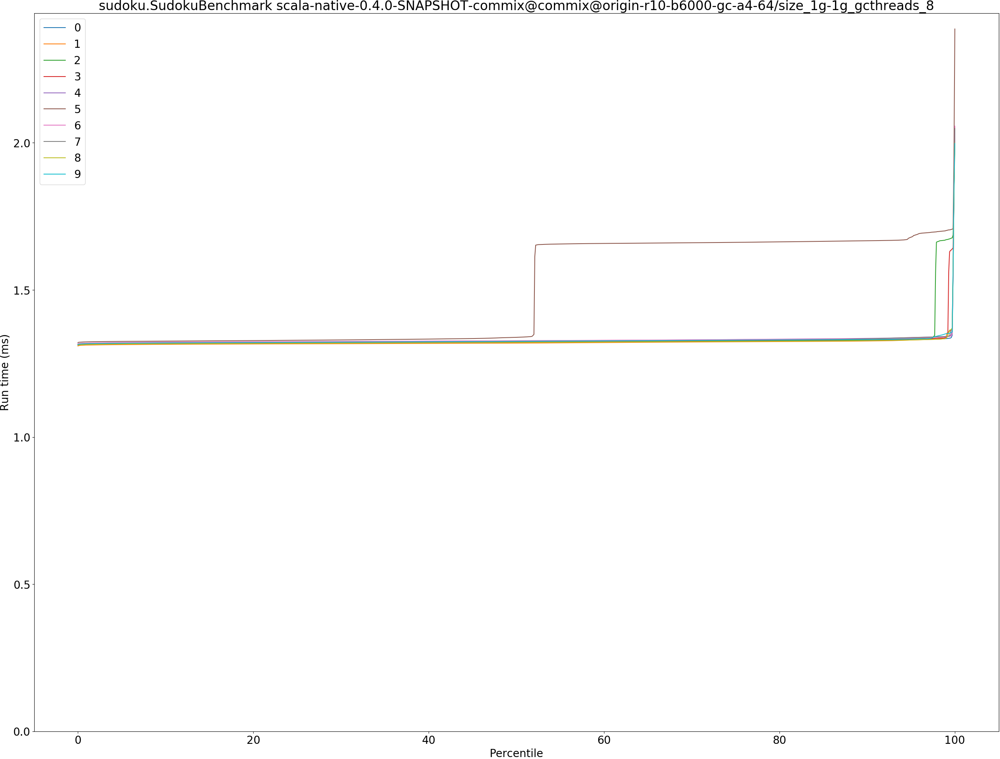

## tracer.TracerBenchmark

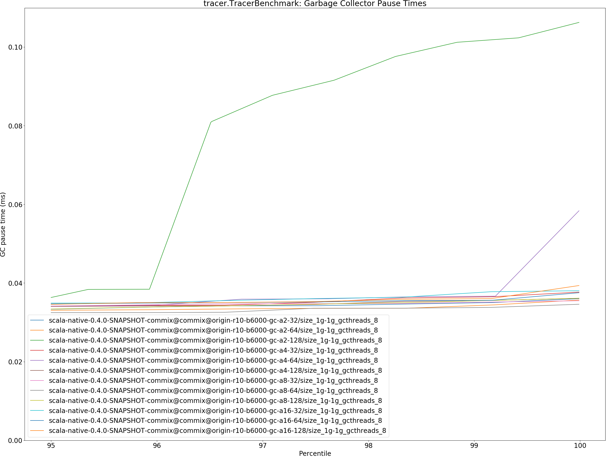

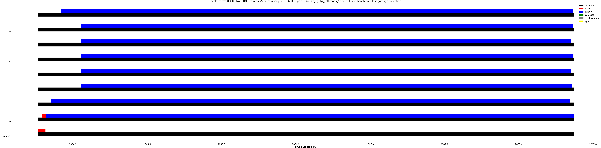

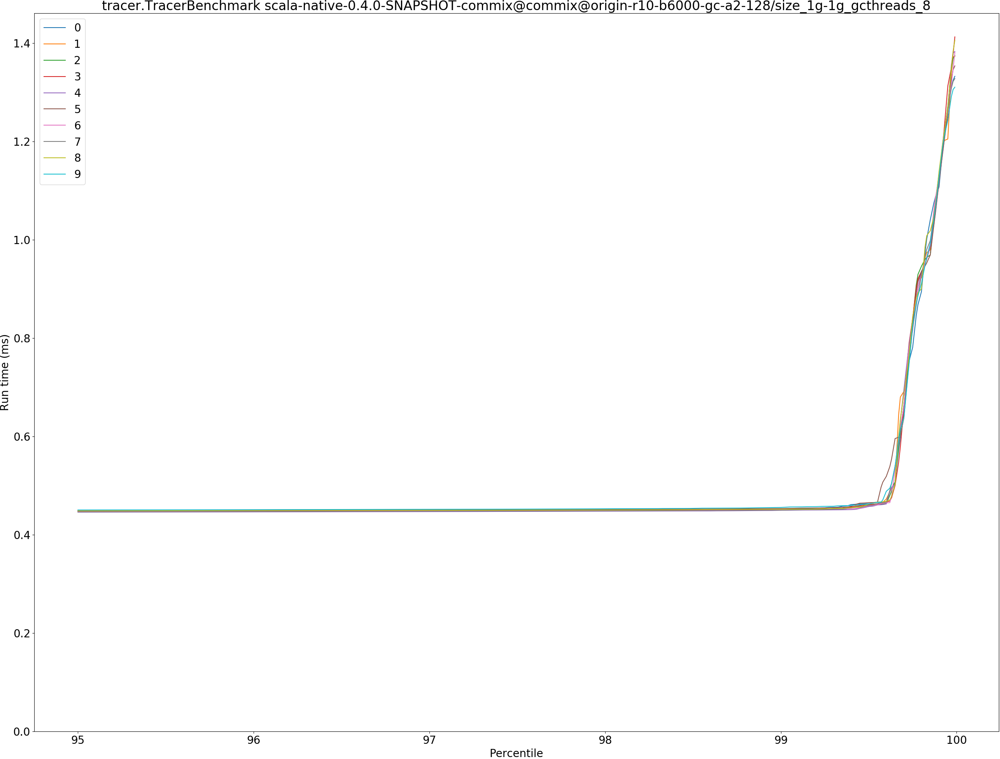

