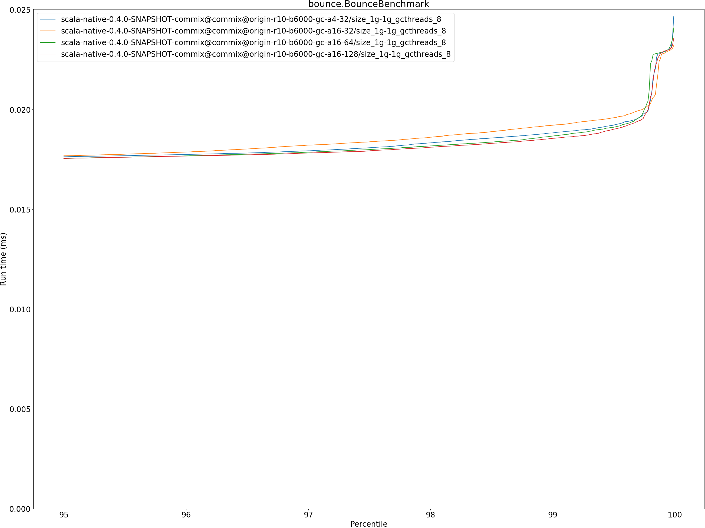
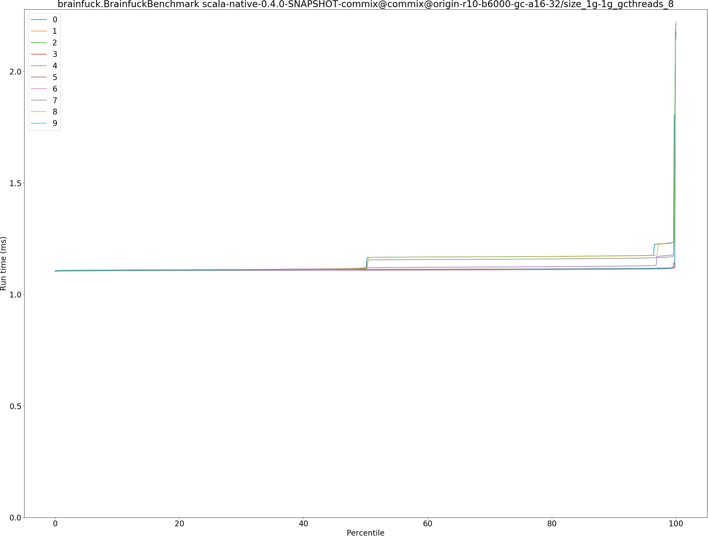
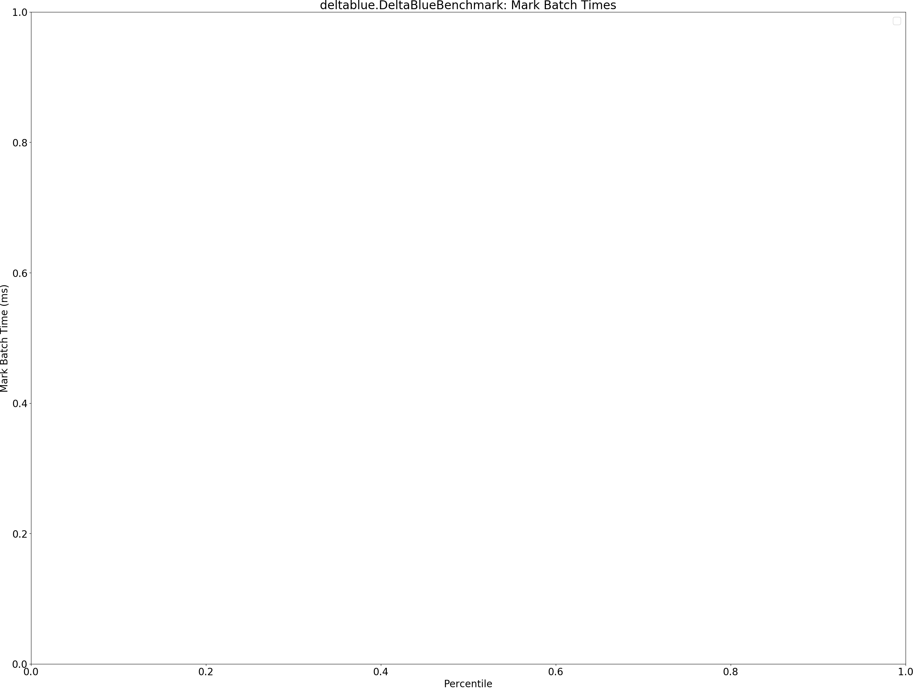
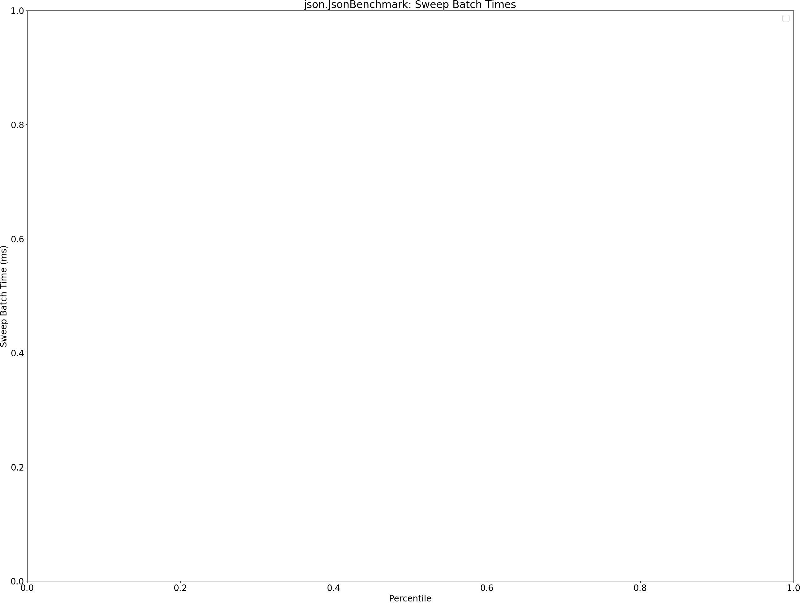
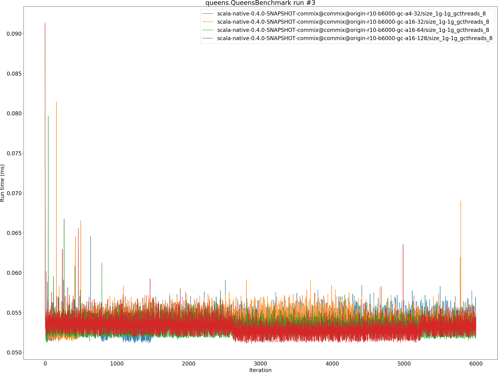
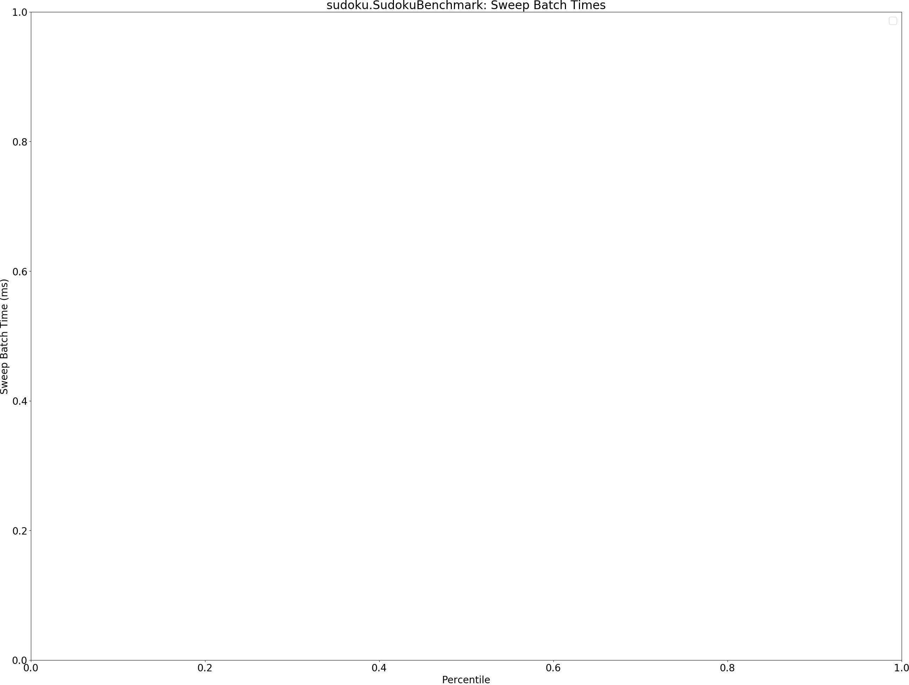
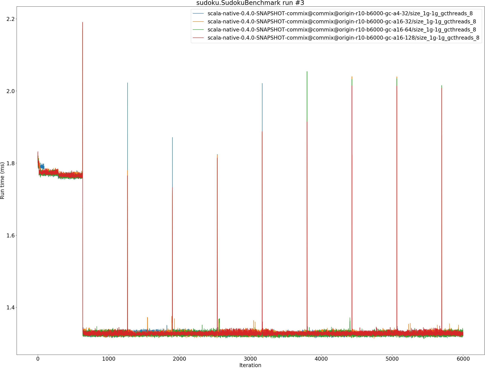

# Summary
## Benchmark run time (ms) at 50 percentile 

|name | scala-native-0.4.0-SNAPSHOT-commix@commix@origin-r10-b6000-gc-a4-32/size_1g-1g_gcthreads_8 | scala-native-0.4.0-SNAPSHOT-commix@commix@origin-r10-b6000-gc-a16-32/size_1g-1g_gcthreads_8 |  | scala-native-0.4.0-SNAPSHOT-commix@commix@origin-r10-b6000-gc-a16-64/size_1g-1g_gcthreads_8 |  | scala-native-0.4.0-SNAPSHOT-commix@commix@origin-r10-b6000-gc-a16-128/size_1g-1g_gcthreads_8 | |
| -- | -- | -- | -- | -- | -- | -- | -- |
|[bounce.BounceBenchmark](#bouncebouncebenchmark)|0.0162|0.0162|+0.11%|0.0162|__-0.07%__|0.0162|__-0.04%__|
|[brainfuck.BrainfuckBenchmark](#brainfuckbrainfuckbenchmark)|1.1080|1.1100|+0.18%|1.1087|+0.07%|1.1094|+0.13%|
|[deltablue.DeltaBlueBenchmark](#deltabluedeltabluebenchmark)|0.1773|0.1781|+0.46%|0.1777|+0.25%|0.1789|+0.89%|
|[gcbench.GCBenchBenchmark](#gcbenchgcbenchbenchmark)|64.4928|67.4773|+4.63%|67.3958|+4.50%|67.2958|+4.35%|
|[json.JsonBenchmark](#jsonjsonbenchmark)|0.7443|0.7431|__-0.16%__|0.7432|__-0.15%__|0.7436|__-0.09%__|
|[kmeans.KmeansBenchmark](#kmeanskmeansbenchmark)|20.6391|20.6433|+0.02%|20.6319|__-0.03%__|20.6252|__-0.07%__|
|[permute.PermuteBenchmark](#permutepermutebenchmark)|0.1314|0.1315|+0.08%|0.1314|+0.01%|0.1314|__-0.01%__|
|[queens.QueensBenchmark](#queensqueensbenchmark)|0.0531|0.0530|__-0.13%__|0.0530|__-0.22%__|0.0529|__-0.35%__|
|[richards.RichardsBenchmark](#richardsrichardsbenchmark)|0.0503|0.0503|+0.08%|0.0504|+0.13%|0.0503|+0.06%|
|[sudoku.SudokuBenchmark](#sudokusudokubenchmark)|1.3246|1.3234|__-0.09%__|1.3229|__-0.13%__|1.3214|__-0.25%__|
|[tracer.TracerBenchmark](#tracertracerbenchmark)|0.4425|0.4423|__-0.03%__|0.4416|__-0.20%__|0.4427|+0.06%|
| __Geometrical mean:__|| |+0.46%| |+0.37%| |+0.42%|
## Benchmark run time (ms) at 90 percentile 

|name | scala-native-0.4.0-SNAPSHOT-commix@commix@origin-r10-b6000-gc-a4-32/size_1g-1g_gcthreads_8 | scala-native-0.4.0-SNAPSHOT-commix@commix@origin-r10-b6000-gc-a16-32/size_1g-1g_gcthreads_8 |  | scala-native-0.4.0-SNAPSHOT-commix@commix@origin-r10-b6000-gc-a16-64/size_1g-1g_gcthreads_8 |  | scala-native-0.4.0-SNAPSHOT-commix@commix@origin-r10-b6000-gc-a16-128/size_1g-1g_gcthreads_8 | |
| -- | -- | -- | -- | -- | -- | -- | -- |
|[bounce.BounceBenchmark](#bouncebouncebenchmark)|0.0172|0.0173|+0.08%|0.0172|__-0.21%__|0.0172|__-0.16%__|
|[brainfuck.BrainfuckBenchmark](#brainfuckbrainfuckbenchmark)|1.1143|1.1227|+0.75%|1.1143|+0.00%|1.1154|+0.10%|
|[deltablue.DeltaBlueBenchmark](#deltabluedeltabluebenchmark)|0.1795|0.1800|+0.28%|0.1797|+0.07%|0.1808|+0.68%|
|[gcbench.GCBenchBenchmark](#gcbenchgcbenchbenchmark)|65.6576|68.5491|+4.40%|68.2569|+3.96%|68.1630|+3.82%|
|[json.JsonBenchmark](#jsonjsonbenchmark)|0.7543|0.7531|__-0.16%__|0.7530|__-0.17%__|0.7536|__-0.10%__|
|[kmeans.KmeansBenchmark](#kmeanskmeansbenchmark)|20.9466|20.9742|+0.13%|20.9319|__-0.07%__|20.9271|__-0.09%__|
|[permute.PermuteBenchmark](#permutepermutebenchmark)|0.1352|0.1355|+0.22%|0.1354|+0.15%|0.1352|__-0.01%__|
|[queens.QueensBenchmark](#queensqueensbenchmark)|0.0547|0.0544|__-0.45%__|0.0542|__-0.89%__|0.0541|__-1.07%__|
|[richards.RichardsBenchmark](#richardsrichardsbenchmark)|0.0522|0.0520|__-0.23%__|0.0521|__-0.09%__|0.0520|__-0.20%__|
|[sudoku.SudokuBenchmark](#sudokusudokubenchmark)|1.3318|1.3314|__-0.03%__|1.3317|__-0.01%__|1.3289|__-0.22%__|
|[tracer.TracerBenchmark](#tracertracerbenchmark)|0.4465|0.4464|__-0.02%__|0.4456|__-0.19%__|0.4470|+0.12%|
| __Geometrical mean:__|| |+0.44%| |+0.22%| |+0.25%|
## Benchmark run time (ms) at 99 percentile 

|name | scala-native-0.4.0-SNAPSHOT-commix@commix@origin-r10-b6000-gc-a4-32/size_1g-1g_gcthreads_8 | scala-native-0.4.0-SNAPSHOT-commix@commix@origin-r10-b6000-gc-a16-32/size_1g-1g_gcthreads_8 |  | scala-native-0.4.0-SNAPSHOT-commix@commix@origin-r10-b6000-gc-a16-64/size_1g-1g_gcthreads_8 |  | scala-native-0.4.0-SNAPSHOT-commix@commix@origin-r10-b6000-gc-a16-128/size_1g-1g_gcthreads_8 | |
| -- | -- | -- | -- | -- | -- | -- | -- |
|[bounce.BounceBenchmark](#bouncebouncebenchmark)|0.0188|0.0192|+2.04%|0.0185|__-1.55%__|0.0185|__-1.63%__|
|[brainfuck.BrainfuckBenchmark](#brainfuckbrainfuckbenchmark)|1.1338|1.1639|+2.65%|1.1316|__-0.20%__|1.1292|__-0.41%__|
|[deltablue.DeltaBlueBenchmark](#deltabluedeltabluebenchmark)|0.1820|0.1827|+0.34%|0.1822|+0.08%|0.1834|+0.76%|
|[gcbench.GCBenchBenchmark](#gcbenchgcbenchbenchmark)|66.8380|76.7983|+14.90%|73.2851|+9.65%|76.4306|+14.35%|
|[json.JsonBenchmark](#jsonjsonbenchmark)|0.7953|0.7935|__-0.22%__|0.8005|+0.65%|0.8156|+2.56%|
|[kmeans.KmeansBenchmark](#kmeanskmeansbenchmark)|23.8146|28.5132|+19.73%|21.2049|__-10.96%__|21.1742|__-11.09%__|
|[permute.PermuteBenchmark](#permutepermutebenchmark)|0.2479|0.2484|+0.21%|0.2493|+0.60%|0.2479|+0.01%|
|[queens.QueensBenchmark](#queensqueensbenchmark)|0.0565|0.0562|__-0.46%__|0.0556|__-1.55%__|0.0555|__-1.79%__|
|[richards.RichardsBenchmark](#richardsrichardsbenchmark)|0.0544|0.0542|__-0.45%__|0.0548|+0.67%|0.0541|__-0.68%__|
|[sudoku.SudokuBenchmark](#sudokusudokubenchmark)|1.3386|1.3387|+0.01%|1.3413|+0.20%|1.3377|__-0.07%__|
|[tracer.TracerBenchmark](#tracertracerbenchmark)|0.4518|0.4515|__-0.05%__|0.4509|__-0.19%__|0.4526|+0.18%|
| __Geometrical mean:__|| |+3.32%| |__-0.34%__| |+0.05%|
## Benchmark run time (ms) at 99.9 percentile 

|name | scala-native-0.4.0-SNAPSHOT-commix@commix@origin-r10-b6000-gc-a4-32/size_1g-1g_gcthreads_8 | scala-native-0.4.0-SNAPSHOT-commix@commix@origin-r10-b6000-gc-a16-32/size_1g-1g_gcthreads_8 |  | scala-native-0.4.0-SNAPSHOT-commix@commix@origin-r10-b6000-gc-a16-64/size_1g-1g_gcthreads_8 |  | scala-native-0.4.0-SNAPSHOT-commix@commix@origin-r10-b6000-gc-a16-128/size_1g-1g_gcthreads_8 | |
| -- | -- | -- | -- | -- | -- | -- | -- |
|[bounce.BounceBenchmark](#bouncebouncebenchmark)|0.0229|0.0228|__-0.31%__|0.0204|__-10.65%__|0.0223|__-2.29%__|
|[brainfuck.BrainfuckBenchmark](#brainfuckbrainfuckbenchmark)|2.0256|2.1509|+6.18%|2.1509|+6.19%|2.1405|+5.67%|
|[deltablue.DeltaBlueBenchmark](#deltabluedeltabluebenchmark)|0.2768|0.2502|__-9.61%__|0.2483|__-10.29%__|0.2479|__-10.42%__|
|[gcbench.GCBenchBenchmark](#gcbenchgcbenchbenchmark)|71.9236|77.3296|+7.52%|76.9309|+6.96%|77.1178|+7.22%|
|[json.JsonBenchmark](#jsonjsonbenchmark)|2.1413|2.1683|+1.26%|2.0672|__-3.46%__|1.9756|__-7.74%__|
|[kmeans.KmeansBenchmark](#kmeanskmeansbenchmark)|29.2763|29.3462|+0.24%|21.3917|__-26.93%__|21.3508|__-27.07%__|
|[permute.PermuteBenchmark](#permutepermutebenchmark)|0.2507|0.2509|+0.06%|0.2521|+0.54%|0.2508|+0.03%|
|[queens.QueensBenchmark](#queensqueensbenchmark)|0.0575|0.0574|__-0.09%__|0.0568|__-1.25%__|0.0567|__-1.36%__|
|[richards.RichardsBenchmark](#richardsrichardsbenchmark)|0.0584|0.0583|__-0.19%__|0.0591|+1.28%|0.0582|__-0.35%__|
|[sudoku.SudokuBenchmark](#sudokusudokubenchmark)|1.8444|1.8954|+2.77%|1.8962|+2.81%|1.8877|+2.35%|
|[tracer.TracerBenchmark](#tracertracerbenchmark)|1.0678|1.1703|+9.60%|1.1441|+7.14%|1.1207|+4.95%|
| __Geometrical mean:__|| |+1.47%| |__-3.05%__| |__-3.13%__|
## Benchmark total run time (ms) 

|name | scala-native-0.4.0-SNAPSHOT-commix@commix@origin-r10-b6000-gc-a4-32/size_1g-1g_gcthreads_8 | scala-native-0.4.0-SNAPSHOT-commix@commix@origin-r10-b6000-gc-a16-32/size_1g-1g_gcthreads_8 |  | scala-native-0.4.0-SNAPSHOT-commix@commix@origin-r10-b6000-gc-a16-64/size_1g-1g_gcthreads_8 |  | scala-native-0.4.0-SNAPSHOT-commix@commix@origin-r10-b6000-gc-a16-128/size_1g-1g_gcthreads_8 | |
| -- | -- | -- | -- | -- | -- | -- | -- |
|[bounce.BounceBenchmark](#bouncebouncebenchmark)|525.6675|526.4835|+0.16%|525.0634|__-0.11%__|525.1120|__-0.11%__|
|[brainfuck.BrainfuckBenchmark](#brainfuckbrainfuckbenchmark)|35556.8752|35791.1163|+0.66%|35887.9381|+0.93%|35583.2617|+0.07%|
|[deltablue.DeltaBlueBenchmark](#deltabluedeltabluebenchmark)|5545.6571|5566.9455|+0.38%|5556.9066|+0.20%|5590.8977|+0.82%|
|[gcbench.GCBenchBenchmark](#gcbenchgcbenchbenchmark)|2068357.6904|2140283.4571|+3.48%|2130193.4926|+2.99%|2127869.8311|+2.88%|
|[json.JsonBenchmark](#jsonjsonbenchmark)|24037.6374|24030.2158|__-0.03%__|24022.2803|__-0.06%__|24024.8295|__-0.05%__|
|[kmeans.KmeansBenchmark](#kmeanskmeansbenchmark)|663740.2583|668149.1816|+0.66%|661584.9708|__-0.32%__|659972.4216|__-0.57%__|
|[permute.PermuteBenchmark](#permutepermutebenchmark)|4477.8979|4482.6423|+0.11%|4482.4715|+0.10%|4478.3832|+0.01%|
|[queens.QueensBenchmark](#queensqueensbenchmark)|1703.5238|1701.8254|__-0.10%__|1699.1702|__-0.26%__|1694.9808|__-0.50%__|
|[richards.RichardsBenchmark](#richardsrichardsbenchmark)|1627.4645|1627.4702|+0.00%|1628.8925|+0.09%|1627.1726|__-0.02%__|
|[sudoku.SudokuBenchmark](#sudokusudokubenchmark)|42441.1136|42756.6820|+0.74%|42935.3240|+1.16%|42333.0804|__-0.25%__|
|[tracer.TracerBenchmark](#tracertracerbenchmark)|14234.4734|14234.6140|+0.00%|14208.0048|__-0.19%__|14241.0218|+0.05%|
| __Geometrical mean:__|| |+0.55%| |+0.41%| |+0.21%|
## Total GC time on Application thread (ms) 

|name |  | scala-native-0.4.0-SNAPSHOT-commix@commix@origin-r10-b6000-gc-a4-32/size_1g-1g_gcthreads_8 | scala-native-0.4.0-SNAPSHOT-commix@commix@origin-r10-b6000-gc-a16-32/size_1g-1g_gcthreads_8 |  | scala-native-0.4.0-SNAPSHOT-commix@commix@origin-r10-b6000-gc-a16-64/size_1g-1g_gcthreads_8 |  | scala-native-0.4.0-SNAPSHOT-commix@commix@origin-r10-b6000-gc-a16-128/size_1g-1g_gcthreads_8 | |
| -- | -- | -- | -- | -- | -- | -- | -- | -- |
|[bounce.BounceBenchmark](#bouncebouncebenchmark)|mark|0.0000|0.0000|N/A|0.0000|N/A|0.0000|N/A|
||sweep|0.0000|0.0000|N/A|0.0000|N/A|0.0000|N/A|
||total|0.0000|0.0000|N/A|0.0000|N/A|0.0000|N/A|
|[brainfuck.BrainfuckBenchmark](#brainfuckbrainfuckbenchmark)|mark|4.9848|2.3484|__-52.89%__|2.5639|__-48.57%__|2.3231|__-53.40%__|
||sweep|0.0000|0.0000|N/A|0.0000|N/A|0.0000|N/A|
||total|4.9848|2.3484|__-52.89%__|2.5639|__-48.57%__|2.3231|__-53.40%__|
|[deltablue.DeltaBlueBenchmark](#deltabluedeltabluebenchmark)|mark|0.5930|0.5202|__-12.28%__|0.5186|__-12.55%__|0.5329|__-10.15%__|
||sweep|0.0000|0.0000|N/A|0.0000|N/A|0.0000|N/A|
||total|0.5930|0.5202|__-12.28%__|0.5186|__-12.55%__|0.5329|__-10.15%__|
|[gcbench.GCBenchBenchmark](#gcbenchgcbenchbenchmark)|mark|5311.1785|89120.9890|+1577.99%|88869.7369|+1573.26%|88828.3719|+1572.48%|
||sweep|2.5454|0.0000|__-100.00%__|0.0000|__-100.00%__|0.0000|__-100.00%__|
||total|5313.7239|89120.9890|+1577.19%|88869.7369|+1572.46%|88828.3719|+1571.68%|
|[json.JsonBenchmark](#jsonjsonbenchmark)|mark|46.7255|55.8881|+19.61%|55.7258|+19.26%|55.7884|+19.40%|
||sweep|0.0000|0.0000|N/A|0.0000|N/A|0.0000|N/A|
||total|46.7255|55.8881|+19.61%|55.7258|+19.26%|55.7884|+19.40%|
|[kmeans.KmeansBenchmark](#kmeanskmeansbenchmark)|mark|296.1960|277.5097|__-6.31%__|271.9484|__-8.19%__|273.1110|__-7.79%__|
||sweep|0.0000|0.0000|N/A|0.0000|N/A|0.0000|N/A|
||total|296.1960|277.5097|__-6.31%__|271.9484|__-8.19%__|273.1110|__-7.79%__|
|[permute.PermuteBenchmark](#permutepermutebenchmark)|mark|0.5282|0.5341|+1.13%|0.5338|+1.07%|0.5272|__-0.19%__|
||sweep|0.0000|0.0000|N/A|0.0000|N/A|0.0000|N/A|
||total|0.5282|0.5341|+1.13%|0.5338|+1.07%|0.5272|__-0.19%__|
|[queens.QueensBenchmark](#queensqueensbenchmark)|mark|0.0000|0.0000|N/A|0.0000|N/A|0.0000|N/A|
||sweep|0.0000|0.0000|N/A|0.0000|N/A|0.0000|N/A|
||total|0.0000|0.0000|N/A|0.0000|N/A|0.0000|N/A|
|[richards.RichardsBenchmark](#richardsrichardsbenchmark)|mark|0.0000|0.0000|N/A|0.0000|N/A|0.0000|N/A|
||sweep|0.0000|0.0000|N/A|0.0000|N/A|0.0000|N/A|
||total|0.0000|0.0000|N/A|0.0000|N/A|0.0000|N/A|
|[sudoku.SudokuBenchmark](#sudokusudokubenchmark)|mark|11.9971|12.0019|+0.04%|11.9337|__-0.53%__|11.8564|__-1.17%__|
||sweep|0.0000|0.0000|N/A|0.0000|N/A|0.0000|N/A|
||total|11.9971|12.0019|+0.04%|11.9337|__-0.53%__|11.8564|__-1.17%__|
|[tracer.TracerBenchmark](#tracertracerbenchmark)|mark|2.6458|2.6602|+0.55%|2.6781|+1.22%|2.7355|+3.39%|
||sweep|0.0000|0.0000|N/A|0.0000|N/A|0.0000|N/A|
||total|2.6458|2.6602|+0.55%|2.6781|+1.22%|2.7355|+3.39%|
|__Geometrical mean:__|mark|| |+29.49%| |+30.45%| |+29.40%|
||sweep|| | | | | | |
||total|| |+29.48%| |+30.44%| |+29.40%|
## GC pause time (ms) at 50 percentile 

|name | scala-native-0.4.0-SNAPSHOT-commix@commix@origin-r10-b6000-gc-a4-32/size_1g-1g_gcthreads_8 | scala-native-0.4.0-SNAPSHOT-commix@commix@origin-r10-b6000-gc-a16-32/size_1g-1g_gcthreads_8 |  | scala-native-0.4.0-SNAPSHOT-commix@commix@origin-r10-b6000-gc-a16-64/size_1g-1g_gcthreads_8 |  | scala-native-0.4.0-SNAPSHOT-commix@commix@origin-r10-b6000-gc-a16-128/size_1g-1g_gcthreads_8 | |
| -- | -- | -- | -- | -- | -- | -- | -- |
|[bounce.BounceBenchmark](#bouncebouncebenchmark)|0.0000|0.0000|N/A|0.0000|N/A|0.0000|N/A|
|[brainfuck.BrainfuckBenchmark](#brainfuckbrainfuckbenchmark)|0.0000|0.0000|N/A|0.0000|N/A|0.0000|N/A|
|[deltablue.DeltaBlueBenchmark](#deltabluedeltabluebenchmark)|0.0000|0.0000|N/A|0.0000|N/A|0.0000|N/A|
|[gcbench.GCBenchBenchmark](#gcbenchgcbenchbenchmark)|0.0367|0.0000|__-100.00%__|0.0000|__-100.00%__|0.0000|__-100.00%__|
|[json.JsonBenchmark](#jsonjsonbenchmark)|0.0000|0.0000|N/A|0.0000|N/A|0.0000|N/A|
|[kmeans.KmeansBenchmark](#kmeanskmeansbenchmark)|0.0000|0.0000|N/A|0.0000|N/A|0.0000|N/A|
|[permute.PermuteBenchmark](#permutepermutebenchmark)|0.0000|0.0000|N/A|0.0000|N/A|0.0000|N/A|
|[queens.QueensBenchmark](#queensqueensbenchmark)|0.0000|0.0000|N/A|0.0000|N/A|0.0000|N/A|
|[richards.RichardsBenchmark](#richardsrichardsbenchmark)|0.0000|0.0000|N/A|0.0000|N/A|0.0000|N/A|
|[sudoku.SudokuBenchmark](#sudokusudokubenchmark)|0.0000|0.0000|N/A|0.0000|N/A|0.0000|N/A|
|[tracer.TracerBenchmark](#tracertracerbenchmark)|0.0000|0.0000|N/A|0.0000|N/A|0.0000|N/A|
| __Geometrical mean:__|| | | | | | |
## GC pause time (ms) at 90 percentile 

|name | scala-native-0.4.0-SNAPSHOT-commix@commix@origin-r10-b6000-gc-a4-32/size_1g-1g_gcthreads_8 | scala-native-0.4.0-SNAPSHOT-commix@commix@origin-r10-b6000-gc-a16-32/size_1g-1g_gcthreads_8 |  | scala-native-0.4.0-SNAPSHOT-commix@commix@origin-r10-b6000-gc-a16-64/size_1g-1g_gcthreads_8 |  | scala-native-0.4.0-SNAPSHOT-commix@commix@origin-r10-b6000-gc-a16-128/size_1g-1g_gcthreads_8 | |
| -- | -- | -- | -- | -- | -- | -- | -- |
|[bounce.BounceBenchmark](#bouncebouncebenchmark)|0.0000|0.0000|N/A|0.0000|N/A|0.0000|N/A|
|[brainfuck.BrainfuckBenchmark](#brainfuckbrainfuckbenchmark)|0.0000|0.0000|N/A|0.0000|N/A|0.0000|N/A|
|[deltablue.DeltaBlueBenchmark](#deltabluedeltabluebenchmark)|0.0000|0.0000|N/A|0.0000|N/A|0.0000|N/A|
|[gcbench.GCBenchBenchmark](#gcbenchgcbenchbenchmark)|0.5421|0.0000|__-100.00%__|0.0000|__-100.00%__|0.0000|__-100.00%__|
|[json.JsonBenchmark](#jsonjsonbenchmark)|0.0000|0.0000|N/A|0.0000|N/A|0.0000|N/A|
|[kmeans.KmeansBenchmark](#kmeanskmeansbenchmark)|0.0000|0.0000|N/A|0.0000|N/A|0.0000|N/A|
|[permute.PermuteBenchmark](#permutepermutebenchmark)|0.0000|0.0000|N/A|0.0000|N/A|0.0000|N/A|
|[queens.QueensBenchmark](#queensqueensbenchmark)|0.0000|0.0000|N/A|0.0000|N/A|0.0000|N/A|
|[richards.RichardsBenchmark](#richardsrichardsbenchmark)|0.0000|0.0000|N/A|0.0000|N/A|0.0000|N/A|
|[sudoku.SudokuBenchmark](#sudokusudokubenchmark)|0.0000|0.0000|N/A|0.0000|N/A|0.0000|N/A|
|[tracer.TracerBenchmark](#tracertracerbenchmark)|0.0000|0.0000|N/A|0.0000|N/A|0.0000|N/A|
| __Geometrical mean:__|| | | | | | |
## GC pause time (ms) at 99 percentile 

|name | scala-native-0.4.0-SNAPSHOT-commix@commix@origin-r10-b6000-gc-a4-32/size_1g-1g_gcthreads_8 | scala-native-0.4.0-SNAPSHOT-commix@commix@origin-r10-b6000-gc-a16-32/size_1g-1g_gcthreads_8 |  | scala-native-0.4.0-SNAPSHOT-commix@commix@origin-r10-b6000-gc-a16-64/size_1g-1g_gcthreads_8 |  | scala-native-0.4.0-SNAPSHOT-commix@commix@origin-r10-b6000-gc-a16-128/size_1g-1g_gcthreads_8 | |
| -- | -- | -- | -- | -- | -- | -- | -- |
|[bounce.BounceBenchmark](#bouncebouncebenchmark)|0.0000|0.0000|N/A|0.0000|N/A|0.0000|N/A|
|[brainfuck.BrainfuckBenchmark](#brainfuckbrainfuckbenchmark)|0.0000|0.0000|N/A|0.0000|N/A|0.0000|N/A|
|[deltablue.DeltaBlueBenchmark](#deltabluedeltabluebenchmark)|0.0000|0.0000|N/A|0.0000|N/A|0.0000|N/A|
|[gcbench.GCBenchBenchmark](#gcbenchgcbenchbenchmark)|1.7850|0.0000|__-100.00%__|0.0000|__-100.00%__|0.0000|__-100.00%__|
|[json.JsonBenchmark](#jsonjsonbenchmark)|0.0000|0.0000|N/A|0.0000|N/A|0.0000|N/A|
|[kmeans.KmeansBenchmark](#kmeanskmeansbenchmark)|0.0000|0.0000|N/A|0.0000|N/A|0.0000|N/A|
|[permute.PermuteBenchmark](#permutepermutebenchmark)|0.0000|0.0000|N/A|0.0000|N/A|0.0000|N/A|
|[queens.QueensBenchmark](#queensqueensbenchmark)|0.0000|0.0000|N/A|0.0000|N/A|0.0000|N/A|
|[richards.RichardsBenchmark](#richardsrichardsbenchmark)|0.0000|0.0000|N/A|0.0000|N/A|0.0000|N/A|
|[sudoku.SudokuBenchmark](#sudokusudokubenchmark)|0.0000|0.0000|N/A|0.0000|N/A|0.0000|N/A|
|[tracer.TracerBenchmark](#tracertracerbenchmark)|0.0000|0.0000|N/A|0.0000|N/A|0.0000|N/A|
| __Geometrical mean:__|| | | | | | |
## GC pause time (ms) at 99.9 percentile 

|name | scala-native-0.4.0-SNAPSHOT-commix@commix@origin-r10-b6000-gc-a4-32/size_1g-1g_gcthreads_8 | scala-native-0.4.0-SNAPSHOT-commix@commix@origin-r10-b6000-gc-a16-32/size_1g-1g_gcthreads_8 |  | scala-native-0.4.0-SNAPSHOT-commix@commix@origin-r10-b6000-gc-a16-64/size_1g-1g_gcthreads_8 |  | scala-native-0.4.0-SNAPSHOT-commix@commix@origin-r10-b6000-gc-a16-128/size_1g-1g_gcthreads_8 | |
| -- | -- | -- | -- | -- | -- | -- | -- |
|[bounce.BounceBenchmark](#bouncebouncebenchmark)|0.0000|0.0000|N/A|0.0000|N/A|0.0000|N/A|
|[brainfuck.BrainfuckBenchmark](#brainfuckbrainfuckbenchmark)|0.0000|0.0000|N/A|0.0000|N/A|0.0000|N/A|
|[deltablue.DeltaBlueBenchmark](#deltabluedeltabluebenchmark)|0.0000|0.0000|N/A|0.0000|N/A|0.0000|N/A|
|[gcbench.GCBenchBenchmark](#gcbenchgcbenchbenchmark)|1.8626|0.0000|__-100.00%__|0.0000|__-100.00%__|0.0000|__-100.00%__|
|[json.JsonBenchmark](#jsonjsonbenchmark)|0.0000|0.0000|N/A|0.0000|N/A|0.0000|N/A|
|[kmeans.KmeansBenchmark](#kmeanskmeansbenchmark)|0.0000|0.0000|N/A|0.0000|N/A|0.0000|N/A|
|[permute.PermuteBenchmark](#permutepermutebenchmark)|0.0000|0.0000|N/A|0.0000|N/A|0.0000|N/A|
|[queens.QueensBenchmark](#queensqueensbenchmark)|0.0000|0.0000|N/A|0.0000|N/A|0.0000|N/A|
|[richards.RichardsBenchmark](#richardsrichardsbenchmark)|0.0000|0.0000|N/A|0.0000|N/A|0.0000|N/A|
|[sudoku.SudokuBenchmark](#sudokusudokubenchmark)|0.0000|0.0000|N/A|0.0000|N/A|0.0000|N/A|
|[tracer.TracerBenchmark](#tracertracerbenchmark)|0.0000|0.0000|N/A|0.0000|N/A|0.0000|N/A|
| __Geometrical mean:__|| | | | | | |
# Individual benchmarks
## bounce.BounceBenchmark

## brainfuck.BrainfuckBenchmark

## deltablue.DeltaBlueBenchmark

## gcbench.GCBenchBenchmark

## json.JsonBenchmark

## kmeans.KmeansBenchmark

## permute.PermuteBenchmark

## queens.QueensBenchmark

## richards.RichardsBenchmark

## sudoku.SudokuBenchmark

## tracer.TracerBenchmark

