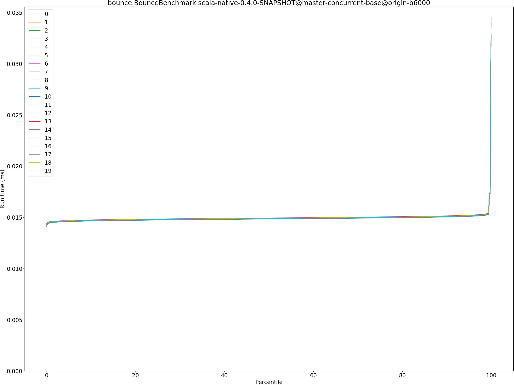
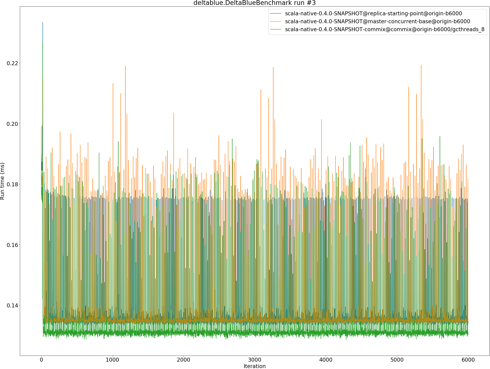
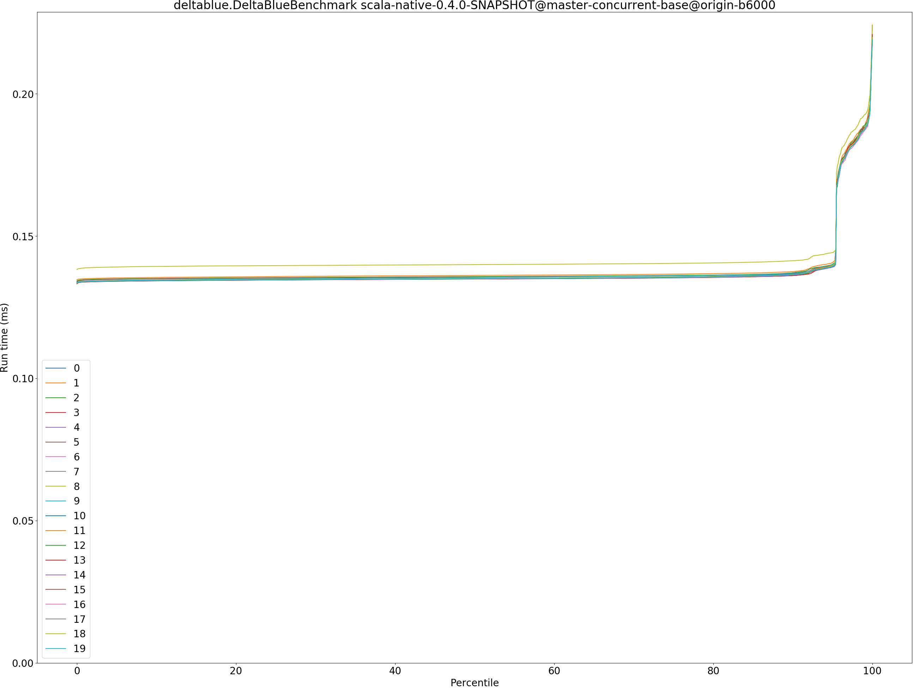
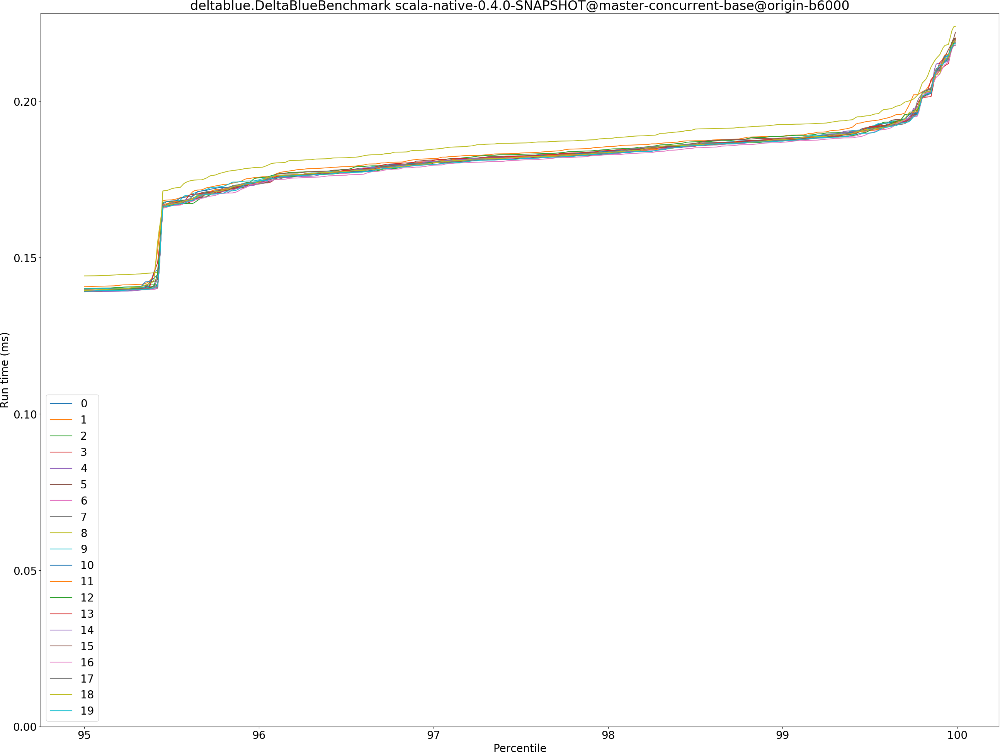
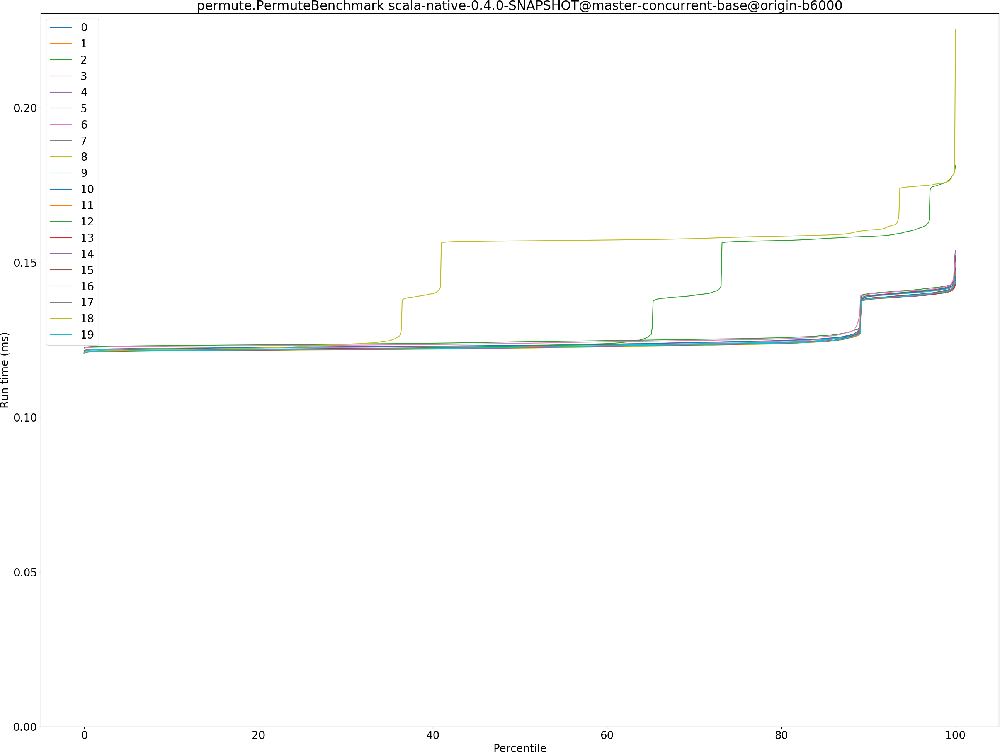

# Summary
## Benchmark run time (ms) at 50 percentile 

|name | scala-native-0.4.0-SNAPSHOT@replica-starting-point@origin-b6000 | scala-native-0.4.0-SNAPSHOT@master-concurrent-base@origin-b6000 |  | scala-native-0.4.0-SNAPSHOT-commix@commix@origin-b6000/gcthreads_8 | |
| -- | -- | -- | -- | -- | -- |
|[bounce.BounceBenchmark](#bouncebouncebenchmark)|0.0157|0.0149|__-5.27%__|0.0149|__-5.04%__|
|[brainfuck.BrainfuckBenchmark](#brainfuckbrainfuckbenchmark)|1.1717|1.1183|__-4.56%__|1.1471|__-2.10%__|
|[cd.CDBenchmark](#cdcdbenchmark)|19.9688|15.8236|__-20.76%__|15.8242|__-20.76%__|
|[deltablue.DeltaBlueBenchmark](#deltabluedeltabluebenchmark)|0.1350|0.1350|__-0.01%__|0.1310|__-3.02%__|
|[gcbench.GCBenchBenchmark](#gcbenchgcbenchbenchmark)|79.0728|65.8294|__-16.75%__|64.2293|__-18.77%__|
|[json.JsonBenchmark](#jsonjsonbenchmark)|0.9950|0.7205|__-27.59%__|0.7282|__-26.81%__|
|[kmeans.KmeansBenchmark](#kmeanskmeansbenchmark)|26.5162|20.6929|__-21.96%__|20.7007|__-21.93%__|
|[nbody.NbodyBenchmark](#nbodynbodybenchmark)|19.3827|19.3795|__-0.02%__|19.3796|__-0.02%__|
|[permute.PermuteBenchmark](#permutepermutebenchmark)|0.1403|0.1227|__-12.55%__|0.1212|__-13.60%__|
|[queens.QueensBenchmark](#queensqueensbenchmark)|0.0526|0.0502|__-4.56%__|0.0495|__-5.90%__|
|[richards.RichardsBenchmark](#richardsrichardsbenchmark)|0.0500|0.0502|+0.32%|0.0500|__-0.15%__|
|[sudoku.SudokuBenchmark](#sudokusudokubenchmark)|1.3678|1.3239|__-3.21%__|1.3164|__-3.76%__|
|[tracer.TracerBenchmark](#tracertracerbenchmark)|0.5145|0.4436|__-13.78%__|0.4380|__-14.86%__|
| __Geometrical mean:__|| |__-10.53%__| |__-10.98%__|
## Benchmark run time (ms) at 90 percentile 

|name | scala-native-0.4.0-SNAPSHOT@replica-starting-point@origin-b6000 | scala-native-0.4.0-SNAPSHOT@master-concurrent-base@origin-b6000 |  | scala-native-0.4.0-SNAPSHOT-commix@commix@origin-b6000/gcthreads_8 | |
| -- | -- | -- | -- | -- | -- |
|[bounce.BounceBenchmark](#bouncebouncebenchmark)|0.0159|0.0151|__-5.22%__|0.0151|__-4.91%__|
|[brainfuck.BrainfuckBenchmark](#brainfuckbrainfuckbenchmark)|1.2221|1.1713|__-4.15%__|1.1888|__-2.73%__|
|[cd.CDBenchmark](#cdcdbenchmark)|20.1840|15.9634|__-20.91%__|16.9278|__-16.13%__|
|[deltablue.DeltaBlueBenchmark](#deltabluedeltabluebenchmark)|0.1370|0.1364|__-0.44%__|0.1327|__-3.17%__|
|[gcbench.GCBenchBenchmark](#gcbenchgcbenchbenchmark)|79.4458|66.1105|__-16.79%__|65.7434|__-17.25%__|
|[json.JsonBenchmark](#jsonjsonbenchmark)|1.4549|0.9815|__-32.53%__|0.8295|__-42.99%__|
|[kmeans.KmeansBenchmark](#kmeanskmeansbenchmark)|30.5246|21.1009|__-30.87%__|21.3935|__-29.91%__|
|[nbody.NbodyBenchmark](#nbodynbodybenchmark)|19.3942|19.3810|__-0.07%__|19.3810|__-0.07%__|
|[permute.PermuteBenchmark](#permutepermutebenchmark)|0.1523|0.1382|__-9.23%__|0.1374|__-9.78%__|
|[queens.QueensBenchmark](#queensqueensbenchmark)|0.0529|0.0504|__-4.76%__|0.0497|__-6.06%__|
|[richards.RichardsBenchmark](#richardsrichardsbenchmark)|0.0510|0.0514|+0.89%|0.0512|+0.51%|
|[sudoku.SudokuBenchmark](#sudokusudokubenchmark)|1.6365|1.4043|__-14.19%__|1.4216|__-13.13%__|
|[tracer.TracerBenchmark](#tracertracerbenchmark)|0.5183|0.4487|__-13.42%__|0.4424|__-14.64%__|
| __Geometrical mean:__|| |__-12.37%__| |__-13.28%__|
## Benchmark run time (ms) at 99 percentile 

|name | scala-native-0.4.0-SNAPSHOT@replica-starting-point@origin-b6000 | scala-native-0.4.0-SNAPSHOT@master-concurrent-base@origin-b6000 |  | scala-native-0.4.0-SNAPSHOT-commix@commix@origin-b6000/gcthreads_8 | |
| -- | -- | -- | -- | -- | -- |
|[bounce.BounceBenchmark](#bouncebouncebenchmark)|0.0161|0.0153|__-5.36%__|0.0154|__-4.82%__|
|[brainfuck.BrainfuckBenchmark](#brainfuckbrainfuckbenchmark)|1.2503|1.4532|+16.23%|1.2165|__-2.70%__|
|[cd.CDBenchmark](#cdcdbenchmark)|23.1012|17.5606|__-23.98%__|18.2101|__-21.17%__|
|[deltablue.DeltaBlueBenchmark](#deltabluedeltabluebenchmark)|0.1758|0.1877|+6.75%|0.1786|+1.61%|
|[gcbench.GCBenchBenchmark](#gcbenchgcbenchbenchmark)|81.8920|66.3388|__-18.99%__|67.1069|__-18.05%__|
|[json.JsonBenchmark](#jsonjsonbenchmark)|1.4758|1.0264|__-30.45%__|1.0683|__-27.61%__|
|[kmeans.KmeansBenchmark](#kmeanskmeansbenchmark)|33.1263|28.6632|__-13.47%__|21.8857|__-33.93%__|
|[nbody.NbodyBenchmark](#nbodynbodybenchmark)|19.4888|19.3838|__-0.54%__|19.3830|__-0.54%__|
|[permute.PermuteBenchmark](#permutepermutebenchmark)|0.1542|0.1411|__-8.49%__|0.1403|__-8.99%__|
|[queens.QueensBenchmark](#queensqueensbenchmark)|0.0549|0.0528|__-3.81%__|0.0522|__-4.94%__|
|[richards.RichardsBenchmark](#richardsrichardsbenchmark)|0.0531|0.0532|+0.18%|0.0533|+0.40%|
|[sudoku.SudokuBenchmark](#sudokusudokubenchmark)|1.6567|1.5132|__-8.66%__|1.4523|__-12.34%__|
|[tracer.TracerBenchmark](#tracertracerbenchmark)|0.5220|0.4520|__-13.40%__|0.4462|__-14.52%__|
| __Geometrical mean:__|| |__-8.80%__| |__-12.06%__|
## Benchmark run time (ms) at 99.9 percentile 

|name | scala-native-0.4.0-SNAPSHOT@replica-starting-point@origin-b6000 | scala-native-0.4.0-SNAPSHOT@master-concurrent-base@origin-b6000 |  | scala-native-0.4.0-SNAPSHOT-commix@commix@origin-b6000/gcthreads_8 | |
| -- | -- | -- | -- | -- | -- |
|[bounce.BounceBenchmark](#bouncebouncebenchmark)|0.0280|0.0313|+11.59%|0.0188|__-33.07%__|
|[brainfuck.BrainfuckBenchmark](#brainfuckbrainfuckbenchmark)|1.2615|1.5095|+19.66%|1.2530|__-0.67%__|
|[cd.CDBenchmark](#cdcdbenchmark)|23.3474|19.2247|__-17.66%__|18.9131|__-18.99%__|
|[deltablue.DeltaBlueBenchmark](#deltabluedeltabluebenchmark)|0.1786|0.2110|+18.16%|0.1861|+4.24%|
|[gcbench.GCBenchBenchmark](#gcbenchgcbenchbenchmark)|82.1228|66.4661|__-19.06%__|73.0382|__-11.06%__|
|[json.JsonBenchmark](#jsonjsonbenchmark)|1.4860|1.0405|__-29.98%__|1.0878|__-26.79%__|
|[kmeans.KmeansBenchmark](#kmeanskmeansbenchmark)|34.5785|29.5264|__-14.61%__|22.1830|__-35.85%__|
|[nbody.NbodyBenchmark](#nbodynbodybenchmark)|21.7882|19.3919|__-11.00%__|19.3919|__-11.00%__|
|[permute.PermuteBenchmark](#permutepermutebenchmark)|0.1567|0.1434|__-8.51%__|0.1425|__-9.06%__|
|[queens.QueensBenchmark](#queensqueensbenchmark)|0.0651|0.0681|+4.67%|0.0649|__-0.32%__|
|[richards.RichardsBenchmark](#richardsrichardsbenchmark)|0.0582|0.0581|__-0.13%__|0.0582|__-0.00%__|
|[sudoku.SudokuBenchmark](#sudokusudokubenchmark)|1.6624|1.5192|__-8.62%__|1.4648|__-11.88%__|
|[tracer.TracerBenchmark](#tracertracerbenchmark)|0.5263|0.4554|__-13.47%__|0.4498|__-14.53%__|
| __Geometrical mean:__|| |__-6.40%__| |__-13.92%__|
## Benchmark total run time (ms) 

|name | scala-native-0.4.0-SNAPSHOT@replica-starting-point@origin-b6000 | scala-native-0.4.0-SNAPSHOT@master-concurrent-base@origin-b6000 |  | scala-native-0.4.0-SNAPSHOT-commix@commix@origin-b6000/gcthreads_8 | |
| -- | -- | -- | -- | -- | -- |
|[bounce.BounceBenchmark](#bouncebouncebenchmark)|1006.2989|953.5204|__-5.24%__|954.4787|__-5.15%__|
|[brainfuck.BrainfuckBenchmark](#brainfuckbrainfuckbenchmark)|75875.5660|72881.7403|__-3.95%__|74120.8534|__-2.31%__|
|[cd.CDBenchmark](#cdcdbenchmark)|1289093.6169|1020170.5452|__-20.86%__|1031266.5298|__-20.00%__|
|[deltablue.DeltaBlueBenchmark](#deltabluedeltabluebenchmark)|8770.5012|8790.5432|+0.23%|8515.9503|__-2.90%__|
|[gcbench.GCBenchBenchmark](#gcbenchgcbenchbenchmark)|5068684.4164|4211549.1222|__-16.91%__|4134634.9481|__-18.43%__|
|[json.JsonBenchmark](#jsonjsonbenchmark)|69000.1116|49916.0799|__-27.66%__|48150.8418|__-30.22%__|
|[kmeans.KmeansBenchmark](#kmeanskmeansbenchmark)|1703796.9566|1332991.2691|__-21.76%__|1330152.5488|__-21.93%__|
|[nbody.NbodyBenchmark](#nbodynbodybenchmark)|1236816.3317|1237270.7350|+0.04%|1236918.6403|+0.01%|
|[permute.PermuteBenchmark](#permutepermutebenchmark)|9097.0354|8007.4565|__-11.98%__|7907.0134|__-13.08%__|
|[queens.QueensBenchmark](#queensqueensbenchmark)|3368.1954|3215.8396|__-4.52%__|3170.6857|__-5.86%__|
|[richards.RichardsBenchmark](#richardsrichardsbenchmark)|3218.9071|3229.9988|+0.34%|3216.4151|__-0.08%__|
|[sudoku.SudokuBenchmark](#sudokusudokubenchmark)|89636.3859|85931.2849|__-4.13%__|85265.0250|__-4.88%__|
|[tracer.TracerBenchmark](#tracertracerbenchmark)|32646.6129|28016.7267|__-14.18%__|27719.5816|__-15.09%__|
| __Geometrical mean:__|| |__-10.52%__| |__-11.27%__|
# Individual benchmarks
## bounce.BounceBenchmark

## brainfuck.BrainfuckBenchmark

## cd.CDBenchmark

## deltablue.DeltaBlueBenchmark

## gcbench.GCBenchBenchmark

## json.JsonBenchmark

## kmeans.KmeansBenchmark

## nbody.NbodyBenchmark

## permute.PermuteBenchmark

## queens.QueensBenchmark

## richards.RichardsBenchmark

## sudoku.SudokuBenchmark

## tracer.TracerBenchmark

