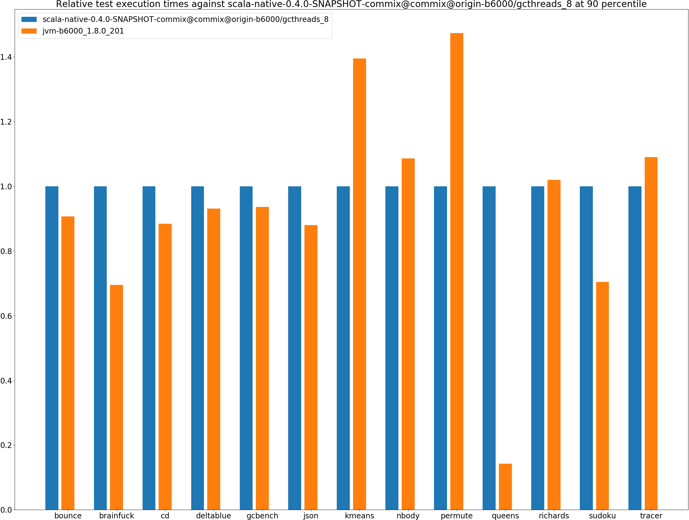
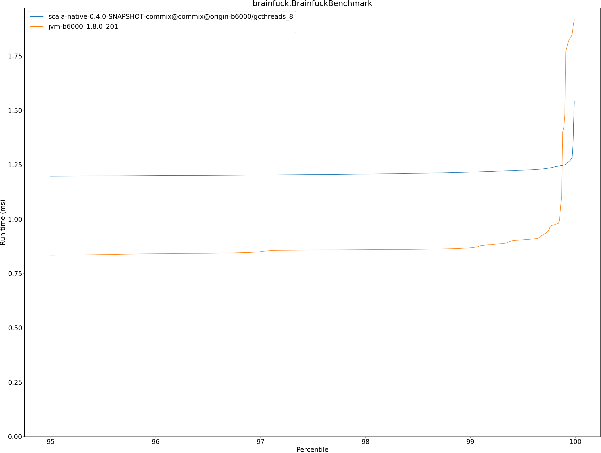
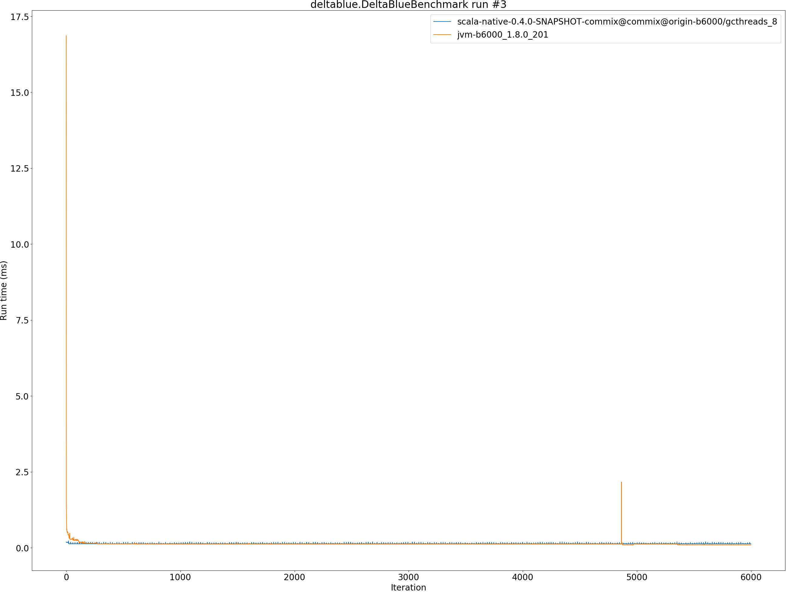
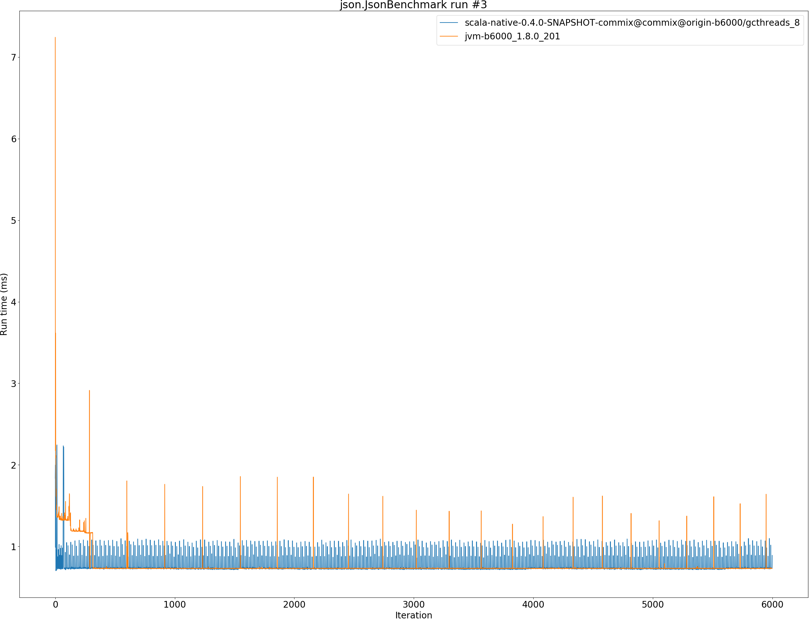
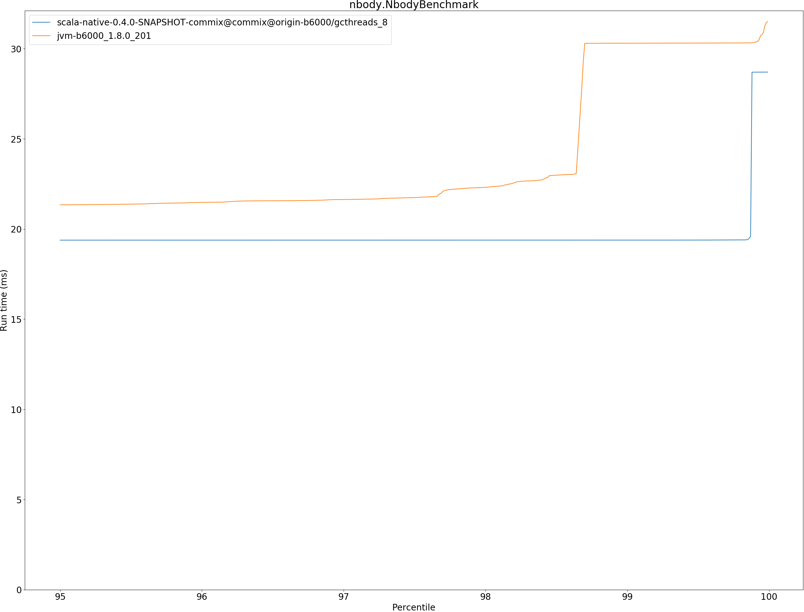
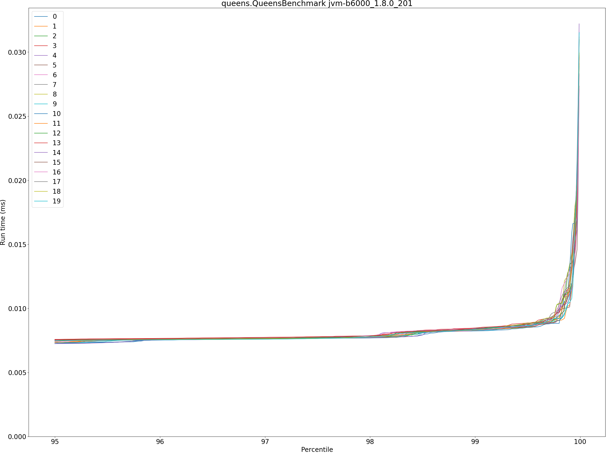

# Summary
## Benchmark run time (ms) at 50 percentile 

|name | scala-native-0.4.0-SNAPSHOT-commix@commix@origin-b6000/gcthreads_8 | jvm-b6000_1.8.0_201 | |
| -- | -- | -- | -- |
|[bounce.BounceBenchmark](#bouncebouncebenchmark)|0.0149|0.0132|__-11.75%__|
|[brainfuck.BrainfuckBenchmark](#brainfuckbrainfuckbenchmark)|1.1471|0.8021|__-30.07%__|
|[cd.CDBenchmark](#cdcdbenchmark)|15.8242|14.2692|__-9.83%__|
|[deltablue.DeltaBlueBenchmark](#deltabluedeltabluebenchmark)|0.1310|0.1216|__-7.15%__|
|[gcbench.GCBenchBenchmark](#gcbenchgcbenchbenchmark)|64.2293|59.7692|__-6.94%__|
|[json.JsonBenchmark](#jsonjsonbenchmark)|0.7282|0.7260|__-0.31%__|
|[kmeans.KmeansBenchmark](#kmeanskmeansbenchmark)|20.7007|28.3462|+36.93%|
|[nbody.NbodyBenchmark](#nbodynbodybenchmark)|19.3796|20.9793|+8.25%|
|[permute.PermuteBenchmark](#permutepermutebenchmark)|0.1212|0.1581|+30.43%|
|[queens.QueensBenchmark](#queensqueensbenchmark)|0.0495|0.0041|__-91.80%__|
|[richards.RichardsBenchmark](#richardsrichardsbenchmark)|0.0500|0.0507|+1.47%|
|[sudoku.SudokuBenchmark](#sudokusudokubenchmark)|1.3164|0.9903|__-24.77%__|
|[tracer.TracerBenchmark](#tracertracerbenchmark)|0.4380|0.4791|+9.39%|
| __Geometrical mean:__|| |__-19.11%__|
## Benchmark run time (ms) at 90 percentile 

|name | scala-native-0.4.0-SNAPSHOT-commix@commix@origin-b6000/gcthreads_8 | jvm-b6000_1.8.0_201 | |
| -- | -- | -- | -- |
|[bounce.BounceBenchmark](#bouncebouncebenchmark)|0.0151|0.0137|__-9.25%__|
|[brainfuck.BrainfuckBenchmark](#brainfuckbrainfuckbenchmark)|1.1888|0.8267|__-30.45%__|
|[cd.CDBenchmark](#cdcdbenchmark)|16.9278|14.9705|__-11.56%__|
|[deltablue.DeltaBlueBenchmark](#deltabluedeltabluebenchmark)|0.1327|0.1236|__-6.85%__|
|[gcbench.GCBenchBenchmark](#gcbenchgcbenchbenchmark)|65.7434|61.5716|__-6.35%__|
|[json.JsonBenchmark](#jsonjsonbenchmark)|0.8295|0.7304|__-11.94%__|
|[kmeans.KmeansBenchmark](#kmeanskmeansbenchmark)|21.3935|29.8432|+39.50%|
|[nbody.NbodyBenchmark](#nbodynbodybenchmark)|19.3810|21.0569|+8.65%|
|[permute.PermuteBenchmark](#permutepermutebenchmark)|0.1374|0.2025|+47.38%|
|[queens.QueensBenchmark](#queensqueensbenchmark)|0.0497|0.0071|__-85.73%__|
|[richards.RichardsBenchmark](#richardsrichardsbenchmark)|0.0512|0.0522|+2.01%|
|[sudoku.SudokuBenchmark](#sudokusudokubenchmark)|1.4216|1.0019|__-29.52%__|
|[tracer.TracerBenchmark](#tracertracerbenchmark)|0.4424|0.4824|+9.04%|
| __Geometrical mean:__|| |__-15.79%__|
## Benchmark run time (ms) at 99 percentile 

|name | scala-native-0.4.0-SNAPSHOT-commix@commix@origin-b6000/gcthreads_8 | jvm-b6000_1.8.0_201 | |
| -- | -- | -- | -- |
|[bounce.BounceBenchmark](#bouncebouncebenchmark)|0.0154|0.0165|+7.25%|
|[brainfuck.BrainfuckBenchmark](#brainfuckbrainfuckbenchmark)|1.2165|0.8633|__-29.04%__|
|[cd.CDBenchmark](#cdcdbenchmark)|18.2101|15.2310|__-16.36%__|
|[deltablue.DeltaBlueBenchmark](#deltabluedeltabluebenchmark)|0.1786|0.1268|__-29.01%__|
|[gcbench.GCBenchBenchmark](#gcbenchgcbenchbenchmark)|67.1069|63.1582|__-5.88%__|
|[json.JsonBenchmark](#jsonjsonbenchmark)|1.0683|0.7347|__-31.23%__|
|[kmeans.KmeansBenchmark](#kmeanskmeansbenchmark)|21.8857|30.9287|+41.32%|
|[nbody.NbodyBenchmark](#nbodynbodybenchmark)|19.3830|22.2446|+14.76%|
|[permute.PermuteBenchmark](#permutepermutebenchmark)|0.1403|0.2051|+46.17%|
|[queens.QueensBenchmark](#queensqueensbenchmark)|0.0522|0.0083|__-84.07%__|
|[richards.RichardsBenchmark](#richardsrichardsbenchmark)|0.0533|0.0556|+4.43%|
|[sudoku.SudokuBenchmark](#sudokusudokubenchmark)|1.4523|1.0131|__-30.24%__|
|[tracer.TracerBenchmark](#tracertracerbenchmark)|0.4462|0.4879|+9.35%|
| __Geometrical mean:__|| |__-17.05%__|
## Benchmark run time (ms) at 99.9 percentile 

|name | scala-native-0.4.0-SNAPSHOT-commix@commix@origin-b6000/gcthreads_8 | jvm-b6000_1.8.0_201 | |
| -- | -- | -- | -- |
|[bounce.BounceBenchmark](#bouncebouncebenchmark)|0.0188|0.0216|+15.12%|
|[brainfuck.BrainfuckBenchmark](#brainfuckbrainfuckbenchmark)|1.2530|1.1111|__-11.32%__|
|[cd.CDBenchmark](#cdcdbenchmark)|18.9131|15.7972|__-16.47%__|
|[deltablue.DeltaBlueBenchmark](#deltabluedeltabluebenchmark)|0.1861|0.1320|__-29.08%__|
|[gcbench.GCBenchBenchmark](#gcbenchgcbenchbenchmark)|73.0382|107.7801|+47.57%|
|[json.JsonBenchmark](#jsonjsonbenchmark)|1.0878|1.6195|+48.87%|
|[kmeans.KmeansBenchmark](#kmeanskmeansbenchmark)|22.1830|32.0515|+44.49%|
|[nbody.NbodyBenchmark](#nbodynbodybenchmark)|19.3919|30.3087|+56.30%|
|[permute.PermuteBenchmark](#permutepermutebenchmark)|0.1425|0.2461|+72.68%|
|[queens.QueensBenchmark](#queensqueensbenchmark)|0.0649|0.0119|__-81.61%__|
|[richards.RichardsBenchmark](#richardsrichardsbenchmark)|0.0582|0.0634|+8.87%|
|[sudoku.SudokuBenchmark](#sudokusudokubenchmark)|1.4648|1.9302|+31.77%|
|[tracer.TracerBenchmark](#tracertracerbenchmark)|0.4498|1.3266|+194.90%|
| __Geometrical mean:__|| |+11.32%|
## Benchmark total run time (ms) 

|name | scala-native-0.4.0-SNAPSHOT-commix@commix@origin-b6000/gcthreads_8 | jvm-b6000_1.8.0_201 | |
| -- | -- | -- | -- |
|[bounce.BounceBenchmark](#bouncebouncebenchmark)|954.4787|852.9871|__-10.63%__|
|[brainfuck.BrainfuckBenchmark](#brainfuckbrainfuckbenchmark)|74120.8534|51731.6710|__-30.21%__|
|[cd.CDBenchmark](#cdcdbenchmark)|1031266.5298|922135.6677|__-10.58%__|
|[deltablue.DeltaBlueBenchmark](#deltabluedeltabluebenchmark)|8515.9503|7465.4507|__-12.34%__|
|[gcbench.GCBenchBenchmark](#gcbenchgcbenchbenchmark)|4134634.9481|3858902.4774|__-6.67%__|
|[json.JsonBenchmark](#jsonjsonbenchmark)|48150.8418|46686.5404|__-3.04%__|
|[kmeans.KmeansBenchmark](#kmeanskmeansbenchmark)|1330152.5488|1831782.8179|+37.71%|
|[nbody.NbodyBenchmark](#nbodynbodybenchmark)|1236918.6403|1351249.0025|+9.24%|
|[permute.PermuteBenchmark](#permutepermutebenchmark)|7907.0134|10893.4558|+37.77%|
|[queens.QueensBenchmark](#queensqueensbenchmark)|3170.6857|311.1301|__-90.19%__|
|[richards.RichardsBenchmark](#richardsrichardsbenchmark)|3216.4151|3270.9363|+1.70%|
|[sudoku.SudokuBenchmark](#sudokusudokubenchmark)|85265.0250|63650.5867|__-25.35%__|
|[tracer.TracerBenchmark](#tracertracerbenchmark)|27719.5816|30872.6870|+11.38%|
| __Geometrical mean:__|| |__-17.98%__|
# Individual benchmarks
## bounce.BounceBenchmark

## brainfuck.BrainfuckBenchmark

## cd.CDBenchmark

## deltablue.DeltaBlueBenchmark

## gcbench.GCBenchBenchmark

## json.JsonBenchmark

## kmeans.KmeansBenchmark

## nbody.NbodyBenchmark

## permute.PermuteBenchmark

## queens.QueensBenchmark

## richards.RichardsBenchmark

## sudoku.SudokuBenchmark

## tracer.TracerBenchmark

