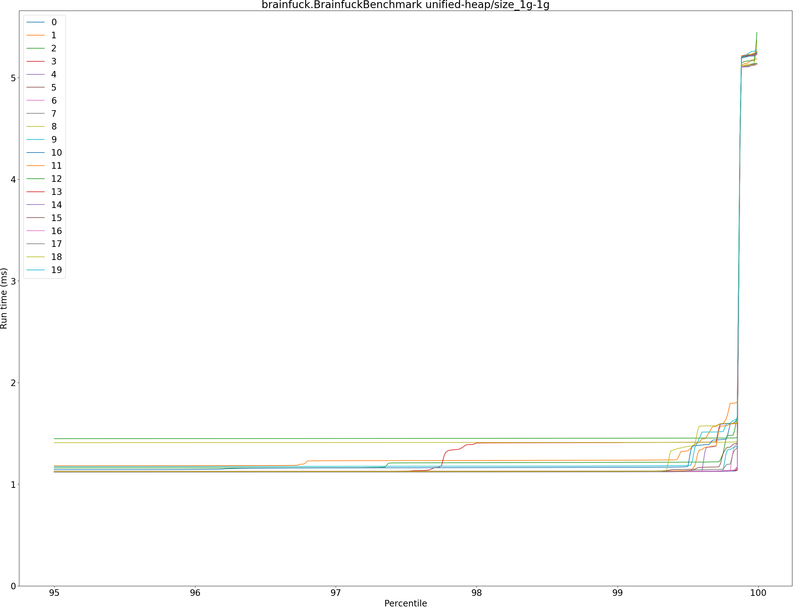
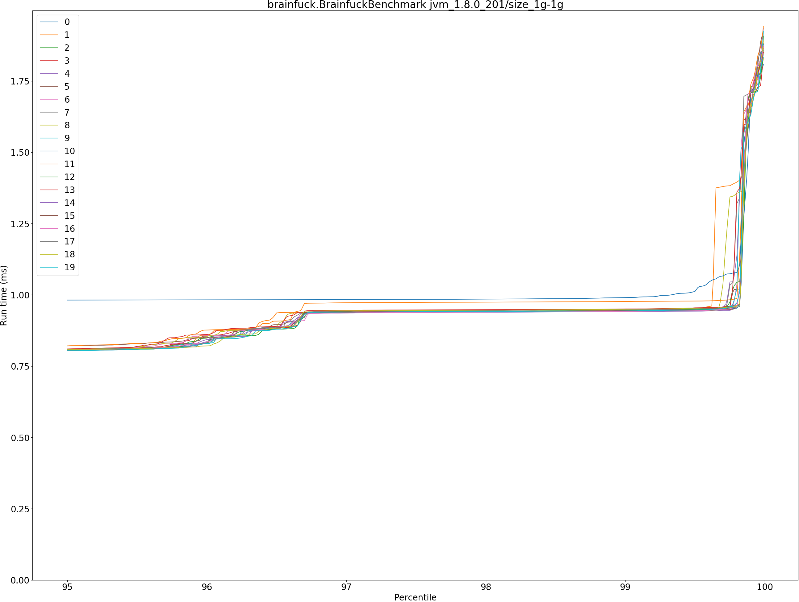
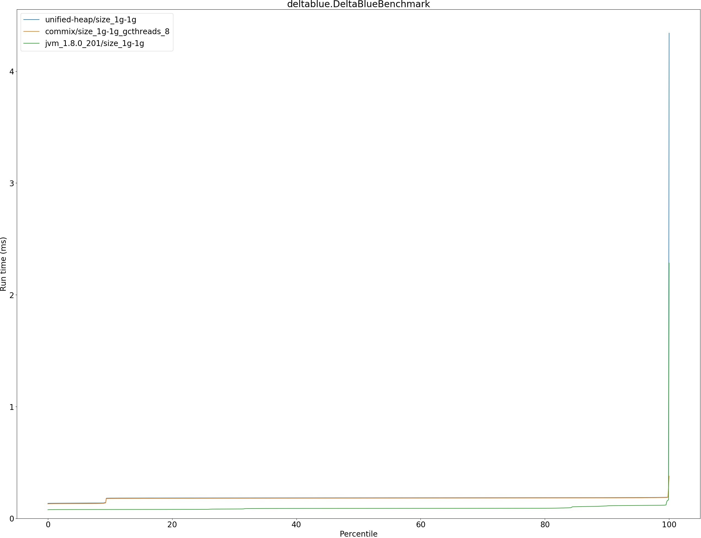
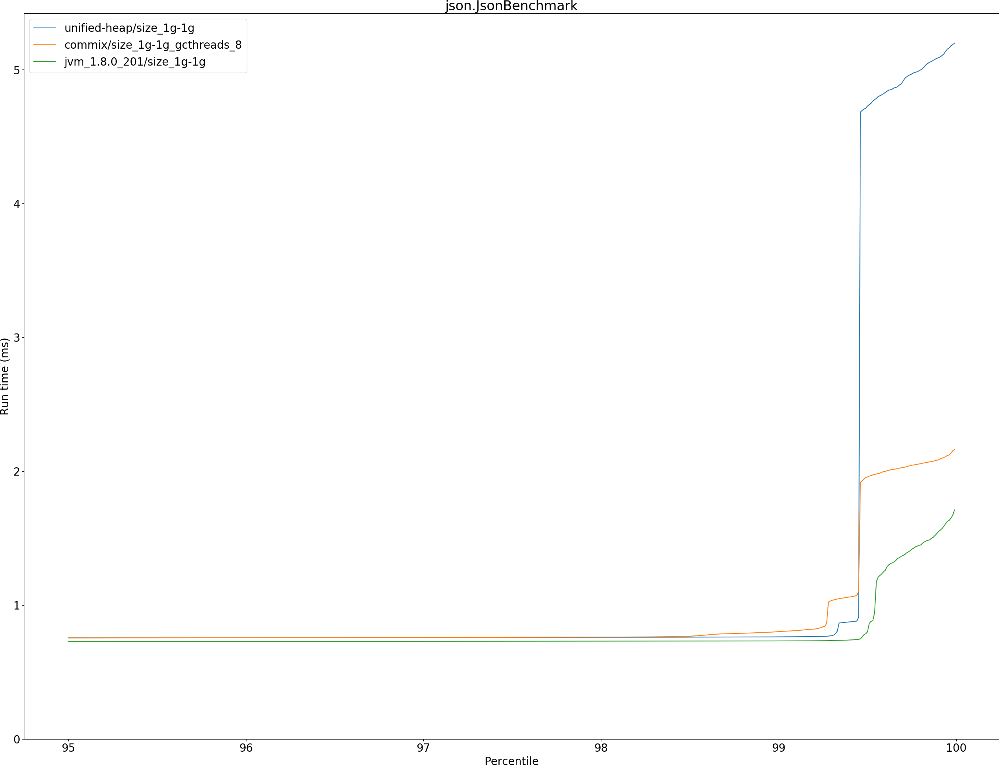
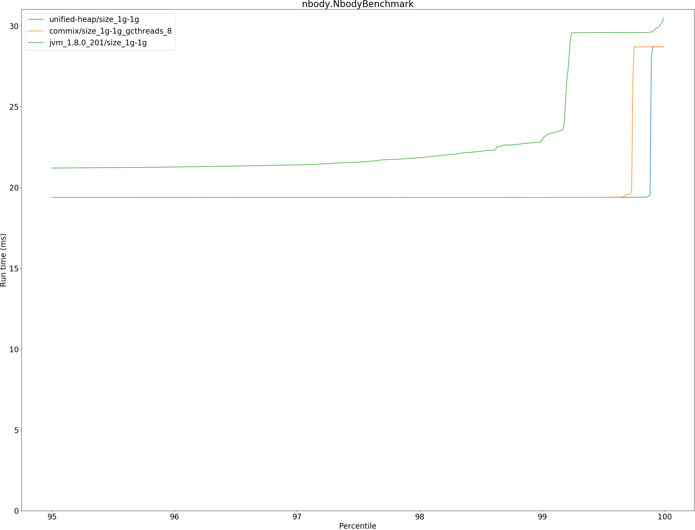
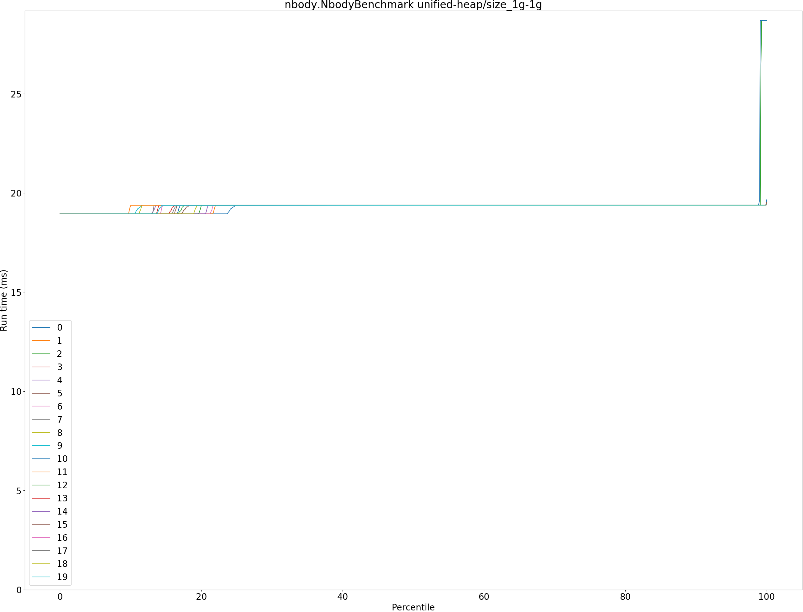
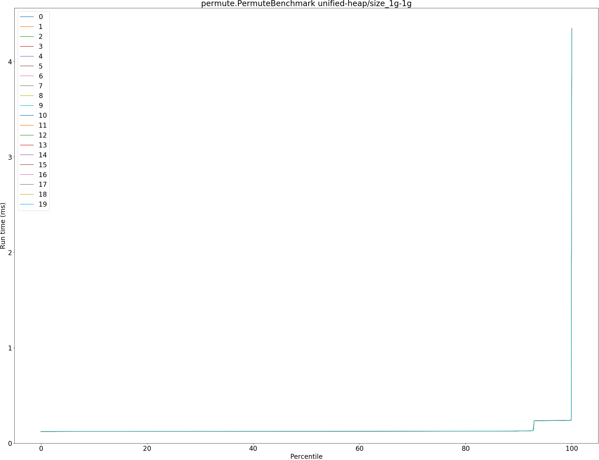
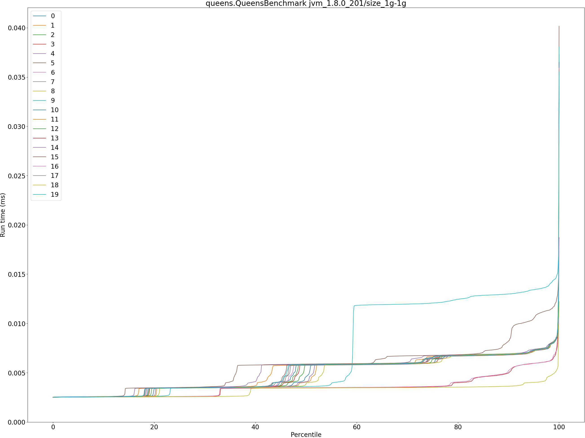
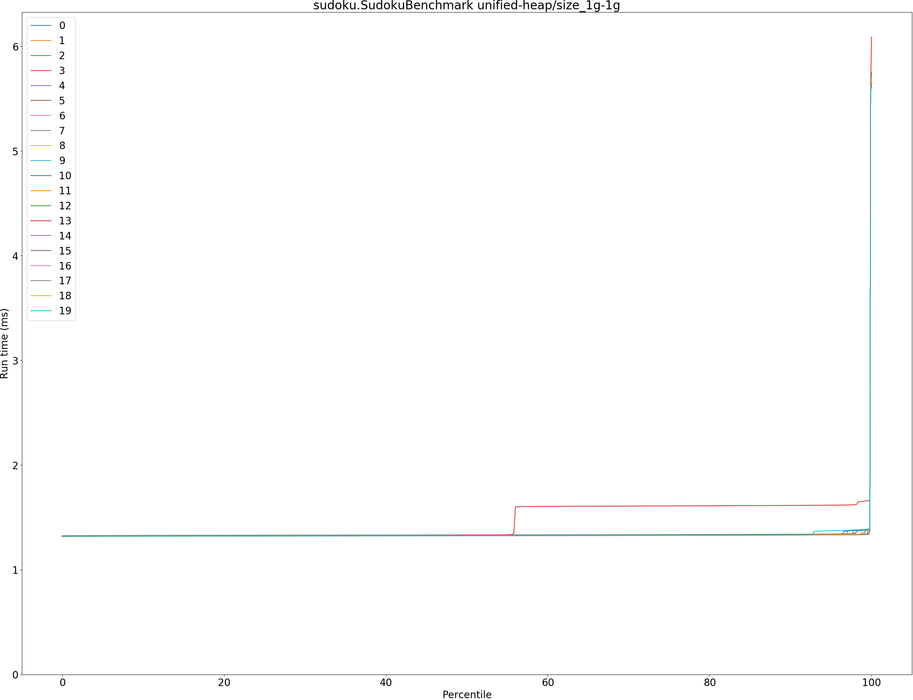

# Summary
## Benchmark run time (ms) at 50 percentile 

|name | unified-heap/size_1g-1g | commix/size_1g-1g_gcthreads_8 |  | jvm_1.8.0_201/size_1g-1g | |
| -- | -- | -- | -- | -- | -- |
|[bounce.BounceBenchmark](#bouncebouncebenchmark)|0.0159|0.0159|+0.08%|0.0112|__-29.86%__|
|[brainfuck.BrainfuckBenchmark](#brainfuckbrainfuckbenchmark)|1.1161|1.1419|+2.31%|0.7760|__-30.48%__|
|[cd.CDBenchmark](#cdcdbenchmark)|15.6587|16.6514|+6.34%|14.0720|__-10.13%__|
|[deltablue.DeltaBlueBenchmark](#deltabluedeltabluebenchmark)|0.1836|0.1806|__-1.64%__|0.0892|__-51.43%__|
|[gcbench.GCBenchBenchmark](#gcbenchgcbenchbenchmark)|63.3289|67.3877|+6.41%|61.2835|__-3.23%__|
|[json.JsonBenchmark](#jsonjsonbenchmark)|0.7429|0.7398|__-0.41%__|0.7225|__-2.75%__|
|[kmeans.KmeansBenchmark](#kmeanskmeansbenchmark)|20.7529|20.6279|__-0.60%__|28.1389|+35.59%|
|[nbody.NbodyBenchmark](#nbodynbodybenchmark)|19.3796|19.3796|+0.00%|20.9474|+8.09%|
|[permute.PermuteBenchmark](#permutepermutebenchmark)|0.1244|0.1231|__-1.05%__|0.1567|+25.92%|
|[queens.QueensBenchmark](#queensqueensbenchmark)|0.0533|0.0527|__-1.22%__|0.0036|__-93.23%__|
|[richards.RichardsBenchmark](#richardsrichardsbenchmark)|0.0503|0.0500|__-0.70%__|0.0427|__-15.19%__|
|[sudoku.SudokuBenchmark](#sudokusudokubenchmark)|1.3267|1.3191|__-0.57%__|0.9502|__-28.38%__|
|[tracer.TracerBenchmark](#tracertracerbenchmark)|0.4440|0.4393|__-1.05%__|0.4749|+6.95%|
| __Geometrical mean:__|| |+0.57%| |__-27.16%__|
## Benchmark run time (ms) at 90 percentile 

|name | unified-heap/size_1g-1g | commix/size_1g-1g_gcthreads_8 |  | jvm_1.8.0_201/size_1g-1g | |
| -- | -- | -- | -- | -- | -- |
|[bounce.BounceBenchmark](#bouncebouncebenchmark)|0.0169|0.0169|+0.23%|0.0118|__-29.87%__|
|[brainfuck.BrainfuckBenchmark](#brainfuckbrainfuckbenchmark)|1.1234|1.1490|+2.28%|0.8011|__-28.69%__|
|[cd.CDBenchmark](#cdcdbenchmark)|18.9603|18.2174|__-3.92%__|14.5451|__-23.29%__|
|[deltablue.DeltaBlueBenchmark](#deltabluedeltabluebenchmark)|0.1856|0.1828|__-1.46%__|0.1102|__-40.59%__|
|[gcbench.GCBenchBenchmark](#gcbenchgcbenchbenchmark)|66.7720|68.4594|+2.53%|63.5247|__-4.86%__|
|[json.JsonBenchmark](#jsonjsonbenchmark)|0.7529|0.7515|__-0.19%__|0.7272|__-3.41%__|
|[kmeans.KmeansBenchmark](#kmeanskmeansbenchmark)|21.0701|20.9613|__-0.52%__|28.6573|+36.01%|
|[nbody.NbodyBenchmark](#nbodynbodybenchmark)|19.3810|19.3810|+0.00%|21.0218|+8.47%|
|[permute.PermuteBenchmark](#permutepermutebenchmark)|0.1277|0.1267|__-0.86%__|0.1584|+24.01%|
|[queens.QueensBenchmark](#queensqueensbenchmark)|0.0549|0.0543|__-1.16%__|0.0068|__-87.55%__|
|[richards.RichardsBenchmark](#richardsrichardsbenchmark)|0.0519|0.0518|__-0.23%__|0.0446|__-14.13%__|
|[sudoku.SudokuBenchmark](#sudokusudokubenchmark)|1.3330|1.3270|__-0.45%__|0.9609|__-27.92%__|
|[tracer.TracerBenchmark](#tracertracerbenchmark)|0.4481|0.4434|__-1.06%__|0.4780|+6.68%|
| __Geometrical mean:__|| |__-0.38%__| |__-23.35%__|
## Benchmark run time (ms) at 99 percentile 

|name | unified-heap/size_1g-1g | commix/size_1g-1g_gcthreads_8 |  | jvm_1.8.0_201/size_1g-1g | |
| -- | -- | -- | -- | -- | -- |
|[bounce.BounceBenchmark](#bouncebouncebenchmark)|0.0183|0.0183|__-0.04%__|0.0185|+0.72%|
|[brainfuck.BrainfuckBenchmark](#brainfuckbrainfuckbenchmark)|1.1714|1.1585|__-1.10%__|0.9444|__-19.38%__|
|[cd.CDBenchmark](#cdcdbenchmark)|20.6242|18.8964|__-8.38%__|14.9322|__-27.60%__|
|[deltablue.DeltaBlueBenchmark](#deltabluedeltabluebenchmark)|0.1880|0.1856|__-1.31%__|0.1171|__-37.72%__|
|[gcbench.GCBenchBenchmark](#gcbenchgcbenchbenchmark)|68.7731|74.4268|+8.22%|63.9180|__-7.06%__|
|[json.JsonBenchmark](#jsonjsonbenchmark)|0.7629|0.8024|+5.17%|0.7329|__-3.94%__|
|[kmeans.KmeansBenchmark](#kmeanskmeansbenchmark)|23.8451|21.4967|__-9.85%__|30.4239|+27.59%|
|[nbody.NbodyBenchmark](#nbodynbodybenchmark)|19.3834|19.3832|__-0.00%__|22.1845|+14.45%|
|[permute.PermuteBenchmark](#permutepermutebenchmark)|0.2391|0.2382|__-0.38%__|0.1649|__-31.04%__|
|[queens.QueensBenchmark](#queensqueensbenchmark)|0.0568|0.0561|__-1.34%__|0.0081|__-85.81%__|
|[richards.RichardsBenchmark](#richardsrichardsbenchmark)|0.0536|0.0541|+0.95%|0.0483|__-10.02%__|
|[sudoku.SudokuBenchmark](#sudokusudokubenchmark)|1.3703|1.3335|__-2.69%__|0.9743|__-28.90%__|
|[tracer.TracerBenchmark](#tracertracerbenchmark)|0.4527|0.4489|__-0.84%__|0.4841|+6.94%|
| __Geometrical mean:__|| |__-0.99%__| |__-23.27%__|
## Benchmark run time (ms) at 99.9 percentile 

|name | unified-heap/size_1g-1g | commix/size_1g-1g_gcthreads_8 |  | jvm_1.8.0_201/size_1g-1g | |
| -- | -- | -- | -- | -- | -- |
|[bounce.BounceBenchmark](#bouncebouncebenchmark)|0.0192|0.0192|+0.02%|0.0213|+10.95%|
|[brainfuck.BrainfuckBenchmark](#brainfuckbrainfuckbenchmark)|5.1293|2.1834|__-57.43%__|1.7089|__-66.68%__|
|[cd.CDBenchmark](#cdcdbenchmark)|22.9745|19.7902|__-13.86%__|15.0746|__-34.39%__|
|[deltablue.DeltaBlueBenchmark](#deltabluedeltabluebenchmark)|0.1905|0.2604|+36.74%|0.1215|__-36.19%__|
|[gcbench.GCBenchBenchmark](#gcbenchgcbenchbenchmark)|76.0024|77.1325|+1.49%|73.4829|__-3.31%__|
|[json.JsonBenchmark](#jsonjsonbenchmark)|5.0822|2.0756|__-59.16%__|1.5341|__-69.81%__|
|[kmeans.KmeansBenchmark](#kmeanskmeansbenchmark)|24.5971|22.3279|__-9.23%__|37.3743|+51.95%|
|[nbody.NbodyBenchmark](#nbodynbodybenchmark)|19.3918|19.3946|+0.01%|29.5793|+52.54%|
|[permute.PermuteBenchmark](#permutepermutebenchmark)|0.2420|0.4505|+86.17%|0.2595|+7.23%|
|[queens.QueensBenchmark](#queensqueensbenchmark)|0.0579|0.0572|__-1.29%__|0.0118|__-79.56%__|
|[richards.RichardsBenchmark](#richardsrichardsbenchmark)|0.0583|0.0584|+0.22%|0.0548|__-5.90%__|
|[sudoku.SudokuBenchmark](#sudokusudokubenchmark)|5.5932|1.8956|__-66.11%__|1.8809|__-66.37%__|
|[tracer.TracerBenchmark](#tracertracerbenchmark)|4.5435|1.1356|__-75.01%__|1.2830|__-71.76%__|
| __Geometrical mean:__|| |__-23.75%__| |__-37.88%__|
## Benchmark total run time (ms) 

|name | unified-heap/size_1g-1g | commix/size_1g-1g_gcthreads_8 |  | jvm_1.8.0_201/size_1g-1g | |
| -- | -- | -- | -- | -- | -- |
|[bounce.BounceBenchmark](#bouncebouncebenchmark)|1030.3802|1031.4516|+0.10%|727.1723|__-29.43%__|
|[brainfuck.BrainfuckBenchmark](#brainfuckbrainfuckbenchmark)|72362.9642|73255.7051|+1.23%|50515.5473|__-30.19%__|
|[cd.CDBenchmark](#cdcdbenchmark)|1050161.1278|1073770.3170|+2.25%|903887.1630|__-13.93%__|
|[deltablue.DeltaBlueBenchmark](#deltabluedeltabluebenchmark)|11549.4358|11300.1539|__-2.16%__|5833.1442|__-49.49%__|
|[gcbench.GCBenchBenchmark](#gcbenchgcbenchbenchmark)|4124847.3193|4258248.0513|+3.23%|3957623.2599|__-4.05%__|
|[json.JsonBenchmark](#jsonjsonbenchmark)|48992.4315|47870.7851|__-2.29%__|46464.3535|__-5.16%__|
|[kmeans.KmeansBenchmark](#kmeanskmeansbenchmark)|1329898.2639|1322662.0321|__-0.54%__|1807956.1217|+35.95%|
|[nbody.NbodyBenchmark](#nbodynbodybenchmark)|1236116.0713|1236965.0902|+0.07%|1344188.2209|+8.74%|
|[permute.PermuteBenchmark](#permutepermutebenchmark)|8620.2166|8444.8999|__-2.03%__|10128.6339|+17.50%|
|[queens.QueensBenchmark](#queensqueensbenchmark)|3427.7611|3385.7745|__-1.22%__|305.9387|__-91.07%__|
|[richards.RichardsBenchmark](#richardsrichardsbenchmark)|3253.4229|3236.3764|__-0.52%__|2771.1347|__-14.82%__|
|[sudoku.SudokuBenchmark](#sudokusudokubenchmark)|85378.2231|84508.9377|__-1.02%__|61127.1359|__-28.40%__|
|[tracer.TracerBenchmark](#tracertracerbenchmark)|28965.1446|28270.1183|__-2.40%__|30621.5050|+5.72%|
| __Geometrical mean:__|| |__-0.42%__| |__-26.14%__|
# Individual benchmarks
## bounce.BounceBenchmark

## brainfuck.BrainfuckBenchmark

## cd.CDBenchmark

## deltablue.DeltaBlueBenchmark

## gcbench.GCBenchBenchmark

## json.JsonBenchmark

## kmeans.KmeansBenchmark

## nbody.NbodyBenchmark

## permute.PermuteBenchmark

## queens.QueensBenchmark

## richards.RichardsBenchmark

## sudoku.SudokuBenchmark

## tracer.TracerBenchmark

