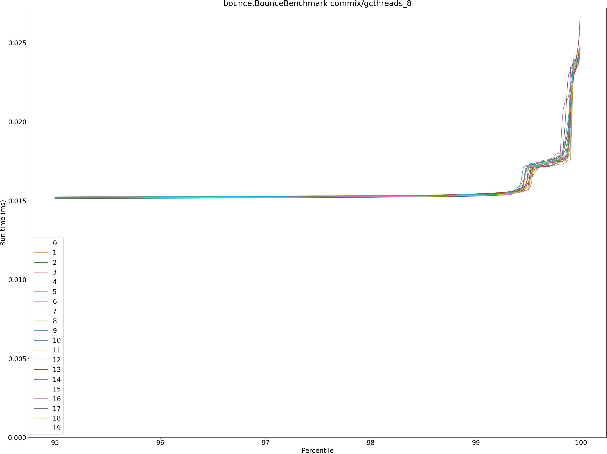
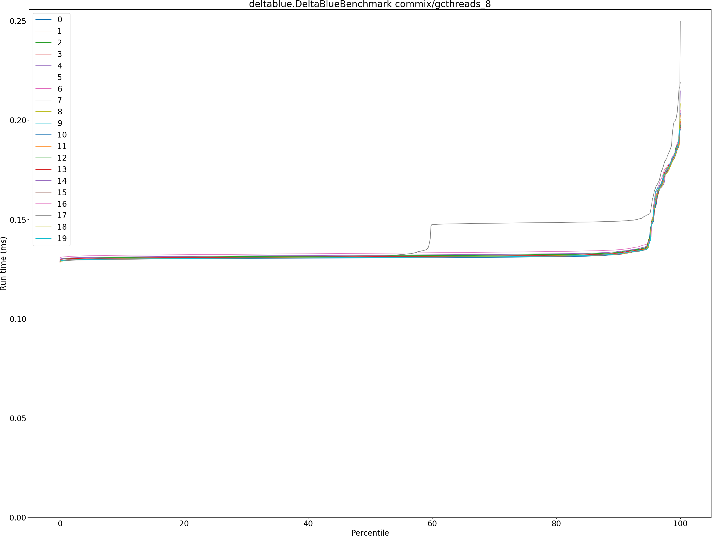
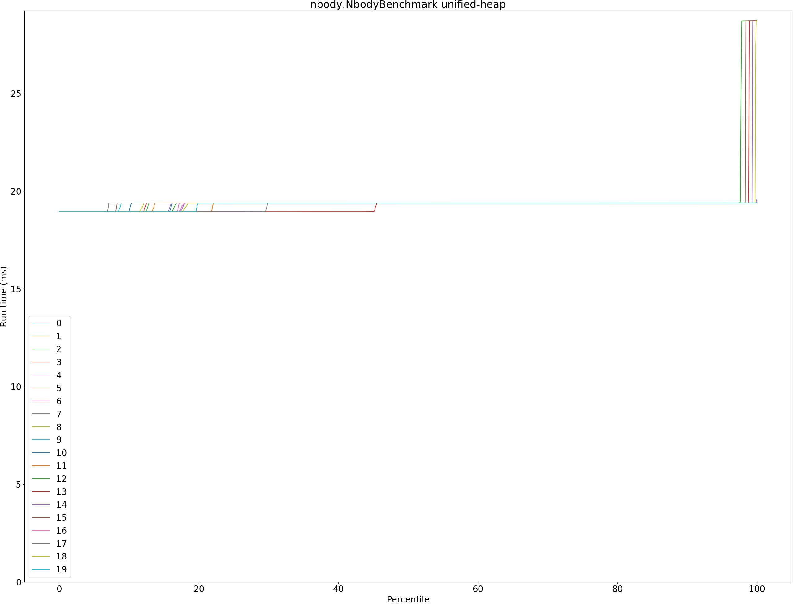
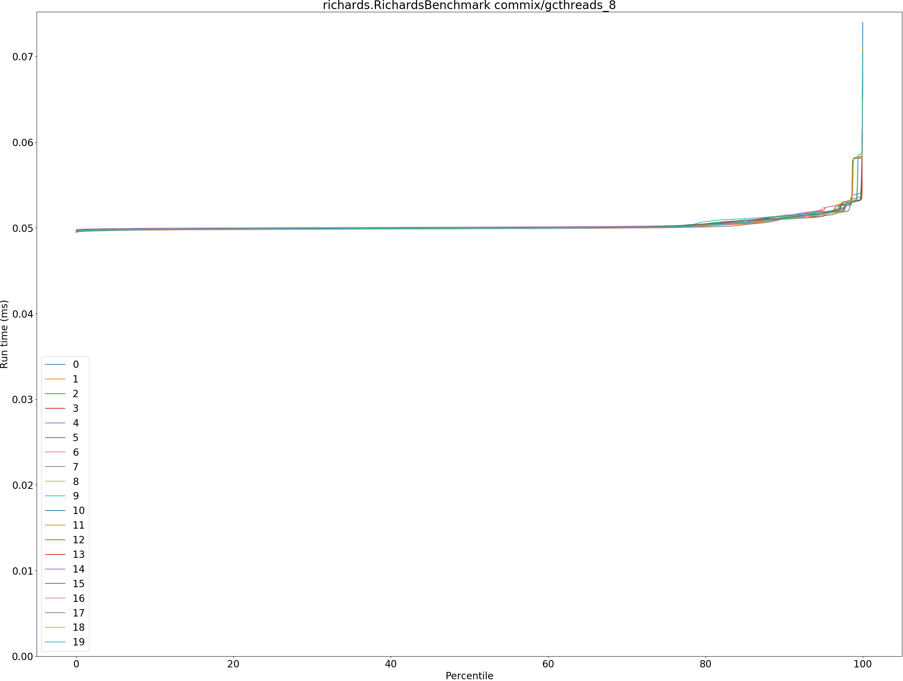

# Summary
## Benchmark run time (ms) at 50 percentile 

|name | immix | unified-heap |  | commix/gcthreads_8 | |
| -- | -- | -- | -- | -- | -- |
|[bounce.BounceBenchmark](#bouncebouncebenchmark)|0.0157|0.0149|__-5.27%__|0.0149|__-5.00%__|
|[brainfuck.BrainfuckBenchmark](#brainfuckbrainfuckbenchmark)|1.1717|1.1183|__-4.56%__|1.1374|__-2.93%__|
|[cd.CDBenchmark](#cdcdbenchmark)|19.9688|15.8236|__-20.76%__|15.8760|__-20.50%__|
|[deltablue.DeltaBlueBenchmark](#deltabluedeltabluebenchmark)|0.1350|0.1350|__-0.01%__|0.1310|__-3.01%__|
|[gcbench.GCBenchBenchmark](#gcbenchgcbenchbenchmark)|79.0728|65.8294|__-16.75%__|63.9051|__-19.18%__|
|[json.JsonBenchmark](#jsonjsonbenchmark)|0.9950|0.7205|__-27.59%__|0.7289|__-26.74%__|
|[kmeans.KmeansBenchmark](#kmeanskmeansbenchmark)|26.5162|20.6929|__-21.96%__|20.6343|__-22.18%__|
|[nbody.NbodyBenchmark](#nbodynbodybenchmark)|19.3827|19.3795|__-0.02%__|19.3796|__-0.02%__|
|[permute.PermuteBenchmark](#permutepermutebenchmark)|0.1403|0.1227|__-12.55%__|0.1209|__-13.82%__|
|[queens.QueensBenchmark](#queensqueensbenchmark)|0.0526|0.0502|__-4.56%__|0.0494|__-6.02%__|
|[richards.RichardsBenchmark](#richardsrichardsbenchmark)|0.0500|0.0502|+0.32%|0.0499|__-0.24%__|
|[sudoku.SudokuBenchmark](#sudokusudokubenchmark)|1.3678|1.3239|__-3.21%__|1.3164|__-3.76%__|
|[tracer.TracerBenchmark](#tracertracerbenchmark)|0.5145|0.4436|__-13.78%__|0.4381|__-14.83%__|
| __Geometrical mean:__|| |__-10.53%__| |__-11.09%__|
## Benchmark run time (ms) at 90 percentile 

|name | immix | unified-heap |  | commix/gcthreads_8 | |
| -- | -- | -- | -- | -- | -- |
|[bounce.BounceBenchmark](#bouncebouncebenchmark)|0.0159|0.0151|__-5.22%__|0.0151|__-4.87%__|
|[brainfuck.BrainfuckBenchmark](#brainfuckbrainfuckbenchmark)|1.2221|1.1713|__-4.15%__|1.1857|__-2.98%__|
|[cd.CDBenchmark](#cdcdbenchmark)|20.1840|15.9634|__-20.91%__|17.0682|__-15.44%__|
|[deltablue.DeltaBlueBenchmark](#deltabluedeltabluebenchmark)|0.1370|0.1364|__-0.44%__|0.1328|__-3.11%__|
|[gcbench.GCBenchBenchmark](#gcbenchgcbenchbenchmark)|79.4458|66.1105|__-16.79%__|64.3068|__-19.06%__|
|[json.JsonBenchmark](#jsonjsonbenchmark)|1.4549|0.9815|__-32.53%__|0.8357|__-42.56%__|
|[kmeans.KmeansBenchmark](#kmeanskmeansbenchmark)|30.5246|21.1009|__-30.87%__|21.3724|__-29.98%__|
|[nbody.NbodyBenchmark](#nbodynbodybenchmark)|19.3942|19.3810|__-0.07%__|19.3811|__-0.07%__|
|[permute.PermuteBenchmark](#permutepermutebenchmark)|0.1523|0.1382|__-9.23%__|0.1406|__-7.66%__|
|[queens.QueensBenchmark](#queensqueensbenchmark)|0.0529|0.0504|__-4.76%__|0.0496|__-6.22%__|
|[richards.RichardsBenchmark](#richardsrichardsbenchmark)|0.0510|0.0514|+0.89%|0.0511|+0.20%|
|[sudoku.SudokuBenchmark](#sudokusudokubenchmark)|1.6365|1.4043|__-14.19%__|1.3737|__-16.06%__|
|[tracer.TracerBenchmark](#tracertracerbenchmark)|0.5183|0.4487|__-13.42%__|0.4432|__-14.49%__|
| __Geometrical mean:__|| |__-12.37%__| |__-13.44%__|
## Benchmark run time (ms) at 99 percentile 

|name | immix | unified-heap |  | commix/gcthreads_8 | |
| -- | -- | -- | -- | -- | -- |
|[bounce.BounceBenchmark](#bouncebouncebenchmark)|0.0161|0.0153|__-5.36%__|0.0154|__-4.86%__|
|[brainfuck.BrainfuckBenchmark](#brainfuckbrainfuckbenchmark)|1.2503|1.4532|+16.23%|1.2004|__-3.99%__|
|[cd.CDBenchmark](#cdcdbenchmark)|23.1012|17.5606|__-23.98%__|19.4855|__-15.65%__|
|[deltablue.DeltaBlueBenchmark](#deltabluedeltabluebenchmark)|0.1758|0.1877|+6.75%|0.1814|+3.18%|
|[gcbench.GCBenchBenchmark](#gcbenchgcbenchbenchmark)|81.8920|66.3388|__-18.99%__|64.6672|__-21.03%__|
|[json.JsonBenchmark](#jsonjsonbenchmark)|1.4758|1.0264|__-30.45%__|1.0748|__-27.17%__|
|[kmeans.KmeansBenchmark](#kmeanskmeansbenchmark)|33.1263|28.6632|__-13.47%__|28.9307|__-12.67%__|
|[nbody.NbodyBenchmark](#nbodynbodybenchmark)|19.4888|19.3838|__-0.54%__|19.3981|__-0.47%__|
|[permute.PermuteBenchmark](#permutepermutebenchmark)|0.1542|0.1411|__-8.49%__|0.1462|__-5.21%__|
|[queens.QueensBenchmark](#queensqueensbenchmark)|0.0549|0.0528|__-3.81%__|0.0520|__-5.36%__|
|[richards.RichardsBenchmark](#richardsrichardsbenchmark)|0.0531|0.0532|+0.18%|0.0532|+0.14%|
|[sudoku.SudokuBenchmark](#sudokusudokubenchmark)|1.6567|1.5132|__-8.66%__|1.4522|__-12.34%__|
|[tracer.TracerBenchmark](#tracertracerbenchmark)|0.5220|0.4520|__-13.40%__|0.4473|__-14.31%__|
| __Geometrical mean:__|| |__-8.80%__| |__-9.63%__|
## Benchmark run time (ms) at 99.9 percentile 

|name | immix | unified-heap |  | commix/gcthreads_8 | |
| -- | -- | -- | -- | -- | -- |
|[bounce.BounceBenchmark](#bouncebouncebenchmark)|0.0280|0.0313|+11.59%|0.0216|__-22.90%__|
|[brainfuck.BrainfuckBenchmark](#brainfuckbrainfuckbenchmark)|1.2615|1.5095|+19.66%|1.2298|__-2.51%__|
|[cd.CDBenchmark](#cdcdbenchmark)|23.3474|19.2247|__-17.66%__|20.4219|__-12.53%__|
|[deltablue.DeltaBlueBenchmark](#deltabluedeltabluebenchmark)|0.1786|0.2110|+18.16%|0.1938|+8.55%|
|[gcbench.GCBenchBenchmark](#gcbenchgcbenchbenchmark)|82.1228|66.4661|__-19.06%__|65.3895|__-20.38%__|
|[json.JsonBenchmark](#jsonjsonbenchmark)|1.4860|1.0405|__-29.98%__|1.0958|__-26.26%__|
|[kmeans.KmeansBenchmark](#kmeanskmeansbenchmark)|34.5785|29.5264|__-14.61%__|29.8622|__-13.64%__|
|[nbody.NbodyBenchmark](#nbodynbodybenchmark)|21.7882|19.3919|__-11.00%__|28.6998|+31.72%|
|[permute.PermuteBenchmark](#permutepermutebenchmark)|0.1567|0.1434|__-8.51%__|0.1489|__-5.00%__|
|[queens.QueensBenchmark](#queensqueensbenchmark)|0.0651|0.0681|+4.67%|0.0645|__-0.92%__|
|[richards.RichardsBenchmark](#richardsrichardsbenchmark)|0.0582|0.0581|__-0.13%__|0.0582|+0.05%|
|[sudoku.SudokuBenchmark](#sudokusudokubenchmark)|1.6624|1.5192|__-8.62%__|1.4695|__-11.60%__|
|[tracer.TracerBenchmark](#tracertracerbenchmark)|0.5263|0.4554|__-13.47%__|0.5376|+2.14%|
| __Geometrical mean:__|| |__-6.40%__| |__-6.71%__|
## Benchmark total run time (ms) 

|name | immix | unified-heap |  | commix/gcthreads_8 | |
| -- | -- | -- | -- | -- | -- |
|[bounce.BounceBenchmark](#bouncebouncebenchmark)|1006.2989|953.5204|__-5.24%__|955.0592|__-5.09%__|
|[brainfuck.BrainfuckBenchmark](#brainfuckbrainfuckbenchmark)|75875.5660|72881.7403|__-3.95%__|73839.9016|__-2.68%__|
|[cd.CDBenchmark](#cdcdbenchmark)|1289093.6169|1020170.5452|__-20.86%__|1035851.1661|__-19.65%__|
|[deltablue.DeltaBlueBenchmark](#deltabluedeltabluebenchmark)|8770.5012|8790.5432|+0.23%|8514.4554|__-2.92%__|
|[gcbench.GCBenchBenchmark](#gcbenchgcbenchbenchmark)|5068684.4164|4211549.1222|__-16.91%__|4092073.3962|__-19.27%__|
|[json.JsonBenchmark](#jsonjsonbenchmark)|69000.1116|49916.0799|__-27.66%__|48151.0383|__-30.22%__|
|[kmeans.KmeansBenchmark](#kmeanskmeansbenchmark)|1703796.9566|1332991.2691|__-21.76%__|1337941.2408|__-21.47%__|
|[nbody.NbodyBenchmark](#nbodynbodybenchmark)|1236816.3317|1237270.7350|+0.04%|1241224.3497|+0.36%|
|[permute.PermuteBenchmark](#permutepermutebenchmark)|9097.0354|8007.4565|__-11.98%__|7905.2808|__-13.10%__|
|[queens.QueensBenchmark](#queensqueensbenchmark)|3368.1954|3215.8396|__-4.52%__|3166.8294|__-5.98%__|
|[richards.RichardsBenchmark](#richardsrichardsbenchmark)|3218.9071|3229.9988|+0.34%|3213.4308|__-0.17%__|
|[sudoku.SudokuBenchmark](#sudokusudokubenchmark)|89636.3859|85931.2849|__-4.13%__|85211.8988|__-4.94%__|
|[tracer.TracerBenchmark](#tracertracerbenchmark)|32646.6129|28016.7267|__-14.18%__|27789.7567|__-14.88%__|
| __Geometrical mean:__|| |__-10.52%__| |__-11.28%__|
# Individual benchmarks
## bounce.BounceBenchmark

## brainfuck.BrainfuckBenchmark

## cd.CDBenchmark

## deltablue.DeltaBlueBenchmark

## gcbench.GCBenchBenchmark

## json.JsonBenchmark

## kmeans.KmeansBenchmark

## nbody.NbodyBenchmark

## permute.PermuteBenchmark

## queens.QueensBenchmark

## richards.RichardsBenchmark

## sudoku.SudokuBenchmark

## tracer.TracerBenchmark

