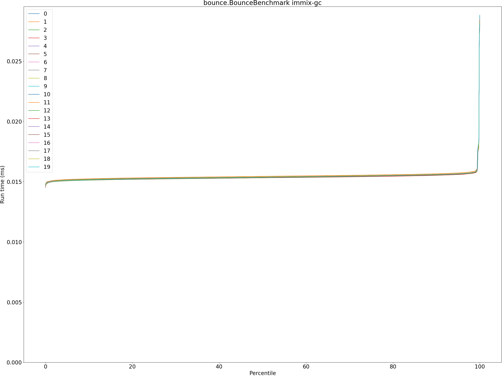
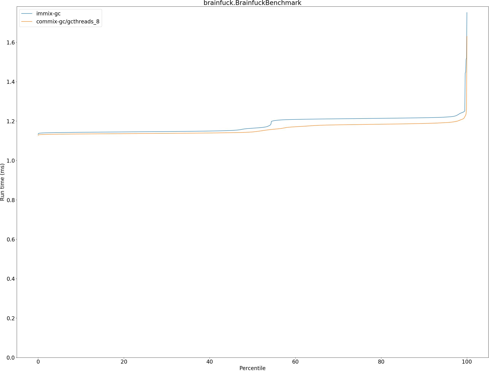
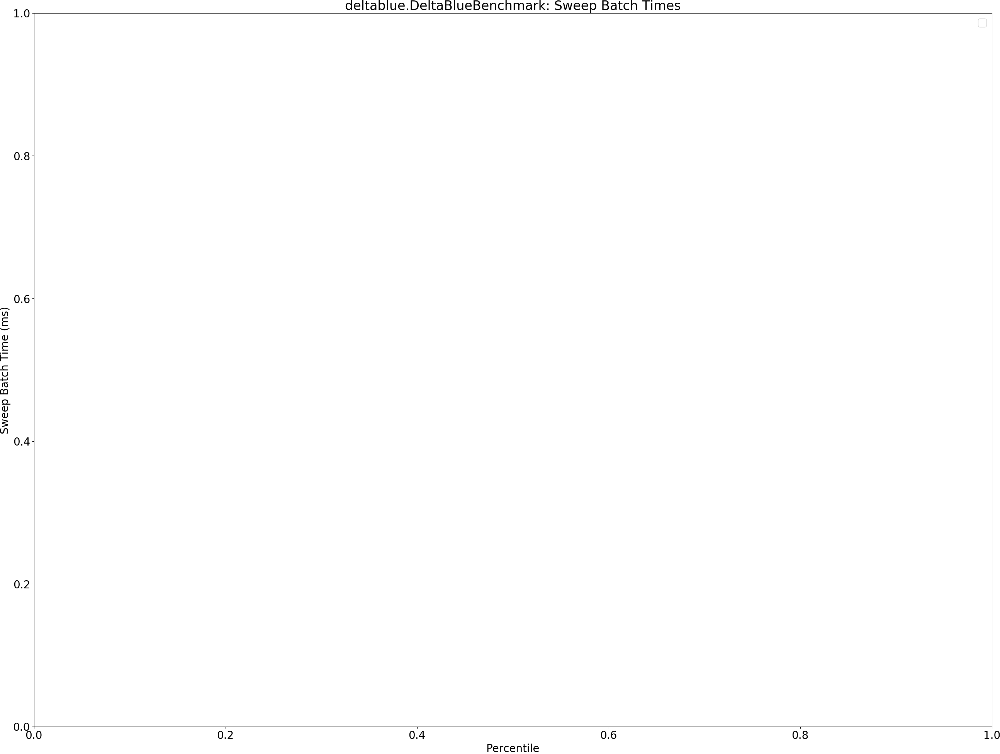
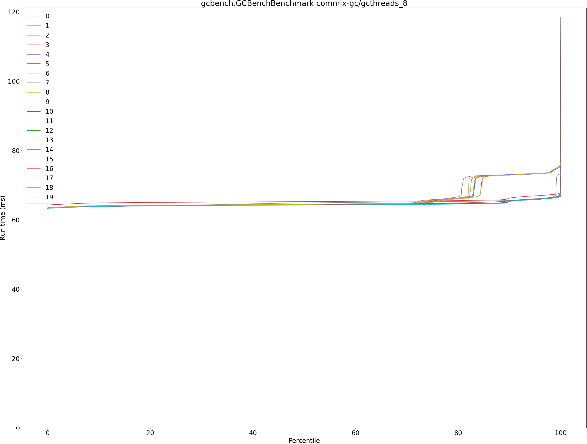
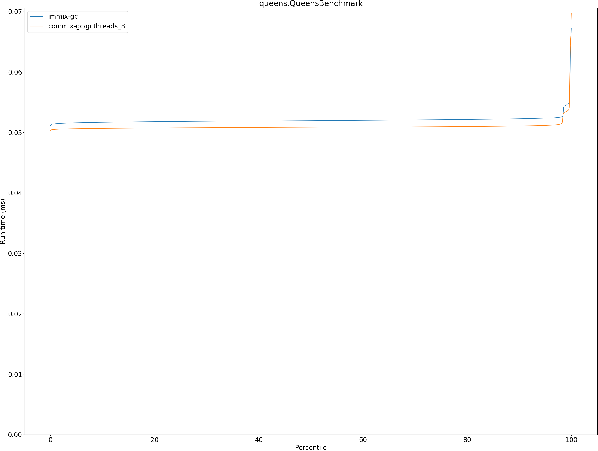
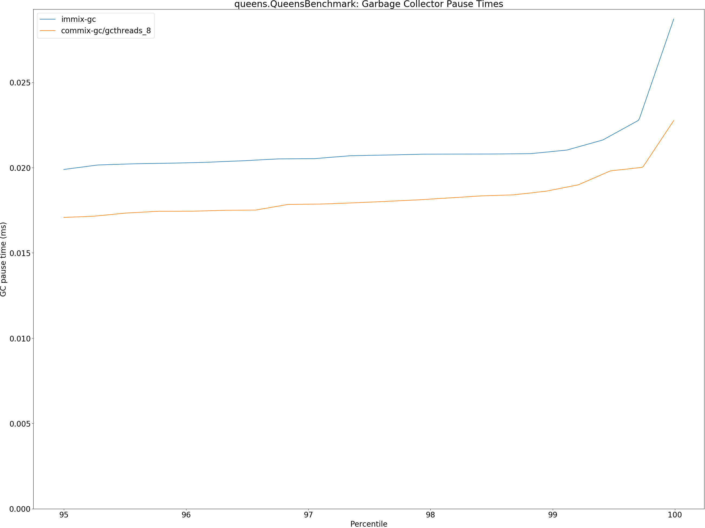
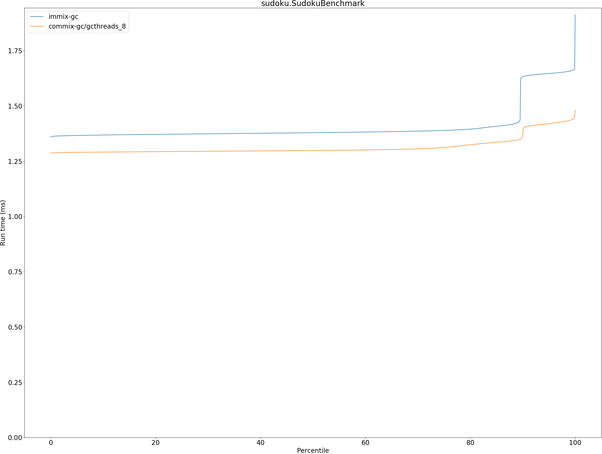
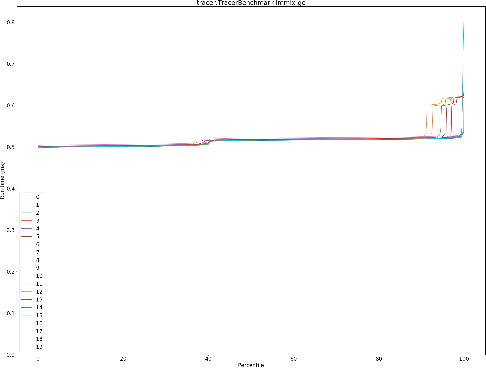

# Summary
## Benchmark run time (ms) at 50 percentile 

|name | immix-gc | unified-heap-gc |  | commix-gc/gcthreads_8 | |
| -- | -- | -- | -- | -- | -- |
|[bounce.BounceBenchmark](#bouncebouncebenchmark)|0.0153|0.0000|__-100.00%__|0.0153|__-0.51%__|
|[brainfuck.BrainfuckBenchmark](#brainfuckbrainfuckbenchmark)|1.1635|0.0000|__-100.00%__|1.1445|__-1.63%__|
|[cd.CDBenchmark](#cdcdbenchmark)|19.8699|0.0000|__-100.00%__|15.7421|__-20.77%__|
|[deltablue.DeltaBlueBenchmark](#deltabluedeltabluebenchmark)|0.1327|0.0000|__-100.00%__|0.1329|+0.11%|
|[gcbench.GCBenchBenchmark](#gcbenchgcbenchbenchmark)|78.8539|0.0000|__-100.00%__|64.3650|__-18.37%__|
|[json.JsonBenchmark](#jsonjsonbenchmark)|0.9996|0.0000|__-100.00%__|0.7386|__-26.11%__|
|[kmeans.KmeansBenchmark](#kmeanskmeansbenchmark)|22.2546|0.0000|__-100.00%__|20.5711|__-7.56%__|
|[nbody.NbodyBenchmark](#nbodynbodybenchmark)|19.3835|0.0000|__-100.00%__|19.3796|__-0.02%__|
|[permute.PermuteBenchmark](#permutepermutebenchmark)|0.1426|0.0000|__-100.00%__|0.1263|__-11.45%__|
|[queens.QueensBenchmark](#queensqueensbenchmark)|0.0519|0.0000|__-100.00%__|0.0508|__-2.12%__|
|[richards.RichardsBenchmark](#richardsrichardsbenchmark)|0.0500|0.0000|__-100.00%__|0.0504|+0.69%|
|[sudoku.SudokuBenchmark](#sudokusudokubenchmark)|1.3785|0.0000|__-100.00%__|1.2981|__-5.83%__|
|[tracer.TracerBenchmark](#tracertracerbenchmark)|0.5157|0.0000|__-100.00%__|0.4381|__-15.04%__|
| __Geometrical mean:__|| | | |__-8.80%__|
## Benchmark run time (ms) at 90 percentile 

|name | immix-gc | unified-heap-gc |  | commix-gc/gcthreads_8 | |
| -- | -- | -- | -- | -- | -- |
|[bounce.BounceBenchmark](#bouncebouncebenchmark)|0.0156|0.0000|__-100.00%__|0.0155|__-0.35%__|
|[brainfuck.BrainfuckBenchmark](#brainfuckbrainfuckbenchmark)|1.2160|0.0000|__-100.00%__|1.1873|__-2.36%__|
|[cd.CDBenchmark](#cdcdbenchmark)|20.0360|0.0000|__-100.00%__|17.0156|__-15.07%__|
|[deltablue.DeltaBlueBenchmark](#deltabluedeltabluebenchmark)|0.1349|0.0000|__-100.00%__|0.1358|+0.63%|
|[gcbench.GCBenchBenchmark](#gcbenchgcbenchbenchmark)|79.3226|0.0000|__-100.00%__|65.9844|__-16.82%__|
|[json.JsonBenchmark](#jsonjsonbenchmark)|1.4203|0.0000|__-100.00%__|0.8374|__-41.04%__|
|[kmeans.KmeansBenchmark](#kmeanskmeansbenchmark)|22.8682|0.0000|__-100.00%__|21.1912|__-7.33%__|
|[nbody.NbodyBenchmark](#nbodynbodybenchmark)|19.3947|0.0000|__-100.00%__|19.3810|__-0.07%__|
|[permute.PermuteBenchmark](#permutepermutebenchmark)|0.1541|0.0000|__-100.00%__|0.1358|__-11.87%__|
|[queens.QueensBenchmark](#queensqueensbenchmark)|0.0522|0.0000|__-100.00%__|0.0511|__-2.27%__|
|[richards.RichardsBenchmark](#richardsrichardsbenchmark)|0.0512|0.0000|__-100.00%__|0.0515|+0.59%|
|[sudoku.SudokuBenchmark](#sudokusudokubenchmark)|1.6319|0.0000|__-100.00%__|1.3685|__-16.14%__|
|[tracer.TracerBenchmark](#tracertracerbenchmark)|0.5195|0.0000|__-100.00%__|0.4422|__-14.87%__|
| __Geometrical mean:__|| | | |__-10.58%__|
## Benchmark run time (ms) at 99 percentile 

|name | immix-gc | unified-heap-gc |  | commix-gc/gcthreads_8 | |
| -- | -- | -- | -- | -- | -- |
|[bounce.BounceBenchmark](#bouncebouncebenchmark)|0.0158|0.0000|__-100.00%__|0.0158|+0.08%|
|[brainfuck.BrainfuckBenchmark](#brainfuckbrainfuckbenchmark)|1.2367|0.0000|__-100.00%__|1.2102|__-2.14%__|
|[cd.CDBenchmark](#cdcdbenchmark)|23.0526|0.0000|__-100.00%__|18.8958|__-18.03%__|
|[deltablue.DeltaBlueBenchmark](#deltabluedeltabluebenchmark)|0.1708|0.0000|__-100.00%__|0.1657|__-2.97%__|
|[gcbench.GCBenchBenchmark](#gcbenchgcbenchbenchmark)|80.0436|0.0000|__-100.00%__|73.4508|__-8.24%__|
|[json.JsonBenchmark](#jsonjsonbenchmark)|1.4406|0.0000|__-100.00%__|1.0791|__-25.09%__|
|[kmeans.KmeansBenchmark](#kmeanskmeansbenchmark)|24.3784|0.0000|__-100.00%__|21.6272|__-11.29%__|
|[nbody.NbodyBenchmark](#nbodynbodybenchmark)|19.4894|0.0000|__-100.00%__|19.3830|__-0.55%__|
|[permute.PermuteBenchmark](#permutepermutebenchmark)|0.1564|0.0000|__-100.00%__|0.1412|__-9.71%__|
|[queens.QueensBenchmark](#queensqueensbenchmark)|0.0545|0.0000|__-100.00%__|0.0534|__-1.95%__|
|[richards.RichardsBenchmark](#richardsrichardsbenchmark)|0.0531|0.0000|__-100.00%__|0.0532|+0.24%|
|[sudoku.SudokuBenchmark](#sudokusudokubenchmark)|1.6572|0.0000|__-100.00%__|1.4339|__-13.48%__|
|[tracer.TracerBenchmark](#tracertracerbenchmark)|0.5265|0.0000|__-100.00%__|0.4459|__-15.31%__|
| __Geometrical mean:__|| | | |__-8.68%__|
## Benchmark run time (ms) at 99.9 percentile 

|name | immix-gc | unified-heap-gc |  | commix-gc/gcthreads_8 | |
| -- | -- | -- | -- | -- | -- |
|[bounce.BounceBenchmark](#bouncebouncebenchmark)|0.0271|0.0000|__-100.00%__|0.0244|__-9.89%__|
|[brainfuck.BrainfuckBenchmark](#brainfuckbrainfuckbenchmark)|1.2484|0.0000|__-100.00%__|1.2587|+0.83%|
|[cd.CDBenchmark](#cdcdbenchmark)|23.2347|0.0000|__-100.00%__|20.1013|__-13.49%__|
|[deltablue.DeltaBlueBenchmark](#deltabluedeltabluebenchmark)|0.1729|0.0000|__-100.00%__|0.1732|+0.20%|
|[gcbench.GCBenchBenchmark](#gcbenchgcbenchbenchmark)|81.2200|0.0000|__-100.00%__|75.3351|__-7.25%__|
|[json.JsonBenchmark](#jsonjsonbenchmark)|1.4512|0.0000|__-100.00%__|1.0988|__-24.29%__|
|[kmeans.KmeansBenchmark](#kmeanskmeansbenchmark)|24.9158|0.0000|__-100.00%__|21.8924|__-12.13%__|
|[nbody.NbodyBenchmark](#nbodynbodybenchmark)|21.7888|0.0000|__-100.00%__|19.3910|__-11.01%__|
|[permute.PermuteBenchmark](#permutepermutebenchmark)|0.1657|0.0000|__-100.00%__|0.1446|__-12.74%__|
|[queens.QueensBenchmark](#queensqueensbenchmark)|0.0643|0.0000|__-100.00%__|0.0662|+2.90%|
|[richards.RichardsBenchmark](#richardsrichardsbenchmark)|0.0565|0.0000|__-100.00%__|0.0585|+3.54%|
|[sudoku.SudokuBenchmark](#sudokusudokubenchmark)|1.6673|0.0000|__-100.00%__|1.4472|__-13.21%__|
|[tracer.TracerBenchmark](#tracertracerbenchmark)|0.6200|0.0000|__-100.00%__|0.4493|__-27.53%__|
| __Geometrical mean:__|| | | |__-10.03%__|
## Benchmark total run time (ms) 

|name | immix-gc | unified-heap-gc |  | commix-gc/gcthreads_8 | |
| -- | -- | -- | -- | -- | -- |
|[bounce.BounceBenchmark](#bouncebouncebenchmark)|983.8122|0.0000|__-100.00%__|979.0311|__-0.49%__|
|[brainfuck.BrainfuckBenchmark](#brainfuckbrainfuckbenchmark)|75478.5740|0.0000|__-100.00%__|74141.4571|__-1.77%__|
|[cd.CDBenchmark](#cdcdbenchmark)|1278930.7550|0.0000|__-100.00%__|1028724.3001|__-19.56%__|
|[deltablue.DeltaBlueBenchmark](#deltabluedeltabluebenchmark)|8594.5288|0.0000|__-100.00%__|8614.5822|+0.23%|
|[gcbench.GCBenchBenchmark](#gcbenchgcbenchbenchmark)|5050055.6263|0.0000|__-100.00%__|4166967.4004|__-17.49%__|
|[json.JsonBenchmark](#jsonjsonbenchmark)|68798.1083|0.0000|__-100.00%__|48792.7600|__-29.08%__|
|[kmeans.KmeansBenchmark](#kmeanskmeansbenchmark)|1434955.8710|0.0000|__-100.00%__|1324433.2919|__-7.70%__|
|[nbody.NbodyBenchmark](#nbodynbodybenchmark)|1239274.6563|0.0000|__-100.00%__|1237655.9817|__-0.13%__|
|[permute.PermuteBenchmark](#permutepermutebenchmark)|9233.6292|0.0000|__-100.00%__|8191.3027|__-11.29%__|
|[queens.QueensBenchmark](#queensqueensbenchmark)|3328.5600|0.0000|__-100.00%__|3259.0097|__-2.09%__|
|[richards.RichardsBenchmark](#richardsrichardsbenchmark)|3220.1473|0.0000|__-100.00%__|3242.3897|+0.69%|
|[sudoku.SudokuBenchmark](#sudokusudokubenchmark)|90093.8941|0.0000|__-100.00%__|84087.8476|__-6.67%__|
|[tracer.TracerBenchmark](#tracertracerbenchmark)|32803.7252|0.0000|__-100.00%__|27736.2839|__-15.45%__|
| __Geometrical mean:__|| | | |__-9.00%__|
## Total GC time on Application thread (ms) 

|name |  | immix-gc | unified-heap-gc |  | commix-gc/gcthreads_8 | |
| -- | -- | -- | -- | -- | -- | -- |
|[bounce.BounceBenchmark](#bouncebouncebenchmark)|mark|1.1293|0.0000|__-100.00%__|1.7508|+55.03%|
||sweep|0.9067|0.0000|__-100.00%__|0.0000|__-100.00%__|
||total|2.0360|0.0000|__-100.00%__|1.7508|__-14.01%__|
|[brainfuck.BrainfuckBenchmark](#brainfuckbrainfuckbenchmark)|mark|1760.7613|0.0000|__-100.00%__|1664.3077|__-5.48%__|
||sweep|1579.0714|0.0000|__-100.00%__|0.3183|__-99.98%__|
||total|3339.8326|0.0000|__-100.00%__|1664.6260|__-50.16%__|
|[cd.CDBenchmark](#cdcdbenchmark)|mark|76123.9832|0.0000|__-100.00%__|20570.1973|__-72.98%__|
||sweep|51537.7245|0.0000|__-100.00%__|0.6182|__-100.00%__|
||total|127661.7077|0.0000|__-100.00%__|20570.8155|__-83.89%__|
|[deltablue.DeltaBlueBenchmark](#deltabluedeltabluebenchmark)|mark|98.1184|0.0000|__-100.00%__|151.5061|+54.41%|
||sweep|62.3127|0.0000|__-100.00%__|0.5431|__-99.13%__|
||total|160.4311|0.0000|__-100.00%__|152.0492|__-5.22%__|
|[gcbench.GCBenchBenchmark](#gcbenchgcbenchbenchmark)|mark|618991.4060|0.0000|__-100.00%__|29531.3813|__-95.23%__|
||sweep|365279.4646|0.0000|__-100.00%__|2036.5194|__-99.44%__|
||total|984270.8707|0.0000|__-100.00%__|31567.9008|__-96.79%__|
|[json.JsonBenchmark](#jsonjsonbenchmark)|mark|4871.5750|0.0000|__-100.00%__|1323.8916|__-72.82%__|
||sweep|7681.7006|0.0000|__-100.00%__|0.0000|__-100.00%__|
||total|12553.2756|0.0000|__-100.00%__|1323.8916|__-89.45%__|
|[kmeans.KmeansBenchmark](#kmeanskmeansbenchmark)|mark|125416.0958|0.0000|__-100.00%__|16452.4898|__-86.88%__|
||sweep|77330.5697|0.0000|__-100.00%__|38.3297|__-99.95%__|
||total|202746.6654|0.0000|__-100.00%__|16490.8195|__-91.87%__|
|[nbody.NbodyBenchmark](#nbodynbodybenchmark)|mark|0.2825|0.0000|__-100.00%__|0.4392|+55.44%|
||sweep|0.2915|0.0000|__-100.00%__|0.0000|__-100.00%__|
||total|0.5740|0.0000|__-100.00%__|0.4392|__-23.49%__|
|[permute.PermuteBenchmark](#permutepermutebenchmark)|mark|101.2541|0.0000|__-100.00%__|108.1440|+6.80%|
||sweep|83.3756|0.0000|__-100.00%__|11.0783|__-86.71%__|
||total|184.6297|0.0000|__-100.00%__|119.2223|__-35.43%__|
|[queens.QueensBenchmark](#queensqueensbenchmark)|mark|2.3273|0.0000|__-100.00%__|3.2310|+38.83%|
||sweep|1.9611|0.0000|__-100.00%__|0.0000|__-100.00%__|
||total|4.2884|0.0000|__-100.00%__|3.2310|__-24.66%__|
|[richards.RichardsBenchmark](#richardsrichardsbenchmark)|mark|0.5904|0.0000|__-100.00%__|0.7052|+19.45%|
||sweep|0.4899|0.0000|__-100.00%__|0.0000|__-100.00%__|
||total|1.0803|0.0000|__-100.00%__|0.7052|__-34.72%__|
|[sudoku.SudokuBenchmark](#sudokusudokubenchmark)|mark|1109.2876|0.0000|__-100.00%__|1287.2076|+16.04%|
||sweep|2202.4207|0.0000|__-100.00%__|0.0000|__-100.00%__|
||total|3311.7083|0.0000|__-100.00%__|1287.2076|__-61.13%__|
|[tracer.TracerBenchmark](#tracertracerbenchmark)|mark|628.3913|0.0000|__-100.00%__|663.1013|+5.52%|
||sweep|427.1353|0.0000|__-100.00%__|44.0225|__-89.69%__|
||total|1055.5266|0.0000|__-100.00%__|707.1238|__-33.01%__|
|__Geometrical mean:__|mark|| | | |__-35.27%__|
||sweep|| | | |__-99.74%__|
||total|| | | |__-65.10%__|
## GC pause time (ms) at 50 percentile 

|name | immix-gc | unified-heap-gc |  | commix-gc/gcthreads_8 | |
| -- | -- | -- | -- | -- | -- |
|[bounce.BounceBenchmark](#bouncebouncebenchmark)|0.0120|0.0000|__-100.00%__|0.0000|__-100.00%__|
|[brainfuck.BrainfuckBenchmark](#brainfuckbrainfuckbenchmark)|0.0619|0.0000|__-100.00%__|0.0348|__-43.67%__|
|[cd.CDBenchmark](#cdcdbenchmark)|0.0605|0.0000|__-100.00%__|0.0417|__-31.07%__|
|[deltablue.DeltaBlueBenchmark](#deltabluedeltabluebenchmark)|0.0287|0.0000|__-100.00%__|0.0240|__-16.20%__|
|[gcbench.GCBenchBenchmark](#gcbenchgcbenchbenchmark)|0.1148|0.0000|__-100.00%__|0.0358|__-68.77%__|
|[json.JsonBenchmark](#jsonjsonbenchmark)|0.2621|0.0000|__-100.00%__|0.0000|__-100.00%__|
|[kmeans.KmeansBenchmark](#kmeanskmeansbenchmark)|1.5978|0.0000|__-100.00%__|0.5259|__-67.08%__|
|[nbody.NbodyBenchmark](#nbodynbodybenchmark)|0.0288|0.0000|__-100.00%__|0.0000|__-100.00%__|
|[permute.PermuteBenchmark](#permutepermutebenchmark)|0.0114|0.0000|__-100.00%__|0.0073|__-36.02%__|
|[queens.QueensBenchmark](#queensqueensbenchmark)|0.0119|0.0000|__-100.00%__|0.0000|__-100.00%__|
|[richards.RichardsBenchmark](#richardsrichardsbenchmark)|0.0118|0.0000|__-100.00%__|0.0000|__-100.00%__|
|[sudoku.SudokuBenchmark](#sudokusudokubenchmark)|0.2531|0.0000|__-100.00%__|0.0000|__-100.00%__|
|[tracer.TracerBenchmark](#tracertracerbenchmark)|0.0147|0.0000|__-100.00%__|0.0094|__-35.83%__|
| __Geometrical mean:__|| | | |__-45.80%__|
## GC pause time (ms) at 90 percentile 

|name | immix-gc | unified-heap-gc |  | commix-gc/gcthreads_8 | |
| -- | -- | -- | -- | -- | -- |
|[bounce.BounceBenchmark](#bouncebouncebenchmark)|0.0167|0.0000|__-100.00%__|0.0000|__-100.00%__|
|[brainfuck.BrainfuckBenchmark](#brainfuckbrainfuckbenchmark)|0.0638|0.0000|__-100.00%__|0.0363|__-43.03%__|
|[cd.CDBenchmark](#cdcdbenchmark)|0.0909|0.0000|__-100.00%__|0.0681|__-25.03%__|
|[deltablue.DeltaBlueBenchmark](#deltabluedeltabluebenchmark)|0.0370|0.0000|__-100.00%__|0.0319|__-13.86%__|
|[gcbench.GCBenchBenchmark](#gcbenchgcbenchbenchmark)|2.1957|0.0000|__-100.00%__|1.1797|__-46.27%__|
|[json.JsonBenchmark](#jsonjsonbenchmark)|0.4751|0.0000|__-100.00%__|0.0000|__-100.00%__|
|[kmeans.KmeansBenchmark](#kmeanskmeansbenchmark)|1.6609|0.0000|__-100.00%__|0.6153|__-62.95%__|
|[nbody.NbodyBenchmark](#nbodynbodybenchmark)|0.0336|0.0000|__-100.00%__|0.0000|__-100.00%__|
|[permute.PermuteBenchmark](#permutepermutebenchmark)|0.0118|0.0000|__-100.00%__|0.0077|__-34.71%__|
|[queens.QueensBenchmark](#queensqueensbenchmark)|0.0143|0.0000|__-100.00%__|0.0000|__-100.00%__|
|[richards.RichardsBenchmark](#richardsrichardsbenchmark)|0.0186|0.0000|__-100.00%__|0.0000|__-100.00%__|
|[sudoku.SudokuBenchmark](#sudokusudokubenchmark)|0.2600|0.0000|__-100.00%__|0.0000|__-100.00%__|
|[tracer.TracerBenchmark](#tracertracerbenchmark)|0.0158|0.0000|__-100.00%__|0.0105|__-33.71%__|
| __Geometrical mean:__|| | | |__-38.93%__|
## GC pause time (ms) at 99 percentile 

|name | immix-gc | unified-heap-gc |  | commix-gc/gcthreads_8 | |
| -- | -- | -- | -- | -- | -- |
|[bounce.BounceBenchmark](#bouncebouncebenchmark)|0.0188|0.0000|__-100.00%__|0.0000|__-100.00%__|
|[brainfuck.BrainfuckBenchmark](#brainfuckbrainfuckbenchmark)|0.0675|0.0000|__-100.00%__|0.0431|__-36.15%__|
|[cd.CDBenchmark](#cdcdbenchmark)|0.1168|0.0000|__-100.00%__|0.1204|+3.09%|
|[deltablue.DeltaBlueBenchmark](#deltabluedeltabluebenchmark)|0.0378|0.0000|__-100.00%__|0.0444|+17.45%|
|[gcbench.GCBenchBenchmark](#gcbenchgcbenchbenchmark)|2.7671|0.0000|__-100.00%__|2.2997|__-16.89%__|
|[json.JsonBenchmark](#jsonjsonbenchmark)|0.4883|0.0000|__-100.00%__|0.0000|__-100.00%__|
|[kmeans.KmeansBenchmark](#kmeanskmeansbenchmark)|1.9353|0.0000|__-100.00%__|0.6680|__-65.48%__|
|[nbody.NbodyBenchmark](#nbodynbodybenchmark)|0.0363|0.0000|__-100.00%__|0.0000|__-100.00%__|
|[permute.PermuteBenchmark](#permutepermutebenchmark)|0.0137|0.0000|__-100.00%__|0.0091|__-33.34%__|
|[queens.QueensBenchmark](#queensqueensbenchmark)|0.0209|0.0000|__-100.00%__|0.0000|__-100.00%__|
|[richards.RichardsBenchmark](#richardsrichardsbenchmark)|0.0204|0.0000|__-100.00%__|0.0000|__-100.00%__|
|[sudoku.SudokuBenchmark](#sudokusudokubenchmark)|0.2655|0.0000|__-100.00%__|0.0000|__-100.00%__|
|[tracer.TracerBenchmark](#tracertracerbenchmark)|0.0172|0.0000|__-100.00%__|0.0119|__-30.68%__|
| __Geometrical mean:__|| | | |__-27.78%__|
## GC pause time (ms) at 99.9 percentile 

|name | immix-gc | unified-heap-gc |  | commix-gc/gcthreads_8 | |
| -- | -- | -- | -- | -- | -- |
|[bounce.BounceBenchmark](#bouncebouncebenchmark)|0.0245|0.0000|__-100.00%__|0.0000|__-100.00%__|
|[brainfuck.BrainfuckBenchmark](#brainfuckbrainfuckbenchmark)|0.0705|0.0000|__-100.00%__|0.0748|+6.16%|
|[cd.CDBenchmark](#cdcdbenchmark)|0.1291|0.0000|__-100.00%__|0.1517|+17.50%|
|[deltablue.DeltaBlueBenchmark](#deltabluedeltabluebenchmark)|0.0403|0.0000|__-100.00%__|0.0562|+39.50%|
|[gcbench.GCBenchBenchmark](#gcbenchgcbenchbenchmark)|2.7967|0.0000|__-100.00%__|2.8888|+3.29%|
|[json.JsonBenchmark](#jsonjsonbenchmark)|0.5178|0.0000|__-100.00%__|0.0000|__-100.00%__|
|[kmeans.KmeansBenchmark](#kmeanskmeansbenchmark)|2.1466|0.0000|__-100.00%__|0.7012|__-67.33%__|
|[nbody.NbodyBenchmark](#nbodynbodybenchmark)|0.0369|0.0000|__-100.00%__|0.0000|__-100.00%__|
|[permute.PermuteBenchmark](#permutepermutebenchmark)|0.0201|0.0000|__-100.00%__|0.0176|__-12.65%__|
|[queens.QueensBenchmark](#queensqueensbenchmark)|0.0268|0.0000|__-100.00%__|0.0000|__-100.00%__|
|[richards.RichardsBenchmark](#richardsrichardsbenchmark)|0.0250|0.0000|__-100.00%__|0.0000|__-100.00%__|
|[sudoku.SudokuBenchmark](#sudokusudokubenchmark)|0.2906|0.0000|__-100.00%__|0.0000|__-100.00%__|
|[tracer.TracerBenchmark](#tracertracerbenchmark)|0.0186|0.0000|__-100.00%__|0.0146|__-21.75%__|
| __Geometrical mean:__|| | | |__-12.23%__|
# Individual benchmarks
## bounce.BounceBenchmark

## brainfuck.BrainfuckBenchmark

## cd.CDBenchmark

## deltablue.DeltaBlueBenchmark

## gcbench.GCBenchBenchmark

## json.JsonBenchmark

## kmeans.KmeansBenchmark

## nbody.NbodyBenchmark

## permute.PermuteBenchmark

## queens.QueensBenchmark

## richards.RichardsBenchmark

## sudoku.SudokuBenchmark

## tracer.TracerBenchmark

