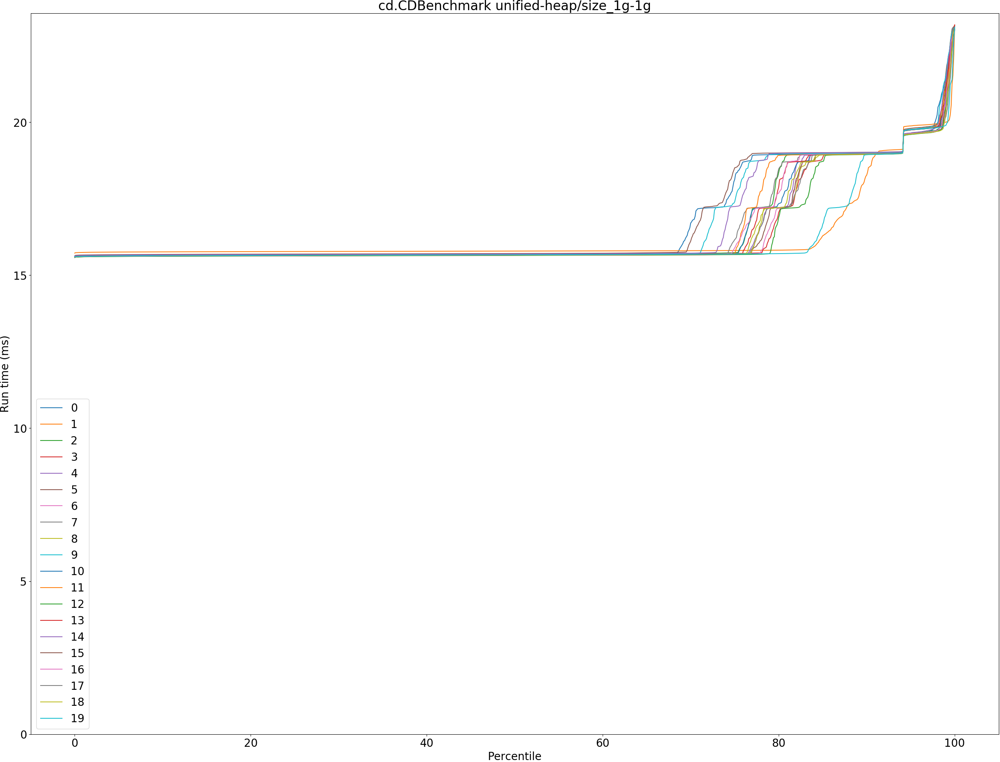
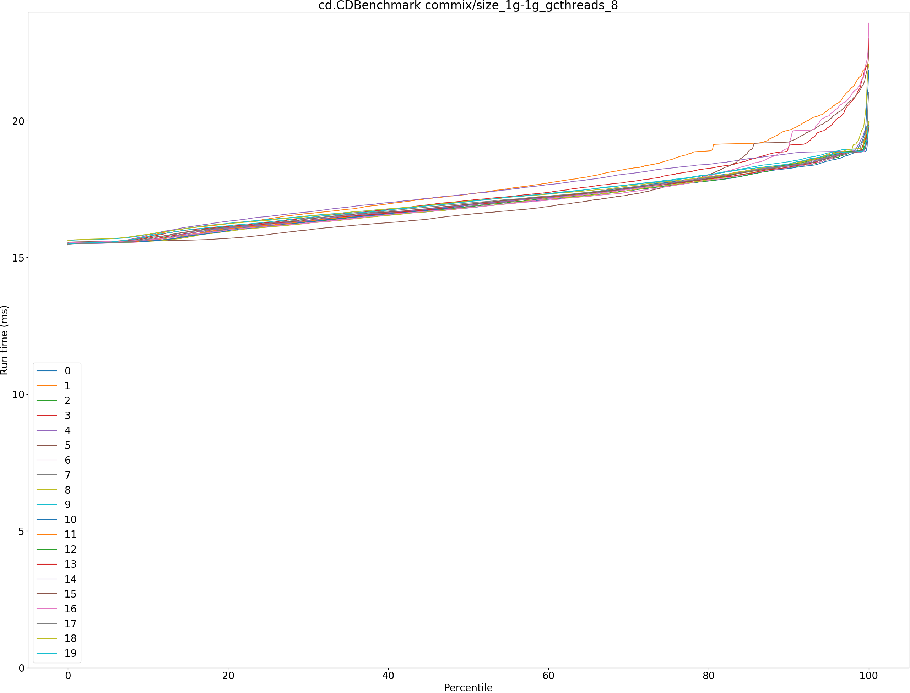
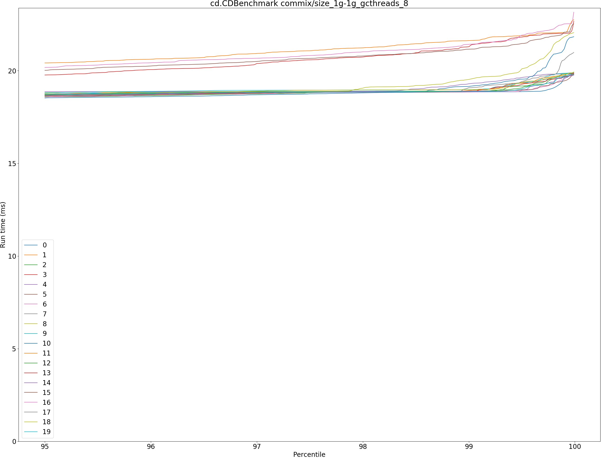
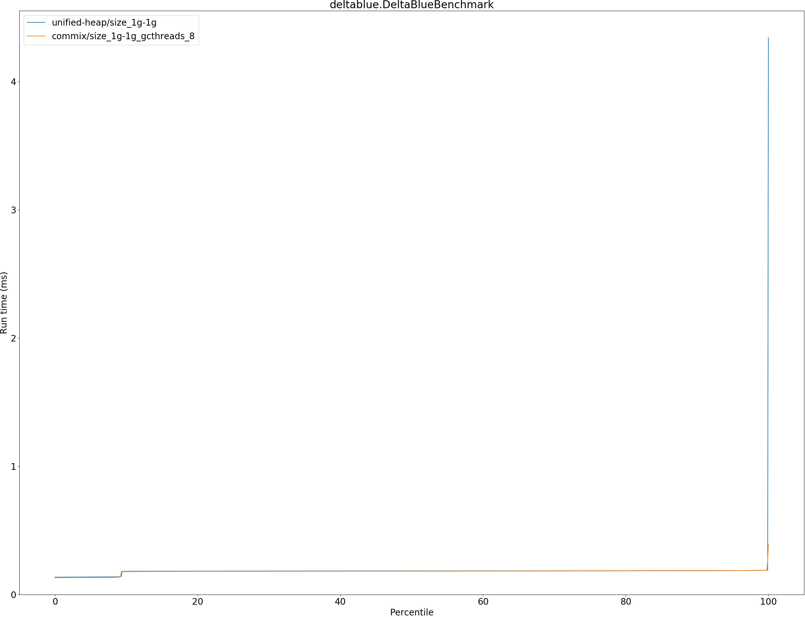
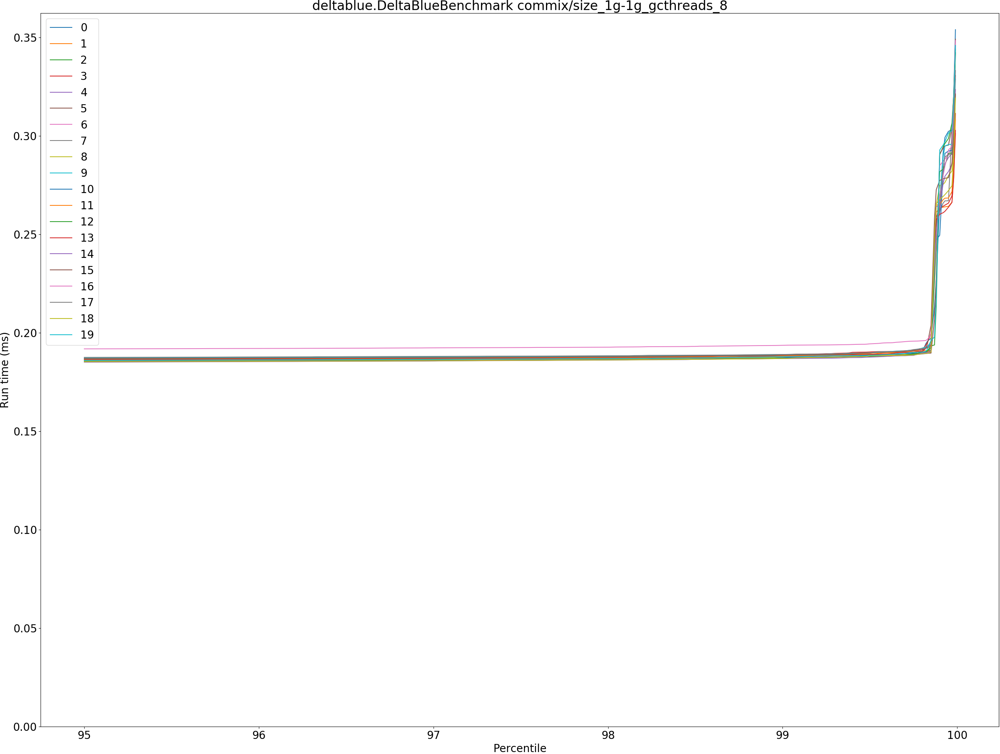
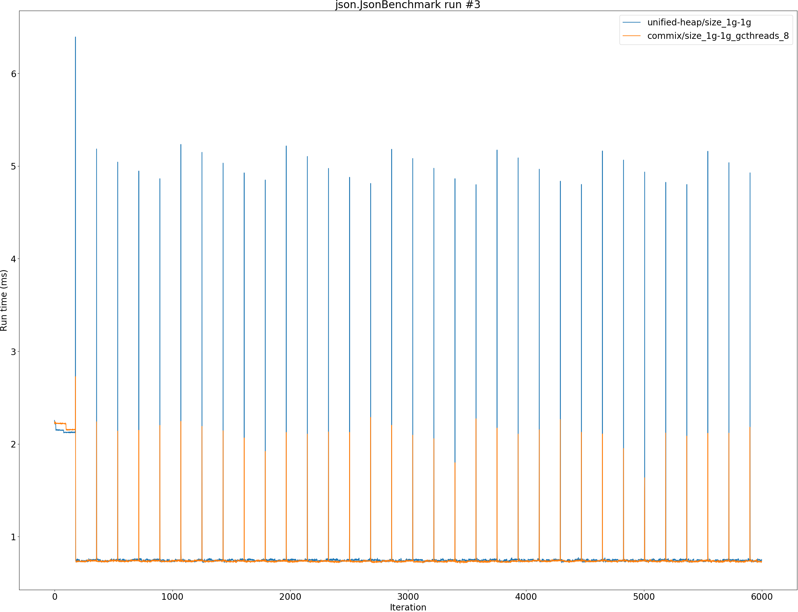
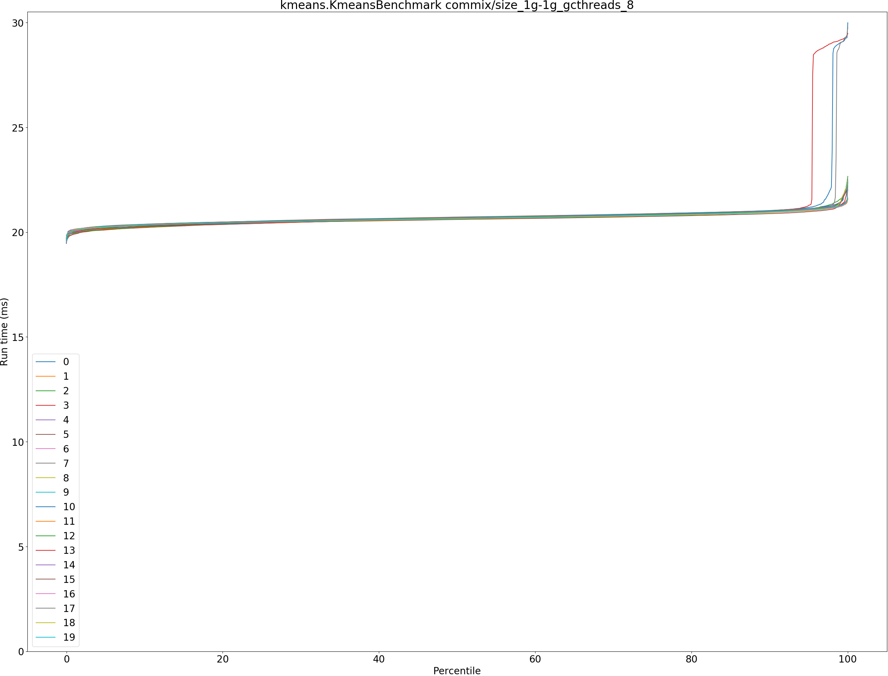
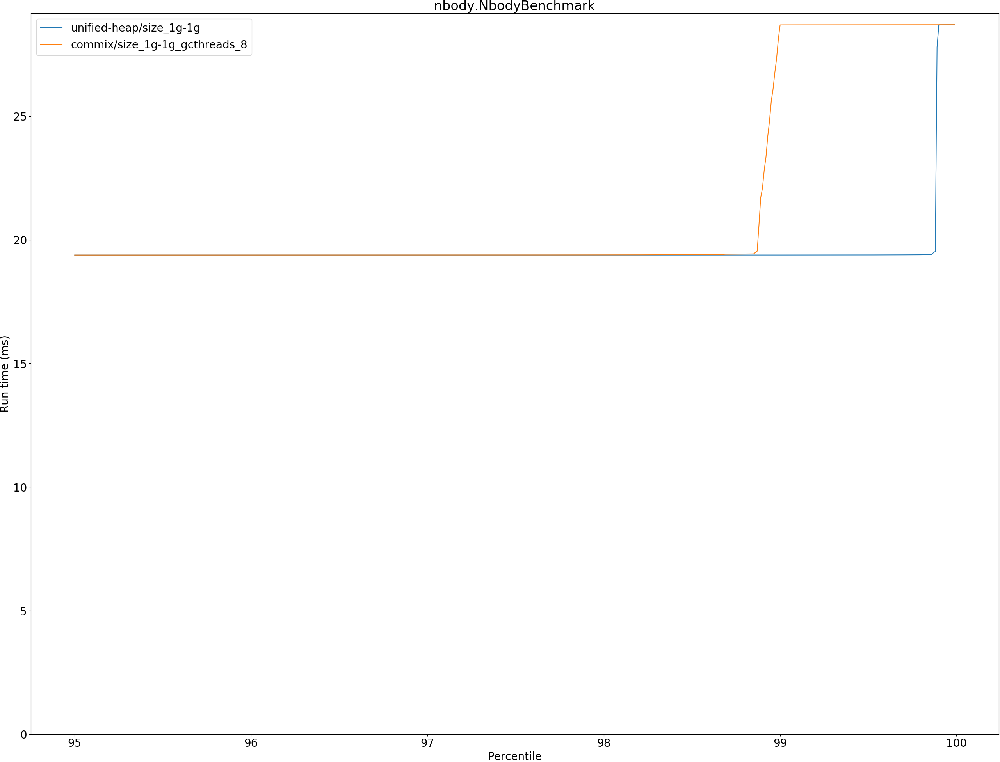
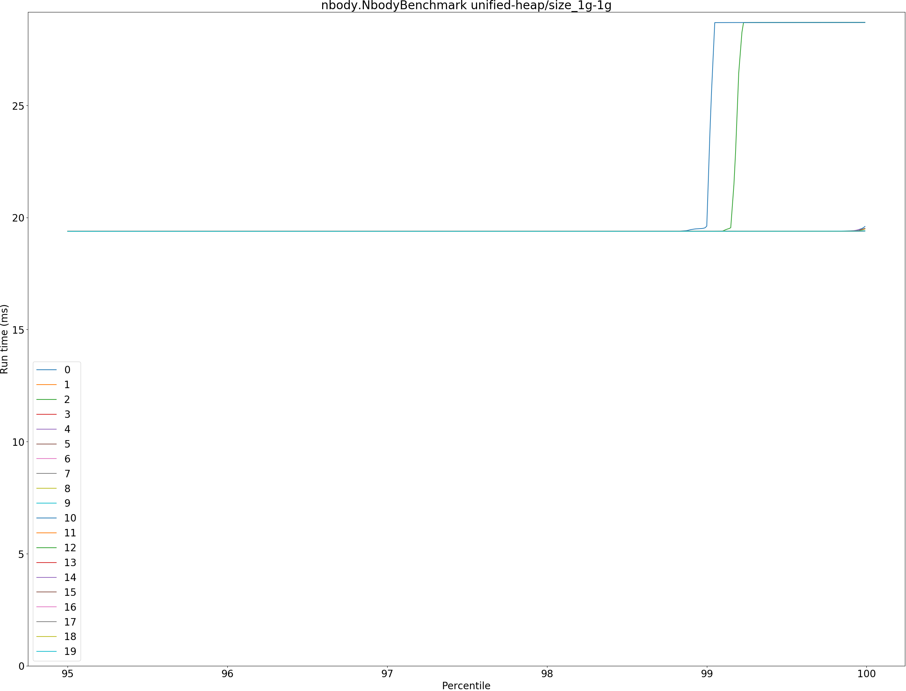
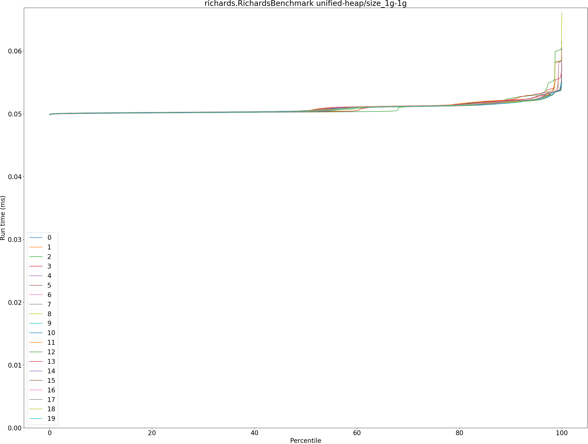

# Summary
## Benchmark run time (ms) at 50 percentile 

|name | unified-heap/size_1g-1g | commix/size_1g-1g_gcthreads_8 | |
| -- | -- | -- | -- |
|[bounce.BounceBenchmark](#bouncebouncebenchmark)|0.0159|0.0159|+0.12%|
|[brainfuck.BrainfuckBenchmark](#brainfuckbrainfuckbenchmark)|1.1161|1.1415|+2.27%|
|[cd.CDBenchmark](#cdcdbenchmark)|15.6587|16.8849|+7.83%|
|[deltablue.DeltaBlueBenchmark](#deltabluedeltabluebenchmark)|0.1836|0.1818|__-0.97%__|
|[gcbench.GCBenchBenchmark](#gcbenchgcbenchbenchmark)|63.3289|63.8021|+0.75%|
|[json.JsonBenchmark](#jsonjsonbenchmark)|0.7429|0.7319|__-1.48%__|
|[kmeans.KmeansBenchmark](#kmeanskmeansbenchmark)|20.7529|20.6364|__-0.56%__|
|[nbody.NbodyBenchmark](#nbodynbodybenchmark)|19.3796|19.3797|+0.00%|
|[permute.PermuteBenchmark](#permutepermutebenchmark)|0.1244|0.1230|__-1.14%__|
|[queens.QueensBenchmark](#queensqueensbenchmark)|0.0533|0.0526|__-1.31%__|
|[richards.RichardsBenchmark](#richardsrichardsbenchmark)|0.0503|0.0501|__-0.55%__|
|[sudoku.SudokuBenchmark](#sudokusudokubenchmark)|1.3267|1.3156|__-0.83%__|
|[tracer.TracerBenchmark](#tracertracerbenchmark)|0.4440|0.4384|__-1.26%__|
| __Geometrical mean:__|| |+0.19%|
## Benchmark run time (ms) at 90 percentile 

|name | unified-heap/size_1g-1g | commix/size_1g-1g_gcthreads_8 | |
| -- | -- | -- | -- |
|[bounce.BounceBenchmark](#bouncebouncebenchmark)|0.0169|0.0169|+0.26%|
|[brainfuck.BrainfuckBenchmark](#brainfuckbrainfuckbenchmark)|1.1234|1.1462|+2.03%|
|[cd.CDBenchmark](#cdcdbenchmark)|18.9603|18.3896|__-3.01%__|
|[deltablue.DeltaBlueBenchmark](#deltabluedeltabluebenchmark)|0.1856|0.1850|__-0.28%__|
|[gcbench.GCBenchBenchmark](#gcbenchgcbenchbenchmark)|66.7720|64.9879|__-2.67%__|
|[json.JsonBenchmark](#jsonjsonbenchmark)|0.7529|0.7409|__-1.61%__|
|[kmeans.KmeansBenchmark](#kmeanskmeansbenchmark)|21.0701|20.9643|__-0.50%__|
|[nbody.NbodyBenchmark](#nbodynbodybenchmark)|19.3810|19.3812|+0.00%|
|[permute.PermuteBenchmark](#permutepermutebenchmark)|0.1277|0.1265|__-0.99%__|
|[queens.QueensBenchmark](#queensqueensbenchmark)|0.0549|0.0543|__-1.19%__|
|[richards.RichardsBenchmark](#richardsrichardsbenchmark)|0.0519|0.0518|__-0.19%__|
|[sudoku.SudokuBenchmark](#sudokusudokubenchmark)|1.3330|1.3228|__-0.77%__|
|[tracer.TracerBenchmark](#tracertracerbenchmark)|0.4481|0.4428|__-1.18%__|
| __Geometrical mean:__|| |__-0.78%__|
## Benchmark run time (ms) at 99 percentile 

|name | unified-heap/size_1g-1g | commix/size_1g-1g_gcthreads_8 | |
| -- | -- | -- | -- |
|[bounce.BounceBenchmark](#bouncebouncebenchmark)|0.0183|0.0183|__-0.23%__|
|[brainfuck.BrainfuckBenchmark](#brainfuckbrainfuckbenchmark)|1.1714|1.1510|__-1.74%__|
|[cd.CDBenchmark](#cdcdbenchmark)|20.6242|18.9654|__-8.04%__|
|[deltablue.DeltaBlueBenchmark](#deltabluedeltabluebenchmark)|0.1880|0.1878|__-0.14%__|
|[gcbench.GCBenchBenchmark](#gcbenchgcbenchbenchmark)|68.7731|66.1907|__-3.76%__|
|[json.JsonBenchmark](#jsonjsonbenchmark)|0.7629|0.7871|+3.17%|
|[kmeans.KmeansBenchmark](#kmeanskmeansbenchmark)|23.8451|21.3009|__-10.67%__|
|[nbody.NbodyBenchmark](#nbodynbodybenchmark)|19.3834|19.3986|+0.08%|
|[permute.PermuteBenchmark](#permutepermutebenchmark)|0.2391|0.2392|+0.04%|
|[queens.QueensBenchmark](#queensqueensbenchmark)|0.0568|0.0561|__-1.36%__|
|[richards.RichardsBenchmark](#richardsrichardsbenchmark)|0.0536|0.0546|+1.75%|
|[sudoku.SudokuBenchmark](#sudokusudokubenchmark)|1.3703|1.3301|__-2.94%__|
|[tracer.TracerBenchmark](#tracertracerbenchmark)|0.4527|0.4484|__-0.97%__|
| __Geometrical mean:__|| |__-1.98%__|
## Benchmark run time (ms) at 99.9 percentile 

|name | unified-heap/size_1g-1g | commix/size_1g-1g_gcthreads_8 | |
| -- | -- | -- | -- |
|[bounce.BounceBenchmark](#bouncebouncebenchmark)|0.0192|0.0192|__-0.04%__|
|[brainfuck.BrainfuckBenchmark](#brainfuckbrainfuckbenchmark)|5.1293|2.2364|__-56.40%__|
|[cd.CDBenchmark](#cdcdbenchmark)|22.9745|19.8455|__-13.62%__|
|[deltablue.DeltaBlueBenchmark](#deltabluedeltabluebenchmark)|0.1905|0.2667|+40.04%|
|[gcbench.GCBenchBenchmark](#gcbenchgcbenchbenchmark)|76.0024|67.6201|__-11.03%__|
|[json.JsonBenchmark](#jsonjsonbenchmark)|5.0822|2.1819|__-57.07%__|
|[kmeans.KmeansBenchmark](#kmeanskmeansbenchmark)|24.5971|22.0267|__-10.45%__|
|[nbody.NbodyBenchmark](#nbodynbodybenchmark)|19.3918|28.6993|+48.00%|
|[permute.PermuteBenchmark](#permutepermutebenchmark)|0.2420|0.4375|+80.82%|
|[queens.QueensBenchmark](#queensqueensbenchmark)|0.0579|0.0570|__-1.51%__|
|[richards.RichardsBenchmark](#richardsrichardsbenchmark)|0.0583|0.0582|__-0.18%__|
|[sudoku.SudokuBenchmark](#sudokusudokubenchmark)|5.5932|1.8034|__-67.76%__|
|[tracer.TracerBenchmark](#tracertracerbenchmark)|4.5435|1.1432|__-74.84%__|
| __Geometrical mean:__|| |__-22.16%__|
## Benchmark total run time (ms) 

|name | unified-heap/size_1g-1g | commix/size_1g-1g_gcthreads_8 | |
| -- | -- | -- | -- |
|[bounce.BounceBenchmark](#bouncebouncebenchmark)|1030.3802|1031.6787|+0.13%|
|[brainfuck.BrainfuckBenchmark](#brainfuckbrainfuckbenchmark)|72362.9642|73201.3662|+1.16%|
|[cd.CDBenchmark](#cdcdbenchmark)|1050161.1278|1087703.3933|+3.57%|
|[deltablue.DeltaBlueBenchmark](#deltabluedeltabluebenchmark)|11549.4358|11380.3592|__-1.46%__|
|[gcbench.GCBenchBenchmark](#gcbenchgcbenchbenchmark)|4124847.3193|4096381.3369|__-0.69%__|
|[json.JsonBenchmark](#jsonjsonbenchmark)|48992.4315|47373.7745|__-3.30%__|
|[kmeans.KmeansBenchmark](#kmeanskmeansbenchmark)|1329898.2639|1322771.9087|__-0.54%__|
|[nbody.NbodyBenchmark](#nbodynbodybenchmark)|1236116.0713|1243009.8238|+0.56%|
|[permute.PermuteBenchmark](#permutepermutebenchmark)|8620.2166|8447.4415|__-2.00%__|
|[queens.QueensBenchmark](#queensqueensbenchmark)|3427.7611|3383.1306|__-1.30%__|
|[richards.RichardsBenchmark](#richardsrichardsbenchmark)|3253.4229|3238.9333|__-0.45%__|
|[sudoku.SudokuBenchmark](#sudokusudokubenchmark)|85378.2231|84298.7385|__-1.26%__|
|[tracer.TracerBenchmark](#tracertracerbenchmark)|28965.1446|28230.5509|__-2.54%__|
| __Geometrical mean:__|| |__-0.64%__|
# Individual benchmarks
## bounce.BounceBenchmark

## brainfuck.BrainfuckBenchmark

## cd.CDBenchmark

## deltablue.DeltaBlueBenchmark

## gcbench.GCBenchBenchmark

## json.JsonBenchmark

## kmeans.KmeansBenchmark

## nbody.NbodyBenchmark

## permute.PermuteBenchmark

## queens.QueensBenchmark

## richards.RichardsBenchmark

## sudoku.SudokuBenchmark

## tracer.TracerBenchmark

