# Summary
## Benchmark run time (ms) at 50 percentile 
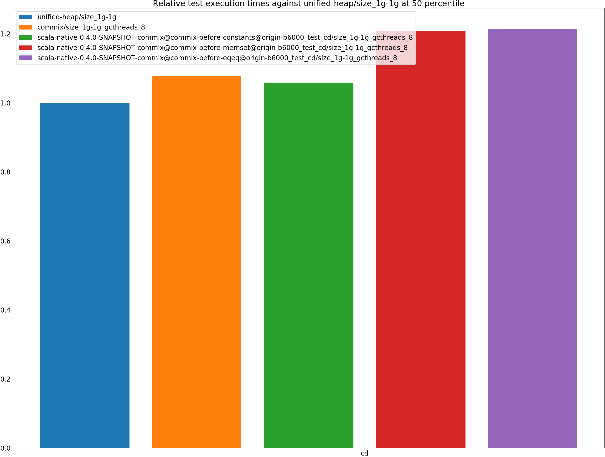

|name | unified-heap/size_1g-1g | commix/size_1g-1g_gcthreads_8 |  | scala-native-0.4.0-SNAPSHOT-commix@commix-before-constants@origin-b6000_test_cd/size_1g-1g_gcthreads_8 |  | scala-native-0.4.0-SNAPSHOT-commix@commix-before-memset@origin-b6000_test_cd/size_1g-1g_gcthreads_8 |  | scala-native-0.4.0-SNAPSHOT-commix@commix-before-eqeq@origin-b6000_test_cd/size_1g-1g_gcthreads_8 | |
| -- | -- | -- | -- | -- | -- | -- | -- | -- | -- |
|[cd.CDBenchmark](#cdcdbenchmark)|15.6587|16.8849|+7.83%|16.5771|+5.87%|18.9284|+20.88%|18.9997|+21.34%|
| __Geometrical mean:__|| |+7.83%| |+5.87%| |+20.88%| |+21.34%|
## Benchmark run time (ms) at 90 percentile 
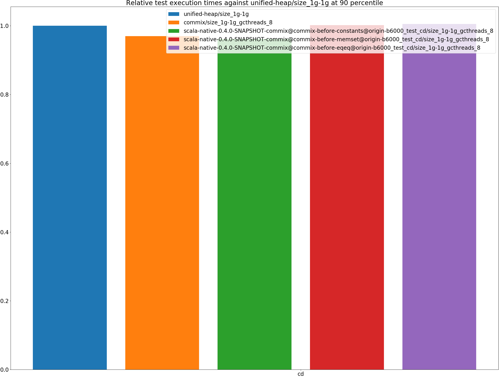

|name | unified-heap/size_1g-1g | commix/size_1g-1g_gcthreads_8 |  | scala-native-0.4.0-SNAPSHOT-commix@commix-before-constants@origin-b6000_test_cd/size_1g-1g_gcthreads_8 |  | scala-native-0.4.0-SNAPSHOT-commix@commix-before-memset@origin-b6000_test_cd/size_1g-1g_gcthreads_8 |  | scala-native-0.4.0-SNAPSHOT-commix@commix-before-eqeq@origin-b6000_test_cd/size_1g-1g_gcthreads_8 | |
| -- | -- | -- | -- | -- | -- | -- | -- | -- | -- |
|[cd.CDBenchmark](#cdcdbenchmark)|18.9603|18.3896|__-3.01%__|18.2326|__-3.84%__|18.9938|+0.18%|19.0550|+0.50%|
| __Geometrical mean:__|| |__-3.01%__| |__-3.84%__| |+0.18%| |+0.50%|
## Benchmark run time (ms) at 99 percentile 
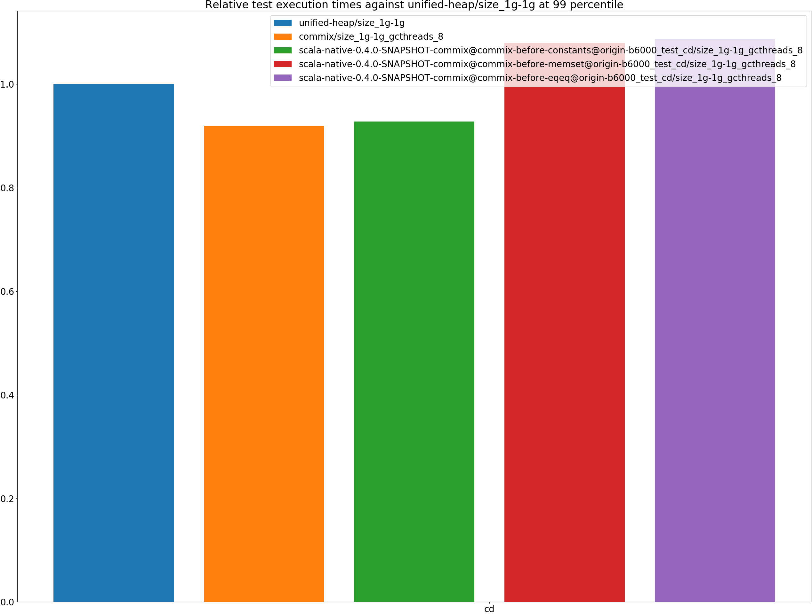

|name | unified-heap/size_1g-1g | commix/size_1g-1g_gcthreads_8 |  | scala-native-0.4.0-SNAPSHOT-commix@commix-before-constants@origin-b6000_test_cd/size_1g-1g_gcthreads_8 |  | scala-native-0.4.0-SNAPSHOT-commix@commix-before-memset@origin-b6000_test_cd/size_1g-1g_gcthreads_8 |  | scala-native-0.4.0-SNAPSHOT-commix@commix-before-eqeq@origin-b6000_test_cd/size_1g-1g_gcthreads_8 | |
| -- | -- | -- | -- | -- | -- | -- | -- | -- | -- |
|[cd.CDBenchmark](#cdcdbenchmark)|20.6242|18.9654|__-8.04%__|19.1435|__-7.18%__|22.2710|+7.98%|22.4209|+8.71%|
| __Geometrical mean:__|| |__-8.04%__| |__-7.18%__| |+7.98%| |+8.71%|
## Benchmark run time (ms) at 99.9 percentile 
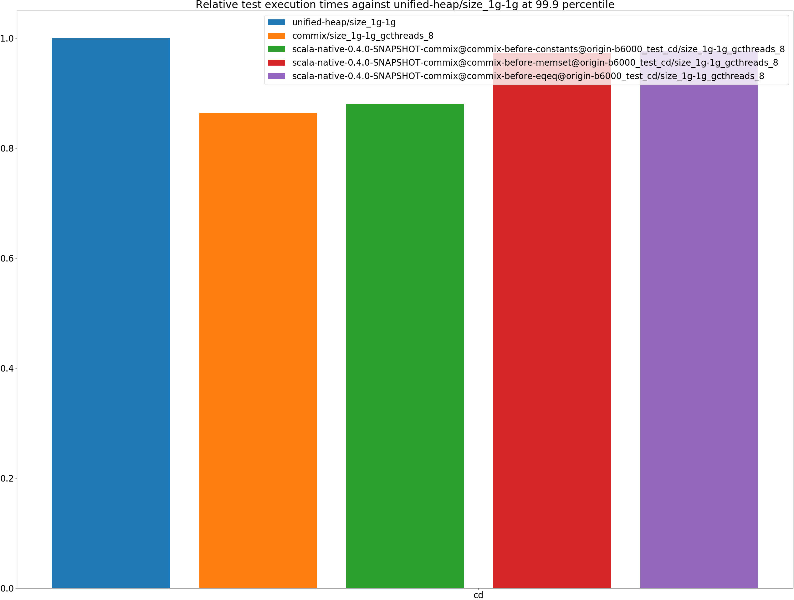

|name | unified-heap/size_1g-1g | commix/size_1g-1g_gcthreads_8 |  | scala-native-0.4.0-SNAPSHOT-commix@commix-before-constants@origin-b6000_test_cd/size_1g-1g_gcthreads_8 |  | scala-native-0.4.0-SNAPSHOT-commix@commix-before-memset@origin-b6000_test_cd/size_1g-1g_gcthreads_8 |  | scala-native-0.4.0-SNAPSHOT-commix@commix-before-eqeq@origin-b6000_test_cd/size_1g-1g_gcthreads_8 | |
| -- | -- | -- | -- | -- | -- | -- | -- | -- | -- |
|[cd.CDBenchmark](#cdcdbenchmark)|22.9745|19.8455|__-13.62%__|20.2285|__-11.95%__|22.3598|__-2.68%__|22.4616|__-2.23%__|
| __Geometrical mean:__|| |__-13.62%__| |__-11.95%__| |__-2.68%__| |__-2.23%__|
## Benchmark total run time (ms) 
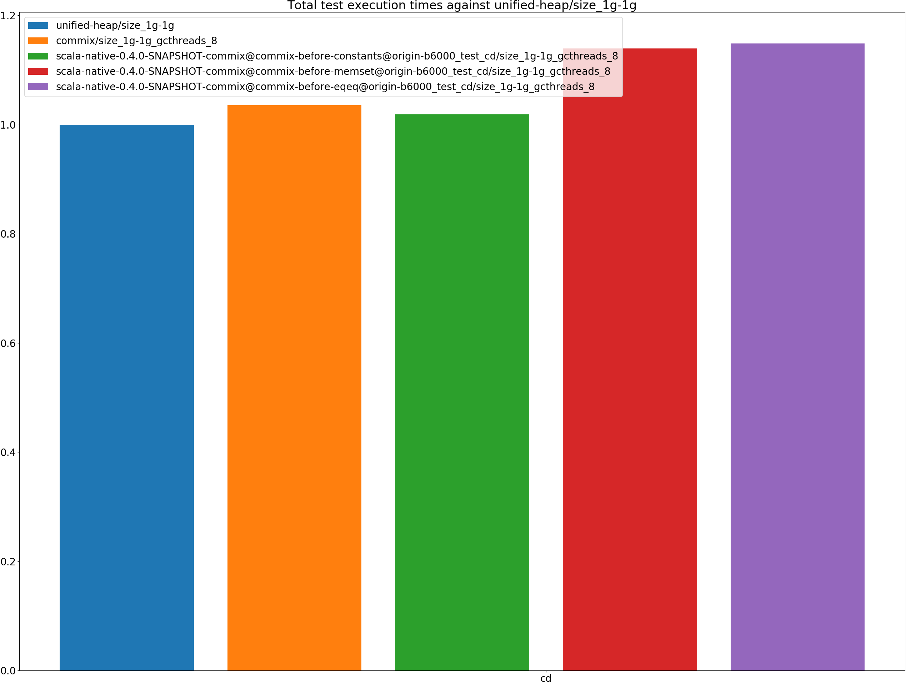

|name | unified-heap/size_1g-1g | commix/size_1g-1g_gcthreads_8 |  | scala-native-0.4.0-SNAPSHOT-commix@commix-before-constants@origin-b6000_test_cd/size_1g-1g_gcthreads_8 |  | scala-native-0.4.0-SNAPSHOT-commix@commix-before-memset@origin-b6000_test_cd/size_1g-1g_gcthreads_8 |  | scala-native-0.4.0-SNAPSHOT-commix@commix-before-eqeq@origin-b6000_test_cd/size_1g-1g_gcthreads_8 | |
| -- | -- | -- | -- | -- | -- | -- | -- | -- | -- |
|[cd.CDBenchmark](#cdcdbenchmark)|1050161.1278|1087703.3933|+3.57%|1069583.3721|+1.85%|1196188.3484|+13.91%|1205925.7150|+14.83%|
| __Geometrical mean:__|| |+3.57%| |+1.85%| |+13.91%| |+14.83%|
# Individual benchmarks
## cd.CDBenchmark
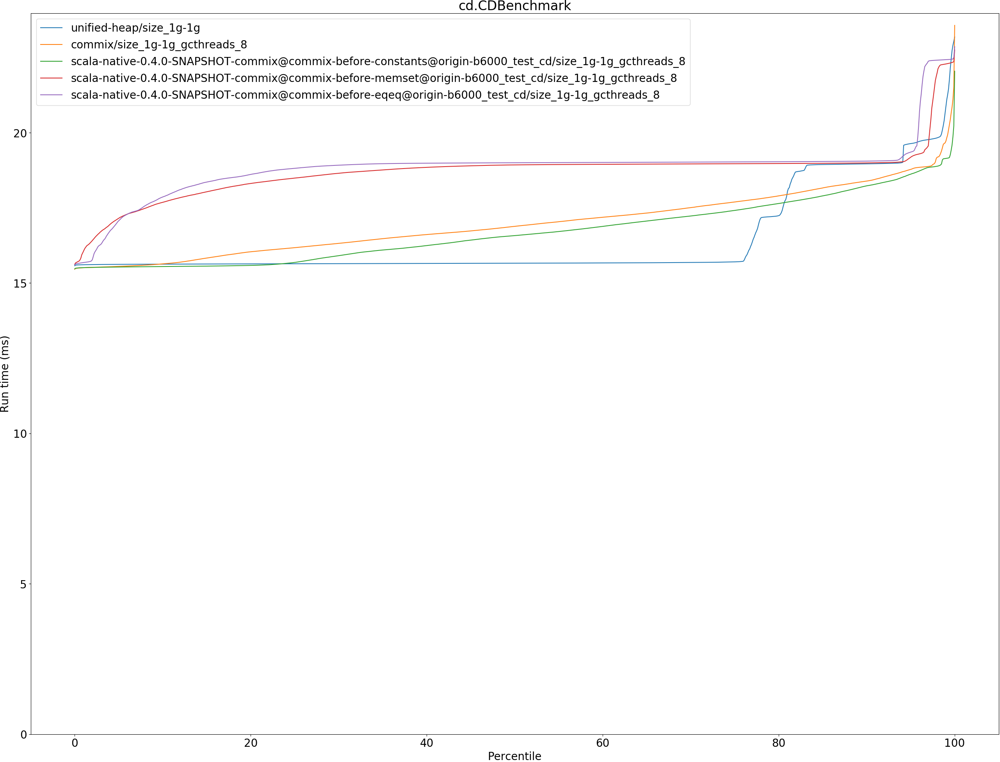

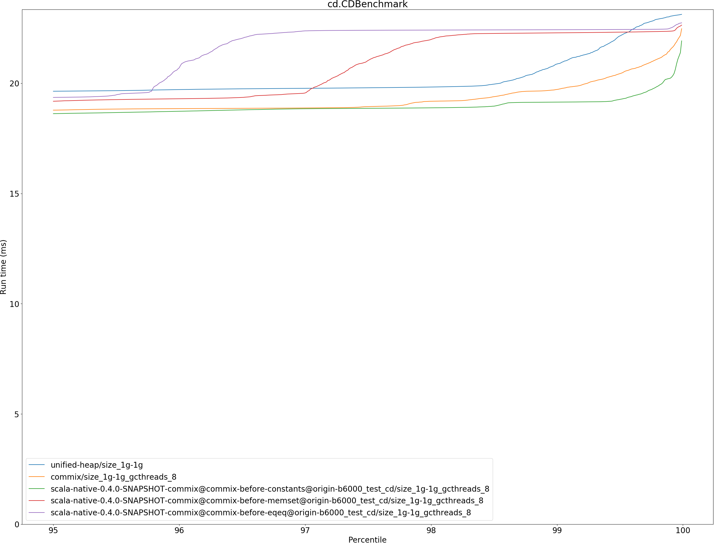

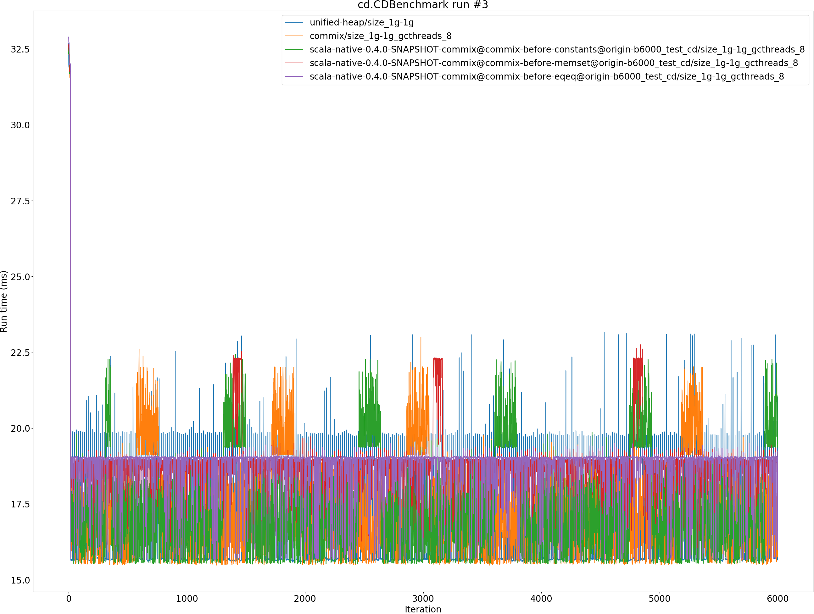

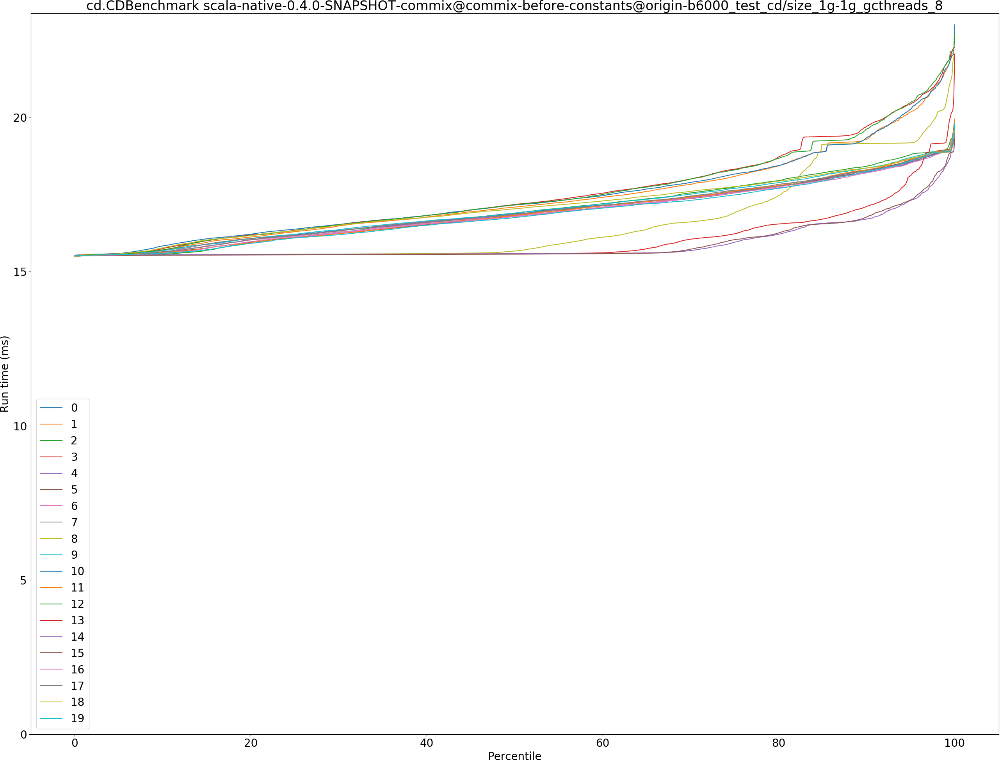

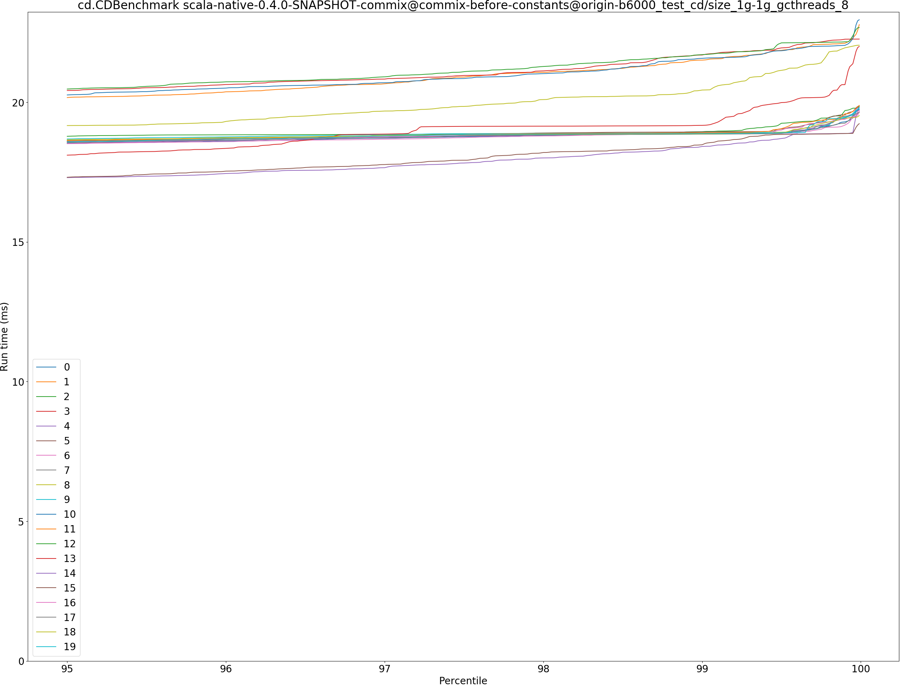

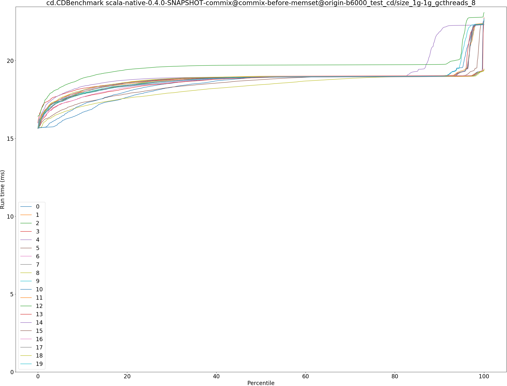

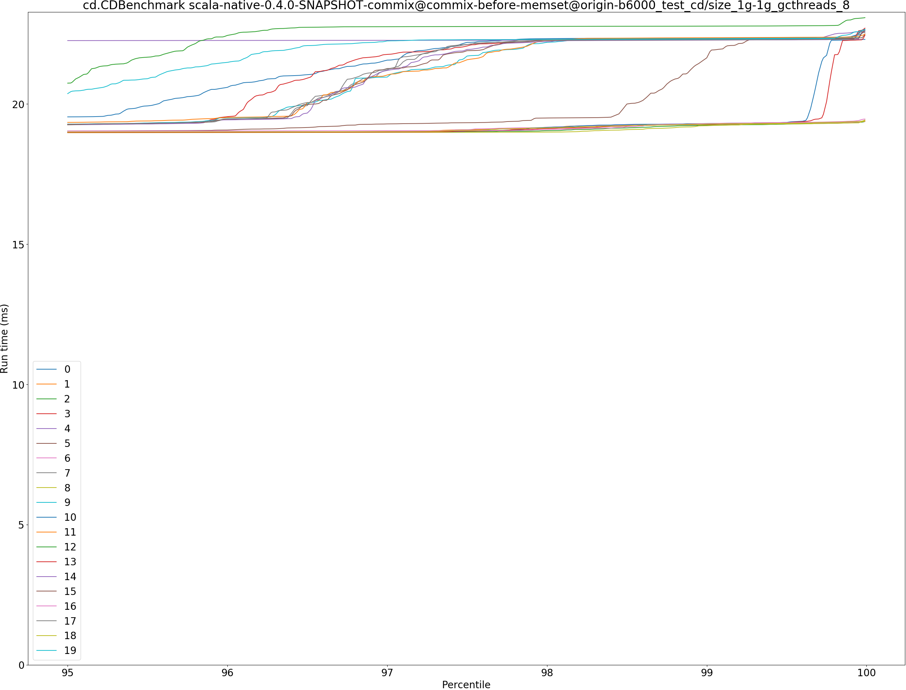

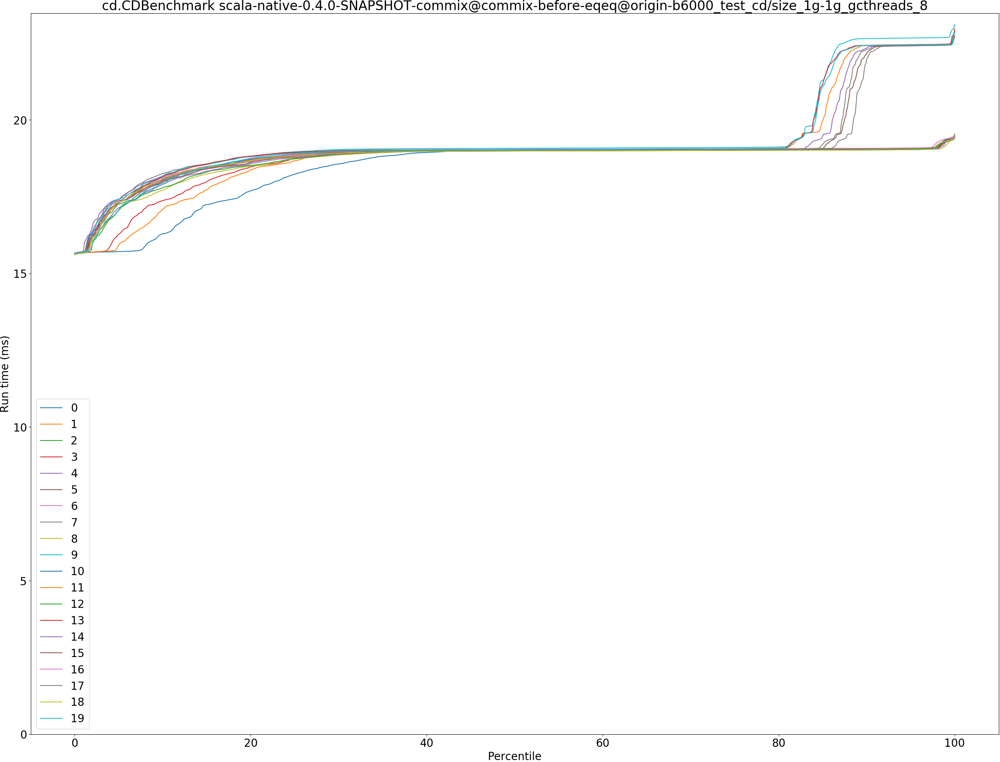

