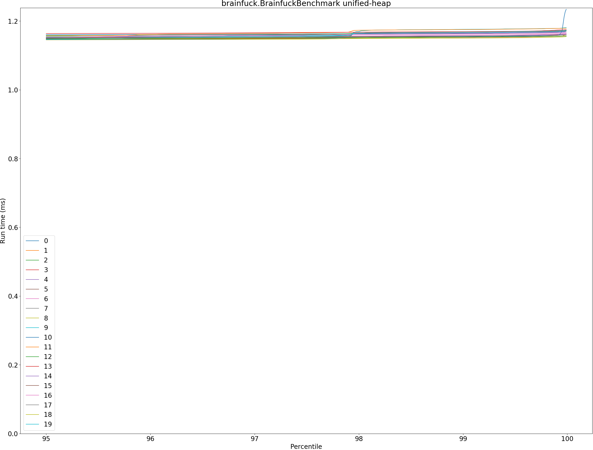
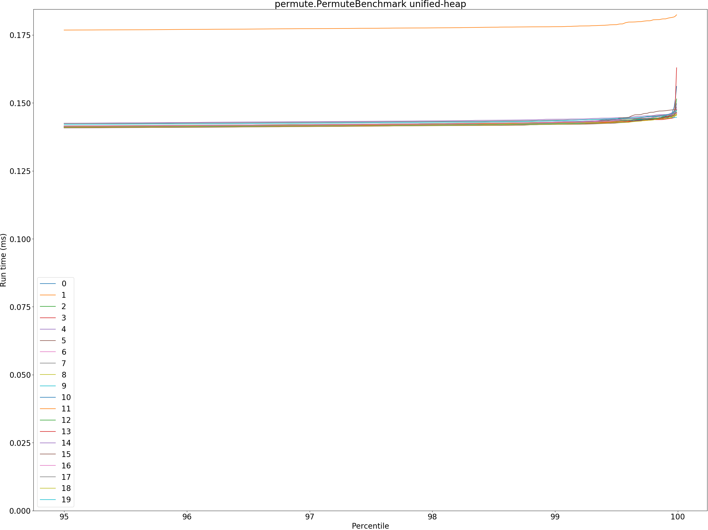
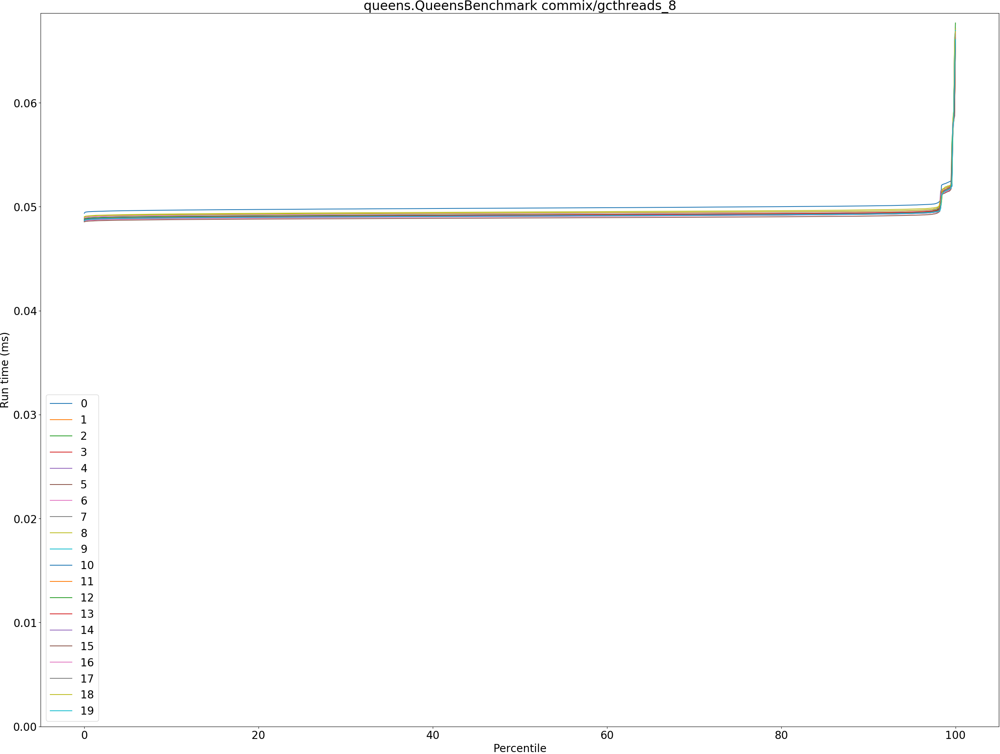
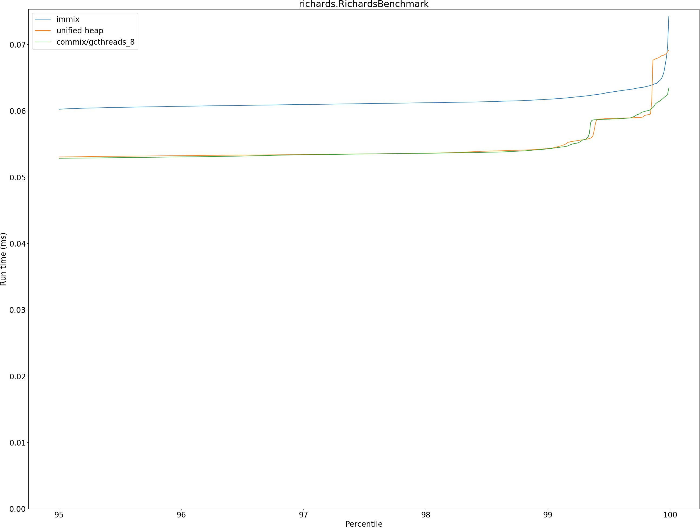

# Summary
## Benchmark run time (ms) at 50 percentile 

|name | immix | unified-heap |  | commix/gcthreads_8 | |
| -- | -- | -- | -- | -- | -- |
|[bounce.BounceBenchmark](#bouncebouncebenchmark)|0.0157|0.0149|__-4.77%__|0.0150|__-4.27%__|
|[brainfuck.BrainfuckBenchmark](#brainfuckbrainfuckbenchmark)|1.2513|1.1106|__-11.25%__|1.1031|__-11.85%__|
|[cd.CDBenchmark](#cdcdbenchmark)|20.1290|16.3921|__-18.56%__|16.3150|__-18.95%__|
|[deltablue.DeltaBlueBenchmark](#deltabluedeltabluebenchmark)|0.1320|0.1272|__-3.68%__|0.1266|__-4.12%__|
|[gcbench.GCBenchBenchmark](#gcbenchgcbenchbenchmark)|80.6691|76.7033|__-4.92%__|63.8236|__-20.88%__|
|[json.JsonBenchmark](#jsonjsonbenchmark)|1.1278|0.7997|__-29.09%__|0.8160|__-27.65%__|
|[kmeans.KmeansBenchmark](#kmeanskmeansbenchmark)|22.6223|19.8906|__-12.08%__|19.6813|__-13.00%__|
|[nbody.NbodyBenchmark](#nbodynbodybenchmark)|19.2821|19.2773|__-0.03%__|19.2773|__-0.03%__|
|[permute.PermuteBenchmark](#permutepermutebenchmark)|0.1352|0.1221|__-9.66%__|0.1248|__-7.72%__|
|[queens.QueensBenchmark](#queensqueensbenchmark)|0.0517|0.0495|__-4.27%__|0.0491|__-4.94%__|
|[richards.RichardsBenchmark](#richardsrichardsbenchmark)|0.0514|0.0507|__-1.50%__|0.0508|__-1.17%__|
|[sudoku.SudokuBenchmark](#sudokusudokubenchmark)|1.4977|1.4222|__-5.05%__|1.4642|__-2.24%__|
|[tracer.TracerBenchmark](#tracertracerbenchmark)|0.5199|0.4582|__-11.87%__|0.4580|__-11.91%__|
| __Geometrical mean:__|| |__-9.33%__| |__-10.29%__|
## Benchmark run time (ms) at 90 percentile 

|name | immix | unified-heap |  | commix/gcthreads_8 | |
| -- | -- | -- | -- | -- | -- |
|[bounce.BounceBenchmark](#bouncebouncebenchmark)|0.0159|0.0151|__-4.72%__|0.0152|__-4.21%__|
|[brainfuck.BrainfuckBenchmark](#brainfuckbrainfuckbenchmark)|1.2699|1.1455|__-9.80%__|1.1420|__-10.07%__|
|[cd.CDBenchmark](#cdcdbenchmark)|22.9054|16.5298|__-27.83%__|16.4641|__-28.12%__|
|[deltablue.DeltaBlueBenchmark](#deltabluedeltabluebenchmark)|0.1345|0.1289|__-4.18%__|0.1288|__-4.25%__|
|[gcbench.GCBenchBenchmark](#gcbenchgcbenchbenchmark)|84.4396|79.7645|__-5.54%__|65.5549|__-22.36%__|
|[json.JsonBenchmark](#jsonjsonbenchmark)|1.5170|1.0629|__-29.94%__|0.9261|__-38.96%__|
|[kmeans.KmeansBenchmark](#kmeanskmeansbenchmark)|24.7776|20.7372|__-16.31%__|20.6648|__-16.60%__|
|[nbody.NbodyBenchmark](#nbodynbodybenchmark)|19.3227|19.2787|__-0.23%__|19.2786|__-0.23%__|
|[permute.PermuteBenchmark](#permutepermutebenchmark)|0.1470|0.1391|__-5.37%__|0.1361|__-7.41%__|
|[queens.QueensBenchmark](#queensqueensbenchmark)|0.0520|0.0499|__-3.92%__|0.0493|__-5.08%__|
|[richards.RichardsBenchmark](#richardsrichardsbenchmark)|0.0532|0.0523|__-1.70%__|0.0522|__-1.83%__|
|[sudoku.SudokuBenchmark](#sudokusudokubenchmark)|1.7515|1.5076|__-13.93%__|1.5694|__-10.40%__|
|[tracer.TracerBenchmark](#tracertracerbenchmark)|0.5243|0.4628|__-11.73%__|0.4632|__-11.66%__|
| __Geometrical mean:__|| |__-10.90%__| |__-13.16%__|
## Benchmark run time (ms) at 99 percentile 

|name | immix | unified-heap |  | commix/gcthreads_8 | |
| -- | -- | -- | -- | -- | -- |
|[bounce.BounceBenchmark](#bouncebouncebenchmark)|0.0161|0.0154|__-4.58%__|0.0155|__-3.79%__|
|[brainfuck.BrainfuckBenchmark](#brainfuckbrainfuckbenchmark)|1.2982|1.1606|__-10.60%__|1.1570|__-10.88%__|
|[cd.CDBenchmark](#cdcdbenchmark)|23.6261|17.2592|__-26.95%__|18.2952|__-22.56%__|
|[deltablue.DeltaBlueBenchmark](#deltabluedeltabluebenchmark)|0.1890|0.1781|__-5.74%__|0.1793|__-5.13%__|
|[gcbench.GCBenchBenchmark](#gcbenchgcbenchbenchmark)|87.1679|80.9429|__-7.14%__|66.4265|__-23.79%__|
|[json.JsonBenchmark](#jsonjsonbenchmark)|1.5362|1.1122|__-27.60%__|1.1501|__-25.14%__|
|[kmeans.KmeansBenchmark](#kmeanskmeansbenchmark)|30.7392|21.1757|__-31.11%__|21.0851|__-31.41%__|
|[nbody.NbodyBenchmark](#nbodynbodybenchmark)|20.7409|19.2981|__-6.96%__|19.2814|__-7.04%__|
|[permute.PermuteBenchmark](#permutepermutebenchmark)|0.1507|0.1425|__-5.45%__|0.1479|__-1.88%__|
|[queens.QueensBenchmark](#queensqueensbenchmark)|0.0543|0.0518|__-4.48%__|0.0516|__-4.88%__|
|[richards.RichardsBenchmark](#richardsrichardsbenchmark)|0.0617|0.0544|__-11.94%__|0.0542|__-12.17%__|
|[sudoku.SudokuBenchmark](#sudokusudokubenchmark)|1.7728|1.6518|__-6.82%__|1.6454|__-7.18%__|
|[tracer.TracerBenchmark](#tracertracerbenchmark)|0.5279|0.4660|__-11.73%__|0.4668|__-11.57%__|
| __Geometrical mean:__|| |__-12.92%__| |__-13.40%__|
## Benchmark run time (ms) at 99.9 percentile 

|name | immix | unified-heap |  | commix/gcthreads_8 | |
| -- | -- | -- | -- | -- | -- |
|[bounce.BounceBenchmark](#bouncebouncebenchmark)|0.0274|0.0219|__-20.25%__|0.0246|__-10.32%__|
|[brainfuck.BrainfuckBenchmark](#brainfuckbrainfuckbenchmark)|1.3037|1.1692|__-10.32%__|1.1912|__-8.63%__|
|[cd.CDBenchmark](#cdcdbenchmark)|26.1800|20.2687|__-22.58%__|19.4420|__-25.74%__|
|[deltablue.DeltaBlueBenchmark](#deltabluedeltabluebenchmark)|0.2042|0.1853|__-9.25%__|0.1886|__-7.60%__|
|[gcbench.GCBenchBenchmark](#gcbenchgcbenchbenchmark)|96.5476|81.6768|__-15.40%__|75.1851|__-22.13%__|
|[json.JsonBenchmark](#jsonjsonbenchmark)|1.5470|1.1241|__-27.34%__|1.1714|__-24.28%__|
|[kmeans.KmeansBenchmark](#kmeanskmeansbenchmark)|35.1348|21.2800|__-39.43%__|28.6963|__-18.33%__|
|[nbody.NbodyBenchmark](#nbodynbodybenchmark)|28.6468|28.5499|__-0.34%__|19.2884|__-32.67%__|
|[permute.PermuteBenchmark](#permutepermutebenchmark)|0.1534|0.1450|__-5.47%__|0.1506|__-1.80%__|
|[queens.QueensBenchmark](#queensqueensbenchmark)|0.0647|0.0680|+4.98%|0.0639|__-1.35%__|
|[richards.RichardsBenchmark](#richardsrichardsbenchmark)|0.0643|0.0679|+5.67%|0.0612|__-4.79%__|
|[sudoku.SudokuBenchmark](#sudokusudokubenchmark)|1.7816|1.6847|__-5.44%__|1.6870|__-5.31%__|
|[tracer.TracerBenchmark](#tracertracerbenchmark)|0.5307|0.4686|__-11.70%__|0.4705|__-11.34%__|
| __Geometrical mean:__|| |__-13.01%__| |__-13.98%__|
## Benchmark total run time (ms) 

|name | immix | unified-heap |  | commix/gcthreads_8 | |
| -- | -- | -- | -- | -- | -- |
|[bounce.BounceBenchmark](#bouncebouncebenchmark)|1003.6182|956.1604|__-4.73%__|960.9325|__-4.25%__|
|[brainfuck.BrainfuckBenchmark](#brainfuckbrainfuckbenchmark)|77959.2376|70695.1806|__-9.32%__|70856.7718|__-9.11%__|
|[cd.CDBenchmark](#cdcdbenchmark)|1317827.3472|1051934.9033|__-20.18%__|1049767.6964|__-20.34%__|
|[deltablue.DeltaBlueBenchmark](#deltabluedeltabluebenchmark)|8626.8423|8273.9066|__-4.09%__|8238.3563|__-4.50%__|
|[gcbench.GCBenchBenchmark](#gcbenchgcbenchbenchmark)|5230554.7532|4872374.3329|__-6.85%__|4116540.3907|__-21.30%__|
|[json.JsonBenchmark](#jsonjsonbenchmark)|75652.3681|55093.7061|__-27.18%__|53905.4553|__-28.75%__|
|[kmeans.KmeansBenchmark](#kmeanskmeansbenchmark)|1472279.4059|1279040.5890|__-13.13%__|1278602.0905|__-13.15%__|
|[nbody.NbodyBenchmark](#nbodynbodybenchmark)|1236782.3793|1234671.7316|__-0.17%__|1230505.9653|__-0.51%__|
|[permute.PermuteBenchmark](#permutepermutebenchmark)|8806.1766|7948.7040|__-9.74%__|8130.8808|__-7.67%__|
|[queens.QueensBenchmark](#queensqueensbenchmark)|3311.3381|3173.6736|__-4.16%__|3148.3356|__-4.92%__|
|[richards.RichardsBenchmark](#richardsrichardsbenchmark)|3339.0357|3265.9818|__-2.19%__|3273.9625|__-1.95%__|
|[sudoku.SudokuBenchmark](#sudokusudokubenchmark)|97802.4858|92653.3428|__-5.26%__|95258.4653|__-2.60%__|
|[tracer.TracerBenchmark](#tracertracerbenchmark)|32997.8425|28894.1991|__-12.44%__|28934.0523|__-12.32%__|
| __Geometrical mean:__|| |__-9.50%__| |__-10.52%__|
# Individual benchmarks
## bounce.BounceBenchmark

## brainfuck.BrainfuckBenchmark

## cd.CDBenchmark

## deltablue.DeltaBlueBenchmark

## gcbench.GCBenchBenchmark

## json.JsonBenchmark

## kmeans.KmeansBenchmark

## nbody.NbodyBenchmark

## permute.PermuteBenchmark

## queens.QueensBenchmark

## richards.RichardsBenchmark

## sudoku.SudokuBenchmark

## tracer.TracerBenchmark

