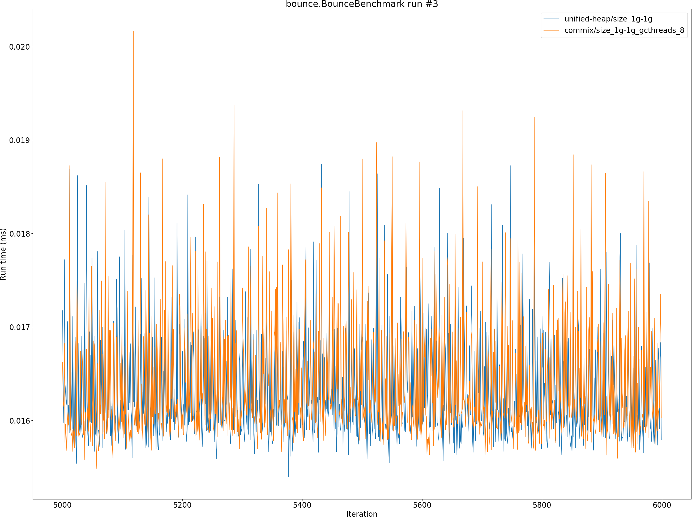
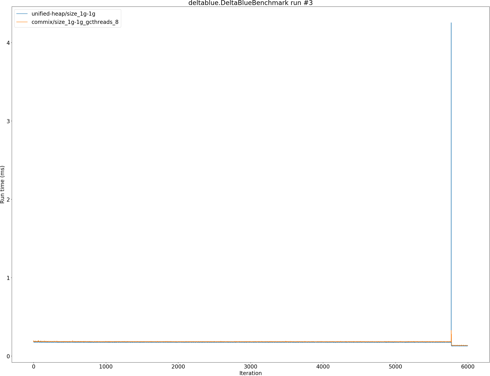
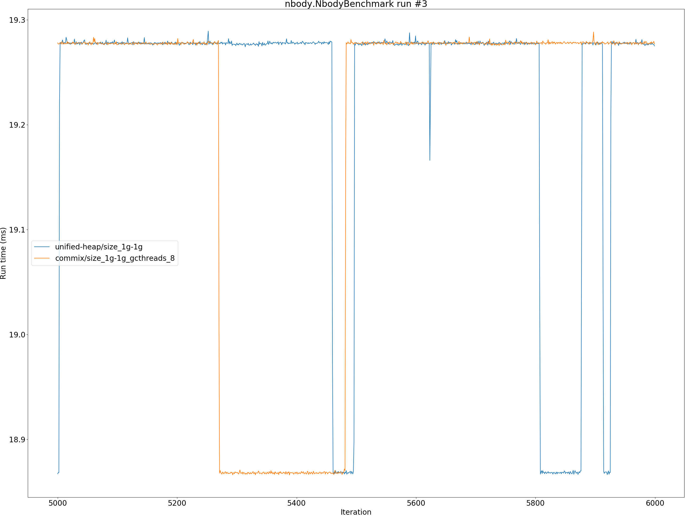

# Summary
## Benchmark run time (ms) at 50 percentile 

|name | unified-heap/size_1g-1g | commix/size_1g-1g_gcthreads_8 | |
| -- | -- | -- | -- |
|[bounce.BounceBenchmark](#bouncebouncebenchmark)|0.0161|0.0162|+0.70%|
|[brainfuck.BrainfuckBenchmark](#brainfuckbrainfuckbenchmark)|1.0798|1.0889|+0.84%|
|[cd.CDBenchmark](#cdcdbenchmark)|16.1860|16.0996|__-0.53%__|
|[deltablue.DeltaBlueBenchmark](#deltabluedeltabluebenchmark)|0.1752|0.1744|__-0.45%__|
|[gcbench.GCBenchBenchmark](#gcbenchgcbenchbenchmark)|66.7520|63.6514|__-4.64%__|
|[json.JsonBenchmark](#jsonjsonbenchmark)|0.8217|0.8268|+0.61%|
|[kmeans.KmeansBenchmark](#kmeanskmeansbenchmark)|19.8252|19.8159|__-0.05%__|
|[nbody.NbodyBenchmark](#nbodynbodybenchmark)|19.2773|19.2772|__-0.00%__|
|[permute.PermuteBenchmark](#permutepermutebenchmark)|0.1229|0.1257|+2.34%|
|[queens.QueensBenchmark](#queensqueensbenchmark)|0.0528|0.0524|__-0.76%__|
|[richards.RichardsBenchmark](#richardsrichardsbenchmark)|0.0539|0.0541|+0.40%|
|[sudoku.SudokuBenchmark](#sudokusudokubenchmark)|1.4260|1.4633|+2.62%|
|[tracer.TracerBenchmark](#tracertracerbenchmark)|0.4569|0.4567|__-0.04%__|
| __Geometrical mean:__|| |+0.07%|
## Benchmark run time (ms) at 90 percentile 

|name | unified-heap/size_1g-1g | commix/size_1g-1g_gcthreads_8 | |
| -- | -- | -- | -- |
|[bounce.BounceBenchmark](#bouncebouncebenchmark)|0.0171|0.0173|+1.36%|
|[brainfuck.BrainfuckBenchmark](#brainfuckbrainfuckbenchmark)|1.0853|1.0941|+0.81%|
|[cd.CDBenchmark](#cdcdbenchmark)|19.1555|19.1047|__-0.27%__|
|[deltablue.DeltaBlueBenchmark](#deltabluedeltabluebenchmark)|0.1770|0.1764|__-0.37%__|
|[gcbench.GCBenchBenchmark](#gcbenchgcbenchbenchmark)|68.7047|65.2223|__-5.07%__|
|[json.JsonBenchmark](#jsonjsonbenchmark)|0.8304|0.8350|+0.56%|
|[kmeans.KmeansBenchmark](#kmeanskmeansbenchmark)|20.1316|20.1194|__-0.06%__|
|[nbody.NbodyBenchmark](#nbodynbodybenchmark)|19.2786|19.2785|__-0.00%__|
|[permute.PermuteBenchmark](#permutepermutebenchmark)|0.2254|0.2285|+1.37%|
|[queens.QueensBenchmark](#queensqueensbenchmark)|0.0539|0.0539|+0.08%|
|[richards.RichardsBenchmark](#richardsrichardsbenchmark)|0.0555|0.0560|+0.90%|
|[sudoku.SudokuBenchmark](#sudokusudokubenchmark)|1.4773|1.5165|+2.65%|
|[tracer.TracerBenchmark](#tracertracerbenchmark)|0.4609|0.4610|+0.02%|
| __Geometrical mean:__|| |+0.14%|
## Benchmark run time (ms) at 99 percentile 

|name | unified-heap/size_1g-1g | commix/size_1g-1g_gcthreads_8 | |
| -- | -- | -- | -- |
|[bounce.BounceBenchmark](#bouncebouncebenchmark)|0.0183|0.0187|+2.46%|
|[brainfuck.BrainfuckBenchmark](#brainfuckbrainfuckbenchmark)|1.0905|1.1009|+0.95%|
|[cd.CDBenchmark](#cdcdbenchmark)|22.0622|20.0786|__-8.99%__|
|[deltablue.DeltaBlueBenchmark](#deltabluedeltabluebenchmark)|0.1794|0.1789|__-0.28%__|
|[gcbench.GCBenchBenchmark](#gcbenchgcbenchbenchmark)|76.7014|66.0122|__-13.94%__|
|[json.JsonBenchmark](#jsonjsonbenchmark)|0.8394|0.8718|+3.86%|
|[kmeans.KmeansBenchmark](#kmeanskmeansbenchmark)|22.8109|20.4134|__-10.51%__|
|[nbody.NbodyBenchmark](#nbodynbodybenchmark)|19.2814|19.2811|__-0.00%__|
|[permute.PermuteBenchmark](#permutepermutebenchmark)|0.2290|0.2325|+1.50%|
|[queens.QueensBenchmark](#queensqueensbenchmark)|0.0551|0.0557|+1.14%|
|[richards.RichardsBenchmark](#richardsrichardsbenchmark)|0.0585|0.0582|__-0.42%__|
|[sudoku.SudokuBenchmark](#sudokusudokubenchmark)|1.4886|1.5448|+3.77%|
|[tracer.TracerBenchmark](#tracertracerbenchmark)|0.4652|0.4664|+0.28%|
| __Geometrical mean:__|| |__-1.71%__|
## Benchmark run time (ms) at 99.9 percentile 

|name | unified-heap/size_1g-1g | commix/size_1g-1g_gcthreads_8 | |
| -- | -- | -- | -- |
|[bounce.BounceBenchmark](#bouncebouncebenchmark)|0.0193|0.0199|+3.18%|
|[brainfuck.BrainfuckBenchmark](#brainfuckbrainfuckbenchmark)|5.1409|2.1712|__-57.77%__|
|[cd.CDBenchmark](#cdcdbenchmark)|23.2788|22.5465|__-3.15%__|
|[deltablue.DeltaBlueBenchmark](#deltabluedeltabluebenchmark)|0.1821|0.2706|+48.57%|
|[gcbench.GCBenchBenchmark](#gcbenchgcbenchbenchmark)|79.0867|66.4893|__-15.93%__|
|[json.JsonBenchmark](#jsonjsonbenchmark)|5.1083|2.0370|__-60.12%__|
|[kmeans.KmeansBenchmark](#kmeanskmeansbenchmark)|23.3960|20.7345|__-11.38%__|
|[nbody.NbodyBenchmark](#nbodynbodybenchmark)|19.2887|19.2890|+0.00%|
|[permute.PermuteBenchmark](#permutepermutebenchmark)|0.2319|0.4498|+93.93%|
|[queens.QueensBenchmark](#queensqueensbenchmark)|0.0564|0.0567|+0.49%|
|[richards.RichardsBenchmark](#richardsrichardsbenchmark)|0.0626|0.0614|__-1.88%__|
|[sudoku.SudokuBenchmark](#sudokusudokubenchmark)|5.7166|1.9725|__-65.50%__|
|[tracer.TracerBenchmark](#tracertracerbenchmark)|4.4890|1.1380|__-74.65%__|
| __Geometrical mean:__|| |__-23.42%__|
## Benchmark total run time (ms) 

|name | unified-heap/size_1g-1g | commix/size_1g-1g_gcthreads_8 | |
| -- | -- | -- | -- |
|[bounce.BounceBenchmark](#bouncebouncebenchmark)|1042.7215|1052.3422|+0.92%|
|[brainfuck.BrainfuckBenchmark](#brainfuckbrainfuckbenchmark)|69627.4355|69891.5019|+0.38%|
|[cd.CDBenchmark](#cdcdbenchmark)|1106147.6417|1079739.8913|__-2.39%__|
|[deltablue.DeltaBlueBenchmark](#deltabluedeltabluebenchmark)|11116.8768|11016.8894|__-0.90%__|
|[gcbench.GCBenchBenchmark](#gcbenchgcbenchbenchmark)|4209062.0237|4088416.2541|__-2.87%__|
|[json.JsonBenchmark](#jsonjsonbenchmark)|54062.8306|53354.8993|__-1.31%__|
|[kmeans.KmeansBenchmark](#kmeanskmeansbenchmark)|1274524.3480|1271121.8144|__-0.27%__|
|[nbody.NbodyBenchmark](#nbodynbodybenchmark)|1229436.4661|1229665.9777|+0.02%|
|[permute.PermuteBenchmark](#permutepermutebenchmark)|8798.0362|8889.1362|+1.04%|
|[queens.QueensBenchmark](#queensqueensbenchmark)|3384.6963|3367.8275|__-0.50%__|
|[richards.RichardsBenchmark](#richardsrichardsbenchmark)|3467.7121|3484.7052|+0.49%|
|[sudoku.SudokuBenchmark](#sudokusudokubenchmark)|92359.3064|94647.2347|+2.48%|
|[tracer.TracerBenchmark](#tracertracerbenchmark)|29781.8605|29385.1165|__-1.33%__|
| __Geometrical mean:__|| |__-0.34%__|
# Individual benchmarks
## bounce.BounceBenchmark

## brainfuck.BrainfuckBenchmark

## cd.CDBenchmark

## deltablue.DeltaBlueBenchmark

## gcbench.GCBenchBenchmark

## json.JsonBenchmark

## kmeans.KmeansBenchmark

## nbody.NbodyBenchmark

## permute.PermuteBenchmark

## queens.QueensBenchmark

## richards.RichardsBenchmark

