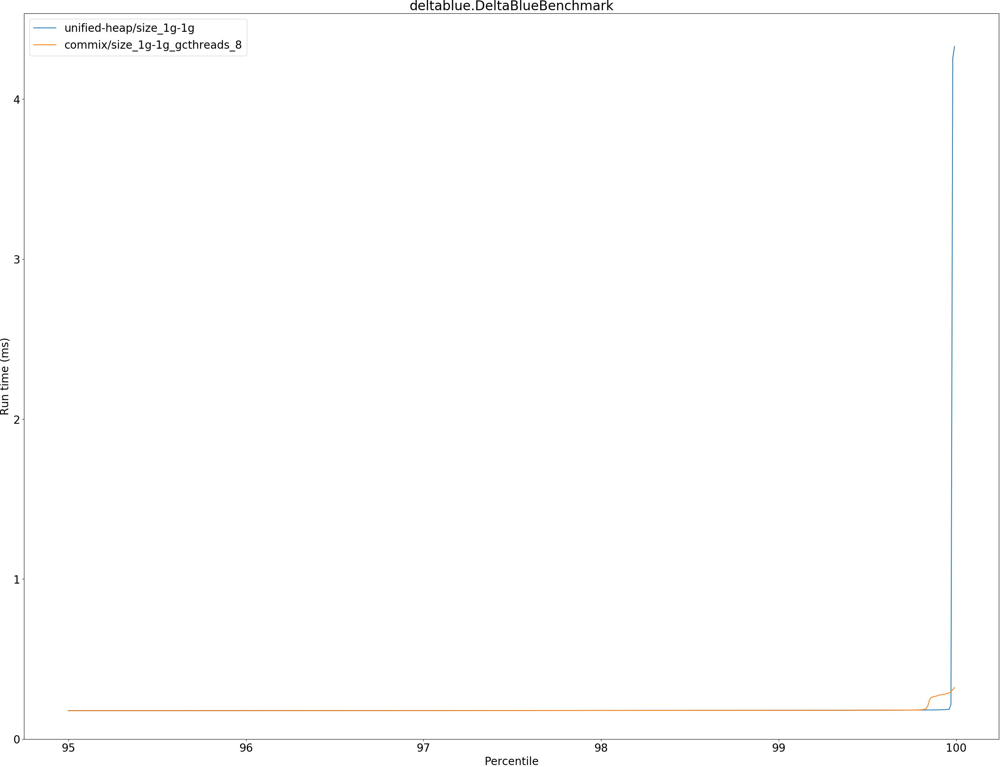

# Summary
## Benchmark run time (ms) at 50 percentile 

|name | unified-heap/size_1g-1g | commix/size_1g-1g_gcthreads_8 | |
| -- | -- | -- | -- |
|[deltablue.DeltaBlueBenchmark](#deltabluedeltabluebenchmark)|0.1752|0.1744|__-0.45%__|
| __Geometrical mean:__|| |__-0.45%__|
## Benchmark run time (ms) at 90 percentile 

|name | unified-heap/size_1g-1g | commix/size_1g-1g_gcthreads_8 | |
| -- | -- | -- | -- |
|[deltablue.DeltaBlueBenchmark](#deltabluedeltabluebenchmark)|0.1770|0.1764|__-0.37%__|
| __Geometrical mean:__|| |__-0.37%__|
## Benchmark run time (ms) at 99 percentile 

|name | unified-heap/size_1g-1g | commix/size_1g-1g_gcthreads_8 | |
| -- | -- | -- | -- |
|[deltablue.DeltaBlueBenchmark](#deltabluedeltabluebenchmark)|0.1794|0.1789|__-0.28%__|
| __Geometrical mean:__|| |__-0.28%__|
## Benchmark run time (ms) at 99.9 percentile 

|name | unified-heap/size_1g-1g | commix/size_1g-1g_gcthreads_8 | |
| -- | -- | -- | -- |
|[deltablue.DeltaBlueBenchmark](#deltabluedeltabluebenchmark)|0.1821|0.2706|+48.57%|
| __Geometrical mean:__|| |+48.57%|
## Benchmark total run time (ms) 

|name | unified-heap/size_1g-1g | commix/size_1g-1g_gcthreads_8 | |
| -- | -- | -- | -- |
|[deltablue.DeltaBlueBenchmark](#deltabluedeltabluebenchmark)|11116.8768|11016.8894|__-0.90%__|
| __Geometrical mean:__|| |__-0.90%__|
# Individual benchmarks
## deltablue.DeltaBlueBenchmark

