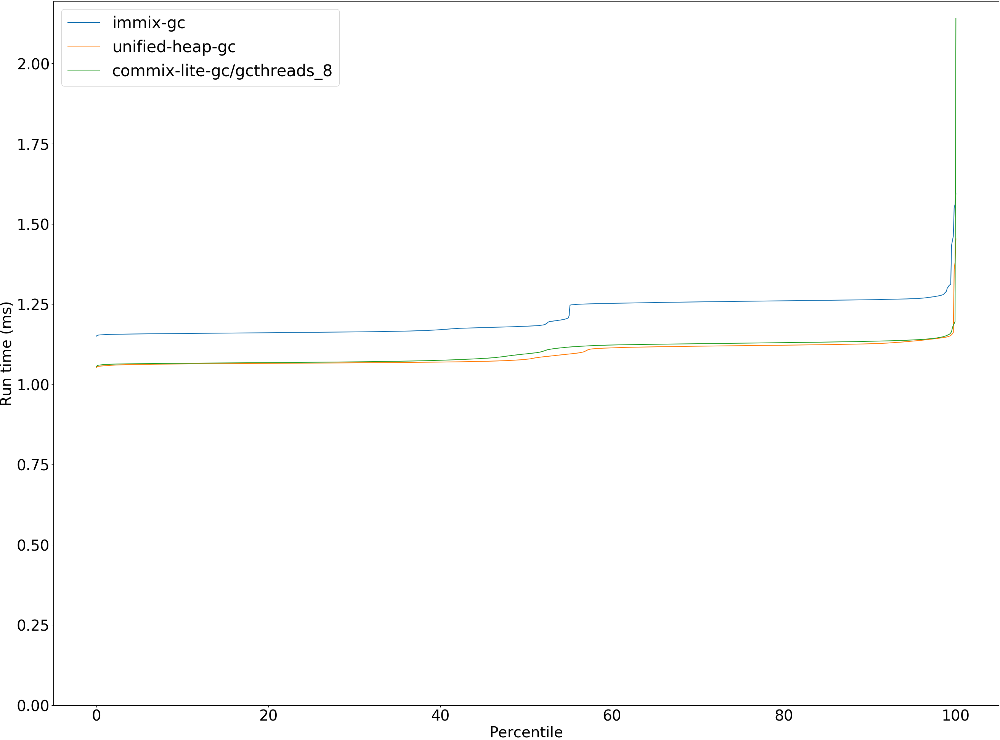
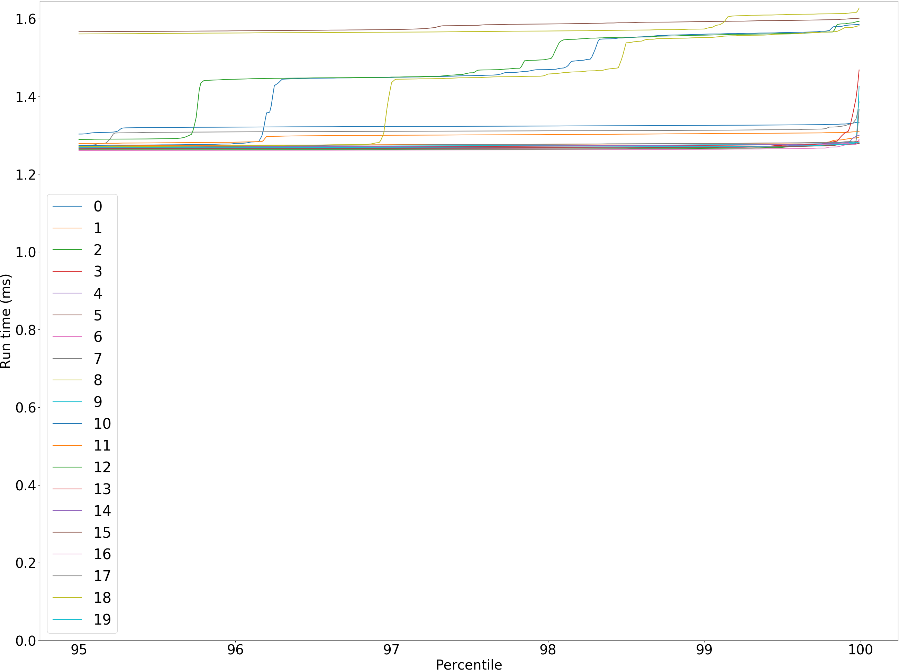
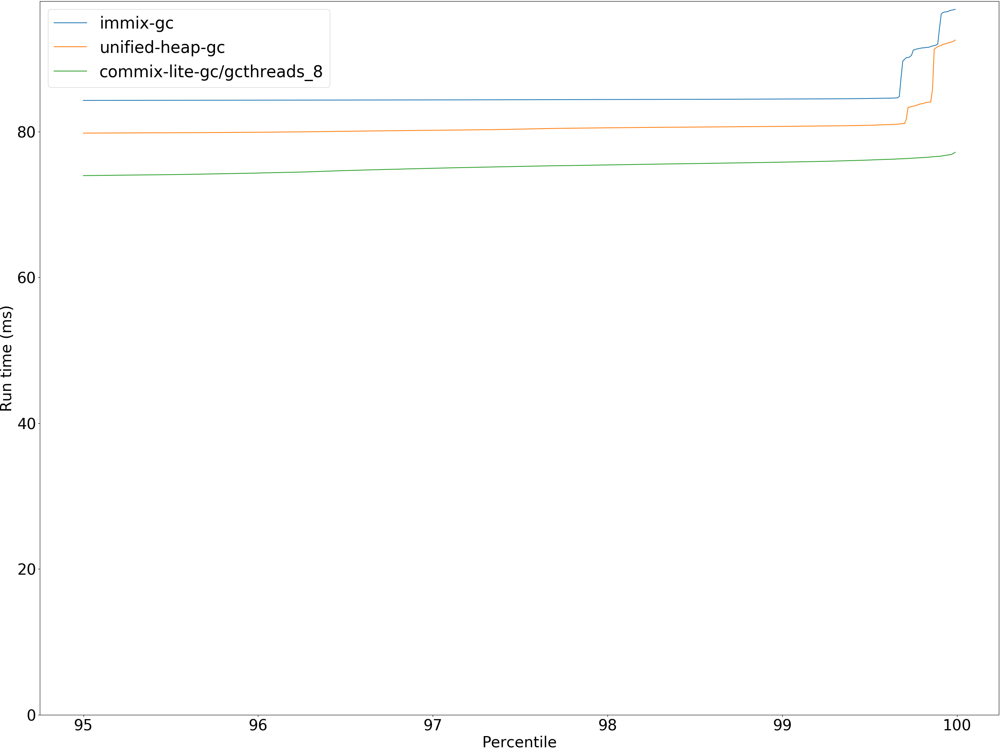
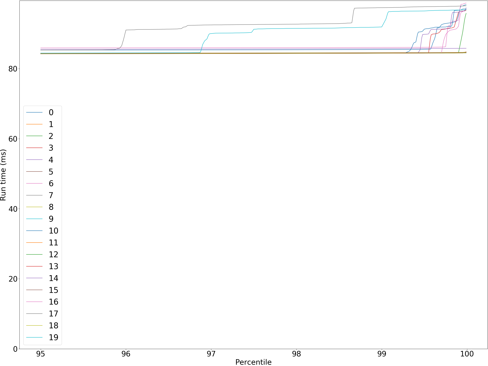
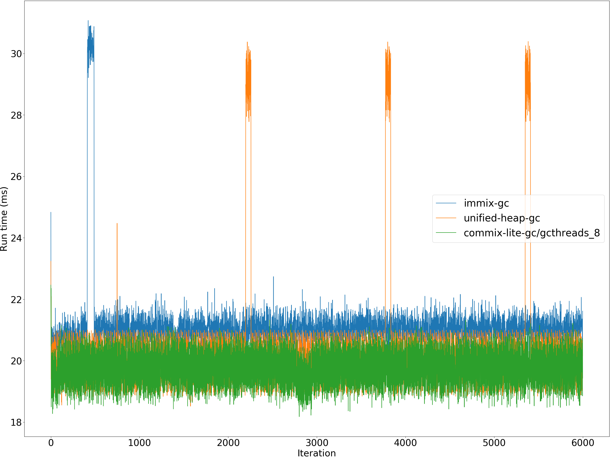
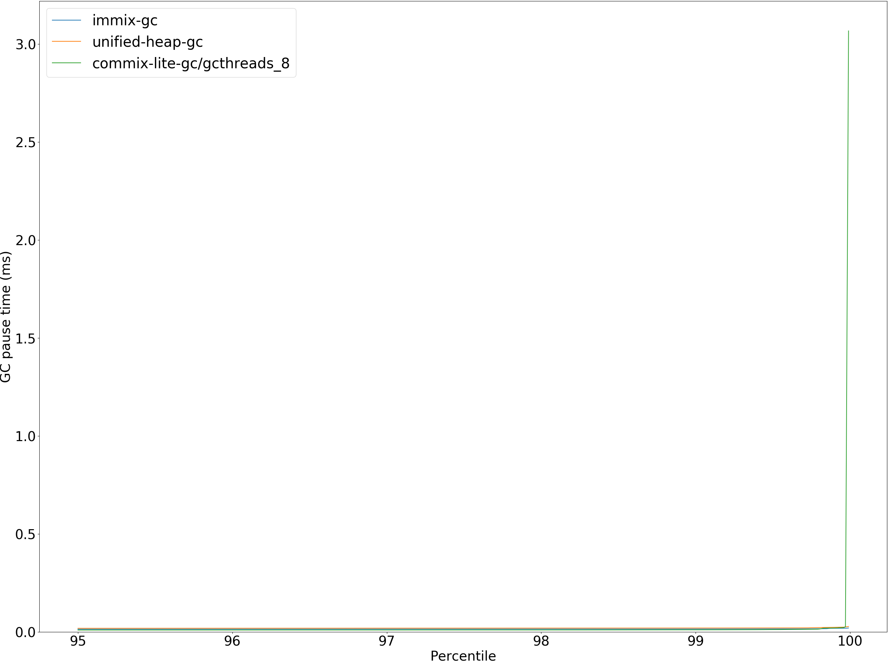
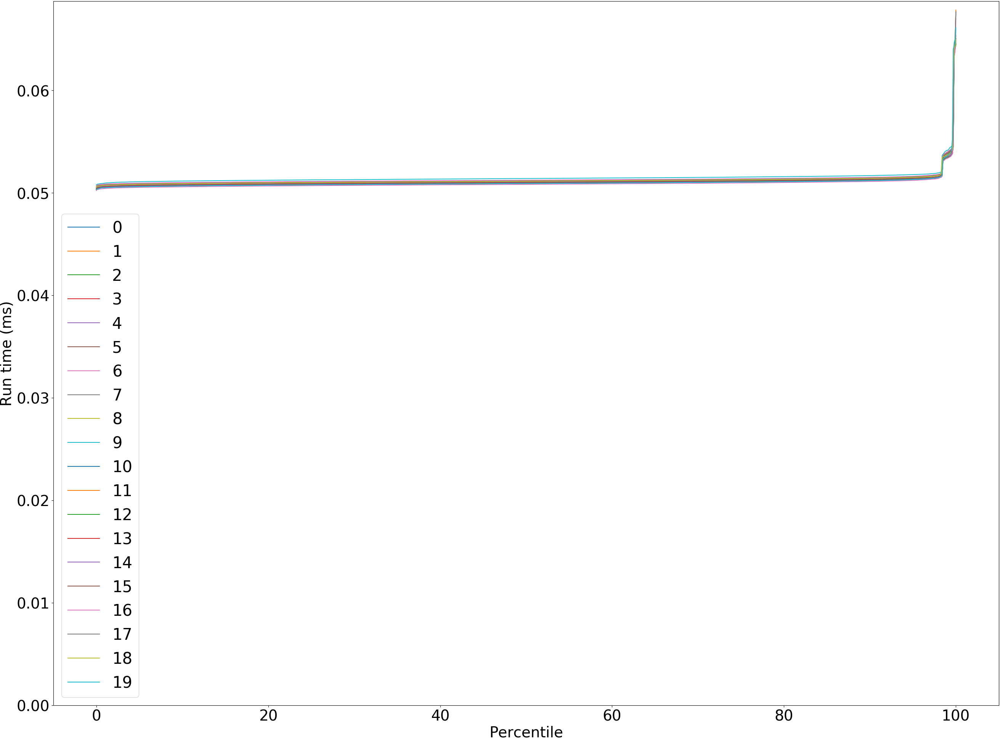
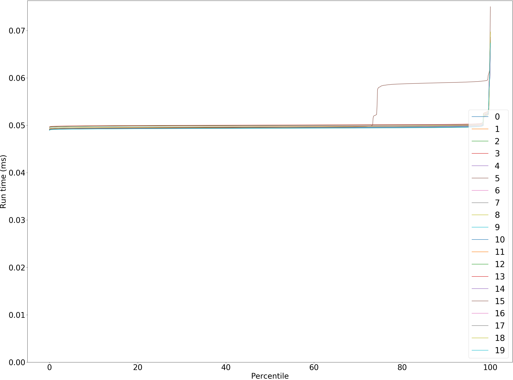
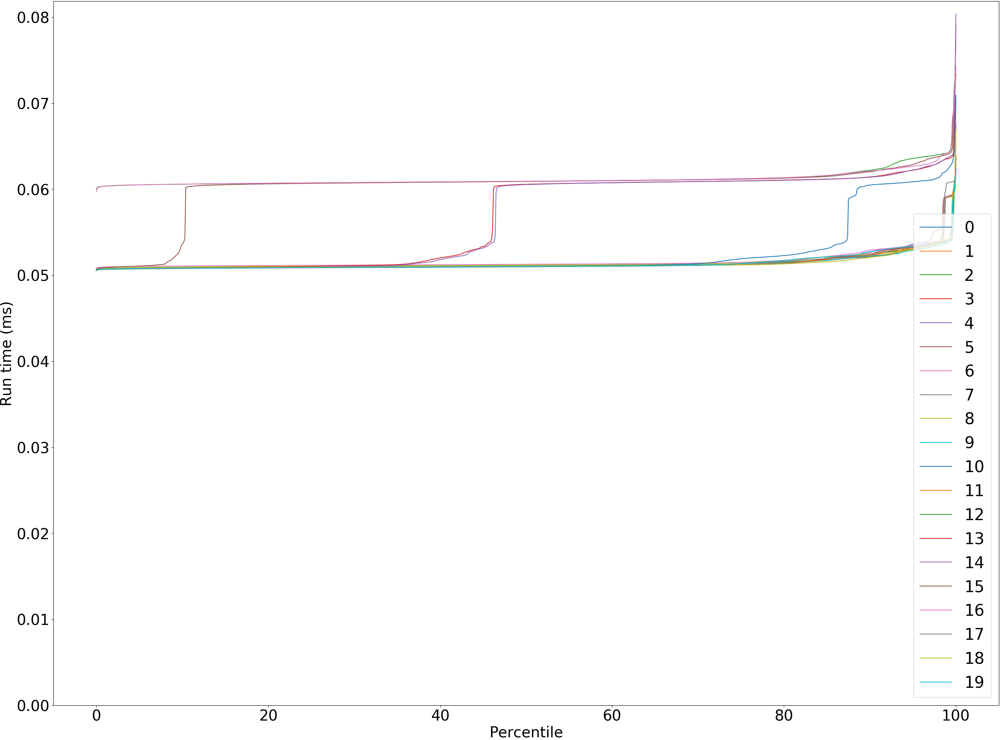

# Summary
## Benchmark run time (ms) at 50 percentile 
Relative test execution times against immix-gc at 50 percentile

|name | immix-gc | unified-heap-gc |  | commix-lite-gc/gcthreads_8 | |
| -- | -- | -- | -- | -- | -- |
|[bounce.BounceBenchmark](#bouncebouncebenchmark)|0.0155|0.0149|__-3.53%__|0.0154|__-0.52%__|
|[brainfuck.BrainfuckBenchmark](#brainfuckbrainfuckbenchmark)|1.1810|1.0780|__-8.72%__|1.0949|__-7.29%__|
|[cd.CDBenchmark](#cdcdbenchmark)|20.0728|16.6684|__-16.96%__|16.3735|__-18.43%__|
|[deltablue.DeltaBlueBenchmark](#deltabluedeltabluebenchmark)|0.1389|0.1271|__-8.49%__|0.1291|__-7.02%__|
|[gcbench.GCBenchBenchmark](#gcbenchgcbenchbenchmark)|80.3841|78.0794|__-2.87%__|64.3078|__-20.00%__|
|[json.JsonBenchmark](#jsonjsonbenchmark)|1.1179|0.8030|__-28.17%__|0.8120|__-27.36%__|
|[kmeans.KmeansBenchmark](#kmeanskmeansbenchmark)|20.8383|19.7820|__-5.07%__|19.4973|__-6.44%__|
|[nbody.NbodyBenchmark](#nbodynbodybenchmark)|19.2823|19.2772|__-0.03%__|19.2772|__-0.03%__|
|[permute.PermuteBenchmark](#permutepermutebenchmark)|0.1328|0.1219|__-8.23%__|0.1249|__-5.98%__|
|[queens.QueensBenchmark](#queensqueensbenchmark)|0.0510|0.0495|__-2.83%__|0.0495|__-2.99%__|
|[richards.RichardsBenchmark](#richardsrichardsbenchmark)|0.0514|0.0507|__-1.44%__|0.0511|__-0.64%__|
|[sudoku.SudokuBenchmark](#sudokusudokubenchmark)|1.4783|1.4224|__-3.78%__|1.4687|__-0.65%__|
|[tracer.TracerBenchmark](#tracertracerbenchmark)|0.5217|0.4577|__-12.27%__|0.4531|__-13.16%__|
| __Geometrical mean:__|| |__-8.20%__| |__-8.91%__|
## Benchmark run time (ms) at 90 percentile 
Relative test execution times against immix-gc at 90 percentile

|name | immix-gc | unified-heap-gc |  | commix-lite-gc/gcthreads_8 | |
| -- | -- | -- | -- | -- | -- |
|[bounce.BounceBenchmark](#bouncebouncebenchmark)|0.0157|0.0151|__-3.50%__|0.0156|__-0.71%__|
|[brainfuck.BrainfuckBenchmark](#brainfuckbrainfuckbenchmark)|1.2634|1.1263|__-10.85%__|1.1335|__-10.28%__|
|[cd.CDBenchmark](#cdcdbenchmark)|20.2342|19.7081|__-2.60%__|16.5176|__-18.37%__|
|[deltablue.DeltaBlueBenchmark](#deltabluedeltabluebenchmark)|0.1408|0.1287|__-8.57%__|0.1314|__-6.63%__|
|[gcbench.GCBenchBenchmark](#gcbenchgcbenchbenchmark)|84.1366|79.1501|__-5.93%__|66.6501|__-20.78%__|
|[json.JsonBenchmark](#jsonjsonbenchmark)|1.5469|1.0600|__-31.48%__|0.9210|__-40.46%__|
|[kmeans.KmeansBenchmark](#kmeanskmeansbenchmark)|21.2984|20.7229|__-2.70%__|20.5575|__-3.48%__|
|[nbody.NbodyBenchmark](#nbodynbodybenchmark)|19.3225|19.2785|__-0.23%__|19.2785|__-0.23%__|
|[permute.PermuteBenchmark](#permutepermutebenchmark)|0.1451|0.1377|__-5.11%__|0.1362|__-6.15%__|
|[queens.QueensBenchmark](#queensqueensbenchmark)|0.0513|0.0500|__-2.52%__|0.0498|__-3.01%__|
|[richards.RichardsBenchmark](#richardsrichardsbenchmark)|0.0608|0.0521|__-14.40%__|0.0530|__-12.86%__|
|[sudoku.SudokuBenchmark](#sudokusudokubenchmark)|1.7318|1.5057|__-13.06%__|1.5736|__-9.14%__|
|[tracer.TracerBenchmark](#tracertracerbenchmark)|0.5259|0.4622|__-12.12%__|0.4583|__-12.86%__|
| __Geometrical mean:__|| |__-9.08%__| |__-11.86%__|
## Benchmark run time (ms) at 99 percentile 
Relative test execution times against immix-gc at 99 percentile

|name | immix-gc | unified-heap-gc |  | commix-lite-gc/gcthreads_8 | |
| -- | -- | -- | -- | -- | -- |
|[bounce.BounceBenchmark](#bouncebouncebenchmark)|0.0159|0.0154|__-3.24%__|0.0158|__-0.58%__|
|[brainfuck.BrainfuckBenchmark](#brainfuckbrainfuckbenchmark)|1.3007|1.1474|__-11.78%__|1.1504|__-11.55%__|
|[cd.CDBenchmark](#cdcdbenchmark)|22.9318|19.9139|__-13.16%__|18.1119|__-21.02%__|
|[deltablue.DeltaBlueBenchmark](#deltabluedeltabluebenchmark)|0.1704|0.1780|+4.46%|0.1795|+5.36%|
|[gcbench.GCBenchBenchmark](#gcbenchgcbenchbenchmark)|85.0414|80.6830|__-5.13%__|75.6292|__-11.07%__|
|[json.JsonBenchmark](#jsonjsonbenchmark)|1.5673|1.1027|__-29.64%__|1.1437|__-27.03%__|
|[kmeans.KmeansBenchmark](#kmeanskmeansbenchmark)|21.6690|21.1962|__-2.18%__|20.9485|__-3.32%__|
|[nbody.NbodyBenchmark](#nbodynbodybenchmark)|19.8541|19.2806|__-2.89%__|19.2804|__-2.89%__|
|[permute.PermuteBenchmark](#permutepermutebenchmark)|0.1475|0.1408|__-4.55%__|0.1483|+0.55%|
|[queens.QueensBenchmark](#queensqueensbenchmark)|0.0536|0.0523|__-2.54%__|0.0522|__-2.66%__|
|[richards.RichardsBenchmark](#richardsrichardsbenchmark)|0.0627|0.0541|__-13.85%__|0.0612|__-2.38%__|
|[sudoku.SudokuBenchmark](#sudokusudokubenchmark)|1.7523|1.6572|__-5.42%__|1.6388|__-6.48%__|
|[tracer.TracerBenchmark](#tracertracerbenchmark)|0.5301|0.4659|__-12.11%__|0.4623|__-12.78%__|
| __Geometrical mean:__|| |__-8.24%__| |__-7.81%__|
## Benchmark run time (ms) at 99.9 percentile 
Relative test execution times against immix-gc at 99.9 percentile

|name | immix-gc | unified-heap-gc |  | commix-lite-gc/gcthreads_8 | |
| -- | -- | -- | -- | -- | -- |
|[bounce.BounceBenchmark](#bouncebouncebenchmark)|0.0274|0.0327|+19.34%|0.0252|__-8.16%__|
|[brainfuck.BrainfuckBenchmark](#brainfuckbrainfuckbenchmark)|1.4732|1.1597|__-21.28%__|1.1952|__-18.87%__|
|[cd.CDBenchmark](#cdcdbenchmark)|22.9719|20.0470|__-12.73%__|20.2789|__-11.72%__|
|[deltablue.DeltaBlueBenchmark](#deltabluedeltabluebenchmark)|0.1733|0.1887|+8.86%|0.1907|+10.03%|
|[gcbench.GCBenchBenchmark](#gcbenchgcbenchbenchmark)|86.1363|83.9909|__-2.49%__|76.3479|__-11.36%__|
|[json.JsonBenchmark](#jsonjsonbenchmark)|1.5777|1.1181|__-29.13%__|1.1672|__-26.02%__|
|[kmeans.KmeansBenchmark](#kmeanskmeansbenchmark)|22.0651|21.9093|__-0.71%__|21.4429|__-2.82%__|
|[nbody.NbodyBenchmark](#nbodynbodybenchmark)|21.8804|19.2894|__-11.84%__|19.2891|__-11.84%__|
|[permute.PermuteBenchmark](#permutepermutebenchmark)|0.1564|0.1502|__-3.95%__|0.1511|__-3.36%__|
|[queens.QueensBenchmark](#queensqueensbenchmark)|0.0644|0.0674|+4.58%|0.0651|+1.10%|
|[richards.RichardsBenchmark](#richardsrichardsbenchmark)|0.0682|0.0681|__-0.10%__|0.0636|__-6.71%__|
|[sudoku.SudokuBenchmark](#sudokusudokubenchmark)|1.7757|1.6814|__-5.31%__|1.6714|__-5.88%__|
|[tracer.TracerBenchmark](#tracertracerbenchmark)|0.5383|0.4752|__-11.73%__|0.4665|__-13.34%__|
| __Geometrical mean:__|| |__-5.91%__| |__-8.79%__|
## Benchmark total run time (ms) 
Total test execution times against immix-gc

|name | immix-gc | unified-heap-gc |  | commix-lite-gc/gcthreads_8 | |
| -- | -- | -- | -- | -- | -- |
|[bounce.BounceBenchmark](#bouncebouncebenchmark)|990.2676|956.3934|__-3.42%__|985.3933|__-0.49%__|
|[brainfuck.BrainfuckBenchmark](#brainfuckbrainfuckbenchmark)|77435.4748|69961.5126|__-9.65%__|70377.5552|__-9.11%__|
|[cd.CDBenchmark](#cdcdbenchmark)|1302420.6250|1094244.2977|__-15.98%__|1053774.1998|__-19.09%__|
|[deltablue.DeltaBlueBenchmark](#deltabluedeltabluebenchmark)|8982.7236|8264.4925|__-8.00%__|8394.7652|__-6.55%__|
|[gcbench.GCBenchBenchmark](#gcbenchgcbenchbenchmark)|5207800.9000|4843811.8679|__-6.99%__|4204966.6196|__-19.26%__|
|[json.JsonBenchmark](#jsonjsonbenchmark)|76339.4707|55166.7470|__-27.73%__|53518.2265|__-29.89%__|
|[kmeans.KmeansBenchmark](#kmeanskmeansbenchmark)|1335129.9293|1274715.6460|__-4.52%__|1261405.9367|__-5.52%__|
|[nbody.NbodyBenchmark](#nbodynbodybenchmark)|1231798.4124|1232485.8886|+0.06%|1229429.6011|__-0.19%__|
|[permute.PermuteBenchmark](#permutepermutebenchmark)|8601.1484|7932.1800|__-7.78%__|8143.6719|__-5.32%__|
|[queens.QueensBenchmark](#queensqueensbenchmark)|3268.7135|3176.4700|__-2.82%__|3180.9923|__-2.68%__|
|[richards.RichardsBenchmark](#richardsrichardsbenchmark)|3399.9614|3265.7877|__-3.95%__|3313.8521|__-2.53%__|
|[sudoku.SudokuBenchmark](#sudokusudokubenchmark)|96588.8855|92708.4024|__-4.02%__|95453.1704|__-1.18%__|
|[tracer.TracerBenchmark](#tracertracerbenchmark)|33096.5484|28879.0138|__-12.74%__|28627.3517|__-13.50%__|
| __Geometrical mean:__|| |__-8.56%__| |__-9.32%__|
## Total GC time on Application thread (ms) 
Relative gc times against immix-gc

|name |  | immix-gc | unified-heap-gc |  | commix-lite-gc/gcthreads_8 | |
| -- | -- | -- | -- | -- | -- | -- |
|[bounce.BounceBenchmark](#bouncebouncebenchmark)|mark|1.1346|1.0446|__-7.93%__|1.6883|+48.80%|
||sweep|0.8999|1.5579|+73.13%|0.0000|__-100.00%__|
||total|2.0345|2.6026|+27.92%|1.6883|__-17.02%__|
|[brainfuck.BrainfuckBenchmark](#brainfuckbrainfuckbenchmark)|mark|2213.5346|1807.7365|__-18.33%__|2428.5319|+9.71%|
||sweep|2926.0168|771.1522|__-73.64%__|29.4575|__-98.99%__|
||total|5139.5514|2578.8888|__-49.82%__|2457.9894|__-52.18%__|
|[cd.CDBenchmark](#cdcdbenchmark)|mark|69301.4498|66242.8257|__-4.41%__|19393.1589|__-72.02%__|
||sweep|37712.4598|25442.2017|__-32.54%__|4.2867|__-99.99%__|
||total|107013.9096|91685.0274|__-14.32%__|19397.4456|__-81.87%__|
|[deltablue.DeltaBlueBenchmark](#deltabluedeltabluebenchmark)|mark|98.6685|164.1784|+66.39%|204.9703|+107.74%|
||sweep|62.9281|64.7043|+2.82%|0.0127|__-99.98%__|
||total|161.5966|228.8827|+41.64%|204.9830|+26.85%|
|[gcbench.GCBenchBenchmark](#gcbenchgcbenchbenchmark)|mark|863356.5363|1523758.6669|+76.49%|192564.6498|__-77.70%__|
||sweep|376532.4432|197572.0328|__-47.53%__|0.0000|__-100.00%__|
||total|1239888.9795|1721330.6997|+38.83%|192564.6498|__-84.47%__|
|[json.JsonBenchmark](#jsonjsonbenchmark)|mark|5133.1644|3833.2398|__-25.32%__|1414.0055|__-72.45%__|
||sweep|6991.8817|2834.1319|__-59.47%__|0.1080|__-100.00%__|
||total|12125.0461|6667.3718|__-45.01%__|1414.1135|__-88.34%__|
|[kmeans.KmeansBenchmark](#kmeanskmeansbenchmark)|mark|116940.3754|36576.4571|__-68.72%__|24587.3675|__-78.97%__|
||sweep|51094.0363|5179.6461|__-89.86%__|26.2598|__-99.95%__|
||total|168034.4117|41756.1033|__-75.15%__|24613.6273|__-85.35%__|
|[nbody.NbodyBenchmark](#nbodynbodybenchmark)|mark|0.2812|0.3618|+28.67%|0.4828|+71.69%|
||sweep|0.1860|0.2400|+29.02%|0.0000|__-100.00%__|
||total|0.4672|0.6017|+28.81%|0.4828|+3.34%|
|[permute.PermuteBenchmark](#permutepermutebenchmark)|mark|100.4583|70.8461|__-29.48%__|100.9970|+0.54%|
||sweep|81.1109|134.1709|+65.42%|10.0988|__-87.55%__|
||total|181.5692|205.0170|+12.91%|111.0958|__-38.81%__|
|[queens.QueensBenchmark](#queensqueensbenchmark)|mark|2.5750|2.3209|__-9.87%__|3.4708|+34.79%|
||sweep|1.8638|3.7279|+100.02%|0.0000|__-100.00%__|
||total|4.4388|6.0488|+36.27%|3.4708|__-21.81%__|
|[richards.RichardsBenchmark](#richardsrichardsbenchmark)|mark|3.1084|2.4710|__-20.51%__|3.7759|+21.47%|
||sweep|2.1089|4.4749|+112.19%|0.0000|__-100.00%__|
||total|5.2173|6.9459|+33.13%|3.7759|__-27.63%__|
|[sudoku.SudokuBenchmark](#sudokusudokubenchmark)|mark|1213.8526|1075.2346|__-11.42%__|1282.2122|+5.63%|
||sweep|2055.7892|813.3070|__-60.44%__|0.0000|__-100.00%__|
||total|3269.6419|1888.5416|__-42.24%__|1282.2122|__-60.78%__|
|[tracer.TracerBenchmark](#tracertracerbenchmark)|mark|724.1191|457.9741|__-36.75%__|690.2644|__-4.68%__|
||sweep|441.8907|715.0030|+61.81%|42.8547|__-90.30%__|
||total|1166.0098|1172.9771|+0.60%|733.1192|__-37.13%__|
|__Geometrical mean:__|mark|| |__-12.37%__| |__-22.75%__|
||sweep|| |__-22.00%__| |__-99.84%__|
||total|| |__-10.79%__| |__-56.27%__|
## GC pause time (ms) at 50 percentile 
Relative GC pauses against immix-gc at 50 percentile

|name | immix-gc | unified-heap-gc |  | commix-lite-gc/gcthreads_8 | |
| -- | -- | -- | -- | -- | -- |
|[bounce.BounceBenchmark](#bouncebouncebenchmark)|0.0122|0.0184|+50.77%|0.0000|__-100.00%__|
|[brainfuck.BrainfuckBenchmark](#brainfuckbrainfuckbenchmark)|0.0902|0.0470|__-47.96%__|0.0412|__-54.38%__|
|[cd.CDBenchmark](#cdcdbenchmark)|0.0530|0.0526|__-0.73%__|0.0372|__-29.83%__|
|[deltablue.DeltaBlueBenchmark](#deltabluedeltabluebenchmark)|0.0296|0.0438|+48.12%|0.0366|+23.72%|
|[gcbench.GCBenchBenchmark](#gcbenchgcbenchbenchmark)|1.8454|1.3599|__-26.31%__|0.0000|__-100.00%__|
|[json.JsonBenchmark](#jsonjsonbenchmark)|0.2525|0.1488|__-41.08%__|0.1124|__-55.48%__|
|[kmeans.KmeansBenchmark](#kmeanskmeansbenchmark)|1.3949|0.8589|__-38.42%__|0.5353|__-61.62%__|
|[nbody.NbodyBenchmark](#nbodynbodybenchmark)|0.0221|0.0300|+35.61%|0.0000|__-100.00%__|
|[permute.PermuteBenchmark](#permutepermutebenchmark)|0.0120|0.0170|+41.44%|0.0081|__-32.52%__|
|[queens.QueensBenchmark](#queensqueensbenchmark)|0.0126|0.0172|+36.88%|0.0000|__-100.00%__|
|[richards.RichardsBenchmark](#richardsrichardsbenchmark)|0.0126|0.0170|+34.99%|0.0000|__-100.00%__|
|[sudoku.SudokuBenchmark](#sudokusudokubenchmark)|0.2516|0.1575|__-37.38%__|0.0000|__-100.00%__|
|[tracer.TracerBenchmark](#tracertracerbenchmark)|0.0156|0.0187|+19.84%|0.0106|__-31.80%__|
| __Geometrical mean:__|| |__-1.51%__| |__-39.08%__|
## GC pause time (ms) at 90 percentile 
Relative GC pauses against immix-gc at 90 percentile

|name | immix-gc | unified-heap-gc |  | commix-lite-gc/gcthreads_8 | |
| -- | -- | -- | -- | -- | -- |
|[bounce.BounceBenchmark](#bouncebouncebenchmark)|0.0154|0.0210|+35.88%|0.0000|__-100.00%__|
|[brainfuck.BrainfuckBenchmark](#brainfuckbrainfuckbenchmark)|0.0944|0.0546|__-42.22%__|0.0458|__-51.50%__|
|[cd.CDBenchmark](#cdcdbenchmark)|0.0743|0.0790|+6.33%|0.0835|+12.33%|
|[deltablue.DeltaBlueBenchmark](#deltabluedeltabluebenchmark)|0.0306|0.0527|+72.06%|0.0505|+64.70%|
|[gcbench.GCBenchBenchmark](#gcbenchgcbenchbenchmark)|2.6697|2.6288|__-1.53%__|0.0000|__-100.00%__|
|[json.JsonBenchmark](#jsonjsonbenchmark)|0.4773|0.2968|__-37.82%__|0.2319|__-51.41%__|
|[kmeans.KmeansBenchmark](#kmeanskmeansbenchmark)|1.4326|1.1897|__-16.96%__|0.7411|__-48.27%__|
|[nbody.NbodyBenchmark](#nbodynbodybenchmark)|0.0277|0.0338|+22.00%|0.0000|__-100.00%__|
|[permute.PermuteBenchmark](#permutepermutebenchmark)|0.0126|0.0176|+39.12%|0.0087|__-31.02%__|
|[queens.QueensBenchmark](#queensqueensbenchmark)|0.0145|0.0190|+31.23%|0.0000|__-100.00%__|
|[richards.RichardsBenchmark](#richardsrichardsbenchmark)|0.0154|0.0191|+23.89%|0.0000|__-100.00%__|
|[sudoku.SudokuBenchmark](#sudokusudokubenchmark)|0.2586|0.1642|__-36.50%__|0.0000|__-100.00%__|
|[tracer.TracerBenchmark](#tracertracerbenchmark)|0.0174|0.0198|+13.75%|0.0120|__-31.36%__|
| __Geometrical mean:__|| |+2.93%| |__-27.35%__|
## GC pause time (ms) at 99 percentile 
Relative GC pauses against immix-gc at 99 percentile

|name | immix-gc | unified-heap-gc |  | commix-lite-gc/gcthreads_8 | |
| -- | -- | -- | -- | -- | -- |
|[bounce.BounceBenchmark](#bouncebouncebenchmark)|0.0188|0.0220|+17.03%|0.0000|__-100.00%__|
|[brainfuck.BrainfuckBenchmark](#brainfuckbrainfuckbenchmark)|0.1038|0.0588|__-43.36%__|0.0611|__-41.11%__|
|[cd.CDBenchmark](#cdcdbenchmark)|0.0814|0.1088|+33.72%|0.1188|+46.06%|
|[deltablue.DeltaBlueBenchmark](#deltabluedeltabluebenchmark)|0.0333|0.0659|+97.86%|0.0603|+81.01%|
|[gcbench.GCBenchBenchmark](#gcbenchgcbenchbenchmark)|5.7243|5.3714|__-6.17%__|0.0000|__-100.00%__|
|[json.JsonBenchmark](#jsonjsonbenchmark)|0.4888|0.3070|__-37.19%__|0.2496|__-48.93%__|
|[kmeans.KmeansBenchmark](#kmeanskmeansbenchmark)|1.4559|1.3439|__-7.69%__|0.7760|__-46.70%__|
|[nbody.NbodyBenchmark](#nbodynbodybenchmark)|0.0298|0.0346|+16.10%|0.0000|__-100.00%__|
|[permute.PermuteBenchmark](#permutepermutebenchmark)|0.0145|0.0194|+34.25%|0.0101|__-29.86%__|
|[queens.QueensBenchmark](#queensqueensbenchmark)|0.0188|0.0238|+27.03%|0.0000|__-100.00%__|
|[richards.RichardsBenchmark](#richardsrichardsbenchmark)|0.0193|0.0228|+18.08%|0.0000|__-100.00%__|
|[sudoku.SudokuBenchmark](#sudokusudokubenchmark)|0.2658|0.1729|__-34.96%__|0.0000|__-100.00%__|
|[tracer.TracerBenchmark](#tracertracerbenchmark)|0.0192|0.0209|+8.88%|0.0135|__-29.70%__|
| __Geometrical mean:__|| |+3.58%| |__-20.04%__|
## GC pause time (ms) at 99.9 percentile 
Relative GC pauses against immix-gc at 99.9 percentile

|name | immix-gc | unified-heap-gc |  | commix-lite-gc/gcthreads_8 | |
| -- | -- | -- | -- | -- | -- |
|[bounce.BounceBenchmark](#bouncebouncebenchmark)|0.0268|0.0259|__-3.36%__|0.0000|__-100.00%__|
|[brainfuck.BrainfuckBenchmark](#brainfuckbrainfuckbenchmark)|0.1076|0.0682|__-36.64%__|0.0857|__-20.37%__|
|[cd.CDBenchmark](#cdcdbenchmark)|0.1109|0.1288|+16.10%|0.1549|+39.62%|
|[deltablue.DeltaBlueBenchmark](#deltabluedeltabluebenchmark)|0.0462|0.0726|+57.15%|0.0662|+43.30%|
|[gcbench.GCBenchBenchmark](#gcbenchgcbenchbenchmark)|5.7539|5.5123|__-4.20%__|0.0000|__-100.00%__|
|[json.JsonBenchmark](#jsonjsonbenchmark)|0.5010|0.3161|__-36.89%__|0.2606|__-47.98%__|
|[kmeans.KmeansBenchmark](#kmeanskmeansbenchmark)|1.6475|1.5055|__-8.62%__|0.8145|__-50.56%__|
|[nbody.NbodyBenchmark](#nbodynbodybenchmark)|0.0302|0.0347|+15.08%|0.0000|__-100.00%__|
|[permute.PermuteBenchmark](#permutepermutebenchmark)|0.0182|0.0229|+25.92%|0.0199|+9.19%|
|[queens.QueensBenchmark](#queensqueensbenchmark)|0.0238|0.0285|+19.71%|0.0000|__-100.00%__|
|[richards.RichardsBenchmark](#richardsrichardsbenchmark)|0.0231|0.0264|+14.55%|0.0000|__-100.00%__|
|[sudoku.SudokuBenchmark](#sudokusudokubenchmark)|0.2870|0.1796|__-37.41%__|0.0000|__-100.00%__|
|[tracer.TracerBenchmark](#tracertracerbenchmark)|0.0199|0.0227|+13.99%|0.0153|__-23.23%__|
| __Geometrical mean:__|| |__-1.02%__| |__-14.16%__|
# Individual benchmarks
## bounce.BounceBenchmark
bounce.BounceBenchmark

bounce.BounceBenchmark

bounce.BounceBenchmark: Garbage Collector Pause Times

bounce.BounceBenchmark: Garbage Collector Pause Times

bounce.BounceBenchmark: Mark Batch Times

bounce.BounceBenchmark: Mark Batch Times

bounce.BounceBenchmark: Sweep Batch Times

bounce.BounceBenchmark: Sweep Batch Times

bounce.BounceBenchmark run #3

bounce.BounceBenchmark immix-gc

bounce.BounceBenchmark immix-gc

immix-gc bounce.BounceBenchmark last garbage collection

immix-gc bounce.BounceBenchmark last garbage collection

bounce.BounceBenchmark unified-heap-gc

bounce.BounceBenchmark unified-heap-gc

unified-heap-gc bounce.BounceBenchmark last garbage collection

unified-heap-gc bounce.BounceBenchmark last garbage collection

bounce.BounceBenchmark commix-lite-gc/gcthreads_8

bounce.BounceBenchmark commix-lite-gc/gcthreads_8

commix-lite-gc/gcthreads_8 bounce.BounceBenchmark last garbage collection

commix-lite-gc/gcthreads_8 bounce.BounceBenchmark last garbage collection

## brainfuck.BrainfuckBenchmark
brainfuck.BrainfuckBenchmark

brainfuck.BrainfuckBenchmark

brainfuck.BrainfuckBenchmark: Garbage Collector Pause Times

brainfuck.BrainfuckBenchmark: Garbage Collector Pause Times

brainfuck.BrainfuckBenchmark: Mark Batch Times

brainfuck.BrainfuckBenchmark: Mark Batch Times

brainfuck.BrainfuckBenchmark: Sweep Batch Times

brainfuck.BrainfuckBenchmark: Sweep Batch Times

brainfuck.BrainfuckBenchmark run #3

brainfuck.BrainfuckBenchmark immix-gc

brainfuck.BrainfuckBenchmark immix-gc

immix-gc brainfuck.BrainfuckBenchmark last garbage collection

immix-gc brainfuck.BrainfuckBenchmark last garbage collection

brainfuck.BrainfuckBenchmark unified-heap-gc

brainfuck.BrainfuckBenchmark unified-heap-gc

unified-heap-gc brainfuck.BrainfuckBenchmark last garbage collection

unified-heap-gc brainfuck.BrainfuckBenchmark last garbage collection

brainfuck.BrainfuckBenchmark commix-lite-gc/gcthreads_8

brainfuck.BrainfuckBenchmark commix-lite-gc/gcthreads_8

commix-lite-gc/gcthreads_8 brainfuck.BrainfuckBenchmark last garbage collection

commix-lite-gc/gcthreads_8 brainfuck.BrainfuckBenchmark last garbage collection

## cd.CDBenchmark
cd.CDBenchmark

cd.CDBenchmark

cd.CDBenchmark: Garbage Collector Pause Times

cd.CDBenchmark: Garbage Collector Pause Times

cd.CDBenchmark: Mark Batch Times

cd.CDBenchmark: Mark Batch Times

cd.CDBenchmark: Sweep Batch Times

cd.CDBenchmark: Sweep Batch Times

cd.CDBenchmark run #3

cd.CDBenchmark immix-gc

cd.CDBenchmark immix-gc

immix-gc cd.CDBenchmark last garbage collection

immix-gc cd.CDBenchmark last garbage collection

cd.CDBenchmark unified-heap-gc

cd.CDBenchmark unified-heap-gc

unified-heap-gc cd.CDBenchmark last garbage collection

unified-heap-gc cd.CDBenchmark last garbage collection

cd.CDBenchmark commix-lite-gc/gcthreads_8

cd.CDBenchmark commix-lite-gc/gcthreads_8

commix-lite-gc/gcthreads_8 cd.CDBenchmark last garbage collection

commix-lite-gc/gcthreads_8 cd.CDBenchmark last garbage collection

## deltablue.DeltaBlueBenchmark
deltablue.DeltaBlueBenchmark

deltablue.DeltaBlueBenchmark

deltablue.DeltaBlueBenchmark: Garbage Collector Pause Times

deltablue.DeltaBlueBenchmark: Garbage Collector Pause Times

deltablue.DeltaBlueBenchmark: Mark Batch Times

deltablue.DeltaBlueBenchmark: Mark Batch Times

deltablue.DeltaBlueBenchmark: Sweep Batch Times

deltablue.DeltaBlueBenchmark: Sweep Batch Times

deltablue.DeltaBlueBenchmark run #3

deltablue.DeltaBlueBenchmark immix-gc

deltablue.DeltaBlueBenchmark immix-gc

immix-gc deltablue.DeltaBlueBenchmark last garbage collection

immix-gc deltablue.DeltaBlueBenchmark last garbage collection

deltablue.DeltaBlueBenchmark unified-heap-gc

deltablue.DeltaBlueBenchmark unified-heap-gc

unified-heap-gc deltablue.DeltaBlueBenchmark last garbage collection

unified-heap-gc deltablue.DeltaBlueBenchmark last garbage collection

deltablue.DeltaBlueBenchmark commix-lite-gc/gcthreads_8

deltablue.DeltaBlueBenchmark commix-lite-gc/gcthreads_8

commix-lite-gc/gcthreads_8 deltablue.DeltaBlueBenchmark last garbage collection

commix-lite-gc/gcthreads_8 deltablue.DeltaBlueBenchmark last garbage collection

## gcbench.GCBenchBenchmark
gcbench.GCBenchBenchmark

gcbench.GCBenchBenchmark

gcbench.GCBenchBenchmark: Garbage Collector Pause Times

gcbench.GCBenchBenchmark: Garbage Collector Pause Times

gcbench.GCBenchBenchmark: Mark Batch Times

gcbench.GCBenchBenchmark: Mark Batch Times

gcbench.GCBenchBenchmark: Sweep Batch Times

gcbench.GCBenchBenchmark: Sweep Batch Times

gcbench.GCBenchBenchmark run #3

gcbench.GCBenchBenchmark immix-gc

gcbench.GCBenchBenchmark immix-gc

immix-gc gcbench.GCBenchBenchmark last garbage collection

immix-gc gcbench.GCBenchBenchmark last garbage collection

gcbench.GCBenchBenchmark unified-heap-gc

gcbench.GCBenchBenchmark unified-heap-gc

unified-heap-gc gcbench.GCBenchBenchmark last garbage collection

unified-heap-gc gcbench.GCBenchBenchmark last garbage collection

gcbench.GCBenchBenchmark commix-lite-gc/gcthreads_8

gcbench.GCBenchBenchmark commix-lite-gc/gcthreads_8

commix-lite-gc/gcthreads_8 gcbench.GCBenchBenchmark last garbage collection

commix-lite-gc/gcthreads_8 gcbench.GCBenchBenchmark last garbage collection

## json.JsonBenchmark
json.JsonBenchmark

json.JsonBenchmark

json.JsonBenchmark: Garbage Collector Pause Times

json.JsonBenchmark: Garbage Collector Pause Times

json.JsonBenchmark: Mark Batch Times

json.JsonBenchmark: Mark Batch Times

json.JsonBenchmark: Sweep Batch Times

json.JsonBenchmark: Sweep Batch Times

json.JsonBenchmark run #3

json.JsonBenchmark immix-gc

json.JsonBenchmark immix-gc

immix-gc json.JsonBenchmark last garbage collection

immix-gc json.JsonBenchmark last garbage collection

json.JsonBenchmark unified-heap-gc

json.JsonBenchmark unified-heap-gc

unified-heap-gc json.JsonBenchmark last garbage collection

unified-heap-gc json.JsonBenchmark last garbage collection

json.JsonBenchmark commix-lite-gc/gcthreads_8

json.JsonBenchmark commix-lite-gc/gcthreads_8

commix-lite-gc/gcthreads_8 json.JsonBenchmark last garbage collection

commix-lite-gc/gcthreads_8 json.JsonBenchmark last garbage collection

## kmeans.KmeansBenchmark
kmeans.KmeansBenchmark

kmeans.KmeansBenchmark

kmeans.KmeansBenchmark: Garbage Collector Pause Times

kmeans.KmeansBenchmark: Garbage Collector Pause Times

kmeans.KmeansBenchmark: Mark Batch Times

kmeans.KmeansBenchmark: Mark Batch Times

kmeans.KmeansBenchmark: Sweep Batch Times

kmeans.KmeansBenchmark: Sweep Batch Times

kmeans.KmeansBenchmark run #3

kmeans.KmeansBenchmark immix-gc

kmeans.KmeansBenchmark immix-gc

immix-gc kmeans.KmeansBenchmark last garbage collection

immix-gc kmeans.KmeansBenchmark last garbage collection

kmeans.KmeansBenchmark unified-heap-gc

kmeans.KmeansBenchmark unified-heap-gc

unified-heap-gc kmeans.KmeansBenchmark last garbage collection

unified-heap-gc kmeans.KmeansBenchmark last garbage collection

kmeans.KmeansBenchmark commix-lite-gc/gcthreads_8

kmeans.KmeansBenchmark commix-lite-gc/gcthreads_8

commix-lite-gc/gcthreads_8 kmeans.KmeansBenchmark last garbage collection

commix-lite-gc/gcthreads_8 kmeans.KmeansBenchmark last garbage collection

## nbody.NbodyBenchmark
nbody.NbodyBenchmark

nbody.NbodyBenchmark

nbody.NbodyBenchmark: Garbage Collector Pause Times

nbody.NbodyBenchmark: Garbage Collector Pause Times

nbody.NbodyBenchmark: Mark Batch Times

nbody.NbodyBenchmark: Mark Batch Times

nbody.NbodyBenchmark: Sweep Batch Times

nbody.NbodyBenchmark: Sweep Batch Times

nbody.NbodyBenchmark run #3

nbody.NbodyBenchmark immix-gc

nbody.NbodyBenchmark immix-gc

immix-gc nbody.NbodyBenchmark last garbage collection

immix-gc nbody.NbodyBenchmark last garbage collection

nbody.NbodyBenchmark unified-heap-gc

nbody.NbodyBenchmark unified-heap-gc

unified-heap-gc nbody.NbodyBenchmark last garbage collection

unified-heap-gc nbody.NbodyBenchmark last garbage collection

nbody.NbodyBenchmark commix-lite-gc/gcthreads_8

nbody.NbodyBenchmark commix-lite-gc/gcthreads_8

commix-lite-gc/gcthreads_8 nbody.NbodyBenchmark last garbage collection

commix-lite-gc/gcthreads_8 nbody.NbodyBenchmark last garbage collection

## permute.PermuteBenchmark
permute.PermuteBenchmark

permute.PermuteBenchmark

permute.PermuteBenchmark: Garbage Collector Pause Times

permute.PermuteBenchmark: Garbage Collector Pause Times

permute.PermuteBenchmark: Mark Batch Times

permute.PermuteBenchmark: Mark Batch Times

permute.PermuteBenchmark: Sweep Batch Times

permute.PermuteBenchmark: Sweep Batch Times

permute.PermuteBenchmark run #3

permute.PermuteBenchmark immix-gc

permute.PermuteBenchmark immix-gc

immix-gc permute.PermuteBenchmark last garbage collection

immix-gc permute.PermuteBenchmark last garbage collection

permute.PermuteBenchmark unified-heap-gc

permute.PermuteBenchmark unified-heap-gc

unified-heap-gc permute.PermuteBenchmark last garbage collection

unified-heap-gc permute.PermuteBenchmark last garbage collection

permute.PermuteBenchmark commix-lite-gc/gcthreads_8

permute.PermuteBenchmark commix-lite-gc/gcthreads_8

commix-lite-gc/gcthreads_8 permute.PermuteBenchmark last garbage collection

commix-lite-gc/gcthreads_8 permute.PermuteBenchmark last garbage collection

## queens.QueensBenchmark
queens.QueensBenchmark

queens.QueensBenchmark

queens.QueensBenchmark: Garbage Collector Pause Times

queens.QueensBenchmark: Garbage Collector Pause Times

queens.QueensBenchmark: Mark Batch Times

queens.QueensBenchmark: Mark Batch Times

queens.QueensBenchmark: Sweep Batch Times

queens.QueensBenchmark: Sweep Batch Times

queens.QueensBenchmark run #3

queens.QueensBenchmark immix-gc

queens.QueensBenchmark immix-gc

immix-gc queens.QueensBenchmark last garbage collection

immix-gc queens.QueensBenchmark last garbage collection

queens.QueensBenchmark unified-heap-gc

queens.QueensBenchmark unified-heap-gc

unified-heap-gc queens.QueensBenchmark last garbage collection

unified-heap-gc queens.QueensBenchmark last garbage collection

queens.QueensBenchmark commix-lite-gc/gcthreads_8

queens.QueensBenchmark commix-lite-gc/gcthreads_8

commix-lite-gc/gcthreads_8 queens.QueensBenchmark last garbage collection

commix-lite-gc/gcthreads_8 queens.QueensBenchmark last garbage collection

## richards.RichardsBenchmark
richards.RichardsBenchmark

richards.RichardsBenchmark

richards.RichardsBenchmark: Garbage Collector Pause Times

richards.RichardsBenchmark: Garbage Collector Pause Times

richards.RichardsBenchmark: Mark Batch Times

richards.RichardsBenchmark: Mark Batch Times

richards.RichardsBenchmark: Sweep Batch Times

richards.RichardsBenchmark: Sweep Batch Times

richards.RichardsBenchmark run #3

richards.RichardsBenchmark immix-gc

richards.RichardsBenchmark immix-gc

immix-gc richards.RichardsBenchmark last garbage collection

immix-gc richards.RichardsBenchmark last garbage collection

richards.RichardsBenchmark unified-heap-gc

richards.RichardsBenchmark unified-heap-gc

unified-heap-gc richards.RichardsBenchmark last garbage collection

unified-heap-gc richards.RichardsBenchmark last garbage collection

richards.RichardsBenchmark commix-lite-gc/gcthreads_8

richards.RichardsBenchmark commix-lite-gc/gcthreads_8

commix-lite-gc/gcthreads_8 richards.RichardsBenchmark last garbage collection

commix-lite-gc/gcthreads_8 richards.RichardsBenchmark last garbage collection

## sudoku.SudokuBenchmark
sudoku.SudokuBenchmark

sudoku.SudokuBenchmark

sudoku.SudokuBenchmark: Garbage Collector Pause Times

sudoku.SudokuBenchmark: Garbage Collector Pause Times

sudoku.SudokuBenchmark: Mark Batch Times

sudoku.SudokuBenchmark: Mark Batch Times

sudoku.SudokuBenchmark: Sweep Batch Times

sudoku.SudokuBenchmark: Sweep Batch Times

sudoku.SudokuBenchmark run #3

sudoku.SudokuBenchmark immix-gc

sudoku.SudokuBenchmark immix-gc

immix-gc sudoku.SudokuBenchmark last garbage collection

immix-gc sudoku.SudokuBenchmark last garbage collection

sudoku.SudokuBenchmark unified-heap-gc

sudoku.SudokuBenchmark unified-heap-gc

unified-heap-gc sudoku.SudokuBenchmark last garbage collection

unified-heap-gc sudoku.SudokuBenchmark last garbage collection

sudoku.SudokuBenchmark commix-lite-gc/gcthreads_8

sudoku.SudokuBenchmark commix-lite-gc/gcthreads_8

commix-lite-gc/gcthreads_8 sudoku.SudokuBenchmark last garbage collection

commix-lite-gc/gcthreads_8 sudoku.SudokuBenchmark last garbage collection

## tracer.TracerBenchmark
tracer.TracerBenchmark

tracer.TracerBenchmark

tracer.TracerBenchmark: Garbage Collector Pause Times

tracer.TracerBenchmark: Garbage Collector Pause Times

tracer.TracerBenchmark: Mark Batch Times

tracer.TracerBenchmark: Mark Batch Times

tracer.TracerBenchmark: Sweep Batch Times

tracer.TracerBenchmark: Sweep Batch Times

tracer.TracerBenchmark run #3

tracer.TracerBenchmark immix-gc

tracer.TracerBenchmark immix-gc

immix-gc tracer.TracerBenchmark last garbage collection

immix-gc tracer.TracerBenchmark last garbage collection

tracer.TracerBenchmark unified-heap-gc

tracer.TracerBenchmark unified-heap-gc

unified-heap-gc tracer.TracerBenchmark last garbage collection

unified-heap-gc tracer.TracerBenchmark last garbage collection

tracer.TracerBenchmark commix-lite-gc/gcthreads_8

tracer.TracerBenchmark commix-lite-gc/gcthreads_8

commix-lite-gc/gcthreads_8 tracer.TracerBenchmark last garbage collection

commix-lite-gc/gcthreads_8 tracer.TracerBenchmark last garbage collection

