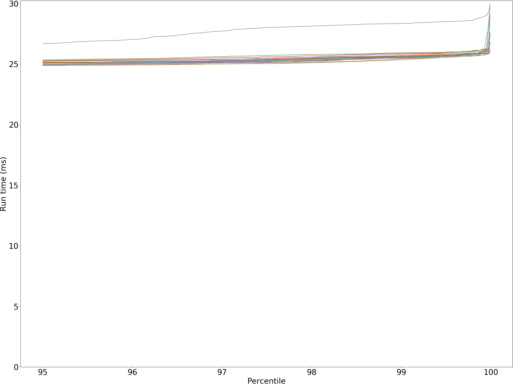
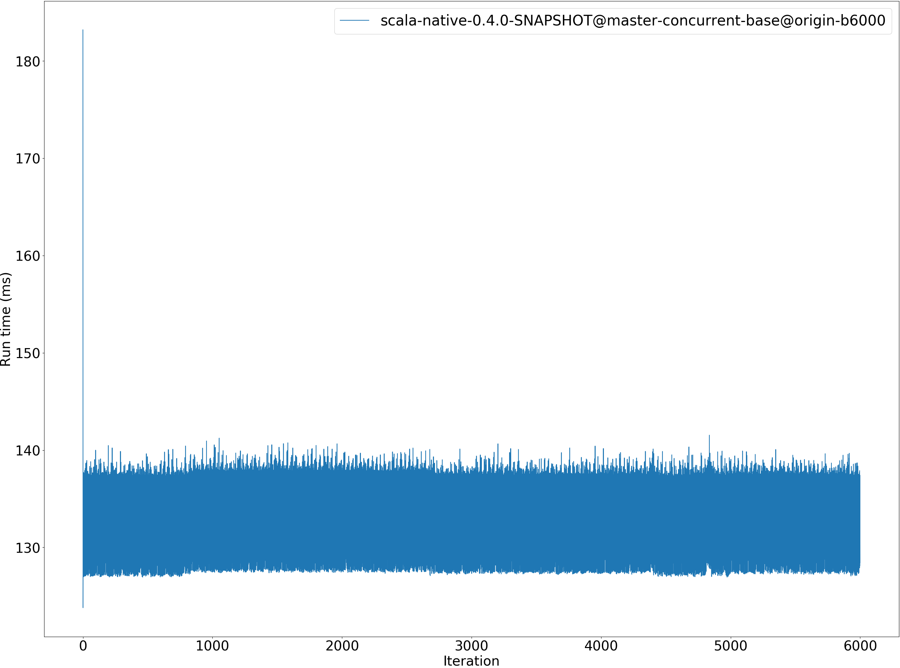
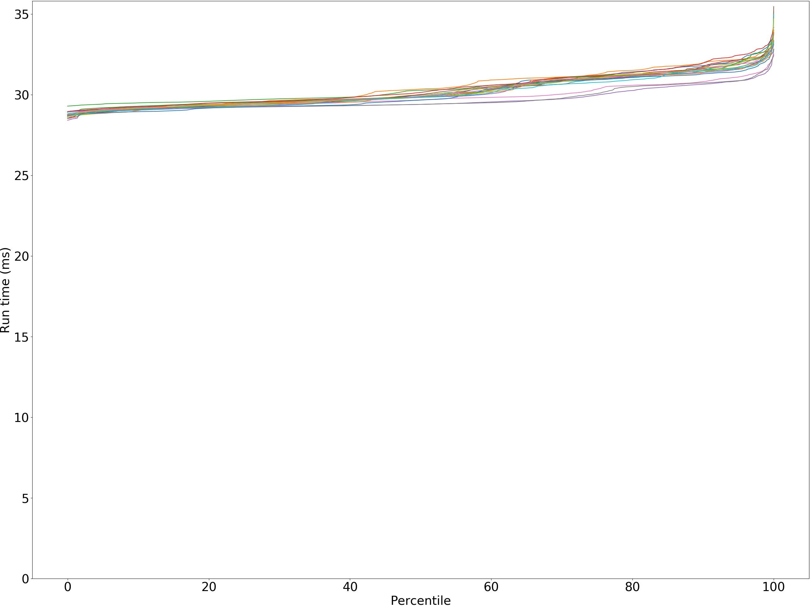
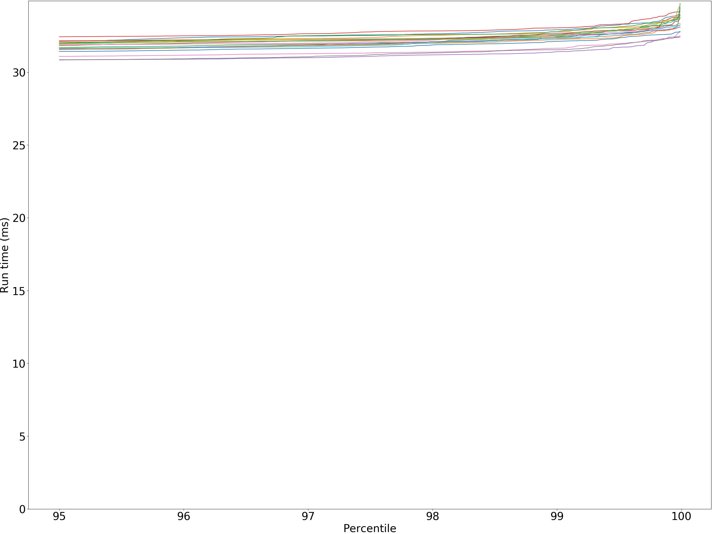

# Summary
## Benchmark run time (ms) at 50 percentile 
Relative test execution times against scala-native-0.4.0-SNAPSHOT@master-concurrent-base@origin-b6000 at 50 percentile

|name | scala-native-0.4.0-SNAPSHOT@master-concurrent-base@origin-b6000|
| -- | -- |
|[bounce.BounceBenchmark](#bouncebouncebenchmark)|0.0236|
|[brainfuck.BrainfuckBenchmark](#brainfuckbrainfuckbenchmark)|1.5402|
|[cd.CDBenchmark](#cdcdbenchmark)|24.2985|
|[deltablue.DeltaBlueBenchmark](#deltabluedeltabluebenchmark)|0.1657|
|[gcbench.GCBenchBenchmark](#gcbenchgcbenchbenchmark)|133.6744|
|[json.JsonBenchmark](#jsonjsonbenchmark)|1.2813|
|[kmeans.KmeansBenchmark](#kmeanskmeansbenchmark)|29.7760|
|[nbody.NbodyBenchmark](#nbodynbodybenchmark)|29.5881|
|[permute.PermuteBenchmark](#permutepermutebenchmark)|0.1621|
|[queens.QueensBenchmark](#queensqueensbenchmark)|0.1142|
|[richards.RichardsBenchmark](#richardsrichardsbenchmark)|0.0646|
|[sudoku.SudokuBenchmark](#sudokusudokubenchmark)|1.9579|
|[tracer.TracerBenchmark](#tracertracerbenchmark)|0.6677|
| __Geometrical mean:__||
## Benchmark run time (ms) at 90 percentile 
Relative test execution times against scala-native-0.4.0-SNAPSHOT@master-concurrent-base@origin-b6000 at 90 percentile

|name | scala-native-0.4.0-SNAPSHOT@master-concurrent-base@origin-b6000|
| -- | -- |
|[bounce.BounceBenchmark](#bouncebouncebenchmark)|0.0238|
|[brainfuck.BrainfuckBenchmark](#brainfuckbrainfuckbenchmark)|1.5874|
|[cd.CDBenchmark](#cdcdbenchmark)|24.7822|
|[deltablue.DeltaBlueBenchmark](#deltabluedeltabluebenchmark)|0.1714|
|[gcbench.GCBenchBenchmark](#gcbenchgcbenchbenchmark)|138.2141|
|[json.JsonBenchmark](#jsonjsonbenchmark)|1.7082|
|[kmeans.KmeansBenchmark](#kmeanskmeansbenchmark)|31.4146|
|[nbody.NbodyBenchmark](#nbodynbodybenchmark)|29.7698|
|[permute.PermuteBenchmark](#permutepermutebenchmark)|0.1824|
|[queens.QueensBenchmark](#queensqueensbenchmark)|0.1169|
|[richards.RichardsBenchmark](#richardsrichardsbenchmark)|0.0664|
|[sudoku.SudokuBenchmark](#sudokusudokubenchmark)|2.1616|
|[tracer.TracerBenchmark](#tracertracerbenchmark)|0.6818|
| __Geometrical mean:__||
## Benchmark run time (ms) at 99 percentile 
Relative test execution times against scala-native-0.4.0-SNAPSHOT@master-concurrent-base@origin-b6000 at 99 percentile

|name | scala-native-0.4.0-SNAPSHOT@master-concurrent-base@origin-b6000|
| -- | -- |
|[bounce.BounceBenchmark](#bouncebouncebenchmark)|0.0254|
|[brainfuck.BrainfuckBenchmark](#brainfuckbrainfuckbenchmark)|1.6554|
|[cd.CDBenchmark](#cdcdbenchmark)|25.5842|
|[deltablue.DeltaBlueBenchmark](#deltabluedeltabluebenchmark)|0.2353|
|[gcbench.GCBenchBenchmark](#gcbenchgcbenchbenchmark)|139.4339|
|[json.JsonBenchmark](#jsonjsonbenchmark)|1.7593|
|[kmeans.KmeansBenchmark](#kmeanskmeansbenchmark)|32.3818|
|[nbody.NbodyBenchmark](#nbodynbodybenchmark)|30.4368|
|[permute.PermuteBenchmark](#permutepermutebenchmark)|0.1896|
|[queens.QueensBenchmark](#queensqueensbenchmark)|0.1236|
|[richards.RichardsBenchmark](#richardsrichardsbenchmark)|0.0733|
|[sudoku.SudokuBenchmark](#sudokusudokubenchmark)|2.3259|
|[tracer.TracerBenchmark](#tracertracerbenchmark)|0.7153|
| __Geometrical mean:__||
## Benchmark run time (ms) at 99.9 percentile 
Relative test execution times against scala-native-0.4.0-SNAPSHOT@master-concurrent-base@origin-b6000 at 99.9 percentile

|name | scala-native-0.4.0-SNAPSHOT@master-concurrent-base@origin-b6000|
| -- | -- |
|[bounce.BounceBenchmark](#bouncebouncebenchmark)|0.0467|
|[brainfuck.BrainfuckBenchmark](#brainfuckbrainfuckbenchmark)|1.7157|
|[cd.CDBenchmark](#cdcdbenchmark)|25.9586|
|[deltablue.DeltaBlueBenchmark](#deltabluedeltabluebenchmark)|0.2573|
|[gcbench.GCBenchBenchmark](#gcbenchgcbenchbenchmark)|140.3239|
|[json.JsonBenchmark](#jsonjsonbenchmark)|1.8183|
|[kmeans.KmeansBenchmark](#kmeanskmeansbenchmark)|33.2200|
|[nbody.NbodyBenchmark](#nbodynbodybenchmark)|31.2923|
|[permute.PermuteBenchmark](#permutepermutebenchmark)|0.2150|
|[queens.QueensBenchmark](#queensqueensbenchmark)|0.1535|
|[richards.RichardsBenchmark](#richardsrichardsbenchmark)|0.0923|
|[sudoku.SudokuBenchmark](#sudokusudokubenchmark)|2.4143|
|[tracer.TracerBenchmark](#tracertracerbenchmark)|0.7606|
| __Geometrical mean:__||
## Benchmark total run time (ms) 
Total test execution times against scala-native-0.4.0-SNAPSHOT@master-concurrent-base@origin-b6000

|name | scala-native-0.4.0-SNAPSHOT@master-concurrent-base@origin-b6000|
| -- | -- |
|[bounce.BounceBenchmark](#bouncebouncebenchmark)|1515.2466|
|[brainfuck.BrainfuckBenchmark](#brainfuckbrainfuckbenchmark)|98599.1091|
|[cd.CDBenchmark](#cdcdbenchmark)|1561244.3266|
|[deltablue.DeltaBlueBenchmark](#deltabluedeltabluebenchmark)|10857.4922|
|[gcbench.GCBenchBenchmark](#gcbenchgcbenchbenchmark)|8492977.1212|
|[json.JsonBenchmark](#jsonjsonbenchmark)|88167.9150|
|[kmeans.KmeansBenchmark](#kmeanskmeansbenchmark)|1926398.9941|
|[nbody.NbodyBenchmark](#nbodynbodybenchmark)|1897343.4849|
|[permute.PermuteBenchmark](#permutepermutebenchmark)|10565.4605|
|[queens.QueensBenchmark](#queensqueensbenchmark)|7348.5050|
|[richards.RichardsBenchmark](#richardsrichardsbenchmark)|4167.1187|
|[sudoku.SudokuBenchmark](#sudokusudokubenchmark)|127185.6209|
|[tracer.TracerBenchmark](#tracertracerbenchmark)|42497.5920|
| __Geometrical mean:__||
# Individual benchmarks
## bounce.BounceBenchmark
bounce.BounceBenchmark

bounce.BounceBenchmark

bounce.BounceBenchmark run #3

bounce.BounceBenchmark scala-native-0.4.0-SNAPSHOT@master-concurrent-base@origin-b6000

bounce.BounceBenchmark scala-native-0.4.0-SNAPSHOT@master-concurrent-base@origin-b6000

## brainfuck.BrainfuckBenchmark
brainfuck.BrainfuckBenchmark

brainfuck.BrainfuckBenchmark

brainfuck.BrainfuckBenchmark run #3

brainfuck.BrainfuckBenchmark scala-native-0.4.0-SNAPSHOT@master-concurrent-base@origin-b6000

brainfuck.BrainfuckBenchmark scala-native-0.4.0-SNAPSHOT@master-concurrent-base@origin-b6000

## cd.CDBenchmark
cd.CDBenchmark

cd.CDBenchmark

cd.CDBenchmark run #3

cd.CDBenchmark scala-native-0.4.0-SNAPSHOT@master-concurrent-base@origin-b6000

cd.CDBenchmark scala-native-0.4.0-SNAPSHOT@master-concurrent-base@origin-b6000

## deltablue.DeltaBlueBenchmark
deltablue.DeltaBlueBenchmark

deltablue.DeltaBlueBenchmark

deltablue.DeltaBlueBenchmark run #3

deltablue.DeltaBlueBenchmark scala-native-0.4.0-SNAPSHOT@master-concurrent-base@origin-b6000

deltablue.DeltaBlueBenchmark scala-native-0.4.0-SNAPSHOT@master-concurrent-base@origin-b6000

## gcbench.GCBenchBenchmark
gcbench.GCBenchBenchmark

gcbench.GCBenchBenchmark

gcbench.GCBenchBenchmark run #3

gcbench.GCBenchBenchmark scala-native-0.4.0-SNAPSHOT@master-concurrent-base@origin-b6000

gcbench.GCBenchBenchmark scala-native-0.4.0-SNAPSHOT@master-concurrent-base@origin-b6000

## json.JsonBenchmark
json.JsonBenchmark

json.JsonBenchmark

json.JsonBenchmark run #3

json.JsonBenchmark scala-native-0.4.0-SNAPSHOT@master-concurrent-base@origin-b6000

json.JsonBenchmark scala-native-0.4.0-SNAPSHOT@master-concurrent-base@origin-b6000

## kmeans.KmeansBenchmark
kmeans.KmeansBenchmark

kmeans.KmeansBenchmark

kmeans.KmeansBenchmark run #3

kmeans.KmeansBenchmark scala-native-0.4.0-SNAPSHOT@master-concurrent-base@origin-b6000

kmeans.KmeansBenchmark scala-native-0.4.0-SNAPSHOT@master-concurrent-base@origin-b6000

## nbody.NbodyBenchmark
nbody.NbodyBenchmark

nbody.NbodyBenchmark

nbody.NbodyBenchmark run #3

nbody.NbodyBenchmark scala-native-0.4.0-SNAPSHOT@master-concurrent-base@origin-b6000

nbody.NbodyBenchmark scala-native-0.4.0-SNAPSHOT@master-concurrent-base@origin-b6000

## permute.PermuteBenchmark
permute.PermuteBenchmark

permute.PermuteBenchmark

permute.PermuteBenchmark run #3

permute.PermuteBenchmark scala-native-0.4.0-SNAPSHOT@master-concurrent-base@origin-b6000

permute.PermuteBenchmark scala-native-0.4.0-SNAPSHOT@master-concurrent-base@origin-b6000

## queens.QueensBenchmark
queens.QueensBenchmark

queens.QueensBenchmark

queens.QueensBenchmark run #3

queens.QueensBenchmark scala-native-0.4.0-SNAPSHOT@master-concurrent-base@origin-b6000

queens.QueensBenchmark scala-native-0.4.0-SNAPSHOT@master-concurrent-base@origin-b6000

## richards.RichardsBenchmark
richards.RichardsBenchmark

richards.RichardsBenchmark

richards.RichardsBenchmark run #3

richards.RichardsBenchmark scala-native-0.4.0-SNAPSHOT@master-concurrent-base@origin-b6000

richards.RichardsBenchmark scala-native-0.4.0-SNAPSHOT@master-concurrent-base@origin-b6000

## sudoku.SudokuBenchmark
sudoku.SudokuBenchmark

sudoku.SudokuBenchmark

sudoku.SudokuBenchmark run #3

sudoku.SudokuBenchmark scala-native-0.4.0-SNAPSHOT@master-concurrent-base@origin-b6000

sudoku.SudokuBenchmark scala-native-0.4.0-SNAPSHOT@master-concurrent-base@origin-b6000

## tracer.TracerBenchmark
tracer.TracerBenchmark

tracer.TracerBenchmark

tracer.TracerBenchmark run #3

tracer.TracerBenchmark scala-native-0.4.0-SNAPSHOT@master-concurrent-base@origin-b6000

tracer.TracerBenchmark scala-native-0.4.0-SNAPSHOT@master-concurrent-base@origin-b6000

