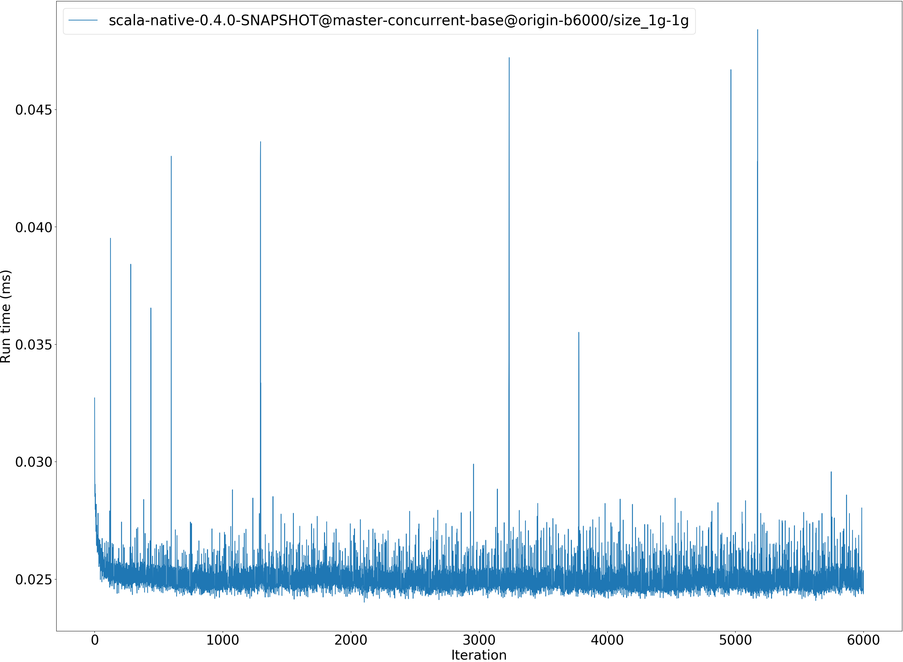
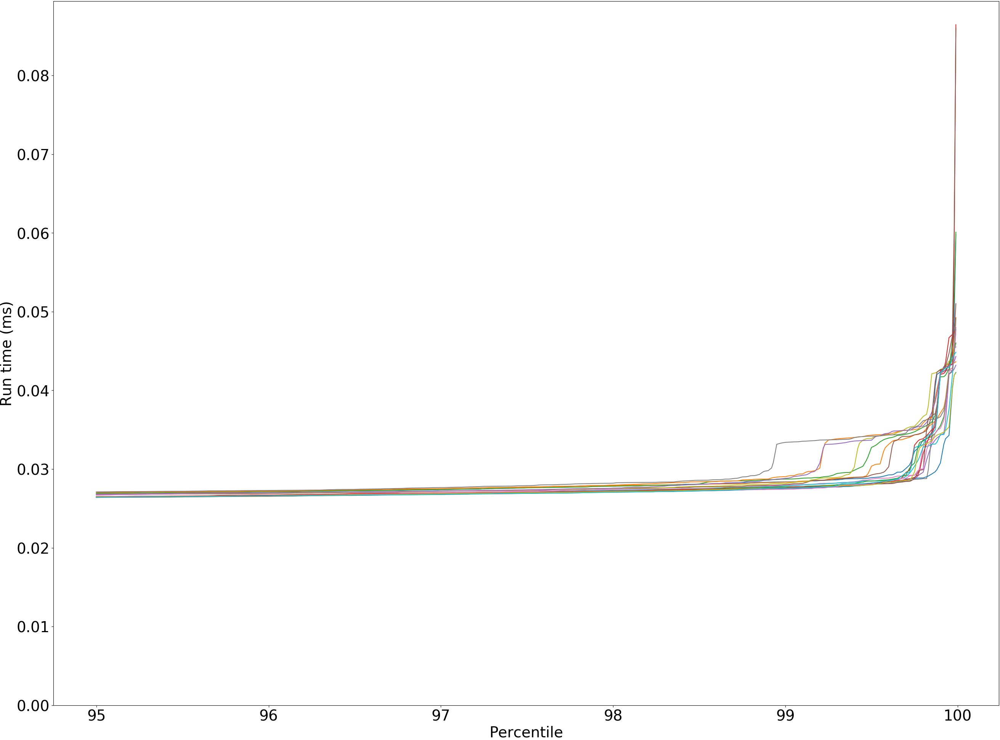
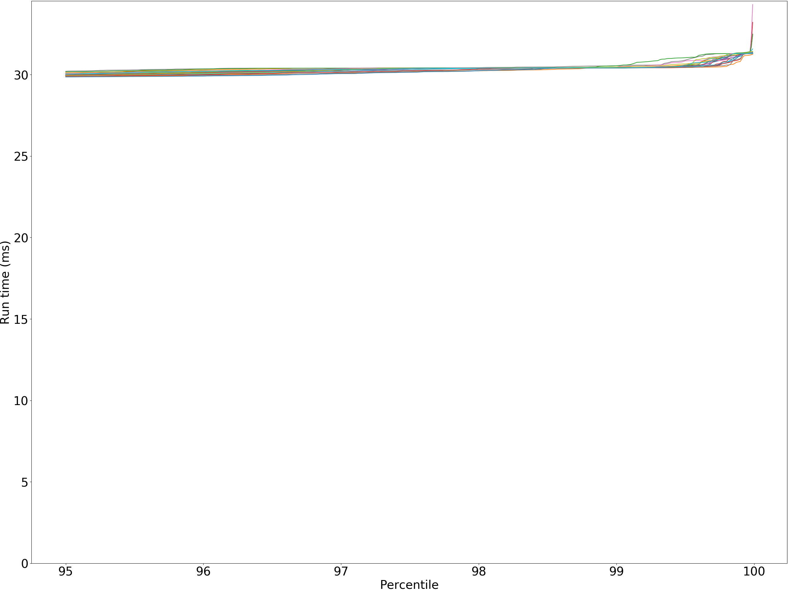
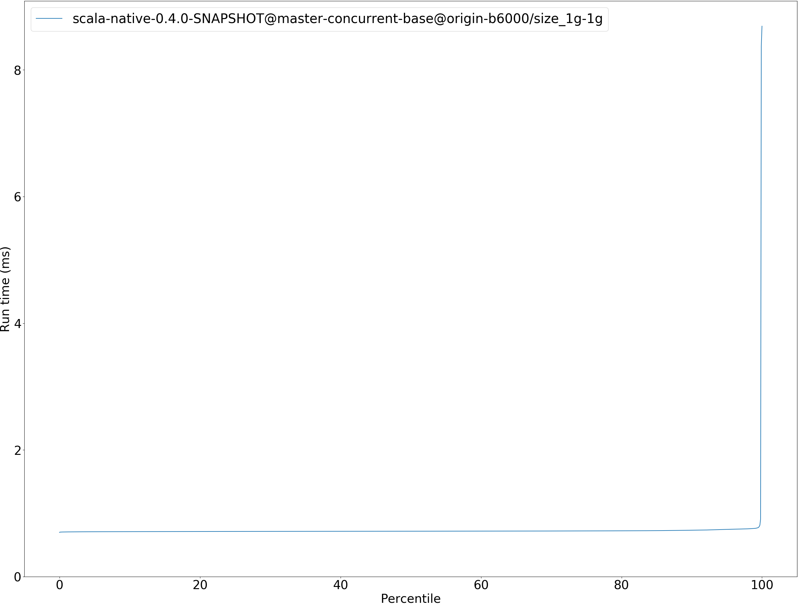

# Summary
## Benchmark run time (ms) at 50 percentile 
Relative test execution times against scala-native-0.4.0-SNAPSHOT@master-concurrent-base@origin-b6000/size_1g-1g at 50 percentile

|name | scala-native-0.4.0-SNAPSHOT@master-concurrent-base@origin-b6000/size_1g-1g|
| -- | -- |
|[bounce.BounceBenchmark](#bouncebouncebenchmark)|0.0247|
|[brainfuck.BrainfuckBenchmark](#brainfuckbrainfuckbenchmark)|1.5228|
|[cd.CDBenchmark](#cdcdbenchmark)|27.2759|
|[deltablue.DeltaBlueBenchmark](#deltabluedeltabluebenchmark)|0.2127|
|[gcbench.GCBenchBenchmark](#gcbenchgcbenchbenchmark)|98.4192|
|[json.JsonBenchmark](#jsonjsonbenchmark)|1.2629|
|[kmeans.KmeansBenchmark](#kmeanskmeansbenchmark)|29.1484|
|[nbody.NbodyBenchmark](#nbodynbodybenchmark)|29.5860|
|[permute.PermuteBenchmark](#permutepermutebenchmark)|0.1788|
|[queens.QueensBenchmark](#queensqueensbenchmark)|0.1176|
|[richards.RichardsBenchmark](#richardsrichardsbenchmark)|0.0679|
|[sudoku.SudokuBenchmark](#sudokusudokubenchmark)|1.9588|
|[tracer.TracerBenchmark](#tracertracerbenchmark)|0.7160|
| __Geometrical mean:__||
## Benchmark run time (ms) at 90 percentile 
Relative test execution times against scala-native-0.4.0-SNAPSHOT@master-concurrent-base@origin-b6000/size_1g-1g at 90 percentile

|name | scala-native-0.4.0-SNAPSHOT@master-concurrent-base@origin-b6000/size_1g-1g|
| -- | -- |
|[bounce.BounceBenchmark](#bouncebouncebenchmark)|0.0260|
|[brainfuck.BrainfuckBenchmark](#brainfuckbrainfuckbenchmark)|1.5617|
|[cd.CDBenchmark](#cdcdbenchmark)|27.9131|
|[deltablue.DeltaBlueBenchmark](#deltabluedeltabluebenchmark)|0.2180|
|[gcbench.GCBenchBenchmark](#gcbenchgcbenchbenchmark)|108.0285|
|[json.JsonBenchmark](#jsonjsonbenchmark)|1.2920|
|[kmeans.KmeansBenchmark](#kmeanskmeansbenchmark)|29.7943|
|[nbody.NbodyBenchmark](#nbodynbodybenchmark)|29.7606|
|[permute.PermuteBenchmark](#permutepermutebenchmark)|0.2870|
|[queens.QueensBenchmark](#queensqueensbenchmark)|0.1206|
|[richards.RichardsBenchmark](#richardsrichardsbenchmark)|0.0702|
|[sudoku.SudokuBenchmark](#sudokusudokubenchmark)|2.0043|
|[tracer.TracerBenchmark](#tracertracerbenchmark)|0.7313|
| __Geometrical mean:__||
## Benchmark run time (ms) at 99 percentile 
Relative test execution times against scala-native-0.4.0-SNAPSHOT@master-concurrent-base@origin-b6000/size_1g-1g at 99 percentile

|name | scala-native-0.4.0-SNAPSHOT@master-concurrent-base@origin-b6000/size_1g-1g|
| -- | -- |
|[bounce.BounceBenchmark](#bouncebouncebenchmark)|0.0279|
|[brainfuck.BrainfuckBenchmark](#brainfuckbrainfuckbenchmark)|1.6158|
|[cd.CDBenchmark](#cdcdbenchmark)|35.2889|
|[deltablue.DeltaBlueBenchmark](#deltabluedeltabluebenchmark)|0.2274|
|[gcbench.GCBenchBenchmark](#gcbenchgcbenchbenchmark)|110.2651|
|[json.JsonBenchmark](#jsonjsonbenchmark)|1.3588|
|[kmeans.KmeansBenchmark](#kmeanskmeansbenchmark)|34.3780|
|[nbody.NbodyBenchmark](#nbodynbodybenchmark)|30.4205|
|[permute.PermuteBenchmark](#permutepermutebenchmark)|0.2962|
|[queens.QueensBenchmark](#queensqueensbenchmark)|0.1265|
|[richards.RichardsBenchmark](#richardsrichardsbenchmark)|0.0749|
|[sudoku.SudokuBenchmark](#sudokusudokubenchmark)|2.0699|
|[tracer.TracerBenchmark](#tracertracerbenchmark)|0.7605|
| __Geometrical mean:__||
## Benchmark run time (ms) at 99.9 percentile 
Relative test execution times against scala-native-0.4.0-SNAPSHOT@master-concurrent-base@origin-b6000/size_1g-1g at 99.9 percentile

|name | scala-native-0.4.0-SNAPSHOT@master-concurrent-base@origin-b6000/size_1g-1g|
| -- | -- |
|[bounce.BounceBenchmark](#bouncebouncebenchmark)|0.0377|
|[brainfuck.BrainfuckBenchmark](#brainfuckbrainfuckbenchmark)|8.8740|
|[cd.CDBenchmark](#cdcdbenchmark)|36.1792|
|[deltablue.DeltaBlueBenchmark](#deltabluedeltabluebenchmark)|0.2591|
|[gcbench.GCBenchBenchmark](#gcbenchgcbenchbenchmark)|111.5746|
|[json.JsonBenchmark](#jsonjsonbenchmark)|9.3534|
|[kmeans.KmeansBenchmark](#kmeanskmeansbenchmark)|35.5274|
|[nbody.NbodyBenchmark](#nbodynbodybenchmark)|31.2903|
|[permute.PermuteBenchmark](#permutepermutebenchmark)|0.3225|
|[queens.QueensBenchmark](#queensqueensbenchmark)|0.1550|
|[richards.RichardsBenchmark](#richardsrichardsbenchmark)|0.0991|
|[sudoku.SudokuBenchmark](#sudokusudokubenchmark)|10.0574|
|[tracer.TracerBenchmark](#tracertracerbenchmark)|8.3526|
| __Geometrical mean:__||
## Benchmark total run time (ms) 
Total test execution times against scala-native-0.4.0-SNAPSHOT@master-concurrent-base@origin-b6000/size_1g-1g

|name | scala-native-0.4.0-SNAPSHOT@master-concurrent-base@origin-b6000/size_1g-1g|
| -- | -- |
|[bounce.BounceBenchmark](#bouncebouncebenchmark)|1604.9919|
|[brainfuck.BrainfuckBenchmark](#brainfuckbrainfuckbenchmark)|98731.6593|
|[cd.CDBenchmark](#cdcdbenchmark)|1780674.6308|
|[deltablue.DeltaBlueBenchmark](#deltabluedeltabluebenchmark)|13654.3565|
|[gcbench.GCBenchBenchmark](#gcbenchgcbenchbenchmark)|6486407.9478|
|[json.JsonBenchmark](#jsonjsonbenchmark)|83821.1389|
|[kmeans.KmeansBenchmark](#kmeanskmeansbenchmark)|1874862.6525|
|[nbody.NbodyBenchmark](#nbodynbodybenchmark)|1897026.4813|
|[permute.PermuteBenchmark](#permutepermutebenchmark)|12594.8118|
|[queens.QueensBenchmark](#queensqueensbenchmark)|7564.9587|
|[richards.RichardsBenchmark](#richardsrichardsbenchmark)|4378.2768|
|[sudoku.SudokuBenchmark](#sudokusudokubenchmark)|126689.9945|
|[tracer.TracerBenchmark](#tracertracerbenchmark)|46981.7335|
| __Geometrical mean:__||
# Individual benchmarks
## bounce.BounceBenchmark
bounce.BounceBenchmark

bounce.BounceBenchmark

bounce.BounceBenchmark run #3

bounce.BounceBenchmark scala-native-0.4.0-SNAPSHOT@master-concurrent-base@origin-b6000/size_1g-1g

bounce.BounceBenchmark scala-native-0.4.0-SNAPSHOT@master-concurrent-base@origin-b6000/size_1g-1g

## brainfuck.BrainfuckBenchmark
brainfuck.BrainfuckBenchmark

brainfuck.BrainfuckBenchmark

brainfuck.BrainfuckBenchmark run #3

brainfuck.BrainfuckBenchmark scala-native-0.4.0-SNAPSHOT@master-concurrent-base@origin-b6000/size_1g-1g

brainfuck.BrainfuckBenchmark scala-native-0.4.0-SNAPSHOT@master-concurrent-base@origin-b6000/size_1g-1g

## cd.CDBenchmark
cd.CDBenchmark

cd.CDBenchmark

cd.CDBenchmark run #3

cd.CDBenchmark scala-native-0.4.0-SNAPSHOT@master-concurrent-base@origin-b6000/size_1g-1g

cd.CDBenchmark scala-native-0.4.0-SNAPSHOT@master-concurrent-base@origin-b6000/size_1g-1g

## deltablue.DeltaBlueBenchmark
deltablue.DeltaBlueBenchmark

deltablue.DeltaBlueBenchmark

deltablue.DeltaBlueBenchmark run #3

deltablue.DeltaBlueBenchmark scala-native-0.4.0-SNAPSHOT@master-concurrent-base@origin-b6000/size_1g-1g

deltablue.DeltaBlueBenchmark scala-native-0.4.0-SNAPSHOT@master-concurrent-base@origin-b6000/size_1g-1g

## gcbench.GCBenchBenchmark
gcbench.GCBenchBenchmark

gcbench.GCBenchBenchmark

gcbench.GCBenchBenchmark run #3

gcbench.GCBenchBenchmark scala-native-0.4.0-SNAPSHOT@master-concurrent-base@origin-b6000/size_1g-1g

gcbench.GCBenchBenchmark scala-native-0.4.0-SNAPSHOT@master-concurrent-base@origin-b6000/size_1g-1g

## json.JsonBenchmark
json.JsonBenchmark

json.JsonBenchmark

json.JsonBenchmark run #3

json.JsonBenchmark scala-native-0.4.0-SNAPSHOT@master-concurrent-base@origin-b6000/size_1g-1g

json.JsonBenchmark scala-native-0.4.0-SNAPSHOT@master-concurrent-base@origin-b6000/size_1g-1g

## kmeans.KmeansBenchmark
kmeans.KmeansBenchmark

kmeans.KmeansBenchmark

kmeans.KmeansBenchmark run #3

kmeans.KmeansBenchmark scala-native-0.4.0-SNAPSHOT@master-concurrent-base@origin-b6000/size_1g-1g

kmeans.KmeansBenchmark scala-native-0.4.0-SNAPSHOT@master-concurrent-base@origin-b6000/size_1g-1g

## nbody.NbodyBenchmark
nbody.NbodyBenchmark

nbody.NbodyBenchmark

nbody.NbodyBenchmark run #3

nbody.NbodyBenchmark scala-native-0.4.0-SNAPSHOT@master-concurrent-base@origin-b6000/size_1g-1g

nbody.NbodyBenchmark scala-native-0.4.0-SNAPSHOT@master-concurrent-base@origin-b6000/size_1g-1g

## permute.PermuteBenchmark
permute.PermuteBenchmark

permute.PermuteBenchmark

permute.PermuteBenchmark run #3

permute.PermuteBenchmark scala-native-0.4.0-SNAPSHOT@master-concurrent-base@origin-b6000/size_1g-1g

permute.PermuteBenchmark scala-native-0.4.0-SNAPSHOT@master-concurrent-base@origin-b6000/size_1g-1g

## queens.QueensBenchmark
queens.QueensBenchmark

queens.QueensBenchmark

queens.QueensBenchmark run #3

queens.QueensBenchmark scala-native-0.4.0-SNAPSHOT@master-concurrent-base@origin-b6000/size_1g-1g

queens.QueensBenchmark scala-native-0.4.0-SNAPSHOT@master-concurrent-base@origin-b6000/size_1g-1g

## richards.RichardsBenchmark
richards.RichardsBenchmark

richards.RichardsBenchmark

richards.RichardsBenchmark run #3

richards.RichardsBenchmark scala-native-0.4.0-SNAPSHOT@master-concurrent-base@origin-b6000/size_1g-1g

richards.RichardsBenchmark scala-native-0.4.0-SNAPSHOT@master-concurrent-base@origin-b6000/size_1g-1g

## sudoku.SudokuBenchmark
sudoku.SudokuBenchmark

sudoku.SudokuBenchmark

sudoku.SudokuBenchmark run #3

sudoku.SudokuBenchmark scala-native-0.4.0-SNAPSHOT@master-concurrent-base@origin-b6000/size_1g-1g

sudoku.SudokuBenchmark scala-native-0.4.0-SNAPSHOT@master-concurrent-base@origin-b6000/size_1g-1g

## tracer.TracerBenchmark
tracer.TracerBenchmark

tracer.TracerBenchmark

tracer.TracerBenchmark run #3

tracer.TracerBenchmark scala-native-0.4.0-SNAPSHOT@master-concurrent-base@origin-b6000/size_1g-1g

tracer.TracerBenchmark scala-native-0.4.0-SNAPSHOT@master-concurrent-base@origin-b6000/size_1g-1g

