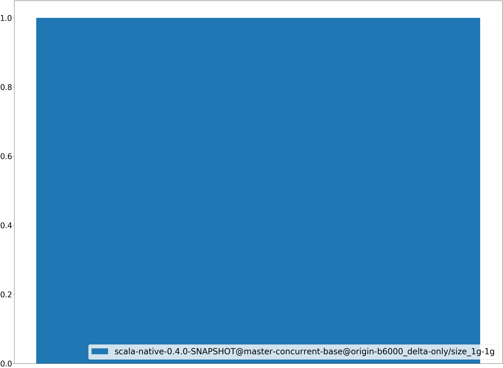
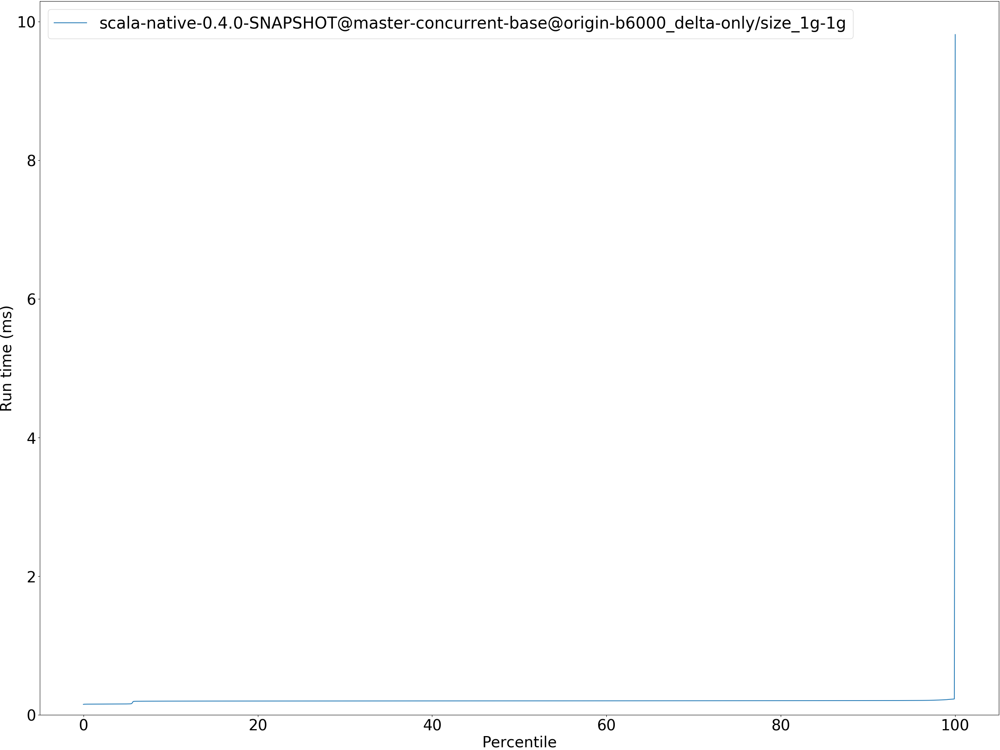
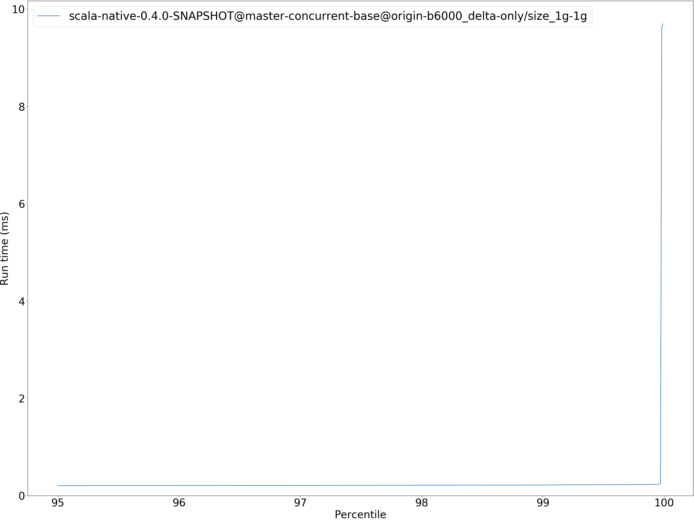
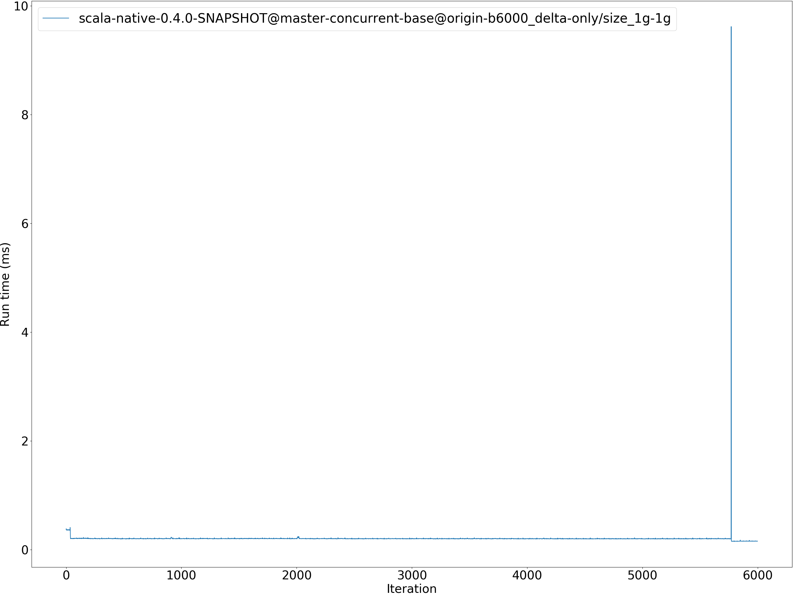
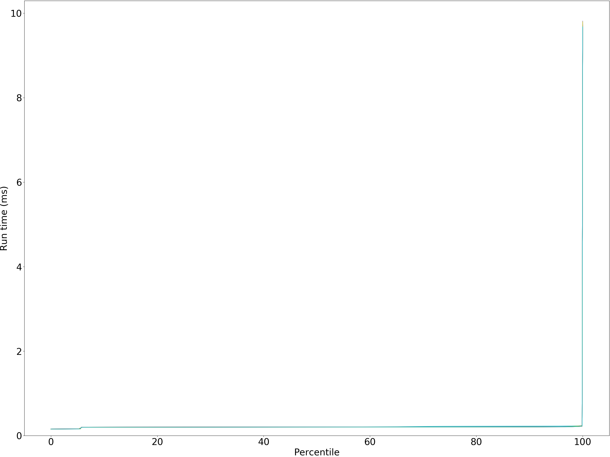
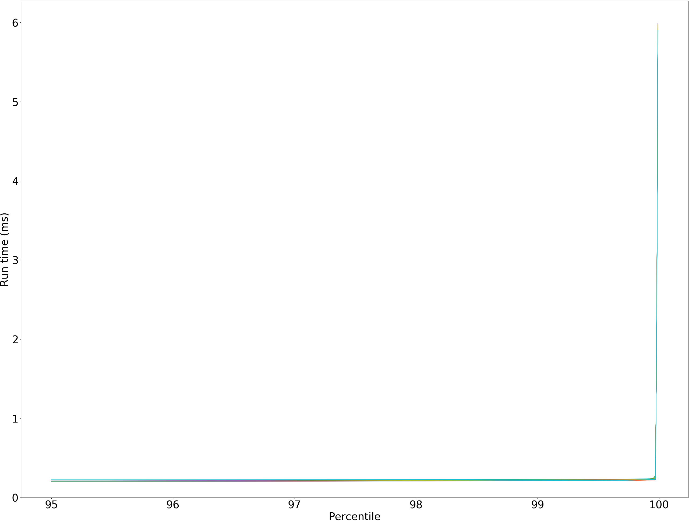

# Summary
## Benchmark run time (ms) at 50 percentile 
Relative test execution times against scala-native-0.4.0-SNAPSHOT@master-concurrent-base@origin-b6000_delta-only/size_1g-1g at 50 percentile

|name | scala-native-0.4.0-SNAPSHOT@master-concurrent-base@origin-b6000_delta-only/size_1g-1g|
| -- | -- |
|[deltablue.DeltaBlueBenchmark](#deltabluedeltabluebenchmark)|0.2001|
| __Geometrical mean:__||
## Benchmark run time (ms) at 90 percentile 
Relative test execution times against scala-native-0.4.0-SNAPSHOT@master-concurrent-base@origin-b6000_delta-only/size_1g-1g at 90 percentile

|name | scala-native-0.4.0-SNAPSHOT@master-concurrent-base@origin-b6000_delta-only/size_1g-1g|
| -- | -- |
|[deltablue.DeltaBlueBenchmark](#deltabluedeltabluebenchmark)|0.2039|
| __Geometrical mean:__||
## Benchmark run time (ms) at 99 percentile 
Relative test execution times against scala-native-0.4.0-SNAPSHOT@master-concurrent-base@origin-b6000_delta-only/size_1g-1g at 99 percentile

|name | scala-native-0.4.0-SNAPSHOT@master-concurrent-base@origin-b6000_delta-only/size_1g-1g|
| -- | -- |
|[deltablue.DeltaBlueBenchmark](#deltabluedeltabluebenchmark)|0.2158|
| __Geometrical mean:__||
## Benchmark run time (ms) at 99.9 percentile 
Relative test execution times against scala-native-0.4.0-SNAPSHOT@master-concurrent-base@origin-b6000_delta-only/size_1g-1g at 99.9 percentile

|name | scala-native-0.4.0-SNAPSHOT@master-concurrent-base@origin-b6000_delta-only/size_1g-1g|
| -- | -- |
|[deltablue.DeltaBlueBenchmark](#deltabluedeltabluebenchmark)|0.2281|
| __Geometrical mean:__||
## Benchmark total run time (ms) 
Total test execution times against scala-native-0.4.0-SNAPSHOT@master-concurrent-base@origin-b6000_delta-only/size_1g-1g

|name | scala-native-0.4.0-SNAPSHOT@master-concurrent-base@origin-b6000_delta-only/size_1g-1g|
| -- | -- |
|[deltablue.DeltaBlueBenchmark](#deltabluedeltabluebenchmark)|12836.0193|
| __Geometrical mean:__||
# Individual benchmarks
## deltablue.DeltaBlueBenchmark
deltablue.DeltaBlueBenchmark

deltablue.DeltaBlueBenchmark

deltablue.DeltaBlueBenchmark run #3

deltablue.DeltaBlueBenchmark scala-native-0.4.0-SNAPSHOT@master-concurrent-base@origin-b6000_delta-only/size_1g-1g

deltablue.DeltaBlueBenchmark scala-native-0.4.0-SNAPSHOT@master-concurrent-base@origin-b6000_delta-only/size_1g-1g

