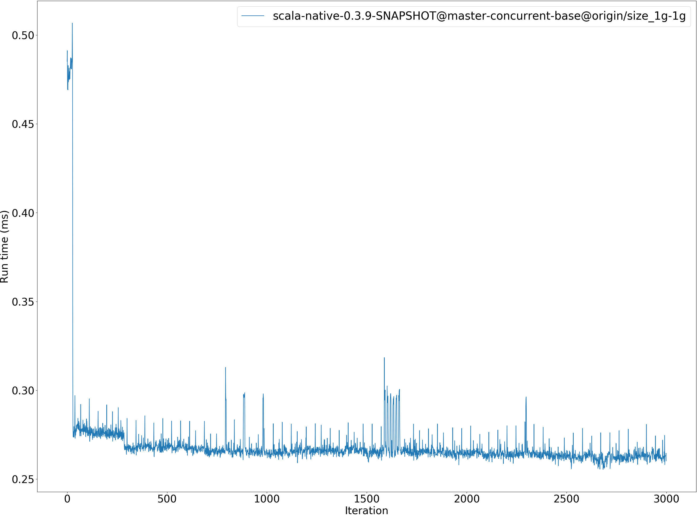
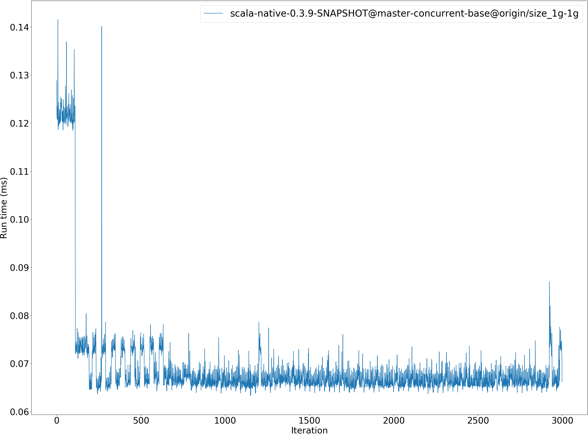

# Summary
## Benchmark run time (ms) at 50 percentile 
Relative test execution times against scala-native-0.3.9-SNAPSHOT@master-concurrent-base@origin/size_1g-1g at 50 percentile

|name | scala-native-0.3.9-SNAPSHOT@master-concurrent-base@origin/size_1g-1g|
| -- | -- |
|[bounce.BounceBenchmark](#bouncebouncebenchmark)|0.0496|
|[brainfuck.BrainfuckBenchmark](#brainfuckbrainfuckbenchmark)|3.3031|
|[cd.CDBenchmark](#cdcdbenchmark)|20.6914|
|[deltablue.DeltaBlueBenchmark](#deltabluedeltabluebenchmark)|0.2224|
|[gcbench.GCBenchBenchmark](#gcbenchgcbenchbenchmark)|93.8819|
|[json.JsonBenchmark](#jsonjsonbenchmark)|1.3236|
|[kmeans.KmeansBenchmark](#kmeanskmeansbenchmark)|44.3625|
|[nbody.NbodyBenchmark](#nbodynbodybenchmark)|27.9670|
|[permute.PermuteBenchmark](#permutepermutebenchmark)|0.2626|
|[queens.QueensBenchmark](#queensqueensbenchmark)|0.0859|
|[richards.RichardsBenchmark](#richardsrichardsbenchmark)|0.0658|
|[sudoku.SudokuBenchmark](#sudokusudokubenchmark)|2.5023|
|[tracer.TracerBenchmark](#tracertracerbenchmark)|0.5929|
| __Geometrical mean:__||
## Benchmark run time (ms) at 90 percentile 
Relative test execution times against scala-native-0.3.9-SNAPSHOT@master-concurrent-base@origin/size_1g-1g at 90 percentile

|name | scala-native-0.3.9-SNAPSHOT@master-concurrent-base@origin/size_1g-1g|
| -- | -- |
|[bounce.BounceBenchmark](#bouncebouncebenchmark)|0.0509|
|[brainfuck.BrainfuckBenchmark](#brainfuckbrainfuckbenchmark)|3.3252|
|[cd.CDBenchmark](#cdcdbenchmark)|20.8909|
|[deltablue.DeltaBlueBenchmark](#deltabluedeltabluebenchmark)|0.2253|
|[gcbench.GCBenchBenchmark](#gcbenchgcbenchbenchmark)|100.5072|
|[json.JsonBenchmark](#jsonjsonbenchmark)|2.2110|
|[kmeans.KmeansBenchmark](#kmeanskmeansbenchmark)|44.6819|
|[nbody.NbodyBenchmark](#nbodynbodybenchmark)|28.3168|
|[permute.PermuteBenchmark](#permutepermutebenchmark)|0.2673|
|[queens.QueensBenchmark](#queensqueensbenchmark)|0.0881|
|[richards.RichardsBenchmark](#richardsrichardsbenchmark)|0.0688|
|[sudoku.SudokuBenchmark](#sudokusudokubenchmark)|3.2630|
|[tracer.TracerBenchmark](#tracertracerbenchmark)|0.6099|
| __Geometrical mean:__||
## Benchmark run time (ms) at 99 percentile 
Relative test execution times against scala-native-0.3.9-SNAPSHOT@master-concurrent-base@origin/size_1g-1g at 99 percentile

|name | scala-native-0.3.9-SNAPSHOT@master-concurrent-base@origin/size_1g-1g|
| -- | -- |
|[bounce.BounceBenchmark](#bouncebouncebenchmark)|0.0542|
|[brainfuck.BrainfuckBenchmark](#brainfuckbrainfuckbenchmark)|3.4783|
|[cd.CDBenchmark](#cdcdbenchmark)|30.4392|
|[deltablue.DeltaBlueBenchmark](#deltabluedeltabluebenchmark)|0.2353|
|[gcbench.GCBenchBenchmark](#gcbenchgcbenchbenchmark)|103.6539|
|[json.JsonBenchmark](#jsonjsonbenchmark)|2.3650|
|[kmeans.KmeansBenchmark](#kmeanskmeansbenchmark)|53.9748|
|[nbody.NbodyBenchmark](#nbodynbodybenchmark)|29.4476|
|[permute.PermuteBenchmark](#permutepermutebenchmark)|0.2812|
|[queens.QueensBenchmark](#queensqueensbenchmark)|0.0916|
|[richards.RichardsBenchmark](#richardsrichardsbenchmark)|0.0719|
|[sudoku.SudokuBenchmark](#sudokusudokubenchmark)|3.3884|
|[tracer.TracerBenchmark](#tracertracerbenchmark)|0.6365|
| __Geometrical mean:__||
## Benchmark run time (ms) at 99.9 percentile 
Relative test execution times against scala-native-0.3.9-SNAPSHOT@master-concurrent-base@origin/size_1g-1g at 99.9 percentile

|name | scala-native-0.3.9-SNAPSHOT@master-concurrent-base@origin/size_1g-1g|
| -- | -- |
|[bounce.BounceBenchmark](#bouncebouncebenchmark)|0.0575|
|[brainfuck.BrainfuckBenchmark](#brainfuckbrainfuckbenchmark)|12.7121|
|[cd.CDBenchmark](#cdcdbenchmark)|30.6420|
|[deltablue.DeltaBlueBenchmark](#deltabluedeltabluebenchmark)|0.2491|
|[gcbench.GCBenchBenchmark](#gcbenchgcbenchbenchmark)|105.1440|
|[json.JsonBenchmark](#jsonjsonbenchmark)|13.8279|
|[kmeans.KmeansBenchmark](#kmeanskmeansbenchmark)|54.9393|
|[nbody.NbodyBenchmark](#nbodynbodybenchmark)|37.7260|
|[permute.PermuteBenchmark](#permutepermutebenchmark)|0.2951|
|[queens.QueensBenchmark](#queensqueensbenchmark)|0.0962|
|[richards.RichardsBenchmark](#richardsrichardsbenchmark)|0.0761|
|[sudoku.SudokuBenchmark](#sudokusudokubenchmark)|8.0867|
|[tracer.TracerBenchmark](#tracertracerbenchmark)|10.1842|
| __Geometrical mean:__||
## Benchmark total run time (ms) 
Total test execution times against scala-native-0.3.9-SNAPSHOT@master-concurrent-base@origin/size_1g-1g

|name | scala-native-0.3.9-SNAPSHOT@master-concurrent-base@origin/size_1g-1g|
| -- | -- |
|[bounce.BounceBenchmark](#bouncebouncebenchmark)|795.8913|
|[brainfuck.BrainfuckBenchmark](#brainfuckbrainfuckbenchmark)|53580.5585|
|[cd.CDBenchmark](#cdcdbenchmark)|341395.4434|
|[deltablue.DeltaBlueBenchmark](#deltabluedeltabluebenchmark)|3564.5529|
|[gcbench.GCBenchBenchmark](#gcbenchgcbenchbenchmark)|1483186.4859|
|[json.JsonBenchmark](#jsonjsonbenchmark)|25174.1550|
|[kmeans.KmeansBenchmark](#kmeanskmeansbenchmark)|714507.6382|
|[nbody.NbodyBenchmark](#nbodynbodybenchmark)|449788.5329|
|[permute.PermuteBenchmark](#permutepermutebenchmark)|4214.4793|
|[queens.QueensBenchmark](#queensqueensbenchmark)|1379.1297|
|[richards.RichardsBenchmark](#richardsrichardsbenchmark)|1060.9874|
|[sudoku.SudokuBenchmark](#sudokusudokubenchmark)|45048.6806|
|[tracer.TracerBenchmark](#tracertracerbenchmark)|10069.2695|
| __Geometrical mean:__||
# Individual benchmarks
## bounce.BounceBenchmark
bounce.BounceBenchmark

bounce.BounceBenchmark

bounce.BounceBenchmark run #3

bounce.BounceBenchmark scala-native-0.3.9-SNAPSHOT@master-concurrent-base@origin/size_1g-1g

bounce.BounceBenchmark scala-native-0.3.9-SNAPSHOT@master-concurrent-base@origin/size_1g-1g

## brainfuck.BrainfuckBenchmark
brainfuck.BrainfuckBenchmark

brainfuck.BrainfuckBenchmark

brainfuck.BrainfuckBenchmark run #3

brainfuck.BrainfuckBenchmark scala-native-0.3.9-SNAPSHOT@master-concurrent-base@origin/size_1g-1g

brainfuck.BrainfuckBenchmark scala-native-0.3.9-SNAPSHOT@master-concurrent-base@origin/size_1g-1g

## cd.CDBenchmark
cd.CDBenchmark

cd.CDBenchmark

cd.CDBenchmark run #3

cd.CDBenchmark scala-native-0.3.9-SNAPSHOT@master-concurrent-base@origin/size_1g-1g

cd.CDBenchmark scala-native-0.3.9-SNAPSHOT@master-concurrent-base@origin/size_1g-1g

## deltablue.DeltaBlueBenchmark
deltablue.DeltaBlueBenchmark

deltablue.DeltaBlueBenchmark

deltablue.DeltaBlueBenchmark run #3

deltablue.DeltaBlueBenchmark scala-native-0.3.9-SNAPSHOT@master-concurrent-base@origin/size_1g-1g

deltablue.DeltaBlueBenchmark scala-native-0.3.9-SNAPSHOT@master-concurrent-base@origin/size_1g-1g

## gcbench.GCBenchBenchmark
gcbench.GCBenchBenchmark

gcbench.GCBenchBenchmark

gcbench.GCBenchBenchmark run #3

gcbench.GCBenchBenchmark scala-native-0.3.9-SNAPSHOT@master-concurrent-base@origin/size_1g-1g

gcbench.GCBenchBenchmark scala-native-0.3.9-SNAPSHOT@master-concurrent-base@origin/size_1g-1g

## json.JsonBenchmark
json.JsonBenchmark

json.JsonBenchmark

json.JsonBenchmark run #3

json.JsonBenchmark scala-native-0.3.9-SNAPSHOT@master-concurrent-base@origin/size_1g-1g

json.JsonBenchmark scala-native-0.3.9-SNAPSHOT@master-concurrent-base@origin/size_1g-1g

## kmeans.KmeansBenchmark
kmeans.KmeansBenchmark

kmeans.KmeansBenchmark

kmeans.KmeansBenchmark run #3

kmeans.KmeansBenchmark scala-native-0.3.9-SNAPSHOT@master-concurrent-base@origin/size_1g-1g

kmeans.KmeansBenchmark scala-native-0.3.9-SNAPSHOT@master-concurrent-base@origin/size_1g-1g

## nbody.NbodyBenchmark
nbody.NbodyBenchmark

nbody.NbodyBenchmark

nbody.NbodyBenchmark run #3

nbody.NbodyBenchmark scala-native-0.3.9-SNAPSHOT@master-concurrent-base@origin/size_1g-1g

nbody.NbodyBenchmark scala-native-0.3.9-SNAPSHOT@master-concurrent-base@origin/size_1g-1g

## permute.PermuteBenchmark
permute.PermuteBenchmark

permute.PermuteBenchmark

permute.PermuteBenchmark run #3

permute.PermuteBenchmark scala-native-0.3.9-SNAPSHOT@master-concurrent-base@origin/size_1g-1g

permute.PermuteBenchmark scala-native-0.3.9-SNAPSHOT@master-concurrent-base@origin/size_1g-1g

## queens.QueensBenchmark
queens.QueensBenchmark

queens.QueensBenchmark

queens.QueensBenchmark run #3

queens.QueensBenchmark scala-native-0.3.9-SNAPSHOT@master-concurrent-base@origin/size_1g-1g

queens.QueensBenchmark scala-native-0.3.9-SNAPSHOT@master-concurrent-base@origin/size_1g-1g

## richards.RichardsBenchmark
richards.RichardsBenchmark

richards.RichardsBenchmark

richards.RichardsBenchmark run #3

richards.RichardsBenchmark scala-native-0.3.9-SNAPSHOT@master-concurrent-base@origin/size_1g-1g

richards.RichardsBenchmark scala-native-0.3.9-SNAPSHOT@master-concurrent-base@origin/size_1g-1g

## sudoku.SudokuBenchmark
sudoku.SudokuBenchmark

sudoku.SudokuBenchmark

sudoku.SudokuBenchmark run #3

sudoku.SudokuBenchmark scala-native-0.3.9-SNAPSHOT@master-concurrent-base@origin/size_1g-1g

sudoku.SudokuBenchmark scala-native-0.3.9-SNAPSHOT@master-concurrent-base@origin/size_1g-1g

## tracer.TracerBenchmark
tracer.TracerBenchmark

tracer.TracerBenchmark

tracer.TracerBenchmark run #3

tracer.TracerBenchmark scala-native-0.3.9-SNAPSHOT@master-concurrent-base@origin/size_1g-1g

tracer.TracerBenchmark scala-native-0.3.9-SNAPSHOT@master-concurrent-base@origin/size_1g-1g

