# Summary
## Benchmark run time (ms) at 50 percentile 
Relative test execution times against unified-heap/size_1g-1g at 50 percentile

|name | unified-heap/size_1g-1g | commix-lite-gc/size_512m-512m_gcthreads_8 |  | commix-lite-gc/size_1g-1g_gcthreads_8 |  | commix-lite-gc/size_2g-2g_gcthreads_8 |  | commix-lite-gc/size_4g-4g_gcthreads_8 |  | commix-lite-gc/size_8g-8g_gcthreads_8 |  | commix-lite-gc/size_16g-16g_gcthreads_8 | |
| -- | -- | -- | -- | -- | -- | -- | -- | -- | -- | -- | -- | -- | -- |
|[bounce.BounceBenchmark](#bouncebouncebenchmark)|0.0161|0.0166|+3.18%|0.0165|+2.99%|0.0166|+3.12%|0.0166|+3.25%|0.0166|+3.14%|0.0165|+3.10%|
|[brainfuck.BrainfuckBenchmark](#brainfuckbrainfuckbenchmark)|1.0798|1.0816|+0.16%|1.0816|+0.17%|1.0814|+0.14%|1.0853|+0.51%|1.5284|+41.54%|1.5325|+41.92%|
|[cd.CDBenchmark](#cdcdbenchmark)|16.1860|16.2134|+0.17%|16.2475|+0.38%|16.2500|+0.39%|16.2520|+0.41%|16.2391|+0.33%|16.2588|+0.45%|
|[deltablue.DeltaBlueBenchmark](#deltabluedeltabluebenchmark)|0.1752|0.1303|__-25.62%__|0.1770|+1.02%|0.1784|+1.85%|0.1786|+1.92%|0.1785|+1.87%|0.1779|+1.53%|
|[gcbench.GCBenchBenchmark](#gcbenchgcbenchbenchmark)|66.7520|63.2386|__-5.26%__|63.5452|__-4.80%__|62.4244|__-6.48%__|62.8298|__-5.88%__|62.5812|__-6.25%__|62.5783|__-6.25%__|
|[json.JsonBenchmark](#jsonjsonbenchmark)|0.8217|0.8153|__-0.78%__|0.8272|+0.67%|0.8246|+0.35%|0.8218|+0.01%|0.8210|__-0.08%__|0.8250|+0.40%|
|[kmeans.KmeansBenchmark](#kmeanskmeansbenchmark)|19.8252|19.8202|__-0.03%__|19.7459|__-0.40%__|19.7317|__-0.47%__|19.7395|__-0.43%__|19.7174|__-0.54%__|19.7276|__-0.49%__|
|[nbody.NbodyBenchmark](#nbodynbodybenchmark)|19.2773|19.2773|+0.00%|19.2773|+0.00%|19.2774|+0.00%|19.2772|__-0.00%__|19.2774|+0.00%|19.2772|__-0.00%__|
|[permute.PermuteBenchmark](#permutepermutebenchmark)|0.1229|0.1258|+2.38%|0.1258|+2.39%|0.2291|+86.46%|0.2302|+87.39%|0.2309|+87.97%|0.2297|+86.99%|
|[queens.QueensBenchmark](#queensqueensbenchmark)|0.0528|0.0526|__-0.34%__|0.0526|__-0.32%__|0.0527|__-0.21%__|0.0526|__-0.30%__|0.0526|__-0.30%__|0.0527|__-0.13%__|
|[richards.RichardsBenchmark](#richardsrichardsbenchmark)|0.0539|0.0543|+0.77%|0.0543|+0.82%|0.0543|+0.75%|0.0543|+0.78%|0.0543|+0.78%|0.0543|+0.77%|
|[sudoku.SudokuBenchmark](#sudokusudokubenchmark)|1.4260|1.4689|+3.01%|1.4696|+3.06%|1.4680|+2.95%|1.4776|+3.62%|1.8857|+32.24%|1.8882|+32.41%|
|[tracer.TracerBenchmark](#tracertracerbenchmark)|0.4569|0.4506|__-1.38%__|0.4518|__-1.11%__|0.4519|__-1.09%__|0.4514|__-1.20%__|0.4560|__-0.19%__|0.9849|+115.55%|
| __Geometrical mean:__|| |__-2.13%__| |+0.36%| |+4.99%| |+5.14%| |+10.03%| |+16.77%|
## Benchmark run time (ms) at 90 percentile 
Relative test execution times against unified-heap/size_1g-1g at 90 percentile

|name | unified-heap/size_1g-1g | commix-lite-gc/size_512m-512m_gcthreads_8 |  | commix-lite-gc/size_1g-1g_gcthreads_8 |  | commix-lite-gc/size_2g-2g_gcthreads_8 |  | commix-lite-gc/size_4g-4g_gcthreads_8 |  | commix-lite-gc/size_8g-8g_gcthreads_8 |  | commix-lite-gc/size_16g-16g_gcthreads_8 | |
| -- | -- | -- | -- | -- | -- | -- | -- | -- | -- | -- | -- | -- | -- |
|[bounce.BounceBenchmark](#bouncebouncebenchmark)|0.0171|0.0178|+4.23%|0.0176|+3.10%|0.0178|+4.05%|0.0178|+4.47%|0.0178|+4.02%|0.0178|+4.13%|
|[brainfuck.BrainfuckBenchmark](#brainfuckbrainfuckbenchmark)|1.0853|1.0891|+0.35%|1.0881|+0.25%|1.0871|+0.16%|1.0984|+1.21%|1.5362|+41.55%|1.5399|+41.89%|
|[cd.CDBenchmark](#cdcdbenchmark)|19.1555|19.1296|__-0.13%__|17.2975|__-9.70%__|18.3530|__-4.19%__|19.2197|+0.34%|18.0324|__-5.86%__|19.1638|+0.04%|
|[deltablue.DeltaBlueBenchmark](#deltabluedeltabluebenchmark)|0.1770|0.1789|+1.06%|0.1789|+1.08%|0.1806|+2.03%|0.1807|+2.10%|0.1806|+2.05%|0.1801|+1.74%|
|[gcbench.GCBenchBenchmark](#gcbenchgcbenchbenchmark)|68.7047|63.5746|__-7.47%__|65.4486|__-4.74%__|66.0481|__-3.87%__|68.0078|__-1.01%__|71.4986|+4.07%|63.2909|__-7.88%__|
|[json.JsonBenchmark](#jsonjsonbenchmark)|0.8304|0.8275|__-0.35%__|0.8348|+0.53%|0.8334|+0.36%|0.8308|+0.05%|0.8301|__-0.04%__|2.1854|+163.16%|
|[kmeans.KmeansBenchmark](#kmeanskmeansbenchmark)|20.1316|20.1213|__-0.05%__|20.0401|__-0.45%__|20.0142|__-0.58%__|20.0317|__-0.50%__|20.0155|__-0.58%__|20.0034|__-0.64%__|
|[nbody.NbodyBenchmark](#nbodynbodybenchmark)|19.2786|19.2786|+0.00%|19.2786|+0.00%|19.2786|+0.00%|19.2785|__-0.00%__|19.2788|+0.00%|19.2785|__-0.00%__|
|[permute.PermuteBenchmark](#permutepermutebenchmark)|0.2254|0.1271|__-43.62%__|0.2276|+0.99%|0.2314|+2.67%|0.2322|+3.04%|0.2331|+3.43%|0.2318|+2.87%|
|[queens.QueensBenchmark](#queensqueensbenchmark)|0.0539|0.0543|+0.80%|0.0537|__-0.26%__|0.0544|+0.93%|0.0543|+0.88%|0.0544|+0.90%|0.0544|+1.03%|
|[richards.RichardsBenchmark](#richardsrichardsbenchmark)|0.0555|0.0564|+1.73%|0.0557|+0.48%|0.0564|+1.63%|0.0564|+1.58%|0.0565|+1.80%|0.0563|+1.55%|
|[sudoku.SudokuBenchmark](#sudokusudokubenchmark)|1.4773|1.5190|+2.82%|1.5186|+2.79%|1.5110|+2.28%|1.8903|+27.95%|1.8917|+28.04%|1.9089|+29.21%|
|[tracer.TracerBenchmark](#tracertracerbenchmark)|0.4609|0.4552|__-1.24%__|0.4560|__-1.07%__|0.4563|__-0.99%__|0.4557|__-1.13%__|0.9780|+112.20%|0.9907|+114.94%|
| __Geometrical mean:__|| |__-4.22%__| |__-0.59%__| |+0.32%| |+2.77%| |+11.72%| |+19.93%|
## Benchmark run time (ms) at 99 percentile 
Relative test execution times against unified-heap/size_1g-1g at 99 percentile

|name | unified-heap/size_1g-1g | commix-lite-gc/size_512m-512m_gcthreads_8 |  | commix-lite-gc/size_1g-1g_gcthreads_8 |  | commix-lite-gc/size_2g-2g_gcthreads_8 |  | commix-lite-gc/size_4g-4g_gcthreads_8 |  | commix-lite-gc/size_8g-8g_gcthreads_8 |  | commix-lite-gc/size_16g-16g_gcthreads_8 | |
| -- | -- | -- | -- | -- | -- | -- | -- | -- | -- | -- | -- | -- | -- |
|[bounce.BounceBenchmark](#bouncebouncebenchmark)|0.0183|0.0195|+6.73%|0.0189|+3.45%|0.0194|+6.12%|0.0196|+7.21%|0.0194|+6.07%|0.0194|+6.17%|
|[brainfuck.BrainfuckBenchmark](#brainfuckbrainfuckbenchmark)|1.0905|1.1085|+1.64%|1.1036|+1.19%|1.0947|+0.38%|1.5399|+41.20%|1.5425|+41.44%|1.5496|+42.09%|
|[cd.CDBenchmark](#cdcdbenchmark)|22.0622|19.5503|__-11.39%__|19.1863|__-13.04%__|19.2098|__-12.93%__|22.5175|+2.06%|19.2207|__-12.88%__|19.2162|__-12.90%__|
|[deltablue.DeltaBlueBenchmark](#deltabluedeltabluebenchmark)|0.1794|0.1827|+1.87%|0.1814|+1.13%|0.1830|+2.02%|0.1831|+2.05%|0.1830|+2.01%|0.1826|+1.77%|
|[gcbench.GCBenchBenchmark](#gcbenchgcbenchbenchmark)|76.7014|64.4723|__-15.94%__|65.9349|__-14.04%__|66.7345|__-12.99%__|69.2449|__-9.72%__|73.8324|__-3.74%__|83.9288|+9.42%|
|[json.JsonBenchmark](#jsonjsonbenchmark)|0.8394|1.3709|+63.31%|0.8656|+3.12%|0.8488|+1.11%|0.8411|+0.20%|0.8409|+0.18%|2.1930|+161.25%|
|[kmeans.KmeansBenchmark](#kmeanskmeansbenchmark)|22.8109|20.6063|__-9.66%__|20.6490|__-9.48%__|20.3765|__-10.67%__|20.4244|__-10.46%__|28.8016|+26.26%|20.3010|__-11.00%__|
|[nbody.NbodyBenchmark](#nbodynbodybenchmark)|19.2814|19.2815|+0.00%|19.2813|__-0.00%__|19.2809|__-0.00%__|19.2805|__-0.00%__|28.5526|+48.08%|19.2811|__-0.00%__|
|[permute.PermuteBenchmark](#permutepermutebenchmark)|0.2290|0.1308|__-42.90%__|0.2307|+0.71%|0.2340|+2.15%|0.2345|+2.37%|0.2355|+2.83%|0.2343|+2.29%|
|[queens.QueensBenchmark](#queensqueensbenchmark)|0.0551|0.0561|+1.86%|0.0550|__-0.18%__|0.0562|+2.08%|0.0562|+1.99%|0.0562|+2.04%|0.0562|+2.13%|
|[richards.RichardsBenchmark](#richardsrichardsbenchmark)|0.0585|0.0588|+0.51%|0.0575|__-1.66%__|0.0590|+0.93%|0.0588|+0.61%|0.0589|+0.74%|0.0585|+0.06%|
|[sudoku.SudokuBenchmark](#sudokusudokubenchmark)|1.4886|1.5503|+4.14%|1.5343|+3.07%|1.5492|+4.07%|1.9349|+29.98%|1.8964|+27.39%|1.9175|+28.81%|
|[tracer.TracerBenchmark](#tracertracerbenchmark)|0.4652|0.4674|+0.49%|0.4610|__-0.89%__|0.4614|__-0.81%__|0.4606|__-0.97%__|0.9840|+111.55%|0.9950|+113.92%|
| __Geometrical mean:__|| |__-2.26%__| |__-2.23%__| |__-1.63%__| |+4.29%| |+15.95%| |+19.19%|
## Benchmark run time (ms) at 99.9 percentile 
Relative test execution times against unified-heap/size_1g-1g at 99.9 percentile

|name | unified-heap/size_1g-1g | commix-lite-gc/size_512m-512m_gcthreads_8 |  | commix-lite-gc/size_1g-1g_gcthreads_8 |  | commix-lite-gc/size_2g-2g_gcthreads_8 |  | commix-lite-gc/size_4g-4g_gcthreads_8 |  | commix-lite-gc/size_8g-8g_gcthreads_8 |  | commix-lite-gc/size_16g-16g_gcthreads_8 | |
| -- | -- | -- | -- | -- | -- | -- | -- | -- | -- | -- | -- | -- | -- |
|[bounce.BounceBenchmark](#bouncebouncebenchmark)|0.0193|0.0233|+21.00%|0.0230|+19.70%|0.0232|+20.64%|0.0233|+20.91%|0.0232|+20.24%|0.0232|+20.30%|
|[brainfuck.BrainfuckBenchmark](#brainfuckbrainfuckbenchmark)|5.1409|1.6866|__-67.19%__|2.1833|__-57.53%__|2.1321|__-58.53%__|1.5664|__-69.53%__|1.6521|__-67.86%__|1.5773|__-69.32%__|
|[cd.CDBenchmark](#cdcdbenchmark)|23.2788|19.7187|__-15.29%__|19.3774|__-16.76%__|20.3016|__-12.79%__|23.0126|__-1.14%__|24.8338|+6.68%|33.0608|+42.02%|
|[deltablue.DeltaBlueBenchmark](#deltabluedeltabluebenchmark)|0.1821|0.1859|+2.06%|0.1843|+1.16%|0.1851|+1.64%|0.1859|+2.07%|0.1851|+1.61%|0.1847|+1.43%|
|[gcbench.GCBenchBenchmark](#gcbenchgcbenchbenchmark)|79.0867|69.7084|__-11.86%__|66.3393|__-16.12%__|67.0460|__-15.22%__|69.6848|__-11.89%__|82.7740|+4.66%|84.5993|+6.97%|
|[json.JsonBenchmark](#jsonjsonbenchmark)|5.1083|1.5403|__-69.85%__|2.0321|__-60.22%__|2.8761|__-43.70%__|3.2557|__-36.27%__|3.2298|__-36.77%__|3.2391|__-36.59%__|
|[kmeans.KmeansBenchmark](#kmeanskmeansbenchmark)|23.3960|21.0383|__-10.08%__|29.0441|+24.14%|20.8683|__-10.80%__|28.8468|+23.30%|29.1089|+24.42%|22.9174|__-2.05%__|
|[nbody.NbodyBenchmark](#nbodynbodybenchmark)|19.2887|19.2890|+0.00%|19.2895|+0.00%|19.2893|+0.00%|19.2886|__-0.00%__|28.5547|+48.04%|19.2878|__-0.00%__|
|[permute.PermuteBenchmark](#permutepermutebenchmark)|0.2319|0.2727|+17.58%|0.4365|+88.21%|0.4564|+96.81%|0.2372|+2.30%|0.2389|+3.01%|0.2371|+2.24%|
|[queens.QueensBenchmark](#queensqueensbenchmark)|0.0564|0.0571|+1.25%|0.0565|+0.14%|0.0572|+1.36%|0.0571|+1.27%|0.0573|+1.63%|0.0571|+1.28%|
|[richards.RichardsBenchmark](#richardsrichardsbenchmark)|0.0626|0.0625|__-0.15%__|0.0588|__-6.07%__|0.0620|__-0.93%__|0.0620|__-0.90%__|0.0609|__-2.71%__|0.0615|__-1.62%__|
|[sudoku.SudokuBenchmark](#sudokusudokubenchmark)|5.7166|1.8724|__-67.25%__|2.0020|__-64.98%__|1.9406|__-66.05%__|2.1789|__-61.89%__|2.2004|__-61.51%__|1.9359|__-66.14%__|
|[tracer.TracerBenchmark](#tracertracerbenchmark)|4.4890|0.9020|__-79.91%__|1.1412|__-74.58%__|1.3252|__-70.48%__|1.3588|__-69.73%__|1.3492|__-69.94%__|0.9993|__-77.74%__|
| __Geometrical mean:__|| |__-32.18%__| |__-24.06%__| |__-22.34%__| |__-23.55%__| |__-19.44%__| |__-24.23%__|
## Benchmark total run time (ms) 
Total test execution times against unified-heap/size_1g-1g

|name | unified-heap/size_1g-1g | commix-lite-gc/size_512m-512m_gcthreads_8 |  | commix-lite-gc/size_1g-1g_gcthreads_8 |  | commix-lite-gc/size_2g-2g_gcthreads_8 |  | commix-lite-gc/size_4g-4g_gcthreads_8 |  | commix-lite-gc/size_8g-8g_gcthreads_8 |  | commix-lite-gc/size_16g-16g_gcthreads_8 | |
| -- | -- | -- | -- | -- | -- | -- | -- | -- | -- | -- | -- | -- | -- |
|[bounce.BounceBenchmark](#bouncebouncebenchmark)|1042.7215|1080.6749|+3.64%|1075.8921|+3.18%|1079.4565|+3.52%|1081.6824|+3.74%|1079.6925|+3.55%|1079.6876|+3.55%|
|[brainfuck.BrainfuckBenchmark](#brainfuckbrainfuckbenchmark)|69627.4355|69555.1601|__-0.10%__|69450.6576|__-0.25%__|69417.9321|__-0.30%__|72188.7884|+3.68%|83479.6723|+19.89%|98421.6240|+41.35%|
|[cd.CDBenchmark](#cdcdbenchmark)|1106147.6417|1076818.7273|__-2.65%__|1060638.7319|__-4.11%__|1070099.3354|__-3.26%__|1100431.6416|__-0.52%__|1066703.5088|__-3.57%__|1078064.2553|__-2.54%__|
|[deltablue.DeltaBlueBenchmark](#deltabluedeltabluebenchmark)|11116.8768|9023.5739|__-18.83%__|11170.0846|+0.48%|11425.9065|+2.78%|11435.0144|+2.86%|11428.2406|+2.80%|11390.2423|+2.46%|
|[gcbench.GCBenchBenchmark](#gcbenchgcbenchbenchmark)|4209062.0237|4055603.3991|__-3.65%__|4096336.7597|__-2.68%__|4036233.8474|__-4.11%__|4051133.3707|__-3.75%__|4089694.7444|__-2.84%__|4061891.0277|__-3.50%__|
|[json.JsonBenchmark](#jsonjsonbenchmark)|54062.8306|52997.0017|__-1.97%__|53399.6521|__-1.23%__|53173.9087|__-1.64%__|53074.7975|__-1.83%__|53037.9461|__-1.90%__|72143.0294|+33.44%|
|[kmeans.KmeansBenchmark](#kmeanskmeansbenchmark)|1274524.3480|1270516.6830|__-0.31%__|1276101.9217|+0.12%|1264661.1712|__-0.77%__|1275971.9220|+0.11%|1275703.8713|+0.09%|1264730.0186|__-0.77%__|
|[nbody.NbodyBenchmark](#nbodynbodybenchmark)|1229436.4661|1228595.3130|__-0.07%__|1230311.2551|+0.07%|1230437.5863|+0.08%|1230527.8821|+0.09%|1240822.9796|+0.93%|1229536.8201|+0.01%|
|[permute.PermuteBenchmark](#permutepermutebenchmark)|8798.0362|8088.7803|__-8.06%__|8880.7129|+0.94%|13023.0317|+48.02%|14746.6564|+67.61%|14796.1084|+68.18%|14716.8854|+67.27%|
|[queens.QueensBenchmark](#queensqueensbenchmark)|3384.6963|3384.1411|__-0.02%__|3380.1845|__-0.13%__|3388.9968|+0.13%|3387.0024|+0.07%|3392.8989|+0.24%|3392.2960|+0.22%|
|[richards.RichardsBenchmark](#richardsrichardsbenchmark)|3467.7121|3500.9197|+0.96%|3489.4948|+0.63%|3499.8621|+0.93%|3500.7231|+0.95%|3502.1655|+0.99%|3498.6303|+0.89%|
|[sudoku.SudokuBenchmark](#sudokusudokubenchmark)|92359.3064|95355.5348|+3.24%|94576.4990|+2.40%|94473.1047|+2.29%|98934.3572|+7.12%|114915.8742|+24.42%|121031.0462|+31.04%|
|[tracer.TracerBenchmark](#tracertracerbenchmark)|29781.8605|28991.5116|__-2.65%__|29070.0716|__-2.39%__|29077.8039|__-2.36%__|27245.9141|__-8.52%__|44238.3087|+48.54%|63030.8892|+111.64%|
| __Geometrical mean:__|| |__-2.52%__| |__-0.25%__| |+2.82%| |+4.30%| |+10.65%| |+18.17%|
## Total GC time on Application thread (ms) 
Relative gc times against unified-heap/size_1g-1g

|name |  | unified-heap/size_1g-1g | commix-lite-gc/size_512m-512m_gcthreads_8 |  | commix-lite-gc/size_1g-1g_gcthreads_8 |  | commix-lite-gc/size_2g-2g_gcthreads_8 |  | commix-lite-gc/size_4g-4g_gcthreads_8 |  | commix-lite-gc/size_8g-8g_gcthreads_8 |  | commix-lite-gc/size_16g-16g_gcthreads_8 | |
| -- | -- | -- | -- | -- | -- | -- | -- | -- | -- | -- | -- | -- | -- | -- |
|[bounce.BounceBenchmark](#bouncebouncebenchmark)|mark|0.0000|0.0000|N/A|0.0000|N/A|0.0000|N/A|0.0000|N/A|0.0000|N/A|0.0000|N/A|
||sweep|0.0000|0.0000|N/A|0.0000|N/A|0.0000|N/A|0.0000|N/A|0.0000|N/A|0.0000|N/A|
||total|0.0000|0.0000|N/A|0.0000|N/A|0.0000|N/A|0.0000|N/A|0.0000|N/A|0.0000|N/A|
|[brainfuck.BrainfuckBenchmark](#brainfuckbrainfuckbenchmark)|mark|0.0000|25.9238|N/A|11.6537|N/A|7.9065|N/A|2.9566|N/A|1.6198|N/A|0.0000|N/A|
||sweep|0.0000|0.0000|N/A|0.0000|N/A|0.0000|N/A|0.0000|N/A|0.0000|N/A|0.0000|N/A|
||total|0.0000|25.9238|N/A|11.6537|N/A|7.9065|N/A|2.9566|N/A|1.6198|N/A|0.0000|N/A|
|[cd.CDBenchmark](#cdcdbenchmark)|mark|0.0000|839.3997|N/A|441.8831|N/A|231.3613|N/A|142.8342|N/A|69.7782|N/A|35.2435|N/A|
||sweep|0.0000|0.0000|N/A|0.0000|N/A|0.0000|N/A|0.0000|N/A|0.0000|N/A|0.0000|N/A|
||total|0.0000|839.3997|N/A|441.8831|N/A|231.3613|N/A|142.8342|N/A|69.7782|N/A|35.2435|N/A|
|[deltablue.DeltaBlueBenchmark](#deltabluedeltabluebenchmark)|mark|0.0000|2.7096|N/A|1.1387|N/A|0.0000|N/A|0.0000|N/A|0.0000|N/A|0.0000|N/A|
||sweep|0.0000|0.0000|N/A|0.0000|N/A|0.0000|N/A|0.0000|N/A|0.0000|N/A|0.0000|N/A|
||total|0.0000|2.7096|N/A|1.1387|N/A|0.0000|N/A|0.0000|N/A|0.0000|N/A|0.0000|N/A|
|[gcbench.GCBenchBenchmark](#gcbenchgcbenchbenchmark)|mark|0.0000|184392.8152|N/A|69619.1574|N/A|34362.8315|N/A|17123.2414|N/A|8716.0633|N/A|4642.1169|N/A|
||sweep|0.0000|0.0000|N/A|0.0000|N/A|0.0000|N/A|171.2762|N/A|0.0000|N/A|0.0000|N/A|
||total|0.0000|184392.8152|N/A|69619.1574|N/A|34362.8315|N/A|17294.5176|N/A|8716.0633|N/A|4642.1169|N/A|
|[json.JsonBenchmark](#jsonjsonbenchmark)|mark|0.0000|238.7450|N/A|91.4475|N/A|41.2158|N/A|23.3171|N/A|10.6579|N/A|6.9688|N/A|
||sweep|0.0000|0.0000|N/A|0.0000|N/A|0.0000|N/A|0.0000|N/A|0.0000|N/A|0.0000|N/A|
||total|0.0000|238.7450|N/A|91.4475|N/A|41.2158|N/A|23.3171|N/A|10.6579|N/A|6.9688|N/A|
|[kmeans.KmeansBenchmark](#kmeanskmeansbenchmark)|mark|0.0000|1524.1836|N/A|620.6133|N/A|386.9577|N/A|151.9880|N/A|107.3787|N/A|39.1646|N/A|
||sweep|0.0000|0.0268|N/A|0.0000|N/A|0.1502|N/A|0.0508|N/A|0.0505|N/A|0.0000|N/A|
||total|0.0000|1524.2105|N/A|620.6133|N/A|387.1079|N/A|152.0388|N/A|107.4292|N/A|39.1646|N/A|
|[nbody.NbodyBenchmark](#nbodynbodybenchmark)|mark|0.0000|0.0000|N/A|0.0000|N/A|0.0000|N/A|0.0000|N/A|0.0000|N/A|0.0000|N/A|
||sweep|0.0000|0.0000|N/A|0.0000|N/A|0.0000|N/A|0.0000|N/A|0.0000|N/A|0.0000|N/A|
||total|0.0000|0.0000|N/A|0.0000|N/A|0.0000|N/A|0.0000|N/A|0.0000|N/A|0.0000|N/A|
|[permute.PermuteBenchmark](#permutepermutebenchmark)|mark|0.0000|1.8571|N/A|1.1189|N/A|0.7117|N/A|0.0000|N/A|0.0000|N/A|0.0000|N/A|
||sweep|0.0000|0.0000|N/A|0.0000|N/A|0.0000|N/A|0.0000|N/A|0.0000|N/A|0.0000|N/A|
||total|0.0000|1.8571|N/A|1.1189|N/A|0.7117|N/A|0.0000|N/A|0.0000|N/A|0.0000|N/A|
|[queens.QueensBenchmark](#queensqueensbenchmark)|mark|0.0000|0.0000|N/A|0.0000|N/A|0.0000|N/A|0.0000|N/A|0.0000|N/A|0.0000|N/A|
||sweep|0.0000|0.0000|N/A|0.0000|N/A|0.0000|N/A|0.0000|N/A|0.0000|N/A|0.0000|N/A|
||total|0.0000|0.0000|N/A|0.0000|N/A|0.0000|N/A|0.0000|N/A|0.0000|N/A|0.0000|N/A|
|[richards.RichardsBenchmark](#richardsrichardsbenchmark)|mark|0.0000|0.0000|N/A|0.0000|N/A|0.0000|N/A|0.0000|N/A|0.0000|N/A|0.0000|N/A|
||sweep|0.0000|0.0000|N/A|0.0000|N/A|0.0000|N/A|0.0000|N/A|0.0000|N/A|0.0000|N/A|
||total|0.0000|0.0000|N/A|0.0000|N/A|0.0000|N/A|0.0000|N/A|0.0000|N/A|0.0000|N/A|
|[sudoku.SudokuBenchmark](#sudokusudokubenchmark)|mark|0.0000|47.4340|N/A|23.8947|N/A|10.7294|N/A|5.6304|N/A|3.1510|N/A|0.0000|N/A|
||sweep|0.0000|0.0000|N/A|0.0000|N/A|0.0000|N/A|0.0000|N/A|0.0000|N/A|0.0000|N/A|
||total|0.0000|47.4340|N/A|23.8947|N/A|10.7294|N/A|5.6304|N/A|3.1510|N/A|0.0000|N/A|
|[tracer.TracerBenchmark](#tracertracerbenchmark)|mark|0.0000|11.7479|N/A|5.8452|N/A|2.8878|N/A|1.6391|N/A|0.7598|N/A|0.0000|N/A|
||sweep|0.0000|0.0052|N/A|0.0000|N/A|0.0000|N/A|0.0000|N/A|0.0000|N/A|0.0000|N/A|
||total|0.0000|11.7532|N/A|5.8452|N/A|2.8878|N/A|1.6391|N/A|0.7598|N/A|0.0000|N/A|
|__Geometrical mean:__|mark|| | | | | | | | | | | | |
||sweep|| | | | | | | | | | | | |
||total|| | | | | | | | | | | | |
## GC pause time (ms) at 50 percentile 
Relative GC pauses against unified-heap/size_1g-1g at 50 percentile

|name | unified-heap/size_1g-1g | commix-lite-gc/size_512m-512m_gcthreads_8 |  | commix-lite-gc/size_1g-1g_gcthreads_8 |  | commix-lite-gc/size_2g-2g_gcthreads_8 |  | commix-lite-gc/size_4g-4g_gcthreads_8 |  | commix-lite-gc/size_8g-8g_gcthreads_8 |  | commix-lite-gc/size_16g-16g_gcthreads_8 | |
| -- | -- | -- | -- | -- | -- | -- | -- | -- | -- | -- | -- | -- | -- |
|[bounce.BounceBenchmark](#bouncebouncebenchmark)|0.0000|0.0000|N/A|0.0000|N/A|0.0000|N/A|0.0000|N/A|0.0000|N/A|0.0000|N/A|
|[brainfuck.BrainfuckBenchmark](#brainfuckbrainfuckbenchmark)|0.0000|0.0704|N/A|0.0498|N/A|0.0842|N/A|0.0751|N/A|0.0874|N/A|0.0000|N/A|
|[cd.CDBenchmark](#cdcdbenchmark)|0.0000|0.0477|N/A|0.0511|N/A|0.0581|N/A|0.0631|N/A|0.0609|N/A|0.0646|N/A|
|[deltablue.DeltaBlueBenchmark](#deltabluedeltabluebenchmark)|0.0000|0.0637|N/A|0.0527|N/A|0.0000|N/A|0.0000|N/A|0.0000|N/A|0.0000|N/A|
|[gcbench.GCBenchBenchmark](#gcbenchgcbenchbenchmark)|0.0000|1.5197|N/A|1.1704|N/A|1.1785|N/A|1.1731|N/A|1.1586|N/A|1.2015|N/A|
|[json.JsonBenchmark](#jsonjsonbenchmark)|0.0000|0.1844|N/A|0.1194|N/A|0.1326|N/A|0.1435|N/A|0.1403|N/A|0.1758|N/A|
|[kmeans.KmeansBenchmark](#kmeanskmeansbenchmark)|0.0000|0.5866|N/A|0.4409|N/A|0.5969|N/A|0.4452|N/A|0.6886|N/A|0.4850|N/A|
|[nbody.NbodyBenchmark](#nbodynbodybenchmark)|0.0000|0.0000|N/A|0.0000|N/A|0.0000|N/A|0.0000|N/A|0.0000|N/A|0.0000|N/A|
|[permute.PermuteBenchmark](#permutepermutebenchmark)|0.0000|0.0196|N/A|0.0276|N/A|0.0355|N/A|0.0000|N/A|0.0000|N/A|0.0000|N/A|
|[queens.QueensBenchmark](#queensqueensbenchmark)|0.0000|0.0000|N/A|0.0000|N/A|0.0000|N/A|0.0000|N/A|0.0000|N/A|0.0000|N/A|
|[richards.RichardsBenchmark](#richardsrichardsbenchmark)|0.0000|0.0000|N/A|0.0000|N/A|0.0000|N/A|0.0000|N/A|0.0000|N/A|0.0000|N/A|
|[sudoku.SudokuBenchmark](#sudokusudokubenchmark)|0.0000|0.1303|N/A|0.1313|N/A|0.1330|N/A|0.1412|N/A|0.1584|N/A|0.0000|N/A|
|[tracer.TracerBenchmark](#tracertracerbenchmark)|0.0000|0.0223|N/A|0.0222|N/A|0.0222|N/A|0.0293|N/A|0.0379|N/A|0.0000|N/A|
| __Geometrical mean:__|| | | | | | | | | | | | |
## GC pause time (ms) at 90 percentile 
Relative GC pauses against unified-heap/size_1g-1g at 90 percentile

|name | unified-heap/size_1g-1g | commix-lite-gc/size_512m-512m_gcthreads_8 |  | commix-lite-gc/size_1g-1g_gcthreads_8 |  | commix-lite-gc/size_2g-2g_gcthreads_8 |  | commix-lite-gc/size_4g-4g_gcthreads_8 |  | commix-lite-gc/size_8g-8g_gcthreads_8 |  | commix-lite-gc/size_16g-16g_gcthreads_8 | |
| -- | -- | -- | -- | -- | -- | -- | -- | -- | -- | -- | -- | -- | -- |
|[bounce.BounceBenchmark](#bouncebouncebenchmark)|0.0000|0.0000|N/A|0.0000|N/A|0.0000|N/A|0.0000|N/A|0.0000|N/A|0.0000|N/A|
|[brainfuck.BrainfuckBenchmark](#brainfuckbrainfuckbenchmark)|0.0000|0.0892|N/A|0.0794|N/A|0.0919|N/A|0.0847|N/A|0.0964|N/A|0.0000|N/A|
|[cd.CDBenchmark](#cdcdbenchmark)|0.0000|0.1040|N/A|0.1011|N/A|0.1094|N/A|0.1477|N/A|0.1483|N/A|0.1536|N/A|
|[deltablue.DeltaBlueBenchmark](#deltabluedeltabluebenchmark)|0.0000|0.0891|N/A|0.0671|N/A|0.0000|N/A|0.0000|N/A|0.0000|N/A|0.0000|N/A|
|[gcbench.GCBenchBenchmark](#gcbenchgcbenchbenchmark)|0.0000|1.6677|N/A|1.4728|N/A|1.4380|N/A|1.4900|N/A|1.4458|N/A|1.6906|N/A|
|[json.JsonBenchmark](#jsonjsonbenchmark)|0.0000|0.2828|N/A|0.2728|N/A|0.2531|N/A|0.2466|N/A|0.2306|N/A|0.2202|N/A|
|[kmeans.KmeansBenchmark](#kmeanskmeansbenchmark)|0.0000|0.7633|N/A|0.4722|N/A|0.7698|N/A|0.5143|N/A|0.8406|N/A|0.5655|N/A|
|[nbody.NbodyBenchmark](#nbodynbodybenchmark)|0.0000|0.0000|N/A|0.0000|N/A|0.0000|N/A|0.0000|N/A|0.0000|N/A|0.0000|N/A|
|[permute.PermuteBenchmark](#permutepermutebenchmark)|0.0000|0.0355|N/A|0.0363|N/A|0.0366|N/A|0.0000|N/A|0.0000|N/A|0.0000|N/A|
|[queens.QueensBenchmark](#queensqueensbenchmark)|0.0000|0.0000|N/A|0.0000|N/A|0.0000|N/A|0.0000|N/A|0.0000|N/A|0.0000|N/A|
|[richards.RichardsBenchmark](#richardsrichardsbenchmark)|0.0000|0.0000|N/A|0.0000|N/A|0.0000|N/A|0.0000|N/A|0.0000|N/A|0.0000|N/A|
|[sudoku.SudokuBenchmark](#sudokusudokubenchmark)|0.0000|0.1441|N/A|0.1490|N/A|0.1457|N/A|0.1505|N/A|0.1627|N/A|0.0000|N/A|
|[tracer.TracerBenchmark](#tracertracerbenchmark)|0.0000|0.0274|N/A|0.0295|N/A|0.0353|N/A|0.0355|N/A|0.0402|N/A|0.0000|N/A|
| __Geometrical mean:__|| | | | | | | | | | | | |
## GC pause time (ms) at 99 percentile 
Relative GC pauses against unified-heap/size_1g-1g at 99 percentile

|name | unified-heap/size_1g-1g | commix-lite-gc/size_512m-512m_gcthreads_8 |  | commix-lite-gc/size_1g-1g_gcthreads_8 |  | commix-lite-gc/size_2g-2g_gcthreads_8 |  | commix-lite-gc/size_4g-4g_gcthreads_8 |  | commix-lite-gc/size_8g-8g_gcthreads_8 |  | commix-lite-gc/size_16g-16g_gcthreads_8 | |
| -- | -- | -- | -- | -- | -- | -- | -- | -- | -- | -- | -- | -- | -- |
|[bounce.BounceBenchmark](#bouncebouncebenchmark)|0.0000|0.0000|N/A|0.0000|N/A|0.0000|N/A|0.0000|N/A|0.0000|N/A|0.0000|N/A|
|[brainfuck.BrainfuckBenchmark](#brainfuckbrainfuckbenchmark)|0.0000|0.0975|N/A|0.1367|N/A|0.1441|N/A|0.0870|N/A|0.1367|N/A|0.0000|N/A|
|[cd.CDBenchmark](#cdcdbenchmark)|0.0000|0.1585|N/A|0.1645|N/A|0.1761|N/A|0.1979|N/A|0.2017|N/A|0.1959|N/A|
|[deltablue.DeltaBlueBenchmark](#deltabluedeltabluebenchmark)|0.0000|0.0927|N/A|0.0797|N/A|0.0000|N/A|0.0000|N/A|0.0000|N/A|0.0000|N/A|
|[gcbench.GCBenchBenchmark](#gcbenchgcbenchbenchmark)|0.0000|1.8795|N/A|1.7432|N/A|1.7343|N/A|2.0636|N/A|1.7226|N/A|1.9849|N/A|
|[json.JsonBenchmark](#jsonjsonbenchmark)|0.0000|0.3004|N/A|0.2926|N/A|0.2756|N/A|0.2553|N/A|0.2486|N/A|0.2352|N/A|
|[kmeans.KmeansBenchmark](#kmeanskmeansbenchmark)|0.0000|0.8076|N/A|0.5181|N/A|0.8649|N/A|0.7414|N/A|1.4413|N/A|0.5881|N/A|
|[nbody.NbodyBenchmark](#nbodynbodybenchmark)|0.0000|0.0000|N/A|0.0000|N/A|0.0000|N/A|0.0000|N/A|0.0000|N/A|0.0000|N/A|
|[permute.PermuteBenchmark](#permutepermutebenchmark)|0.0000|0.0371|N/A|0.0372|N/A|0.0384|N/A|0.0000|N/A|0.0000|N/A|0.0000|N/A|
|[queens.QueensBenchmark](#queensqueensbenchmark)|0.0000|0.0000|N/A|0.0000|N/A|0.0000|N/A|0.0000|N/A|0.0000|N/A|0.0000|N/A|
|[richards.RichardsBenchmark](#richardsrichardsbenchmark)|0.0000|0.0000|N/A|0.0000|N/A|0.0000|N/A|0.0000|N/A|0.0000|N/A|0.0000|N/A|
|[sudoku.SudokuBenchmark](#sudokusudokubenchmark)|0.0000|0.1757|N/A|0.1661|N/A|0.1511|N/A|0.1576|N/A|0.1735|N/A|0.0000|N/A|
|[tracer.TracerBenchmark](#tracertracerbenchmark)|0.0000|0.0374|N/A|0.0391|N/A|0.0380|N/A|0.0372|N/A|0.0404|N/A|0.0000|N/A|
| __Geometrical mean:__|| | | | | | | | | | | | |
## GC pause time (ms) at 99.9 percentile 
Relative GC pauses against unified-heap/size_1g-1g at 99.9 percentile

|name | unified-heap/size_1g-1g | commix-lite-gc/size_512m-512m_gcthreads_8 |  | commix-lite-gc/size_1g-1g_gcthreads_8 |  | commix-lite-gc/size_2g-2g_gcthreads_8 |  | commix-lite-gc/size_4g-4g_gcthreads_8 |  | commix-lite-gc/size_8g-8g_gcthreads_8 |  | commix-lite-gc/size_16g-16g_gcthreads_8 | |
| -- | -- | -- | -- | -- | -- | -- | -- | -- | -- | -- | -- | -- | -- |
|[bounce.BounceBenchmark](#bouncebouncebenchmark)|0.0000|0.0000|N/A|0.0000|N/A|0.0000|N/A|0.0000|N/A|0.0000|N/A|0.0000|N/A|
|[brainfuck.BrainfuckBenchmark](#brainfuckbrainfuckbenchmark)|0.0000|0.1056|N/A|0.1435|N/A|0.1446|N/A|0.0876|N/A|0.1438|N/A|0.0000|N/A|
|[cd.CDBenchmark](#cdcdbenchmark)|0.0000|0.2053|N/A|0.2080|N/A|0.2255|N/A|0.2222|N/A|0.2340|N/A|0.2689|N/A|
|[deltablue.DeltaBlueBenchmark](#deltabluedeltabluebenchmark)|0.0000|0.0929|N/A|0.0797|N/A|0.0000|N/A|0.0000|N/A|0.0000|N/A|0.0000|N/A|
|[gcbench.GCBenchBenchmark](#gcbenchgcbenchbenchmark)|0.0000|2.1645|N/A|2.0318|N/A|1.9928|N/A|2.3175|N/A|1.9435|N/A|2.2021|N/A|
|[json.JsonBenchmark](#jsonjsonbenchmark)|0.0000|0.3327|N/A|0.2962|N/A|0.2901|N/A|0.2570|N/A|0.2504|N/A|0.2398|N/A|
|[kmeans.KmeansBenchmark](#kmeanskmeansbenchmark)|0.0000|0.9462|N/A|0.5493|N/A|1.4358|N/A|0.9326|N/A|1.4812|N/A|0.6010|N/A|
|[nbody.NbodyBenchmark](#nbodynbodybenchmark)|0.0000|0.0000|N/A|0.0000|N/A|0.0000|N/A|0.0000|N/A|0.0000|N/A|0.0000|N/A|
|[permute.PermuteBenchmark](#permutepermutebenchmark)|0.0000|0.0379|N/A|0.0373|N/A|0.0385|N/A|0.0000|N/A|0.0000|N/A|0.0000|N/A|
|[queens.QueensBenchmark](#queensqueensbenchmark)|0.0000|0.0000|N/A|0.0000|N/A|0.0000|N/A|0.0000|N/A|0.0000|N/A|0.0000|N/A|
|[richards.RichardsBenchmark](#richardsrichardsbenchmark)|0.0000|0.0000|N/A|0.0000|N/A|0.0000|N/A|0.0000|N/A|0.0000|N/A|0.0000|N/A|
|[sudoku.SudokuBenchmark](#sudokusudokubenchmark)|0.0000|0.1805|N/A|0.1828|N/A|0.1547|N/A|0.1577|N/A|0.1752|N/A|0.0000|N/A|
|[tracer.TracerBenchmark](#tracertracerbenchmark)|0.0000|0.0386|N/A|0.0411|N/A|0.0390|N/A|0.0377|N/A|0.0404|N/A|0.0000|N/A|
| __Geometrical mean:__|| | | | | | | | | | | | |
# Individual benchmarks
## bounce.BounceBenchmark
bounce.BounceBenchmark

bounce.BounceBenchmark

bounce.BounceBenchmark: Garbage Collector Pause Times

bounce.BounceBenchmark: Garbage Collector Pause Times

bounce.BounceBenchmark: Mark Batch Times

bounce.BounceBenchmark: Mark Batch Times

bounce.BounceBenchmark: Sweep Batch Times

bounce.BounceBenchmark: Sweep Batch Times

bounce.BounceBenchmark: GC mark pause time at 50 percentile

bounce.BounceBenchmark: GC mark pause time at 90 percentile

bounce.BounceBenchmark: GC mark pause time at 99 percentile

bounce.BounceBenchmark: GC mark pause time at 99.9 percentile

bounce.BounceBenchmark: GC sweep pause time at 50 percentile

bounce.BounceBenchmark: GC sweep pause time at 90 percentile

bounce.BounceBenchmark: GC sweep pause time at 99 percentile

bounce.BounceBenchmark: GC sweep pause time at 99.9 percentile

bounce.BounceBenchmark: GC pause time at 50 percentile

bounce.BounceBenchmark: GC pause time at 90 percentile

bounce.BounceBenchmark: GC pause time at 99 percentile

bounce.BounceBenchmark: GC pause time at 99.9 percentile

bounce.BounceBenchmark: GC total time

bounce.BounceBenchmark at 50 percentile

bounce.BounceBenchmark at 90 percentile

bounce.BounceBenchmark at 99 percentile

bounce.BounceBenchmark at 99.9 percentile

bounce.BounceBenchmark run #3

bounce.BounceBenchmark unified-heap/size_1g-1g

bounce.BounceBenchmark unified-heap/size_1g-1g

unified-heap/size_1g-1g bounce.BounceBenchmark last garbage collection

bounce.BounceBenchmark commix-lite-gc/size_512m-512m_gcthreads_8

bounce.BounceBenchmark commix-lite-gc/size_512m-512m_gcthreads_8

commix-lite-gc/size_512m-512m_gcthreads_8 bounce.BounceBenchmark last garbage collection

bounce.BounceBenchmark commix-lite-gc/size_1g-1g_gcthreads_8

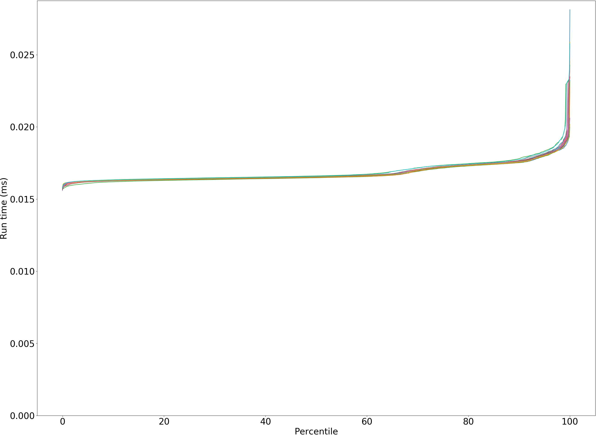

bounce.BounceBenchmark commix-lite-gc/size_1g-1g_gcthreads_8

commix-lite-gc/size_1g-1g_gcthreads_8 bounce.BounceBenchmark last garbage collection

bounce.BounceBenchmark commix-lite-gc/size_2g-2g_gcthreads_8

bounce.BounceBenchmark commix-lite-gc/size_2g-2g_gcthreads_8

commix-lite-gc/size_2g-2g_gcthreads_8 bounce.BounceBenchmark last garbage collection

bounce.BounceBenchmark commix-lite-gc/size_4g-4g_gcthreads_8

bounce.BounceBenchmark commix-lite-gc/size_4g-4g_gcthreads_8

commix-lite-gc/size_4g-4g_gcthreads_8 bounce.BounceBenchmark last garbage collection

bounce.BounceBenchmark commix-lite-gc/size_8g-8g_gcthreads_8

bounce.BounceBenchmark commix-lite-gc/size_8g-8g_gcthreads_8

commix-lite-gc/size_8g-8g_gcthreads_8 bounce.BounceBenchmark last garbage collection

bounce.BounceBenchmark commix-lite-gc/size_16g-16g_gcthreads_8

bounce.BounceBenchmark commix-lite-gc/size_16g-16g_gcthreads_8

commix-lite-gc/size_16g-16g_gcthreads_8 bounce.BounceBenchmark last garbage collection

## brainfuck.BrainfuckBenchmark
brainfuck.BrainfuckBenchmark

brainfuck.BrainfuckBenchmark

brainfuck.BrainfuckBenchmark: Garbage Collector Pause Times

brainfuck.BrainfuckBenchmark: Garbage Collector Pause Times

brainfuck.BrainfuckBenchmark: Mark Batch Times

brainfuck.BrainfuckBenchmark: Mark Batch Times

brainfuck.BrainfuckBenchmark: Sweep Batch Times

brainfuck.BrainfuckBenchmark: Sweep Batch Times

brainfuck.BrainfuckBenchmark: GC mark pause time at 50 percentile

brainfuck.BrainfuckBenchmark: GC mark pause time at 90 percentile

brainfuck.BrainfuckBenchmark: GC mark pause time at 99 percentile

brainfuck.BrainfuckBenchmark: GC mark pause time at 99.9 percentile

brainfuck.BrainfuckBenchmark: GC sweep pause time at 50 percentile

brainfuck.BrainfuckBenchmark: GC sweep pause time at 90 percentile

brainfuck.BrainfuckBenchmark: GC sweep pause time at 99 percentile

brainfuck.BrainfuckBenchmark: GC sweep pause time at 99.9 percentile

brainfuck.BrainfuckBenchmark: GC pause time at 50 percentile

brainfuck.BrainfuckBenchmark: GC pause time at 90 percentile

brainfuck.BrainfuckBenchmark: GC pause time at 99 percentile

brainfuck.BrainfuckBenchmark: GC pause time at 99.9 percentile

brainfuck.BrainfuckBenchmark: GC total time

brainfuck.BrainfuckBenchmark at 50 percentile

brainfuck.BrainfuckBenchmark at 90 percentile

brainfuck.BrainfuckBenchmark at 99 percentile

brainfuck.BrainfuckBenchmark at 99.9 percentile

brainfuck.BrainfuckBenchmark run #3

brainfuck.BrainfuckBenchmark unified-heap/size_1g-1g

brainfuck.BrainfuckBenchmark unified-heap/size_1g-1g

unified-heap/size_1g-1g brainfuck.BrainfuckBenchmark last garbage collection

brainfuck.BrainfuckBenchmark commix-lite-gc/size_512m-512m_gcthreads_8

brainfuck.BrainfuckBenchmark commix-lite-gc/size_512m-512m_gcthreads_8

commix-lite-gc/size_512m-512m_gcthreads_8 brainfuck.BrainfuckBenchmark last garbage collection

brainfuck.BrainfuckBenchmark commix-lite-gc/size_1g-1g_gcthreads_8

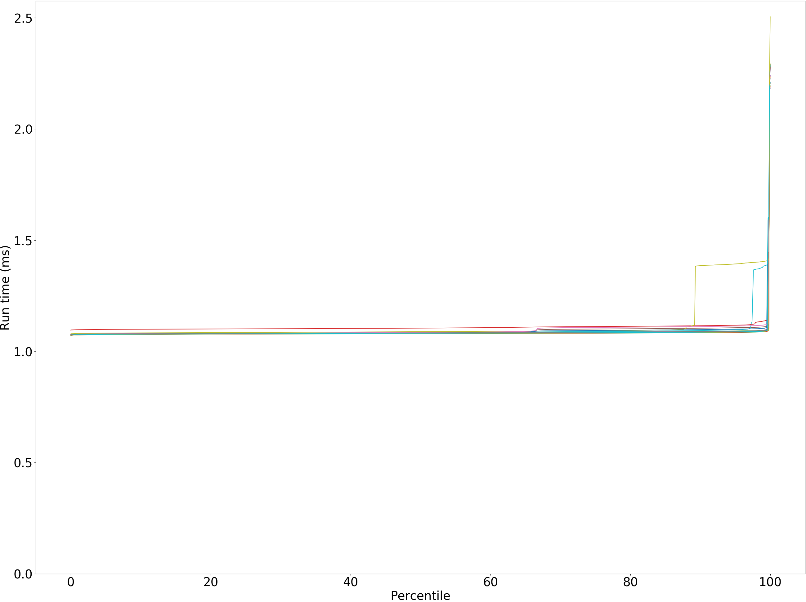

brainfuck.BrainfuckBenchmark commix-lite-gc/size_1g-1g_gcthreads_8

commix-lite-gc/size_1g-1g_gcthreads_8 brainfuck.BrainfuckBenchmark last garbage collection

brainfuck.BrainfuckBenchmark commix-lite-gc/size_2g-2g_gcthreads_8

brainfuck.BrainfuckBenchmark commix-lite-gc/size_2g-2g_gcthreads_8

commix-lite-gc/size_2g-2g_gcthreads_8 brainfuck.BrainfuckBenchmark last garbage collection

brainfuck.BrainfuckBenchmark commix-lite-gc/size_4g-4g_gcthreads_8

brainfuck.BrainfuckBenchmark commix-lite-gc/size_4g-4g_gcthreads_8

commix-lite-gc/size_4g-4g_gcthreads_8 brainfuck.BrainfuckBenchmark last garbage collection

brainfuck.BrainfuckBenchmark commix-lite-gc/size_8g-8g_gcthreads_8

brainfuck.BrainfuckBenchmark commix-lite-gc/size_8g-8g_gcthreads_8

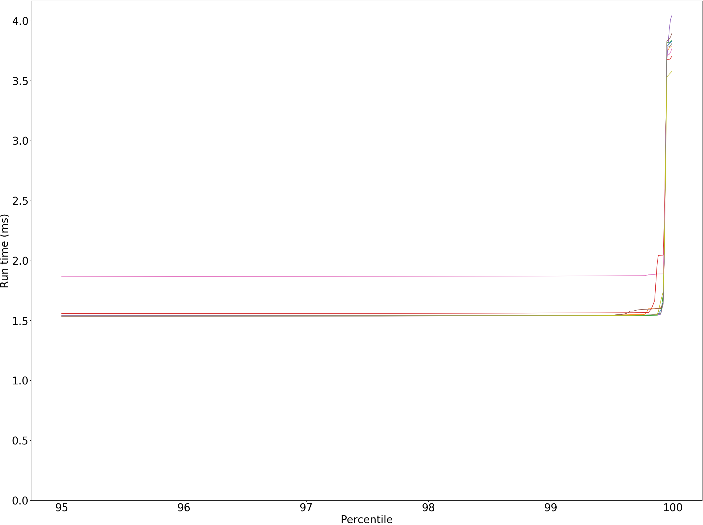

commix-lite-gc/size_8g-8g_gcthreads_8 brainfuck.BrainfuckBenchmark last garbage collection

brainfuck.BrainfuckBenchmark commix-lite-gc/size_16g-16g_gcthreads_8

brainfuck.BrainfuckBenchmark commix-lite-gc/size_16g-16g_gcthreads_8

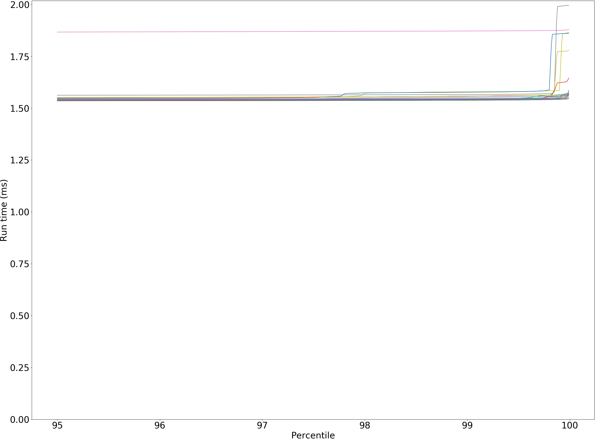

commix-lite-gc/size_16g-16g_gcthreads_8 brainfuck.BrainfuckBenchmark last garbage collection

## cd.CDBenchmark
cd.CDBenchmark

cd.CDBenchmark

cd.CDBenchmark: Garbage Collector Pause Times

cd.CDBenchmark: Garbage Collector Pause Times

cd.CDBenchmark: Mark Batch Times

cd.CDBenchmark: Mark Batch Times

cd.CDBenchmark: Sweep Batch Times

cd.CDBenchmark: Sweep Batch Times

cd.CDBenchmark: GC mark pause time at 50 percentile

cd.CDBenchmark: GC mark pause time at 90 percentile

cd.CDBenchmark: GC mark pause time at 99 percentile

cd.CDBenchmark: GC mark pause time at 99.9 percentile

cd.CDBenchmark: GC sweep pause time at 50 percentile

cd.CDBenchmark: GC sweep pause time at 90 percentile

cd.CDBenchmark: GC sweep pause time at 99 percentile

cd.CDBenchmark: GC sweep pause time at 99.9 percentile

cd.CDBenchmark: GC pause time at 50 percentile

cd.CDBenchmark: GC pause time at 90 percentile

cd.CDBenchmark: GC pause time at 99 percentile

cd.CDBenchmark: GC pause time at 99.9 percentile

cd.CDBenchmark: GC total time

cd.CDBenchmark at 50 percentile

cd.CDBenchmark at 90 percentile

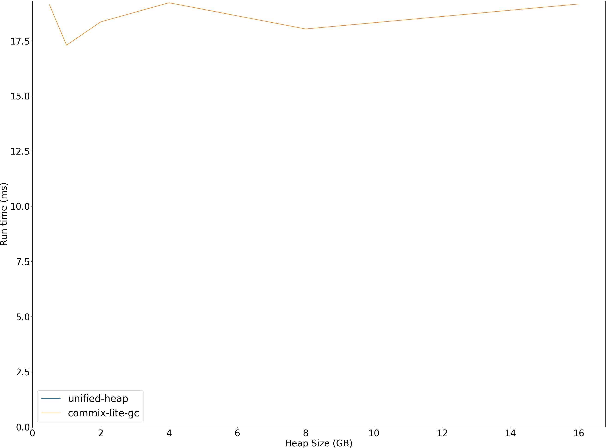

cd.CDBenchmark at 99 percentile

cd.CDBenchmark at 99.9 percentile

cd.CDBenchmark run #3

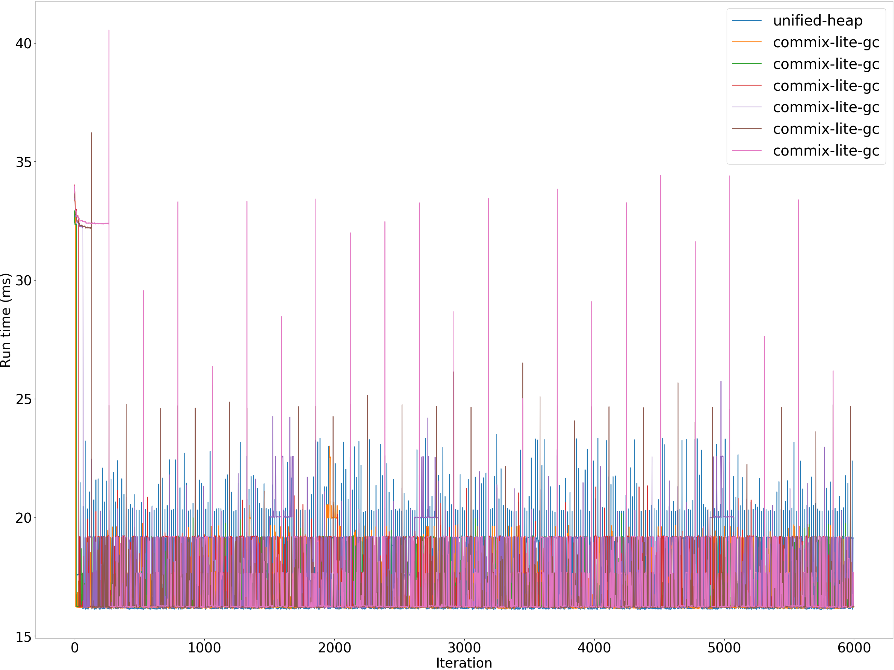

cd.CDBenchmark unified-heap/size_1g-1g

cd.CDBenchmark unified-heap/size_1g-1g

unified-heap/size_1g-1g cd.CDBenchmark last garbage collection

cd.CDBenchmark commix-lite-gc/size_512m-512m_gcthreads_8

cd.CDBenchmark commix-lite-gc/size_512m-512m_gcthreads_8

commix-lite-gc/size_512m-512m_gcthreads_8 cd.CDBenchmark last garbage collection

cd.CDBenchmark commix-lite-gc/size_1g-1g_gcthreads_8

cd.CDBenchmark commix-lite-gc/size_1g-1g_gcthreads_8

commix-lite-gc/size_1g-1g_gcthreads_8 cd.CDBenchmark last garbage collection

cd.CDBenchmark commix-lite-gc/size_2g-2g_gcthreads_8

cd.CDBenchmark commix-lite-gc/size_2g-2g_gcthreads_8

commix-lite-gc/size_2g-2g_gcthreads_8 cd.CDBenchmark last garbage collection

cd.CDBenchmark commix-lite-gc/size_4g-4g_gcthreads_8

cd.CDBenchmark commix-lite-gc/size_4g-4g_gcthreads_8

commix-lite-gc/size_4g-4g_gcthreads_8 cd.CDBenchmark last garbage collection

cd.CDBenchmark commix-lite-gc/size_8g-8g_gcthreads_8

cd.CDBenchmark commix-lite-gc/size_8g-8g_gcthreads_8

commix-lite-gc/size_8g-8g_gcthreads_8 cd.CDBenchmark last garbage collection

cd.CDBenchmark commix-lite-gc/size_16g-16g_gcthreads_8

cd.CDBenchmark commix-lite-gc/size_16g-16g_gcthreads_8

commix-lite-gc/size_16g-16g_gcthreads_8 cd.CDBenchmark last garbage collection

## deltablue.DeltaBlueBenchmark
deltablue.DeltaBlueBenchmark

deltablue.DeltaBlueBenchmark

deltablue.DeltaBlueBenchmark: Garbage Collector Pause Times

deltablue.DeltaBlueBenchmark: Garbage Collector Pause Times

deltablue.DeltaBlueBenchmark: Mark Batch Times

deltablue.DeltaBlueBenchmark: Mark Batch Times

deltablue.DeltaBlueBenchmark: Sweep Batch Times

deltablue.DeltaBlueBenchmark: Sweep Batch Times

deltablue.DeltaBlueBenchmark: GC mark pause time at 50 percentile

deltablue.DeltaBlueBenchmark: GC mark pause time at 90 percentile

deltablue.DeltaBlueBenchmark: GC mark pause time at 99 percentile

deltablue.DeltaBlueBenchmark: GC mark pause time at 99.9 percentile

deltablue.DeltaBlueBenchmark: GC sweep pause time at 50 percentile

deltablue.DeltaBlueBenchmark: GC sweep pause time at 90 percentile

deltablue.DeltaBlueBenchmark: GC sweep pause time at 99 percentile

deltablue.DeltaBlueBenchmark: GC sweep pause time at 99.9 percentile

deltablue.DeltaBlueBenchmark: GC pause time at 50 percentile

deltablue.DeltaBlueBenchmark: GC pause time at 90 percentile

deltablue.DeltaBlueBenchmark: GC pause time at 99 percentile

deltablue.DeltaBlueBenchmark: GC pause time at 99.9 percentile

deltablue.DeltaBlueBenchmark: GC total time

deltablue.DeltaBlueBenchmark at 50 percentile

deltablue.DeltaBlueBenchmark at 90 percentile

deltablue.DeltaBlueBenchmark at 99 percentile

deltablue.DeltaBlueBenchmark at 99.9 percentile

deltablue.DeltaBlueBenchmark run #3

deltablue.DeltaBlueBenchmark unified-heap/size_1g-1g

deltablue.DeltaBlueBenchmark unified-heap/size_1g-1g

unified-heap/size_1g-1g deltablue.DeltaBlueBenchmark last garbage collection

deltablue.DeltaBlueBenchmark commix-lite-gc/size_512m-512m_gcthreads_8

deltablue.DeltaBlueBenchmark commix-lite-gc/size_512m-512m_gcthreads_8

commix-lite-gc/size_512m-512m_gcthreads_8 deltablue.DeltaBlueBenchmark last garbage collection

deltablue.DeltaBlueBenchmark commix-lite-gc/size_1g-1g_gcthreads_8

deltablue.DeltaBlueBenchmark commix-lite-gc/size_1g-1g_gcthreads_8

commix-lite-gc/size_1g-1g_gcthreads_8 deltablue.DeltaBlueBenchmark last garbage collection

deltablue.DeltaBlueBenchmark commix-lite-gc/size_2g-2g_gcthreads_8

deltablue.DeltaBlueBenchmark commix-lite-gc/size_2g-2g_gcthreads_8

commix-lite-gc/size_2g-2g_gcthreads_8 deltablue.DeltaBlueBenchmark last garbage collection

deltablue.DeltaBlueBenchmark commix-lite-gc/size_4g-4g_gcthreads_8

deltablue.DeltaBlueBenchmark commix-lite-gc/size_4g-4g_gcthreads_8

commix-lite-gc/size_4g-4g_gcthreads_8 deltablue.DeltaBlueBenchmark last garbage collection

deltablue.DeltaBlueBenchmark commix-lite-gc/size_8g-8g_gcthreads_8

deltablue.DeltaBlueBenchmark commix-lite-gc/size_8g-8g_gcthreads_8

commix-lite-gc/size_8g-8g_gcthreads_8 deltablue.DeltaBlueBenchmark last garbage collection

deltablue.DeltaBlueBenchmark commix-lite-gc/size_16g-16g_gcthreads_8

deltablue.DeltaBlueBenchmark commix-lite-gc/size_16g-16g_gcthreads_8

commix-lite-gc/size_16g-16g_gcthreads_8 deltablue.DeltaBlueBenchmark last garbage collection

## gcbench.GCBenchBenchmark
gcbench.GCBenchBenchmark

gcbench.GCBenchBenchmark

gcbench.GCBenchBenchmark: Garbage Collector Pause Times

gcbench.GCBenchBenchmark: Garbage Collector Pause Times

gcbench.GCBenchBenchmark: Mark Batch Times

gcbench.GCBenchBenchmark: Mark Batch Times

gcbench.GCBenchBenchmark: Sweep Batch Times

gcbench.GCBenchBenchmark: Sweep Batch Times

gcbench.GCBenchBenchmark: GC mark pause time at 50 percentile

gcbench.GCBenchBenchmark: GC mark pause time at 90 percentile

gcbench.GCBenchBenchmark: GC mark pause time at 99 percentile

gcbench.GCBenchBenchmark: GC mark pause time at 99.9 percentile

gcbench.GCBenchBenchmark: GC sweep pause time at 50 percentile

gcbench.GCBenchBenchmark: GC sweep pause time at 90 percentile

gcbench.GCBenchBenchmark: GC sweep pause time at 99 percentile

gcbench.GCBenchBenchmark: GC sweep pause time at 99.9 percentile

gcbench.GCBenchBenchmark: GC pause time at 50 percentile

gcbench.GCBenchBenchmark: GC pause time at 90 percentile

gcbench.GCBenchBenchmark: GC pause time at 99 percentile

gcbench.GCBenchBenchmark: GC pause time at 99.9 percentile

gcbench.GCBenchBenchmark: GC total time

gcbench.GCBenchBenchmark at 50 percentile

gcbench.GCBenchBenchmark at 90 percentile

gcbench.GCBenchBenchmark at 99 percentile

gcbench.GCBenchBenchmark at 99.9 percentile

gcbench.GCBenchBenchmark run #3

gcbench.GCBenchBenchmark unified-heap/size_1g-1g

gcbench.GCBenchBenchmark unified-heap/size_1g-1g

unified-heap/size_1g-1g gcbench.GCBenchBenchmark last garbage collection

gcbench.GCBenchBenchmark commix-lite-gc/size_512m-512m_gcthreads_8

gcbench.GCBenchBenchmark commix-lite-gc/size_512m-512m_gcthreads_8

commix-lite-gc/size_512m-512m_gcthreads_8 gcbench.GCBenchBenchmark last garbage collection

gcbench.GCBenchBenchmark commix-lite-gc/size_1g-1g_gcthreads_8

gcbench.GCBenchBenchmark commix-lite-gc/size_1g-1g_gcthreads_8

commix-lite-gc/size_1g-1g_gcthreads_8 gcbench.GCBenchBenchmark last garbage collection

gcbench.GCBenchBenchmark commix-lite-gc/size_2g-2g_gcthreads_8

gcbench.GCBenchBenchmark commix-lite-gc/size_2g-2g_gcthreads_8

commix-lite-gc/size_2g-2g_gcthreads_8 gcbench.GCBenchBenchmark last garbage collection

gcbench.GCBenchBenchmark commix-lite-gc/size_4g-4g_gcthreads_8

gcbench.GCBenchBenchmark commix-lite-gc/size_4g-4g_gcthreads_8

commix-lite-gc/size_4g-4g_gcthreads_8 gcbench.GCBenchBenchmark last garbage collection

gcbench.GCBenchBenchmark commix-lite-gc/size_8g-8g_gcthreads_8

gcbench.GCBenchBenchmark commix-lite-gc/size_8g-8g_gcthreads_8

commix-lite-gc/size_8g-8g_gcthreads_8 gcbench.GCBenchBenchmark last garbage collection

gcbench.GCBenchBenchmark commix-lite-gc/size_16g-16g_gcthreads_8

gcbench.GCBenchBenchmark commix-lite-gc/size_16g-16g_gcthreads_8

commix-lite-gc/size_16g-16g_gcthreads_8 gcbench.GCBenchBenchmark last garbage collection

## json.JsonBenchmark
json.JsonBenchmark

json.JsonBenchmark

json.JsonBenchmark: Garbage Collector Pause Times

json.JsonBenchmark: Garbage Collector Pause Times

json.JsonBenchmark: Mark Batch Times

json.JsonBenchmark: Mark Batch Times

json.JsonBenchmark: Sweep Batch Times

json.JsonBenchmark: Sweep Batch Times

json.JsonBenchmark: GC mark pause time at 50 percentile

json.JsonBenchmark: GC mark pause time at 90 percentile

json.JsonBenchmark: GC mark pause time at 99 percentile

json.JsonBenchmark: GC mark pause time at 99.9 percentile

json.JsonBenchmark: GC sweep pause time at 50 percentile

json.JsonBenchmark: GC sweep pause time at 90 percentile

json.JsonBenchmark: GC sweep pause time at 99 percentile

json.JsonBenchmark: GC sweep pause time at 99.9 percentile

json.JsonBenchmark: GC pause time at 50 percentile

json.JsonBenchmark: GC pause time at 90 percentile

json.JsonBenchmark: GC pause time at 99 percentile

json.JsonBenchmark: GC pause time at 99.9 percentile

json.JsonBenchmark: GC total time

json.JsonBenchmark at 50 percentile

json.JsonBenchmark at 90 percentile

json.JsonBenchmark at 99 percentile

json.JsonBenchmark at 99.9 percentile

json.JsonBenchmark run #3

json.JsonBenchmark unified-heap/size_1g-1g

json.JsonBenchmark unified-heap/size_1g-1g

unified-heap/size_1g-1g json.JsonBenchmark last garbage collection

json.JsonBenchmark commix-lite-gc/size_512m-512m_gcthreads_8

json.JsonBenchmark commix-lite-gc/size_512m-512m_gcthreads_8

commix-lite-gc/size_512m-512m_gcthreads_8 json.JsonBenchmark last garbage collection

json.JsonBenchmark commix-lite-gc/size_1g-1g_gcthreads_8

json.JsonBenchmark commix-lite-gc/size_1g-1g_gcthreads_8

commix-lite-gc/size_1g-1g_gcthreads_8 json.JsonBenchmark last garbage collection

json.JsonBenchmark commix-lite-gc/size_2g-2g_gcthreads_8

json.JsonBenchmark commix-lite-gc/size_2g-2g_gcthreads_8

commix-lite-gc/size_2g-2g_gcthreads_8 json.JsonBenchmark last garbage collection

json.JsonBenchmark commix-lite-gc/size_4g-4g_gcthreads_8

json.JsonBenchmark commix-lite-gc/size_4g-4g_gcthreads_8

commix-lite-gc/size_4g-4g_gcthreads_8 json.JsonBenchmark last garbage collection

json.JsonBenchmark commix-lite-gc/size_8g-8g_gcthreads_8

json.JsonBenchmark commix-lite-gc/size_8g-8g_gcthreads_8

commix-lite-gc/size_8g-8g_gcthreads_8 json.JsonBenchmark last garbage collection

json.JsonBenchmark commix-lite-gc/size_16g-16g_gcthreads_8

json.JsonBenchmark commix-lite-gc/size_16g-16g_gcthreads_8

commix-lite-gc/size_16g-16g_gcthreads_8 json.JsonBenchmark last garbage collection

## kmeans.KmeansBenchmark
kmeans.KmeansBenchmark

kmeans.KmeansBenchmark

kmeans.KmeansBenchmark: Garbage Collector Pause Times

kmeans.KmeansBenchmark: Garbage Collector Pause Times

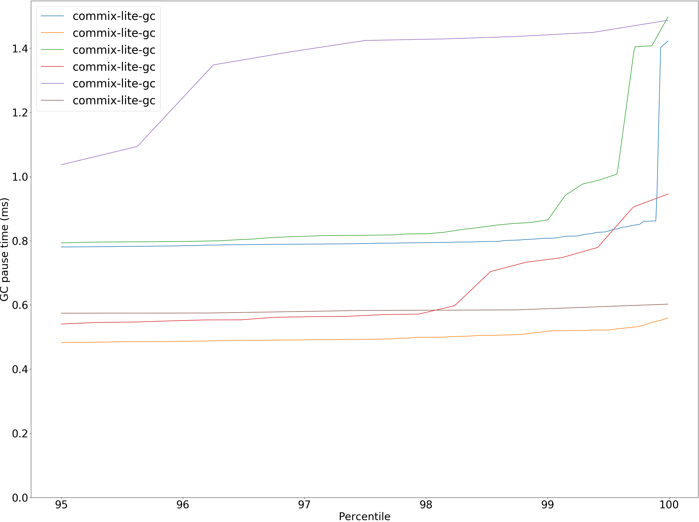

kmeans.KmeansBenchmark: Mark Batch Times

kmeans.KmeansBenchmark: Mark Batch Times

kmeans.KmeansBenchmark: Sweep Batch Times

kmeans.KmeansBenchmark: Sweep Batch Times

kmeans.KmeansBenchmark: GC mark pause time at 50 percentile

kmeans.KmeansBenchmark: GC mark pause time at 90 percentile

kmeans.KmeansBenchmark: GC mark pause time at 99 percentile

kmeans.KmeansBenchmark: GC mark pause time at 99.9 percentile

kmeans.KmeansBenchmark: GC sweep pause time at 50 percentile

kmeans.KmeansBenchmark: GC sweep pause time at 90 percentile

kmeans.KmeansBenchmark: GC sweep pause time at 99 percentile

kmeans.KmeansBenchmark: GC sweep pause time at 99.9 percentile

kmeans.KmeansBenchmark: GC pause time at 50 percentile

kmeans.KmeansBenchmark: GC pause time at 90 percentile

kmeans.KmeansBenchmark: GC pause time at 99 percentile

kmeans.KmeansBenchmark: GC pause time at 99.9 percentile

kmeans.KmeansBenchmark: GC total time

kmeans.KmeansBenchmark at 50 percentile

kmeans.KmeansBenchmark at 90 percentile

kmeans.KmeansBenchmark at 99 percentile

kmeans.KmeansBenchmark at 99.9 percentile

kmeans.KmeansBenchmark run #3

kmeans.KmeansBenchmark unified-heap/size_1g-1g

kmeans.KmeansBenchmark unified-heap/size_1g-1g

unified-heap/size_1g-1g kmeans.KmeansBenchmark last garbage collection

kmeans.KmeansBenchmark commix-lite-gc/size_512m-512m_gcthreads_8

kmeans.KmeansBenchmark commix-lite-gc/size_512m-512m_gcthreads_8

commix-lite-gc/size_512m-512m_gcthreads_8 kmeans.KmeansBenchmark last garbage collection

kmeans.KmeansBenchmark commix-lite-gc/size_1g-1g_gcthreads_8

kmeans.KmeansBenchmark commix-lite-gc/size_1g-1g_gcthreads_8

commix-lite-gc/size_1g-1g_gcthreads_8 kmeans.KmeansBenchmark last garbage collection

kmeans.KmeansBenchmark commix-lite-gc/size_2g-2g_gcthreads_8

kmeans.KmeansBenchmark commix-lite-gc/size_2g-2g_gcthreads_8

commix-lite-gc/size_2g-2g_gcthreads_8 kmeans.KmeansBenchmark last garbage collection

kmeans.KmeansBenchmark commix-lite-gc/size_4g-4g_gcthreads_8

kmeans.KmeansBenchmark commix-lite-gc/size_4g-4g_gcthreads_8

commix-lite-gc/size_4g-4g_gcthreads_8 kmeans.KmeansBenchmark last garbage collection

kmeans.KmeansBenchmark commix-lite-gc/size_8g-8g_gcthreads_8

kmeans.KmeansBenchmark commix-lite-gc/size_8g-8g_gcthreads_8

commix-lite-gc/size_8g-8g_gcthreads_8 kmeans.KmeansBenchmark last garbage collection

kmeans.KmeansBenchmark commix-lite-gc/size_16g-16g_gcthreads_8

kmeans.KmeansBenchmark commix-lite-gc/size_16g-16g_gcthreads_8

commix-lite-gc/size_16g-16g_gcthreads_8 kmeans.KmeansBenchmark last garbage collection

## nbody.NbodyBenchmark
nbody.NbodyBenchmark

nbody.NbodyBenchmark

nbody.NbodyBenchmark: Garbage Collector Pause Times

nbody.NbodyBenchmark: Garbage Collector Pause Times

nbody.NbodyBenchmark: Mark Batch Times

nbody.NbodyBenchmark: Mark Batch Times

nbody.NbodyBenchmark: Sweep Batch Times

nbody.NbodyBenchmark: Sweep Batch Times

nbody.NbodyBenchmark: GC mark pause time at 50 percentile

nbody.NbodyBenchmark: GC mark pause time at 90 percentile

nbody.NbodyBenchmark: GC mark pause time at 99 percentile

nbody.NbodyBenchmark: GC mark pause time at 99.9 percentile

nbody.NbodyBenchmark: GC sweep pause time at 50 percentile

nbody.NbodyBenchmark: GC sweep pause time at 90 percentile

nbody.NbodyBenchmark: GC sweep pause time at 99 percentile

nbody.NbodyBenchmark: GC sweep pause time at 99.9 percentile

nbody.NbodyBenchmark: GC pause time at 50 percentile

nbody.NbodyBenchmark: GC pause time at 90 percentile

nbody.NbodyBenchmark: GC pause time at 99 percentile

nbody.NbodyBenchmark: GC pause time at 99.9 percentile

nbody.NbodyBenchmark: GC total time

nbody.NbodyBenchmark at 50 percentile

nbody.NbodyBenchmark at 90 percentile

nbody.NbodyBenchmark at 99 percentile

nbody.NbodyBenchmark at 99.9 percentile

nbody.NbodyBenchmark run #3

nbody.NbodyBenchmark unified-heap/size_1g-1g

nbody.NbodyBenchmark unified-heap/size_1g-1g

unified-heap/size_1g-1g nbody.NbodyBenchmark last garbage collection

nbody.NbodyBenchmark commix-lite-gc/size_512m-512m_gcthreads_8

nbody.NbodyBenchmark commix-lite-gc/size_512m-512m_gcthreads_8

commix-lite-gc/size_512m-512m_gcthreads_8 nbody.NbodyBenchmark last garbage collection

nbody.NbodyBenchmark commix-lite-gc/size_1g-1g_gcthreads_8

nbody.NbodyBenchmark commix-lite-gc/size_1g-1g_gcthreads_8

commix-lite-gc/size_1g-1g_gcthreads_8 nbody.NbodyBenchmark last garbage collection

nbody.NbodyBenchmark commix-lite-gc/size_2g-2g_gcthreads_8

nbody.NbodyBenchmark commix-lite-gc/size_2g-2g_gcthreads_8

commix-lite-gc/size_2g-2g_gcthreads_8 nbody.NbodyBenchmark last garbage collection

nbody.NbodyBenchmark commix-lite-gc/size_4g-4g_gcthreads_8

nbody.NbodyBenchmark commix-lite-gc/size_4g-4g_gcthreads_8

commix-lite-gc/size_4g-4g_gcthreads_8 nbody.NbodyBenchmark last garbage collection

nbody.NbodyBenchmark commix-lite-gc/size_8g-8g_gcthreads_8

nbody.NbodyBenchmark commix-lite-gc/size_8g-8g_gcthreads_8

commix-lite-gc/size_8g-8g_gcthreads_8 nbody.NbodyBenchmark last garbage collection

nbody.NbodyBenchmark commix-lite-gc/size_16g-16g_gcthreads_8

nbody.NbodyBenchmark commix-lite-gc/size_16g-16g_gcthreads_8

commix-lite-gc/size_16g-16g_gcthreads_8 nbody.NbodyBenchmark last garbage collection

## permute.PermuteBenchmark
permute.PermuteBenchmark

permute.PermuteBenchmark

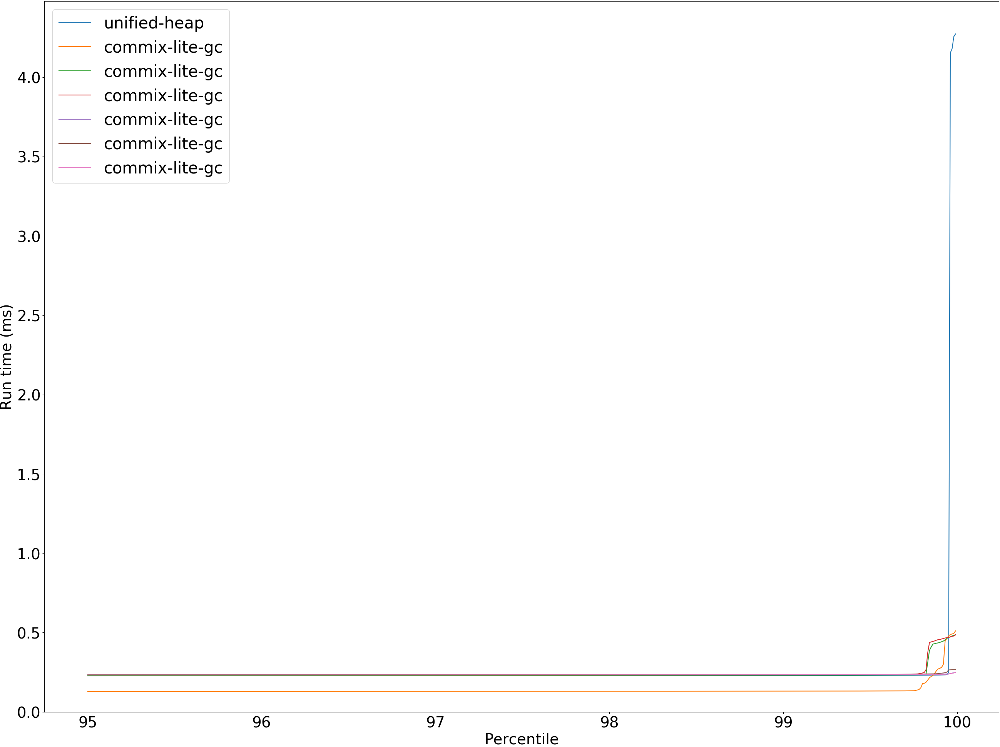

permute.PermuteBenchmark: Garbage Collector Pause Times

permute.PermuteBenchmark: Garbage Collector Pause Times

permute.PermuteBenchmark: Mark Batch Times

permute.PermuteBenchmark: Mark Batch Times

permute.PermuteBenchmark: Sweep Batch Times

permute.PermuteBenchmark: Sweep Batch Times

permute.PermuteBenchmark: GC mark pause time at 50 percentile

permute.PermuteBenchmark: GC mark pause time at 90 percentile

permute.PermuteBenchmark: GC mark pause time at 99 percentile

permute.PermuteBenchmark: GC mark pause time at 99.9 percentile

permute.PermuteBenchmark: GC sweep pause time at 50 percentile

permute.PermuteBenchmark: GC sweep pause time at 90 percentile

permute.PermuteBenchmark: GC sweep pause time at 99 percentile

permute.PermuteBenchmark: GC sweep pause time at 99.9 percentile

permute.PermuteBenchmark: GC pause time at 50 percentile

permute.PermuteBenchmark: GC pause time at 90 percentile

permute.PermuteBenchmark: GC pause time at 99 percentile

permute.PermuteBenchmark: GC pause time at 99.9 percentile

permute.PermuteBenchmark: GC total time

permute.PermuteBenchmark at 50 percentile

permute.PermuteBenchmark at 90 percentile

permute.PermuteBenchmark at 99 percentile

permute.PermuteBenchmark at 99.9 percentile

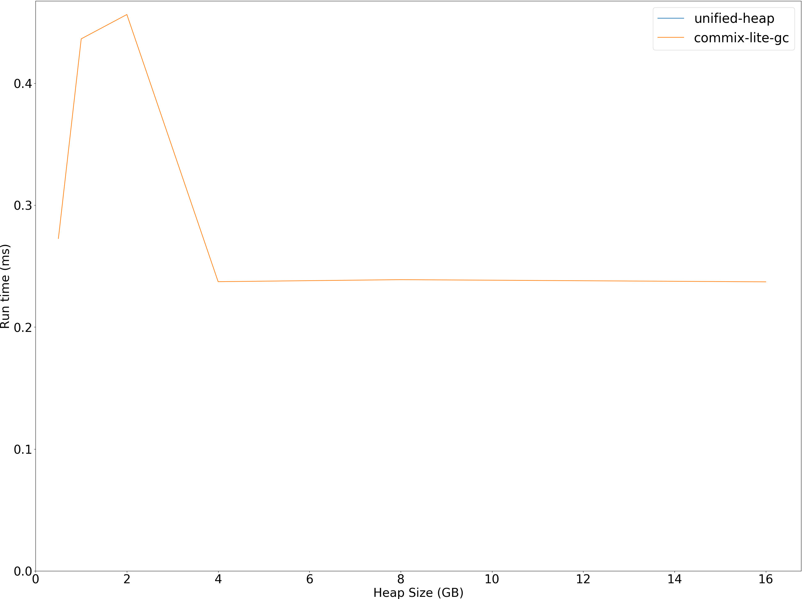

permute.PermuteBenchmark run #3

permute.PermuteBenchmark unified-heap/size_1g-1g

permute.PermuteBenchmark unified-heap/size_1g-1g

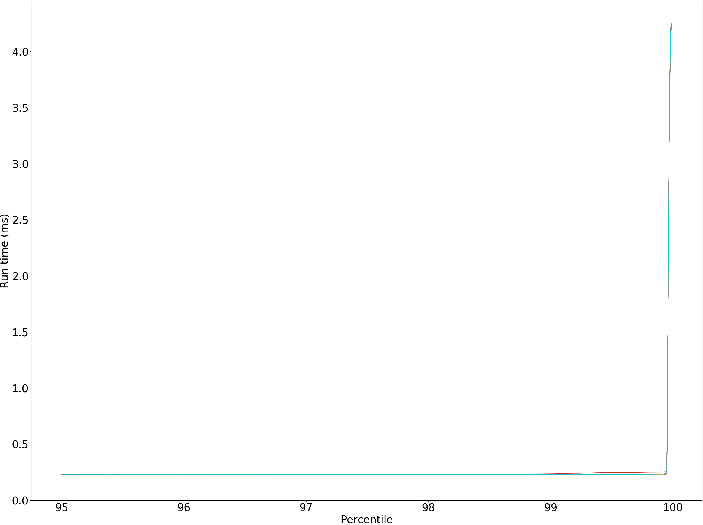

unified-heap/size_1g-1g permute.PermuteBenchmark last garbage collection

permute.PermuteBenchmark commix-lite-gc/size_512m-512m_gcthreads_8

permute.PermuteBenchmark commix-lite-gc/size_512m-512m_gcthreads_8

commix-lite-gc/size_512m-512m_gcthreads_8 permute.PermuteBenchmark last garbage collection

permute.PermuteBenchmark commix-lite-gc/size_1g-1g_gcthreads_8

permute.PermuteBenchmark commix-lite-gc/size_1g-1g_gcthreads_8

commix-lite-gc/size_1g-1g_gcthreads_8 permute.PermuteBenchmark last garbage collection

permute.PermuteBenchmark commix-lite-gc/size_2g-2g_gcthreads_8

permute.PermuteBenchmark commix-lite-gc/size_2g-2g_gcthreads_8

commix-lite-gc/size_2g-2g_gcthreads_8 permute.PermuteBenchmark last garbage collection

permute.PermuteBenchmark commix-lite-gc/size_4g-4g_gcthreads_8

permute.PermuteBenchmark commix-lite-gc/size_4g-4g_gcthreads_8

commix-lite-gc/size_4g-4g_gcthreads_8 permute.PermuteBenchmark last garbage collection

permute.PermuteBenchmark commix-lite-gc/size_8g-8g_gcthreads_8

permute.PermuteBenchmark commix-lite-gc/size_8g-8g_gcthreads_8

commix-lite-gc/size_8g-8g_gcthreads_8 permute.PermuteBenchmark last garbage collection

permute.PermuteBenchmark commix-lite-gc/size_16g-16g_gcthreads_8

permute.PermuteBenchmark commix-lite-gc/size_16g-16g_gcthreads_8

commix-lite-gc/size_16g-16g_gcthreads_8 permute.PermuteBenchmark last garbage collection

## queens.QueensBenchmark
queens.QueensBenchmark

queens.QueensBenchmark

queens.QueensBenchmark: Garbage Collector Pause Times

queens.QueensBenchmark: Garbage Collector Pause Times

queens.QueensBenchmark: Mark Batch Times

queens.QueensBenchmark: Mark Batch Times

queens.QueensBenchmark: Sweep Batch Times

queens.QueensBenchmark: Sweep Batch Times

queens.QueensBenchmark: GC mark pause time at 50 percentile

queens.QueensBenchmark: GC mark pause time at 90 percentile

queens.QueensBenchmark: GC mark pause time at 99 percentile

queens.QueensBenchmark: GC mark pause time at 99.9 percentile

queens.QueensBenchmark: GC sweep pause time at 50 percentile

queens.QueensBenchmark: GC sweep pause time at 90 percentile

queens.QueensBenchmark: GC sweep pause time at 99 percentile

queens.QueensBenchmark: GC sweep pause time at 99.9 percentile

queens.QueensBenchmark: GC pause time at 50 percentile

queens.QueensBenchmark: GC pause time at 90 percentile

queens.QueensBenchmark: GC pause time at 99 percentile

queens.QueensBenchmark: GC pause time at 99.9 percentile

queens.QueensBenchmark: GC total time

queens.QueensBenchmark at 50 percentile

queens.QueensBenchmark at 90 percentile

queens.QueensBenchmark at 99 percentile

queens.QueensBenchmark at 99.9 percentile

queens.QueensBenchmark run #3

queens.QueensBenchmark unified-heap/size_1g-1g

queens.QueensBenchmark unified-heap/size_1g-1g

unified-heap/size_1g-1g queens.QueensBenchmark last garbage collection

queens.QueensBenchmark commix-lite-gc/size_512m-512m_gcthreads_8

queens.QueensBenchmark commix-lite-gc/size_512m-512m_gcthreads_8

commix-lite-gc/size_512m-512m_gcthreads_8 queens.QueensBenchmark last garbage collection

queens.QueensBenchmark commix-lite-gc/size_1g-1g_gcthreads_8

queens.QueensBenchmark commix-lite-gc/size_1g-1g_gcthreads_8

commix-lite-gc/size_1g-1g_gcthreads_8 queens.QueensBenchmark last garbage collection

queens.QueensBenchmark commix-lite-gc/size_2g-2g_gcthreads_8

queens.QueensBenchmark commix-lite-gc/size_2g-2g_gcthreads_8

commix-lite-gc/size_2g-2g_gcthreads_8 queens.QueensBenchmark last garbage collection

queens.QueensBenchmark commix-lite-gc/size_4g-4g_gcthreads_8

queens.QueensBenchmark commix-lite-gc/size_4g-4g_gcthreads_8

commix-lite-gc/size_4g-4g_gcthreads_8 queens.QueensBenchmark last garbage collection

queens.QueensBenchmark commix-lite-gc/size_8g-8g_gcthreads_8

queens.QueensBenchmark commix-lite-gc/size_8g-8g_gcthreads_8

commix-lite-gc/size_8g-8g_gcthreads_8 queens.QueensBenchmark last garbage collection

queens.QueensBenchmark commix-lite-gc/size_16g-16g_gcthreads_8

queens.QueensBenchmark commix-lite-gc/size_16g-16g_gcthreads_8

commix-lite-gc/size_16g-16g_gcthreads_8 queens.QueensBenchmark last garbage collection

## richards.RichardsBenchmark
richards.RichardsBenchmark

richards.RichardsBenchmark

richards.RichardsBenchmark: Garbage Collector Pause Times

richards.RichardsBenchmark: Garbage Collector Pause Times

richards.RichardsBenchmark: Mark Batch Times

richards.RichardsBenchmark: Mark Batch Times

richards.RichardsBenchmark: Sweep Batch Times

richards.RichardsBenchmark: Sweep Batch Times

richards.RichardsBenchmark: GC mark pause time at 50 percentile

richards.RichardsBenchmark: GC mark pause time at 90 percentile

richards.RichardsBenchmark: GC mark pause time at 99 percentile

richards.RichardsBenchmark: GC mark pause time at 99.9 percentile

richards.RichardsBenchmark: GC sweep pause time at 50 percentile

richards.RichardsBenchmark: GC sweep pause time at 90 percentile

richards.RichardsBenchmark: GC sweep pause time at 99 percentile

richards.RichardsBenchmark: GC sweep pause time at 99.9 percentile

richards.RichardsBenchmark: GC pause time at 50 percentile

richards.RichardsBenchmark: GC pause time at 90 percentile

richards.RichardsBenchmark: GC pause time at 99 percentile

richards.RichardsBenchmark: GC pause time at 99.9 percentile

richards.RichardsBenchmark: GC total time

richards.RichardsBenchmark at 50 percentile

richards.RichardsBenchmark at 90 percentile

richards.RichardsBenchmark at 99 percentile

richards.RichardsBenchmark at 99.9 percentile

richards.RichardsBenchmark run #3

richards.RichardsBenchmark unified-heap/size_1g-1g

richards.RichardsBenchmark unified-heap/size_1g-1g

unified-heap/size_1g-1g richards.RichardsBenchmark last garbage collection

richards.RichardsBenchmark commix-lite-gc/size_512m-512m_gcthreads_8

richards.RichardsBenchmark commix-lite-gc/size_512m-512m_gcthreads_8

commix-lite-gc/size_512m-512m_gcthreads_8 richards.RichardsBenchmark last garbage collection

richards.RichardsBenchmark commix-lite-gc/size_1g-1g_gcthreads_8

richards.RichardsBenchmark commix-lite-gc/size_1g-1g_gcthreads_8

commix-lite-gc/size_1g-1g_gcthreads_8 richards.RichardsBenchmark last garbage collection

richards.RichardsBenchmark commix-lite-gc/size_2g-2g_gcthreads_8

richards.RichardsBenchmark commix-lite-gc/size_2g-2g_gcthreads_8

commix-lite-gc/size_2g-2g_gcthreads_8 richards.RichardsBenchmark last garbage collection

richards.RichardsBenchmark commix-lite-gc/size_4g-4g_gcthreads_8

richards.RichardsBenchmark commix-lite-gc/size_4g-4g_gcthreads_8

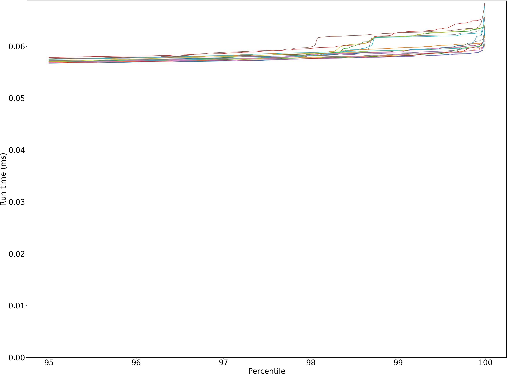

commix-lite-gc/size_4g-4g_gcthreads_8 richards.RichardsBenchmark last garbage collection

richards.RichardsBenchmark commix-lite-gc/size_8g-8g_gcthreads_8

richards.RichardsBenchmark commix-lite-gc/size_8g-8g_gcthreads_8

commix-lite-gc/size_8g-8g_gcthreads_8 richards.RichardsBenchmark last garbage collection

richards.RichardsBenchmark commix-lite-gc/size_16g-16g_gcthreads_8

richards.RichardsBenchmark commix-lite-gc/size_16g-16g_gcthreads_8

commix-lite-gc/size_16g-16g_gcthreads_8 richards.RichardsBenchmark last garbage collection

## sudoku.SudokuBenchmark
sudoku.SudokuBenchmark

sudoku.SudokuBenchmark

sudoku.SudokuBenchmark: Garbage Collector Pause Times

sudoku.SudokuBenchmark: Garbage Collector Pause Times

sudoku.SudokuBenchmark: Mark Batch Times

sudoku.SudokuBenchmark: Mark Batch Times

sudoku.SudokuBenchmark: Sweep Batch Times

sudoku.SudokuBenchmark: Sweep Batch Times

sudoku.SudokuBenchmark: GC mark pause time at 50 percentile

sudoku.SudokuBenchmark: GC mark pause time at 90 percentile

sudoku.SudokuBenchmark: GC mark pause time at 99 percentile

sudoku.SudokuBenchmark: GC mark pause time at 99.9 percentile

sudoku.SudokuBenchmark: GC sweep pause time at 50 percentile

sudoku.SudokuBenchmark: GC sweep pause time at 90 percentile

sudoku.SudokuBenchmark: GC sweep pause time at 99 percentile

sudoku.SudokuBenchmark: GC sweep pause time at 99.9 percentile

sudoku.SudokuBenchmark: GC pause time at 50 percentile

sudoku.SudokuBenchmark: GC pause time at 90 percentile

sudoku.SudokuBenchmark: GC pause time at 99 percentile

sudoku.SudokuBenchmark: GC pause time at 99.9 percentile

sudoku.SudokuBenchmark: GC total time

sudoku.SudokuBenchmark at 50 percentile

sudoku.SudokuBenchmark at 90 percentile

sudoku.SudokuBenchmark at 99 percentile

sudoku.SudokuBenchmark at 99.9 percentile

sudoku.SudokuBenchmark run #3

sudoku.SudokuBenchmark unified-heap/size_1g-1g

sudoku.SudokuBenchmark unified-heap/size_1g-1g

unified-heap/size_1g-1g sudoku.SudokuBenchmark last garbage collection

sudoku.SudokuBenchmark commix-lite-gc/size_512m-512m_gcthreads_8

sudoku.SudokuBenchmark commix-lite-gc/size_512m-512m_gcthreads_8

commix-lite-gc/size_512m-512m_gcthreads_8 sudoku.SudokuBenchmark last garbage collection

sudoku.SudokuBenchmark commix-lite-gc/size_1g-1g_gcthreads_8

sudoku.SudokuBenchmark commix-lite-gc/size_1g-1g_gcthreads_8

commix-lite-gc/size_1g-1g_gcthreads_8 sudoku.SudokuBenchmark last garbage collection

sudoku.SudokuBenchmark commix-lite-gc/size_2g-2g_gcthreads_8

sudoku.SudokuBenchmark commix-lite-gc/size_2g-2g_gcthreads_8

commix-lite-gc/size_2g-2g_gcthreads_8 sudoku.SudokuBenchmark last garbage collection

sudoku.SudokuBenchmark commix-lite-gc/size_4g-4g_gcthreads_8

sudoku.SudokuBenchmark commix-lite-gc/size_4g-4g_gcthreads_8

commix-lite-gc/size_4g-4g_gcthreads_8 sudoku.SudokuBenchmark last garbage collection

sudoku.SudokuBenchmark commix-lite-gc/size_8g-8g_gcthreads_8

sudoku.SudokuBenchmark commix-lite-gc/size_8g-8g_gcthreads_8

commix-lite-gc/size_8g-8g_gcthreads_8 sudoku.SudokuBenchmark last garbage collection

sudoku.SudokuBenchmark commix-lite-gc/size_16g-16g_gcthreads_8

sudoku.SudokuBenchmark commix-lite-gc/size_16g-16g_gcthreads_8

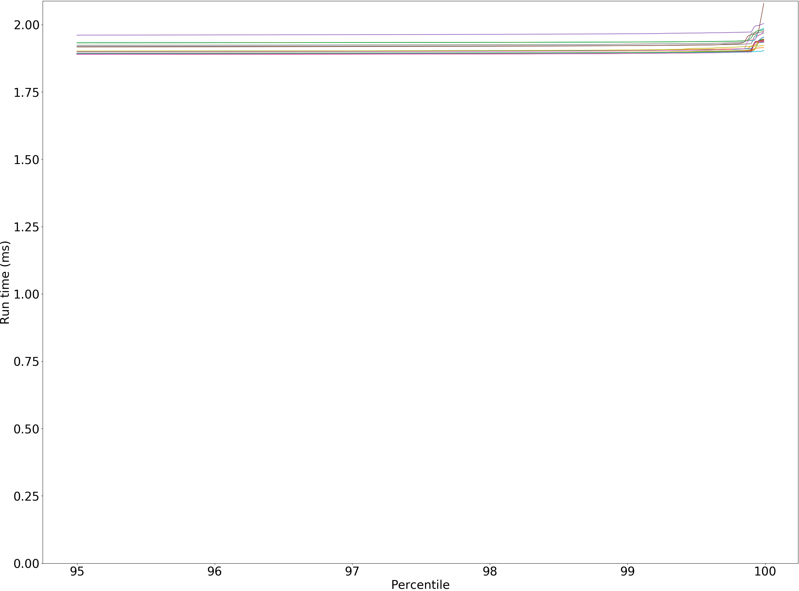

commix-lite-gc/size_16g-16g_gcthreads_8 sudoku.SudokuBenchmark last garbage collection

## tracer.TracerBenchmark
tracer.TracerBenchmark

tracer.TracerBenchmark

tracer.TracerBenchmark: Garbage Collector Pause Times

tracer.TracerBenchmark: Garbage Collector Pause Times

tracer.TracerBenchmark: Mark Batch Times

tracer.TracerBenchmark: Mark Batch Times

tracer.TracerBenchmark: Sweep Batch Times

tracer.TracerBenchmark: Sweep Batch Times

tracer.TracerBenchmark: GC mark pause time at 50 percentile

tracer.TracerBenchmark: GC mark pause time at 90 percentile

tracer.TracerBenchmark: GC mark pause time at 99 percentile

tracer.TracerBenchmark: GC mark pause time at 99.9 percentile

tracer.TracerBenchmark: GC sweep pause time at 50 percentile

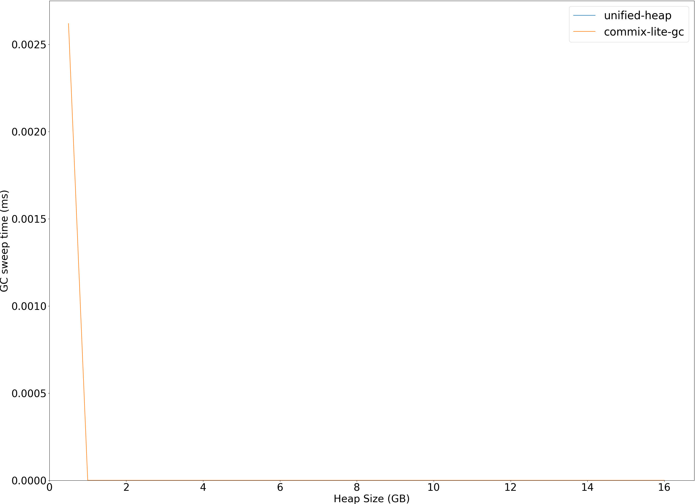

tracer.TracerBenchmark: GC sweep pause time at 90 percentile

tracer.TracerBenchmark: GC sweep pause time at 99 percentile

tracer.TracerBenchmark: GC sweep pause time at 99.9 percentile

tracer.TracerBenchmark: GC pause time at 50 percentile

tracer.TracerBenchmark: GC pause time at 90 percentile

tracer.TracerBenchmark: GC pause time at 99 percentile

tracer.TracerBenchmark: GC pause time at 99.9 percentile

tracer.TracerBenchmark: GC total time

tracer.TracerBenchmark at 50 percentile

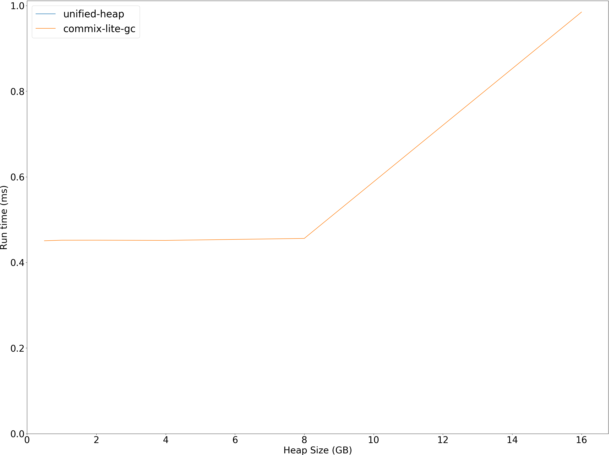

tracer.TracerBenchmark at 90 percentile

tracer.TracerBenchmark at 99 percentile

tracer.TracerBenchmark at 99.9 percentile

tracer.TracerBenchmark run #3

tracer.TracerBenchmark unified-heap/size_1g-1g

tracer.TracerBenchmark unified-heap/size_1g-1g

unified-heap/size_1g-1g tracer.TracerBenchmark last garbage collection

tracer.TracerBenchmark commix-lite-gc/size_512m-512m_gcthreads_8

tracer.TracerBenchmark commix-lite-gc/size_512m-512m_gcthreads_8

commix-lite-gc/size_512m-512m_gcthreads_8 tracer.TracerBenchmark last garbage collection

tracer.TracerBenchmark commix-lite-gc/size_1g-1g_gcthreads_8

tracer.TracerBenchmark commix-lite-gc/size_1g-1g_gcthreads_8

commix-lite-gc/size_1g-1g_gcthreads_8 tracer.TracerBenchmark last garbage collection

tracer.TracerBenchmark commix-lite-gc/size_2g-2g_gcthreads_8

tracer.TracerBenchmark commix-lite-gc/size_2g-2g_gcthreads_8

commix-lite-gc/size_2g-2g_gcthreads_8 tracer.TracerBenchmark last garbage collection

tracer.TracerBenchmark commix-lite-gc/size_4g-4g_gcthreads_8

tracer.TracerBenchmark commix-lite-gc/size_4g-4g_gcthreads_8

commix-lite-gc/size_4g-4g_gcthreads_8 tracer.TracerBenchmark last garbage collection

tracer.TracerBenchmark commix-lite-gc/size_8g-8g_gcthreads_8

tracer.TracerBenchmark commix-lite-gc/size_8g-8g_gcthreads_8

commix-lite-gc/size_8g-8g_gcthreads_8 tracer.TracerBenchmark last garbage collection

tracer.TracerBenchmark commix-lite-gc/size_16g-16g_gcthreads_8

tracer.TracerBenchmark commix-lite-gc/size_16g-16g_gcthreads_8

commix-lite-gc/size_16g-16g_gcthreads_8 tracer.TracerBenchmark last garbage collection

