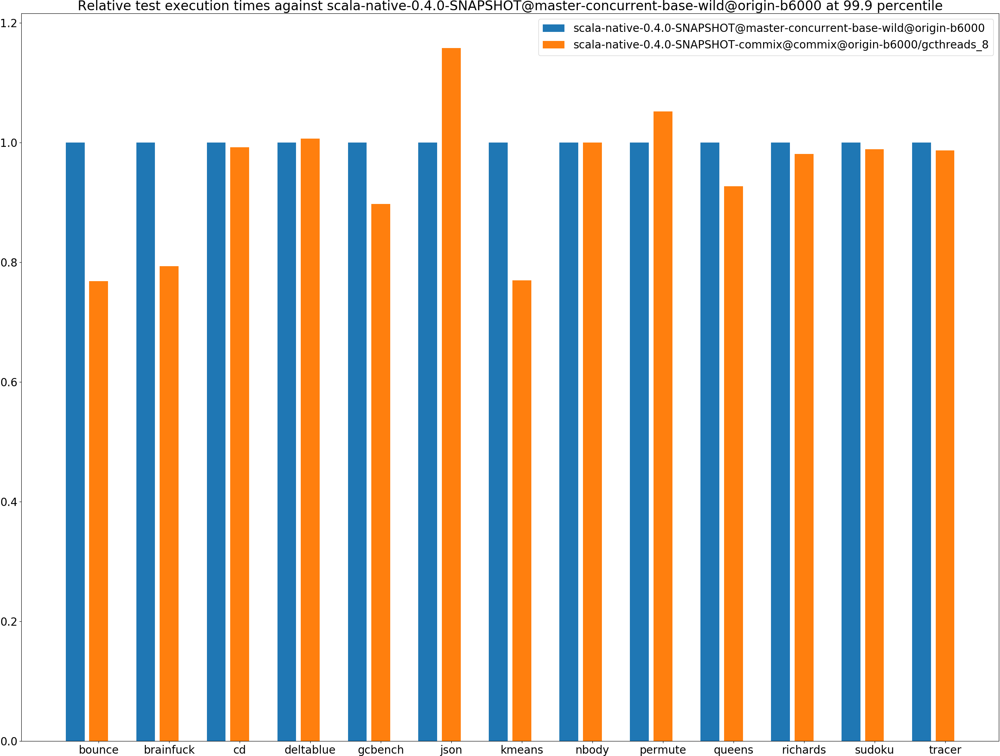
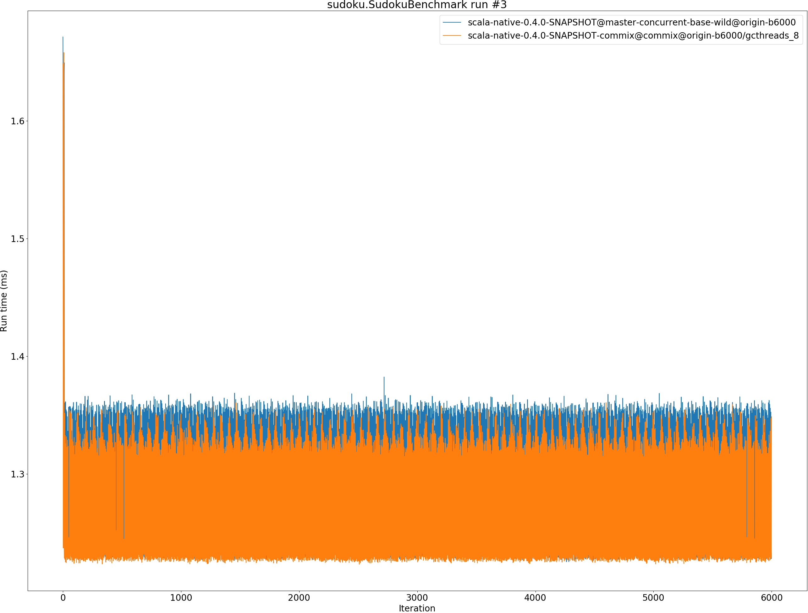

# Summary
## Benchmark run time (ms) at 50 percentile 

|name | scala-native-0.4.0-SNAPSHOT@master-concurrent-base-wild@origin-b6000 | scala-native-0.4.0-SNAPSHOT-commix@commix@origin-b6000/gcthreads_8 | |
| -- | -- | -- | -- |
|[bounce.BounceBenchmark](#bouncebouncebenchmark)|0.0148|0.0151|+1.59%|
|[brainfuck.BrainfuckBenchmark](#brainfuckbrainfuckbenchmark)|1.0402|1.0301|__-0.98%__|
|[cd.CDBenchmark](#cdcdbenchmark)|15.0125|15.0493|+0.25%|
|[deltablue.DeltaBlueBenchmark](#deltabluedeltabluebenchmark)|0.0616|0.0621|+0.94%|
|[gcbench.GCBenchBenchmark](#gcbenchgcbenchbenchmark)|59.4578|53.1977|__-10.53%__|
|[json.JsonBenchmark](#jsonjsonbenchmark)|0.3851|0.3730|__-3.14%__|
|[kmeans.KmeansBenchmark](#kmeanskmeansbenchmark)|19.7161|20.0267|+1.58%|
|[nbody.NbodyBenchmark](#nbodynbodybenchmark)|19.3855|19.3859|+0.00%|
|[permute.PermuteBenchmark](#permutepermutebenchmark)|0.0697|0.0707|+1.49%|
|[queens.QueensBenchmark](#queensqueensbenchmark)|0.0501|0.0486|__-2.92%__|
|[richards.RichardsBenchmark](#richardsrichardsbenchmark)|0.0511|0.0510|__-0.16%__|
|[sudoku.SudokuBenchmark](#sudokusudokubenchmark)|1.2349|1.2350|+0.01%|
|[tracer.TracerBenchmark](#tracertracerbenchmark)|0.3152|0.3143|__-0.30%__|
| __Geometrical mean:__|| |__-0.99%__|
## Benchmark run time (ms) at 90 percentile 

|name | scala-native-0.4.0-SNAPSHOT@master-concurrent-base-wild@origin-b6000 | scala-native-0.4.0-SNAPSHOT-commix@commix@origin-b6000/gcthreads_8 | |
| -- | -- | -- | -- |
|[bounce.BounceBenchmark](#bouncebouncebenchmark)|0.0151|0.0153|+1.40%|
|[brainfuck.BrainfuckBenchmark](#brainfuckbrainfuckbenchmark)|1.0813|1.0676|__-1.27%__|
|[cd.CDBenchmark](#cdcdbenchmark)|15.1456|15.1857|+0.26%|
|[deltablue.DeltaBlueBenchmark](#deltabluedeltabluebenchmark)|0.0644|0.0646|+0.23%|
|[gcbench.GCBenchBenchmark](#gcbenchgcbenchbenchmark)|59.8682|53.9240|__-9.93%__|
|[json.JsonBenchmark](#jsonjsonbenchmark)|0.4866|0.4276|__-12.14%__|
|[kmeans.KmeansBenchmark](#kmeanskmeansbenchmark)|20.3145|20.6587|+1.69%|
|[nbody.NbodyBenchmark](#nbodynbodybenchmark)|19.3870|19.3873|+0.00%|
|[permute.PermuteBenchmark](#permutepermutebenchmark)|0.0720|0.0749|+4.01%|
|[queens.QueensBenchmark](#queensqueensbenchmark)|0.0598|0.0489|__-18.36%__|
|[richards.RichardsBenchmark](#richardsrichardsbenchmark)|0.0522|0.0521|__-0.16%__|
|[sudoku.SudokuBenchmark](#sudokusudokubenchmark)|1.3502|1.3329|__-1.28%__|
|[tracer.TracerBenchmark](#tracertracerbenchmark)|0.3356|0.3315|__-1.23%__|
| __Geometrical mean:__|| |__-3.04%__|
## Benchmark run time (ms) at 99 percentile 

|name | scala-native-0.4.0-SNAPSHOT@master-concurrent-base-wild@origin-b6000 | scala-native-0.4.0-SNAPSHOT-commix@commix@origin-b6000/gcthreads_8 | |
| -- | -- | -- | -- |
|[bounce.BounceBenchmark](#bouncebouncebenchmark)|0.0153|0.0155|+1.47%|
|[brainfuck.BrainfuckBenchmark](#brainfuckbrainfuckbenchmark)|1.1061|1.0911|__-1.35%__|
|[cd.CDBenchmark](#cdcdbenchmark)|17.8801|16.8824|__-5.58%__|
|[deltablue.DeltaBlueBenchmark](#deltabluedeltabluebenchmark)|0.1218|0.1089|__-10.60%__|
|[gcbench.GCBenchBenchmark](#gcbenchgcbenchbenchmark)|60.4238|60.5874|+0.27%|
|[json.JsonBenchmark](#jsonjsonbenchmark)|0.4897|0.5593|+14.22%|
|[kmeans.KmeansBenchmark](#kmeanskmeansbenchmark)|20.9381|21.3991|+2.20%|
|[nbody.NbodyBenchmark](#nbodynbodybenchmark)|19.3897|28.3107|+46.01%|
|[permute.PermuteBenchmark](#permutepermutebenchmark)|0.0887|0.0935|+5.41%|
|[queens.QueensBenchmark](#queensqueensbenchmark)|0.0610|0.0513|__-15.83%__|
|[richards.RichardsBenchmark](#richardsrichardsbenchmark)|0.0554|0.0578|+4.27%|
|[sudoku.SudokuBenchmark](#sudokusudokubenchmark)|1.3638|1.3549|__-0.65%__|
|[tracer.TracerBenchmark](#tracertracerbenchmark)|0.3386|0.3347|__-1.16%__|
| __Geometrical mean:__|| |+2.11%|
## Benchmark run time (ms) at 99.9 percentile 

|name | scala-native-0.4.0-SNAPSHOT@master-concurrent-base-wild@origin-b6000 | scala-native-0.4.0-SNAPSHOT-commix@commix@origin-b6000/gcthreads_8 | |
| -- | -- | -- | -- |
|[bounce.BounceBenchmark](#bouncebouncebenchmark)|0.0303|0.0233|__-23.17%__|
|[brainfuck.BrainfuckBenchmark](#brainfuckbrainfuckbenchmark)|1.3953|1.1071|__-20.65%__|
|[cd.CDBenchmark](#cdcdbenchmark)|18.3189|18.1799|__-0.76%__|
|[deltablue.DeltaBlueBenchmark](#deltabluedeltabluebenchmark)|0.1238|0.1246|+0.67%|
|[gcbench.GCBenchBenchmark](#gcbenchgcbenchbenchmark)|68.6483|61.6238|__-10.23%__|
|[json.JsonBenchmark](#jsonjsonbenchmark)|0.4918|0.5694|+15.78%|
|[kmeans.KmeansBenchmark](#kmeanskmeansbenchmark)|28.2985|21.7797|__-23.04%__|
|[nbody.NbodyBenchmark](#nbodynbodybenchmark)|28.3086|28.3170|+0.03%|
|[permute.PermuteBenchmark](#permutepermutebenchmark)|0.0908|0.0955|+5.18%|
|[queens.QueensBenchmark](#queensqueensbenchmark)|0.0683|0.0633|__-7.32%__|
|[richards.RichardsBenchmark](#richardsrichardsbenchmark)|0.0605|0.0594|__-1.93%__|
|[sudoku.SudokuBenchmark](#sudokusudokubenchmark)|1.3789|1.3637|__-1.10%__|
|[tracer.TracerBenchmark](#tracertracerbenchmark)|0.3409|0.3364|__-1.32%__|
| __Geometrical mean:__|| |__-5.88%__|
## Benchmark total run time (ms) 

|name | scala-native-0.4.0-SNAPSHOT@master-concurrent-base-wild@origin-b6000 | scala-native-0.4.0-SNAPSHOT-commix@commix@origin-b6000/gcthreads_8 | |
| -- | -- | -- | -- |
|[bounce.BounceBenchmark](#bouncebouncebenchmark)|951.5002|966.3748|+1.56%|
|[brainfuck.BrainfuckBenchmark](#brainfuckbrainfuckbenchmark)|67640.2812|66689.9524|__-1.40%__|
|[cd.CDBenchmark](#cdcdbenchmark)|964865.7227|969142.0448|+0.44%|
|[deltablue.DeltaBlueBenchmark](#deltabluedeltabluebenchmark)|4097.9535|4075.2115|__-0.55%__|
|[gcbench.GCBenchBenchmark](#gcbenchgcbenchbenchmark)|3816593.9757|3425002.2144|__-10.26%__|
|[json.JsonBenchmark](#jsonjsonbenchmark)|25605.9558|24732.5252|__-3.41%__|
|[kmeans.KmeansBenchmark](#kmeanskmeansbenchmark)|1272152.9713|1288558.5395|+1.29%|
|[nbody.NbodyBenchmark](#nbodynbodybenchmark)|1238909.5816|1247516.6328|+0.69%|
|[permute.PermuteBenchmark](#permutepermutebenchmark)|4550.0629|4624.8324|+1.64%|
|[queens.QueensBenchmark](#queensqueensbenchmark)|3262.6922|3124.1867|__-4.25%__|
|[richards.RichardsBenchmark](#richardsrichardsbenchmark)|3286.7227|3285.3069|__-0.04%__|
|[sudoku.SudokuBenchmark](#sudokusudokubenchmark)|80620.9950|80317.2927|__-0.38%__|
|[tracer.TracerBenchmark](#tracertracerbenchmark)|20622.3583|20490.5476|__-0.64%__|
| __Geometrical mean:__|| |__-1.23%__|
# Individual benchmarks
## bounce.BounceBenchmark

## brainfuck.BrainfuckBenchmark

## cd.CDBenchmark

## deltablue.DeltaBlueBenchmark

## gcbench.GCBenchBenchmark

## json.JsonBenchmark

## kmeans.KmeansBenchmark

## nbody.NbodyBenchmark

## permute.PermuteBenchmark

## queens.QueensBenchmark

## richards.RichardsBenchmark

## sudoku.SudokuBenchmark

## tracer.TracerBenchmark

