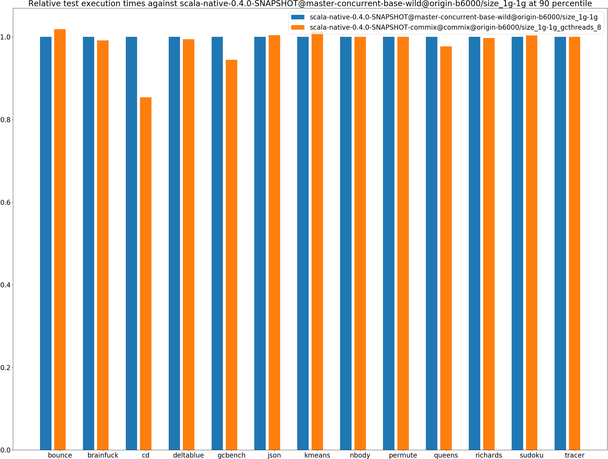
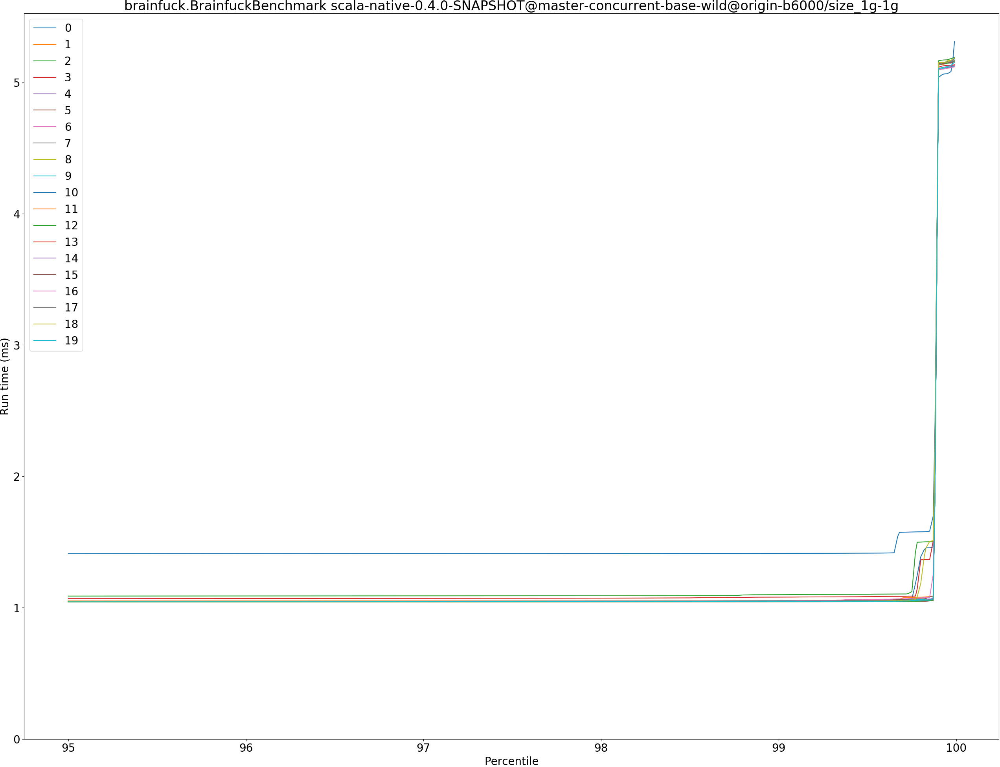
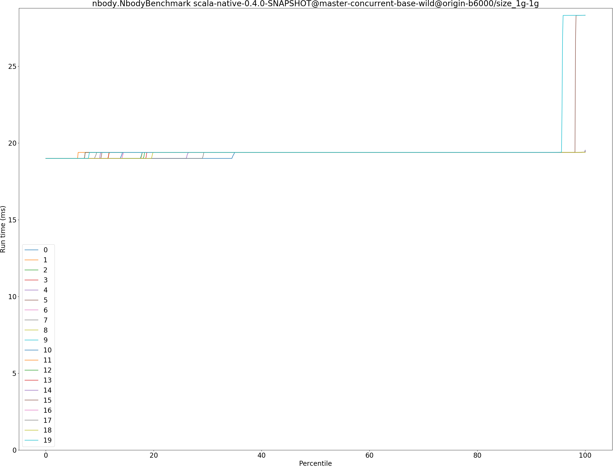
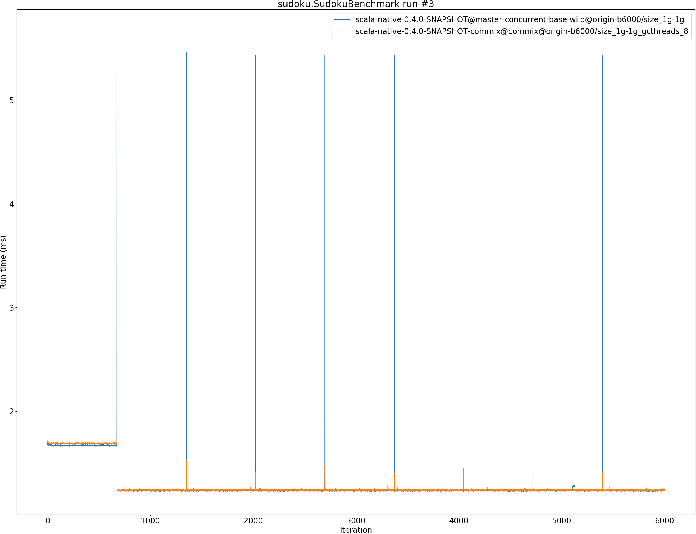

# Summary
## Benchmark run time (ms) at 50 percentile 

|name | scala-native-0.4.0-SNAPSHOT@master-concurrent-base-wild@origin-b6000/size_1g-1g | scala-native-0.4.0-SNAPSHOT-commix@commix@origin-b6000/size_1g-1g_gcthreads_8 | |
| -- | -- | -- | -- |
|[bounce.BounceBenchmark](#bouncebouncebenchmark)|0.0159|0.0162|+1.63%|
|[brainfuck.BrainfuckBenchmark](#brainfuckbrainfuckbenchmark)|1.0408|1.0287|__-1.16%__|
|[cd.CDBenchmark](#cdcdbenchmark)|14.7899|14.8763|+0.58%|
|[deltablue.DeltaBlueBenchmark](#deltabluedeltabluebenchmark)|0.1007|0.1006|__-0.13%__|
|[gcbench.GCBenchBenchmark](#gcbenchgcbenchbenchmark)|54.1185|52.9678|__-2.13%__|
|[json.JsonBenchmark](#jsonjsonbenchmark)|0.3755|0.3768|+0.35%|
|[kmeans.KmeansBenchmark](#kmeanskmeansbenchmark)|19.6336|19.9765|+1.75%|
|[nbody.NbodyBenchmark](#nbodynbodybenchmark)|19.3855|19.3855|__-0.00%__|
|[permute.PermuteBenchmark](#permutepermutebenchmark)|0.1365|0.1362|__-0.20%__|
|[queens.QueensBenchmark](#queensqueensbenchmark)|0.0529|0.0518|__-2.06%__|
|[richards.RichardsBenchmark](#richardsrichardsbenchmark)|0.0512|0.0511|__-0.11%__|
|[sudoku.SudokuBenchmark](#sudokusudokubenchmark)|1.2345|1.2380|+0.29%|
|[tracer.TracerBenchmark](#tracertracerbenchmark)|0.3218|0.3220|+0.07%|
| __Geometrical mean:__|| |__-0.09%__|
## Benchmark run time (ms) at 90 percentile 

|name | scala-native-0.4.0-SNAPSHOT@master-concurrent-base-wild@origin-b6000/size_1g-1g | scala-native-0.4.0-SNAPSHOT-commix@commix@origin-b6000/size_1g-1g_gcthreads_8 | |
| -- | -- | -- | -- |
|[bounce.BounceBenchmark](#bouncebouncebenchmark)|0.0169|0.0173|+1.86%|
|[brainfuck.BrainfuckBenchmark](#brainfuckbrainfuckbenchmark)|1.0452|1.0365|__-0.84%__|
|[cd.CDBenchmark](#cdcdbenchmark)|17.5617|14.9895|__-14.65%__|
|[deltablue.DeltaBlueBenchmark](#deltabluedeltabluebenchmark)|0.1035|0.1029|__-0.56%__|
|[gcbench.GCBenchBenchmark](#gcbenchgcbenchbenchmark)|57.3127|54.1267|__-5.56%__|
|[json.JsonBenchmark](#jsonjsonbenchmark)|0.3786|0.3802|+0.42%|
|[kmeans.KmeansBenchmark](#kmeanskmeansbenchmark)|20.0700|20.3354|+1.32%|
|[nbody.NbodyBenchmark](#nbodynbodybenchmark)|19.3869|19.3869|__-0.00%__|
|[permute.PermuteBenchmark](#permutepermutebenchmark)|0.1395|0.1395|+0.02%|
|[queens.QueensBenchmark](#queensqueensbenchmark)|0.0548|0.0535|__-2.32%__|
|[richards.RichardsBenchmark](#richardsrichardsbenchmark)|0.0528|0.0526|__-0.27%__|
|[sudoku.SudokuBenchmark](#sudokusudokubenchmark)|1.2417|1.2464|+0.37%|
|[tracer.TracerBenchmark](#tracertracerbenchmark)|0.3247|0.3248|+0.03%|
| __Geometrical mean:__|| |__-1.65%__|
## Benchmark run time (ms) at 99 percentile 

|name | scala-native-0.4.0-SNAPSHOT@master-concurrent-base-wild@origin-b6000/size_1g-1g | scala-native-0.4.0-SNAPSHOT-commix@commix@origin-b6000/size_1g-1g_gcthreads_8 | |
| -- | -- | -- | -- |
|[bounce.BounceBenchmark](#bouncebouncebenchmark)|0.0183|0.0190|+3.70%|
|[brainfuck.BrainfuckBenchmark](#brainfuckbrainfuckbenchmark)|1.0508|1.0470|__-0.36%__|
|[cd.CDBenchmark](#cdcdbenchmark)|19.0100|16.2559|__-14.49%__|
|[deltablue.DeltaBlueBenchmark](#deltabluedeltabluebenchmark)|0.1062|0.1056|__-0.52%__|
|[gcbench.GCBenchBenchmark](#gcbenchgcbenchbenchmark)|60.4323|54.4031|__-9.98%__|
|[json.JsonBenchmark](#jsonjsonbenchmark)|0.3831|0.3850|+0.49%|
|[kmeans.KmeansBenchmark](#kmeanskmeansbenchmark)|22.6791|20.9244|__-7.74%__|
|[nbody.NbodyBenchmark](#nbodynbodybenchmark)|19.3888|19.3889|+0.00%|
|[permute.PermuteBenchmark](#permutepermutebenchmark)|0.1420|0.1421|+0.07%|
|[queens.QueensBenchmark](#queensqueensbenchmark)|0.0568|0.0554|__-2.36%__|
|[richards.RichardsBenchmark](#richardsrichardsbenchmark)|0.0560|0.0585|+4.49%|
|[sudoku.SudokuBenchmark](#sudokusudokubenchmark)|1.2487|1.2550|+0.50%|
|[tracer.TracerBenchmark](#tracertracerbenchmark)|0.3285|0.3295|+0.30%|
| __Geometrical mean:__|| |__-2.14%__|
## Benchmark run time (ms) at 99.9 percentile 

|name | scala-native-0.4.0-SNAPSHOT@master-concurrent-base-wild@origin-b6000/size_1g-1g | scala-native-0.4.0-SNAPSHOT-commix@commix@origin-b6000/size_1g-1g_gcthreads_8 | |
| -- | -- | -- | -- |
|[bounce.BounceBenchmark](#bouncebouncebenchmark)|0.0191|0.0232|+21.44%|
|[brainfuck.BrainfuckBenchmark](#brainfuckbrainfuckbenchmark)|5.1111|1.1328|__-77.84%__|
|[cd.CDBenchmark](#cdcdbenchmark)|21.6337|17.5053|__-19.08%__|
|[deltablue.DeltaBlueBenchmark](#deltabluedeltabluebenchmark)|0.1094|0.1103|+0.88%|
|[gcbench.GCBenchBenchmark](#gcbenchgcbenchbenchmark)|64.7915|55.4537|__-14.41%__|
|[json.JsonBenchmark](#jsonjsonbenchmark)|4.4942|0.9582|__-78.68%__|
|[kmeans.KmeansBenchmark](#kmeanskmeansbenchmark)|23.3832|28.4267|+21.57%|
|[nbody.NbodyBenchmark](#nbodynbodybenchmark)|19.3957|19.3970|+0.01%|
|[permute.PermuteBenchmark](#permutepermutebenchmark)|0.1447|0.2416|+67.02%|
|[queens.QueensBenchmark](#queensqueensbenchmark)|0.0580|0.0565|__-2.57%__|
|[richards.RichardsBenchmark](#richardsrichardsbenchmark)|0.0604|0.0600|__-0.72%__|
|[sudoku.SudokuBenchmark](#sudokusudokubenchmark)|5.4252|1.4153|__-73.91%__|
|[tracer.TracerBenchmark](#tracertracerbenchmark)|4.3277|0.8137|__-81.20%__|
| __Geometrical mean:__|| |__-34.78%__|
## Benchmark total run time (ms) 

|name | scala-native-0.4.0-SNAPSHOT@master-concurrent-base-wild@origin-b6000/size_1g-1g | scala-native-0.4.0-SNAPSHOT-commix@commix@origin-b6000/size_1g-1g_gcthreads_8 | |
| -- | -- | -- | -- |
|[bounce.BounceBenchmark](#bouncebouncebenchmark)|1033.2774|1055.1705|+2.12%|
|[brainfuck.BrainfuckBenchmark](#brainfuckbrainfuckbenchmark)|66969.0654|65930.4647|__-1.55%__|
|[cd.CDBenchmark](#cdcdbenchmark)|974274.8567|959450.6988|__-1.52%__|
|[deltablue.DeltaBlueBenchmark](#deltabluedeltabluebenchmark)|6472.2836|6452.8322|__-0.30%__|
|[gcbench.GCBenchBenchmark](#gcbenchgcbenchbenchmark)|3538734.4100|3417039.1283|__-3.44%__|
|[json.JsonBenchmark](#jsonjsonbenchmark)|24457.2117|24297.4848|__-0.65%__|
|[kmeans.KmeansBenchmark](#kmeanskmeansbenchmark)|1261130.9056|1285563.2248|+1.94%|
|[nbody.NbodyBenchmark](#nbodynbodybenchmark)|1236330.1663|1235963.0068|__-0.03%__|
|[permute.PermuteBenchmark](#permutepermutebenchmark)|6901.2428|6898.0394|__-0.05%__|
|[queens.QueensBenchmark](#queensqueensbenchmark)|3406.0560|3334.7057|__-2.09%__|
|[richards.RichardsBenchmark](#richardsrichardsbenchmark)|3306.8572|3306.4386|__-0.01%__|
|[sudoku.SudokuBenchmark](#sudokusudokubenchmark)|79771.3071|79514.1706|__-0.32%__|
|[tracer.TracerBenchmark](#tracertracerbenchmark)|21051.9668|20714.9354|__-1.60%__|
| __Geometrical mean:__|| |__-0.59%__|
# Individual benchmarks
## bounce.BounceBenchmark

## brainfuck.BrainfuckBenchmark

## cd.CDBenchmark

## deltablue.DeltaBlueBenchmark

## gcbench.GCBenchBenchmark

## json.JsonBenchmark

## kmeans.KmeansBenchmark

## nbody.NbodyBenchmark

## permute.PermuteBenchmark

## queens.QueensBenchmark

## richards.RichardsBenchmark

## sudoku.SudokuBenchmark

## tracer.TracerBenchmark

