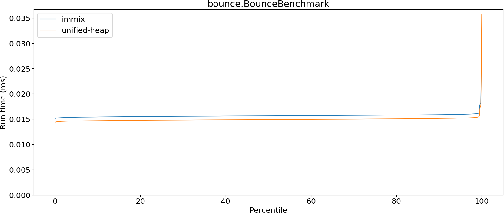
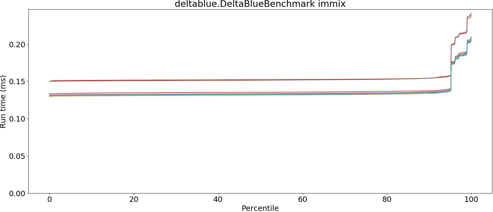
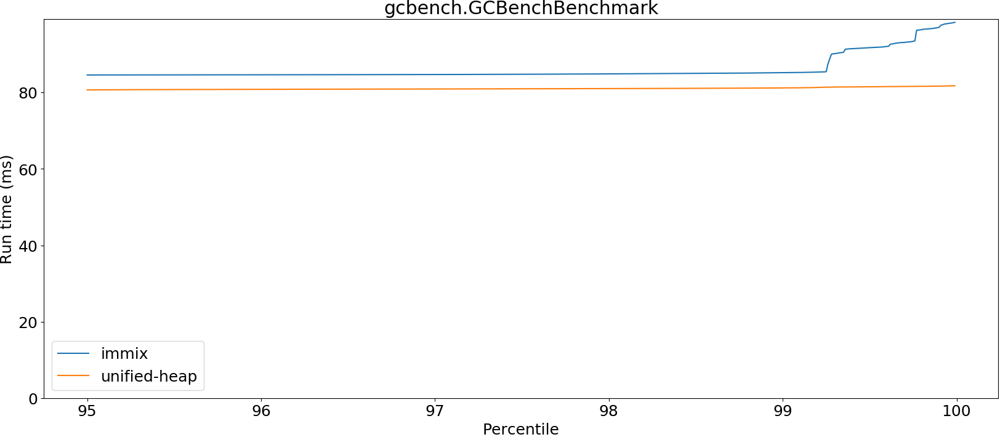
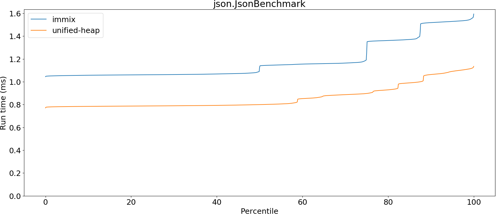
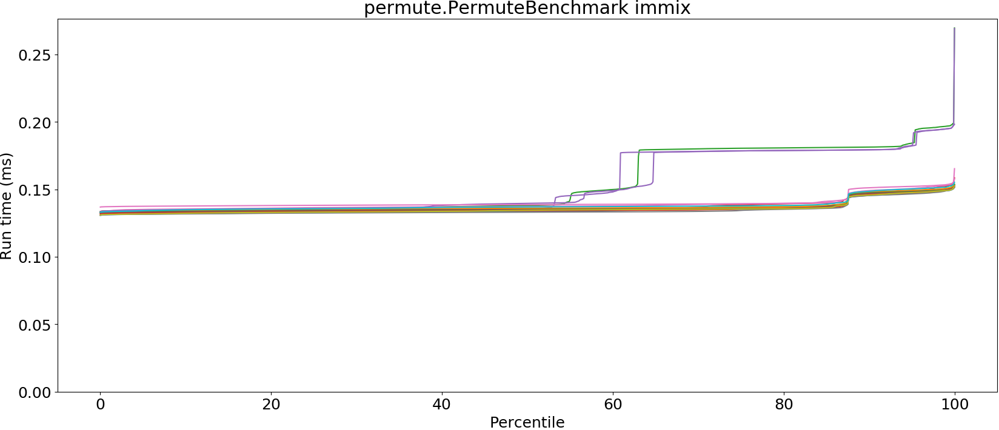
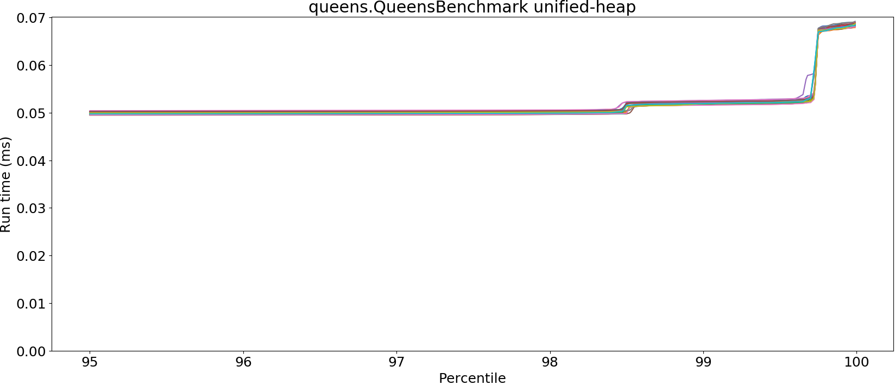

# Summary
## Benchmark run time (ms) at 50 percentile 

|name | immix | unified-heap | |
| -- | -- | -- | -- |
|[bounce.BounceBenchmark](#bouncebouncebenchmark)|0.0157|0.0149|__-4.77%__|
|[brainfuck.BrainfuckBenchmark](#brainfuckbrainfuckbenchmark)|1.2513|1.1106|__-11.25%__|
|[cd.CDBenchmark](#cdcdbenchmark)|20.1290|16.3921|__-18.56%__|
|[deltablue.DeltaBlueBenchmark](#deltabluedeltabluebenchmark)|0.1320|0.1272|__-3.68%__|
|[gcbench.GCBenchBenchmark](#gcbenchgcbenchbenchmark)|80.6691|76.7033|__-4.92%__|
|[json.JsonBenchmark](#jsonjsonbenchmark)|1.1278|0.7997|__-29.09%__|
|[kmeans.KmeansBenchmark](#kmeanskmeansbenchmark)|22.6223|19.8906|__-12.08%__|
|[nbody.NbodyBenchmark](#nbodynbodybenchmark)|19.2821|19.2773|__-0.03%__|
|[permute.PermuteBenchmark](#permutepermutebenchmark)|0.1352|0.1221|__-9.66%__|
|[queens.QueensBenchmark](#queensqueensbenchmark)|0.0517|0.0495|__-4.27%__|
|[richards.RichardsBenchmark](#richardsrichardsbenchmark)|0.0514|0.0507|__-1.50%__|
|[sudoku.SudokuBenchmark](#sudokusudokubenchmark)|1.4977|1.4222|__-5.05%__|
|[tracer.TracerBenchmark](#tracertracerbenchmark)|0.5199|0.4582|__-11.87%__|
| __Geometrical mean:__|| |__-9.33%__|
## Benchmark run time (ms) at 90 percentile 

|name | immix | unified-heap | |
| -- | -- | -- | -- |
|[bounce.BounceBenchmark](#bouncebouncebenchmark)|0.0159|0.0151|__-4.72%__|
|[brainfuck.BrainfuckBenchmark](#brainfuckbrainfuckbenchmark)|1.2699|1.1455|__-9.80%__|
|[cd.CDBenchmark](#cdcdbenchmark)|22.9054|16.5298|__-27.83%__|
|[deltablue.DeltaBlueBenchmark](#deltabluedeltabluebenchmark)|0.1345|0.1289|__-4.18%__|
|[gcbench.GCBenchBenchmark](#gcbenchgcbenchbenchmark)|84.4396|79.7645|__-5.54%__|
|[json.JsonBenchmark](#jsonjsonbenchmark)|1.5170|1.0629|__-29.94%__|
|[kmeans.KmeansBenchmark](#kmeanskmeansbenchmark)|24.7776|20.7372|__-16.31%__|
|[nbody.NbodyBenchmark](#nbodynbodybenchmark)|19.3227|19.2787|__-0.23%__|
|[permute.PermuteBenchmark](#permutepermutebenchmark)|0.1470|0.1391|__-5.37%__|
|[queens.QueensBenchmark](#queensqueensbenchmark)|0.0520|0.0499|__-3.92%__|
|[richards.RichardsBenchmark](#richardsrichardsbenchmark)|0.0532|0.0523|__-1.70%__|
|[sudoku.SudokuBenchmark](#sudokusudokubenchmark)|1.7515|1.5076|__-13.93%__|
|[tracer.TracerBenchmark](#tracertracerbenchmark)|0.5243|0.4628|__-11.73%__|
| __Geometrical mean:__|| |__-10.90%__|
## Benchmark run time (ms) at 99 percentile 

|name | immix | unified-heap | |
| -- | -- | -- | -- |
|[bounce.BounceBenchmark](#bouncebouncebenchmark)|0.0161|0.0154|__-4.58%__|
|[brainfuck.BrainfuckBenchmark](#brainfuckbrainfuckbenchmark)|1.2982|1.1606|__-10.60%__|
|[cd.CDBenchmark](#cdcdbenchmark)|23.6261|17.2592|__-26.95%__|
|[deltablue.DeltaBlueBenchmark](#deltabluedeltabluebenchmark)|0.1890|0.1781|__-5.74%__|
|[gcbench.GCBenchBenchmark](#gcbenchgcbenchbenchmark)|87.1679|80.9429|__-7.14%__|
|[json.JsonBenchmark](#jsonjsonbenchmark)|1.5362|1.1122|__-27.60%__|
|[kmeans.KmeansBenchmark](#kmeanskmeansbenchmark)|30.7392|21.1757|__-31.11%__|
|[nbody.NbodyBenchmark](#nbodynbodybenchmark)|20.7409|19.2981|__-6.96%__|
|[permute.PermuteBenchmark](#permutepermutebenchmark)|0.1507|0.1425|__-5.45%__|
|[queens.QueensBenchmark](#queensqueensbenchmark)|0.0543|0.0518|__-4.48%__|
|[richards.RichardsBenchmark](#richardsrichardsbenchmark)|0.0617|0.0544|__-11.94%__|
|[sudoku.SudokuBenchmark](#sudokusudokubenchmark)|1.7728|1.6518|__-6.82%__|
|[tracer.TracerBenchmark](#tracertracerbenchmark)|0.5279|0.4660|__-11.73%__|
| __Geometrical mean:__|| |__-12.92%__|
## Benchmark run time (ms) at 99.9 percentile 

|name | immix | unified-heap | |
| -- | -- | -- | -- |
|[bounce.BounceBenchmark](#bouncebouncebenchmark)|0.0274|0.0219|__-20.25%__|
|[brainfuck.BrainfuckBenchmark](#brainfuckbrainfuckbenchmark)|1.3037|1.1692|__-10.32%__|
|[cd.CDBenchmark](#cdcdbenchmark)|26.1800|20.2687|__-22.58%__|
|[deltablue.DeltaBlueBenchmark](#deltabluedeltabluebenchmark)|0.2042|0.1853|__-9.25%__|
|[gcbench.GCBenchBenchmark](#gcbenchgcbenchbenchmark)|96.5476|81.6768|__-15.40%__|
|[json.JsonBenchmark](#jsonjsonbenchmark)|1.5470|1.1241|__-27.34%__|
|[kmeans.KmeansBenchmark](#kmeanskmeansbenchmark)|35.1348|21.2800|__-39.43%__|
|[nbody.NbodyBenchmark](#nbodynbodybenchmark)|28.6468|28.5499|__-0.34%__|
|[permute.PermuteBenchmark](#permutepermutebenchmark)|0.1534|0.1450|__-5.47%__|
|[queens.QueensBenchmark](#queensqueensbenchmark)|0.0647|0.0680|+4.98%|
|[richards.RichardsBenchmark](#richardsrichardsbenchmark)|0.0643|0.0679|+5.67%|
|[sudoku.SudokuBenchmark](#sudokusudokubenchmark)|1.7816|1.6847|__-5.44%__|
|[tracer.TracerBenchmark](#tracertracerbenchmark)|0.5307|0.4686|__-11.70%__|
| __Geometrical mean:__|| |__-13.01%__|
## Benchmark total run time (ms) 

|name | immix | unified-heap | |
| -- | -- | -- | -- |
|[bounce.BounceBenchmark](#bouncebouncebenchmark)|1003.6182|956.1604|__-4.73%__|
|[brainfuck.BrainfuckBenchmark](#brainfuckbrainfuckbenchmark)|77959.2376|70695.1806|__-9.32%__|
|[cd.CDBenchmark](#cdcdbenchmark)|1317827.3472|1051934.9033|__-20.18%__|
|[deltablue.DeltaBlueBenchmark](#deltabluedeltabluebenchmark)|8626.8423|8273.9066|__-4.09%__|
|[gcbench.GCBenchBenchmark](#gcbenchgcbenchbenchmark)|5230554.7532|4872374.3329|__-6.85%__|
|[json.JsonBenchmark](#jsonjsonbenchmark)|75652.3681|55093.7061|__-27.18%__|
|[kmeans.KmeansBenchmark](#kmeanskmeansbenchmark)|1472279.4059|1279040.5890|__-13.13%__|
|[nbody.NbodyBenchmark](#nbodynbodybenchmark)|1236782.3793|1234671.7316|__-0.17%__|
|[permute.PermuteBenchmark](#permutepermutebenchmark)|8806.1766|7948.7040|__-9.74%__|
|[queens.QueensBenchmark](#queensqueensbenchmark)|3311.3381|3173.6736|__-4.16%__|
|[richards.RichardsBenchmark](#richardsrichardsbenchmark)|3339.0357|3265.9818|__-2.19%__|
|[sudoku.SudokuBenchmark](#sudokusudokubenchmark)|97802.4858|92653.3428|__-5.26%__|
|[tracer.TracerBenchmark](#tracertracerbenchmark)|32997.8425|28894.1991|__-12.44%__|
| __Geometrical mean:__|| |__-9.50%__|
# Individual benchmarks
## bounce.BounceBenchmark

## brainfuck.BrainfuckBenchmark

## cd.CDBenchmark

## deltablue.DeltaBlueBenchmark

## gcbench.GCBenchBenchmark

## json.JsonBenchmark

## kmeans.KmeansBenchmark

## nbody.NbodyBenchmark

## permute.PermuteBenchmark

## queens.QueensBenchmark

## richards.RichardsBenchmark

## sudoku.SudokuBenchmark

## tracer.TracerBenchmark

