# Summary
## Benchmark run time (ms) at 50 percentile 
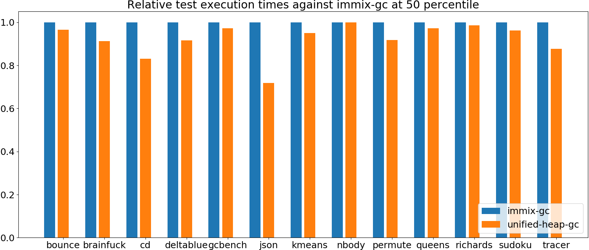

|name | immix-gc | unified-heap-gc | |
| -- | -- | -- | -- |
|[bounce.BounceBenchmark](#bouncebouncebenchmark)|0.0155|0.0149|__-3.53%__|
|[brainfuck.BrainfuckBenchmark](#brainfuckbrainfuckbenchmark)|1.1810|1.0780|__-8.72%__|
|[cd.CDBenchmark](#cdcdbenchmark)|20.0728|16.6684|__-16.96%__|
|[deltablue.DeltaBlueBenchmark](#deltabluedeltabluebenchmark)|0.1389|0.1271|__-8.49%__|
|[gcbench.GCBenchBenchmark](#gcbenchgcbenchbenchmark)|80.3841|78.0794|__-2.87%__|
|[json.JsonBenchmark](#jsonjsonbenchmark)|1.1179|0.8030|__-28.17%__|
|[kmeans.KmeansBenchmark](#kmeanskmeansbenchmark)|20.8383|19.7820|__-5.07%__|
|[nbody.NbodyBenchmark](#nbodynbodybenchmark)|19.2823|19.2772|__-0.03%__|
|[permute.PermuteBenchmark](#permutepermutebenchmark)|0.1328|0.1219|__-8.23%__|
|[queens.QueensBenchmark](#queensqueensbenchmark)|0.0510|0.0495|__-2.83%__|
|[richards.RichardsBenchmark](#richardsrichardsbenchmark)|0.0514|0.0507|__-1.44%__|
|[sudoku.SudokuBenchmark](#sudokusudokubenchmark)|1.4783|1.4224|__-3.78%__|
|[tracer.TracerBenchmark](#tracertracerbenchmark)|0.5217|0.4577|__-12.27%__|
| __Geometrical mean:__|| |__-8.20%__|
## Benchmark run time (ms) at 90 percentile 

|name | immix-gc | unified-heap-gc | |
| -- | -- | -- | -- |
|[bounce.BounceBenchmark](#bouncebouncebenchmark)|0.0157|0.0151|__-3.50%__|
|[brainfuck.BrainfuckBenchmark](#brainfuckbrainfuckbenchmark)|1.2634|1.1263|__-10.85%__|
|[cd.CDBenchmark](#cdcdbenchmark)|20.2342|19.7081|__-2.60%__|
|[deltablue.DeltaBlueBenchmark](#deltabluedeltabluebenchmark)|0.1408|0.1287|__-8.57%__|
|[gcbench.GCBenchBenchmark](#gcbenchgcbenchbenchmark)|84.1366|79.1501|__-5.93%__|
|[json.JsonBenchmark](#jsonjsonbenchmark)|1.5469|1.0600|__-31.48%__|
|[kmeans.KmeansBenchmark](#kmeanskmeansbenchmark)|21.2984|20.7229|__-2.70%__|
|[nbody.NbodyBenchmark](#nbodynbodybenchmark)|19.3225|19.2785|__-0.23%__|
|[permute.PermuteBenchmark](#permutepermutebenchmark)|0.1451|0.1377|__-5.11%__|
|[queens.QueensBenchmark](#queensqueensbenchmark)|0.0513|0.0500|__-2.52%__|
|[richards.RichardsBenchmark](#richardsrichardsbenchmark)|0.0608|0.0521|__-14.40%__|
|[sudoku.SudokuBenchmark](#sudokusudokubenchmark)|1.7318|1.5057|__-13.06%__|
|[tracer.TracerBenchmark](#tracertracerbenchmark)|0.5259|0.4622|__-12.12%__|
| __Geometrical mean:__|| |__-9.08%__|
## Benchmark run time (ms) at 99 percentile 

|name | immix-gc | unified-heap-gc | |
| -- | -- | -- | -- |
|[bounce.BounceBenchmark](#bouncebouncebenchmark)|0.0159|0.0154|__-3.24%__|
|[brainfuck.BrainfuckBenchmark](#brainfuckbrainfuckbenchmark)|1.3007|1.1474|__-11.78%__|
|[cd.CDBenchmark](#cdcdbenchmark)|22.9318|19.9139|__-13.16%__|
|[deltablue.DeltaBlueBenchmark](#deltabluedeltabluebenchmark)|0.1704|0.1780|+4.46%|
|[gcbench.GCBenchBenchmark](#gcbenchgcbenchbenchmark)|85.0414|80.6830|__-5.13%__|
|[json.JsonBenchmark](#jsonjsonbenchmark)|1.5673|1.1027|__-29.64%__|
|[kmeans.KmeansBenchmark](#kmeanskmeansbenchmark)|21.6690|21.1962|__-2.18%__|
|[nbody.NbodyBenchmark](#nbodynbodybenchmark)|19.8541|19.2806|__-2.89%__|
|[permute.PermuteBenchmark](#permutepermutebenchmark)|0.1475|0.1408|__-4.55%__|
|[queens.QueensBenchmark](#queensqueensbenchmark)|0.0536|0.0523|__-2.54%__|
|[richards.RichardsBenchmark](#richardsrichardsbenchmark)|0.0627|0.0541|__-13.85%__|
|[sudoku.SudokuBenchmark](#sudokusudokubenchmark)|1.7523|1.6572|__-5.42%__|
|[tracer.TracerBenchmark](#tracertracerbenchmark)|0.5301|0.4659|__-12.11%__|
| __Geometrical mean:__|| |__-8.24%__|
## Benchmark run time (ms) at 99.9 percentile 
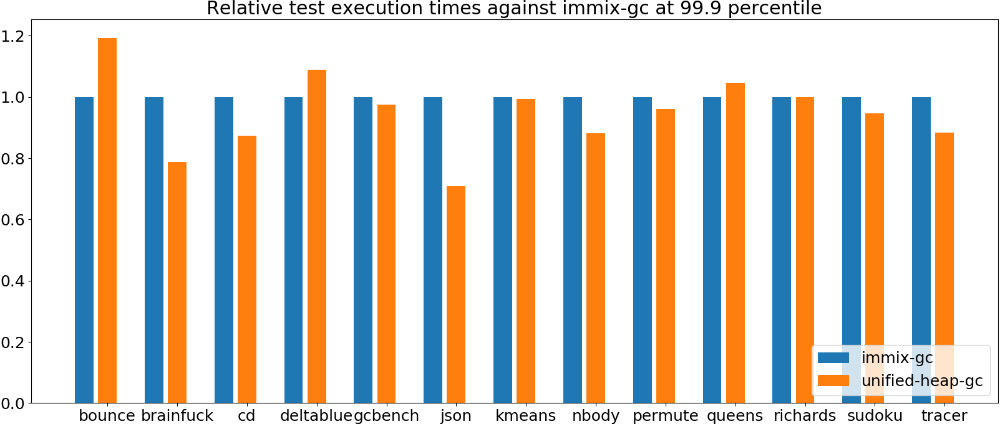

|name | immix-gc | unified-heap-gc | |
| -- | -- | -- | -- |
|[bounce.BounceBenchmark](#bouncebouncebenchmark)|0.0274|0.0327|+19.34%|
|[brainfuck.BrainfuckBenchmark](#brainfuckbrainfuckbenchmark)|1.4732|1.1597|__-21.28%__|
|[cd.CDBenchmark](#cdcdbenchmark)|22.9719|20.0470|__-12.73%__|
|[deltablue.DeltaBlueBenchmark](#deltabluedeltabluebenchmark)|0.1733|0.1887|+8.86%|
|[gcbench.GCBenchBenchmark](#gcbenchgcbenchbenchmark)|86.1363|83.9909|__-2.49%__|
|[json.JsonBenchmark](#jsonjsonbenchmark)|1.5777|1.1181|__-29.13%__|
|[kmeans.KmeansBenchmark](#kmeanskmeansbenchmark)|22.0651|21.9093|__-0.71%__|
|[nbody.NbodyBenchmark](#nbodynbodybenchmark)|21.8804|19.2894|__-11.84%__|
|[permute.PermuteBenchmark](#permutepermutebenchmark)|0.1564|0.1502|__-3.95%__|
|[queens.QueensBenchmark](#queensqueensbenchmark)|0.0644|0.0674|+4.58%|
|[richards.RichardsBenchmark](#richardsrichardsbenchmark)|0.0682|0.0681|__-0.10%__|
|[sudoku.SudokuBenchmark](#sudokusudokubenchmark)|1.7757|1.6814|__-5.31%__|
|[tracer.TracerBenchmark](#tracertracerbenchmark)|0.5383|0.4752|__-11.73%__|
| __Geometrical mean:__|| |__-5.91%__|
## Benchmark total run time (ms) 

|name | immix-gc | unified-heap-gc | |
| -- | -- | -- | -- |
|[bounce.BounceBenchmark](#bouncebouncebenchmark)|990.2676|956.3934|__-3.42%__|
|[brainfuck.BrainfuckBenchmark](#brainfuckbrainfuckbenchmark)|77435.4748|69961.5126|__-9.65%__|
|[cd.CDBenchmark](#cdcdbenchmark)|1302420.6250|1094244.2977|__-15.98%__|
|[deltablue.DeltaBlueBenchmark](#deltabluedeltabluebenchmark)|8982.7236|8264.4925|__-8.00%__|
|[gcbench.GCBenchBenchmark](#gcbenchgcbenchbenchmark)|5207800.9000|4843811.8679|__-6.99%__|
|[json.JsonBenchmark](#jsonjsonbenchmark)|76339.4707|55166.7470|__-27.73%__|
|[kmeans.KmeansBenchmark](#kmeanskmeansbenchmark)|1335129.9293|1274715.6460|__-4.52%__|
|[nbody.NbodyBenchmark](#nbodynbodybenchmark)|1231798.4124|1232485.8886|+0.06%|
|[permute.PermuteBenchmark](#permutepermutebenchmark)|8601.1484|7932.1800|__-7.78%__|
|[queens.QueensBenchmark](#queensqueensbenchmark)|3268.7135|3176.4700|__-2.82%__|
|[richards.RichardsBenchmark](#richardsrichardsbenchmark)|3399.9614|3265.7877|__-3.95%__|
|[sudoku.SudokuBenchmark](#sudokusudokubenchmark)|96588.8855|92708.4024|__-4.02%__|
|[tracer.TracerBenchmark](#tracertracerbenchmark)|33096.5484|28879.0138|__-12.74%__|
| __Geometrical mean:__|| |__-8.56%__|
## Total GC time on Application thread (ms) 

|name |  | immix-gc | unified-heap-gc | |
| -- | -- | -- | -- | -- |
|[bounce.BounceBenchmark](#bouncebouncebenchmark)|mark|1.1346|1.0446|__-7.93%__|
||sweep|0.8999|1.5579|+73.13%|
||total|2.0345|2.6026|+27.92%|
|[brainfuck.BrainfuckBenchmark](#brainfuckbrainfuckbenchmark)|mark|2213.5346|1807.7365|__-18.33%__|
||sweep|2926.0168|771.1522|__-73.64%__|
||total|5139.5514|2578.8888|__-49.82%__|
|[cd.CDBenchmark](#cdcdbenchmark)|mark|69301.4498|66242.8257|__-4.41%__|
||sweep|37712.4598|25442.2017|__-32.54%__|
||total|107013.9096|91685.0274|__-14.32%__|
|[deltablue.DeltaBlueBenchmark](#deltabluedeltabluebenchmark)|mark|98.6685|164.1784|+66.39%|
||sweep|62.9281|64.7043|+2.82%|
||total|161.5966|228.8827|+41.64%|
|[gcbench.GCBenchBenchmark](#gcbenchgcbenchbenchmark)|mark|863356.5363|1523758.6669|+76.49%|
||sweep|376532.4432|197572.0328|__-47.53%__|
||total|1239888.9795|1721330.6997|+38.83%|
|[json.JsonBenchmark](#jsonjsonbenchmark)|mark|5133.1644|3833.2398|__-25.32%__|
||sweep|6991.8817|2834.1319|__-59.47%__|
||total|12125.0461|6667.3718|__-45.01%__|
|[kmeans.KmeansBenchmark](#kmeanskmeansbenchmark)|mark|116940.3754|36576.4571|__-68.72%__|
||sweep|51094.0363|5179.6461|__-89.86%__|
||total|168034.4117|41756.1033|__-75.15%__|
|[nbody.NbodyBenchmark](#nbodynbodybenchmark)|mark|0.2812|0.3618|+28.67%|
||sweep|0.1860|0.2400|+29.02%|
||total|0.4672|0.6017|+28.81%|
|[permute.PermuteBenchmark](#permutepermutebenchmark)|mark|100.4583|70.8461|__-29.48%__|
||sweep|81.1109|134.1709|+65.42%|
||total|181.5692|205.0170|+12.91%|
|[queens.QueensBenchmark](#queensqueensbenchmark)|mark|2.5750|2.3209|__-9.87%__|
||sweep|1.8638|3.7279|+100.02%|
||total|4.4388|6.0488|+36.27%|
|[richards.RichardsBenchmark](#richardsrichardsbenchmark)|mark|3.1084|2.4710|__-20.51%__|
||sweep|2.1089|4.4749|+112.19%|
||total|5.2173|6.9459|+33.13%|
|[sudoku.SudokuBenchmark](#sudokusudokubenchmark)|mark|1213.8526|1075.2346|__-11.42%__|
||sweep|2055.7892|813.3070|__-60.44%__|
||total|3269.6419|1888.5416|__-42.24%__|
|[tracer.TracerBenchmark](#tracertracerbenchmark)|mark|724.1191|457.9741|__-36.75%__|
||sweep|441.8907|715.0030|+61.81%|
||total|1166.0098|1172.9771|+0.60%|
|__Geometrical mean:__|mark|| |__-12.37%__|
||sweep|| |__-22.00%__|
||total|| |__-10.79%__|
## GC pause time (ms) at 50 percentile 
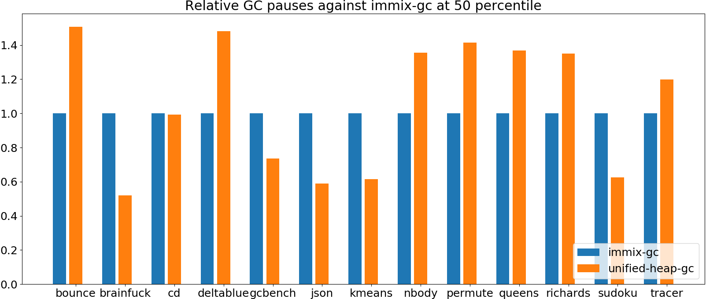

|name | immix-gc | unified-heap-gc | |
| -- | -- | -- | -- |
|[bounce.BounceBenchmark](#bouncebouncebenchmark)|0.0122|0.0184|+50.77%|
|[brainfuck.BrainfuckBenchmark](#brainfuckbrainfuckbenchmark)|0.0902|0.0470|__-47.96%__|
|[cd.CDBenchmark](#cdcdbenchmark)|0.0530|0.0526|__-0.73%__|
|[deltablue.DeltaBlueBenchmark](#deltabluedeltabluebenchmark)|0.0296|0.0438|+48.12%|
|[gcbench.GCBenchBenchmark](#gcbenchgcbenchbenchmark)|1.8454|1.3599|__-26.31%__|
|[json.JsonBenchmark](#jsonjsonbenchmark)|0.2525|0.1488|__-41.08%__|
|[kmeans.KmeansBenchmark](#kmeanskmeansbenchmark)|1.3949|0.8589|__-38.42%__|
|[nbody.NbodyBenchmark](#nbodynbodybenchmark)|0.0221|0.0300|+35.61%|
|[permute.PermuteBenchmark](#permutepermutebenchmark)|0.0120|0.0170|+41.44%|
|[queens.QueensBenchmark](#queensqueensbenchmark)|0.0126|0.0172|+36.88%|
|[richards.RichardsBenchmark](#richardsrichardsbenchmark)|0.0126|0.0170|+34.99%|
|[sudoku.SudokuBenchmark](#sudokusudokubenchmark)|0.2516|0.1575|__-37.38%__|
|[tracer.TracerBenchmark](#tracertracerbenchmark)|0.0156|0.0187|+19.84%|
| __Geometrical mean:__|| |__-1.51%__|
## GC pause time (ms) at 90 percentile 

|name | immix-gc | unified-heap-gc | |
| -- | -- | -- | -- |
|[bounce.BounceBenchmark](#bouncebouncebenchmark)|0.0154|0.0210|+35.88%|
|[brainfuck.BrainfuckBenchmark](#brainfuckbrainfuckbenchmark)|0.0944|0.0546|__-42.22%__|
|[cd.CDBenchmark](#cdcdbenchmark)|0.0743|0.0790|+6.33%|
|[deltablue.DeltaBlueBenchmark](#deltabluedeltabluebenchmark)|0.0306|0.0527|+72.06%|
|[gcbench.GCBenchBenchmark](#gcbenchgcbenchbenchmark)|2.6697|2.6288|__-1.53%__|
|[json.JsonBenchmark](#jsonjsonbenchmark)|0.4773|0.2968|__-37.82%__|
|[kmeans.KmeansBenchmark](#kmeanskmeansbenchmark)|1.4326|1.1897|__-16.96%__|
|[nbody.NbodyBenchmark](#nbodynbodybenchmark)|0.0277|0.0338|+22.00%|
|[permute.PermuteBenchmark](#permutepermutebenchmark)|0.0126|0.0176|+39.12%|
|[queens.QueensBenchmark](#queensqueensbenchmark)|0.0145|0.0190|+31.23%|
|[richards.RichardsBenchmark](#richardsrichardsbenchmark)|0.0154|0.0191|+23.89%|
|[sudoku.SudokuBenchmark](#sudokusudokubenchmark)|0.2586|0.1642|__-36.50%__|
|[tracer.TracerBenchmark](#tracertracerbenchmark)|0.0174|0.0198|+13.75%|
| __Geometrical mean:__|| |+2.93%|
## GC pause time (ms) at 99 percentile 

|name | immix-gc | unified-heap-gc | |
| -- | -- | -- | -- |
|[bounce.BounceBenchmark](#bouncebouncebenchmark)|0.0188|0.0220|+17.03%|
|[brainfuck.BrainfuckBenchmark](#brainfuckbrainfuckbenchmark)|0.1038|0.0588|__-43.36%__|
|[cd.CDBenchmark](#cdcdbenchmark)|0.0814|0.1088|+33.72%|
|[deltablue.DeltaBlueBenchmark](#deltabluedeltabluebenchmark)|0.0333|0.0659|+97.86%|
|[gcbench.GCBenchBenchmark](#gcbenchgcbenchbenchmark)|5.7243|5.3714|__-6.17%__|
|[json.JsonBenchmark](#jsonjsonbenchmark)|0.4888|0.3070|__-37.19%__|
|[kmeans.KmeansBenchmark](#kmeanskmeansbenchmark)|1.4559|1.3439|__-7.69%__|
|[nbody.NbodyBenchmark](#nbodynbodybenchmark)|0.0298|0.0346|+16.10%|
|[permute.PermuteBenchmark](#permutepermutebenchmark)|0.0145|0.0194|+34.25%|
|[queens.QueensBenchmark](#queensqueensbenchmark)|0.0188|0.0238|+27.03%|
|[richards.RichardsBenchmark](#richardsrichardsbenchmark)|0.0193|0.0228|+18.08%|
|[sudoku.SudokuBenchmark](#sudokusudokubenchmark)|0.2658|0.1729|__-34.96%__|
|[tracer.TracerBenchmark](#tracertracerbenchmark)|0.0192|0.0209|+8.88%|
| __Geometrical mean:__|| |+3.58%|
## GC pause time (ms) at 99.9 percentile 

|name | immix-gc | unified-heap-gc | |
| -- | -- | -- | -- |
|[bounce.BounceBenchmark](#bouncebouncebenchmark)|0.0268|0.0259|__-3.36%__|
|[brainfuck.BrainfuckBenchmark](#brainfuckbrainfuckbenchmark)|0.1076|0.0682|__-36.64%__|
|[cd.CDBenchmark](#cdcdbenchmark)|0.1109|0.1288|+16.10%|
|[deltablue.DeltaBlueBenchmark](#deltabluedeltabluebenchmark)|0.0462|0.0726|+57.15%|
|[gcbench.GCBenchBenchmark](#gcbenchgcbenchbenchmark)|5.7539|5.5123|__-4.20%__|
|[json.JsonBenchmark](#jsonjsonbenchmark)|0.5010|0.3161|__-36.89%__|
|[kmeans.KmeansBenchmark](#kmeanskmeansbenchmark)|1.6475|1.5055|__-8.62%__|
|[nbody.NbodyBenchmark](#nbodynbodybenchmark)|0.0302|0.0347|+15.08%|
|[permute.PermuteBenchmark](#permutepermutebenchmark)|0.0182|0.0229|+25.92%|
|[queens.QueensBenchmark](#queensqueensbenchmark)|0.0238|0.0285|+19.71%|
|[richards.RichardsBenchmark](#richardsrichardsbenchmark)|0.0231|0.0264|+14.55%|
|[sudoku.SudokuBenchmark](#sudokusudokubenchmark)|0.2870|0.1796|__-37.41%__|
|[tracer.TracerBenchmark](#tracertracerbenchmark)|0.0199|0.0227|+13.99%|
| __Geometrical mean:__|| |__-1.02%__|
# Individual benchmarks
## bounce.BounceBenchmark

## brainfuck.BrainfuckBenchmark

## cd.CDBenchmark

## deltablue.DeltaBlueBenchmark

## gcbench.GCBenchBenchmark
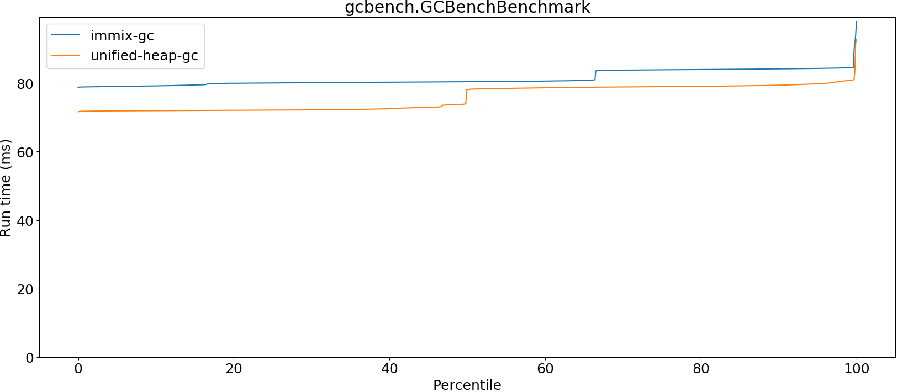

## json.JsonBenchmark

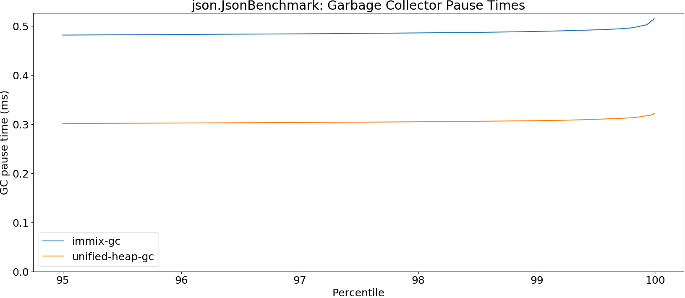

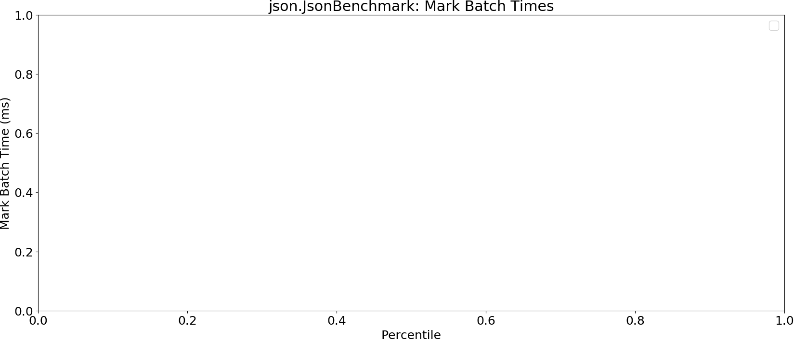

## kmeans.KmeansBenchmark

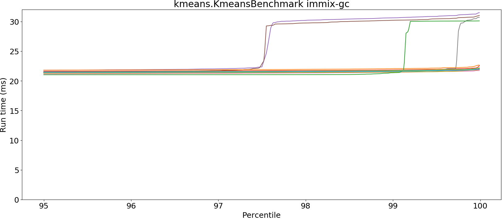

## nbody.NbodyBenchmark

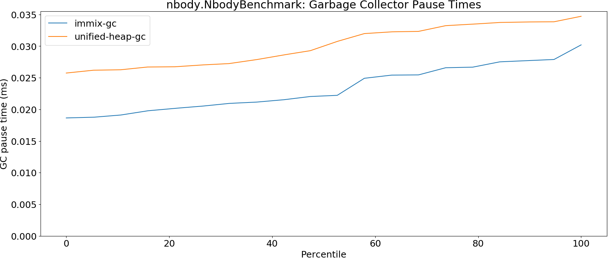

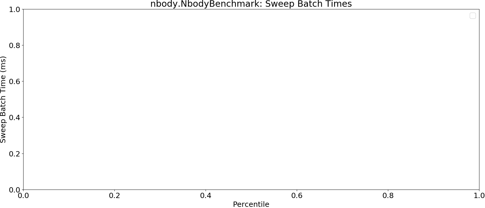

## permute.PermuteBenchmark

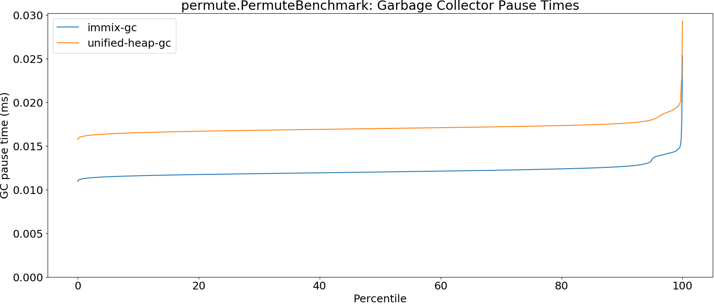

## queens.QueensBenchmark
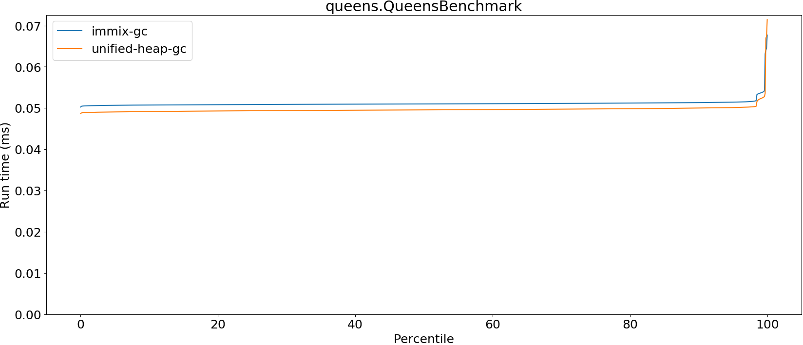

## richards.RichardsBenchmark

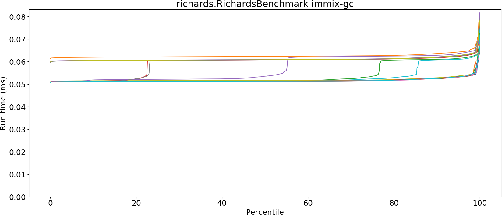

## sudoku.SudokuBenchmark

## tracer.TracerBenchmark

