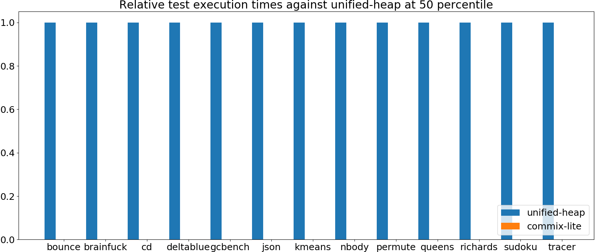

# Summary
## Benchmark run time (ms) at 50 percentile 

|name | unified-heap | commix-lite | |
| -- | -- | -- | -- |
|[bounce.BounceBenchmark](#bouncebouncebenchmark)|0.0149|0.0000|__-100.00%__|
|[brainfuck.BrainfuckBenchmark](#brainfuckbrainfuckbenchmark)|1.1106|0.0000|__-100.00%__|
|[cd.CDBenchmark](#cdcdbenchmark)|16.3921|0.0000|__-100.00%__|
|[deltablue.DeltaBlueBenchmark](#deltabluedeltabluebenchmark)|0.1272|0.0000|__-100.00%__|
|[gcbench.GCBenchBenchmark](#gcbenchgcbenchbenchmark)|76.7033|0.0000|__-100.00%__|
|[json.JsonBenchmark](#jsonjsonbenchmark)|0.7997|0.0000|__-100.00%__|
|[kmeans.KmeansBenchmark](#kmeanskmeansbenchmark)|19.8906|0.0000|__-100.00%__|
|[nbody.NbodyBenchmark](#nbodynbodybenchmark)|19.2773|0.0000|__-100.00%__|
|[permute.PermuteBenchmark](#permutepermutebenchmark)|0.1221|0.0000|__-100.00%__|
|[queens.QueensBenchmark](#queensqueensbenchmark)|0.0495|0.0000|__-100.00%__|
|[richards.RichardsBenchmark](#richardsrichardsbenchmark)|0.0507|0.0000|__-100.00%__|
|[sudoku.SudokuBenchmark](#sudokusudokubenchmark)|1.4222|0.0000|__-100.00%__|
|[tracer.TracerBenchmark](#tracertracerbenchmark)|0.4582|0.0000|__-100.00%__|
| __Geometrical mean:__|| | |
## Benchmark run time (ms) at 90 percentile 

|name | unified-heap | commix-lite | |
| -- | -- | -- | -- |
|[bounce.BounceBenchmark](#bouncebouncebenchmark)|0.0151|0.0000|__-100.00%__|
|[brainfuck.BrainfuckBenchmark](#brainfuckbrainfuckbenchmark)|1.1455|0.0000|__-100.00%__|
|[cd.CDBenchmark](#cdcdbenchmark)|16.5298|0.0000|__-100.00%__|
|[deltablue.DeltaBlueBenchmark](#deltabluedeltabluebenchmark)|0.1289|0.0000|__-100.00%__|
|[gcbench.GCBenchBenchmark](#gcbenchgcbenchbenchmark)|79.7645|0.0000|__-100.00%__|
|[json.JsonBenchmark](#jsonjsonbenchmark)|1.0629|0.0000|__-100.00%__|
|[kmeans.KmeansBenchmark](#kmeanskmeansbenchmark)|20.7372|0.0000|__-100.00%__|
|[nbody.NbodyBenchmark](#nbodynbodybenchmark)|19.2787|0.0000|__-100.00%__|
|[permute.PermuteBenchmark](#permutepermutebenchmark)|0.1391|0.0000|__-100.00%__|
|[queens.QueensBenchmark](#queensqueensbenchmark)|0.0499|0.0000|__-100.00%__|
|[richards.RichardsBenchmark](#richardsrichardsbenchmark)|0.0523|0.0000|__-100.00%__|
|[sudoku.SudokuBenchmark](#sudokusudokubenchmark)|1.5076|0.0000|__-100.00%__|
|[tracer.TracerBenchmark](#tracertracerbenchmark)|0.4628|0.0000|__-100.00%__|
| __Geometrical mean:__|| | |
## Benchmark run time (ms) at 99 percentile 

|name | unified-heap | commix-lite | |
| -- | -- | -- | -- |
|[bounce.BounceBenchmark](#bouncebouncebenchmark)|0.0154|0.0000|__-100.00%__|
|[brainfuck.BrainfuckBenchmark](#brainfuckbrainfuckbenchmark)|1.1606|0.0000|__-100.00%__|
|[cd.CDBenchmark](#cdcdbenchmark)|17.2592|0.0000|__-100.00%__|
|[deltablue.DeltaBlueBenchmark](#deltabluedeltabluebenchmark)|0.1781|0.0000|__-100.00%__|
|[gcbench.GCBenchBenchmark](#gcbenchgcbenchbenchmark)|80.9429|0.0000|__-100.00%__|
|[json.JsonBenchmark](#jsonjsonbenchmark)|1.1122|0.0000|__-100.00%__|
|[kmeans.KmeansBenchmark](#kmeanskmeansbenchmark)|21.1757|0.0000|__-100.00%__|
|[nbody.NbodyBenchmark](#nbodynbodybenchmark)|19.2981|0.0000|__-100.00%__|
|[permute.PermuteBenchmark](#permutepermutebenchmark)|0.1425|0.0000|__-100.00%__|
|[queens.QueensBenchmark](#queensqueensbenchmark)|0.0518|0.0000|__-100.00%__|
|[richards.RichardsBenchmark](#richardsrichardsbenchmark)|0.0544|0.0000|__-100.00%__|
|[sudoku.SudokuBenchmark](#sudokusudokubenchmark)|1.6518|0.0000|__-100.00%__|
|[tracer.TracerBenchmark](#tracertracerbenchmark)|0.4660|0.0000|__-100.00%__|
| __Geometrical mean:__|| | |
## Benchmark run time (ms) at 99.9 percentile 

|name | unified-heap | commix-lite | |
| -- | -- | -- | -- |
|[bounce.BounceBenchmark](#bouncebouncebenchmark)|0.0219|0.0000|__-100.00%__|
|[brainfuck.BrainfuckBenchmark](#brainfuckbrainfuckbenchmark)|1.1692|0.0000|__-100.00%__|
|[cd.CDBenchmark](#cdcdbenchmark)|20.2687|0.0000|__-100.00%__|
|[deltablue.DeltaBlueBenchmark](#deltabluedeltabluebenchmark)|0.1853|0.0000|__-100.00%__|
|[gcbench.GCBenchBenchmark](#gcbenchgcbenchbenchmark)|81.6768|0.0000|__-100.00%__|
|[json.JsonBenchmark](#jsonjsonbenchmark)|1.1241|0.0000|__-100.00%__|
|[kmeans.KmeansBenchmark](#kmeanskmeansbenchmark)|21.2800|0.0000|__-100.00%__|
|[nbody.NbodyBenchmark](#nbodynbodybenchmark)|28.5499|0.0000|__-100.00%__|
|[permute.PermuteBenchmark](#permutepermutebenchmark)|0.1450|0.0000|__-100.00%__|
|[queens.QueensBenchmark](#queensqueensbenchmark)|0.0680|0.0000|__-100.00%__|
|[richards.RichardsBenchmark](#richardsrichardsbenchmark)|0.0679|0.0000|__-100.00%__|
|[sudoku.SudokuBenchmark](#sudokusudokubenchmark)|1.6847|0.0000|__-100.00%__|
|[tracer.TracerBenchmark](#tracertracerbenchmark)|0.4686|0.0000|__-100.00%__|
| __Geometrical mean:__|| | |
## Benchmark total run time (ms) 

|name | unified-heap | commix-lite | |
| -- | -- | -- | -- |
|[bounce.BounceBenchmark](#bouncebouncebenchmark)|956.1604|0.0000|__-100.00%__|
|[brainfuck.BrainfuckBenchmark](#brainfuckbrainfuckbenchmark)|70695.1806|0.0000|__-100.00%__|
|[cd.CDBenchmark](#cdcdbenchmark)|1051934.9033|0.0000|__-100.00%__|
|[deltablue.DeltaBlueBenchmark](#deltabluedeltabluebenchmark)|8273.9066|0.0000|__-100.00%__|
|[gcbench.GCBenchBenchmark](#gcbenchgcbenchbenchmark)|4872374.3329|0.0000|__-100.00%__|
|[json.JsonBenchmark](#jsonjsonbenchmark)|55093.7061|0.0000|__-100.00%__|
|[kmeans.KmeansBenchmark](#kmeanskmeansbenchmark)|1279040.5890|0.0000|__-100.00%__|
|[nbody.NbodyBenchmark](#nbodynbodybenchmark)|1234671.7316|0.0000|__-100.00%__|
|[permute.PermuteBenchmark](#permutepermutebenchmark)|7948.7040|0.0000|__-100.00%__|
|[queens.QueensBenchmark](#queensqueensbenchmark)|3173.6736|0.0000|__-100.00%__|
|[richards.RichardsBenchmark](#richardsrichardsbenchmark)|3265.9818|0.0000|__-100.00%__|
|[sudoku.SudokuBenchmark](#sudokusudokubenchmark)|92653.3428|0.0000|__-100.00%__|
|[tracer.TracerBenchmark](#tracertracerbenchmark)|28894.1991|0.0000|__-100.00%__|
| __Geometrical mean:__|| | |
# Individual benchmarks
## bounce.BounceBenchmark

## brainfuck.BrainfuckBenchmark
