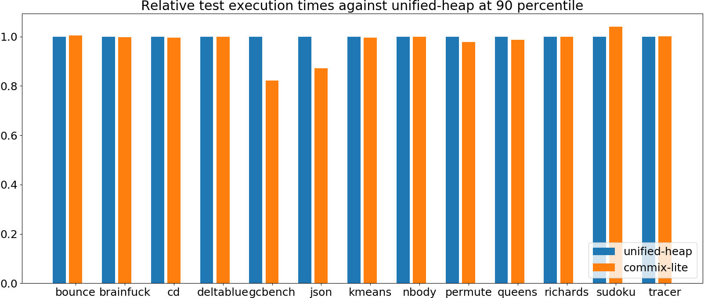
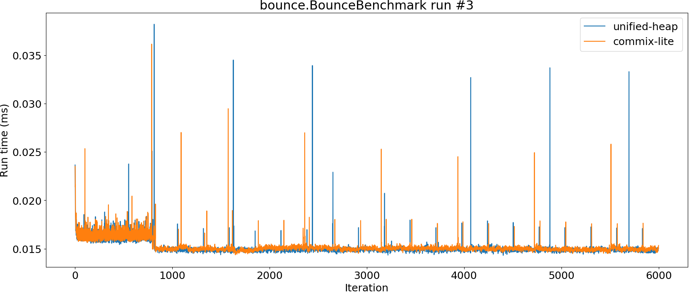
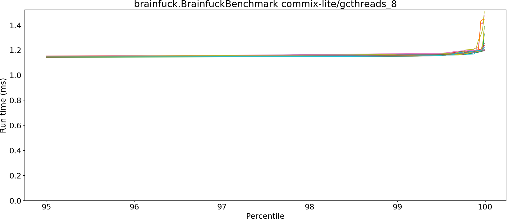
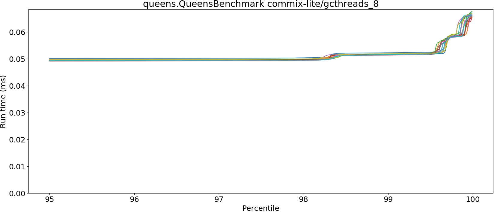
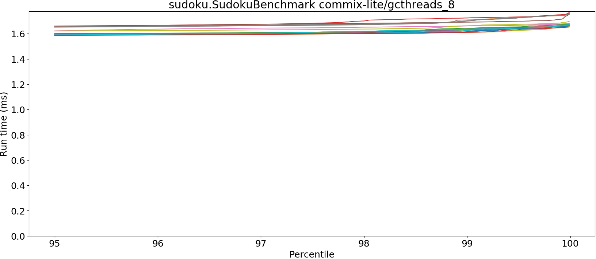

# Summary
## Benchmark run time (ms) at 50 percentile 

|name | unified-heap | commix-lite/gcthreads_8 | |
| -- | -- | -- | -- |
|[bounce.BounceBenchmark](#bouncebouncebenchmark)|0.0149|0.0150|+0.53%|
|[brainfuck.BrainfuckBenchmark](#brainfuckbrainfuckbenchmark)|1.1106|1.1031|__-0.67%__|
|[cd.CDBenchmark](#cdcdbenchmark)|16.3921|16.3150|__-0.47%__|
|[deltablue.DeltaBlueBenchmark](#deltabluedeltabluebenchmark)|0.1272|0.1266|__-0.46%__|
|[gcbench.GCBenchBenchmark](#gcbenchgcbenchbenchmark)|76.7033|63.8236|__-16.79%__|
|[json.JsonBenchmark](#jsonjsonbenchmark)|0.7997|0.8160|+2.04%|
|[kmeans.KmeansBenchmark](#kmeanskmeansbenchmark)|19.8906|19.6813|__-1.05%__|
|[nbody.NbodyBenchmark](#nbodynbodybenchmark)|19.2773|19.2773|__-0.00%__|
|[permute.PermuteBenchmark](#permutepermutebenchmark)|0.1221|0.1248|+2.15%|
|[queens.QueensBenchmark](#queensqueensbenchmark)|0.0495|0.0491|__-0.70%__|
|[richards.RichardsBenchmark](#richardsrichardsbenchmark)|0.0507|0.0508|+0.33%|
|[sudoku.SudokuBenchmark](#sudokusudokubenchmark)|1.4222|1.4642|+2.95%|
|[tracer.TracerBenchmark](#tracertracerbenchmark)|0.4582|0.4580|__-0.05%__|
| __Geometrical mean:__|| |__-1.06%__|
## Benchmark run time (ms) at 90 percentile 

|name | unified-heap | commix-lite/gcthreads_8 | |
| -- | -- | -- | -- |
|[bounce.BounceBenchmark](#bouncebouncebenchmark)|0.0151|0.0152|+0.54%|
|[brainfuck.BrainfuckBenchmark](#brainfuckbrainfuckbenchmark)|1.1455|1.1420|__-0.30%__|
|[cd.CDBenchmark](#cdcdbenchmark)|16.5298|16.4641|__-0.40%__|
|[deltablue.DeltaBlueBenchmark](#deltabluedeltabluebenchmark)|0.1289|0.1288|__-0.07%__|
|[gcbench.GCBenchBenchmark](#gcbenchgcbenchbenchmark)|79.7645|65.5549|__-17.81%__|
|[json.JsonBenchmark](#jsonjsonbenchmark)|1.0629|0.9261|__-12.87%__|
|[kmeans.KmeansBenchmark](#kmeanskmeansbenchmark)|20.7372|20.6648|__-0.35%__|
|[nbody.NbodyBenchmark](#nbodynbodybenchmark)|19.2787|19.2786|__-0.00%__|
|[permute.PermuteBenchmark](#permutepermutebenchmark)|0.1391|0.1361|__-2.16%__|
|[queens.QueensBenchmark](#queensqueensbenchmark)|0.0499|0.0493|__-1.21%__|
|[richards.RichardsBenchmark](#richardsrichardsbenchmark)|0.0523|0.0522|__-0.14%__|
|[sudoku.SudokuBenchmark](#sudokusudokubenchmark)|1.5076|1.5694|+4.10%|
|[tracer.TracerBenchmark](#tracertracerbenchmark)|0.4628|0.4632|+0.08%|
| __Geometrical mean:__|| |__-2.54%__|
## Benchmark run time (ms) at 99 percentile 

|name | unified-heap | commix-lite/gcthreads_8 | |
| -- | -- | -- | -- |
|[bounce.BounceBenchmark](#bouncebouncebenchmark)|0.0154|0.0155|+0.83%|
|[brainfuck.BrainfuckBenchmark](#brainfuckbrainfuckbenchmark)|1.1606|1.1570|__-0.31%__|
|[cd.CDBenchmark](#cdcdbenchmark)|17.2592|18.2952|+6.00%|
|[deltablue.DeltaBlueBenchmark](#deltabluedeltabluebenchmark)|0.1781|0.1793|+0.64%|
|[gcbench.GCBenchBenchmark](#gcbenchgcbenchbenchmark)|80.9429|66.4265|__-17.93%__|
|[json.JsonBenchmark](#jsonjsonbenchmark)|1.1122|1.1501|+3.40%|
|[kmeans.KmeansBenchmark](#kmeanskmeansbenchmark)|21.1757|21.0851|__-0.43%__|
|[nbody.NbodyBenchmark](#nbodynbodybenchmark)|19.2981|19.2814|__-0.09%__|
|[permute.PermuteBenchmark](#permutepermutebenchmark)|0.1425|0.1479|+3.78%|
|[queens.QueensBenchmark](#queensqueensbenchmark)|0.0518|0.0516|__-0.41%__|
|[richards.RichardsBenchmark](#richardsrichardsbenchmark)|0.0544|0.0542|__-0.27%__|
|[sudoku.SudokuBenchmark](#sudokusudokubenchmark)|1.6518|1.6454|__-0.39%__|
|[tracer.TracerBenchmark](#tracertracerbenchmark)|0.4660|0.4668|+0.17%|
| __Geometrical mean:__|| |__-0.55%__|
## Benchmark run time (ms) at 99.9 percentile 

|name | unified-heap | commix-lite/gcthreads_8 | |
| -- | -- | -- | -- |
|[bounce.BounceBenchmark](#bouncebouncebenchmark)|0.0219|0.0246|+12.46%|
|[brainfuck.BrainfuckBenchmark](#brainfuckbrainfuckbenchmark)|1.1692|1.1912|+1.88%|
|[cd.CDBenchmark](#cdcdbenchmark)|20.2687|19.4420|__-4.08%__|
|[deltablue.DeltaBlueBenchmark](#deltabluedeltabluebenchmark)|0.1853|0.1886|+1.82%|
|[gcbench.GCBenchBenchmark](#gcbenchgcbenchbenchmark)|81.6768|75.1851|__-7.95%__|
|[json.JsonBenchmark](#jsonjsonbenchmark)|1.1241|1.1714|+4.20%|
|[kmeans.KmeansBenchmark](#kmeanskmeansbenchmark)|21.2800|28.6963|+34.85%|
|[nbody.NbodyBenchmark](#nbodynbodybenchmark)|28.5499|19.2884|__-32.44%__|
|[permute.PermuteBenchmark](#permutepermutebenchmark)|0.1450|0.1506|+3.89%|
|[queens.QueensBenchmark](#queensqueensbenchmark)|0.0680|0.0639|__-6.03%__|
|[richards.RichardsBenchmark](#richardsrichardsbenchmark)|0.0679|0.0612|__-9.90%__|
|[sudoku.SudokuBenchmark](#sudokusudokubenchmark)|1.6847|1.6870|+0.13%|
|[tracer.TracerBenchmark](#tracertracerbenchmark)|0.4686|0.4705|+0.41%|
| __Geometrical mean:__|| |__-1.11%__|
## Benchmark total run time (ms) 

|name | unified-heap | commix-lite/gcthreads_8 | |
| -- | -- | -- | -- |
|[bounce.BounceBenchmark](#bouncebouncebenchmark)|956.1604|960.9325|+0.50%|
|[brainfuck.BrainfuckBenchmark](#brainfuckbrainfuckbenchmark)|70695.1806|70856.7718|+0.23%|
|[cd.CDBenchmark](#cdcdbenchmark)|1051934.9033|1049767.6964|__-0.21%__|
|[deltablue.DeltaBlueBenchmark](#deltabluedeltabluebenchmark)|8273.9066|8238.3563|__-0.43%__|
|[gcbench.GCBenchBenchmark](#gcbenchgcbenchbenchmark)|4872374.3329|4116540.3907|__-15.51%__|
|[json.JsonBenchmark](#jsonjsonbenchmark)|55093.7061|53905.4553|__-2.16%__|
|[kmeans.KmeansBenchmark](#kmeanskmeansbenchmark)|1279040.5890|1278602.0905|__-0.03%__|
|[nbody.NbodyBenchmark](#nbodynbodybenchmark)|1234671.7316|1230505.9653|__-0.34%__|
|[permute.PermuteBenchmark](#permutepermutebenchmark)|7948.7040|8130.8808|+2.29%|
|[queens.QueensBenchmark](#queensqueensbenchmark)|3173.6736|3148.3356|__-0.80%__|
|[richards.RichardsBenchmark](#richardsrichardsbenchmark)|3265.9818|3273.9625|+0.24%|
|[sudoku.SudokuBenchmark](#sudokusudokubenchmark)|92653.3428|95258.4653|+2.81%|
|[tracer.TracerBenchmark](#tracertracerbenchmark)|28894.1991|28934.0523|+0.14%|
| __Geometrical mean:__|| |__-1.12%__|
# Individual benchmarks
## bounce.BounceBenchmark

## brainfuck.BrainfuckBenchmark

## cd.CDBenchmark

## deltablue.DeltaBlueBenchmark

## gcbench.GCBenchBenchmark

## json.JsonBenchmark

## kmeans.KmeansBenchmark

## nbody.NbodyBenchmark

## permute.PermuteBenchmark

## queens.QueensBenchmark

## richards.RichardsBenchmark

## sudoku.SudokuBenchmark

## tracer.TracerBenchmark

