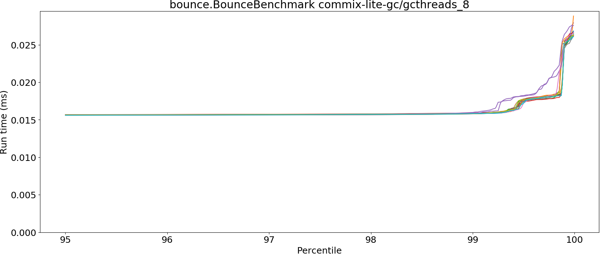
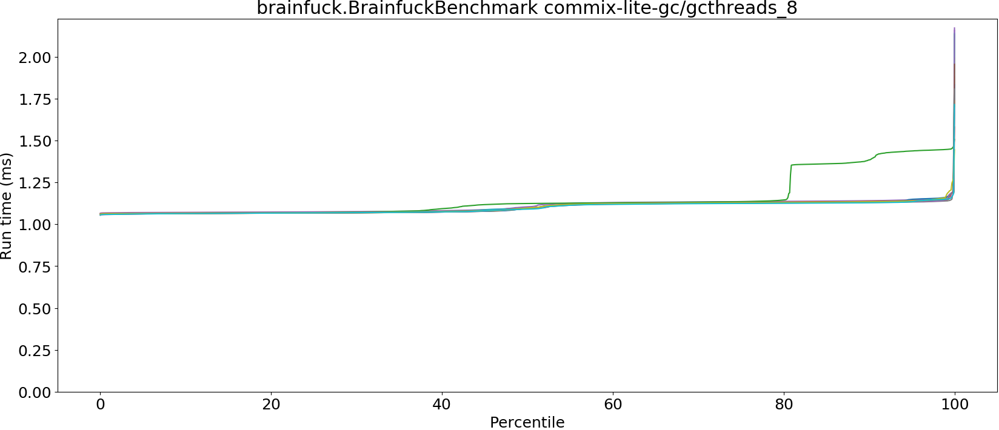
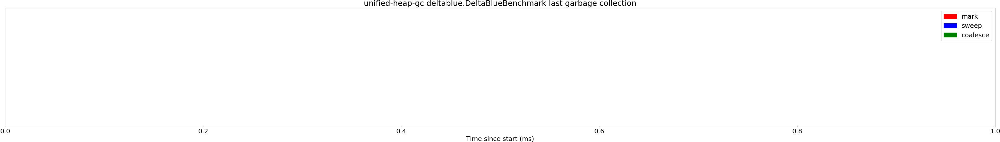
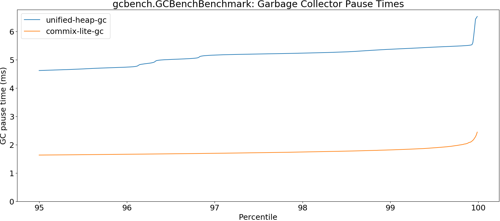
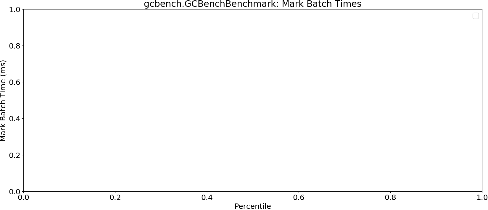
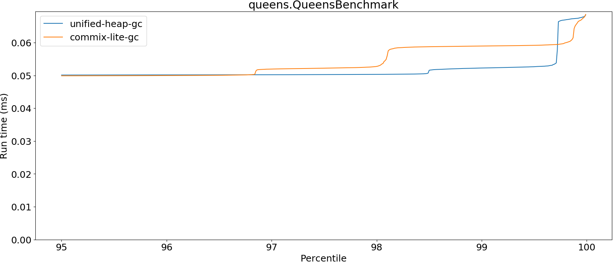
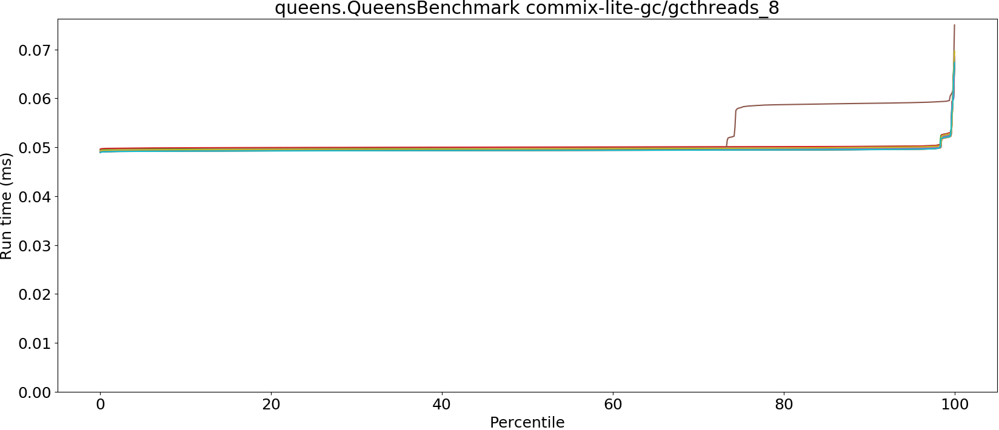
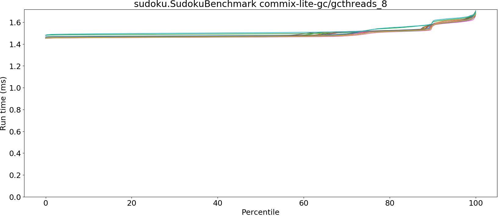
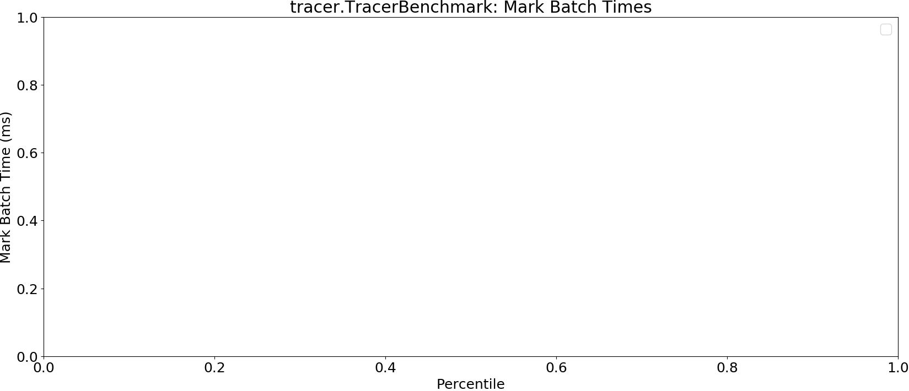

# Summary
## Benchmark run time (ms) at 50 percentile 

|name | unified-heap-gc | commix-lite-gc/gcthreads_8 | |
| -- | -- | -- | -- |
|[bounce.BounceBenchmark](#bouncebouncebenchmark)|0.0149|0.0154|+3.13%|
|[brainfuck.BrainfuckBenchmark](#brainfuckbrainfuckbenchmark)|1.0780|1.0949|+1.57%|
|[cd.CDBenchmark](#cdcdbenchmark)|16.6684|16.3735|__-1.77%__|
|[deltablue.DeltaBlueBenchmark](#deltabluedeltabluebenchmark)|0.1271|0.1291|+1.60%|
|[gcbench.GCBenchBenchmark](#gcbenchgcbenchbenchmark)|78.0794|64.3078|__-17.64%__|
|[json.JsonBenchmark](#jsonjsonbenchmark)|0.8030|0.8120|+1.13%|
|[kmeans.KmeansBenchmark](#kmeanskmeansbenchmark)|19.7820|19.4973|__-1.44%__|
|[nbody.NbodyBenchmark](#nbodynbodybenchmark)|19.2772|19.2772|+0.00%|
|[permute.PermuteBenchmark](#permutepermutebenchmark)|0.1219|0.1249|+2.45%|
|[queens.QueensBenchmark](#queensqueensbenchmark)|0.0495|0.0495|__-0.16%__|
|[richards.RichardsBenchmark](#richardsrichardsbenchmark)|0.0507|0.0511|+0.81%|
|[sudoku.SudokuBenchmark](#sudokusudokubenchmark)|1.4224|1.4687|+3.25%|
|[tracer.TracerBenchmark](#tracertracerbenchmark)|0.4577|0.4531|__-1.02%__|
| __Geometrical mean:__|| |__-0.77%__|
## Benchmark run time (ms) at 90 percentile 

|name | unified-heap-gc | commix-lite-gc/gcthreads_8 | |
| -- | -- | -- | -- |
|[bounce.BounceBenchmark](#bouncebouncebenchmark)|0.0151|0.0156|+2.89%|
|[brainfuck.BrainfuckBenchmark](#brainfuckbrainfuckbenchmark)|1.1263|1.1335|+0.64%|
|[cd.CDBenchmark](#cdcdbenchmark)|19.7081|16.5176|__-16.19%__|
|[deltablue.DeltaBlueBenchmark](#deltabluedeltabluebenchmark)|0.1287|0.1314|+2.12%|
|[gcbench.GCBenchBenchmark](#gcbenchgcbenchbenchmark)|79.1501|66.6501|__-15.79%__|
|[json.JsonBenchmark](#jsonjsonbenchmark)|1.0600|0.9210|__-13.11%__|
|[kmeans.KmeansBenchmark](#kmeanskmeansbenchmark)|20.7229|20.5575|__-0.80%__|
|[nbody.NbodyBenchmark](#nbodynbodybenchmark)|19.2785|19.2785|__-0.00%__|
|[permute.PermuteBenchmark](#permutepermutebenchmark)|0.1377|0.1362|__-1.10%__|
|[queens.QueensBenchmark](#queensqueensbenchmark)|0.0500|0.0498|__-0.51%__|
|[richards.RichardsBenchmark](#richardsrichardsbenchmark)|0.0521|0.0530|+1.79%|
|[sudoku.SudokuBenchmark](#sudokusudokubenchmark)|1.5057|1.5736|+4.51%|
|[tracer.TracerBenchmark](#tracertracerbenchmark)|0.4622|0.4583|__-0.84%__|
| __Geometrical mean:__|| |__-3.06%__|
## Benchmark run time (ms) at 99 percentile 

|name | unified-heap-gc | commix-lite-gc/gcthreads_8 | |
| -- | -- | -- | -- |
|[bounce.BounceBenchmark](#bouncebouncebenchmark)|0.0154|0.0158|+2.75%|
|[brainfuck.BrainfuckBenchmark](#brainfuckbrainfuckbenchmark)|1.1474|1.1504|+0.26%|
|[cd.CDBenchmark](#cdcdbenchmark)|19.9139|18.1119|__-9.05%__|
|[deltablue.DeltaBlueBenchmark](#deltabluedeltabluebenchmark)|0.1780|0.1795|+0.86%|
|[gcbench.GCBenchBenchmark](#gcbenchgcbenchbenchmark)|80.6830|75.6292|__-6.26%__|
|[json.JsonBenchmark](#jsonjsonbenchmark)|1.1027|1.1437|+3.72%|
|[kmeans.KmeansBenchmark](#kmeanskmeansbenchmark)|21.1962|20.9485|__-1.17%__|
|[nbody.NbodyBenchmark](#nbodynbodybenchmark)|19.2806|19.2804|__-0.00%__|
|[permute.PermuteBenchmark](#permutepermutebenchmark)|0.1408|0.1483|+5.35%|
|[queens.QueensBenchmark](#queensqueensbenchmark)|0.0523|0.0522|__-0.13%__|
|[richards.RichardsBenchmark](#richardsrichardsbenchmark)|0.0541|0.0612|+13.31%|
|[sudoku.SudokuBenchmark](#sudokusudokubenchmark)|1.6572|1.6388|__-1.11%__|
|[tracer.TracerBenchmark](#tracertracerbenchmark)|0.4659|0.4623|__-0.76%__|
| __Geometrical mean:__|| |+0.47%|
## Benchmark run time (ms) at 99.9 percentile 

|name | unified-heap-gc | commix-lite-gc/gcthreads_8 | |
| -- | -- | -- | -- |
|[bounce.BounceBenchmark](#bouncebouncebenchmark)|0.0327|0.0252|__-23.05%__|
|[brainfuck.BrainfuckBenchmark](#brainfuckbrainfuckbenchmark)|1.1597|1.1952|+3.06%|
|[cd.CDBenchmark](#cdcdbenchmark)|20.0470|20.2789|+1.16%|
|[deltablue.DeltaBlueBenchmark](#deltabluedeltabluebenchmark)|0.1887|0.1907|+1.07%|
|[gcbench.GCBenchBenchmark](#gcbenchgcbenchbenchmark)|83.9909|76.3479|__-9.10%__|
|[json.JsonBenchmark](#jsonjsonbenchmark)|1.1181|1.1672|+4.39%|
|[kmeans.KmeansBenchmark](#kmeanskmeansbenchmark)|21.9093|21.4429|__-2.13%__|
|[nbody.NbodyBenchmark](#nbodynbodybenchmark)|19.2894|19.2891|__-0.00%__|
|[permute.PermuteBenchmark](#permutepermutebenchmark)|0.1502|0.1511|+0.61%|
|[queens.QueensBenchmark](#queensqueensbenchmark)|0.0674|0.0651|__-3.33%__|
|[richards.RichardsBenchmark](#richardsrichardsbenchmark)|0.0681|0.0636|__-6.61%__|
|[sudoku.SudokuBenchmark](#sudokusudokubenchmark)|1.6814|1.6714|__-0.60%__|
|[tracer.TracerBenchmark](#tracertracerbenchmark)|0.4752|0.4665|__-1.82%__|
| __Geometrical mean:__|| |__-3.06%__|
## Benchmark total run time (ms) 

|name | unified-heap-gc | commix-lite-gc/gcthreads_8 | |
| -- | -- | -- | -- |
|[bounce.BounceBenchmark](#bouncebouncebenchmark)|956.3934|985.3933|+3.03%|
|[brainfuck.BrainfuckBenchmark](#brainfuckbrainfuckbenchmark)|69961.5126|70377.5552|+0.59%|
|[cd.CDBenchmark](#cdcdbenchmark)|1094244.2977|1053774.1998|__-3.70%__|
|[deltablue.DeltaBlueBenchmark](#deltabluedeltabluebenchmark)|8264.4925|8394.7652|+1.58%|
|[gcbench.GCBenchBenchmark](#gcbenchgcbenchbenchmark)|4843811.8679|4204966.6196|__-13.19%__|
|[json.JsonBenchmark](#jsonjsonbenchmark)|55166.7470|53518.2265|__-2.99%__|
|[kmeans.KmeansBenchmark](#kmeanskmeansbenchmark)|1274715.6460|1261405.9367|__-1.04%__|
|[nbody.NbodyBenchmark](#nbodynbodybenchmark)|1232485.8886|1229429.6011|__-0.25%__|
|[permute.PermuteBenchmark](#permutepermutebenchmark)|7932.1800|8143.6719|+2.67%|
|[queens.QueensBenchmark](#queensqueensbenchmark)|3176.4700|3180.9923|+0.14%|
|[richards.RichardsBenchmark](#richardsrichardsbenchmark)|3265.7877|3313.8521|+1.47%|
|[sudoku.SudokuBenchmark](#sudokusudokubenchmark)|92708.4024|95453.1704|+2.96%|
|[tracer.TracerBenchmark](#tracertracerbenchmark)|28879.0138|28627.3517|__-0.87%__|
| __Geometrical mean:__|| |__-0.83%__|
## Total GC time on Application thread (ms) 

|name |  | unified-heap-gc | commix-lite-gc/gcthreads_8 | |
| -- | -- | -- | -- | -- |
|[bounce.BounceBenchmark](#bouncebouncebenchmark)|mark|1.0446|1.6883|+61.62%|
||sweep|1.5579|0.0000|__-100.00%__|
||total|2.6026|1.6883|__-35.13%__|
|[brainfuck.BrainfuckBenchmark](#brainfuckbrainfuckbenchmark)|mark|1807.7365|2428.5319|+34.34%|
||sweep|771.1522|29.4575|__-96.18%__|
||total|2578.8888|2457.9894|__-4.69%__|
|[cd.CDBenchmark](#cdcdbenchmark)|mark|66242.8257|19393.1589|__-70.72%__|
||sweep|25442.2017|4.2867|__-99.98%__|
||total|91685.0274|19397.4456|__-78.84%__|
|[deltablue.DeltaBlueBenchmark](#deltabluedeltabluebenchmark)|mark|164.1784|204.9703|+24.85%|
||sweep|64.7043|0.0127|__-99.98%__|
||total|228.8827|204.9830|__-10.44%__|
|[gcbench.GCBenchBenchmark](#gcbenchgcbenchbenchmark)|mark|1523758.6669|192564.6498|__-87.36%__|
||sweep|197572.0328|0.0000|__-100.00%__|
||total|1721330.6997|192564.6498|__-88.81%__|
|[json.JsonBenchmark](#jsonjsonbenchmark)|mark|3833.2398|1414.0055|__-63.11%__|
||sweep|2834.1319|0.1080|__-100.00%__|
||total|6667.3718|1414.1135|__-78.79%__|
|[kmeans.KmeansBenchmark](#kmeanskmeansbenchmark)|mark|36576.4571|24587.3675|__-32.78%__|
||sweep|5179.6461|26.2598|__-99.49%__|
||total|41756.1033|24613.6273|__-41.05%__|
|[nbody.NbodyBenchmark](#nbodynbodybenchmark)|mark|0.3618|0.4828|+33.44%|
||sweep|0.2400|0.0000|__-100.00%__|
||total|0.6017|0.4828|__-19.77%__|
|[permute.PermuteBenchmark](#permutepermutebenchmark)|mark|70.8461|100.9970|+42.56%|
||sweep|134.1709|10.0988|__-92.47%__|
||total|205.0170|111.0958|__-45.81%__|
|[queens.QueensBenchmark](#queensqueensbenchmark)|mark|2.3209|3.4708|+49.55%|
||sweep|3.7279|0.0000|__-100.00%__|
||total|6.0488|3.4708|__-42.62%__|
|[richards.RichardsBenchmark](#richardsrichardsbenchmark)|mark|2.4710|3.7759|+52.81%|
||sweep|4.4749|0.0000|__-100.00%__|
||total|6.9459|3.7759|__-45.64%__|
|[sudoku.SudokuBenchmark](#sudokusudokubenchmark)|mark|1075.2346|1282.2122|+19.25%|
||sweep|813.3070|0.0000|__-100.00%__|
||total|1888.5416|1282.2122|__-32.11%__|
|[tracer.TracerBenchmark](#tracertracerbenchmark)|mark|457.9741|690.2644|+50.72%|
||sweep|715.0030|42.8547|__-94.01%__|
||total|1172.9771|733.1192|__-37.50%__|
|__Geometrical mean:__|mark|| |__-11.84%__|
||sweep|| |__-99.73%__|
||total|| |__-50.98%__|
## GC pause time (ms) at 50 percentile 

|name | unified-heap-gc | commix-lite-gc/gcthreads_8 | |
| -- | -- | -- | -- |
|[bounce.BounceBenchmark](#bouncebouncebenchmark)|0.0184|0.0097|__-47.12%__|
|[brainfuck.BrainfuckBenchmark](#brainfuckbrainfuckbenchmark)|0.0470|0.0412|__-12.33%__|
|[cd.CDBenchmark](#cdcdbenchmark)|0.0526|0.0372|__-29.31%__|
|[deltablue.DeltaBlueBenchmark](#deltabluedeltabluebenchmark)|0.0438|0.0366|__-16.47%__|
|[gcbench.GCBenchBenchmark](#gcbenchgcbenchbenchmark)|1.3599|1.1613|__-14.61%__|
|[json.JsonBenchmark](#jsonjsonbenchmark)|0.1488|0.1124|__-24.43%__|
|[kmeans.KmeansBenchmark](#kmeanskmeansbenchmark)|0.8589|0.5353|__-37.68%__|
|[nbody.NbodyBenchmark](#nbodynbodybenchmark)|0.0300|0.0248|__-17.23%__|
|[permute.PermuteBenchmark](#permutepermutebenchmark)|0.0170|0.0081|__-52.29%__|
|[queens.QueensBenchmark](#queensqueensbenchmark)|0.0172|0.0088|__-49.20%__|
|[richards.RichardsBenchmark](#richardsrichardsbenchmark)|0.0170|0.0088|__-48.15%__|
|[sudoku.SudokuBenchmark](#sudokusudokubenchmark)|0.1575|0.1068|__-32.18%__|
|[tracer.TracerBenchmark](#tracertracerbenchmark)|0.0187|0.0106|__-43.09%__|
| __Geometrical mean:__|| |__-34.10%__|
## GC pause time (ms) at 90 percentile 

|name | unified-heap-gc | commix-lite-gc/gcthreads_8 | |
| -- | -- | -- | -- |
|[bounce.BounceBenchmark](#bouncebouncebenchmark)|0.0210|0.0159|__-24.35%__|
|[brainfuck.BrainfuckBenchmark](#brainfuckbrainfuckbenchmark)|0.0546|0.0458|__-16.07%__|
|[cd.CDBenchmark](#cdcdbenchmark)|0.0790|0.0835|+5.64%|
|[deltablue.DeltaBlueBenchmark](#deltabluedeltabluebenchmark)|0.0527|0.0505|__-4.27%__|
|[gcbench.GCBenchBenchmark](#gcbenchgcbenchbenchmark)|2.6288|1.5374|__-41.52%__|
|[json.JsonBenchmark](#jsonjsonbenchmark)|0.2968|0.2319|__-21.86%__|
|[kmeans.KmeansBenchmark](#kmeanskmeansbenchmark)|1.1897|0.7411|__-37.71%__|
|[nbody.NbodyBenchmark](#nbodynbodybenchmark)|0.0338|0.0267|__-20.95%__|
|[permute.PermuteBenchmark](#permutepermutebenchmark)|0.0176|0.0087|__-50.42%__|
|[queens.QueensBenchmark](#queensqueensbenchmark)|0.0190|0.0118|__-38.11%__|
|[richards.RichardsBenchmark](#richardsrichardsbenchmark)|0.0191|0.0115|__-39.84%__|
|[sudoku.SudokuBenchmark](#sudokusudokubenchmark)|0.1642|0.1158|__-29.47%__|
|[tracer.TracerBenchmark](#tracertracerbenchmark)|0.0198|0.0120|__-39.66%__|
| __Geometrical mean:__|| |__-29.14%__|
## GC pause time (ms) at 99 percentile 

|name | unified-heap-gc | commix-lite-gc/gcthreads_8 | |
| -- | -- | -- | -- |
|[bounce.BounceBenchmark](#bouncebouncebenchmark)|0.0220|0.0183|__-17.01%__|
|[brainfuck.BrainfuckBenchmark](#brainfuckbrainfuckbenchmark)|0.0588|0.0611|+3.96%|
|[cd.CDBenchmark](#cdcdbenchmark)|0.1088|0.1188|+9.22%|
|[deltablue.DeltaBlueBenchmark](#deltabluedeltabluebenchmark)|0.0659|0.0603|__-8.52%__|
|[gcbench.GCBenchBenchmark](#gcbenchgcbenchbenchmark)|5.3714|1.8158|__-66.19%__|
|[json.JsonBenchmark](#jsonjsonbenchmark)|0.3070|0.2496|__-18.69%__|
|[kmeans.KmeansBenchmark](#kmeanskmeansbenchmark)|1.3439|0.7760|__-42.26%__|
|[nbody.NbodyBenchmark](#nbodynbodybenchmark)|0.0346|0.0286|__-17.31%__|
|[permute.PermuteBenchmark](#permutepermutebenchmark)|0.0194|0.0101|__-47.76%__|
|[queens.QueensBenchmark](#queensqueensbenchmark)|0.0238|0.0196|__-17.92%__|
|[richards.RichardsBenchmark](#richardsrichardsbenchmark)|0.0228|0.0187|__-17.68%__|
|[sudoku.SudokuBenchmark](#sudokusudokubenchmark)|0.1729|0.1224|__-29.20%__|
|[tracer.TracerBenchmark](#tracertracerbenchmark)|0.0209|0.0135|__-35.43%__|
| __Geometrical mean:__|| |__-26.50%__|
## GC pause time (ms) at 99.9 percentile 

|name | unified-heap-gc | commix-lite-gc/gcthreads_8 | |
| -- | -- | -- | -- |
|[bounce.BounceBenchmark](#bouncebouncebenchmark)|0.0259|0.0202|__-22.09%__|
|[brainfuck.BrainfuckBenchmark](#brainfuckbrainfuckbenchmark)|0.0682|0.0857|+25.68%|
|[cd.CDBenchmark](#cdcdbenchmark)|0.1288|0.1549|+20.26%|
|[deltablue.DeltaBlueBenchmark](#deltabluedeltabluebenchmark)|0.0726|0.0662|__-8.81%__|
|[gcbench.GCBenchBenchmark](#gcbenchgcbenchbenchmark)|5.5123|2.0817|__-62.24%__|
|[json.JsonBenchmark](#jsonjsonbenchmark)|0.3161|0.2606|__-17.57%__|
|[kmeans.KmeansBenchmark](#kmeanskmeansbenchmark)|1.5055|0.8145|__-45.90%__|
|[nbody.NbodyBenchmark](#nbodynbodybenchmark)|0.0347|0.0288|__-16.95%__|
|[permute.PermuteBenchmark](#permutepermutebenchmark)|0.0229|0.0199|__-13.29%__|
|[queens.QueensBenchmark](#queensqueensbenchmark)|0.0285|0.0237|__-16.67%__|
|[richards.RichardsBenchmark](#richardsrichardsbenchmark)|0.0264|0.0227|__-14.15%__|
|[sudoku.SudokuBenchmark](#sudokusudokubenchmark)|0.1796|0.1313|__-26.90%__|
|[tracer.TracerBenchmark](#tracertracerbenchmark)|0.0227|0.0153|__-32.66%__|
| __Geometrical mean:__|| |__-21.11%__|
# Individual benchmarks
## bounce.BounceBenchmark

## brainfuck.BrainfuckBenchmark

## cd.CDBenchmark

## deltablue.DeltaBlueBenchmark

## gcbench.GCBenchBenchmark

## json.JsonBenchmark

## kmeans.KmeansBenchmark

## nbody.NbodyBenchmark

## permute.PermuteBenchmark

## queens.QueensBenchmark

## richards.RichardsBenchmark

## sudoku.SudokuBenchmark

## tracer.TracerBenchmark

