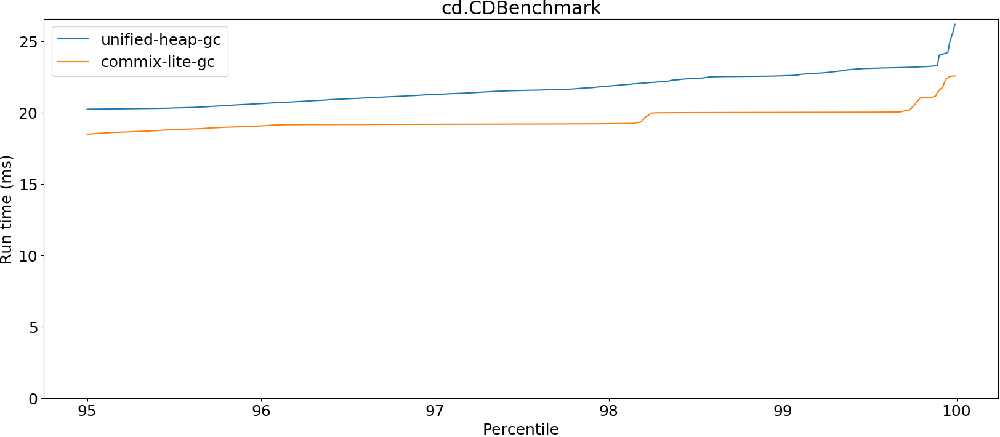
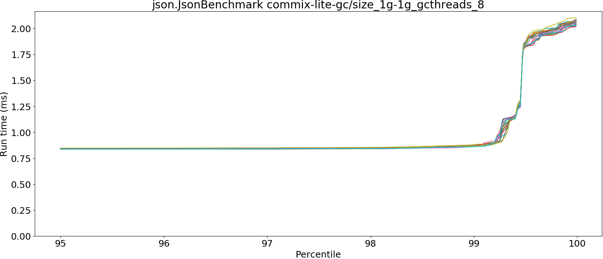
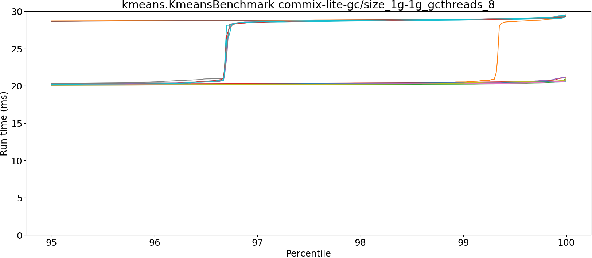
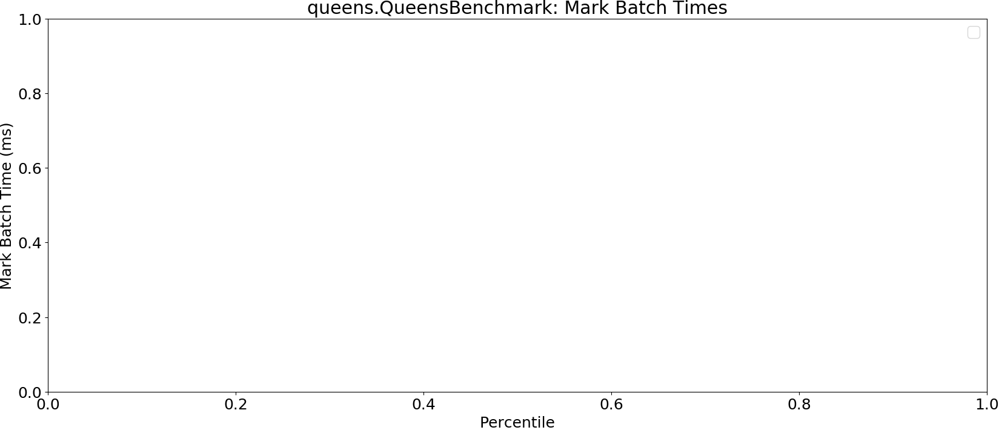
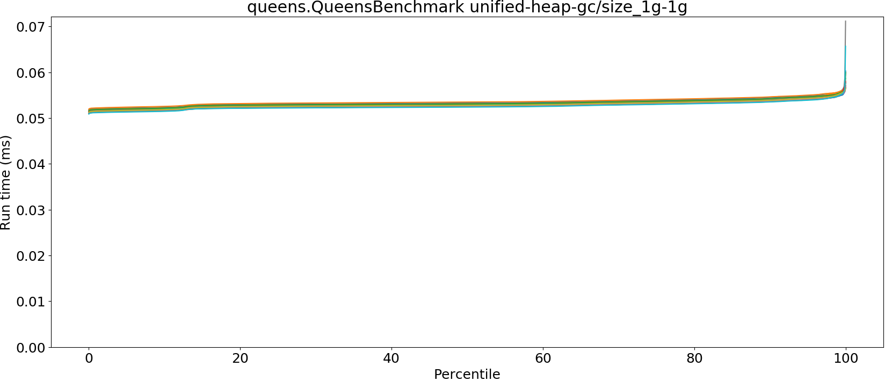
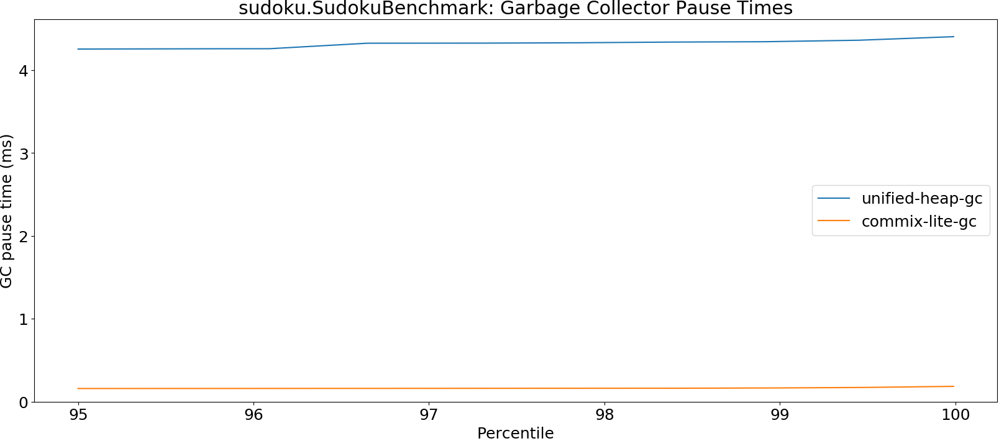
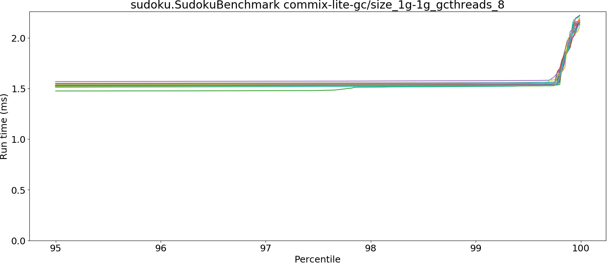
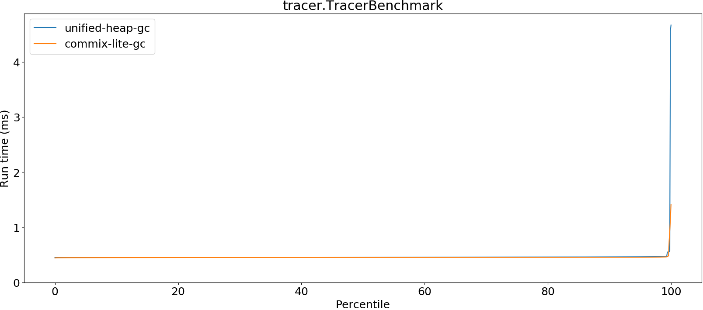

# Summary
## Benchmark run time (ms) at 50 percentile 

|name | unified-heap-gc/size_1g-1g | commix-lite-gc/size_1g-1g_gcthreads_8 | |
| -- | -- | -- | -- |
|[bounce.BounceBenchmark](#bouncebouncebenchmark)|0.0160|0.0165|+3.00%|
|[brainfuck.BrainfuckBenchmark](#brainfuckbrainfuckbenchmark)|1.0804|1.0816|+0.11%|
|[cd.CDBenchmark](#cdcdbenchmark)|17.3922|16.2475|__-6.58%__|
|[deltablue.DeltaBlueBenchmark](#deltabluedeltabluebenchmark)|0.1757|0.1770|+0.74%|
|[gcbench.GCBenchBenchmark](#gcbenchgcbenchbenchmark)|63.2005|63.5452|+0.55%|
|[json.JsonBenchmark](#jsonjsonbenchmark)|0.8248|0.8272|+0.29%|
|[kmeans.KmeansBenchmark](#kmeanskmeansbenchmark)|19.8850|19.7459|__-0.70%__|
|[nbody.NbodyBenchmark](#nbodynbodybenchmark)|19.2773|19.2773|+0.00%|
|[permute.PermuteBenchmark](#permutepermutebenchmark)|0.1228|0.1258|+2.41%|
|[queens.QueensBenchmark](#queensqueensbenchmark)|0.0528|0.0526|__-0.24%__|
|[richards.RichardsBenchmark](#richardsrichardsbenchmark)|0.0539|0.0543|+0.83%|
|[sudoku.SudokuBenchmark](#sudokusudokubenchmark)|1.4241|1.4696|+3.20%|
|[tracer.TracerBenchmark](#tracertracerbenchmark)|0.4578|0.4518|__-1.30%__|
| __Geometrical mean:__|| |+0.15%|
## Benchmark run time (ms) at 90 percentile 

|name | unified-heap-gc/size_1g-1g | commix-lite-gc/size_1g-1g_gcthreads_8 | |
| -- | -- | -- | -- |
|[bounce.BounceBenchmark](#bouncebouncebenchmark)|0.0171|0.0176|+2.96%|
|[brainfuck.BrainfuckBenchmark](#brainfuckbrainfuckbenchmark)|1.0889|1.0881|__-0.08%__|
|[cd.CDBenchmark](#cdcdbenchmark)|19.1522|17.2975|__-9.68%__|
|[deltablue.DeltaBlueBenchmark](#deltabluedeltabluebenchmark)|0.1775|0.1789|+0.79%|
|[gcbench.GCBenchBenchmark](#gcbenchgcbenchbenchmark)|68.4180|65.4486|__-4.34%__|
|[json.JsonBenchmark](#jsonjsonbenchmark)|0.8321|0.8348|+0.33%|
|[kmeans.KmeansBenchmark](#kmeanskmeansbenchmark)|20.1808|20.0401|__-0.70%__|
|[nbody.NbodyBenchmark](#nbodynbodybenchmark)|19.2785|19.2786|+0.00%|
|[permute.PermuteBenchmark](#permutepermutebenchmark)|0.2262|0.2276|+0.63%|
|[queens.QueensBenchmark](#queensqueensbenchmark)|0.0539|0.0537|__-0.24%__|
|[richards.RichardsBenchmark](#richardsrichardsbenchmark)|0.0556|0.0557|+0.32%|
|[sudoku.SudokuBenchmark](#sudokusudokubenchmark)|1.4759|1.5186|+2.89%|
|[tracer.TracerBenchmark](#tracertracerbenchmark)|0.4618|0.4560|__-1.27%__|
| __Geometrical mean:__|| |__-0.70%__|
## Benchmark run time (ms) at 99 percentile 

|name | unified-heap-gc/size_1g-1g | commix-lite-gc/size_1g-1g_gcthreads_8 | |
| -- | -- | -- | -- |
|[bounce.BounceBenchmark](#bouncebouncebenchmark)|0.0183|0.0189|+3.23%|
|[brainfuck.BrainfuckBenchmark](#brainfuckbrainfuckbenchmark)|1.1079|1.1036|__-0.40%__|
|[cd.CDBenchmark](#cdcdbenchmark)|22.5646|19.1863|__-14.97%__|
|[deltablue.DeltaBlueBenchmark](#deltabluedeltabluebenchmark)|0.1799|0.1814|+0.87%|
|[gcbench.GCBenchBenchmark](#gcbenchgcbenchbenchmark)|70.4916|65.9349|__-6.46%__|
|[json.JsonBenchmark](#jsonjsonbenchmark)|0.8403|0.8656|+3.01%|
|[kmeans.KmeansBenchmark](#kmeanskmeansbenchmark)|22.9377|20.6490|__-9.98%__|
|[nbody.NbodyBenchmark](#nbodynbodybenchmark)|19.2807|19.2813|+0.00%|
|[permute.PermuteBenchmark](#permutepermutebenchmark)|0.2296|0.2307|+0.44%|
|[queens.QueensBenchmark](#queensqueensbenchmark)|0.0551|0.0550|__-0.21%__|
|[richards.RichardsBenchmark](#richardsrichardsbenchmark)|0.0580|0.0575|__-0.91%__|
|[sudoku.SudokuBenchmark](#sudokusudokubenchmark)|1.4852|1.5343|+3.31%|
|[tracer.TracerBenchmark](#tracertracerbenchmark)|0.4662|0.4610|__-1.12%__|
| __Geometrical mean:__|| |__-1.93%__|
## Benchmark run time (ms) at 99.9 percentile 

|name | unified-heap-gc/size_1g-1g | commix-lite-gc/size_1g-1g_gcthreads_8 | |
| -- | -- | -- | -- |
|[bounce.BounceBenchmark](#bouncebouncebenchmark)|0.0192|0.0230|+19.76%|
|[brainfuck.BrainfuckBenchmark](#brainfuckbrainfuckbenchmark)|5.1331|2.1833|__-57.47%__|
|[cd.CDBenchmark](#cdcdbenchmark)|23.2998|19.3774|__-16.83%__|
|[deltablue.DeltaBlueBenchmark](#deltabluedeltabluebenchmark)|0.1821|0.1843|+1.21%|
|[gcbench.GCBenchBenchmark](#gcbenchgcbenchbenchmark)|70.9881|66.3393|__-6.55%__|
|[json.JsonBenchmark](#jsonjsonbenchmark)|5.0871|2.0321|__-60.05%__|
|[kmeans.KmeansBenchmark](#kmeanskmeansbenchmark)|23.5864|29.0441|+23.14%|
|[nbody.NbodyBenchmark](#nbodynbodybenchmark)|19.2895|19.2895|+0.00%|
|[permute.PermuteBenchmark](#permutepermutebenchmark)|0.2323|0.4365|+87.86%|
|[queens.QueensBenchmark](#queensqueensbenchmark)|0.0563|0.0565|+0.29%|
|[richards.RichardsBenchmark](#richardsrichardsbenchmark)|0.0601|0.0588|__-2.21%__|
|[sudoku.SudokuBenchmark](#sudokusudokubenchmark)|5.6925|2.0020|__-64.83%__|
|[tracer.TracerBenchmark](#tracertracerbenchmark)|4.5667|1.1412|__-75.01%__|
| __Geometrical mean:__|| |__-23.28%__|
## Benchmark total run time (ms) 

|name | unified-heap-gc/size_1g-1g | commix-lite-gc/size_1g-1g_gcthreads_8 | |
| -- | -- | -- | -- |
|[bounce.BounceBenchmark](#bouncebouncebenchmark)|1043.1675|1075.8921|+3.14%|
|[brainfuck.BrainfuckBenchmark](#brainfuckbrainfuckbenchmark)|69781.3880|69450.6576|__-0.47%__|
|[cd.CDBenchmark](#cdcdbenchmark)|1124463.8414|1060638.7319|__-5.68%__|
|[deltablue.DeltaBlueBenchmark](#deltabluedeltabluebenchmark)|11148.0479|11170.0846|+0.20%|
|[gcbench.GCBenchBenchmark](#gcbenchgcbenchbenchmark)|4197214.3953|4096336.7597|__-2.40%__|
|[json.JsonBenchmark](#jsonjsonbenchmark)|54258.6490|53399.6521|__-1.58%__|
|[kmeans.KmeansBenchmark](#kmeanskmeansbenchmark)|1275203.6537|1276101.9217|+0.07%|
|[nbody.NbodyBenchmark](#nbodynbodybenchmark)|1229229.9231|1230311.2551|+0.09%|
|[permute.PermuteBenchmark](#permutepermutebenchmark)|8804.8821|8880.7129|+0.86%|
|[queens.QueensBenchmark](#queensqueensbenchmark)|3381.9191|3380.1845|__-0.05%__|
|[richards.RichardsBenchmark](#richardsrichardsbenchmark)|3466.8481|3489.4948|+0.65%|
|[sudoku.SudokuBenchmark](#sudokusudokubenchmark)|92809.4830|94576.4990|+1.90%|
|[tracer.TracerBenchmark](#tracertracerbenchmark)|29871.9092|29070.0716|__-2.68%__|
| __Geometrical mean:__|| |__-0.48%__|
## Total GC time on Application thread (ms) 

|name |  | unified-heap-gc/size_1g-1g | commix-lite-gc/size_1g-1g_gcthreads_8 | |
| -- | -- | -- | -- | -- |
|[bounce.BounceBenchmark](#bouncebouncebenchmark)|mark|0.0000|0.0000|N/A|
||sweep|0.0000|0.0000|N/A|
||total|0.0000|0.0000|N/A|
|[brainfuck.BrainfuckBenchmark](#brainfuckbrainfuckbenchmark)|mark|10.5210|11.6537|+10.77%|
||sweep|801.9699|0.0000|__-100.00%__|
||total|812.4909|11.6537|__-98.57%__|
|[cd.CDBenchmark](#cdcdbenchmark)|mark|464.4122|441.8831|__-4.85%__|
||sweep|28469.3212|0.0000|__-100.00%__|
||total|28933.7334|441.8831|__-98.47%__|
|[deltablue.DeltaBlueBenchmark](#deltabluedeltabluebenchmark)|mark|0.8224|1.1387|+38.45%|
||sweep|82.6534|0.0000|__-100.00%__|
||total|83.4758|1.1387|__-98.64%__|
|[gcbench.GCBenchBenchmark](#gcbenchgcbenchbenchmark)|mark|86372.1913|69619.1574|__-19.40%__|
||sweep|237083.5255|0.0000|__-100.00%__|
||total|323455.7168|69619.1574|__-78.48%__|
|[json.JsonBenchmark](#jsonjsonbenchmark)|mark|101.6865|91.4475|__-10.07%__|
||sweep|2612.5515|0.0000|__-100.00%__|
||total|2714.2380|91.4475|__-96.63%__|
|[kmeans.KmeansBenchmark](#kmeanskmeansbenchmark)|mark|1375.6376|620.6133|__-54.89%__|
||sweep|3751.8765|0.0000|__-100.00%__|
||total|5127.5141|620.6133|__-87.90%__|
|[nbody.NbodyBenchmark](#nbodynbodybenchmark)|mark|0.0000|0.0000|N/A|
||sweep|0.0000|0.0000|N/A|
||total|0.0000|0.0000|N/A|
|[permute.PermuteBenchmark](#permutepermutebenchmark)|mark|0.8346|1.1189|+34.06%|
||sweep|163.3379|0.0000|__-100.00%__|
||total|164.1726|1.1189|__-99.32%__|
|[queens.QueensBenchmark](#queensqueensbenchmark)|mark|0.0000|0.0000|N/A|
||sweep|0.0000|0.0000|N/A|
||total|0.0000|0.0000|N/A|
|[richards.RichardsBenchmark](#richardsrichardsbenchmark)|mark|0.0000|0.0000|N/A|
||sweep|0.0000|0.0000|N/A|
||total|0.0000|0.0000|N/A|
|[sudoku.SudokuBenchmark](#sudokusudokubenchmark)|mark|23.3795|23.8947|+2.20%|
||sweep|736.7302|0.0000|__-100.00%__|
||total|760.1097|23.8947|__-96.86%__|
|[tracer.TracerBenchmark](#tracertracerbenchmark)|mark|5.2099|5.8452|+12.19%|
||sweep|984.4311|0.0000|__-100.00%__|
||total|989.6410|5.8452|__-99.41%__|
|__Geometrical mean:__|mark|| |__-3.38%__|
||sweep|| | |
||total|| |__-97.54%__|
## GC pause time (ms) at 50 percentile 

|name | unified-heap-gc/size_1g-1g | commix-lite-gc/size_1g-1g_gcthreads_8 | |
| -- | -- | -- | -- |
|[bounce.BounceBenchmark](#bouncebouncebenchmark)|0.0000|0.0000|N/A|
|[brainfuck.BrainfuckBenchmark](#brainfuckbrainfuckbenchmark)|4.0246|0.0498|__-98.76%__|
|[cd.CDBenchmark](#cdcdbenchmark)|3.9927|0.0511|__-98.72%__|
|[deltablue.DeltaBlueBenchmark](#deltabluedeltabluebenchmark)|4.1351|0.0527|__-98.72%__|
|[gcbench.GCBenchBenchmark](#gcbenchgcbenchbenchmark)|5.2175|1.1704|__-77.57%__|
|[json.JsonBenchmark](#jsonjsonbenchmark)|4.0869|0.1194|__-97.08%__|
|[kmeans.KmeansBenchmark](#kmeanskmeansbenchmark)|3.3252|0.4409|__-86.74%__|
|[nbody.NbodyBenchmark](#nbodynbodybenchmark)|0.0000|0.0000|N/A|
|[permute.PermuteBenchmark](#permutepermutebenchmark)|4.0708|0.0276|__-99.32%__|
|[queens.QueensBenchmark](#queensqueensbenchmark)|0.0000|0.0000|N/A|
|[richards.RichardsBenchmark](#richardsrichardsbenchmark)|0.0000|0.0000|N/A|
|[sudoku.SudokuBenchmark](#sudokusudokubenchmark)|4.2220|0.1313|__-96.89%__|
|[tracer.TracerBenchmark](#tracertracerbenchmark)|4.1212|0.0222|__-99.46%__|
| __Geometrical mean:__|| |__-97.67%__|
## GC pause time (ms) at 90 percentile 

|name | unified-heap-gc/size_1g-1g | commix-lite-gc/size_1g-1g_gcthreads_8 | |
| -- | -- | -- | -- |
|[bounce.BounceBenchmark](#bouncebouncebenchmark)|0.0000|0.0000|N/A|
|[brainfuck.BrainfuckBenchmark](#brainfuckbrainfuckbenchmark)|4.1366|0.0794|__-98.08%__|
|[cd.CDBenchmark](#cdcdbenchmark)|4.0809|0.1011|__-97.52%__|
|[deltablue.DeltaBlueBenchmark](#deltabluedeltabluebenchmark)|4.2457|0.0671|__-98.42%__|
|[gcbench.GCBenchBenchmark](#gcbenchgcbenchbenchmark)|6.9883|1.4728|__-78.92%__|
|[json.JsonBenchmark](#jsonjsonbenchmark)|4.3019|0.2728|__-93.66%__|
|[kmeans.KmeansBenchmark](#kmeanskmeansbenchmark)|3.6272|0.4722|__-86.98%__|
|[nbody.NbodyBenchmark](#nbodynbodybenchmark)|0.0000|0.0000|N/A|
|[permute.PermuteBenchmark](#permutepermutebenchmark)|4.1937|0.0363|__-99.13%__|
|[queens.QueensBenchmark](#queensqueensbenchmark)|0.0000|0.0000|N/A|
|[richards.RichardsBenchmark](#richardsrichardsbenchmark)|0.0000|0.0000|N/A|
|[sudoku.SudokuBenchmark](#sudokusudokubenchmark)|4.2459|0.1490|__-96.49%__|
|[tracer.TracerBenchmark](#tracertracerbenchmark)|4.1670|0.0295|__-99.29%__|
| __Geometrical mean:__|| |__-96.88%__|
## GC pause time (ms) at 99 percentile 

|name | unified-heap-gc/size_1g-1g | commix-lite-gc/size_1g-1g_gcthreads_8 | |
| -- | -- | -- | -- |
|[bounce.BounceBenchmark](#bouncebouncebenchmark)|0.0000|0.0000|N/A|
|[brainfuck.BrainfuckBenchmark](#brainfuckbrainfuckbenchmark)|4.2613|0.1367|__-96.79%__|
|[cd.CDBenchmark](#cdcdbenchmark)|4.1723|0.1645|__-96.06%__|
|[deltablue.DeltaBlueBenchmark](#deltabluedeltabluebenchmark)|4.2533|0.0797|__-98.13%__|
|[gcbench.GCBenchBenchmark](#gcbenchgcbenchbenchmark)|7.4552|1.7432|__-76.62%__|
|[json.JsonBenchmark](#jsonjsonbenchmark)|4.3744|0.2926|__-93.31%__|
|[kmeans.KmeansBenchmark](#kmeanskmeansbenchmark)|4.7116|0.5181|__-89.00%__|
|[nbody.NbodyBenchmark](#nbodynbodybenchmark)|0.0000|0.0000|N/A|
|[permute.PermuteBenchmark](#permutepermutebenchmark)|4.2013|0.0372|__-99.11%__|
|[queens.QueensBenchmark](#queensqueensbenchmark)|0.0000|0.0000|N/A|
|[richards.RichardsBenchmark](#richardsrichardsbenchmark)|0.0000|0.0000|N/A|
|[sudoku.SudokuBenchmark](#sudokusudokubenchmark)|4.3466|0.1661|__-96.18%__|
|[tracer.TracerBenchmark](#tracertracerbenchmark)|4.2042|0.0391|__-99.07%__|
| __Geometrical mean:__|| |__-96.31%__|
## GC pause time (ms) at 99.9 percentile 

|name | unified-heap-gc/size_1g-1g | commix-lite-gc/size_1g-1g_gcthreads_8 | |
| -- | -- | -- | -- |
|[bounce.BounceBenchmark](#bouncebouncebenchmark)|0.0000|0.0000|N/A|
|[brainfuck.BrainfuckBenchmark](#brainfuckbrainfuckbenchmark)|4.3627|0.1435|__-96.71%__|
|[cd.CDBenchmark](#cdcdbenchmark)|4.2634|0.2080|__-95.12%__|
|[deltablue.DeltaBlueBenchmark](#deltabluedeltabluebenchmark)|4.2542|0.0797|__-98.13%__|
|[gcbench.GCBenchBenchmark](#gcbenchgcbenchbenchmark)|7.4939|2.0318|__-72.89%__|
|[json.JsonBenchmark](#jsonjsonbenchmark)|4.3986|0.2962|__-93.27%__|
|[kmeans.KmeansBenchmark](#kmeanskmeansbenchmark)|4.7359|0.5493|__-88.40%__|
|[nbody.NbodyBenchmark](#nbodynbodybenchmark)|0.0000|0.0000|N/A|
|[permute.PermuteBenchmark](#permutepermutebenchmark)|4.2028|0.0373|__-99.11%__|
|[queens.QueensBenchmark](#queensqueensbenchmark)|0.0000|0.0000|N/A|
|[richards.RichardsBenchmark](#richardsrichardsbenchmark)|0.0000|0.0000|N/A|
|[sudoku.SudokuBenchmark](#sudokusudokubenchmark)|4.3975|0.1828|__-95.84%__|
|[tracer.TracerBenchmark](#tracertracerbenchmark)|4.2093|0.0411|__-99.02%__|
| __Geometrical mean:__|| |__-96.06%__|
# Individual benchmarks
## bounce.BounceBenchmark

## brainfuck.BrainfuckBenchmark

## cd.CDBenchmark

## deltablue.DeltaBlueBenchmark

## gcbench.GCBenchBenchmark

## json.JsonBenchmark

## kmeans.KmeansBenchmark

## nbody.NbodyBenchmark

## permute.PermuteBenchmark

## queens.QueensBenchmark

## richards.RichardsBenchmark

## sudoku.SudokuBenchmark

## tracer.TracerBenchmark

