# Summary
## Benchmark run time (ms) at 50 percentile 

|name | unified-heap-gc/size_512m-512m | unified-heap-gc/size_1g-1g |  | unified-heap-gc/size_2g-2g |  | unified-heap-gc/size_4g-4g |  | unified-heap-gc/size_8g-8g |  | unified-heap-gc/size_16g-16g |  | commix-lite-gc/size_512m-512m_gcthreads_8 |  | commix-lite-gc/size_1g-1g_gcthreads_8 |  | commix-lite-gc/size_2g-2g_gcthreads_8 |  | commix-lite-gc/size_4g-4g_gcthreads_8 |  | commix-lite-gc/size_8g-8g_gcthreads_8 |  | commix-lite-gc/size_16g-16g_gcthreads_8 | |
| -- | -- | -- | -- | -- | -- | -- | -- | -- | -- | -- | -- | -- | -- | -- | -- | -- | -- | -- | -- | -- | -- | -- | -- |
|[json.JsonBenchmark](#jsonjsonbenchmark)|0.8166|0.8248|+1.01%|0.8231|+0.79%|0.8200|+0.42%|0.8205|+0.47%|0.8219|+0.65%|0.8153|__-0.16%__|0.8272|+1.30%|0.8246|+0.98%|0.8218|+0.64%|0.8210|+0.54%|0.8250|+1.02%|
|[gcbench.GCBenchBenchmark](#gcbenchgcbenchbenchmark)|66.7034|63.2005|__-5.25%__|62.5822|__-6.18%__|62.5996|__-6.15%__|62.6900|__-6.02%__|62.8080|__-5.84%__|63.2386|__-5.19%__|63.5452|__-4.73%__|62.4244|__-6.41%__|62.8298|__-5.81%__|62.5812|__-6.18%__|62.5783|__-6.18%__|
|[kmeans.KmeansBenchmark](#kmeanskmeansbenchmark)|19.9478|19.8850|__-0.31%__|19.9025|__-0.23%__|19.8607|__-0.44%__|19.9004|__-0.24%__|19.8930|__-0.27%__|19.8202|__-0.64%__|19.7459|__-1.01%__|19.7317|__-1.08%__|19.7395|__-1.04%__|19.7174|__-1.16%__|19.7276|__-1.10%__|
| __Geometrical mean:__|| |__-1.56%__| |__-1.92%__| |__-2.10%__| |__-1.97%__| |__-1.86%__| |__-2.02%__| |__-1.51%__| |__-2.22%__| |__-2.11%__| |__-2.31%__| |__-2.14%__|
## Benchmark run time (ms) at 90 percentile 

|name | unified-heap-gc/size_512m-512m | unified-heap-gc/size_1g-1g |  | unified-heap-gc/size_2g-2g |  | unified-heap-gc/size_4g-4g |  | unified-heap-gc/size_8g-8g |  | unified-heap-gc/size_16g-16g |  | commix-lite-gc/size_512m-512m_gcthreads_8 |  | commix-lite-gc/size_1g-1g_gcthreads_8 |  | commix-lite-gc/size_2g-2g_gcthreads_8 |  | commix-lite-gc/size_4g-4g_gcthreads_8 |  | commix-lite-gc/size_8g-8g_gcthreads_8 |  | commix-lite-gc/size_16g-16g_gcthreads_8 | |
| -- | -- | -- | -- | -- | -- | -- | -- | -- | -- | -- | -- | -- | -- | -- | -- | -- | -- | -- | -- | -- | -- | -- | -- |
|[json.JsonBenchmark](#jsonjsonbenchmark)|0.8254|0.8321|+0.81%|0.8320|+0.80%|0.8286|+0.39%|0.8294|+0.48%|2.1942|+165.83%|0.8275|+0.26%|0.8348|+1.14%|0.8334|+0.97%|0.8308|+0.66%|0.8301|+0.57%|2.1854|+164.76%|
|[gcbench.GCBenchBenchmark](#gcbenchgcbenchbenchmark)|67.0449|68.4180|+2.05%|72.2033|+7.69%|79.5076|+18.59%|63.2326|__-5.69%__|63.2459|__-5.67%__|63.5746|__-5.18%__|65.4486|__-2.38%__|66.0481|__-1.49%__|68.0078|+1.44%|71.4986|+6.64%|63.2909|__-5.60%__|
|[kmeans.KmeansBenchmark](#kmeanskmeansbenchmark)|20.2949|20.1808|__-0.56%__|20.2158|__-0.39%__|20.1649|__-0.64%__|20.1892|__-0.52%__|20.1830|__-0.55%__|20.1213|__-0.86%__|20.0401|__-1.26%__|20.0142|__-1.38%__|20.0317|__-1.30%__|20.0155|__-1.38%__|20.0034|__-1.44%__|
| __Geometrical mean:__|| |+0.76%| |+2.64%| |+5.76%| |__-1.95%__| |+35.61%| |__-1.95%__| |__-0.84%__| |__-0.64%__| |+0.26%| |+1.89%| |+35.06%|
## Benchmark run time (ms) at 99 percentile 

|name | unified-heap-gc/size_512m-512m | unified-heap-gc/size_1g-1g |  | unified-heap-gc/size_2g-2g |  | unified-heap-gc/size_4g-4g |  | unified-heap-gc/size_8g-8g |  | unified-heap-gc/size_16g-16g |  | commix-lite-gc/size_512m-512m_gcthreads_8 |  | commix-lite-gc/size_1g-1g_gcthreads_8 |  | commix-lite-gc/size_2g-2g_gcthreads_8 |  | commix-lite-gc/size_4g-4g_gcthreads_8 |  | commix-lite-gc/size_8g-8g_gcthreads_8 |  | commix-lite-gc/size_16g-16g_gcthreads_8 | |
| -- | -- | -- | -- | -- | -- | -- | -- | -- | -- | -- | -- | -- | -- | -- | -- | -- | -- | -- | -- | -- | -- | -- | -- |
|[json.JsonBenchmark](#jsonjsonbenchmark)|2.7230|0.8403|__-69.14%__|0.8409|__-69.12%__|0.8363|__-69.29%__|0.8370|__-69.26%__|2.2091|__-18.87%__|1.3709|__-49.66%__|0.8656|__-68.21%__|0.8488|__-68.83%__|0.8411|__-69.11%__|0.8409|__-69.12%__|2.1930|__-19.46%__|
|[gcbench.GCBenchBenchmark](#gcbenchgcbenchbenchmark)|77.1930|70.4916|__-8.68%__|74.4031|__-3.61%__|82.5106|+6.89%|97.9411|+26.88%|132.7351|+71.95%|64.4723|__-16.48%__|65.9349|__-14.58%__|66.7345|__-13.55%__|69.2449|__-10.30%__|73.8324|__-4.35%__|83.9288|+8.73%|
|[kmeans.KmeansBenchmark](#kmeanskmeansbenchmark)|29.0854|22.9377|__-21.14%__|28.8294|__-0.88%__|20.5009|__-29.51%__|20.4649|__-29.64%__|20.4837|__-29.57%__|20.6063|__-29.15%__|20.6490|__-29.01%__|20.3765|__-29.94%__|20.4244|__-29.78%__|28.8016|__-0.98%__|20.3010|__-30.20%__|
| __Geometrical mean:__|| |__-39.43%__| |__-33.43%__| |__-38.61%__| |__-35.02%__| |__-0.59%__| |__-33.21%__| |__-42.23%__| |__-42.63%__| |__-42.05%__| |__-33.62%__| |__-15.14%__|
## Benchmark run time (ms) at 99.9 percentile 

|name | unified-heap-gc/size_512m-512m | unified-heap-gc/size_1g-1g |  | unified-heap-gc/size_2g-2g |  | unified-heap-gc/size_4g-4g |  | unified-heap-gc/size_8g-8g |  | unified-heap-gc/size_16g-16g |  | commix-lite-gc/size_512m-512m_gcthreads_8 |  | commix-lite-gc/size_1g-1g_gcthreads_8 |  | commix-lite-gc/size_2g-2g_gcthreads_8 |  | commix-lite-gc/size_4g-4g_gcthreads_8 |  | commix-lite-gc/size_8g-8g_gcthreads_8 |  | commix-lite-gc/size_16g-16g_gcthreads_8 | |
| -- | -- | -- | -- | -- | -- | -- | -- | -- | -- | -- | -- | -- | -- | -- | -- | -- | -- | -- | -- | -- | -- | -- | -- |
|[json.JsonBenchmark](#jsonjsonbenchmark)|3.0747|5.0871|+65.45%|9.2589|+201.14%|17.4914|+468.89%|0.8539|__-72.23%__|2.2145|__-27.98%__|1.5403|__-49.90%__|2.0321|__-33.91%__|2.8761|__-6.46%__|3.2557|+5.89%|3.2298|+5.04%|3.2391|+5.35%|
|[gcbench.GCBenchBenchmark](#gcbenchgcbenchbenchmark)|77.8867|70.9881|__-8.86%__|75.1964|__-3.45%__|89.2832|+14.63%|100.3163|+28.80%|135.5077|+73.98%|69.7084|__-10.50%__|66.3393|__-14.83%__|67.0460|__-13.92%__|69.6848|__-10.53%__|82.7740|+6.27%|84.5993|+8.62%|
|[kmeans.KmeansBenchmark](#kmeanskmeansbenchmark)|29.4501|23.5864|__-19.91%__|29.3191|__-0.44%__|30.5794|+3.83%|40.2208|+36.57%|20.9534|__-28.85%__|21.0383|__-28.56%__|29.0441|__-1.38%__|20.8683|__-29.14%__|28.8468|__-2.05%__|29.1089|__-1.16%__|22.9174|__-22.18%__|
| __Geometrical mean:__|| |+6.49%| |+42.51%| |+89.19%| |__-21.24%__| |__-3.75%__| |__-31.58%__| |__-17.81%__| |__-17.06%__| |__-2.46%__| |+3.34%| |__-3.79%__|
## Benchmark total run time (ms) 

|name | unified-heap-gc/size_512m-512m | unified-heap-gc/size_1g-1g |  | unified-heap-gc/size_2g-2g |  | unified-heap-gc/size_4g-4g |  | unified-heap-gc/size_8g-8g |  | unified-heap-gc/size_16g-16g |  | commix-lite-gc/size_512m-512m_gcthreads_8 |  | commix-lite-gc/size_1g-1g_gcthreads_8 |  | commix-lite-gc/size_2g-2g_gcthreads_8 |  | commix-lite-gc/size_4g-4g_gcthreads_8 |  | commix-lite-gc/size_8g-8g_gcthreads_8 |  | commix-lite-gc/size_16g-16g_gcthreads_8 | |
| -- | -- | -- | -- | -- | -- | -- | -- | -- | -- | -- | -- | -- | -- | -- | -- | -- | -- | -- | -- | -- | -- | -- | -- |
|[json.JsonBenchmark](#jsonjsonbenchmark)|53781.5396|54258.6490|+0.89%|54156.6826|+0.70%|54113.1031|+0.62%|47468.0366|__-11.74%__|73647.4281|+36.94%|52997.0017|__-1.46%__|53399.6521|__-0.71%__|53173.9087|__-1.13%__|53074.7975|__-1.31%__|53037.9461|__-1.38%__|72143.0294|+34.14%|
|[gcbench.GCBenchBenchmark](#gcbenchgcbenchbenchmark)|4284083.5843|4197214.3953|__-2.03%__|4152133.7754|__-3.08%__|4157650.7663|__-2.95%__|3626490.7518|__-15.35%__|4154118.8075|__-3.03%__|4055603.3991|__-5.33%__|4096336.7597|__-4.38%__|4036233.8474|__-5.79%__|4051133.3707|__-5.44%__|4089694.7444|__-4.54%__|4061891.0277|__-5.19%__|
|[kmeans.KmeansBenchmark](#kmeanskmeansbenchmark)|1294695.9676|1275203.6537|__-1.51%__|1285698.6762|__-0.69%__|1277258.8100|__-1.35%__|1275570.1558|__-1.48%__|1275808.4734|__-1.46%__|1270516.6830|__-1.87%__|1276101.9217|__-1.44%__|1264661.1712|__-2.32%__|1275971.9220|__-1.45%__|1275703.8713|__-1.47%__|1264730.0186|__-2.31%__|
| __Geometrical mean:__|| |__-0.89%__| |__-1.04%__| |__-1.24%__| |__-9.71%__| |+9.38%| |__-2.90%__| |__-2.19%__| |__-3.10%__| |__-2.75%__| |__-2.47%__| |+7.50%|
## Total GC time on Application thread (ms) 

|name |  | unified-heap-gc/size_512m-512m | unified-heap-gc/size_1g-1g |  | unified-heap-gc/size_2g-2g |  | unified-heap-gc/size_4g-4g |  | unified-heap-gc/size_8g-8g |  | unified-heap-gc/size_16g-16g |  | commix-lite-gc/size_512m-512m_gcthreads_8 |  | commix-lite-gc/size_1g-1g_gcthreads_8 |  | commix-lite-gc/size_2g-2g_gcthreads_8 |  | commix-lite-gc/size_4g-4g_gcthreads_8 |  | commix-lite-gc/size_8g-8g_gcthreads_8 |  | commix-lite-gc/size_16g-16g_gcthreads_8 | |
| -- | -- | -- | -- | -- | -- | -- | -- | -- | -- | -- | -- | -- | -- | -- | -- | -- | -- | -- | -- | -- | -- | -- | -- | -- |
|[json.JsonBenchmark](#jsonjsonbenchmark)|mark|242.7353|101.6865|__-58.11%__|51.7288|__-78.69%__|28.2695|__-88.35%__|10.8121|__-95.55%__|7.5540|__-96.89%__|238.7450|__-1.64%__|91.4475|__-62.33%__|41.2158|__-83.02%__|23.3171|__-90.39%__|10.6579|__-95.61%__|6.9688|__-97.13%__|
||sweep|2573.7257|2612.5515|+1.51%|2636.0457|+2.42%|2667.3966|+3.64%|2306.5715|__-10.38%__|2697.4912|+4.81%|0.0000|__-100.00%__|0.0000|__-100.00%__|0.0000|__-100.00%__|0.0000|__-100.00%__|0.0000|__-100.00%__|0.0000|__-100.00%__|
||total|2816.4610|2714.2380|__-3.63%__|2687.7746|__-4.57%__|2695.6661|__-4.29%__|2317.3837|__-17.72%__|2705.0452|__-3.96%__|238.7450|__-91.52%__|91.4475|__-96.75%__|41.2158|__-98.54%__|23.3171|__-99.17%__|10.6579|__-99.62%__|6.9688|__-99.75%__|
|[gcbench.GCBenchBenchmark](#gcbenchgcbenchbenchmark)|mark|403516.8477|86372.1913|__-78.60%__|38932.0787|__-90.35%__|22139.5194|__-94.51%__|8852.2559|__-97.81%__|6132.7946|__-98.48%__|184392.8152|__-54.30%__|69619.1574|__-82.75%__|34362.8315|__-91.48%__|17123.2414|__-95.76%__|8716.0633|__-97.84%__|4642.1169|__-98.85%__|
||sweep|223177.4855|237083.5255|+6.23%|242263.9153|+8.55%|244987.9751|+9.77%|210268.6066|__-5.78%__|252118.8042|+12.97%|0.0000|__-100.00%__|0.0000|__-100.00%__|0.0000|__-100.00%__|171.2762|__-99.92%__|0.0000|__-100.00%__|0.0000|__-100.00%__|
||total|626694.3332|323455.7168|__-48.39%__|281195.9939|__-55.13%__|267127.4945|__-57.38%__|219120.8625|__-65.04%__|258251.5988|__-58.79%__|184392.8152|__-70.58%__|69619.1574|__-88.89%__|34362.8315|__-94.52%__|17294.5176|__-97.24%__|8716.0633|__-98.61%__|4642.1169|__-99.26%__|
|[kmeans.KmeansBenchmark](#kmeanskmeansbenchmark)|mark|2720.4810|1375.6376|__-49.43%__|680.7479|__-74.98%__|349.4910|__-87.15%__|190.6216|__-92.99%__|63.8347|__-97.65%__|1524.1836|__-43.97%__|620.6133|__-77.19%__|386.9577|__-85.78%__|151.9880|__-94.41%__|107.3787|__-96.05%__|39.1646|__-98.56%__|
||sweep|3825.3112|3751.8765|__-1.92%__|3662.2687|__-4.26%__|3541.0651|__-7.43%__|3562.4665|__-6.87%__|3154.0188|__-17.55%__|0.0268|__-100.00%__|0.0000|__-100.00%__|0.1502|__-100.00%__|0.0508|__-100.00%__|0.0505|__-100.00%__|0.0000|__-100.00%__|
||total|6545.7923|5127.5141|__-21.67%__|4343.0166|__-33.65%__|3890.5561|__-40.56%__|3753.0880|__-42.66%__|3217.8535|__-50.84%__|1524.2105|__-76.71%__|620.6133|__-90.52%__|387.1079|__-94.09%__|152.0388|__-97.68%__|107.4292|__-98.36%__|39.1646|__-99.40%__|
|__Geometrical mean:__|mark|| |__-64.34%__| |__-82.74%__| |__-90.64%__| |__-95.91%__| |__-97.77%__| |__-36.85%__| |__-75.43%__| |__-87.28%__| |__-93.89%__| |__-96.65%__| |__-98.32%__|
||sweep|| |+1.89%| |+2.10%| |+1.74%| |__-7.70%__| |__-0.80%__| |__-100.00%__| | | |__-100.00%__| |__-99.99%__| |__-100.00%__| | |
||total|| |__-26.96%__| |__-34.26%__| |__-37.64%__| |__-45.16%__| |__-42.05%__| |__-82.03%__| |__-93.01%__| |__-96.38%__| |__-98.26%__| |__-99.05%__| |__-99.52%__|
## GC pause time (ms) at 50 percentile 

|name | unified-heap-gc/size_512m-512m | unified-heap-gc/size_1g-1g |  | unified-heap-gc/size_2g-2g |  | unified-heap-gc/size_4g-4g |  | unified-heap-gc/size_8g-8g |  | unified-heap-gc/size_16g-16g |  | commix-lite-gc/size_512m-512m_gcthreads_8 |  | commix-lite-gc/size_1g-1g_gcthreads_8 |  | commix-lite-gc/size_2g-2g_gcthreads_8 |  | commix-lite-gc/size_4g-4g_gcthreads_8 |  | commix-lite-gc/size_8g-8g_gcthreads_8 |  | commix-lite-gc/size_16g-16g_gcthreads_8 | |
| -- | -- | -- | -- | -- | -- | -- | -- | -- | -- | -- | -- | -- | -- | -- | -- | -- | -- | -- | -- | -- | -- | -- | -- |
|[json.JsonBenchmark](#jsonjsonbenchmark)|2.1099|4.0869|+93.70%|8.3851|+297.41%|16.7934|+695.92%|34.3053|+1525.89%|67.6037|+3104.07%|0.1844|__-91.26%__|0.1194|__-94.34%__|0.1326|__-93.71%__|0.1435|__-93.20%__|0.1403|__-93.35%__|0.1758|__-91.67%__|
|[gcbench.GCBenchBenchmark](#gcbenchgcbenchbenchmark)|5.2642|5.2175|__-0.89%__|9.4527|+79.56%|17.7680|+237.52%|35.0503|+565.82%|69.9170|+1228.15%|1.5197|__-71.13%__|1.1704|__-77.77%__|1.1785|__-77.61%__|1.1731|__-77.72%__|1.1586|__-77.99%__|1.2015|__-77.18%__|
|[kmeans.KmeansBenchmark](#kmeanskmeansbenchmark)|2.0708|3.3252|+60.58%|5.7527|+177.81%|10.6612|+414.85%|20.7295|+901.06%|40.0924|+1836.12%|0.5866|__-71.67%__|0.4409|__-78.71%__|0.5969|__-71.17%__|0.4452|__-78.50%__|0.6886|__-66.75%__|0.4850|__-76.58%__|
| __Geometrical mean:__|| |+45.54%| |+170.65%| |+417.15%| |+927.15%| |+1919.73%| |__-80.74%__| |__-86.11%__| |__-84.05%__| |__-85.18%__| |__-83.05%__| |__-83.55%__|
## GC pause time (ms) at 90 percentile 

|name | unified-heap-gc/size_512m-512m | unified-heap-gc/size_1g-1g |  | unified-heap-gc/size_2g-2g |  | unified-heap-gc/size_4g-4g |  | unified-heap-gc/size_8g-8g |  | unified-heap-gc/size_16g-16g |  | commix-lite-gc/size_512m-512m_gcthreads_8 |  | commix-lite-gc/size_1g-1g_gcthreads_8 |  | commix-lite-gc/size_2g-2g_gcthreads_8 |  | commix-lite-gc/size_4g-4g_gcthreads_8 |  | commix-lite-gc/size_8g-8g_gcthreads_8 |  | commix-lite-gc/size_16g-16g_gcthreads_8 | |
| -- | -- | -- | -- | -- | -- | -- | -- | -- | -- | -- | -- | -- | -- | -- | -- | -- | -- | -- | -- | -- | -- | -- | -- |
|[json.JsonBenchmark](#jsonjsonbenchmark)|2.2717|4.3019|+89.37%|8.6298|+279.88%|17.2553|+659.58%|34.5714|+1421.83%|67.7959|+2884.38%|0.2828|__-87.55%__|0.2728|__-87.99%__|0.2531|__-88.86%__|0.2466|__-89.14%__|0.2306|__-89.85%__|0.2202|__-90.31%__|
|[gcbench.GCBenchBenchmark](#gcbenchgcbenchbenchmark)|5.3647|6.9883|+30.26%|9.7982|+82.64%|18.4529|+243.97%|35.5868|+563.35%|72.2994|+1247.68%|1.6677|__-68.91%__|1.4728|__-72.55%__|1.4380|__-73.20%__|1.4900|__-72.23%__|1.4458|__-73.05%__|1.6906|__-68.49%__|
|[kmeans.KmeansBenchmark](#kmeanskmeansbenchmark)|2.3738|3.6272|+52.80%|6.0706|+155.74%|11.5120|+384.97%|21.8012|+818.42%|41.1720|+1634.46%|0.7633|__-67.84%__|0.4722|__-80.11%__|0.7698|__-67.57%__|0.5143|__-78.34%__|0.8406|__-64.59%__|0.5655|__-76.18%__|
| __Geometrical mean:__|| |+55.63%| |+160.82%| |+402.27%| |+875.10%| |+1810.74%| |__-76.83%__| |__-81.28%__| |__-78.69%__| |__-81.31%__| |__-78.68%__| |__-80.62%__|
## GC pause time (ms) at 99 percentile 

|name | unified-heap-gc/size_512m-512m | unified-heap-gc/size_1g-1g |  | unified-heap-gc/size_2g-2g |  | unified-heap-gc/size_4g-4g |  | unified-heap-gc/size_8g-8g |  | unified-heap-gc/size_16g-16g |  | commix-lite-gc/size_512m-512m_gcthreads_8 |  | commix-lite-gc/size_1g-1g_gcthreads_8 |  | commix-lite-gc/size_2g-2g_gcthreads_8 |  | commix-lite-gc/size_4g-4g_gcthreads_8 |  | commix-lite-gc/size_8g-8g_gcthreads_8 |  | commix-lite-gc/size_16g-16g_gcthreads_8 | |
| -- | -- | -- | -- | -- | -- | -- | -- | -- | -- | -- | -- | -- | -- | -- | -- | -- | -- | -- | -- | -- | -- | -- | -- |
|[json.JsonBenchmark](#jsonjsonbenchmark)|2.3877|4.3744|+83.21%|8.7155|+265.02%|17.3520|+626.73%|34.6169|+1349.82%|68.5779|+2772.16%|0.3004|__-87.42%__|0.2926|__-87.75%__|0.2756|__-88.46%__|0.2553|__-89.31%__|0.2486|__-89.59%__|0.2352|__-90.15%__|
|[gcbench.GCBenchBenchmark](#gcbenchgcbenchbenchmark)|6.0569|7.4552|+23.09%|11.7750|+94.41%|22.8096|+276.59%|37.3915|+517.33%|73.6126|+1115.34%|1.8795|__-68.97%__|1.7432|__-71.22%__|1.7343|__-71.37%__|2.0636|__-65.93%__|1.7226|__-71.56%__|1.9849|__-67.23%__|
|[kmeans.KmeansBenchmark](#kmeanskmeansbenchmark)|3.4852|4.7116|+35.19%|7.2195|+107.15%|12.3207|+253.51%|22.1252|+534.83%|41.5771|+1092.96%|0.8076|__-76.83%__|0.5181|__-85.13%__|0.8649|__-75.18%__|0.7414|__-78.73%__|1.4413|__-58.64%__|0.5881|__-83.13%__|
| __Geometrical mean:__|| |+45.00%| |+144.96%| |+359.07%| |+728.25%| |+1508.83%| |__-79.16%__| |__-82.63%__| |__-79.83%__| |__-80.21%__| |__-76.95%__| |__-82.41%__|
## GC pause time (ms) at 99.9 percentile 

|name | unified-heap-gc/size_512m-512m | unified-heap-gc/size_1g-1g |  | unified-heap-gc/size_2g-2g |  | unified-heap-gc/size_4g-4g |  | unified-heap-gc/size_8g-8g |  | unified-heap-gc/size_16g-16g |  | commix-lite-gc/size_512m-512m_gcthreads_8 |  | commix-lite-gc/size_1g-1g_gcthreads_8 |  | commix-lite-gc/size_2g-2g_gcthreads_8 |  | commix-lite-gc/size_4g-4g_gcthreads_8 |  | commix-lite-gc/size_8g-8g_gcthreads_8 |  | commix-lite-gc/size_16g-16g_gcthreads_8 | |
| -- | -- | -- | -- | -- | -- | -- | -- | -- | -- | -- | -- | -- | -- | -- | -- | -- | -- | -- | -- | -- | -- | -- | -- |
|[json.JsonBenchmark](#jsonjsonbenchmark)|2.4338|4.3986|+80.73%|8.7723|+260.43%|17.4591|+617.35%|34.6349|+1323.06%|68.7240|+2723.69%|0.3327|__-86.33%__|0.2962|__-87.83%__|0.2901|__-88.08%__|0.2570|__-89.44%__|0.2504|__-89.71%__|0.2398|__-90.15%__|
|[gcbench.GCBenchBenchmark](#gcbenchgcbenchbenchmark)|6.2770|7.4939|+19.39%|13.3777|+113.12%|23.5441|+275.09%|38.0991|+506.97%|73.7047|+1074.21%|2.1645|__-65.52%__|2.0318|__-67.63%__|1.9928|__-68.25%__|2.3175|__-63.08%__|1.9435|__-69.04%__|2.2021|__-64.92%__|
|[kmeans.KmeansBenchmark](#kmeanskmeansbenchmark)|3.8305|4.7359|+23.64%|8.8008|+129.76%|12.6719|+230.81%|22.2586|+481.09%|41.8419|+992.33%|0.9462|__-75.30%__|0.5493|__-85.66%__|1.4358|__-62.52%__|0.9326|__-75.65%__|1.4812|__-61.33%__|0.6010|__-84.31%__|
| __Geometrical mean:__|| |+38.69%| |+160.36%| |+346.49%| |+694.71%| |+1435.70%| |__-77.34%__| |__-82.19%__| |__-75.79%__| |__-78.83%__| |__-76.91%__| |__-82.43%__|
# Individual benchmarks
## json.JsonBenchmark

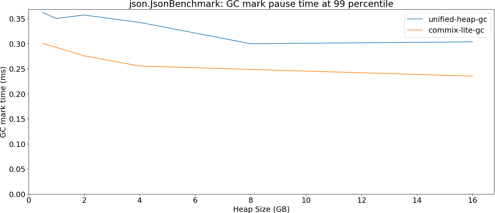

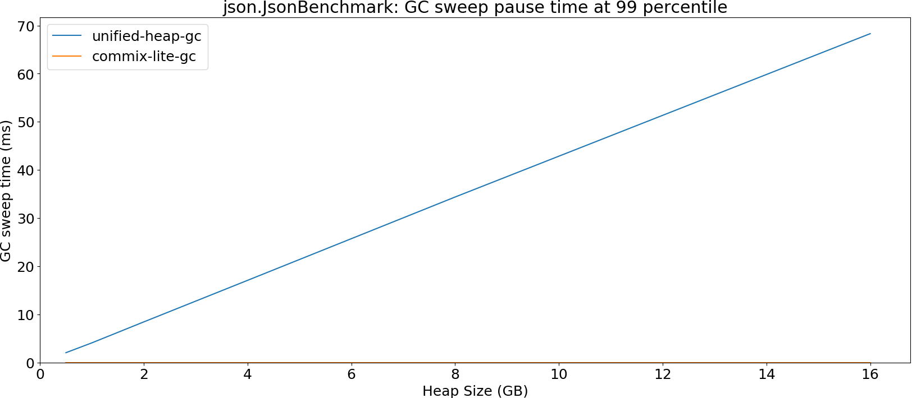

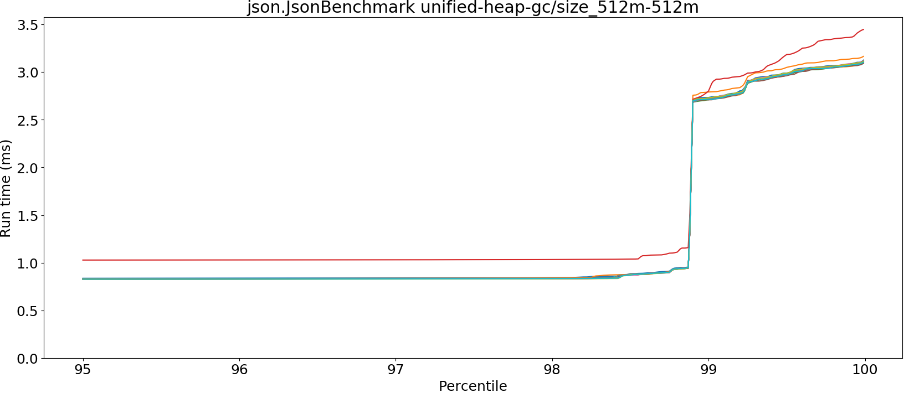

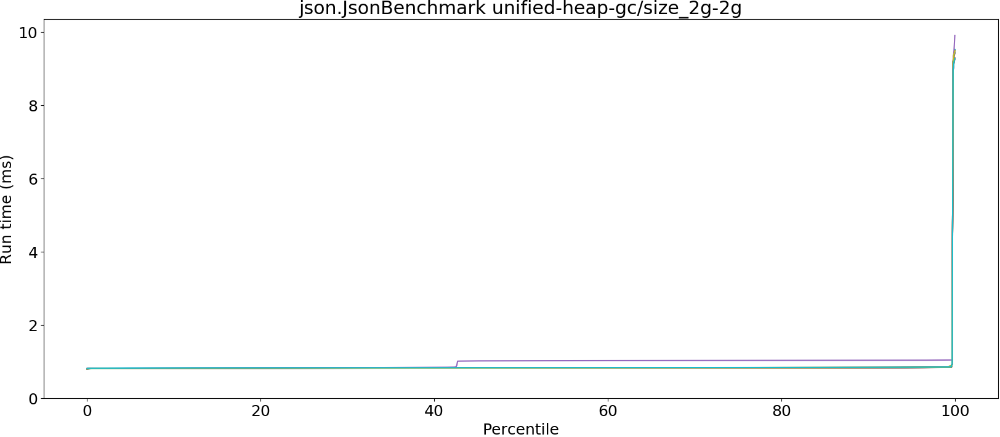

## gcbench.GCBenchBenchmark

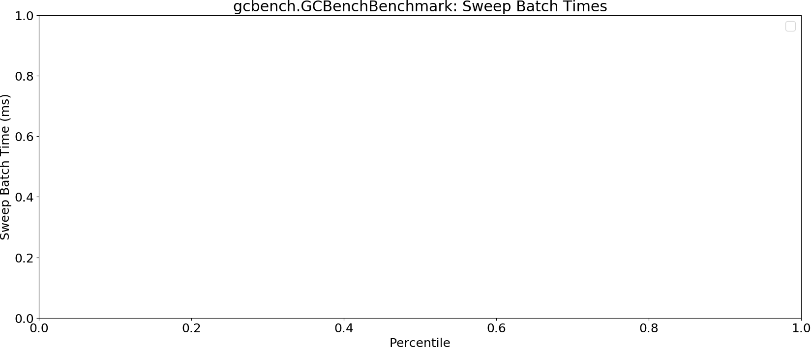

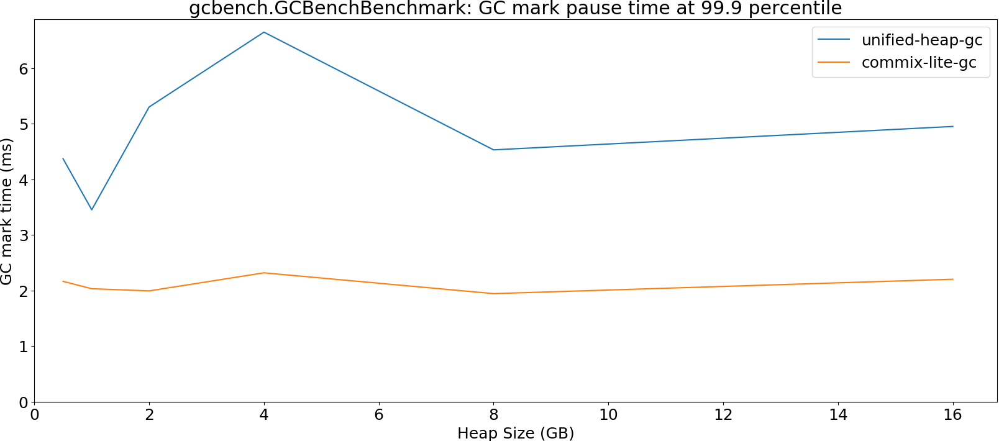

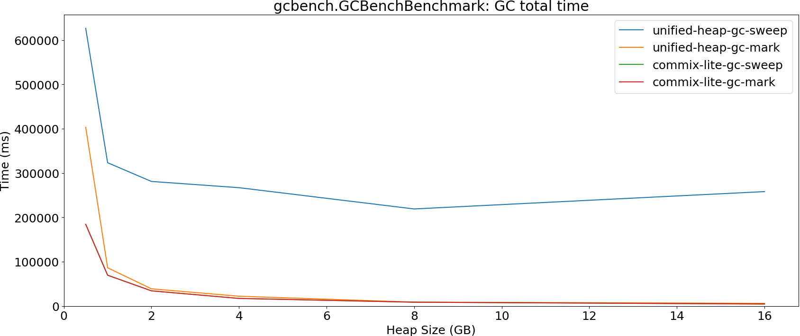

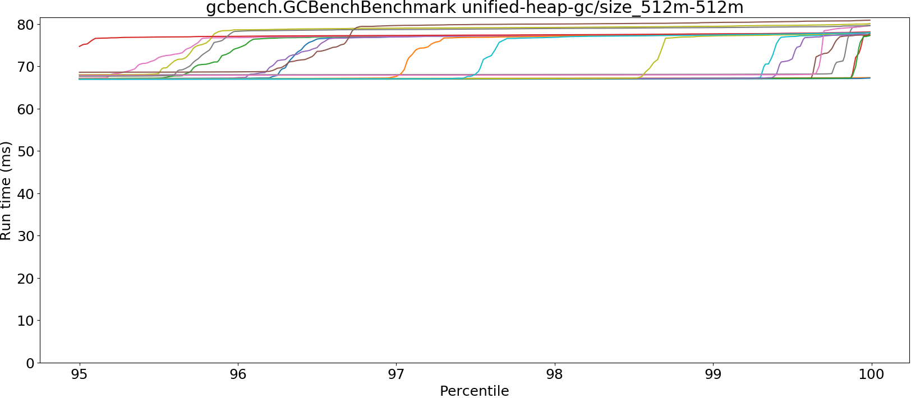

## kmeans.KmeansBenchmark

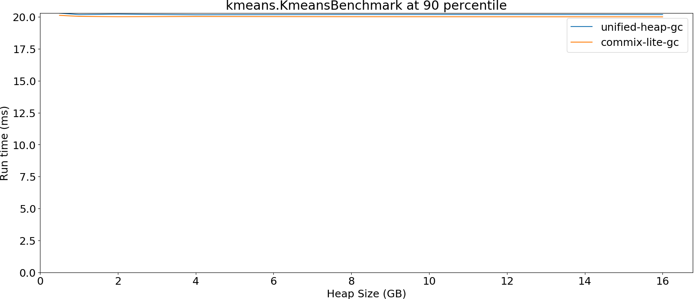

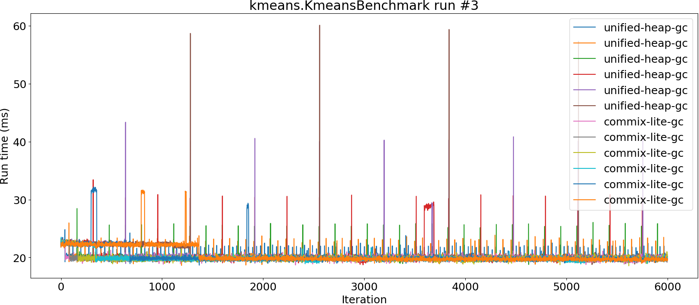

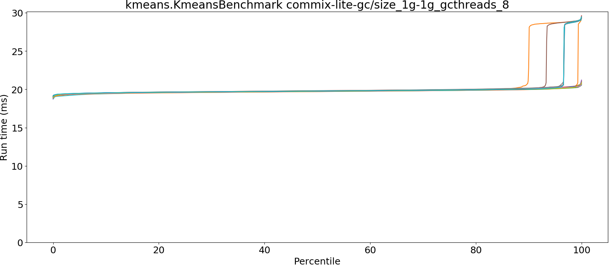

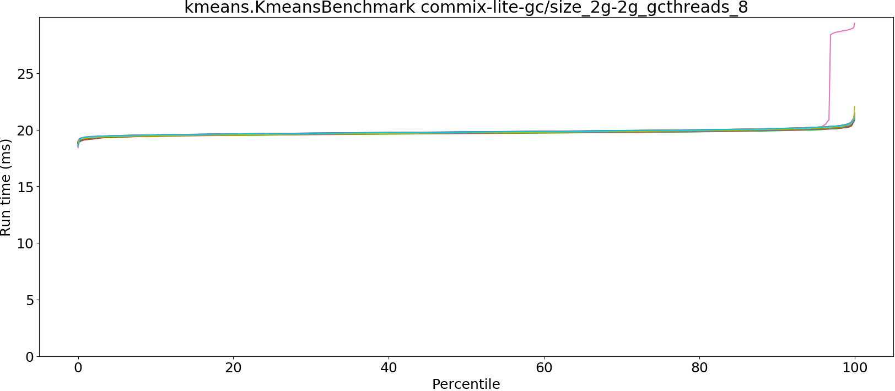

