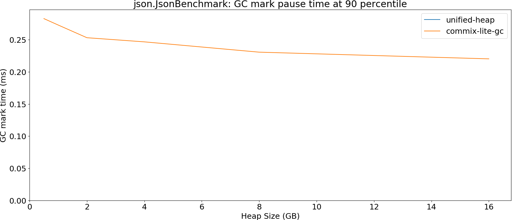
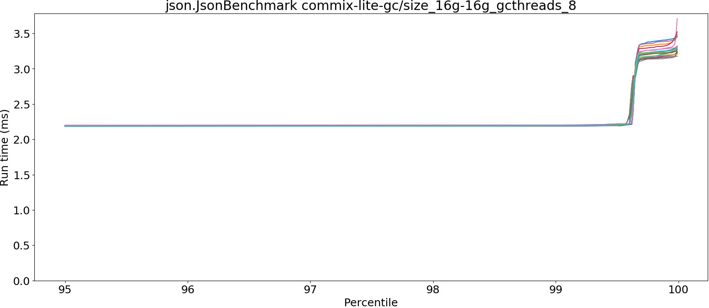
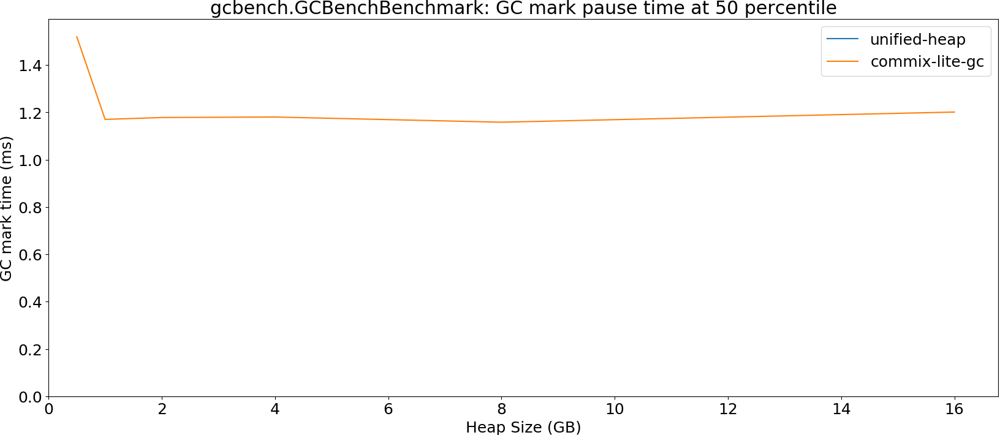
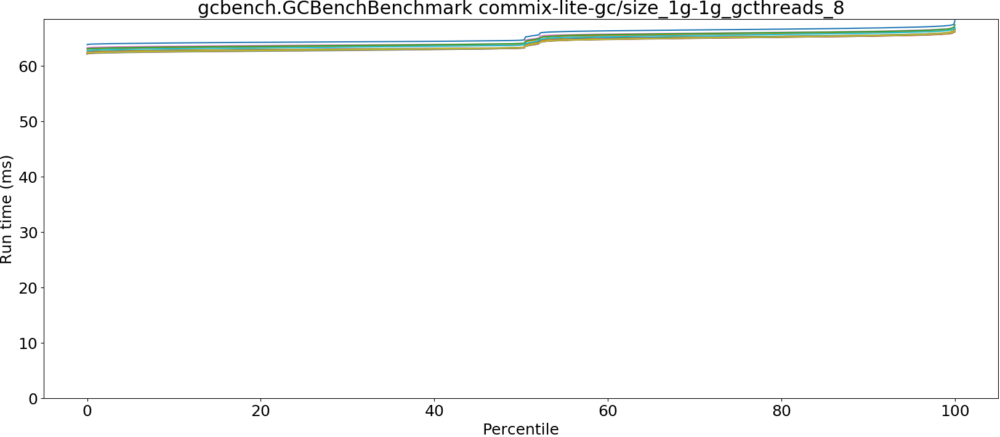
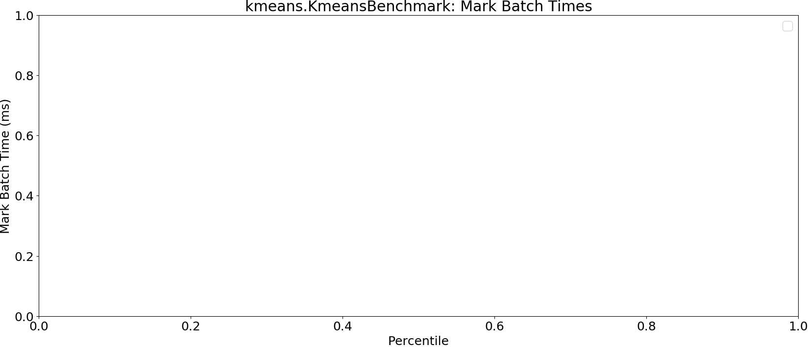
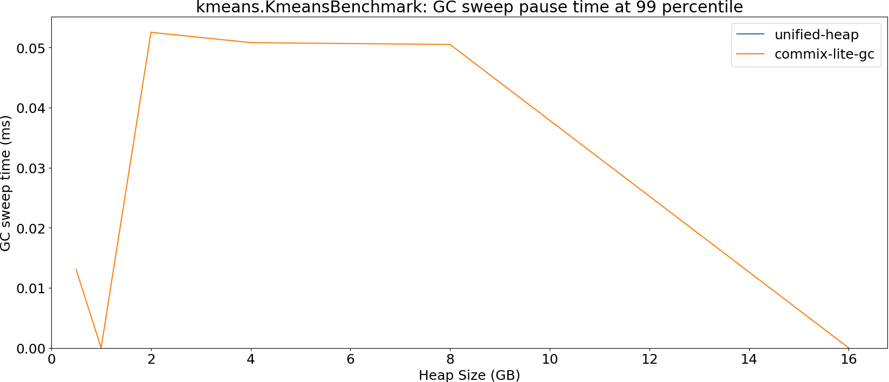

# Summary
## Benchmark run time (ms) at 50 percentile 

|name | unified-heap/size_1g-1g | commix-lite-gc/size_512m-512m_gcthreads_8 |  | commix-lite-gc/size_1g-1g_gcthreads_8 |  | commix-lite-gc/size_2g-2g_gcthreads_8 |  | commix-lite-gc/size_4g-4g_gcthreads_8 |  | commix-lite-gc/size_8g-8g_gcthreads_8 |  | commix-lite-gc/size_16g-16g_gcthreads_8 | |
| -- | -- | -- | -- | -- | -- | -- | -- | -- | -- | -- | -- | -- | -- |
|[json.JsonBenchmark](#jsonjsonbenchmark)|0.8217|0.8153|__-0.78%__|0.8272|+0.67%|0.8246|+0.35%|0.8218|+0.01%|0.8210|__-0.08%__|0.8250|+0.40%|
|[gcbench.GCBenchBenchmark](#gcbenchgcbenchbenchmark)|66.7520|63.2386|__-5.26%__|63.5452|__-4.80%__|62.4244|__-6.48%__|62.8298|__-5.88%__|62.5812|__-6.25%__|62.5783|__-6.25%__|
|[kmeans.KmeansBenchmark](#kmeanskmeansbenchmark)|19.8252|19.8202|__-0.03%__|19.7459|__-0.40%__|19.7317|__-0.47%__|19.7395|__-0.43%__|19.7174|__-0.54%__|19.7276|__-0.49%__|
| __Geometrical mean:__|| |__-2.05%__| |__-1.54%__| |__-2.25%__| |__-2.14%__| |__-2.33%__| |__-2.16%__|
## Benchmark run time (ms) at 90 percentile 

|name | unified-heap/size_1g-1g | commix-lite-gc/size_512m-512m_gcthreads_8 |  | commix-lite-gc/size_1g-1g_gcthreads_8 |  | commix-lite-gc/size_2g-2g_gcthreads_8 |  | commix-lite-gc/size_4g-4g_gcthreads_8 |  | commix-lite-gc/size_8g-8g_gcthreads_8 |  | commix-lite-gc/size_16g-16g_gcthreads_8 | |
| -- | -- | -- | -- | -- | -- | -- | -- | -- | -- | -- | -- | -- | -- |
|[json.JsonBenchmark](#jsonjsonbenchmark)|0.8304|0.8275|__-0.35%__|0.8348|+0.53%|0.8334|+0.36%|0.8308|+0.05%|0.8301|__-0.04%__|2.1854|+163.16%|
|[gcbench.GCBenchBenchmark](#gcbenchgcbenchbenchmark)|68.7047|63.5746|__-7.47%__|65.4486|__-4.74%__|66.0481|__-3.87%__|68.0078|__-1.01%__|71.4986|+4.07%|63.2909|__-7.88%__|
|[kmeans.KmeansBenchmark](#kmeanskmeansbenchmark)|20.1316|20.1213|__-0.05%__|20.0401|__-0.45%__|20.0142|__-0.58%__|20.0317|__-0.50%__|20.0155|__-0.58%__|20.0034|__-0.64%__|
| __Geometrical mean:__|| |__-2.68%__| |__-1.58%__| |__-1.38%__| |__-0.49%__| |+1.13%| |+34.05%|
## Benchmark run time (ms) at 99 percentile 

|name | unified-heap/size_1g-1g | commix-lite-gc/size_512m-512m_gcthreads_8 |  | commix-lite-gc/size_1g-1g_gcthreads_8 |  | commix-lite-gc/size_2g-2g_gcthreads_8 |  | commix-lite-gc/size_4g-4g_gcthreads_8 |  | commix-lite-gc/size_8g-8g_gcthreads_8 |  | commix-lite-gc/size_16g-16g_gcthreads_8 | |
| -- | -- | -- | -- | -- | -- | -- | -- | -- | -- | -- | -- | -- | -- |
|[json.JsonBenchmark](#jsonjsonbenchmark)|0.8394|1.3709|+63.31%|0.8656|+3.12%|0.8488|+1.11%|0.8411|+0.20%|0.8409|+0.18%|2.1930|+161.25%|
|[gcbench.GCBenchBenchmark](#gcbenchgcbenchbenchmark)|76.7014|64.4723|__-15.94%__|65.9349|__-14.04%__|66.7345|__-12.99%__|69.2449|__-9.72%__|73.8324|__-3.74%__|83.9288|+9.42%|
|[kmeans.KmeansBenchmark](#kmeanskmeansbenchmark)|22.8109|20.6063|__-9.66%__|20.6490|__-9.48%__|20.3765|__-10.67%__|20.4244|__-10.46%__|28.8016|+26.26%|20.3010|__-11.00%__|
| __Geometrical mean:__|| |+7.44%| |__-7.07%__| |__-7.72%__| |__-6.79%__| |+6.78%| |+36.51%|
## Benchmark run time (ms) at 99.9 percentile 

|name | unified-heap/size_1g-1g | commix-lite-gc/size_512m-512m_gcthreads_8 |  | commix-lite-gc/size_1g-1g_gcthreads_8 |  | commix-lite-gc/size_2g-2g_gcthreads_8 |  | commix-lite-gc/size_4g-4g_gcthreads_8 |  | commix-lite-gc/size_8g-8g_gcthreads_8 |  | commix-lite-gc/size_16g-16g_gcthreads_8 | |
| -- | -- | -- | -- | -- | -- | -- | -- | -- | -- | -- | -- | -- | -- |
|[json.JsonBenchmark](#jsonjsonbenchmark)|5.1083|1.5403|__-69.85%__|2.0321|__-60.22%__|2.8761|__-43.70%__|3.2557|__-36.27%__|3.2298|__-36.77%__|3.2391|__-36.59%__|
|[gcbench.GCBenchBenchmark](#gcbenchgcbenchbenchmark)|79.0867|69.7084|__-11.86%__|66.3393|__-16.12%__|67.0460|__-15.22%__|69.6848|__-11.89%__|82.7740|+4.66%|84.5993|+6.97%|
|[kmeans.KmeansBenchmark](#kmeanskmeansbenchmark)|23.3960|21.0383|__-10.08%__|29.0441|+24.14%|20.8683|__-10.80%__|28.8468|+23.30%|29.1089|+24.42%|22.9174|__-2.05%__|
| __Geometrical mean:__|| |__-37.94%__| |__-25.46%__| |__-24.77%__| |__-11.53%__| |__-6.27%__| |__-12.74%__|
## Benchmark total run time (ms) 

|name | unified-heap/size_1g-1g | commix-lite-gc/size_512m-512m_gcthreads_8 |  | commix-lite-gc/size_1g-1g_gcthreads_8 |  | commix-lite-gc/size_2g-2g_gcthreads_8 |  | commix-lite-gc/size_4g-4g_gcthreads_8 |  | commix-lite-gc/size_8g-8g_gcthreads_8 |  | commix-lite-gc/size_16g-16g_gcthreads_8 | |
| -- | -- | -- | -- | -- | -- | -- | -- | -- | -- | -- | -- | -- | -- |
|[json.JsonBenchmark](#jsonjsonbenchmark)|54062.8306|52997.0017|__-1.97%__|53399.6521|__-1.23%__|53173.9087|__-1.64%__|53074.7975|__-1.83%__|53037.9461|__-1.90%__|72143.0294|+33.44%|
|[gcbench.GCBenchBenchmark](#gcbenchgcbenchbenchmark)|4209062.0237|4055603.3991|__-3.65%__|4096336.7597|__-2.68%__|4036233.8474|__-4.11%__|4051133.3707|__-3.75%__|4089694.7444|__-2.84%__|4061891.0277|__-3.50%__|
|[kmeans.KmeansBenchmark](#kmeanskmeansbenchmark)|1274524.3480|1270516.6830|__-0.31%__|1276101.9217|+0.12%|1264661.1712|__-0.77%__|1275971.9220|+0.11%|1275703.8713|+0.09%|1264730.0186|__-0.77%__|
| __Geometrical mean:__|| |__-1.99%__| |__-1.27%__| |__-2.18%__| |__-1.83%__| |__-1.55%__| |+8.52%|
## Total GC time on Application thread (ms) 

|name |  | unified-heap/size_1g-1g | commix-lite-gc/size_512m-512m_gcthreads_8 |  | commix-lite-gc/size_1g-1g_gcthreads_8 |  | commix-lite-gc/size_2g-2g_gcthreads_8 |  | commix-lite-gc/size_4g-4g_gcthreads_8 |  | commix-lite-gc/size_8g-8g_gcthreads_8 |  | commix-lite-gc/size_16g-16g_gcthreads_8 | |
| -- | -- | -- | -- | -- | -- | -- | -- | -- | -- | -- | -- | -- | -- | -- |
|[json.JsonBenchmark](#jsonjsonbenchmark)|mark|0.0000|238.7450|N/A|91.4475|N/A|41.2158|N/A|23.3171|N/A|10.6579|N/A|6.9688|N/A|
||sweep|0.0000|0.0000|N/A|0.0000|N/A|0.0000|N/A|0.0000|N/A|0.0000|N/A|0.0000|N/A|
||total|0.0000|238.7450|N/A|91.4475|N/A|41.2158|N/A|23.3171|N/A|10.6579|N/A|6.9688|N/A|
|[gcbench.GCBenchBenchmark](#gcbenchgcbenchbenchmark)|mark|0.0000|184392.8152|N/A|69619.1574|N/A|34362.8315|N/A|17123.2414|N/A|8716.0633|N/A|4642.1169|N/A|
||sweep|0.0000|0.0000|N/A|0.0000|N/A|0.0000|N/A|171.2762|N/A|0.0000|N/A|0.0000|N/A|
||total|0.0000|184392.8152|N/A|69619.1574|N/A|34362.8315|N/A|17294.5176|N/A|8716.0633|N/A|4642.1169|N/A|
|[kmeans.KmeansBenchmark](#kmeanskmeansbenchmark)|mark|0.0000|1524.1836|N/A|620.6133|N/A|386.9577|N/A|151.9880|N/A|107.3787|N/A|39.1646|N/A|
||sweep|0.0000|0.0268|N/A|0.0000|N/A|0.1502|N/A|0.0508|N/A|0.0505|N/A|0.0000|N/A|
||total|0.0000|1524.2105|N/A|620.6133|N/A|387.1079|N/A|152.0388|N/A|107.4292|N/A|39.1646|N/A|
|__Geometrical mean:__|mark|| | | | | | | | | | | | |
||sweep|| | | | | | | | | | | | |
||total|| | | | | | | | | | | | |
## GC pause time (ms) at 50 percentile 

|name | unified-heap/size_1g-1g | commix-lite-gc/size_512m-512m_gcthreads_8 |  | commix-lite-gc/size_1g-1g_gcthreads_8 |  | commix-lite-gc/size_2g-2g_gcthreads_8 |  | commix-lite-gc/size_4g-4g_gcthreads_8 |  | commix-lite-gc/size_8g-8g_gcthreads_8 |  | commix-lite-gc/size_16g-16g_gcthreads_8 | |
| -- | -- | -- | -- | -- | -- | -- | -- | -- | -- | -- | -- | -- | -- |
|[json.JsonBenchmark](#jsonjsonbenchmark)|0.0000|0.1844|N/A|0.1194|N/A|0.1326|N/A|0.1435|N/A|0.1403|N/A|0.1758|N/A|
|[gcbench.GCBenchBenchmark](#gcbenchgcbenchbenchmark)|0.0000|1.5197|N/A|1.1704|N/A|1.1785|N/A|1.1731|N/A|1.1586|N/A|1.2015|N/A|
|[kmeans.KmeansBenchmark](#kmeanskmeansbenchmark)|0.0000|0.5866|N/A|0.4409|N/A|0.5969|N/A|0.4452|N/A|0.6886|N/A|0.4850|N/A|
| __Geometrical mean:__|| | | | | | | | | | | | |
## GC pause time (ms) at 90 percentile 

|name | unified-heap/size_1g-1g | commix-lite-gc/size_512m-512m_gcthreads_8 |  | commix-lite-gc/size_1g-1g_gcthreads_8 |  | commix-lite-gc/size_2g-2g_gcthreads_8 |  | commix-lite-gc/size_4g-4g_gcthreads_8 |  | commix-lite-gc/size_8g-8g_gcthreads_8 |  | commix-lite-gc/size_16g-16g_gcthreads_8 | |
| -- | -- | -- | -- | -- | -- | -- | -- | -- | -- | -- | -- | -- | -- |
|[json.JsonBenchmark](#jsonjsonbenchmark)|0.0000|0.2828|N/A|0.2728|N/A|0.2531|N/A|0.2466|N/A|0.2306|N/A|0.2202|N/A|
|[gcbench.GCBenchBenchmark](#gcbenchgcbenchbenchmark)|0.0000|1.6677|N/A|1.4728|N/A|1.4380|N/A|1.4900|N/A|1.4458|N/A|1.6906|N/A|
|[kmeans.KmeansBenchmark](#kmeanskmeansbenchmark)|0.0000|0.7633|N/A|0.4722|N/A|0.7698|N/A|0.5143|N/A|0.8406|N/A|0.5655|N/A|
| __Geometrical mean:__|| | | | | | | | | | | | |
## GC pause time (ms) at 99 percentile 

|name | unified-heap/size_1g-1g | commix-lite-gc/size_512m-512m_gcthreads_8 |  | commix-lite-gc/size_1g-1g_gcthreads_8 |  | commix-lite-gc/size_2g-2g_gcthreads_8 |  | commix-lite-gc/size_4g-4g_gcthreads_8 |  | commix-lite-gc/size_8g-8g_gcthreads_8 |  | commix-lite-gc/size_16g-16g_gcthreads_8 | |
| -- | -- | -- | -- | -- | -- | -- | -- | -- | -- | -- | -- | -- | -- |
|[json.JsonBenchmark](#jsonjsonbenchmark)|0.0000|0.3004|N/A|0.2926|N/A|0.2756|N/A|0.2553|N/A|0.2486|N/A|0.2352|N/A|
|[gcbench.GCBenchBenchmark](#gcbenchgcbenchbenchmark)|0.0000|1.8795|N/A|1.7432|N/A|1.7343|N/A|2.0636|N/A|1.7226|N/A|1.9849|N/A|
|[kmeans.KmeansBenchmark](#kmeanskmeansbenchmark)|0.0000|0.8076|N/A|0.5181|N/A|0.8649|N/A|0.7414|N/A|1.4413|N/A|0.5881|N/A|
| __Geometrical mean:__|| | | | | | | | | | | | |
## GC pause time (ms) at 99.9 percentile 

|name | unified-heap/size_1g-1g | commix-lite-gc/size_512m-512m_gcthreads_8 |  | commix-lite-gc/size_1g-1g_gcthreads_8 |  | commix-lite-gc/size_2g-2g_gcthreads_8 |  | commix-lite-gc/size_4g-4g_gcthreads_8 |  | commix-lite-gc/size_8g-8g_gcthreads_8 |  | commix-lite-gc/size_16g-16g_gcthreads_8 | |
| -- | -- | -- | -- | -- | -- | -- | -- | -- | -- | -- | -- | -- | -- |
|[json.JsonBenchmark](#jsonjsonbenchmark)|0.0000|0.3327|N/A|0.2962|N/A|0.2901|N/A|0.2570|N/A|0.2504|N/A|0.2398|N/A|
|[gcbench.GCBenchBenchmark](#gcbenchgcbenchbenchmark)|0.0000|2.1645|N/A|2.0318|N/A|1.9928|N/A|2.3175|N/A|1.9435|N/A|2.2021|N/A|
|[kmeans.KmeansBenchmark](#kmeanskmeansbenchmark)|0.0000|0.9462|N/A|0.5493|N/A|1.4358|N/A|0.9326|N/A|1.4812|N/A|0.6010|N/A|
| __Geometrical mean:__|| | | | | | | | | | | | |
# Individual benchmarks
## json.JsonBenchmark

## gcbench.GCBenchBenchmark

## kmeans.KmeansBenchmark

