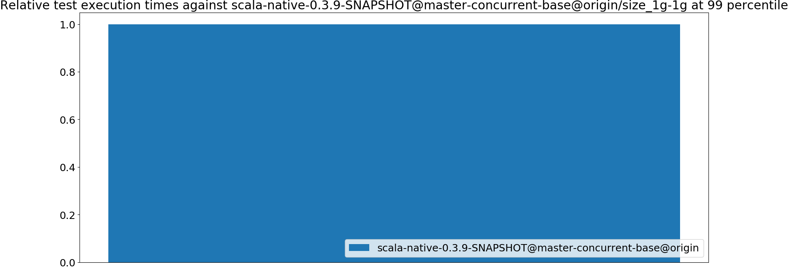
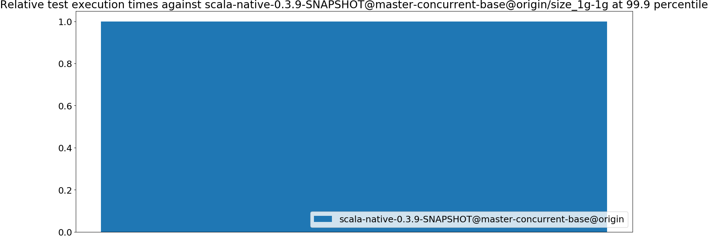
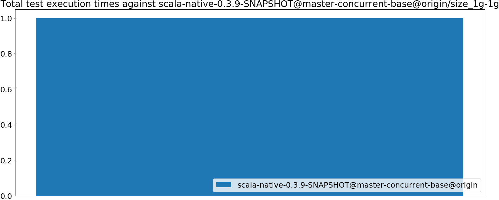
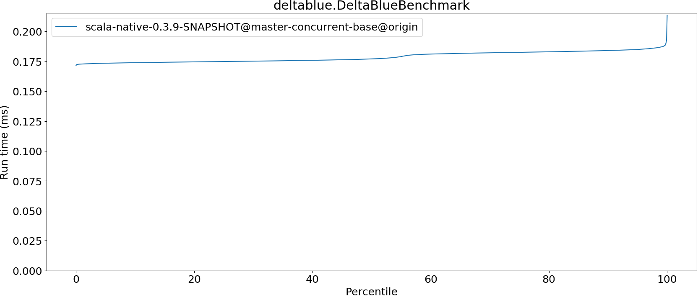
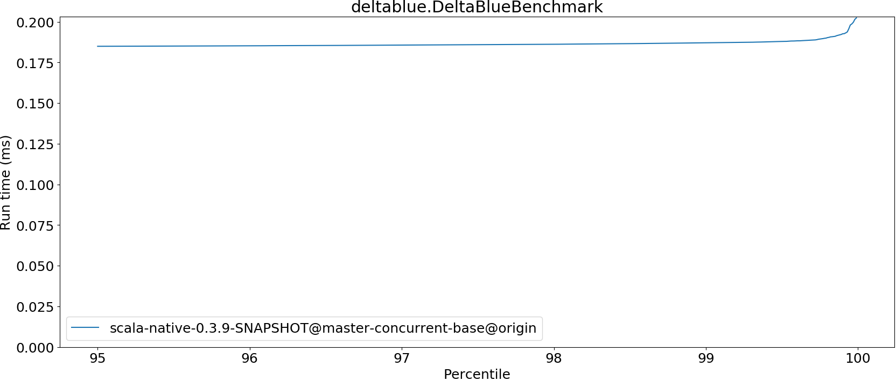
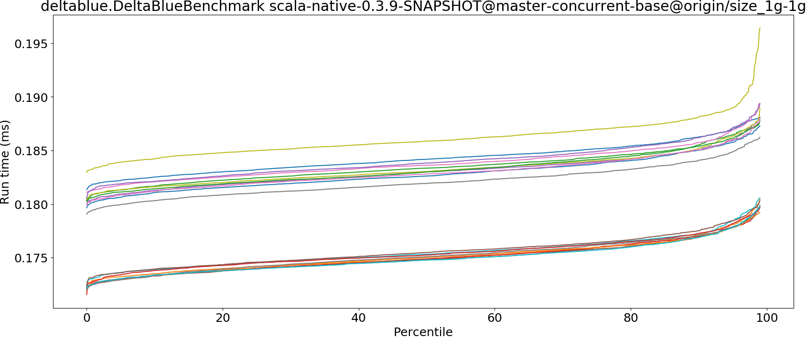
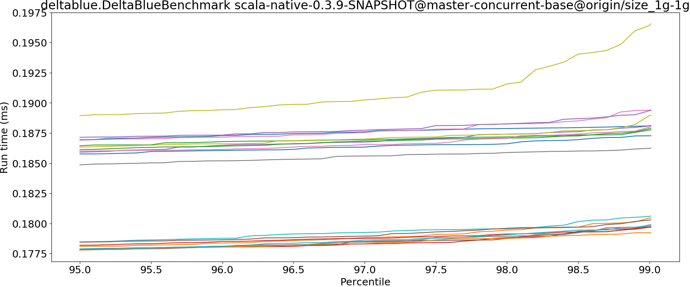

# Summary
## Benchmark run time (ms) at 50 percentile 

|name | scala-native-0.3.9-SNAPSHOT@master-concurrent-base@origin/size_1g-1g|
| -- | -- |
|[deltablue.DeltaBlueBenchmark](#deltabluedeltabluebenchmark)|0.1770|
| __Geometrical mean:__||
## Benchmark run time (ms) at 90 percentile 

|name | scala-native-0.3.9-SNAPSHOT@master-concurrent-base@origin/size_1g-1g|
| -- | -- |
|[deltablue.DeltaBlueBenchmark](#deltabluedeltabluebenchmark)|0.1841|
| __Geometrical mean:__||
## Benchmark run time (ms) at 99 percentile 

|name | scala-native-0.3.9-SNAPSHOT@master-concurrent-base@origin/size_1g-1g|
| -- | -- |
|[deltablue.DeltaBlueBenchmark](#deltabluedeltabluebenchmark)|0.1872|
| __Geometrical mean:__||
## Benchmark run time (ms) at 99.9 percentile 

|name | scala-native-0.3.9-SNAPSHOT@master-concurrent-base@origin/size_1g-1g|
| -- | -- |
|[deltablue.DeltaBlueBenchmark](#deltabluedeltabluebenchmark)|0.1923|
| __Geometrical mean:__||
## Benchmark total run time (ms) 

|name | scala-native-0.3.9-SNAPSHOT@master-concurrent-base@origin/size_1g-1g|
| -- | -- |
|[deltablue.DeltaBlueBenchmark](#deltabluedeltabluebenchmark)|2858.8146|
| __Geometrical mean:__||
# Individual benchmarks
## deltablue.DeltaBlueBenchmark

